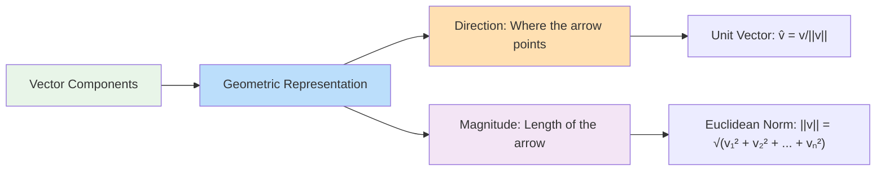
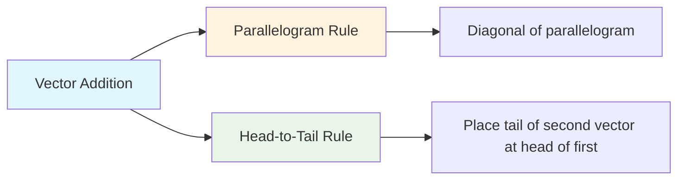
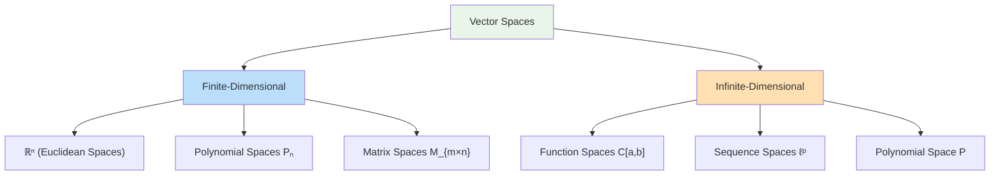
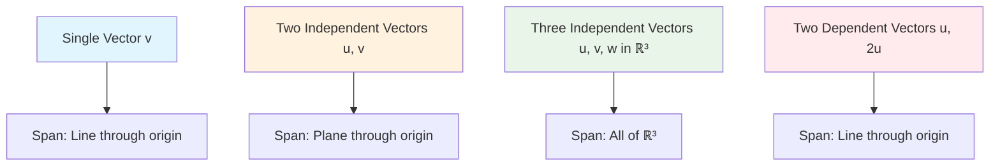
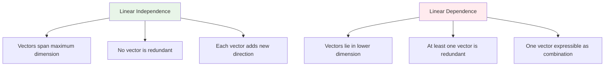
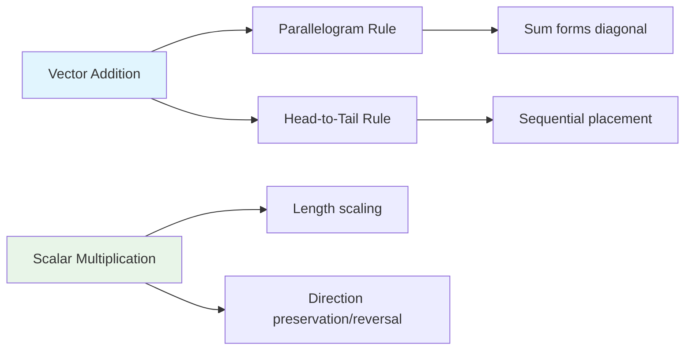

# C-0: Linear Algebra Fundamentals

1. Vector Fundamentals
    - Mathematical Definition and Core Properties
    - Notational Conventions
    - Geometric Interpretation
    - Magnitude and Direction
    - Component Representation
2. Vector Operations and Properties
    - Vector Addition and Subtraction
    - Scalar Multiplication
    - Dot Product and Cross Product
    - Vector Norms and Distance
    - Orthogonality and Projection
3. Vector Spaces: Axiomatic Framework
    - Formal Definition and Axioms
    - Closure Properties
    - Examples Beyond Euclidean Space
    - Subspaces and Their Properties
    - Vector Space Homomorphisms
4. Linear Combinations and Span
    - Linear Combination Definition
    - Span of Vector Sets
    - Computational Span Determination
    - Geometric Interpretation of Span
    - Spanning Sets and Generation
5. Linear Independence and Dependence
    - Independence Criteria
    - Dependency Relationships
    - Computational Testing Methods
    - Geometric Understanding
    - Maximal Independent Sets
6. Basis and Dimension Theory
    - Basis Definition and Properties
    - Standard Basis Vectors
    - Change of Basis Operations
    - Dimension as Basis Cardinality
    - Coordinate Representations
7. Matrix Representations
    - Matrix-Vector Multiplication
    - Linear Transformations as Matrices
    - Matrix Operations and Properties
    - Transpose and Inverse Operations
    - Geometric Matrix Interpretations
8. Linear Transformations
    - Transformation Definition
    - Basis Vector Transformations
    - Matrix Multiplication as Transformation
    - Composition of Transformations
    - Applications in Graphics and Physics

---

# C-0: Linear Algebra Fundamentals

## Vector Fundamentals

### Mathematical Definition and Core Properties

A **vector** is a mathematical object characterized by two fundamental properties: **magnitude** (size or length) and
**direction**. Unlike scalars, which possess only magnitude, vectors encode both quantitative and directional
information.

**Formal Definition**: A vector $\vec{v}$ in $n$-dimensional real space is an ordered $n$-tuple:
$$\vec{v} = (v_1, v_2, v_3, \ldots, v_n) \in \mathbb{R}^n$$

where each $v_i \in \mathbb{R}$ is called a **component** or **coordinate** of the vector.

**Fundamental Properties**:

- **Dimensionality**: The number of components determines the vector's dimension
- **Uniqueness**: Each vector is uniquely determined by its components
- **Order significance**: The sequence of components matters: $(3, 2) \neq (2, 3)$

### Notational Conventions

**Standard Notation Systems**:

- **Arrow notation**: $\vec{v}$, $\vec{u}$, $\vec{w}$ (most common in physics and engineering)
- **Bold notation**: $\mathbf{v}$, $\mathbf{u}$, $\mathbf{w}$ (common in printed mathematics)
- **Component form**: $(v_1, v_2, \ldots, v_n)$ or $\langle v_1, v_2, \ldots, v_n \rangle$

**Matrix Representations**:

- **Column vector**: $\begin{bmatrix} v_1 \\ v_2 \\ \vdots \\ v_n \end{bmatrix}$
- **Row vector**: $\begin{bmatrix} v_1 & v_2 & \cdots & v_n \end{bmatrix}$

**Dimensional Classifications**:

- **2D vectors**: $\vec{v} = (v_1, v_2) \in \mathbb{R}^2$
- **3D vectors**: $\vec{v} = (v_1, v_2, v_3) \in \mathbb{R}^3$
- **n-dimensional vectors**: $\vec{v} = (v_1, v_2, \ldots, v_n) \in \mathbb{R}^n$

### Geometric Interpretation

Vectors have natural geometric interpretations as directed line segments or arrows in space.

**Position Vector**: A vector from the origin to a point P represents the position of that point:
$$\vec{OP} = (x, y, z)$$

**Displacement Vector**: A vector from point A to point B represents displacement:
$$\vec{AB} = B - A = (b_1 - a_1, b_2 - a_2, b_3 - a_3)$$

### Magnitude and Direction

**Magnitude (Euclidean Norm)**: The length of a vector is calculated using the Pythagorean theorem extended to $n$
dimensions: $$|\vec{v}| = \|\vec{v}\| = \sqrt{v_1^2 + v_2^2 + \cdots + v_n^2} = \sqrt{\sum_{i=1}^{n} v_i^2}$$

**Numerical Example**: For $\vec{v} = (3, 4, 12)$:
$$|\vec{v}| = \sqrt{3^2 + 4^2 + 12^2} = \sqrt{9 + 16 + 144} = \sqrt{169} = 13$$

**Direction (Unit Vector)**: A unit vector has magnitude 1 and indicates direction only:
$$\hat{v} = \frac{\vec{v}}{|\vec{v}|}$$

Continuing the example: $$\hat{v} = \frac{(3, 4, 12)}{13} = \left(\frac{3}{13}, \frac{4}{13}, \frac{12}{13}\right)$$

**Verification**:
$|\hat{v}| = \sqrt{\left(\frac{3}{13}\right)^2 + \left(\frac{4}{13}\right)^2 + \left(\frac{12}{13}\right)^2} = \sqrt{\frac{169}{169}} = 1$

### Component Representation

**Coordinate System Dependence**: Vector components depend on the chosen coordinate system (basis).

**Standard Basis Vectors**:

- **2D**: $\hat{i} = (1, 0)$, $\hat{j} = (0, 1)$
- **3D**: $\hat{i} = (1, 0, 0)$, $\hat{j} = (0, 1, 0)$, $\hat{k} = (0, 0, 1)$

**Component Decomposition**: Any vector can be expressed as: $$\vec{v} = v_1\hat{i} + v_2\hat{j} + v_3\hat{k}$$

**Example**: $\vec{v} = (5, -2, 7) = 5\hat{i} - 2\hat{j} + 7\hat{k}$

---

## Vector Operations and Properties

### Vector Addition and Subtraction

**Vector Addition**: For vectors $\vec{u} = (u_1, u_2, \ldots, u_n)$ and $\vec{v} = (v_1, v_2, \ldots, v_n)$:
$$\vec{u} + \vec{v} = (u_1 + v_1, u_2 + v_2, \ldots, u_n + v_n)$$

**Vector Subtraction**: $$\vec{u} - \vec{v} = (u_1 - v_1, u_2 - v_2, \ldots, u_n - v_n)$$

**Numerical Example**: Let $\vec{u} = (3, -1, 4)$ and $\vec{v} = (2, 5, -3)$

Addition: $\vec{u} + \vec{v} = (3+2, -1+5, 4+(-3)) = (5, 4, 1)$ Subtraction:
$\vec{u} - \vec{v} = (3-2, -1-5, 4-(-3)) = (1, -6, 7)$

**Geometric Interpretation**:

**Properties of Vector Addition**:

1. **Commutativity**: $\vec{u} + \vec{v} = \vec{v} + \vec{u}$
2. **Associativity**: $(\vec{u} + \vec{v}) + \vec{w} = \vec{u} + (\vec{v} + \vec{w})$
3. **Identity**: $\vec{v} + \vec{0} = \vec{v}$ where $\vec{0} = (0, 0, \ldots, 0)$
4. **Inverse**: $\vec{v} + (-\vec{v}) = \vec{0}$ where $-\vec{v} = (-v_1, -v_2, \ldots, -v_n)$

### Scalar Multiplication

**Definition**: For scalar $c \in \mathbb{R}$ and vector $\vec{v} = (v_1, v_2, \ldots, v_n)$:
$$c\vec{v} = (cv_1, cv_2, \ldots, cv_n)$$

**Effects on Vector Properties**:

- **Magnitude**: $|c\vec{v}| = |c| \cdot |\vec{v}|$
- **Direction**:
    - If $c > 0$: Direction unchanged
    - If $c < 0$: Direction reversed
    - If $c = 0$: Results in zero vector

**Numerical Example**: For $\vec{v} = (2, -3, 1)$ and $c = -3$: $$c\vec{v} = -3(2, -3, 1) = (-6, 9, -3)$$

Verification of magnitude: $|-3\vec{v}| = |(-6, 9, -3)| = \sqrt{36 + 81 + 9} = \sqrt{126}$ And
$|-3| \cdot |\vec{v}| = 3 \cdot \sqrt{4 + 9 + 1} = 3\sqrt{14} = \sqrt{126}$ ✓

**Algebraic Properties**:

1. **Distributivity (vector)**: $c(\vec{u} + \vec{v}) = c\vec{u} + c\vec{v}$
2. **Distributivity (scalar)**: $(c + d)\vec{v} = c\vec{v} + d\vec{v}$
3. **Associativity**: $(cd)\vec{v} = c(d\vec{v})$
4. **Identity**: $1 \cdot \vec{v} = \vec{v}$

### Dot Product and Cross Product

#### Dot Product (Inner Product)

**Definition**: For vectors $\vec{u} = (u_1, u_2, \ldots, u_n)$ and $\vec{v} = (v_1, v_2, \ldots, v_n)$:
$$\vec{u} \cdot \vec{v} = u_1v_1 + u_2v_2 + \cdots + u_nv_n = \sum_{i=1}^{n} u_iv_i$$

**Geometric Formula**: $$\vec{u} \cdot \vec{v} = |\vec{u}||\vec{v}|\cos\theta$$ where $\theta$ is the angle between
vectors $\vec{u}$ and $\vec{v}$.

**Numerical Example**: For $\vec{u} = (2, 3, -1)$ and $\vec{v} = (1, -2, 4)$:
$$\vec{u} \cdot \vec{v} = (2)(1) + (3)(-2) + (-1)(4) = 2 - 6 - 4 = -8$$

**Properties of Dot Product**:

1. **Commutativity**: $\vec{u} \cdot \vec{v} = \vec{v} \cdot \vec{u}$
2. **Distributivity**: $\vec{u} \cdot (\vec{v} + \vec{w}) = \vec{u} \cdot \vec{v} + \vec{u} \cdot \vec{w}$
3. **Scalar associativity**: $(c\vec{u}) \cdot \vec{v} = c(\vec{u} \cdot \vec{v})$
4. **Positive definiteness**: $\vec{v} \cdot \vec{v} \geq 0$, with equality iff $\vec{v} = \vec{0}$

**Applications**:

- **Magnitude**: $|\vec{v}| = \sqrt{\vec{v} \cdot \vec{v}}$
- **Angle calculation**: $\cos\theta = \frac{\vec{u} \cdot \vec{v}}{|\vec{u}||\vec{v}|}$
- **Orthogonality test**: $\vec{u} \perp \vec{v} \Leftrightarrow \vec{u} \cdot \vec{v} = 0$

#### Cross Product (Vector Product)

**Definition**: For 3D vectors $\vec{u} = (u_1, u_2, u_3)$ and $\vec{v} = (v_1, v_2, v_3)$:
$$\vec{u} \times \vec{v} = (u_2v_3 - u_3v_2, u_3v_1 - u_1v_3, u_1v_2 - u_2v_1)$$

**Determinant Form**:

$$
\vec{u} \times \vec{v} = \begin{vmatrix}
\hat{i} & \hat{j} & \hat{k} \\
u_1 & u_2 & u_3 \\
v_1 & v_2 & v_3
\end{vmatrix}
$$

**Numerical Example**: For $\vec{u} = (1, 2, 3)$ and $\vec{v} = (4, 5, 6)$:

$$
\vec{u} \times \vec{v} = \begin{vmatrix}
\hat{i} & \hat{j} & \hat{k} \\
1 & 2 & 3 \\
4 & 5 & 6
\end{vmatrix}
$$

$$= \hat{i}(2 \cdot 6 - 3 \cdot 5) - \hat{j}(1 \cdot 6 - 3 \cdot 4) + \hat{k}(1 \cdot 5 - 2 \cdot 4)$$
$$= \hat{i}(12 - 15) - \hat{j}(6 - 12) + \hat{k}(5 - 8)$$ $$= -3\hat{i} + 6\hat{j} - 3\hat{k} = (-3, 6, -3)$$

**Properties of Cross Product**:

1. **Anti-commutativity**: $\vec{u} \times \vec{v} = -(\vec{v} \times \vec{u})$
2. **Distributivity**: $\vec{u} \times (\vec{v} + \vec{w}) = \vec{u} \times \vec{v} + \vec{u} \times \vec{w}$
3. **Scalar associativity**: $(c\vec{u}) \times \vec{v} = c(\vec{u} \times \vec{v})$
4. **Orthogonality**: $(\vec{u} \times \vec{v}) \perp \vec{u}$ and $(\vec{u} \times \vec{v}) \perp \vec{v}$

**Geometric Interpretation**:

- **Magnitude**: $|\vec{u} \times \vec{v}| = |\vec{u}||\vec{v}|\sin\theta$ (area of parallelogram)
- **Direction**: Right-hand rule determines orientation
- **Parallel vectors**: $\vec{u} \times \vec{v} = \vec{0}$ when $\vec{u} \parallel \vec{v}$

### Vector Norms and Distance

#### Vector Norms

**p-Norm Family**: For $p \geq 1$: $$\|\vec{v}\|_p = \left(\sum_{i=1}^{n} |v_i|^p\right)^{1/p}$$

**Common Norms**:

1. **L₁ norm (Manhattan norm)**: $$\|\vec{v}\|_1 = \sum_{i=1}^{n} |v_i|$$

2. **L₂ norm (Euclidean norm)**: $$\|\vec{v}\|_2 = \sqrt{\sum_{i=1}^{n} v_i^2}$$

3. **L∞ norm (Maximum norm)**: $$\|\vec{v}\|_\infty = \max_{1 \leq i \leq n} |v_i|$$

**Numerical Example**: For $\vec{v} = (3, -4, 2)$:

- $\|\vec{v}\|_1 = |3| + |-4| + |2| = 9$
- $\|\vec{v}\|_2 = \sqrt{3^2 + (-4)^2 + 2^2} = \sqrt{29} \approx 5.39$
- $\|\vec{v}\|_\infty = \max\{|3|, |-4|, |2|\} = 4$

#### Distance Metrics

**Distance between vectors** $\vec{u}$ and $\vec{v}$: $$d(\vec{u}, \vec{v}) = \|\vec{u} - \vec{v}\|$$

**Euclidean Distance**: $$d_2(\vec{u}, \vec{v}) = \sqrt{\sum_{i=1}^{n} (u_i - v_i)^2}$$

**Manhattan Distance**: $$d_1(\vec{u}, \vec{v}) = \sum_{i=1}^{n} |u_i - v_i|$$

### Orthogonality and Projection

#### Orthogonality

**Definition**: Vectors $\vec{u}$ and $\vec{v}$ are **orthogonal** (perpendicular) if: $$\vec{u} \cdot \vec{v} = 0$$

**Orthogonal Set**: A set of vectors $\{\vec{v_1}, \vec{v_2}, \ldots, \vec{v_k}\}$ is orthogonal if:
$$\vec{v_i} \cdot \vec{v_j} = 0 \text{ for all } i \neq j$$

**Orthonormal Set**: An orthogonal set where each vector has unit length:

$$
\vec{v_i} \cdot \vec{v_j} = \delta_{ij} = \begin{cases}
1 & \text{if } i = j \\
0 & \text{if } i \neq j
\end{cases}
$$

#### Vector Projection

**Scalar Projection** of $\vec{v}$ onto $\vec{u}$:
$$\text{comp}_{\vec{u}} \vec{v} = \frac{\vec{v} \cdot \vec{u}}{|\vec{u}|}$$

**Vector Projection** of $\vec{v}$ onto $\vec{u}$:
$$\text{proj}_{\vec{u}} \vec{v} = \frac{\vec{v} \cdot \vec{u}}{|\vec{u}|^2} \vec{u} = \frac{\vec{v} \cdot \vec{u}}{\vec{u} \cdot \vec{u}} \vec{u}$$

**Numerical Example**: Project $\vec{v} = (3, 4)$ onto $\vec{u} = (1, 1)$:

First, calculate the dot product: $\vec{v} \cdot \vec{u} = 3(1) + 4(1) = 7$ Next, calculate:
$\vec{u} \cdot \vec{u} = 1^2 + 1^2 = 2$

Therefore: $$\text{proj}_{\vec{u}} \vec{v} = \frac{7}{2}(1, 1) = \left(\frac{7}{2}, \frac{7}{2}\right)$$

**Orthogonal Component**:
$$\vec{v} - \text{proj}_{\vec{u}} \vec{v} = (3, 4) - \left(\frac{7}{2}, \frac{7}{2}\right) = \left(-\frac{1}{2}, \frac{1}{2}\right)$$

**Verification**: The orthogonal component should be perpendicular to $\vec{u}$:
$$\left(-\frac{1}{2}, \frac{1}{2}\right) \cdot (1, 1) = -\frac{1}{2} + \frac{1}{2} = 0$$ ✓

---

## Vector Spaces: Axiomatic Framework

### Formal Definition and Axioms

A **vector space** (or linear space) $V$ over a field $\mathbb{F}$ (typically $\mathbb{R}$ or $\mathbb{C}$) is a
non-empty set equipped with two operations:

- **Vector addition**: $+ : V \times V \to V$
- **Scalar multiplication**: $\cdot : \mathbb{F} \times V \to V$

These operations must satisfy eight fundamental axioms:

**Addition Axioms**:

1. **Closure**: $\forall \vec{u}, \vec{v} \in V: \vec{u} + \vec{v} \in V$
2. **Commutativity**: $\forall \vec{u}, \vec{v} \in V: \vec{u} + \vec{v} = \vec{v} + \vec{u}$
3. **Associativity**:
   $\forall \vec{u}, \vec{v}, \vec{w} \in V: (\vec{u} + \vec{v}) + \vec{w} = \vec{u} + (\vec{v} + \vec{w})$
4. **Additive identity**: $\exists \vec{0} \in V$ such that $\forall \vec{v} \in V: \vec{v} + \vec{0} = \vec{v}$
5. **Additive inverse**: $\forall \vec{v} \in V, \exists (-\vec{v}) \in V: \vec{v} + (-\vec{v}) = \vec{0}$

**Scalar Multiplication Axioms**: 6. **Closure**: $\forall c \in \mathbb{F}, \forall \vec{v} \in V: c\vec{v} \in V$ 7.
**Distributivity over vector addition**:
$\forall c \in \mathbb{F}, \forall \vec{u}, \vec{v} \in V: c(\vec{u} + \vec{v}) = c\vec{u} + c\vec{v}$ 8.
**Distributivity over scalar addition**:
$\forall c, d \in \mathbb{F}, \forall \vec{v} \in V: (c + d)\vec{v} = c\vec{v} + d\vec{v}$

**Additional Requirements**:

- **Scalar associativity**: $\forall c, d \in \mathbb{F}, \forall \vec{v} \in V: (cd)\vec{v} = c(d\vec{v})$
- **Scalar identity**: $\forall \vec{v} \in V: 1 \cdot \vec{v} = \vec{v}$

### Closure Properties

**Closure under Addition**: If we take any two vectors from the space and add them, the result must also be in the
space.

**Example Verification in $\mathbb{R}^2$**: Take $\vec{u} = (2, 3)$ and $\vec{v} = (-1, 4)$ Their sum:
$\vec{u} + \vec{v} = (1, 7)$ Since $(1, 7)$ is a valid 2D vector with real components, closure is satisfied.

**Closure under Scalar Multiplication**: If we take any vector from the space and multiply it by any scalar, the result
must remain in the space.

**Example**: Take $\vec{v} = (3, -2)$ and scalar $c = -\frac{1}{2}$ Result:
$c\vec{v} = -\frac{1}{2}(3, -2) = \left(-\frac{3}{2}, 1\right)$ This remains in $\mathbb{R}^2$.

### Examples Beyond Euclidean Space

#### Polynomial Vector Spaces

**Space $\mathcal{P}_n$**: Polynomials of degree at most $n$:
$$p(x) = a_0 + a_1x + a_2x^2 + \cdots + a_nx^n \text{ where } a_i \in \mathbb{R}$$

**Operations**:

- Addition: $(p + q)(x) = p(x) + q(x)$
- Scalar multiplication: $(cp)(x) = c \cdot p(x)$
- Zero element: $0(x) = 0$ for all $x$

**Example in $\mathcal{P}_2$**: $p(x) = 2 + 3x - x^2$ and $q(x) = 1 - 2x + 4x^2$ $(p + q)(x) = 3 + x + 3x^2$
$3p(x) = 6 + 9x - 3x^2$

#### Matrix Vector Spaces

**Space $M_{m \times n}(\mathbb{R})$**: All $m \times n$ matrices with real entries.

**Example in $M_{2 \times 2}$**:
$$A = \begin{bmatrix} 1 & 2 \\ 3 & 4 \end{bmatrix}, \quad B = \begin{bmatrix} 5 & 6 \\ 7 & 8 \end{bmatrix}$$

Addition: $A + B = \begin{bmatrix} 6 & 8 \\ 10 & 12 \end{bmatrix}$

Scalar multiplication: $2A = \begin{bmatrix} 2 & 4 \\ 6 & 8 \end{bmatrix}$

Zero matrix: $\mathbf{0} = \begin{bmatrix} 0 & 0 \\ 0 & 0 \end{bmatrix}$

#### Function Vector Spaces

**Space $C[a,b]$**: Continuous real-valued functions on interval $[a,b]$.

**Operations**:

- Addition: $(f + g)(x) = f(x) + g(x)$
- Scalar multiplication: $(cf)(x) = c \cdot f(x)$
- Zero function: $0(x) = 0$ for all $x \in [a,b]$

**Example**: $f(x) = x^2$, $g(x) = \sin(x)$, $c = 3$ $(f + g)(x) = x^2 + \sin(x)$ $(cf)(x) = 3x^2$

### Subspaces and Their Properties

**Definition**: A subset $W \subseteq V$ is a **subspace** of vector space $V$ if:

1. $\vec{0} \in W$ (contains the zero vector)
2. $\vec{u}, \vec{v} \in W \Rightarrow \vec{u} + \vec{v} \in W$ (closed under addition)
3. $\vec{v} \in W, c \in \mathbb{F} \Rightarrow c\vec{v} \in W$ (closed under scalar multiplication)

**Subspace Test**: To verify $W$ is a subspace, check all three conditions.

**Examples of Subspaces in $\mathbb{R}^3$**:

1. **The origin**: $\{\vec{0}\}$

    - Contains zero vector ✓
    - $\vec{0} + \vec{0} = \vec{0} \in \{\vec{0}\}$ ✓
    - $c\vec{0} = \vec{0} \in \{\vec{0}\}$ ✓

2. **Lines through origin**: $W = \{t(1, 2, 1) : t \in \mathbb{R}\}$

    - Contains $(0, 0, 0)$ when $t = 0$ ✓
    - $t_1(1, 2, 1) + t_2(1, 2, 1) = (t_1 + t_2)(1, 2, 1) \in W$ ✓
    - $c \cdot t(1, 2, 1) = (ct)(1, 2, 1) \in W$ ✓

3. **Planes through origin**: $W = \{s(1, 0, 1) + t(0, 1, 2) : s, t \in \mathbb{R}\}$

**Non-subspace Example**: $W = \{(x, y, z) : x + y + z = 1\}$ This fails because $(0, 0, 0) \notin W$, violating the
zero vector requirement.

### Vector Space Homomorphisms

**Definition**: A **vector space homomorphism** (or linear map) $T: V \to W$ between vector spaces satisfies:

1. $T(\vec{u} + \vec{v}) = T(\vec{u}) + T(\vec{v})$ for all $\vec{u}, \vec{v} \in V$
2. $T(c\vec{v}) = cT(\vec{v})$ for all $c \in \mathbb{F}, \vec{v} \in V$

**Equivalent condition**: $T(c\vec{u} + d\vec{v}) = cT(\vec{u}) + dT(\vec{v})$

**Important Subspaces Associated with Linear Maps**:

1. **Kernel (Null Space)**: $\ker(T) = \{\vec{v} \in V : T(\vec{v}) = \vec{0}_W\}$
2. **Image (Range)**: $\text{Im}(T) = \{T(\vec{v}) : \vec{v} \in V\}$

**Example**: Linear transformation $T: \mathbb{R}^3 \to \mathbb{R}^2$ defined by: $$T(x, y, z) = (x + y, 2z)$$

**Verification of linearity**: $T((x_1, y_1, z_1) + (x_2, y_2, z_2)) = T(x_1 + x_2, y_1 + y_2, z_1 + z_2)$
$= ((x_1 + x_2) + (y_1 + y_2), 2(z_1 + z_2))$ $= (x_1 + y_1 + x_2 + y_2, 2z_1 + 2z_2)$
$= (x_1 + y_1, 2z_1) + (x_2 + y_2, 2z_2) = T(x_1, y_1, z_1) + T(x_2, y_2, z_2)$ ✓

**Kernel**: $\ker(T) = \{(x, y, z) : x + y = 0 \text{ and } z = 0\}$ $= \{(t, -t, 0) : t \in \mathbb{R}\}$ (a line
through origin)

**Image**: $\text{Im}(T) = \mathbb{R}^2$ (since any $(a, b)$ can be achieved by $(a, 0, \frac{b}{2})$)

**Types of Linear Maps**:

- **Monomorphism** (injective): $\ker(T) = {\vec{0}}$
- **Epimorphism** (surjective): $\text{Im}(T) = W$
- **Isomorphism** (bijective): Both injective and surjective

---

## Linear Combinations and Span

### Linear Combination Definition

A **linear combination** of vectors $\vec{v_1}, \vec{v_2}, \ldots, \vec{v_k}$ is an expression of the form:
$$c_1\vec{v_1} + c_2\vec{v_2} + \cdots + c_k\vec{v_k} = \sum_{i=1}^{k} c_i\vec{v_i}$$ where $c_1, c_2, \ldots, c_k$ are
scalars called **coefficients**.

**Geometric Intuition**: A linear combination represents all points reachable by "walking" along the directions defined
by the given vectors, with each coefficient determining how far to walk in each direction.

**Numerical Example**: Consider vectors $\vec{v_1} = (1, 2)$, $\vec{v_2} = (3, 1)$, and $\vec{v_3} = (-1, 4)$ with
coefficients $c_1 = 2$, $c_2 = -1$, $c_3 = 3$:

$$2\vec{v_1} - \vec{v_2} + 3\vec{v_3} = 2(1, 2) - (3, 1) + 3(-1, 4)$$ $$= (2, 4) + (-3, -1) + (-3, 12) = (-4, 15)$$

### Span of Vector Sets

**Definition**: The **span** of vectors ${\vec{v_1}, \vec{v_2}, \ldots, \vec{v_k}}$ is the set of all possible linear
combinations:
$$\text{span}{\vec{v_1}, \vec{v_2}, \ldots, \vec{v_k}} = \left{\sum_{i=1}^{k} c_i\vec{v_i} : c_i \in \mathbb{R}\right}$$

**Fundamental Theorem**: The span of any set of vectors is a subspace of the containing vector space.

**Proof Outline**:

1. **Contains zero**: Choose all $c_i = 0$
2. **Closed under addition**: Sum of linear combinations is a linear combination
3. **Closed under scalar multiplication**: Scalar multiple of linear combination is a linear combination

### Computational Span Determination

To determine if a vector $\vec{w}$ is in the span of ${\vec{v_1}, \vec{v_2}, \ldots, \vec{v_k}}$, solve:
$$c_1\vec{v_1} + c_2\vec{v_2} + \cdots + c_k\vec{v_k} = \vec{w}$$

**Matrix Formulation**: This becomes the system $A\vec{c} = \vec{w}$ where:
$$A = [\vec{v_1} \mid \vec{v_2} \mid \cdots \mid \vec{v_k}]$$

**Example**: Is $\vec{w} = (7, 3)$ in $\text{span}{(2, 1), (1, 2)}$?

Set up the system: $$c_1(2, 1) + c_2(1, 2) = (7, 3)$$ $$\begin{cases} 2c_1 + c_2 = 7 \ c_1 + 2c_2 = 3 \end{cases}$$

From the first equation: $c_2 = 7 - 2c_1$ Substituting: $c_1 + 2(7 - 2c_1) = 3$ Solving:
$c_1 + 14 - 4c_1 = 3 \Rightarrow -3c_1 = -11 \Rightarrow c_1 = \frac{11}{3}$ Therefore:
$c_2 = 7 - 2 \cdot \frac{11}{3} = \frac{21 - 22}{3} = -\frac{1}{3}$

**Verification**:
$\frac{11}{3}(2, 1) - \frac{1}{3}(1, 2) = \left(\frac{22}{3} - \frac{1}{3}, \frac{11}{3} - \frac{2}{3}\right) = \left(\frac{21}{3}, \frac{9}{3}\right) = (7, 3)$
✓

### Geometric Interpretation of Span

**Single Vector Span**: For $\vec{v} \neq \vec{0}$: $$\text{span}{\vec{v}} = {c\vec{v} : c \in \mathbb{R}}$$ This forms
a line through the origin in the direction of $\vec{v}$.

**Two Vector Span**: For linearly independent vectors $\vec{u}, \vec{v}$:
$$\text{span}{\vec{u}, \vec{v}} = {c_1\vec{u} + c_2\vec{v} : c_1, c_2 \in \mathbb{R}}$$ This forms a plane through the
origin containing both vectors.

**Three Vector Span**: For linearly independent vectors in $\mathbb{R}^3$:
$$\text{span}{\vec{u}, \vec{v}, \vec{w}} = \mathbb{R}^3$$ This spans the entire 3-dimensional space.

### Spanning Sets and Generation

**Spanning Set**: A set $S = {\vec{v_1}, \vec{v_2}, \ldots, \vec{v_k}}$ **spans** vector space $V$ if:
$$V = \text{span}(S)$$

**Finite Generation**: A vector space is **finitely generated** if it has a finite spanning set.

**Examples**:

1. $\mathbb{R}^n$ is spanned by standard basis vectors: ${(1,0,\ldots,0), (0,1,0,\ldots,0), \ldots, (0,\ldots,0,1)}$
2. $\mathcal{P}_n$ is spanned by ${1, x, x^2, \ldots, x^n}$
3. $M_{2 \times 2}$ is spanned by:
   $$\left{\begin{bmatrix}1&0\0&0\end{bmatrix}, \begin{bmatrix}0&1\0&0\end{bmatrix}, \begin{bmatrix}0&0\1&0\end{bmatrix}, \begin{bmatrix}0&0\0&1\end{bmatrix}\right}$$

---

## Linear Independence and Dependence

### Independence Criteria

**Linear Independence**: Vectors ${\vec{v_1}, \vec{v_2}, \ldots, \vec{v_k}}$ are **linearly independent** if:
$$c_1\vec{v_1} + c_2\vec{v_2} + \cdots + c_k\vec{v_k} = \vec{0} \implies c_1 = c_2 = \cdots = c_k = 0$$

**Linear Dependence**: Vectors are **linearly dependent** if there exist scalars $c_1, c_2, \ldots, c_k$, not all zero,
such that: $$c_1\vec{v_1} + c_2\vec{v_2} + \cdots + c_k\vec{v_k} = \vec{0}$$

**Intuitive Understanding**: Vectors are independent if none can be expressed as a combination of the others; they are
dependent if at least one is "redundant."

### Dependency Relationships

**Theorem**: The following are equivalent for vectors ${\vec{v_1}, \vec{v_2}, \ldots, \vec{v_k}}$:

1. The vectors are linearly dependent
2. At least one vector can be written as a linear combination of the others
3. Removing one vector from the set does not change the span
4. The matrix $A = [\vec{v_1} \mid \vec{v_2} \mid \cdots \mid \vec{v_k}]$ has $\text{rank}(A) < k$

**Example of Dependency**: Consider $\vec{v_1} = (1, 2, 3)$, $\vec{v_2} = (2, 1, 4)$, $\vec{v_3} = (4, 5, 10)$

Check if $\vec{v_3} = c_1\vec{v_1} + c_2\vec{v_2}$: $$c_1(1, 2, 3) + c_2(2, 1, 4) = (4, 5, 10)$$

This gives us: $$\begin{cases} c_1 + 2c_2 = 4 \ 2c_1 + c_2 = 5 \ 3c_1 + 4c_2 = 10 \end{cases}$$

From the first two equations: $c_1 = 4 - 2c_2$ and $2(4 - 2c_2) + c_2 = 5$ $8 - 4c_2 + c_2 = 5 \Rightarrow c_2 = 1$ and
$c_1 = 2$

Verification with third equation: $3(2) + 4(1) = 10$ ✓

Therefore: $\vec{v_3} = 2\vec{v_1} + \vec{v_2}$, so the vectors are linearly dependent.

### Computational Testing Methods

**Method 1: Direct Approach** Set up and solve the homogeneous system:
$$c_1\vec{v_1} + c_2\vec{v_2} + \cdots + c_k\vec{v_k} = \vec{0}$$

If the only solution is $c_1 = c_2 = \cdots = c_k = 0$, the vectors are independent.

**Method 2: Matrix Rank** Form matrix $A = [\vec{v_1} \mid \vec{v_2} \mid \cdots \mid \vec{v_k}]$

- If $\text{rank}(A) = k$, vectors are linearly independent
- If $\text{rank}(A) < k$, vectors are linearly dependent

**Method 3: Determinant (Square Case)** For $n$ vectors in $\mathbb{R}^n$, form square matrix $A$

- If $\det(A) \neq 0$, vectors are linearly independent
- If $\det(A) = 0$, vectors are linearly dependent

**Numerical Example using Determinant**: Test independence of $\vec{v_1} = (1, 2)$, $\vec{v_2} = (3, 4)$ in
$\mathbb{R}^2$:

$$\det\begin{bmatrix}1 & 3\2 & 4\end{bmatrix} = 1 \cdot 4 - 3 \cdot 2 = 4 - 6 = -2 \neq 0$$

Since the determinant is non-zero, the vectors are linearly independent.

### Geometric Understanding

**2D Examples**:

- **Independent**: ${(1, 0), (0, 1)}$ - span entire plane
- **Dependent**: ${(2, 4), (1, 2)}$ - lie on same line (second is half the first)

**3D Examples**:

- **Independent**: ${(1, 0, 0), (0, 1, 0), (0, 0, 1)}$ - span all of $\mathbb{R}^3$
- **Dependent**: ${(1, 1, 0), (2, 2, 0), (0, 0, 1)}$ - first two are parallel

### Maximal Independent Sets

**Maximal Independent Set**: A linearly independent set that cannot be extended by adding another vector from the space
without becoming dependent.

**Key Properties**:

- Every maximal independent set in a finite-dimensional space has the same cardinality
- This cardinality equals the dimension of the space
- Maximal independent sets are precisely the bases

**Example**: In $\mathbb{R}^3$, the set ${(1, 0, 0), (0, 1, 0)}$ is independent but not maximal. Adding $(0, 0, 1)$
gives ${(1, 0, 0), (0, 1, 0), (0, 0, 1)}$, which is maximal (and is the standard basis).

---

## Basis and Dimension Theory

### Basis Definition and Properties

**Definition**: A set $\mathcal{B} = {\vec{b_1}, \vec{b_2}, \ldots, \vec{b_n}}$ is a **basis** for vector space $V$ if:

1. **Spanning property**: $\text{span}(\mathcal{B}) = V$
2. **Linear independence**: The vectors in $\mathcal{B}$ are linearly independent

**Equivalent Characterizations**:

- $\mathcal{B}$ is a maximal linearly independent set
- $\mathcal{B}$ is a minimal spanning set

**Fundamental Basis Theorem**: If $V$ has a finite basis, then:

1. Every basis of $V$ contains the same number of vectors
2. Every vector in $V$ has a unique representation as a linear combination of basis vectors

### Standard Basis Vectors

**Standard Basis for $\mathbb{R}^n$**: $$\mathcal{E} = {e_1, e_2, \ldots, e_n}$$ where $e_i$ has 1 in the $i$-th
position and 0 elsewhere.

**Examples**:

- $\mathbb{R}^2$: ${(1,0), (0,1)}$
- $\mathbb{R}^3$: ${(1,0,0), (0,1,0), (0,0,1)}$

**Standard Basis for $\mathcal{P}_n$**: $${1, x, x^2, \ldots, x^n}$$

**Example in $\mathcal{P}_2$**: Any quadratic polynomial $p(x) = a + bx + cx^2$ can be written as:
$$p(x) = a \cdot 1 + b \cdot x + c \cdot x^2$$

**Standard Basis for $M_{2 \times 2}$**: $$\left{E_{11}, E_{12}, E_{21}, E_{22}\right}$$ where $E_{ij}$ has 1 in
position $(i,j)$ and 0 elsewhere:
$$E_{11} = \begin{bmatrix}1&0\0&0\end{bmatrix}, E_{12} = \begin{bmatrix}0&1\0&0\end{bmatrix}, E_{21} = \begin{bmatrix}0&0\1&0\end{bmatrix}, E_{22} = \begin{bmatrix}0&0\0&1\end{bmatrix}$$

### Change of Basis Operations

**Problem**: Given vector $\vec{v}$ with coordinates $[\vec{v}]*\mathcal{B}$ in basis $\mathcal{B}$, find coordinates
$[\vec{v}]*\mathcal{C}$ in basis $\mathcal{C}$.

**Change of Basis Matrix**: The matrix $P_{\mathcal{C} \leftarrow \mathcal{B}}$ whose columns are the coordinates of
$\mathcal{B}$ vectors expressed in $\mathcal{C}$ basis:
$$[\vec{v}]*\mathcal{C} = P*{\mathcal{C} \leftarrow \mathcal{B}} [\vec{v}]_\mathcal{B}$$

**Numerical Example**: Let $\mathcal{B} = {(1,1), (1,-1)}$ and $\mathcal{C} = {(1,0), (0,1)}$ (standard basis) in
$\mathbb{R}^2$.

Express $\mathcal{B}$ vectors in $\mathcal{C}$:

- $(1,1) = 1 \cdot (1,0) + 1 \cdot (0,1)$, so $[(1,1)]_\mathcal{C} = \begin{bmatrix}1\1\end{bmatrix}$
- $(1,-1) = 1 \cdot (1,0) + (-1) \cdot (0,1)$, so $[(1,-1)]_\mathcal{C} = \begin{bmatrix}1\-1\end{bmatrix}$

Therefore: $P_{\mathcal{C} \leftarrow \mathcal{B}} = \begin{bmatrix}1 & 1\1 & -1\end{bmatrix}$

**Verification**: If $\vec{v} = 3(1,1) + 2(1,-1) = (5,1)$, then:

- $[\vec{v}]_\mathcal{B} = \begin{bmatrix}3\2\end{bmatrix}$
- $[\vec{v}]_\mathcal{C} = \begin{bmatrix}1 & 1\1 & -1\end{bmatrix}\begin{bmatrix}3\2\end{bmatrix} = \begin{bmatrix}5\1\end{bmatrix}$

This correctly gives $(5,1)$ in standard coordinates.

### Dimension as Basis Cardinality

**Definition**: The **dimension** of vector space $V$, denoted $\dim(V)$, is the number of vectors in any basis of $V$.

**Key Properties**:

- All bases of $V$ have the same cardinality
- $\dim({0}) = 0$ (zero vector space)
- If $V$ has no finite basis, then $\dim(V) = \infty$

**Standard Dimensions**:

- $\dim(\mathbb{R}^n) = n$
- $\dim(\mathcal{P}_n) = n + 1$
- $\dim(M_{m \times n}) = mn$

**Dimension Relationships**:

- If $W$ is a subspace of $V$, then $\dim(W) \leq \dim(V)$
- $\dim(W) = \dim(V)$ implies $W = V$ (for finite-dimensional spaces)

### Coordinate Representations

Given basis $\mathcal{B} = {\vec{b_1}, \vec{b_2}, \ldots, \vec{b_n}}$ for $V$, every vector $\vec{v} \in V$ can be
uniquely written as: $$\vec{v} = c_1\vec{b_1} + c_2\vec{b_2} + \cdots + c_n\vec{b_n}$$

The scalars $(c_1, c_2, \ldots, c_n)$ are the **coordinates** of $\vec{v}$ with respect to basis $\mathcal{B}$:
$$[\vec{v}]_\mathcal{B} = \begin{bmatrix}c_1\c_2\\vdots\c_n\end{bmatrix}$$

**Example**: In $\mathbb{R}^3$ with basis $\mathcal{B} = {(1,0,1), (0,1,1), (1,1,0)}$, find coordinates of
$\vec{v} = (2,3,1)$.

Solve: $c_1(1,0,1) + c_2(0,1,1) + c_3(1,1,0) = (2,3,1)$

This gives the system: $$\begin{cases} c_1 + c_3 = 2 \ c_2 + c_3 = 3 \ c_1 + c_2 = 1 \end{cases}$$

From the third equation: $c_2 = 1 - c_1$ Substituting into the second: $(1 - c_1) + c_3 = 3 \Rightarrow c_3 = 2 + c_1$
Substituting into the first: $c_1 + (2 + c_1) = 2 \Rightarrow 2c_1 = 0 \Rightarrow c_1 = 0$

Therefore: $c_1 = 0$, $c_2 = 1$, $c_3 = 2$

So $[\vec{v}]_\mathcal{B} = \begin{bmatrix}0\1\2\end{bmatrix}$

**Verification**: $0(1,0,1) + 1(0,1,1) + 2(1,1,0) = (0,1,1) + (2,2,0) = (2,3,1)$ ✓

---

## Matrix Representations

### Matrix-Vector Multiplication

**Definition**: For matrix $A \in \mathbb{R}^{m \times n}$ and vector $\vec{x} \in \mathbb{R}^n$:
$$A\vec{x} = \begin{bmatrix}a_{11} & a_{12} & \cdots & a_{1n}\a_{21} & a_{22} & \cdots & a_{2n}\\vdots & \vdots & \ddots & \vdots\a_{m1} & a_{m2} & \cdots & a_{mn}\end{bmatrix}\begin{bmatrix}x_1\x_2\\vdots\x_n\end{bmatrix}$$

The $i$-th component of the result is: $$(A\vec{x})*i = \sum*{j=1}^{n} a_{ij}x_j$$

**Numerical Example**:
$$\begin{bmatrix}2 & -1 & 3\1 & 4 & -2\end{bmatrix}\begin{bmatrix}1\-2\3\end{bmatrix} = \begin{bmatrix}2(1) + (-1)(-2) + 3(3)\1(1) + 4(-2) + (-2)(3)\end{bmatrix} = \begin{bmatrix}2 + 2 + 9\1 - 8 - 6\end{bmatrix} = \begin{bmatrix}13\-13\end{bmatrix}$$

**Column Interpretation**: Matrix-vector multiplication can be viewed as a linear combination of the matrix columns:
$$A\vec{x} = x_1\vec{a_1} + x_2\vec{a_2} + \cdots + x_n\vec{a_n}$$ where $\vec{a_j}$ is the $j$-th column of $A$.

### Linear Transformations as Matrices

**Fundamental Theorem**: Every linear transformation $T: \mathbb{R}^n \to \mathbb{R}^m$ can be represented by a unique
$m \times n$ matrix $A$ such that: $$T(\vec{x}) = A\vec{x}$$

**Matrix Construction**: The columns of $A$ are the images of the standard basis vectors:
$$A = [T(e_1) \mid T(e_2) \mid \cdots \mid T(e_n)]$$

**Example**: Linear transformation $T: \mathbb{R}^3 \to \mathbb{R}^2$ defined by: $$T(x, y, z) = (2x + y - z, x - 3z)$$

Find images of standard basis vectors:

- $T(1,0,0) = (2,1)$
- $T(0,1,0) = (1,0)$
- $T(0,0,1) = (-1,-3)$

Therefore: $A = \begin{bmatrix}2 & 1 & -1\1 & 0 & -3\end{bmatrix}$

**Verification**: $A\begin{bmatrix}x\y\z\end{bmatrix} = \begin{bmatrix}2x + y - z\x - 3z\end{bmatrix} = T(x,y,z)$ ✓

### Matrix Operations and Properties

#### Matrix Addition and Scalar Multiplication

**Matrix Addition**: For matrices $A, B \in \mathbb{R}^{m \times n}$: $$(A + B)*{ij} = A*{ij} + B_{ij}$$

**Scalar Multiplication**: For scalar $c$ and matrix $A$: $$(cA)*{ij} = cA*{ij}$$

**Example**:
$$\begin{bmatrix}1 & 2\3 & 4\end{bmatrix} + \begin{bmatrix}5 & 6\7 & 8\end{bmatrix} = \begin{bmatrix}6 & 8\10 & 12\end{bmatrix}$$

$$3\begin{bmatrix}1 & 2\3 & 4\end{bmatrix} = \begin{bmatrix}3 & 6\9 & 12\end{bmatrix}$$

#### Matrix Multiplication

**Definition**: For $A \in \mathbb{R}^{m \times p}$ and $B \in \mathbb{R}^{p \times n}$:
$$(AB)*{ij} = \sum*{k=1}^{p} A_{ik}B_{kj}$$

**Example**:
$$\begin{bmatrix}1 & 2\3 & 4\end{bmatrix}\begin{bmatrix}5 & 6\7 & 8\end{bmatrix} = \begin{bmatrix}1(5)+2(7) & 1(6)+2(8)\3(5)+4(7) & 3(6)+4(8)\end{bmatrix} = \begin{bmatrix}19 & 22\43 & 50\end{bmatrix}$$

**Properties of Matrix Multiplication**:

1. **Associativity**: $(AB)C = A(BC)$
2. **Distributivity**: $A(B + C) = AB + AC$
3. **NOT commutative**: Generally $AB \neq BA$
4. **Identity**: $AI = IA = A$ where $I$ is the identity matrix

### Transpose and Inverse Operations

#### Matrix Transpose

**Definition**: The transpose of matrix $A$, denoted $A^T$, satisfies: $$(A^T)*{ij} = A*{ji}$$

**Properties of Transpose**:

1. $(A^T)^T = A$
2. $(A + B)^T = A^T + B^T$
3. $(cA)^T = cA^T$
4. $(AB)^T = B^T A^T$

**Example**:
$$A = \begin{bmatrix}1 & 2 & 3\4 & 5 & 6\end{bmatrix} \Rightarrow A^T = \begin{bmatrix}1 & 4\2 & 5\3 & 6\end{bmatrix}$$

#### Matrix Inverse

**Definition**: Matrix $A \in \mathbb{R}^{n \times n}$ is **invertible** if there exists matrix $A^{-1}$ such that:
$$AA^{-1} = A^{-1}A = I$$

**Invertibility Conditions** (equivalent):

1. $\det(A) \neq 0$
2. Columns of $A$ are linearly independent
3. $A\vec{x} = \vec{b}$ has unique solution for every $\vec{b}$
4. $\text{rank}(A) = n$

**2×2 Inverse Formula**:
$$\begin{bmatrix}a & b\c & d\end{bmatrix}^{-1} = \frac{1}{ad-bc}\begin{bmatrix}d & -b\-c & a\end{bmatrix}$$

**Example**: $$A = \begin{bmatrix}3 & 1\2 & 1\end{bmatrix}$$

$\det(A) = 3(1) - 1(2) = 1 \neq 0$, so $A$ is invertible.

$$A^{-1} = \frac{1}{1}\begin{bmatrix}1 & -1\-2 & 3\end{bmatrix} = \begin{bmatrix}1 & -1\-2 & 3\end{bmatrix}$$

**Verification**:
$$AA^{-1} = \begin{bmatrix}3 & 1\2 & 1\end{bmatrix}\begin{bmatrix}1 & -1\-2 & 3\end{bmatrix} = \begin{bmatrix}3-2 & -3+3\2-2 & -2+3\end{bmatrix} = \begin{bmatrix}1 & 0\0 & 1\end{bmatrix}$$
✓

**Gauss-Jordan Method** for finding inverses:

1. Form augmented matrix $[A \mid I]$
2. Use row operations to transform to $[I \mid A^{-1}]$
3. If this is impossible, $A$ is not invertible

### Geometric Matrix Interpretations

Matrices represent geometric transformations. The columns of a transformation matrix show where the standard basis
vectors are mapped.

**Standard Basis Vector Images**: For $A = \begin{bmatrix}a & b\c & d\end{bmatrix}$:

- $A\begin{bmatrix}1\0\end{bmatrix} = \begin{bmatrix}a\c\end{bmatrix}$ (where $\hat{i}$ goes)
- $A\begin{bmatrix}0\1\end{bmatrix} = \begin{bmatrix}b\d\end{bmatrix}$ (where $\hat{j}$ goes)

**Common 2D Transformations**:

1. **Identity**: $I = \begin{bmatrix}1 & 0\0 & 1\end{bmatrix}$

1. **Scaling**: $S = \begin{bmatrix}s_x & 0\0 & s_y\end{bmatrix}$
    - Stretches by factor $s_x$ horizontally, $s_y$ vertically
    - $\hat{i} \mapsto (s_x, 0)$, $\hat{j} \mapsto (0, s_y)$
1. **Rotation**: $R_\theta = \begin{bmatrix}\cos\theta & -\sin\theta\\sin\theta & \cos\theta\end{bmatrix}$
    - Rotates counterclockwise by angle $\theta$
    - Preserves lengths and angles
1. **Reflection**: $F = \begin{bmatrix}1 & 0\0 & -1\end{bmatrix}$ (across x-axis)
    - $\hat{i} \mapsto (1, 0)$, $\hat{j} \mapsto (0, -1)$
1. **Shear**: $H = \begin{bmatrix}1 & k\0 & 1\end{bmatrix}$
    - $\hat{i}$ unchanged, $\hat{j} \mapsto (k, 1)$
    - Creates parallelogram distortion

**Numerical Example**: Apply rotation by $45°$ to vector $(1, 1)$:
$$R_{45°} = \begin{bmatrix}\cos(45°) & -\sin(45°)\\sin(45°) & \cos(45°)\end{bmatrix} = \begin{bmatrix}\frac{\sqrt{2}}{2} & -\frac{\sqrt{2}}{2}\\frac{\sqrt{2}}{2} & \frac{\sqrt{2}}{2}\end{bmatrix}$$

$$R_{45°}\begin{bmatrix}1\1\end{bmatrix} = \begin{bmatrix}\frac{\sqrt{2}}{2} - \frac{\sqrt{2}}{2}\\frac{\sqrt{2}}{2} + \frac{\sqrt{2}}{2}\end{bmatrix} = \begin{bmatrix}0\\sqrt{2}\end{bmatrix}$$

---

## Linear Transformations

### Transformation Definition

A **linear transformation** $T: V \to W$ between vector spaces satisfies:

1. **Additivity**: $T(\vec{u} + \vec{v}) = T(\vec{u}) + T(\vec{v})$
2. **Homogeneity**: $T(c\vec{v}) = cT(\vec{v})$

**Equivalent single condition**: $T(c_1\vec{u} + c_2\vec{v}) = c_1T(\vec{u}) + c_2T(\vec{v})$

**Key Properties**:

- $T(\vec{0}) = \vec{0}$ (zero vector maps to zero vector)
- $T(-\vec{v}) = -T(\vec{v})$ (preserves negation)
- $T$ is completely determined by its action on a basis

### Basis Vector Transformations

**Fundamental Principle**: A linear transformation is completely determined by where it sends basis vectors.

For transformation $T: \mathbb{R}^n \to \mathbb{R}^m$ with standard basis ${e_1, e_2, \ldots, e_n}$:
$$T(\vec{x}) = T(x_1e_1 + x_2e_2 + \cdots + x_ne_n) = x_1T(e_1) + x_2T(e_2) + \cdots + x_nT(e_n)$$

**Matrix Construction**: The transformation matrix has columns: $$A = [T(e_1) \mid T(e_2) \mid \cdots \mid T(e_n)]$$

**Example**: Define $T: \mathbb{R}^2 \to \mathbb{R}^3$ by:

- $T(1,0) = (2, 1, -1)$
- $T(0,1) = (0, 3, 2)$

Then: $A = \begin{bmatrix}2 & 0\1 & 3\-1 & 2\end{bmatrix}$

For any $(x,y)$:
$T(x,y) = \begin{bmatrix}2 & 0\1 & 3\-1 & 2\end{bmatrix}\begin{bmatrix}x\y\end{bmatrix} = \begin{bmatrix}2x\x+3y\-x+2y\end{bmatrix}$

### Matrix Multiplication as Transformation

**Composition Interpretation**: Matrix multiplication represents composition of linear transformations.

If $T_1: \mathbb{R}^n \to \mathbb{R}^p$ has matrix $A$ and $T_2: \mathbb{R}^p \to \mathbb{R}^m$ has matrix $B$, then:
$$(T_2 \circ T_1)(\vec{x}) = T_2(T_1(\vec{x})) = T_2(A\vec{x}) = B(A\vec{x}) = (BA)\vec{x}$$

**Key Insight**: $(T_2 \circ T_1)$ has matrix $BA$ (note the order reversal).

**Numerical Example**: $T_1(x,y) = (x+y, x-y)$ with matrix $A = \begin{bmatrix}1 & 1\1 & -1\end{bmatrix}$
$T_2(u,v) = (2u, v+u)$ with matrix $B = \begin{bmatrix}2 & 0\1 & 1\end{bmatrix}$

Composition matrix:
$$BA = \begin{bmatrix}2 & 0\1 & 1\end{bmatrix}\begin{bmatrix}1 & 1\1 & -1\end{bmatrix} = \begin{bmatrix}2 & 2\2 & 0\end{bmatrix}$$

**Verification**: $(T_2 \circ T_1)(1,0) = T_2(T_1(1,0)) = T_2(1,1) = (2, 2)$ Using composition matrix:
$\begin{bmatrix}2 & 2\2 & 0\end{bmatrix}\begin{bmatrix}1\0\end{bmatrix} = \begin{bmatrix}2\2\end{bmatrix}$ ✓

### Composition of Transformations

**Associativity**: $(T_3 \circ T_2) \circ T_1 = T_3 \circ (T_2 \circ T_1)$ **Matrix form**: $(CB)A = C(BA)$ (matrix
multiplication is associative)

**Non-commutativity**: Generally $T_2 \circ T_1 \neq T_1 \circ T_2$ **Matrix form**: Generally $BA \neq AB$

**Identity Transformation**: $I(\vec{x}) = \vec{x}$ has matrix $I_n$ (identity matrix) **Inverse Transformation**: If
$T$ is invertible, then $T^{-1} \circ T = T \circ T^{-1} = I$ **Matrix form**: $A^{-1}A = AA^{-1} = I$

### Applications in Graphics and Physics

#### Computer Graphics Applications

**3D Rotation Matrices**:

**Rotation about x-axis by angle $\theta$**:
$$R_x(\theta) = \begin{bmatrix}1 & 0 & 0\0 & \cos\theta & -\sin\theta\0 & \sin\theta & \cos\theta\end{bmatrix}$$

**Rotation about y-axis by angle $\theta$**:
$$R_y(\theta) = \begin{bmatrix}\cos\theta & 0 & \sin\theta\0 & 1 & 0\-\sin\theta & 0 & \cos\theta\end{bmatrix}$$

**Rotation about z-axis by angle $\theta$**:
$$R_z(\theta) = \begin{bmatrix}\cos\theta & -\sin\theta & 0\\sin\theta & \cos\theta & 0\0 & 0 & 1\end{bmatrix}$$

**3D Scaling and Translation**:

- **Scaling**: $\begin{bmatrix}s_x & 0 & 0\0 & s_y & 0\0 & 0 & s_z\end{bmatrix}$
- **Translation** (using homogeneous coordinates):
  $\begin{bmatrix}1 & 0 & 0 & t_x\0 & 1 & 0 & t_y\0 & 0 & 1 & t_z\0 & 0 & 0 & 1\end{bmatrix}$

**Graphics Pipeline Example**: To rotate an object by $30°$ about z-axis, then scale by factor 2, then translate by
$(5, 3, 0)$: $$T = T_{translate} \cdot S_{scale} \cdot R_z(30°)$$

#### Physics Applications

**Coordinate System Transformations**: In physics, different reference frames are related by linear transformations.

**Example**: 2D coordinate rotation for vector components in different reference frames: If frame $B$ is rotated by
angle $\theta$ relative to frame $A$:
$$\begin{bmatrix}x_B\y_B\end{bmatrix} = \begin{bmatrix}\cos\theta & \sin\theta\-\sin\theta & \cos\theta\end{bmatrix}\begin{bmatrix}x_A\y_A\end{bmatrix}$$

**Stress and Strain Tensors**: Material properties under different orientations use transformation matrices to relate
stress and strain in different coordinate systems.

**Quantum Mechanics**: State transformations in quantum mechanics are represented by unitary matrices (complex matrices
where $U^*U = I$).

**Example**: Pauli spin matrices:
$$\sigma_x = \begin{bmatrix}0 & 1\1 & 0\end{bmatrix}, \quad \sigma_y = \begin{bmatrix}0 & -i\i & 0\end{bmatrix}, \quad \sigma_z = \begin{bmatrix}1 & 0\0 & -1\end{bmatrix}$$

---

## Geometric Interpretations

### Visualization of Vector Operations

**Vector Addition Visualization**: The sum $\vec{u} + \vec{v}$ can be visualized as:

1. **Parallelogram rule**: Draw vectors from common origin, complete parallelogram, diagonal is sum
2. **Head-to-tail rule**: Place tail of second vector at head of first, draw from origin to final head

**Scalar Multiplication Visualization**:

- $c > 1$: Vector becomes longer, same direction
- $0 < c < 1$: Vector becomes shorter, same direction
- $c < 0$: Vector reverses direction and scales by $|c|$
- $c = 0$: Vector becomes zero vector

### Geometric Understanding of Linear Independence

**2D Geometric Test**:

- **Independent**: Vectors don't lie on the same line through origin
- **Dependent**: Vectors are collinear (one is scalar multiple of other)

**3D Geometric Test**:

- **Two vectors independent**: Not collinear, span a plane
- **Three vectors independent**: Not coplanar, span all of $\mathbb{R}^3$
- **Dependent**: Vectors lie in same plane (or line)

**Visual Independence Test**: Vectors are dependent if you can "reach" one by walking along combinations of the others.

### Span as Reachable Space

**Geometric Span Interpretation**: The span represents all points reachable by linear combinations - everywhere you can
"walk" using the given vectors as directions.

**Span Dimensions**:

- **0D**: Single point (zero vector)
- **1D**: Line through origin
- **2D**: Plane through origin
- **3D**: All of 3-dimensional space

**Practical Visualization**: Imagine you can only move by taking steps in the directions of your given vectors (forward
or backward, with any step size). The span is everywhere you can reach.

---

## Applications in Graphics and Physics

### Computer Graphics Applications

**Homogeneous Coordinates**: To handle translation as a linear transformation, graphics use homogeneous coordinates:
$$\begin{bmatrix}x'\y'\z'\1\end{bmatrix} = \begin{bmatrix}r_{11} & r_{12} & r_{13} & t_x\r_{21} & r_{22} & r_{23} & t_y\r_{31} & r_{32} & r_{33} & t_z\0 & 0 & 0 & 1\end{bmatrix}\begin{bmatrix}x\y\z\1\end{bmatrix}$$

**Model-View-Projection Pipeline**:

1. **Model Matrix**: Object to world coordinates
2. **View Matrix**: World to camera coordinates
3. **Projection Matrix**: 3D to 2D screen coordinates

**Numerical Example**: Rotate cube by 45° about y-axis, then translate by $(2, 0, -5)$: $$M = T(2,0,-5) \cdot R_y(45°)$$

### Physics Applications

**Linear Momentum Conservation**: In collisions, momentum vectors satisfy:
$\vec{p}_1 + \vec{p}_2 = \vec{p}_1' + \vec{p}_2'$

**Electric Field Superposition**: Total electric field is vector sum of individual contributions:
$$\vec{E}*{total} = \sum*{i} \vec{E}_i$$

**Wave Interference**: Amplitude of interfering waves: $\vec{A}_{total} = \vec{A}_1 + \vec{A}_2$

**Crystal Lattice Structures**: Crystal positions described by linear combinations of basis vectors:
$$\vec{r} = n_1\vec{a}_1 + n_2\vec{a}_2 + n_3\vec{a}_3$$ where $n_i$ are integers and $\vec{a}_i$ are lattice basis
vectors.

---

## Summary and Key Insights

This comprehensive exploration of linear algebra reveals the fundamental mathematical structures underlying much of
modern science, engineering, and computer science. The progression from basic vector concepts through matrix
transformations provides essential tools for understanding multidimensional relationships and transformations.

**Core Principles**:

1. **Linearity**: The fundamental property enabling prediction and analysis
2. **Basis Representation**: Every vector space has coordinate systems enabling computation
3. **Geometric Intuition**: Abstract concepts have concrete spatial interpretations
4. **Computational Methods**: Theoretical results translate to practical algorithms

**Key Interconnections**:

- Vector operations provide building blocks for all linear algebra
- Linear independence determines when vectors provide "new directions"
- Bases give coordinate systems for computations
- Matrices represent linear transformations geometrically and computationally
- Applications span from computer graphics to quantum mechanics

The geometric interpretation of matrices as transformations of basis vectors provides particularly powerful intuition,
making abstract linear transformations visualizable and understandable. This perspective proves invaluable in
applications ranging from computer graphics and robotics to data analysis and machine learning, where understanding what
transformations actually accomplish geometrically is crucial for both implementation and interpretation.

The mathematical rigor combined with geometric insight makes linear algebra a foundational tool for understanding how
mathematical relationships scale from simple 2D and 3D problems to high-dimensional spaces encountered in modern data
science and machine learning applications.
