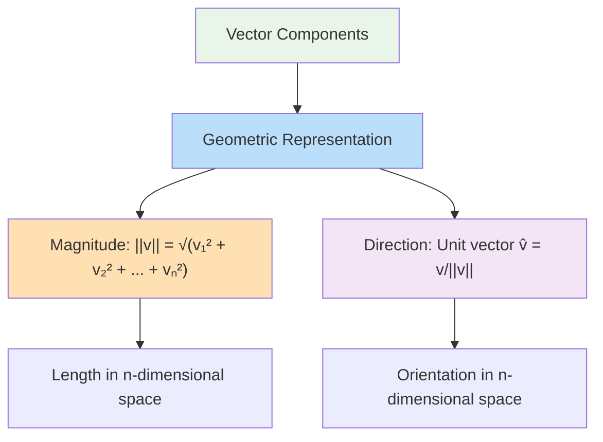
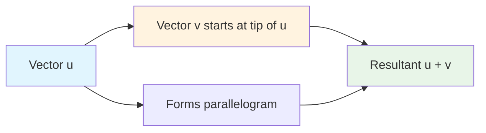
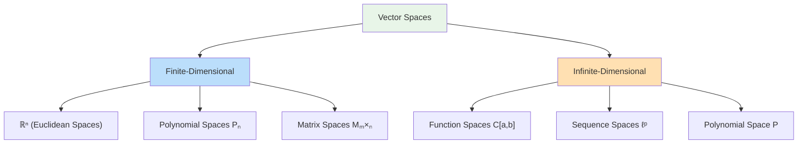
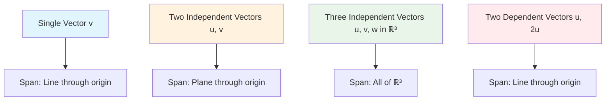
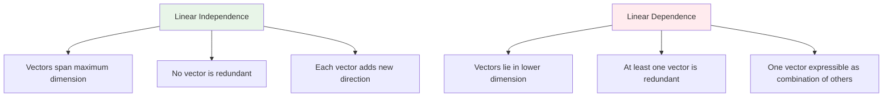
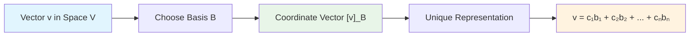
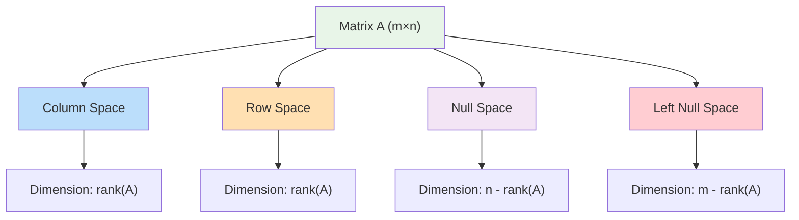
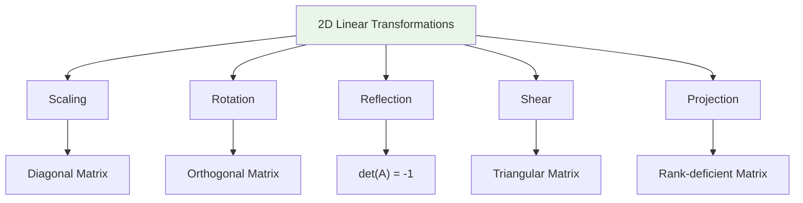
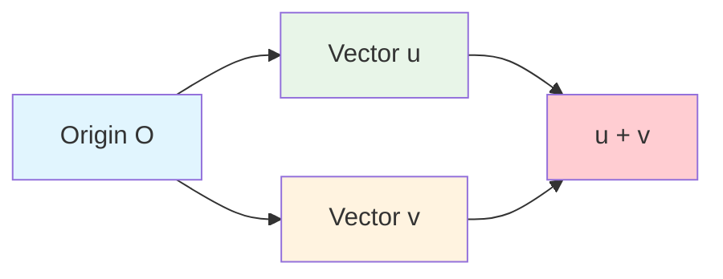

# Linear Algebra Fundamentals: From Vector Spaces to Matrix Transformations

## Table of Contents

**I. Foundation Concepts**

1. [Vector Fundamentals](https://claude.ai/chat/db2a43c5-22e5-49c3-9efa-22769d2b418d#vector-fundamentals)
2. [Vector Operations and Properties](https://claude.ai/chat/db2a43c5-22e5-49c3-9efa-22769d2b418d#vector-operations)
3. [Vector Spaces: Axiomatic Framework](https://claude.ai/chat/db2a43c5-22e5-49c3-9efa-22769d2b418d#vector-spaces)

**II. Structural Analysis** 4.
[Linear Combinations and Span](https://claude.ai/chat/db2a43c5-22e5-49c3-9efa-22769d2b418d#span) 5.
[Linear Independence and Dependence](https://claude.ai/chat/db2a43c5-22e5-49c3-9efa-22769d2b418d#independence) 6.
[Basis and Dimension Theory](https://claude.ai/chat/db2a43c5-22e5-49c3-9efa-22769d2b418d#basis-dimension)

**III. Computational Methods** 7.
[Span Membership Algorithms](https://claude.ai/chat/db2a43c5-22e5-49c3-9efa-22769d2b418d#span-membership) 8.
[Matrix Representations](https://claude.ai/chat/db2a43c5-22e5-49c3-9efa-22769d2b418d#matrix-representations) 9.
[Linear Transformations](https://claude.ai/chat/db2a43c5-22e5-49c3-9efa-22769d2b418d#transformations)

**IV. Applications and Extensions** 10.
[Geometric Interpretations](https://claude.ai/chat/db2a43c5-22e5-49c3-9efa-22769d2b418d#geometric-interpretations) 11.
[Computational Considerations](https://claude.ai/chat/db2a43c5-22e5-49c3-9efa-22769d2b418d#computational-considerations) 12.
[Applications in Machine Learning](https://claude.ai/chat/db2a43c5-22e5-49c3-9efa-22769d2b418d#ml-applications)

---

## I. Foundation Concepts

### 1. Vector Fundamentals {#vector-fundamentals}

#### 1.1 Mathematical Definition and Core Properties

A **vector** is a mathematical object characterized by two fundamental attributes: **magnitude** (also called norm or
length) and **direction**. This dual nature distinguishes vectors from scalars, which possess only magnitude.

**Formal Definition**: A vector $\vec{v}$ in $n$-dimensional space is an ordered $n$-tuple of real numbers:

$$
\vec{v} = (v_1, v_2, v_3, \ldots, v_n) \in \mathbb{R}^n
$$

where each $v_i$ is called a **component** or **coordinate** of the vector.

#### 1.2 Notational Conventions

**Standard Notations:**

- **Arrow notation**: $\vec{v}$, $\vec{u}$, $\vec{w}$ (handwritten and typeset)
- **Bold notation**: $\mathbf{v}$, $\mathbf{u}$, $\mathbf{w}$ (common in printed texts)
- **Column vector notation**: $\begin{bmatrix} v_1 \ v_2 \ \vdots \ v_n \end{bmatrix}$
- **Row vector notation**: $[v_1, v_2, \ldots, v_n]$

**Dimensional Classifications:**

- **2D vectors**: $\vec{v} = (v_1, v_2) \in \mathbb{R}^2$
- **3D vectors**: $\vec{v} = (v_1, v_2, v_3) \in \mathbb{R}^3$
- **n-dimensional vectors**: $\vec{v} = (v_1, v_2, \ldots, v_n) \in \mathbb{R}^n$

#### 1.3 Geometric Interpretation

**Magnitude (Euclidean Norm):**

$$
|\vec{v}| = \sqrt{v_1^2 + v_2^2 + \cdots + v_n^2} = \sqrt{\sum_{i=1}^{n} v_i^2}
$$

**Unit Vector (Direction):**

$$
\hat{v} = \frac{\vec{v}}{|\vec{v}|} = \frac{1}{|\vec{v}|}\begin{bmatrix} v_1 \ v_2 \ \vdots \ v_n \end{bmatrix}
$$

### 2. Vector Operations and Properties {#vector-operations}

#### 2.1 Vector Addition

**Definition**: For vectors $\vec{u} = (u_1, u_2, \ldots, u_n)$ and $\vec{v} = (v_1, v_2, \ldots, v_n)$:

$$
\vec{u} + \vec{v} = (u_1 + v_1, u_2 + v_2, \ldots, u_n + v_n)
$$

**Algebraic Properties:**

1. **Commutativity**: $\vec{u} + \vec{v} = \vec{v} + \vec{u}$
2. **Associativity**: $(\vec{u} + \vec{v}) + \vec{w} = \vec{u} + (\vec{v} + \vec{w})$
3. **Identity element**: $\vec{v} + \vec{0} = \vec{v}$ where $\vec{0} = (0, 0, \ldots, 0)$
4. **Inverse element**: $\vec{v} + (-\vec{v}) = \vec{0}$ where $-\vec{v} = (-v_1, -v_2, \ldots, -v_n)$

**Geometric Interpretation**: Vector addition follows the **parallelogram rule** or **head-to-tail rule**.

#### 2.2 Scalar Multiplication

**Definition**: For scalar $c \in \mathbb{R}$ and vector $\vec{v} = (v_1, v_2, \ldots, v_n)$:

$$
c\vec{v} = (cv_1, cv_2, \ldots, cv_n)
$$

**Effects on Vector Properties:**

- **Magnitude**: $|c\vec{v}| = |c| \cdot |\vec{v}|$
- **Direction**:
    - If $c > 0$: Direction unchanged
    - If $c < 0$: Direction reversed
    - If $c = 0$: Results in zero vector $\vec{0}$

**Algebraic Properties:**

1. **Distributivity over vector addition**: $c(\vec{u} + \vec{v}) = c\vec{u} + c\vec{v}$
2. **Distributivity over scalar addition**: $(c + d)\vec{v} = c\vec{v} + d\vec{v}$
3. **Associativity**: $(cd)\vec{v} = c(d\vec{v})$
4. **Scalar identity**: $1 \cdot \vec{v} = \vec{v}$

#### 2.3 Dot Product (Inner Product)

**Definition**: For vectors $\vec{u} = (u_1, u_2, \ldots, u_n)$ and $\vec{v} = (v_1, v_2, \ldots, v_n)$:

$$
\vec{u} \cdot \vec{v} = u_1v_1 + u_2v_2 + \cdots + u_nv_n = \sum_{i=1}^{n} u_iv_i
$$

**Geometric Formula**:

$$
\vec{u} \cdot \vec{v} = |\vec{u}||\vec{v}|\cos\theta
$$

where $\theta$ is the angle between vectors $\vec{u}$ and $\vec{v}$.

**Fundamental Properties:**

1. **Commutativity**: $\vec{u} \cdot \vec{v} = \vec{v} \cdot \vec{u}$
2. **Distributivity**: $\vec{u} \cdot (\vec{v} + \vec{w}) = \vec{u} \cdot \vec{v} + \vec{u} \cdot \vec{w}$
3. **Scalar multiplication**: $(c\vec{u}) \cdot \vec{v} = c(\vec{u} \cdot \vec{v}) = \vec{u} \cdot (c\vec{v})$
4. **Positive definiteness**: $\vec{v} \cdot \vec{v} \geq 0$, with equality if and only if $\vec{v} = \vec{0}$

**Key Applications:**

- **Orthogonality test**: $\vec{u} \perp \vec{v} \Leftrightarrow \vec{u} \cdot \vec{v} = 0$
- **Vector magnitude**: $|\vec{v}| = \sqrt{\vec{v} \cdot \vec{v}}$
- **Angle computation**: $\cos\theta = \frac{\vec{u} \cdot \vec{v}}{|\vec{u}||\vec{v}|}$

### 3. Vector Spaces: Axiomatic Framework {#vector-spaces}

#### 3.1 Formal Definition

A **vector space** (or linear space) $V$ over field $\mathbb{F}$ is a non-empty set equipped with two operations:

- **Vector addition**: $+ : V \times V \to V$
- **Scalar multiplication**: $\cdot : \mathbb{F} \times V \to V$

These operations must satisfy eight axioms that formalize our intuitive understanding of "linear behavior."

#### 3.2 The Eight Vector Space Axioms

**Addition Axioms:**

1. **Closure**:

    $$
    \forall \vec{u}, \vec{v} \in V: \vec{u} + \vec{v} \in V
    $$

2. **Commutativity**:

    $$
    \forall \vec{u}, \vec{v} \in V: \vec{u} + \vec{v} = \vec{v} + \vec{u}
    $$

3. **Associativity**:

    $$
    \forall \vec{u}, \vec{v}, \vec{w} \in V: (\vec{u} + \vec{v}) + \vec{w} = \vec{u} + (\vec{v} + \vec{w})
    $$

4. **Additive identity**:

    $$
    \exists \vec{0} \in V \text{ such that } \forall \vec{v} \in V: \vec{v} + \vec{0} = \vec{v}
    $$

5. **Additive inverse**:
    $$
    \forall \vec{v} \in V, \exists (-\vec{v}) \in V: \vec{v} + (-\vec{v}) = \vec{0}
    $$

**Scalar Multiplication Axioms:**

6. **Closure**:

    $$
    \forall c \in \mathbb{F}, \forall \vec{v} \in V: c\vec{v} \in V
    $$

7. **Distributivity (vector)**:

    $$
    \forall c \in \mathbb{F}, \forall \vec{u}, \vec{v} \in V: c(\vec{u} + \vec{v}) = c\vec{u} + c\vec{v}
    $$

8. **Distributivity (scalar)**:
    $$
    \forall c, d \in \mathbb{F}, \forall \vec{v} \in V: (c + d)\vec{v} = c\vec{v} + d\vec{v}
    $$

**Additional Requirement:**

- **Scalar multiplication identity**:
    $$
    \forall \vec{v} \in V: 1 \cdot \vec{v} = \vec{v}
    $$

#### 3.3 Examples of Vector Spaces

**Euclidean Spaces ($\mathbb{R}^n$):**

- **Elements**:

    $$
    \vec{v} = (v_1, v_2, \ldots, v_n) \text{ where } v_i \in \mathbb{R}
    $$

- **Addition**:

    $$
    (u_1, \ldots, u_n) + (v_1, \ldots, v_n) = (u_1 + v_1, \ldots, u_n + v_n)
    $$

- **Scalar multiplication**:

    $$
    c(v_1, \ldots, v_n) = (cv_1, \ldots, cv_n)
    $$

- **Zero vector**:
    $$
    \vec{0} = (0, 0, \ldots, 0)
    $$

**Polynomial Spaces ($\mathcal{P}_n$):**

- **Elements**:

    $$
    p(x) = a_0 + a_1x + a_2x^2 + \cdots + a_nx^n \text{ where } a_i \in \mathbb{R}
    $$

- **Addition**:

    $$
    (p + q)(x) = p(x) + q(x)
    $$

- **Scalar multiplication**:

    $$
    (cp)(x) = c \cdot p(x)
    $$

- **Zero vector**:
    $$
    0(x) = 0
    $$

**Matrix Spaces ($M_{m \times n}(\mathbb{R})$):**

- **Elements**: $m \times n$ matrices with real entries
- **Addition**: Element-wise addition
- **Scalar multiplication**: Scalar times each matrix entry
- **Zero vector**: Zero matrix with all entries equal to 0

**Function Spaces ($C[a,b]$):**

- **Elements**: Continuous real-valued functions on interval $[a,b]$
- **Addition**: $(f + g)(x) = f(x) + g(x)$
- **Scalar multiplication**: $(cf)(x) = c \cdot f(x)$
- **Zero vector**: Zero function $0(x) = 0$ for all $x \in [a,b]$

#### 3.4 Subspaces

**Definition**: A subset $W \subseteq V$ is a **subspace** of vector space $V$ if:

1. $\vec{0} \in W$ (contains zero vector)
2. $\vec{u}, \vec{v} \in W \Rightarrow \vec{u} + \vec{v} \in W$ (closed under addition)
3. $\vec{v} \in W, c \in \mathbb{F} \Rightarrow c\vec{v} \in W$ (closed under scalar multiplication)

**Examples of Subspaces in $\mathbb{R}^3$:**

- The origin: ${\vec{0}}$
- Lines through origin: ${t\vec{v} : t \in \mathbb{R}}$ for fixed $\vec{v} \neq \vec{0}$
- Planes through origin: ${s\vec{u} + t\vec{v} : s,t \in \mathbb{R}}$ for linearly independent $\vec{u}, \vec{v}$
- All of $\mathbb{R}^3$

---

## II. Structural Analysis

### 4. Linear Combinations and Span {#span}

#### 4.1 Linear Combinations: Building Blocks of Vector Spaces

**Definition**: Given vectors $\vec{v_1}, \vec{v_2}, \ldots, \vec{v_k} \in V$ and scalars
$c_1, c_2, \ldots, c_k \in \mathbb{F}$, a **linear combination** is:

$$
c_1\vec{v_1} + c_2\vec{v_2} + \cdots + c_k\vec{v_k} = \sum_{i=1}^{k} c_i\vec{v_i}
$$

**Geometric Intuition**: Linear combinations represent all points reachable by "walking" along the directions defined by
the given vectors, with each scalar determining how far to walk in each direction.

#### 4.2 The Span: Universe of Reachability

**Definition**: The **span** of vectors ${\vec{v_1}, \vec{v_2}, \ldots, \vec{v_k}}$ is the set of all possible linear
combinations:

$$
\text{span}{\vec{v_1}, \vec{v_2}, \ldots, \vec{v_k}} = \left\{\sum_{i=1}^{k} c_i\vec{v_i} : c_i \in \mathbb{F}\right\}
$$

**Fundamental Theorem**: The span of any set of vectors is a subspace of the containing vector space.

**Proof Outline**:

1. **Contains zero**: Take all $c_i = 0$
2. **Closed under addition**: Sum of linear combinations is a linear combination
3. **Closed under scalar multiplication**: Scalar multiple of linear combination is a linear combination

#### 4.3 Geometric Visualization of Span

**Single Vector Span**: For $\vec{v} \neq \vec{0}$ in $\mathbb{R}^n$:
$$\text{span}{\vec{v}} = {c\vec{v} : c \in \mathbb{R}}$$

This creates a line through the origin in the direction of $\vec{v}$.

**Two Vector Span**: For linearly independent vectors $\vec{u}, \vec{v}$ in $\mathbb{R}^n$:
$$\text{span}{\vec{u}, \vec{v}} = {c_1\vec{u} + c_2\vec{v} : c_1, c_2 \in \mathbb{R}}$$

This creates a plane through the origin containing both vectors.

**Three Vector Span**: For linearly independent vectors $\vec{u}, \vec{v}, \vec{w}$ in $\mathbb{R}^3$:
$$\text{span}{\vec{u}, \vec{v}, \vec{w}} = \mathbb{R}^3$$

This spans the entire 3-dimensional space.

#### 4.4 Computational Examples

**Example 1**: Two-dimensional span Consider $\vec{v_1} = (1, 2)$ and $\vec{v_2} = (3, 1)$ in $\mathbb{R}^2$.

$$\text{span}{\vec{v_1}, \vec{v_2}} = {c_1(1, 2) + c_2(3, 1) : c_1, c_2 \in \mathbb{R}}$$
$$= {(c_1 + 3c_2, 2c_1 + c_2) : c_1, c_2 \in \mathbb{R}}$$

Since $\vec{v_1}$ and $\vec{v_2}$ are linearly independent (not scalar multiples), their span is all of $\mathbb{R}^2$.

**Example 2**: Dependent vectors Consider $\vec{u_1} = (1, 2, 1)$, $\vec{u_2} = (2, 1, 3)$, and $\vec{u_3} = (3, 3, 4)$
in $\mathbb{R}^3$.

Note that $\vec{u_3} = \vec{u_1} + \vec{u_2}$, so:
$$\text{span}{\vec{u_1}, \vec{u_2}, \vec{u_3}} = \text{span}{\vec{u_1}, \vec{u_2}}$$

This creates a plane in $\mathbb{R}^3$, not the full space.

### 5. Linear Independence and Dependence {#independence}

#### 5.1 Fundamental Definitions

**Linear Independence**: Vectors ${\vec{v_1}, \vec{v_2}, \ldots, \vec{v_k}}$ are **linearly independent** if:

$$
c_1\vec{v_1} + c_2\vec{v_2} + \cdots + c_k\vec{v_k} = \vec{0} \implies c_1 = c_2 = \cdots = c_k = 0
$$

**Linear Dependence**: Vectors are **linearly dependent** if they are not linearly independent, i.e., there exist
scalars $c_1, c_2, \ldots, c_k$, not all zero, such that:

$$
c_1\vec{v_1} + c_2\vec{v_2} + \cdots + c_k\vec{v_k} = \vec{0}
$$

#### 5.2 Equivalent Characterizations of Linear Dependence

**Theorem**: The following are equivalent:

1. Vectors ${\vec{v_1}, \vec{v_2}, \ldots, \vec{v_k}}$ are linearly dependent
2. At least one vector can be written as a linear combination of the others
3. Removing one vector from the set does not change the span
4. The matrix $[\vec{v_1} \mid \vec{v_2} \mid \cdots \mid \vec{v_k}]$ has rank less than $k$

#### 5.3 Geometric Interpretation

**2D Examples**:

- **Independent**: ${(1, 0), (0, 1)}$ - span full plane
- **Dependent**: ${(1, 2), (2, 4)}$ - lie on same line

**3D Examples**:

- **Independent**: ${(1, 0, 0), (0, 1, 0), (0, 0, 1)}$ - span full 3D space
- **Dependent**: ${(1, 1, 0), (2, 2, 0), (0, 0, 1)}$ - first two are parallel

#### 5.4 Testing for Linear Independence

**Method 1: Direct Approach** Set up the equation:

$$
c_1\vec{v_1} + c_2\vec{v_2} + \cdots + c_k\vec{v_k} = \vec{0}
$$

Convert to system of linear equations and solve. If only solution is $c_1 = c_2 = \cdots = c_k = 0$, vectors are
independent.

**Method 2: Matrix Rank** Form matrix $A = [\vec{v_1} \mid \vec{v_2} \mid \cdots \mid \vec{v_k}]$. Vectors are linearly
independent if and only if $\text{rank}(A) = k$.

**Method 3: Determinant (Square Matrices)** If vectors form a square matrix, they are linearly independent if and only
if $\det(A) \neq 0$.

#### 5.5 Key Theorems

**Theorem (Steinitz Exchange)**: If ${\vec{v_1}, \ldots, \vec{v_k}}$ are linearly independent and span a space also
spanned by ${\vec{w_1}, \ldots, \vec{w_m}}$, then $k \leq m$.

**Theorem (Linear Independence Bound)**: In $\mathbb{R}^n$, any set of more than $n$ vectors must be linearly dependent.

**Theorem (Extension)**: Any linearly independent set in a finite-dimensional vector space can be extended to a basis.

### 6. Basis and Dimension Theory {#basis-dimension}

#### 6.1 Definition of Basis

**Definition**: A set $\mathcal{B} = {\vec{b_1}, \vec{b_2}, \ldots, \vec{b_n}}$ is a **basis** for vector space $V$ if:

1. **Spanning property**: $\text{span}(\mathcal{B}) = V$
2. **Linear independence**: The vectors in $\mathcal{B}$ are linearly independent

**Equivalent characterization**: $\mathcal{B}$ is a basis if it is a maximal linearly independent set or a minimal
spanning set.

#### 6.2 Fundamental Basis Theorem

**Theorem**: If $V$ has a finite basis, then:

1. Every basis of $V$ contains the same number of vectors
2. Every vector in $V$ has a unique representation as a linear combination of basis vectors

**Proof Outline**:

- Uniqueness follows from linear independence
- Equal cardinality follows from Steinitz exchange theorem

#### 6.3 Coordinate Representation

Given basis $\mathcal{B} = {\vec{b_1}, \vec{b_2}, \ldots, \vec{b_n}}$ for $V$, every vector $\vec{v} \in V$ can be
uniquely written as:

$$
\vec{v} = c_1\vec{b_1} + c_2\vec{b_2} + \cdots + c_n\vec{b_n}
$$

The scalars $(c_1, c_2, \ldots, c_n)$ are called the **coordinates** of $\vec{v}$ with respect to basis $\mathcal{B}$,
denoted $[\vec{v}]_\mathcal{B}$.

#### 6.4 Dimension

**Definition**: The **dimension** of vector space $V$, denoted $\dim(V)$, is the number of vectors in any basis of $V$.

**Key Properties**:

- All bases have the same cardinality
- $\dim({0}) = 0$ (zero vector space)
- If no finite basis exists, $V$ is infinite-dimensional

**Standard Dimensions**:

- $\dim(\mathbb{R}^n) = n$
- $\dim(\mathcal{P}_n) = n + 1$ (polynomials of degree ≤ n)
- $\dim(M_{m \times n}) = mn$ (m×n matrices)

#### 6.5 Standard Bases

**Standard Basis for $\mathbb{R}^n$**: $$\mathcal{E} = {\vec{e_1}, \vec{e_2}, \ldots, \vec{e_n}}$$ where $\vec{e_i}$ has
1 in position $i$ and 0 elsewhere.

**For $\mathbb{R}^3$**:
$$\vec{e_1} = \begin{bmatrix} 1 \ 0 \ 0 \end{bmatrix}, \quad \vec{e_2} = \begin{bmatrix} 0 \ 1 \ 0 \end{bmatrix}, \quad \vec{e_3} = \begin{bmatrix} 0 \ 0 \ 1 \end{bmatrix}$$

**Standard Basis for $\mathcal{P}_n$**: $${1, x, x^2, \ldots, x^n}$$

**Standard Basis for $M_{2 \times 2}$**:
$$\left\{\begin{bmatrix} 1 & 0 \ 0 & 0 \end{bmatrix}, \begin{bmatrix} 0 & 1 \ 0 & 0 \end{bmatrix}, \begin{bmatrix} 0 & 0 \ 1 & 0 \end{bmatrix}, \begin{bmatrix} 0 & 0 \ 0 & 1 \end{bmatrix}\right\}$$

#### 6.6 Change of Basis

**Problem**: Given vector $\vec{v}$ with coordinates $[\vec{v}]_\mathcal{B}$ in basis $\mathcal{B}$, find coordinates
$[\vec{v}]_\mathcal{C}$ in basis $\mathcal{C}$.

**Solution**: Use change of basis matrix $P_{\mathcal{C} \leftarrow \mathcal{B}}$:
$$[\vec{v}]_\mathcal{C} = P_{\mathcal{C} \leftarrow \mathcal{B}} [\vec{v}]_\mathcal{B}$$

**Construction**: Columns of $P_{\mathcal{C} \leftarrow \mathcal{B}}$ are coordinates of $\mathcal{B}$ vectors expressed
in $\mathcal{C}$ basis.

---

## III. Computational Methods

### 7. Span Membership Algorithms {#span-membership}

#### 7.1 The Fundamental Problem

**Problem Statement**: Given vectors ${\vec{v_1}, \vec{v_2}, \ldots, \vec{v_k}}$ and target vector $\vec{t}$, determine
whether: $$\vec{t} \in \text{span}{\vec{v_1}, \vec{v_2}, \ldots, \vec{v_k}}$$

This is equivalent to asking: Do there exist scalars $c_1, c_2, \ldots, c_k$ such that:

$$
c_1\vec{v_1} + c_2\vec{v_2} + \cdots + c_k\vec{v_k} = \vec{t}
$$

#### 7.2 Matrix Formulation

**System Setup**: Convert to matrix equation $A\vec{c} = \vec{t}$ where:

- $A = [\vec{v_1} \mid \vec{v_2} \mid \cdots \mid \vec{v_k}]$ (coefficient matrix)
- $\vec{c} = [c_1, c_2, \ldots, c_k]^T$ (unknown coefficients)
- $\vec{t}$ is the target vector

#### 7.3 Rank-Based Solution Method

**Theorem (Consistency Criterion)**: The system $A\vec{c} = \vec{t}$ has a solution if and only if:

$$
\text{rank}(A) = \text{rank}([A \mid \vec{t}])
$$

where $[A \mid \vec{t}]$ is the augmented matrix.

**Algorithm**:

1. Form coefficient matrix $A = [\vec{v_1} \mid \vec{v_2} \mid \cdots \mid \vec{v_k}]$
2. Form augmented matrix $[A \mid \vec{t}]$
3. Compute $\text{rank}(A)$ using row reduction
4. Compute $\text{rank}([A \mid \vec{t}])$ using row reduction
5. If ranks are equal: $\vec{t} \in \text{span}\{\vec{v_1}, \vec{v_2}, \ldots, \vec{v_k}\}$
6. If ranks differ: $\vec{t} \notin \text{span}\{\vec{v_1}, \vec{v_2}, \ldots, \vec{v_k}\}$

**Computational Complexity**: $O(\min(m,n)^3)$ for matrix rank computation, where $m$ is the number of rows and $n$ is
the number of columns.

#### 7.4 Direct Solution Methods

**Gaussian Elimination Approach**:

1. Form augmented matrix $[A \mid \vec{t}]$
2. Apply row operations to achieve row echelon form
3. Check for consistency by examining the rightmost column

**Row Echelon Analysis**:

- **Consistent**: No row of form $[0 ; 0 ; \cdots ; 0 \mid c]$ where $c \neq 0$
- **Inconsistent**: Contains such a row, indicating $\vec{t} \notin \text{span}{\vec{v_1}, \ldots, \vec{v_k}}$

#### 7.5 Detailed Computational Example

**Problem**: Determine if $\vec{t} = (5, 7, 5)$ is in $\text{span}{(1, 2, 1), (3, 1, 2)}$.

**Step 1**: Set up the system $$c_1(1, 2, 1) + c_2(3, 1, 2) = (5, 7, 5)$$

This gives us: $$c_1 + 3c_2 = 5 \quad \text{(equation 1)}$$ $$2c_1 + c_2 = 7 \quad \text{(equation 2)}$$
$$c_1 + 2c_2 = 5 \quad \text{(equation 3)}$$

**Step 2**: Form matrices
$$A = \begin{bmatrix} 1 & 3 \ 2 & 1 \ 1 & 2 \end{bmatrix}, \quad [A \mid \vec{t}] = \begin{bmatrix} 1 & 3 & 5 \ 2 & 1 & 7 \ 1 & 2 & 5 \end{bmatrix}$$

**Step 3**: Row reduction of augmented matrix
$$\begin{bmatrix} 1 & 3 & 5 \ 2 & 1 & 7 \ 1 & 2 & 5 \end{bmatrix} \xrightarrow{R_2 \leftarrow R_2 - 2R_1} \begin{bmatrix} 1 & 3 & 5 \ 0 & -5 & -3 \ 1 & 2 & 5 \end{bmatrix}$$

$$\xrightarrow{R_3 \leftarrow R_3 - R_1} \begin{bmatrix} 1 & 3 & 5 \ 0 & -5 & -3 \ 0 & -1 & 0 \end{bmatrix}$$

$$\xrightarrow{R_3 \leftarrow R_3 - \frac{1}{5}R_2} \begin{bmatrix} 1 & 3 & 5 \ 0 & -5 & -3 \ 0 & 0 & \frac{3}{5} \end{bmatrix}$$

**Step 4**: Analysis The last row indicates $0c_1 + 0c_2 = \frac{3}{5}$, which is impossible.

**Conclusion**: $\vec{t} \notin \text{span}{(1, 2, 1), (3, 1, 2)}$

#### 7.6 Alternative: Least Squares Approach

For overdetermined systems, use least squares to find "best approximate" solution:
$$\vec{c}^* = (A^T A)^{-1} A^T \vec{t}$$

**Residual Analysis**: $$\text{residual} = \vec{t} - A\vec{c}^*$$

If $||\text{residual}|| < \epsilon$ (small tolerance), consider $\vec{t}$ approximately in the span.

### 8. Matrix Representations {#matrix-representations}

#### 8.1 Matrices as Linear Transformation Representations

A matrix $A \in \mathbb{R}^{m \times n}$ naturally defines a linear transformation $T_A: \mathbb{R}^n \to \mathbb{R}^m$
by: $$T_A(\vec{x}) = A\vec{x}$$

**Fundamental Property**: The columns of $A$ are the images of the standard basis vectors under $T_A$.

#### 8.2 Column Space Interpretation

**Definition**: The **column space** (or range) of matrix $A$ is:
$$\text{Col}(A) = \text{span}{\vec{a_1}, \vec{a_2}, \ldots, \vec{a_n}}$$ where $\vec{a_i}$ are the columns of $A$.

**Key Insight**: Vector $\vec{b}$ is in the column space of $A$ if and only if the system $A\vec{x} = \vec{b}$ has a
solution.

#### 8.3 Row Space and Null Space

**Row Space**: $$\text{Row}(A) = \text{span}{\text{rows of } A} = \text{Col}(A^T)$$

**Null Space (Kernel)**: $$\text{Null}(A) = {\vec{x} \in \mathbb{R}^n : A\vec{x} = \vec{0}}$$

#### 8.4 Fundamental Subspaces and Dimensions

**Rank-Nullity Theorem**: For matrix $A \in \mathbb{R}^{m \times n}$: $$\text{rank}(A) + \text{nullity}(A) = n$$

where:

- $\text{rank}(A) = \dim(\text{Col}(A)) = \dim(\text{Row}(A))$
- $\text{nullity}(A) = \dim(\text{Null}(A))$

### 9. Linear Transformations {#transformations}

#### 9.1 Definition and Properties

**Definition**: A function $T: V \to W$ between vector spaces is a **linear transformation** if:

1. $T(\vec{u} + \vec{v}) = T(\vec{u}) + T(\vec{v})$ (additivity)
2. $T(c\vec{v}) = cT(\vec{v})$ (homogeneity)

**Equivalent Single Condition**: $T(c_1\vec{u} + c_2\vec{v}) = c_1T(\vec{u}) + c_2T(\vec{v})$

#### 9.2 Matrix Representation of Linear Transformations

**Fundamental Theorem**: Every linear transformation $T: \mathbb{R}^n \to \mathbb{R}^m$ can be represented by a unique
$m \times n$ matrix $A$ such that: $$T(\vec{x}) = A\vec{x}$$

**Construction**: The columns of $A$ are $T(\vec{e_1}), T(\vec{e_2}), \ldots, T(\vec{e_n})$ where ${\vec{e_i}}$ is the
standard basis for $\mathbb{R}^n$.

#### 9.3 Geometric Interpretation via Basis Vectors

**Key Insight**: Understanding a linear transformation reduces to understanding what happens to basis vectors.

For standard basis vectors $\hat{i} = \begin{bmatrix} 1 \ 0 \end{bmatrix}$ and
$\hat{j} = \begin{bmatrix} 0 \ 1 \end{bmatrix}$ in $\mathbb{R}^2$:

$$A = \begin{bmatrix} a & b \ c & d \end{bmatrix}$$

**Transformation Effects**:

- $A\hat{i} = \begin{bmatrix} a \ c \end{bmatrix}$ (where $\hat{i}$ goes)
- $A\hat{j} = \begin{bmatrix} b \ d \end{bmatrix}$ (where $\hat{j}$ goes)

#### 9.4 The Fundamental Transformation Principle

For any vector $\vec{v} = x\hat{i} + y\hat{j}$:

**Method 1**: Transform via transformed basis vectors
$$T(\vec{v}) = xT(\hat{i}) + yT(\hat{j}) = x\begin{bmatrix} a \ c \end{bmatrix} + y\begin{bmatrix} b \ d \end{bmatrix}$$

**Method 2**: Direct matrix multiplication
$$T(\vec{v}) = A\vec{v} = \begin{bmatrix} a & b \ c & d \end{bmatrix}\begin{bmatrix} x \ y \end{bmatrix} = \begin{bmatrix} ax + by \ cx + dy \end{bmatrix}$$

**Mathematical Equivalence**:
$$x\begin{bmatrix} a \ c \end{bmatrix} + y\begin{bmatrix} b \ d \end{bmatrix} = \begin{bmatrix} ax + by \ cx + dy \end{bmatrix}$$

#### 9.5 Detailed Matrix Multiplication Mechanics

**Step-by-step process** for $\begin{bmatrix} a & b \ c & d \end{bmatrix}\begin{bmatrix} x \ y \end{bmatrix}$:

**First component**: $$\text{Row 1} \cdot \text{Column} = a \cdot x + b \cdot y = ax + by$$

**Second component**: $$\text{Row 2} \cdot \text{Column} = c \cdot x + d \cdot y = cx + dy$$

**Result**: $$\begin{bmatrix} ax + by \ cx + dy \end{bmatrix}$$

#### 9.6 Classification of 2D Transformations

**Scaling Transformation**: $$A_{\text{scale}} = \begin{bmatrix} s_x & 0 \ 0 & s_y \end{bmatrix}$$

- Effect: $\hat{i} \to (s_x, 0)$, $\hat{j} \to (0, s_y)$
- Stretches/compresses along coordinate axes

**Rotation Transformation**:
$$A_{\text{rot}} = \begin{bmatrix} \cos\theta & -\sin\theta \ \sin\theta & \cos\theta \end{bmatrix}$$

- Effect: Both basis vectors rotate by angle $\theta$
- Preserves lengths and angles

**Shear Transformation**: $$A_{\text{shear}} = \begin{bmatrix} 1 & k \ 0 & 1 \end{bmatrix}$$

- Effect: $\hat{i}$ unchanged, $\hat{j} \to (k, 1)$
- Creates parallelogram distortion

**Reflection Transformation**: $$A_{\text{reflect}} = \begin{bmatrix} 1 & 0 \ 0 & -1 \end{bmatrix}$$

- Effect: Reflects across x-axis
- $\hat{i}$ unchanged, $\hat{j} \to (0, -1)$

---

## IV. Applications and Extensions

### 10. Geometric Interpretations {#geometric-interpretations}

#### 10.1 Visualization of Vector Operations

**Vector Addition Parallelogram Rule**:

The sum $\vec{u} + \vec{v}$ forms the diagonal of a parallelogram with sides $\vec{u}$ and $\vec{v}$.

**Scalar Multiplication Effects**:

- $c > 1$: Vector elongates in same direction
- $0 < c < 1$: Vector shrinks in same direction
- $c < 0$: Vector reverses direction and scales by $|c|$
- $c = 0$: Vector becomes zero vector

#### 10.2 Geometric Understanding of Linear Independence

**In $\mathbb{R}^2$**:

- Two vectors are linearly independent if and only if they don't lie on the same line through the origin
- Two independent vectors span the entire plane

**In $\mathbb{R}^3$**:

- Two vectors are independent if they're not collinear (span a plane)
- Three vectors are independent if they're not coplanar (span all of $\mathbb{R}^3$)

**Visual Test**: Vectors are dependent if one can be "reached" by scaling and adding the others.

#### 10.3 Span as Reachable Space

**1D Span**: Single line through origin **2D Span**: Plane through origin **3D Span**: All of 3D space (for 3
independent vectors in $\mathbb{R}^3$)

The span represents everywhere you can "travel" using linear combinations of the given vectors as "directions."

### 11. Computational Considerations {#computational-considerations}

#### 11.1 Numerical Stability Issues

**Floating Point Precision**:

- Linear independence tests may fail due to rounding errors
- Use tolerance-based comparisons: $|value| < \epsilon$ instead of $value = 0$

**Condition Numbers**:

- Ill-conditioned matrices amplify small errors
- High condition numbers indicate near-singular matrices

#### 11.2 Efficient Algorithms

**QR Decomposition**:

- More stable than normal equations for least squares
- Provides orthogonal basis for column space

**Singular Value Decomposition (SVD)**:

- Most robust method for rank determination
- Handles rank-deficient matrices gracefully

**Complexity Analysis**:

- Gaussian elimination: $O(n^3)$
- QR decomposition: $O(mn^2)$ for $m \times n$ matrix
- SVD: $O(mn^2)$ for $m \geq n$

### 12. Applications in Machine Learning {#ml-applications}

#### 12.1 Feature Spaces and Data Representation

**High-Dimensional Data**: Each data point represents a vector in $\mathbb{R}^n$ where $n$ is the number of features.

**Feature Engineering**:

- Adding new features increases dimension of vector space
- Linear dependence among features indicates redundancy
- Feature selection seeks minimal spanning sets

#### 12.2 Principal Component Analysis (PCA)

**Objective**: Find directions of maximum variance in data

**Mathematical Framework**:

- Data matrix $X \in \mathbb{R}^{m \times n}$ (m samples, n features)
- Covariance matrix $C = \frac{1}{m-1}X^TX$
- Principal components are eigenvectors of $C$

**Connection to Linear Algebra**:

- Span of principal components provides lower-dimensional representation
- Dimensionality reduction preserves most important directions

#### 12.3 Linear Regression

**Problem**: Find best linear combination of features to predict target

**Matrix Formulation**: $$\hat{y} = X\vec{w}$$ where $X$ is feature matrix and $\vec{w}$ are weights.

**Normal Equations**: $$\vec{w} = (X^TX)^{-1}X^T\vec{y}$$

**Geometric Interpretation**: Project target vector onto column space of feature matrix.

#### 12.4 Neural Network Layers

**Linear Layers**: Implement matrix transformations $$\vec{h} = \sigma(W\vec{x} + \vec{b})$$

**Understanding Through Basis Transformation**:

- Input space has basis corresponding to input features
- Weight matrix transforms to new representation space
- Activation function provides non-linearity

#### 12.5 Dimensionality and Curse of Dimensionality

**High-Dimensional Challenges**:

- Volume of unit sphere approaches zero as dimension increases
- Distance metrics become less meaningful
- Sample complexity grows exponentially

**Linear Algebra Solutions**:

- Use span-based dimensionality reduction
- Project onto meaningful subspaces
- Exploit linear structure in high-dimensional data

---

## Summary and Key Insights

This comprehensive exploration of linear algebra reveals the deep connections between abstract mathematical concepts and
practical computational problems. The progression from basic vector operations through span membership algorithms to
matrix transformations provides a solid foundation for understanding how linear algebra underlies much of modern
mathematics, science, and machine learning.

**Core Principles**:

1. **Linearity**: The fundamental property that makes linear algebra tractable
2. **Basis Representation**: Every vector can be uniquely expressed in terms of basis vectors
3. **Geometric Intuition**: Abstract concepts have concrete geometric interpretations
4. **Computational Methods**: Theoretical results translate to practical algorithms

**Interconnections**:

- Span membership connects to solving linear systems
- Linear independence relates to matrix rank and invertibility
- Basis theory underlies coordinate systems and transformations
- Matrix representations bridge abstract linear maps and concrete computations

The geometric interpretation of matrix multiplication as basis vector transformation provides particularly powerful
intuition, making abstract linear transformations visualizable and understandable. This perspective proves invaluable in
applications ranging from computer graphics to machine learning, where understanding what transformations actually do
geometrically is crucial for both implementation and interpretation.
