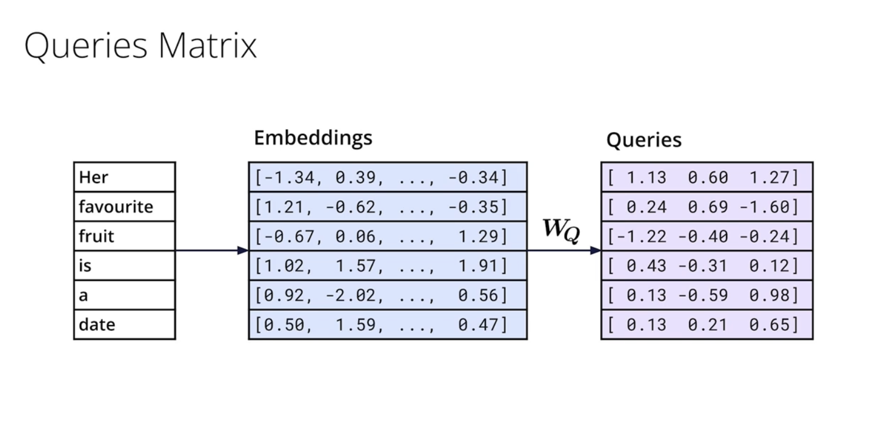
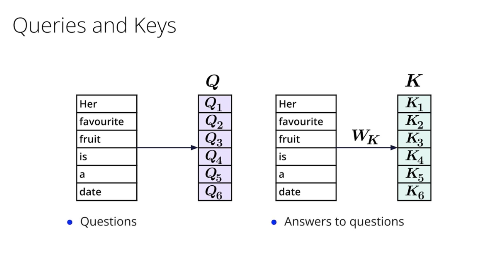
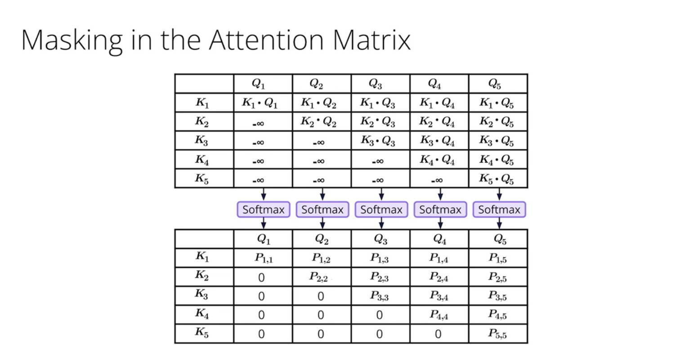
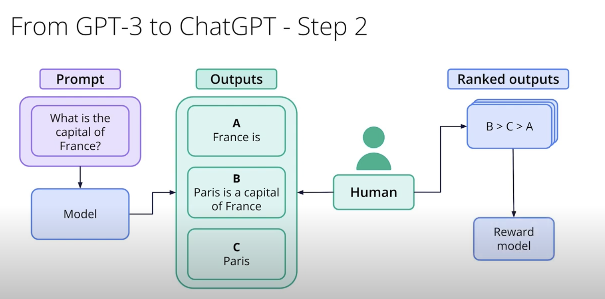
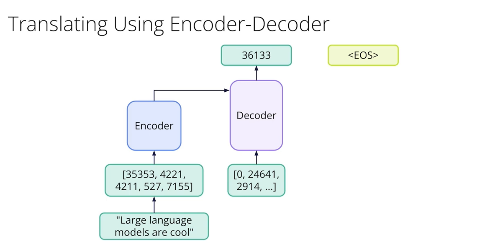
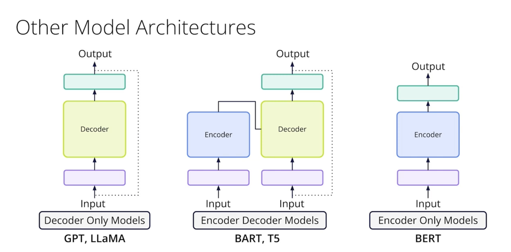
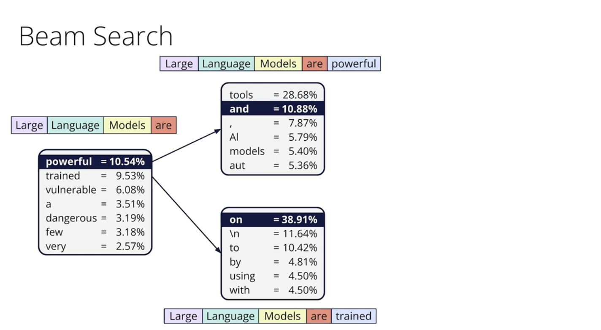
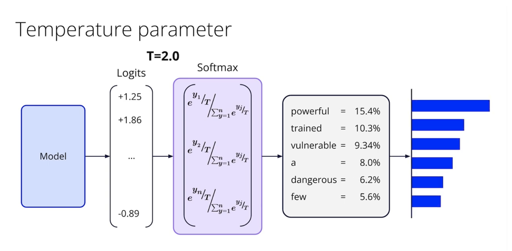

# C-1: Neural Network Foundations

1. Neural Networks Fundamentals
    - Basic Structure and Components
    - Forward Propagation Process
    - Activation Functions Overview
    - Neural Network Architectures
    - Input, Hidden, and Output Layers
2. The Perceptron Algorithm
    - Basic Formula and Components
    - Update Rules for Classification
    - Decision Boundaries and Linear Separability
    - Step Function Implementation
    - Limitations of Perceptrons
3. Loss Functions and Error Calculation
    - Log-Loss Error Function
    - Cross-Entropy for Binary Classification
    - Multi-Class Cross-Entropy
    - Mean Squared Error (MSE)
    - Maximum Likelihood Estimation

#### Neural Networks Fundamentals

Neural networks represent one of the most powerful approaches in machine learning, drawing inspiration from the
biological neural structures in animal brains. Though they've evolved far beyond their biological inspiration,
understanding their core components helps build a foundation for deeper exploration.

##### Basic Structure and Components

At their heart, neural networks are computational systems made up of interconnected processing units that work together
to transform input data into meaningful outputs. Think of them as information assembly lines where each worker (neuron)
performs a specific calculation before passing results to the next set of workers.

The essential building blocks include:

1. **Neurons (nodes)**: These are the fundamental processing units that receive inputs, apply transformations, and
   produce outputs. Each neuron performs a relatively simple mathematical operation, but their collective behavior
   enables complex computations.
2. **Weights**: Every connection between neurons has an associated weight value—essentially a number that determines how
   strongly the output from one neuron affects the next. These weights are the primary parameters that the network
   adjusts during learning.
3. **Bias**: This additional parameter allows neurons to shift their activation functions, giving the network more
   flexibility to fit patterns in data. You can think of bias as setting each neuron's "activation threshold."
4. **Activation function**: This mathematical function introduces non-linearity into the network, allowing it to learn
   complex patterns that would be impossible with purely linear operations. It determines whether and how strongly a
   neuron "fires" based on its inputs.
5. **Layers**: Neural networks organize neurons into layers that process information collectively:
    - **Input layer**: Receives and standardizes raw data
    - **Hidden layers**: Perform intermediate calculations and feature extraction
    - **Output layer**: Produces the final prediction or classification
6. **Connections**: The pathways through which information flows between neurons, creating the network's structure.

Mathematically, we can express what happens at a single neuron as:

$$y = f\left(\sum_{i=1}^{n} w_i x_i + b\right)$$

Where:

- $x_i$ represents each input value
- $w_i$ represents the weight for each input
- $b$ is the bias term
- $f$ is the activation function
- $y$ is the neuron's output

This formula shows how a neuron computes a weighted sum of its inputs, adds a bias term, and then applies an activation
function to produce an output. While simple, this operation forms the foundation of all neural network computations.

##### Forward Propagation Process

Forward propagation describes how information flows through a neural network from input to output. This fundamental
process occurs both when training the network and when using it to make predictions.

Let's walk through this step-by-step:

1. **Input Processing**: Data enters the network through the input layer. For example, in an image recognition task,
   each pixel might correspond to one input neuron.
2. **Hidden Layer Computation**: Each neuron in the first hidden layer:
    - Receives inputs from all (or some) neurons in the previous layer
    - Multiplies each input by its corresponding weight
    - Sums these weighted inputs and adds a bias term
    - Applies an activation function to this sum
    - Passes the result to the next layer
3. **Layer-by-Layer Progression**: This process repeats across all hidden layers, with each layer transforming the
   outputs from the previous layer into increasingly abstract representations of the original data.
4. **Output Generation**: The final layer produces the network's prediction, whether that's a classification (e.g.,
   "this image contains a cat") or a continuous value (e.g., "tomorrow's temperature will be 72°F").

We can represent this mathematically for a network with $L$ layers:

$$a^{(1)} = f^{(1)}(W^{(1)}x + b^{(1)})$$ $$a^{(2)} = f^{(2)}(W^{(2)}a^{(1)} + b^{(2)})$$ $$\vdots$$
$$a^{(L)} = f^{(L)}(W^{(L)}a^{(L-1)} + b^{(L)})$$

Where:

- $a^{(l)}$ represents the activations (outputs) of layer $l$
- $W^{(l)}$ is the weight matrix for layer $l$
- $b^{(l)}$ is the bias vector for layer $l$
- $f^{(l)}$ is the activation function for layer $l$

This series of transformations allows neural networks to progressively extract and combine features from the raw input
data, enabling them to learn complex patterns and relationships.

##### Activation Functions Overview

Activation functions are crucial because they introduce non-linearity into neural networks. Without them, no matter how
many layers you add, your network would behave like a single linear layer—severely limiting what it can learn.

Think of activation functions as decision-makers within each neuron that determine how strongly it should "fire" based
on its inputs. Different activation functions create different behaviors:

1. **Sigmoid**: Maps any input to a value between 0 and 1, creating a smooth S-shaped curve.
   $$\sigma(x) = \frac{1}{1 + e^{-x}}$$

    This function was historically popular but suffers from the "vanishing gradient problem"—with inputs far from zero,
    the function flattens, making learning difficult. It's useful in the output layer for binary classification.

2. **Hyperbolic Tangent (tanh)**: Similar to sigmoid but maps inputs to values between -1 and 1.
   $$\tanh(x) = \frac{e^x - e^{-x}}{e^x + e^{-x}}$$

    This centered output range makes tanh useful in hidden layers, though it still faces vanishing gradient issues.

3. **Rectified Linear Unit (ReLU)**: Perhaps the most widely used activation function today.
   $$\text{ReLU}(x) = \max(0, x)$$

    ReLU simply outputs the input if it's positive, otherwise zero. This piecewise linear function is computationally
    efficient and helps mitigate vanishing gradients, accelerating training. However, it can suffer from "dying ReLU"
    problems where neurons permanently stop activating.

4. **Leaky ReLU**: A variant that allows a small slope for negative inputs.
   $$\text{Leaky ReLU}(x) = \max(\alpha x, x) \text{ where } \alpha \text{ is a small constant}$$

    This helps prevent dying neurons by allowing a small gradient when the input is negative.

5. **Softmax**: Used specifically in the output layer for multi-class classification.
   $$\text{softmax}(x_i) = \frac{e^{x_i}}{\sum_{j=1}^{n} e^{x_j}}$$

    Softmax converts a vector of raw outputs into a probability distribution across classes, ensuring outputs sum to 1.

The choice of activation function significantly impacts how effectively and efficiently your network learns. Modern deep
learning typically uses ReLU or its variants in hidden layers, with sigmoid or softmax in the output layer depending on
the task.

##### Neural Network Architectures

Neural networks come in various architectures, each designed to excel at different types of problems. Understanding
these architectures helps in selecting the right tool for specific tasks.

1. **Feedforward Neural Networks (FNN)**: The simplest architecture where information flows in only one direction—from
   input to output with no loops or cycles. These networks are the foundation of deep learning and work well for basic
   classification and regression tasks with tabular data.
2. **Convolutional Neural Networks (CNN)**: Specialized for processing grid-like data, particularly images. CNNs use:
    - Convolutional layers that apply filters to detect patterns regardless of their position
    - Pooling layers that reduce dimensionality while preserving important features
    - These enable CNNs to automatically learn hierarchical features—from simple edges to complex objects
3. **Recurrent Neural Networks (RNN)**: Designed for sequential data like time series or text. Unlike feedforward
   networks, RNNs have connections that form cycles, allowing them to maintain an internal "memory" of previous inputs.
   This makes them well-suited for tasks where context matters, like language modeling or speech recognition.
4. **Long Short-Term Memory (LSTM) Networks**: A sophisticated RNN variant that addresses the vanishing gradient problem
   in standard RNNs. LSTMs use special memory cells with gates that control information flow, allowing them to learn
   long-term dependencies in sequential data—crucial for tasks like machine translation.
5. **Transformer Networks**: Modern architectures that revolutionized natural language processing. Instead of processing
   data sequentially like RNNs, transformers use "attention mechanisms" to process all elements of a sequence
   simultaneously while weighing their relationships. This parallel processing enables more efficient training and
   better performance on many language tasks.
6. **Autoencoders**: Networks designed to learn efficient representations of data. They have an encoder that compresses
   input data and a decoder that attempts to reconstruct the original input. Useful for dimensionality reduction,
   feature learning, and generative modeling.
7. **Generative Adversarial Networks (GANs)**: A framework involving two neural networks—a generator and a
   discriminator—competing against each other. The generator creates synthetic data while the discriminator tries to
   distinguish between real and fake examples. This adversarial process leads to remarkably realistic data generation.

Each architecture represents a different approach to leveraging neural networks' computational capacity. The field
continues to evolve with hybrid architectures that combine elements from multiple approaches to tackle increasingly
complex problems.

##### Input, Hidden, and Output Layers

Understanding the distinct roles of different layer types helps clarify how neural networks transform raw data into
useful outputs.

**Input Layer:**

The input layer serves as the network's sensory system, receiving raw data and preparing it for processing. Key
characteristics include:

- One neuron for each feature in your dataset (e.g., each pixel in an image or each word in a text)
- Minimal processing—typically just normalization to standardize the scale of input values
- No activation function is applied at this stage
- Acts as a distribution point, passing data to the first hidden layer

For example, in a network analyzing 28×28 pixel images, the input layer would have 784 neurons (28×28), each
representing the intensity of one pixel.

**Hidden Layers:**

Hidden layers form the "thinking" part of the network, progressively transforming raw data into increasingly abstract
representations. Their characteristics include:

- Multiple neurons working in parallel to extract different aspects of the data
- Each layer builds upon features detected by previous layers
- Early layers detect simple patterns; deeper layers combine these into complex concepts
- The number and size of these layers define the network's capacity and complexity

For instance, in an image recognition network:

- First hidden layer: Might detect edges and simple textures
- Middle layers: Combine these into shapes and parts
- Deeper layers: Recognize complex objects by combining simpler components

Deep networks with many hidden layers excel at learning hierarchical representations of data, but require more data and
computational resources to train effectively.

**Output Layer:**

The output layer produces the final result, structured according to the specific task:

- For regression problems: Typically one neuron per output variable, often with a linear activation function
- For binary classification: Often a single neuron with sigmoid activation, producing a value between 0 and 1
  representing probability
- For multi-class classification: One neuron per class with softmax activation, creating a probability distribution
  across all possible classes

The output layer's design directly relates to the problem you're solving. For example, a network predicting stock prices
might have a single output neuron, while a network classifying handwritten digits would have ten output neurons (for
digits 0-9).

The interaction between these layer types creates the network's computational pipeline. Input data flows through
increasingly abstract transformations in the hidden layers before emerging as a prediction or classification in the
output layer. The depth (number of layers) and width (neurons per layer) of this pipeline determine both what the
network can learn and how efficiently it can learn it.

#### The Perceptron Algorithm

The perceptron represents the earliest form of neural network and serves as the foundational building block for more
complex architectures. Developed by Frank Rosenblatt in 1957, this elegantly simple algorithm introduces key concepts
that remain relevant in today's deep learning landscape.

##### Basic Formula and Components

The perceptron implements a binary classifier that attempts to separate data points into two categories using a linear
boundary. Think of it as drawing a straight line (or in higher dimensions, a flat plane) that best divides two groups of
points.

At its core, the perceptron consists of these essential components:

1. **Input Features**: These are the characteristics of your data, represented as a vector
   $\mathbf{x} = (x_1, x_2, ..., x_n)$. For instance, if you're classifying flowers, the features might include petal
   length, petal width, and stem length.
2. **Weights**: The perceptron assigns importance values to each input feature through a weight vector
   $\mathbf{w} = (w_1, w_2, ..., w_n)$. These weights determine how much influence each feature has on the final
   classification decision. During training, these weights are adjusted to improve performance.
3. **Bias**: A bias term $b$ (sometimes written as $w_0$) acts like an adjustable threshold, shifting the decision
   boundary away from the origin. Without a bias, the decision boundary would always pass through the origin, severely
   limiting what the perceptron can learn.
4. **Activation Function**: The perceptron uses a step function that produces a binary output—typically 0 or 1
   (sometimes -1 or 1)—based on whether the weighted sum of inputs exceeds the threshold.

The perceptron's prediction formula can be written as:

$$\hat{y} = \begin{cases} 1 & \text{if } \mathbf{w} \cdot \mathbf{x} + b > 0 \ 0 & \text{otherwise} \end{cases}$$

Or more succinctly:

$$\hat{y} = \text{step}(\mathbf{w} \cdot \mathbf{x} + b)$$

Where $\mathbf{w} \cdot \mathbf{x}$ represents the dot product of the weight and input vectors, calculating the weighted
sum of all inputs.

We can simplify the equation by absorbing the bias term into the weight vector through a mathematical trick. Lets walk
through this step by step:

Starting with the original prediction formula: $$\hat{y} = \text{step}(\mathbf{w} \cdot \mathbf{x} + b)$$

This represents the weighted sum of inputs plus a bias term, passed through a step function. The dot product expands to:
$$\mathbf{w} \cdot \mathbf{x} + b = w_1x_1 + w_2x_2 + ... + w_nx_n + b$$

Now, the mathematical insight is that we can treat the bias term $b$ as if it were another weight, but multiplied by a
constant input of 1. To do this:

1. We add a new input feature $x_0 = 1$ that's always equal to 1 for any input example
2. We create a new weight $w_0 = b$ corresponding to this input
3. Our new expanded vectors become:
    - New weight vector: $\mathbf{w}_{\text{new}} = (w_0, w_1, ..., w_n) = (b, w_1, ..., w_n)$
    - New input vector: $\mathbf{x}_{\text{new}} = (x_0, x_1, ..., x_n) = (1, x_1, ..., x_n)$

Now when we calculate the dot product of these new vectors:

$$\mathbf{w}_{\text{new}} \cdot \mathbf{x}_{\text{new}} = w_0x_0 + w_1x_1 + ... + w_nx_n = b \cdot 1 + w_1x_1 + ... + w_nx_n = b + w_1x_1 + ... + w_nx_n$$

Which is exactly the same as our original $\mathbf{w} \cdot \mathbf{x} + b$

This gives us the simplified equation: $$\hat{y} = \text{step}(\mathbf{w} \cdot \mathbf{x})$$

Where it's understood that $\mathbf{w}$ and $\mathbf{x}$ now include the bias term and the constant 1 input,
respectively.

This simplification is elegant because it lets us treat the bias just like any other weight parameter, streamlining both
the mathematical notation and the implementation. It turns what was originally "a dot product plus a constant" into just
"a dot product."

This elegant formulation shows that the perceptron makes decisions by calculating a weighted sum and comparing it to a
threshold—effectively implementing a linear decision boundary in the feature space.

##### Update Rules for Classification

The perceptron learns through a surprisingly simple error-driven process. When it misclassifies a data point, it adjusts
its weights to reduce the likelihood of making the same mistake again. This learning process follows a straightforward
update rule.

Imagine you're training a perceptron on a dataset where each point has features $(p, q)$ and a true label $y$ (either 0
or 1). For each training example:

1. The perceptron makes a prediction $\hat{y}$ using the current weights.
2. If the prediction is correct ($\hat{y} = y$), no change is needed.
3. If the prediction is incorrect, the weights are updated as follows:
    - If the perceptron incorrectly predicts positive (predicts 1 when the true label is 0):
        - $w_1 = w_1 - \alpha \cdot p$
        - $w_2 = w_2 - \alpha \cdot q$
        - $b = b - \alpha$
    - If the perceptron incorrectly predicts negative (predicts 0 when the true label is 1):
        - $w_1 = w_1 + \alpha \cdot p$
        - $w_2 = w_2 + \alpha \cdot q$
        - $b = b + \alpha$

Here, $\alpha$ is the learning rate—a positive value that controls how aggressively the weights are adjusted with each
update. The general form of this update rule can be expressed elegantly as:

$$\mathbf{w}_{\text{new}} = \mathbf{w}_{\text{old}} + \alpha \cdot (y - \hat{y}) \cdot \mathbf{x}$$

And for the bias:

$$b_{\text{new}} = b_{\text{old}} + \alpha \cdot (y - \hat{y})$$

First, we'll extend our vectors to include the bias term directly in the weight vector, as we discussed earlier. We'll
define:

- Extended weight vector: $\mathbf{W} = [b, w_1, w_2, ..., w_n]^T$
- Extended input vector: $\mathbf{X} = [1, x_1, x_2, ..., x_n]^T$

This single equation handles updates for both the bias and all weights simultaneously. The matrix multiplication
automatically computes each specific weight update correctly:

```math
\begin{bmatrix}
b_{\text{new}} \\
w_{1,\text{new}} \\
w_{2,\text{new}} \\
\vdots \\
w_{n,\text{new}}
\end{bmatrix} = \begin{bmatrix}
b_{\text{old}} \\
w_{1,\text{old}} \\
w_{2,\text{old}} \\
\vdots \\
w_{n,\text{old}}
\end{bmatrix} + \alpha(y - \hat{y}) \begin{bmatrix}
1 \\
x_1 \\
x_2 \\
\vdots \\
x_n
\end{bmatrix}
```

For the expanded equations, you can keep them as separate equations as you have them:

```math
&b_{\text{new}} = b_{\text{old}} + \alpha(y - \hat{y}) \cdot 1\\
&w_{1,\text{new}} = w_{1,\text{old}} + \alpha(y - \hat{y}) \cdot x_1\\
&w_{2,\text{new}} = w_{2,\text{old}} + \alpha(y - \hat{y}) \cdot x_2\\
&\vdots\\
&w_{n,\text{new}} = w_{n,\text{old}} + \alpha(y - \hat{y}) \cdot x_n\\
```

This matrix formulation is particularly valuable when implementing the perceptron algorithm computationally, as it
allows us to update all weights in a single vectorized operation rather than using loops to update each weight
individually. It also highlights how the conceptual simplification of treating the bias as just another weight leads to
a cleaner mathematical representation.

For batch learning, where we update based on multiple examples at once, we can extend this further with data matrices
where each row represents one training example, making the perceptron algorithm even more computationally efficient.

This update rule has an intuitive interpretation:

- When the prediction is correct ($y = \hat{y}$), the error term $(y - \hat{y})$ is zero, so no update occurs.
- When the perceptron predicts 0 but the true label is 1, weights are increased in proportion to the input features,
  making that pattern more likely to be classified as positive next time.
- When the perceptron predicts 1 but the true label is 0, weights are decreased, making that pattern more likely to be
  classified as negative next time.

The learning rate $\alpha$ determines the step size of each update. A large learning rate means faster learning but
risks overshooting the optimal solution, while a small learning rate provides more precise updates but requires more
iterations to converge.

This update rule embodies a fundamental principle in machine learning: adjusting model parameters in proportion to their
contribution to the error, moving gradually toward better performance.

##### Decision Boundaries and Linear Separability

A key concept in understanding perceptrons is the idea of a decision boundary—the dividing line (or hyperplane in higher
dimensions) that separates classes in the feature space.

For a perceptron with two input features, the decision boundary is a straight line defined by:

$$w_1 x_1 + w_2 x_2 + b = 0$$

Rearranging to the slope-intercept form of a line:

$$x_2 = -\frac{w_1}{w_2}x_1 - \frac{b}{w_2}$$

This gives us a line with slope $-\frac{w_1}{w_2}$ and y-intercept $-\frac{b}{w_2}$.

In higher-dimensional spaces with more features, this generalizes to a hyperplane:

$$\mathbf{w} \cdot \mathbf{x} + b = 0$$

The perceptron classifies points based on which side of this hyperplane they fall:

- Points where $\mathbf{w} \cdot \mathbf{x} + b > 0$ are classified as positive (class 1)
- Points where $\mathbf{w} \cdot \mathbf{x} + b < 0$ are classified as negative (class 0)

This brings us to the critical concept of linear separability. A dataset is linearly separable if there exists some
hyperplane that perfectly separates the positive examples from the negative examples. Mathematically, this means there's
some weight vector $\mathbf{w}$ and bias $b$ such that:

$$\mathbf{w} \cdot \mathbf{x} + b > 0 \text{ for all positive examples}$$
$$\mathbf{w} \cdot \mathbf{x} + b < 0 \text{ for all negative examples}$$

The perceptron convergence theorem, proven by Rosenblatt, guarantees that if a dataset is linearly separable, the
perceptron algorithm will eventually find a separating hyperplane in a finite number of iterations. This was a
groundbreaking result that showed the algorithm's ability to learn from data.

Visual examples help clarify this concept:

- A dataset with two clusters that can be separated by a straight line is linearly separable.
- The classic XOR problem (where points at (0,0) and (1,1) belong to one class, while points at (0,1) and (1,0) belong
  to another) is not linearly separable—no straight line can separate these points correctly.

The concept of linear separability defines both the power and the limitation of the perceptron. It can perfectly
classify any linearly separable dataset, but it fails completely on problems requiring nonlinear decision boundaries.

##### Step Function Implementation

The step function (also called the Heaviside function) is the activation function that gives the perceptron its binary
decision-making capability. It transforms the continuous weighted sum of inputs into a discrete binary output.

The standard step function is defined as:

$$\text{step}(z) = \begin{cases} 1 & \text{if } z > 0 \ 0 & \text{if } z \leq 0 \end{cases}$$

In some implementations, the output values may be {1, -1} instead of {1, 0}:

$$\text{step}(z) = \begin{cases} 1 & \text{if } z > 0 \ -1 & \text{if } z \leq 0 \end{cases}$$

The step function creates a sharp threshold—any weighted sum above zero produces one output value, while any sum at or
below zero produces another. This binary nature makes the perceptron's decisions clear-cut but also introduces
limitations.

One critical characteristic of the step function is that its derivative is zero everywhere except at $z = 0$, where it's
undefined. This property has significant implications for training:

1. Traditional gradient-based optimization methods can't be directly applied, as they rely on non-zero gradients to
   guide weight updates.
2. The perceptron algorithm circumvents this issue by using the classification error directly to update weights, rather
   than trying to compute gradients of the step function.

A simple implementation of the step function in Python would look like:

```python
def step_function(z):
    return 1 if z > 0 else 0
```

While modern neural networks have mostly moved away from the step function in favor of differentiable activation
functions like sigmoid, ReLU, or tanh, understanding the step function remains important for grasping the historical
development of neural networks and the conceptual foundations of binary classification.

##### Limitations of Perceptrons

Despite their elegant simplicity, perceptrons face several significant limitations that led researchers to develop more
sophisticated neural network architectures.

1. **Linear Decision Boundary**: The most fundamental limitation is that perceptrons can only learn linear decision
   boundaries. This means they cannot solve problems that require nonlinear separation. The classic example is the XOR
   problem, where the pattern of inputs and outputs cannot be separated by any straight line.

    To visualize this: imagine trying to separate red and blue points that are arranged in a checkerboard pattern—no
    straight line can correctly separate all red points from all blue points.

2. **Binary Classification Only**: The basic perceptron is designed solely for binary classification tasks
   (distinguishing between two classes). Extending to multi-class problems requires multiple perceptrons or different
   architectures altogether.

3. **No Probabilistic Output**: Unlike logistic regression or modern neural networks, perceptrons output hard
   classifications (0 or 1) rather than probabilities. This makes them less useful in scenarios where you need
   confidence estimates or risk assessments along with predictions.

4. **Convergence Issues**: If the data is not linearly separable, the perceptron algorithm may never converge to a
   stable solution. Instead, the weights might oscillate indefinitely as the algorithm tries in vain to find a perfect
   separation. This can be particularly problematic in real-world datasets where perfect linear separation is rare.

5. **Sensitivity to Initial Conditions**: The final solution can depend heavily on the initial weight values and the
   order in which training examples are presented. This introduces an element of randomness into the learning process.

6. **Limited Representation Capacity**: As Marvin Minsky and Seymour Papert demonstrated in their influential 1969 book
   "Perceptrons," there are many simple functions that single-layer perceptrons cannot represent, regardless of the
   training algorithm used.

These limitations led to the first "AI winter" in the 1970s, as researchers became disillusioned with the perceptron's
capabilities. However, they also spurred research into multilayer networks and backpropagation—developments that
eventually led to the deep learning revolution decades later.

The multi-layer perceptron (MLP) was developed to address these limitations by:

- Using multiple layers of neurons to create non-linear decision boundaries
- Employing differentiable activation functions that allow gradients to flow through the network
- Enabling the learning of complex, hierarchical representations

Despite its limitations, the perceptron remains valuable as a conceptual building block that introduces fundamental
ideas in neural computation. Its simple update rule and geometric interpretation provide an accessible entry point for
understanding more complex neural network architectures. The perceptron's limitations also highlight why we need deeper
networks with non-linear activation functions to solve complex real-world problems.

#### Loss Functions and Error Calculation

Loss functions serve as the compass that guides neural networks during training, providing a quantitative measure of how
well (or poorly) the model is performing. These mathematical tools translate the disparity between predictions and
reality into a single number that the network works to minimize. Understanding loss functions is crucial because they
directly shape what your model learns and how effectively it learns it.

##### Log-Loss Error Function

The Log-Loss error function (also called logarithmic loss or binary cross-entropy) measures the performance of
classification models that output probabilities between 0 and 1.

Imagine you're building a system to detect fraudulent transactions. For each transaction, your model doesn't just make a
yes/no decision—it outputs a probability: "I'm 92% confident this transaction is fraudulent." Log-loss evaluates how
good these probability estimates are.

What makes log-loss special is how it penalizes confidence in wrong answers. If your model confidently predicts an 0.95
probability that a legitimate transaction is fraudulent, it receives a much harsher penalty than if it had been less
certain with a 0.6 prediction. This encourages your model to be cautious about making highly confident predictions
unless it has strong evidence.

Mathematically, for a single prediction, log-loss is calculated as:

$$\text{Log Loss} = -(y \log(p) + (1-y) \log(1-p))$$

Where:

- $y$ is the actual outcome (0 or 1)
- $p$ is your predicted probability for class 1

Let's break this down with examples:

1. **Perfect prediction**: You predict $p = 1.0$ for a positive example ($y = 1$)
    - Log-loss = $-(1 \times \log(1) + 0 \times \log(0)) = -(0) = 0$
    - Zero loss - a perfect score!
2. **Good prediction**: You predict $p = 0.8$ for a positive example ($y = 1$)
    - Log-loss = $-(1 \times \log(0.8) + 0 \times \log(0.2)) = -(\log(0.8)) \approx 0.22$
    - Low but non-zero loss - pretty good!
3. **Terrible prediction**: You predict $p = 0.01$ for a positive example ($y = 1$)
    - Log-loss = $-(1 \times \log(0.01) + 0 \times \log(0.99)) = -(\log(0.01)) \approx 4.6$
    - Very high loss - you were confident in the wrong direction!

For a full dataset with $N$ observations, we average these individual losses:

$$\text{Log Loss} = -\frac{1}{N} \sum_{i=1}^{N} [y_i \log(p_i) + (1-y_i) \log(1-p_i)]$$

This function has several important properties:

1. **Asymmetric penalty**: As your prediction approaches 0 for a positive example (or 1 for a negative example), the
   loss approaches infinity. This prevents the model from being absolutely certain about wrong predictions.
2. **Smooth gradient**: Unlike accuracy metrics that produce "jumpy" signals when predictions cross a threshold,
   log-loss provides a smooth gradient that's useful for optimization algorithms.
3. **Probabilistic interpretation**: Log-loss directly connects to the concept of likelihood in statistics, representing
   how probable the observed data is given your model's predictions.

When visualized, log-loss creates a curve that gently penalizes small mistakes but becomes increasingly severe as
predictions deviate further from the truth, especially near the extremes. This characteristic makes it particularly
effective for training classifiers that need to output well-calibrated probabilities.

##### Cross-Entropy for Binary Classification

Cross-entropy for binary classification is mathematically equivalent to log-loss, but understanding it from an
information theory perspective provides deeper insights into why it works so well.

In information theory, cross-entropy measures the average number of bits needed to encode events from one distribution
using a code optimized for another distribution. When applied to machine learning, it measures how different your
predicted probability distribution is from the true distribution of labels.

For binary classification, cross-entropy is calculated as:

$$H(y, p) = -\sum_{i=1}^{m} [y_i \ln(p_i) + (1 - y_i)\ln(1 - p_i)]$$

Where:

- $m$ is the number of training examples
- $y_i$ is the true label (0 or 1) for example $i$
- $p_i$ is your predicted probability for example $i$
- $\ln$ is the natural logarithm

To develop intuition about cross-entropy, let's think about it in communication terms. Imagine you're trying to compress
and transmit information about whether various emails are spam:

1. The true distribution ($y$) represents the actual spam/not-spam status of each email.
2. Your predicted distribution ($p$) represents your model's estimated probabilities.

If your predictions perfectly match reality, you've found the optimal encoding scheme, resulting in the minimum possible
"message length" (lowest cross-entropy). But if your predictions differ from reality, you'll need extra bits to correct
the mistakes, resulting in higher cross-entropy.

Let's examine how cross-entropy behaves in different scenarios:

1. For a positive example ($y_i = 1$):
    - If you predict $p_i = 0.99$ (nearly correct), the contribution to cross-entropy is $-\ln(0.99) \approx 0.01$ (very
      small)
    - If you predict $p_i = 0.5$ (uncertain), the contribution is $-\ln(0.5) \approx 0.69$ (moderate)
    - If you predict $p_i = 0.01$ (very wrong), the contribution is $-\ln(0.01) \approx 4.6$ (very large)
2. For a negative example ($y_i = 0$):
    - If you predict $p_i = 0.01$ (nearly correct), the contribution is $-\ln(0.99) \approx 0.01$ (very small)
    - If you predict $p_i = 0.5$ (uncertain), the contribution is $-\ln(0.5) \approx 0.69$ (moderate)
    - If you predict $p_i = 0.99$ (very wrong), the contribution is $-\ln(0.01) \approx 4.6$ (very large)

One of the most elegant properties of cross-entropy is that its derivative with respect to the model's pre-activation
outputs (logits) takes a remarkably simple form:

$$\frac{\partial E}{\partial z_i} = p_i - y_i$$

Where $z_i$ is the logit that produces probability $p_i$ after applying the sigmoid function. This simple gradient
formula makes binary cross-entropy particularly efficient for neural network training—the error signal is simply the
difference between prediction and ground truth.

Cross-entropy combines mathematical elegance with practical effectiveness, which explains why it's the default loss
function for most classification tasks in modern machine learning.

##### Multi-Class Cross-Entropy

When dealing with classification problems involving more than two classes (such as recognizing digits 0-9 or classifying
images into hundreds of object categories), we extend binary cross-entropy to multi-class cross-entropy.

Multi-class cross-entropy measures the dissimilarity between two probability distributions: the true distribution
(typically a one-hot encoded vector) and your model's predicted distribution across all possible classes.

The formula for multi-class cross-entropy is:

$$H(y, p) = -\sum_{i=1}^{m} \sum_{j=1}^{n} y_{ij} \ln(p_{ij})$$

Where:

- $m$ is the number of examples
- $n$ is the number of classes
- $y_{ij}$ is 1 if example $i$ belongs to class $j$ and 0 otherwise
- $p_{ij}$ is the predicted probability that example $i$ belongs to class $j$

Let's make this concrete with an example. Imagine a handwritten digit classification problem with 10 classes (digits
0-9):

1. For an image of digit "3", the true distribution is a one-hot vector: [0,0,0,1,0,0,0,0,0,0]
2. Your model might output probabilities: [0.01,0.02,0.05,0.80,0.04,0.02,0.01,0.02,0.02,0.01]

The cross-entropy would focus on the probability assigned to the correct class:

- $-\ln(0.80) \approx 0.22$

If the model had been less confident about the correct class and predicted:
[0.10,0.10,0.10,0.30,0.10,0.10,0.05,0.05,0.05,0.05]

The cross-entropy would be higher:

- $-\ln(0.30) \approx 1.20$

And if the model had confidently predicted the wrong class, say: [0.01,0.02,0.85,0.04,0.02,0.01,0.02,0.01,0.01,0.01]

The cross-entropy would be much higher:

- $-\ln(0.04) \approx 3.22$

In practice, for each example, only one term in the inner sum is non-zero (where $y_{ij} = 1$), which simplifies the
calculation to:

$$H(y, p) = -\sum_{i=1}^{m} \ln(p_{i,c_i})$$

Where $c_i$ is the correct class for example $i$.

Multi-class cross-entropy is typically paired with the softmax function in the output layer, which converts raw scores
(logits) into a probability distribution:

$$p_{ij} = \frac{e^{z_{ij}}}{\sum_{k=1}^{n} e^{z_{ik}}}$$

Where $z_{ij}$ is the raw score (logit) for class $j$ on example $i$.

The combination of softmax and cross-entropy creates a powerful mechanism for training multi-class classifiers because:

1. It naturally handles the constraint that probabilities must sum to 1
2. It provides a clear gradient signal for each class
3. It heavily penalizes confident wrong predictions, encouraging calibrated probabilities

Just like in the binary case, the gradient of multi-class cross-entropy with respect to the logits takes a remarkably
simple form:

$$\frac{\partial E}{\partial z_{ij}} = p_{ij} - y_{ij}$$

This elegant gradient formula allows efficient backpropagation through the network, making multi-class cross-entropy the
standard choice for classification problems with multiple categories.

##### Mean Squared Error (MSE)

While cross-entropy excels at classification tasks, Mean Squared Error (MSE) is the workhorse loss function for
regression problems—those where we predict continuous values like house prices, temperature, or stock returns.

MSE measures the average squared difference between predicted values and actual values. Think of it as calculating the
straight-line distance between your prediction points and the actual data points in a multi-dimensional space, then
squaring those distances.

The formula for MSE is:

$$\text{MSE} = \frac{1}{n} \sum_{i=1}^{n} (y_i - \hat{y}_i)^2$$

Where:

- $n$ is the number of samples
- $y_i$ is the true value for sample $i$
- $\hat{y}_i$ is your predicted value for sample $i$

To build intuition, let's work through a simple example. Imagine you're predicting house prices (in thousands of
dollars):

| House | Actual Price | Prediction | Difference | Squared Difference |
| ----- | ------------ | ---------- | ---------- | ------------------ |
| 1     | 250          | 260        | -10        | 100                |
| 2     | 310          | 290        | 20         | 400                |
| 3     | 180          | 185        | -5         | 25                 |

The MSE would be: $(100 + 400 + 25) / 3 = 175$

MSE has several important properties that make it useful:

1. **Non-negative**: MSE can never be negative, with zero indicating perfect predictions.
2. **Punishes large errors**: By squaring differences, MSE penalizes large errors much more heavily than small ones. A
   prediction that's off by 10 units contributes 100 to the loss, while one that's off by 20 units contributes 400—four
   times as much, not just twice.
3. **Differentiable**: MSE has a smooth gradient everywhere, making it suitable for optimization techniques like
   gradient descent.
4. **Quadratic growth**: As errors increase, the penalty grows quadratically rather than linearly, encouraging the model
   to avoid large individual errors at the expense of making many small errors.

The gradient of MSE with respect to your predictions provides a clear signal for how to adjust the model:

$$\frac{\partial \text{MSE}}{\partial \hat{y}_i} = \frac{2}{n}(\hat{y}_i - y_i)$$

When your predictions are too high, the gradient is positive, pushing predictions downward. When predictions are too
low, the gradient is negative, pushing predictions upward. The magnitude of this correction is proportional to the size
of the error, which helps the model converge efficiently.

While MSE is primarily used for regression, it can technically be applied to classification by treating it as regression
to the class probabilities. However, cross-entropy is generally preferred for classification because it better handles
the probabilistic nature of classification tasks and provides stronger gradients when predictions are far from the
target values.

In advanced applications, variations of MSE like weighted MSE (where some errors are considered more important than
others) or Huber loss (which combines MSE for small errors and absolute error for large errors to reduce sensitivity to
outliers) offer refined approaches to specific regression challenges.

##### Maximum Likelihood Estimation

Maximum Likelihood Estimation (MLE) provides the theoretical foundation that connects many loss functions, including
cross-entropy and MSE, to statistical principles. Understanding MLE helps explain why we choose particular loss
functions for different problems.

At its core, MLE aims to find the parameter values that make the observed data most probable. In other words, it asks:
"What model parameters would most likely generate the data we've observed?"

The likelihood function expresses how probable the observed data is, given specific model parameters:

$$L(\theta|X) = P(X|\theta) = \prod_{i=1}^{n} P(x_i|\theta)$$

Where:

- $\theta$ represents the model parameters (like weights and biases in a neural network)
- $X = {x_1, x_2, ..., x_n}$ is your dataset
- $P(x_i|\theta)$ is the probability of observing data point $x_i$ given parameters $\theta$

We typically work with the log-likelihood instead, which converts the product into a sum:

$$\log L(\theta|X) = \sum_{i=1}^{n} \log P(x_i|\theta)$$

Taking the logarithm doesn't change which parameters maximize the function, but it makes computation easier and more
numerically stable.

Now, here's where it gets interesting: Maximizing the log-likelihood is mathematically equivalent to minimizing the
negative log-likelihood, which directly connects to our loss functions!

Let's see how common loss functions relate to maximum likelihood estimation:

1. **Binary Cross-Entropy and MLE**:

    If we assume each observation follows a Bernoulli distribution (appropriate for binary outcomes), the negative
    log-likelihood becomes:

    $$-\log L(\theta|X) = -\sum_{i=1}^{n} [y_i \log(p_i) + (1-y_i) \log(1-p_i)]$$

    This is exactly the binary cross-entropy loss! When we minimize binary cross-entropy, we're actually finding the
    parameters that maximize the likelihood of observing our training data under a Bernoulli model.

2. **MSE and MLE**:

    If we assume our observations follow a Gaussian distribution with mean equal to our prediction and fixed variance
    (appropriate for many continuous variables), the negative log-likelihood simplifies to:

    $$-\log L(\theta|X) \propto \sum_{i=1}^{n} (y_i - \hat{y}_i)^2$$

    This is proportional to the MSE loss! When we minimize MSE, we're implicitly assuming our target variable follows a
    normal distribution around our predicted value.

3. **Multi-class Cross-Entropy and MLE**:

    If we assume each observation follows a categorical distribution (appropriate for multi-class outcomes), the
    negative log-likelihood becomes:

    $$-\log L(\theta|X) = -\sum_{i=1}^{n} \sum_{j=1}^{k} y_{ij} \log(p_{ij})$$

    This matches the multi-class cross-entropy loss.

This connection provides powerful insights:

1. **Loss functions encode assumptions**: Your choice of loss function implicitly makes assumptions about the
   probability distribution of your data. MSE assumes normally distributed errors, while cross-entropy assumes Bernoulli
   or categorical distributions.
2. **Principled model selection**: Understanding the MLE foundation helps you choose appropriate loss functions for new
   problems based on the nature of your data.
3. **Connection to Bayesian methods**: MLE forms the bridge to Bayesian approaches where we can incorporate prior
   knowledge about parameters.

For example, if you're working with count data (like predicting the number of customer visits), a Poisson distribution
might be more appropriate than a Gaussian one, leading to a different loss function derived from the Poisson negative
log-likelihood.

MLE provides a unifying framework that explains why different loss functions work well for different types of problems.
When you choose a loss function, you're not just picking a mathematical formula—you're making a statement about what
kind of statistical process you believe generated your data.

---

#### Neural Networks Fundamentals

The study of neural networks begins with understanding their foundational elements and how they work together to process
information. These computational models were originally inspired by the biological neural networks in animal brains,
though they have evolved into sophisticated mathematical systems with properties quite distinct from their biological
counterparts.

##### Basic Structure and Components

Neural networks consist of interconnected processing units called neurons. Each neuron takes one or more inputs,
processes them, and produces an output. These artificial neurons are organized into layers to form a complete network
architecture.

The fundamental components of a neural network include:

1. **Neurons (or nodes)**: The basic computational units that receive inputs, apply a transformation, and produce an
   output.
2. **Weights**: Each connection between neurons has an associated weight that determines the strength of the signal.
   These weights are the primary parameters that the network learns during training.
3. **Bias**: An additional parameter that allows the model to fit the data better by shifting the activation function.
4. **Activation function**: A mathematical function applied to the weighted sum of inputs to introduce non-linearity
   into the network's output.
5. **Layers**: Collections of neurons that process information in parallel. Neural networks typically have:
    - An input layer: Receives the initial data
    - Hidden layer(s): Perform intermediate computations
    - An output layer: Produces the final result
6. **Connections**: The pathways along which information flows between neurons, typically represented as edges in a
   computational graph.

Mathematically, we can represent the computation at a single neuron as:

$$y = f\left(\sum_{i=1}^{n} w_i x_i + b\right)$$

Where:

- $x_i$ are the inputs to the neuron
- $w_i$ are the weights associated with each input
- $b$ is the bias term
- $f$ is the activation function
- $y$ is the output of the neuron

##### Forward Propagation Process

Forward propagation is the process by which input data flows through the network to produce an output. This is the
fundamental computation performed by neural networks both during training and when making predictions.

The forward propagation process follows these steps:

1. **Input Processing**: The input data is fed into the input layer, with each input feature connected to one or more
   neurons in the first hidden layer.
2. **Hidden Layer Computation**: Each neuron in a hidden layer computes a weighted sum of its inputs from the previous
   layer, adds a bias term, and applies an activation function.
3. **Layer-by-Layer Progression**: The outputs from one layer become the inputs to the next layer, with this process
   continuing through all hidden layers.
4. **Output Generation**: The final layer produces the network's output, which could be a continuous value (for
   regression tasks) or a probability distribution (for classification tasks).

For a neural network with $L$ layers, we can represent this mathematically as:

$$a^{(1)} = f^{(1)}(W^{(1)}x + b^{(1)})$$ $$a^{(2)} = f^{(2)}(W^{(2)}a^{(1)} + b^{(2)})$$ $$\vdots$$
$$a^{(L)} = f^{(L)}(W^{(L)}a^{(L-1)} + b^{(L)})$$

Where:

- $a^{(l)}$ represents the activations (outputs) of layer $l$
- $W^{(l)}$ is the weight matrix for layer $l$
- $b^{(l)}$ is the bias vector for layer $l$
- $f^{(l)}$ is the activation function for layer $l$

The final output $a^{(L)}$ represents the network's prediction based on the input $x$.

##### Activation Functions Overview

Activation functions introduce non-linearity into neural networks, enabling them to learn complex patterns and
relationships in data. Without activation functions, multiple layers of a neural network would behave like a single
linear layer, severely limiting the network's expressive power.

Common activation functions include:

1. **Sigmoid**: Maps inputs to the range (0,1), historically popular but prone to the vanishing gradient problem.
   $$\sigma(x) = \frac{1}{1 + e^{-x}}$$
2. **Hyperbolic Tangent (tanh)**: Maps inputs to the range (-1,1), addressing some issues with sigmoid but still
   susceptible to vanishing gradients. $$\tanh(x) = \frac{e^x - e^{-x}}{e^x + e^{-x}}$$
3. **Rectified Linear Unit (ReLU)**: Returns the input if positive, otherwise returns zero. ReLU helps mitigate the
   vanishing gradient problem and accelerates convergence. $$\text{ReLU}(x) = \max(0, x)$$
4. **Leaky ReLU**: A variant of ReLU that allows a small gradient when the input is negative, preventing "dying ReLU"
   problems. $$\text{Leaky ReLU}(x) = \max(\alpha x, x) \text{ where } \alpha \text{ is a small constant}$$
5. **Softmax**: Used in the output layer for multi-class classification problems, producing a probability distribution
   across classes. $$\text{softmax}(x_i) = \frac{e^{x_i}}{\sum_{j=1}^{n} e^{x_j}}$$

The choice of activation function significantly impacts network performance and training dynamics, with different
functions better suited to different tasks and network architectures.

##### Neural Network Architectures

Neural networks come in various architectures, each designed to excel at different types of tasks. The architecture
defines how neurons are arranged and connected, which determines the network's capabilities and limitations.

Major neural network architectures include:

1. **Feedforward Neural Networks (FNN)**: The simplest architecture where information flows in one direction—from input
   to output—without cycles or loops. These are used for basic classification and regression tasks.
2. **Convolutional Neural Networks (CNN)**: Specialized for processing grid-like data such as images. CNNs use
   convolutional layers to automatically detect spatial hierarchies of features.
3. **Recurrent Neural Networks (RNN)**: Designed for sequential data processing, with connections that form cycles,
   allowing the network to maintain an internal state or "memory." These are used for tasks like time series prediction
   or natural language processing.
4. **Long Short-Term Memory (LSTM) Networks**: A sophisticated RNN variant that addresses the vanishing gradient problem
   in standard RNNs, allowing them to learn longer-term dependencies.
5. **Transformer Networks**: Modern architectures that use self-attention mechanisms to process sequential data in
   parallel rather than sequentially, leading to significant advances in natural language processing.
6. **Autoencoders**: Networks designed to learn efficient representations of data by attempting to reconstruct their
   inputs after passing through a bottleneck layer.
7. **Generative Adversarial Networks (GANs)**: A framework involving two neural networks—a generator and a
   discriminator—competing against each other to generate realistic synthetic data.

The complexity and specificity of these architectures continue to evolve as researchers develop novel approaches to
solving increasingly complex problems.

##### Input, Hidden, and Output Layers

A neural network's structure can be understood through its different types of layers, each serving a distinct purpose in
the information processing pipeline.

**Input Layer:**

- Serves as the entry point for data into the network
- The number of neurons typically equals the number of input features
- Performs minimal processing—often just normalization or standardization
- Passes data to the first hidden layer without applying activation functions

**Hidden Layers:**

- Perform the intermediate computations that transform inputs into useful representations
- Extract and combine features at increasing levels of abstraction
- The number and size of hidden layers define the network's capacity and complexity
- Too few hidden units can lead to underfitting; too many can cause overfitting
- Deep networks have multiple hidden layers, enabling them to learn highly complex functions

**Output Layer:**

- Produces the final result of the network
- The structure depends on the task:
    - Regression: Typically one neuron per output variable
    - Binary classification: Often a single neuron with sigmoid activation
    - Multi-class classification: One neuron per class with softmax activation
- The activation function in the output layer is chosen based on the problem type

The design decisions regarding the number, size, and configuration of these layers significantly impact a neural
network's learning capacity and performance. Modern deep learning often involves careful architectural engineering to
balance computational efficiency with model expressiveness.

As neural networks have evolved, the boundaries between these traditional layer categorizations have sometimes blurred,
especially in complex architectures like residual networks (ResNets) where connections can skip across layers, or in
attention-based models where information flows more dynamically between components.

#### The Perceptron Algorithm

The perceptron represents one of the earliest and most fundamental models in machine learning, serving as the foundation
for more complex neural networks. Introduced by Frank Rosenblatt in 1957, this algorithm implements a simple binary
classifier that forms the building block for more sophisticated neural architectures.

##### Basic Formula and Components

At its core, the perceptron is a mathematical model that attempts to separate data points into two categories using a
linear decision boundary. The fundamental components of the perceptron include:

1. **Input Features**: The perceptron takes a set of input features represented as a vector
   $\mathbf{x} = (x_1, x_2, ..., x_n)$.
2. **Weights**: Each input feature is associated with a weight value, forming a weight vector
   $\mathbf{w} = (w_1, w_2, ..., w_n)$. These weights determine the importance of each feature in the classification
   decision.
3. **Bias**: A bias term $b$ (sometimes denoted as $w_0$) shifts the decision boundary away from the origin, allowing
   for more flexible positioning.
4. **Activation Function**: The perceptron uses a step function to convert the weighted sum of inputs into a binary
   output.

The basic formula for the perceptron's prediction (ŷ) is:

$$\hat{y} = \begin{cases} 1 & \text{if } \mathbf{w} \cdot \mathbf{x} + b > 0 \ 0 & \text{otherwise} \end{cases}$$

Alternatively, this can be written as:

$$\hat{y} = \text{step}(\mathbf{w} \cdot \mathbf{x} + b)$$

Where $\mathbf{w} \cdot \mathbf{x}$ represents the dot product of the weight and input feature vectors, and
$\text{step}()$ is the step function that outputs 1 for positive inputs and 0 otherwise.

For simplicity, the bias term can be incorporated into the weight vector by adding a constant input feature $x_0 = 1$
and setting $w_0 = b$. This gives us:

$$\hat{y} = \text{step}(\mathbf{w} \cdot \mathbf{x})$$

Where now $\mathbf{w} = (w_0, w_1, ..., w_n)$ and $\mathbf{x} = (1, x_1, ..., x_n)$.

##### Update Rules for Classification

The learning process for a perceptron involves iteratively updating the weights based on classification errors. This is
done through a simple error-driven update rule.

For a data point with features $(p, q)$ and true label $y$:

1. If the perceptron correctly classifies the point, no update is needed.
2. If the point is classified as positive (1) but is actually negative (0):
    - $w_1 = w_1 - \alpha p$
    - $w_2 = w_2 - \alpha q$
    - $b = b - \alpha$
3. If the point is classified as negative (0) but is actually positive (1):
    - $w_1 = w_1 + \alpha p$
    - $w_2 = w_2 + \alpha q$
    - $b = b + \alpha$

Here, $\alpha$ is the learning rate, a positive constant that controls the size of each update.

The general form of the update rule for the weight vector is:

$$\mathbf{w}*{new} = \mathbf{w}*{old} + \alpha (y - \hat{y}) \mathbf{x}$$

And for the bias:

$$b_{new} = b_{old} + \alpha (y - \hat{y})$$

This update rule has an intuitive interpretation:

- When $y = \hat{y}$ (correct classification), the weights remain unchanged.
- When $y = 1$ and $\hat{y} = 0$ (false negative), weights are increased proportionally to the input features.
- When $y = 0$ and $\hat{y} = 1$ (false positive), weights are decreased proportionally to the input features.

The learning rate $\alpha$ controls how aggressively the weights are updated. A larger learning rate leads to faster
convergence but may cause the algorithm to overshoot the optimal solution, while a smaller learning rate provides more
precise updates but requires more iterations to converge.

##### Decision Boundaries and Linear Separability

A key concept in understanding the perceptron is the notion of a decision boundary, which geometrically separates the
two classes.

In a two-dimensional space, the decision boundary takes the form of a straight line defined by:

$$w_1 x_1 + w_2 x_2 + b = 0$$

For higher-dimensional spaces, this generalizes to a hyperplane:

$$\mathbf{w} \cdot \mathbf{x} + b = 0$$

Points on one side of this hyperplane ($\mathbf{w} \cdot \mathbf{x} + b > 0$) are classified as positive, while points
on the other side ($\mathbf{w} \cdot \mathbf{x} + b < 0$) are classified as negative.

The concept of linear separability is critical to the perceptron's functionality. A dataset is linearly separable if
there exists a hyperplane that can perfectly separate the positive examples from the negative examples. Mathematically,
this means there exists a weight vector $\mathbf{w}$ and bias $b$ such that:

$$\mathbf{w} \cdot \mathbf{x} + b > 0 \text{ for all positive examples}$$
$$\mathbf{w} \cdot \mathbf{x} + b < 0 \text{ for all negative examples}$$

The perceptron convergence theorem, proven by Rosenblatt, states that if a dataset is linearly separable, the perceptron
algorithm will eventually find a separating hyperplane in a finite number of iterations. However, if the data is not
linearly separable, the algorithm may never converge, continually updating weights without reaching a stable solution.

##### Step Function Implementation

The step function (also known as the Heaviside function) is the activation function used in the perceptron. It
transforms the continuous weighted sum of inputs into a binary output.

Mathematically, the step function is defined as:

$$\text{step}(z) = \begin{cases} 1 & \text{if } z > 0 \ 0 & \text{if } z \leq 0 \end{cases}$$

In some implementations, the output values may be {1, -1} instead of {1, 0}, which gives:

$$\text{step}(z) = \begin{cases} 1 & \text{if } z > 0 \ -1 & \text{if } z \leq 0 \end{cases}$$

The implementation of the step function is straightforward, but it introduces a key challenge for training: its
derivative is zero everywhere except at $z = 0$, where it is undefined. This property makes it impossible to use
gradient-based optimization methods directly with the step function, as there is no meaningful gradient to guide the
weight updates.

In practice, the perceptron algorithm circumvents this issue by using the update rule based on the classification error,
rather than attempting to compute gradients of the step function. This rule ensures that weights are adjusted in a
direction that reduces misclassifications, even without explicit gradient information.

##### Limitations of Perceptrons

Despite their historical importance and conceptual simplicity, perceptrons have several significant limitations:

1. **Linear Decision Boundary**: Perceptrons can only learn linear decision boundaries. This means they cannot solve
   problems that require non-linear separation, such as the classic XOR problem (where points at (0,0) and (1,1) belong
   to one class, while points at (0,1) and (1,0) belong to another).
2. **Binary Classification Only**: The basic perceptron is designed for binary classification tasks. Extension to
   multi-class problems requires multiple perceptrons or more advanced architectures.
3. **No Probabilistic Output**: Unlike logistic regression or more advanced neural networks, perceptrons output hard
   classifications (0 or 1) rather than probabilities, limiting their usefulness in probabilistic frameworks.
4. **Convergence Issues**: If the data is not linearly separable, the perceptron algorithm may never converge,
   oscillating between different weight configurations without settling on a stable solution.
5. **Sensitivity to Initial Conditions**: The final solution can depend on the initial weight values and the order in
   which training examples are presented.
6. **Limited Representation Capacity**: Single-layer perceptrons cannot represent complex functions. As shown by Minsky
   and Papert in their 1969 book "Perceptrons," there are many simple functions that single-layer perceptrons cannot
   learn.

These limitations led to the development of more sophisticated neural network architectures, including multi-layer
perceptrons with differentiable activation functions that can approximate any continuous function given enough hidden
units. The introduction of the backpropagation algorithm for training such networks marked a significant advancement
beyond the basic perceptron, enabling the learning of complex, non-linear relationships in data.

Despite these limitations, the perceptron remains a fundamental concept in machine learning, providing insights into the
basic principles of neural computation and serving as a building block for more complex models. Its simple update rule
and geometric interpretation make it an excellent starting point for understanding neural networks and the challenges of
training them.

#### Loss Functions and Error Calculation

Loss functions are fundamental components of neural networks that quantify how well a model performs on given data. They
measure the discrepancy between the model's predictions and the actual target values, providing a signal that guides the
learning process. The choice of loss function significantly influences how a neural network learns and what types of
errors it prioritizes.

##### Log-Loss Error Function

The Log-Loss error function, also known as logarithmic loss or binary cross-entropy, measures the performance of a
classification model whose output is a probability value between 0 and 1. It's essentially a way of measuring how wrong
your predictions are when you're producing probability estimates rather than discrete class labels.

Think of log-loss as a punishment system that severely penalizes confident incorrect predictions while being more
lenient with uncertain predictions. For instance, confidently predicting 0.99 probability for a customer being
fraudulent when they're actually legitimate incurs a much higher penalty than predicting 0.51 probability for the same
scenario.

Mathematically, the log-loss for a single observation is:

$$\text{Log Loss} = -(y \log(p) + (1-y) \log(1-p))$$

Where:

- $y$ is the actual binary outcome (0 or 1)
- $p$ is the predicted probability of the outcome being 1

For a dataset with $N$ observations, the log-loss is the average of individual losses:

$$\text{Log Loss} = -\frac{1}{N} \sum_{i=1}^{N} [y_i \log(p_i) + (1-y_i) \log(1-p_i)]$$

Key properties of log-loss include:

1. **Always positive**: Log-loss values are always greater than or equal to zero.
2. **Lower is better**: A perfect model has a log-loss of 0.
3. **Unbounded upper value**: As predictions become more wrong, log-loss approaches infinity.
4. **Asymmetric penalty**: Predicting 0 when the true value is 1 gives infinite loss, forcing models to avoid extreme
   certainty.

The log-loss function is differentiable, making it suitable for optimization techniques like gradient descent. Its
gradient provides clear direction for model updates, which is essential for effective learning.

##### Cross-Entropy for Binary Classification

Cross-entropy for binary classification is effectively the same as log-loss, formulated to measure how well a
probability distribution predicts the true distribution of binary outcomes. It stems from information theory, where it
represents the average number of bits needed to identify an event from a set of possibilities if using a coding scheme
optimized for an estimated probability distribution.

For binary classification, cross-entropy is calculated as:

$$\text{Cross-entropy} = -\sum_{i=1}^{m} [y_i \ln(p_i) + (1 - y_i)\ln(1 - p_i)]$$

Where:

- $m$ is the number of training examples
- $y_i$ is the true label (0 or 1)
- $p_i$ is the predicted probability
- $\ln$ is the natural logarithm

This formula can be interpreted as the logarithm of the likelihood function in maximum likelihood estimation. When we
minimize cross-entropy, we're effectively maximizing the likelihood of our observed data given our model's parameters.

The connection between cross-entropy and probability becomes clearer when we view predictions as attempts to approximate
the true distribution of data. Let's examine the components:

1. For a positive example ($y_i = 1$), the term reduces to $-\ln(p_i)$, which becomes smaller as $p_i$ approaches 1.
2. For a negative example ($y_i = 0$), the term becomes $-\ln(1-p_i)$, which is smaller as $p_i$ approaches 0.

The gradient of cross-entropy with respect to the model's logits provides an elegant error signal for backpropagation:

$$\frac{\partial E}{\partial z_i} = p_i - y_i$$

Where $z_i$ is the logit (pre-activation value) that produces probability $p_i$ after applying the sigmoid function.
This simple gradient form makes binary cross-entropy particularly efficient for training neural networks.

##### Multi-Class Cross-Entropy

When dealing with classification problems involving more than two classes, we extend the binary cross-entropy to
multi-class cross-entropy. This measures the dissimilarity between the predicted probability distribution across all
possible classes and the actual distribution (typically a one-hot encoded vector).

The multi-class cross-entropy loss is defined as:

$$H(y, p) = -\sum_{i=1}^{m} \sum_{j=1}^{n} y_{ij} \ln(p_{ij})$$

Where:

- $m$ is the number of examples
- $n$ is the number of classes
- $y_{ij}$ is 1 if example $i$ belongs to class $j$ and 0 otherwise
- $p_{ij}$ is the predicted probability that example $i$ belongs to class $j$

In practice, for each example, only one term in the inner sum is non-zero (where $y_{ij} = 1$), simplifying the
calculation to:

$$H(y, p) = -\sum_{i=1}^{m} \ln(p_{i,c_i})$$

Where $c_i$ is the correct class for example $i$.

When combined with the softmax function in the output layer, this loss function provides an effective mechanism for
training multi-class classification models. The softmax function converts the network's raw outputs (logits) into a
probability distribution:

$$p_{ij} = \frac{e^{z_{ij}}}{\sum_{k=1}^{n} e^{z_{ik}}}$$

Where $z_{ij}$ is the logit for class $j$ on example $i$.

The gradient of multi-class cross-entropy with respect to the logits has the same elegant form as in the binary case:

$$\frac{\partial E}{\partial z_{ij}} = p_{ij} - y_{ij}$$

This gradient efficiently directs the learning process, increasing the predicted probability for the correct class while
decreasing it for incorrect classes.

##### Mean Squared Error (MSE)

Mean Squared Error is a common loss function for regression problems, measuring the average of the squared differences
between predicted and actual values. It's analogous to measuring the straight-line distance between prediction points
and actual data points in a multi-dimensional space.

The MSE for a set of predictions is calculated as:

$$\text{MSE} = \frac{1}{n} \sum_{i=1}^{n} (y_i - \hat{y}_i)^2$$

Where:

- $n$ is the number of samples
- $y_i$ is the true value
- $\hat{y}_i$ is the predicted value

Key properties of MSE include:

1. **Non-negative**: MSE is always greater than or equal to zero, with zero indicating perfect predictions.
2. **Punishes large errors**: The squaring of differences heavily penalizes large prediction errors.
3. **Differentiable**: MSE has a smooth gradient everywhere, making it suitable for optimization.
4. **Unit sensitivity**: Since errors are squared, MSE is sensitive to the units of measurement.

The gradient of MSE with respect to the predictions is:

$$\frac{\partial \text{MSE}}{\partial \hat{y}_i} = \frac{2}{n}(\hat{y}_i - y_i)$$

This gradient provides a clear signal for adjusting model parameters. When predictions are too high, the gradient is
positive, pushing predictions downward. When predictions are too low, the gradient is negative, pushing predictions
upward.

While MSE is primarily used for regression tasks, it can also be applied to classification problems by treating the task
as regressing to the class probabilities. However, cross-entropy is generally preferred for classification due to its
better handling of probability distributions.

##### Maximum Likelihood Estimation

Maximum Likelihood Estimation (MLE) is a statistical method that finds the parameter values which make the observed data
most probable. It provides the theoretical foundation for many loss functions used in neural networks, including
cross-entropy.

The core idea is to maximize the likelihood function, which expresses how probable the observed data is given the model
parameters. For a dataset of independent observations, the likelihood is the product of individual probabilities:

$$L(\theta|X) = P(X|\theta) = \prod_{i=1}^{n} P(x_i|\theta)$$

Where:

- $\theta$ represents the model parameters
- $X = {x_1, x_2, ..., x_n}$ is the dataset
- $P(x_i|\theta)$ is the probability of observing $x_i$ given parameters $\theta$

Working with sums is more computationally convenient than products, so we typically maximize the log-likelihood instead:

$$\log L(\theta|X) = \sum_{i=1}^{n} \log P(x_i|\theta)$$

Maximizing the log-likelihood is equivalent to minimizing the negative log-likelihood, which connects directly to our
loss functions:

1. For binary classification with a Bernoulli distribution:
   $$-\log L(\theta|X) = -\sum_{i=1}^{n} [y_i \log p_i + (1-y_i) \log (1-p_i)]$$ This is precisely the binary
   cross-entropy loss.
2. For regression with a Gaussian distribution: $$-\log L(\theta|X) \propto \sum_{i=1}^{n} (y_i - \hat{y}_i)^2$$ This is
   proportional to the MSE loss.

The connection between MLE and neural network loss functions provides a probabilistic interpretation of the learning
process. When we minimize cross-entropy, we're finding the parameters that make our observed data most probable under a
certain model structure. This perspective helps in understanding why certain loss functions are appropriate for
different types of problems.

For example, MSE corresponds to the assumption that the target variable follows a Gaussian distribution around the
predicted value, while cross-entropy corresponds to the assumption of a Bernoulli or multinomial distribution for
classification problems.

Understanding this connection allows for principled derivation of loss functions for new problems based on the assumed
probability distribution of the target variable, rather than relying on ad-hoc choices.

<div align="center">

<p style="color: #555;">Figure:  Backpropagation in Neural Nets</p>
</div>

<div align="center">

<p style="color: #555;">Figure: Model Complexity Graph</p>
</div>

<div align="center">

<p style="color: #555;">Figure: Activation Functions</p>
</div>

<div align="center">

<p style="color: #555;">Figure:  Transfer Learning Usage Guide</p>
</div>

<div align="center">

<p style="color: #555;">Figure: Pre-trained Convolutional Neural Nets</p>
</div>

<div align="center">

<p style="color: #555;">Figure: Transfer Learning for Small Data Set, Similar Data</p>
</div>

<div align="center">

<p style="color: #555;">Figure: Transfer Learning for Small Data Set, Similar Data</p>
</div>

<div align="center">

<p style="color: #555;">Figure: Transfer Learning for Small Data Set, Different Data</p>
</div>

<div align="center">

<p style="color: #555;">Figure: Transfer Learning for Small Data Set, Different Data</p>
</div>

<div align="center">

<p style="color: #555;">Figure: Transfer Learning for Large Data Set, Similar Data</p>
</div>

<div align="center">

<p style="color: #555;">Figure: Transfer Learning for Large Data Set, Similar Data</p>
</div>

<div align="center">

<p style="color: #555;">Figure: Transfer Learning for Large Data Set, Different Data</p>
</div>

<div align="center">

<p style="color: #555;">Figure: Transfer Learning for Large Data Set, Different Data</p>
</div>

<div align="center">

<p style="color: #555;">Figure: Transformer Architecture</p>
</div>

<div align="center">

<p style="color: #555;">Figure: Training using Mini-Batches</p>
</div>

<div align="center">

<p style="color: #555;">Figure: Understanding Softmax Function</p>
</div>

<div align="center">

<p style="color: #555;">Figure: Query, Key, and Value Matrices in Attention Mechanism</p>
</div>

<div align="center">

<p style="color: #555;">Figure: Query, Key, and Value Matrices in Attention Mechanism</p>
</div>

<div align="center">

<p style="color: #555;">Figure: Query, Key, and Value Matrices in Attention Mechanism</p>
</div>

<div align="center">

<p style="color: #555;">Figure: Query, Key, and Value Matrices in Attention Mechanism</p>
</div>

<div align="center">

<p style="color: #555;">Figure: Query, Key, and Value Matrices in Attention Mechanism</p>
</div>

<div align="center">

<p style="color: #555;">Figure: Masked Multi-Head Attention</p>
</div>

<div align="center">

<p style="color: #555;">Figure: Masked Multi-Head Attention</p>
</div>

<div align="center">

<p style="color: #555;">Figure: Transformer Block</p>
</div>

<div align="center">

<p style="color: #555;">Figure: Layer Normalization</p>
</div>

<div align="center">

<p style="color: #555;">Figure: Query, Key, and Value Matrices in Attention Mechanism</p>
</div>

<div align="center">

<p style="color: #555;">Figure: Masked Multi-Head Attention</p>
</div>

<div align="center">

<p style="color: #555;">Figure: Feedforward Block</p>
</div>

<div align="center">

<p style="color: #555;">Figure: Using Pre-trained Transformers</p>
</div>

<div align="center">

<p style="color: #555;">Figure: Encoder-only Architecture</p>
</div>

<div align="center">

<p style="color: #555;">Figure: Activation Functions Comparison</p>
</div>

<div align="center">

<p style="color: #555;">Figure: Comparison of Activation Functions</p>
</div>

<div align="center">

<p style="color: #555;">Figure: Comparison of Activation Functions</p>
</div>

<div align="center">

<p style="color: #555;">Figure: Hugging Face Library</p>
</div>

<div align="center">

<p style="color: #555;">Figure: Multinomial Distribution</p>
</div>

<div align="center">

<p style="color: #555;">Figure: Beam Search</p>
</div>

<div align="center">

<p style="color: #555;">Figure: Temperature Parameter</p>
</div>
