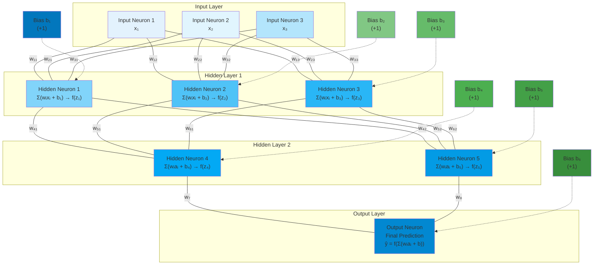
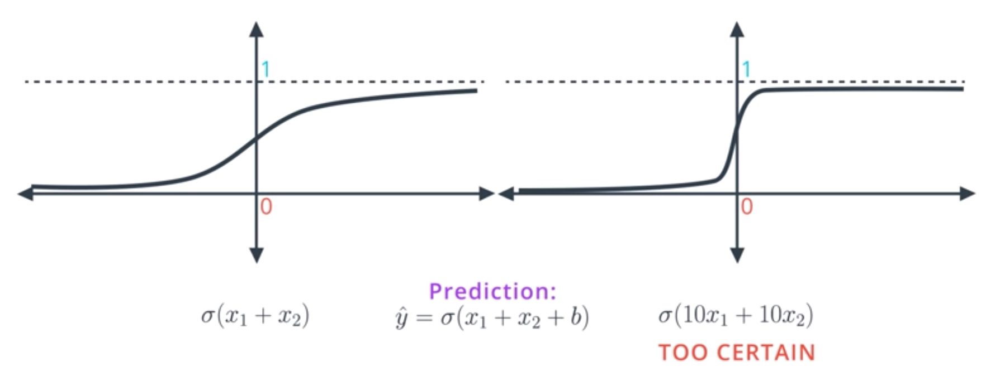
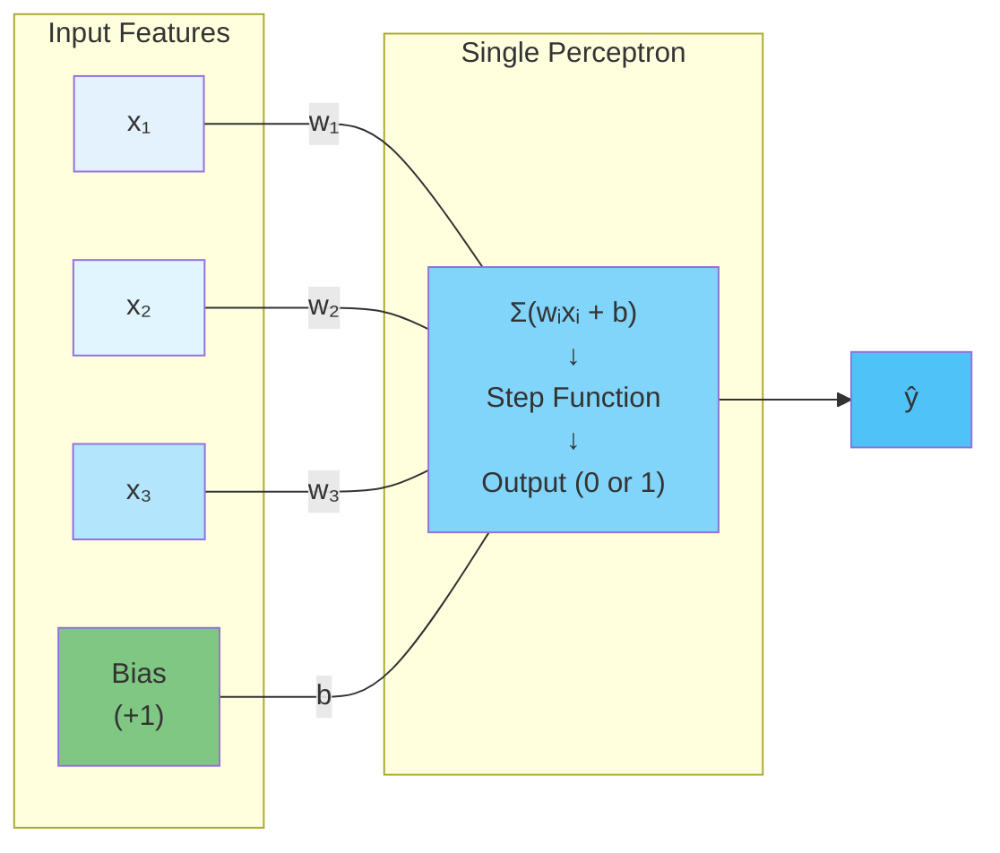
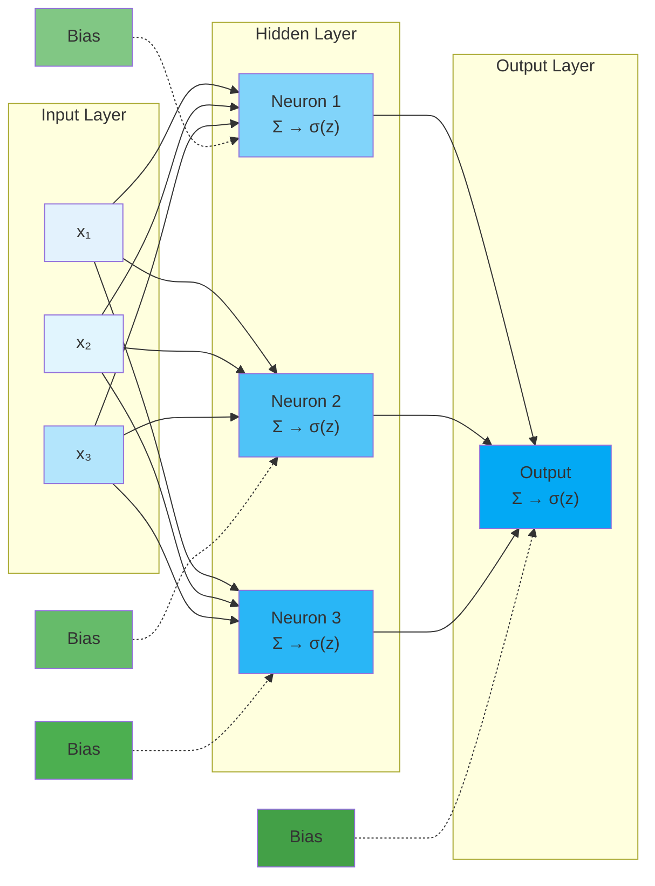
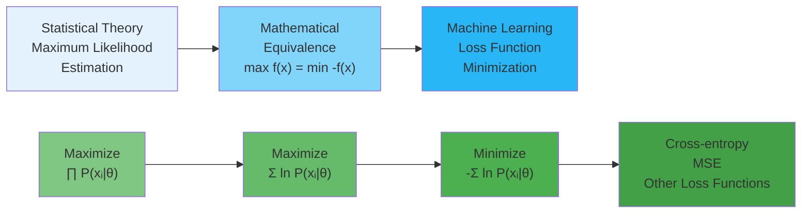

# C-1: Neural Network Foundations

1. Neural Networks Fundamentals
    - Basic Structure and Components
    - Forward Propagation Process
    - Activation Functions Overview
    - Neural Network Architectures
    - Input, Hidden, and Output Layers
2. The Perceptron Algorithm
    - Basic Formula and Components
    - Update Rules for Classification
    - Decision Boundaries and Linear Separability
    - Step Function Implementation
    - Limitations of Perceptrons
3. Loss Functions and Error Calculation
    - Log-Loss Error Function
    - Cross-Entropy for Binary Classification
    - Multi-Class Cross-Entropy
    - Mean Squared Error (MSE)
    - Maximum Likelihood Estimation

#### Neural Networks Fundamentals

Neural networks represent one of the most powerful approaches in machine learning, drawing inspiration from the
biological neural structures in animal brains. Though they've evolved far beyond their biological inspiration,
understanding their core components helps build a foundation for deeper exploration.

##### Basic Structure and Components

At their heart, neural networks are computational systems made up of interconnected processing units that work together
to transform input data into meaningful outputs. Think of them as information assembly lines where each worker (neuron)
performs a specific calculation before passing results to the next set of workers.

The essential building blocks include:

1. **Neurons (nodes)**: These are the fundamental processing units that receive inputs, apply transformations, and
   produce outputs. Each neuron performs a relatively simple mathematical operation, but their collective behavior
   enables complex computations.
2. **Weights**: Every connection between neurons has an associated weight value—essentially a number that determines how
   strongly the output from one neuron affects the next. These weights are the primary parameters that the network
   adjusts during learning.
3. **Bias**: This additional parameter allows neurons to shift their activation functions, giving the network more
   flexibility to fit patterns in data. You can think of bias as setting each neuron's "activation threshold."
4. **Activation function**: This mathematical function introduces non-linearity into the network, allowing it to learn
   complex patterns that would be impossible with purely linear operations. It determines whether and how strongly a
   neuron "fires" based on its inputs.
5. **Layers**: Neural networks organize neurons into layers that process information collectively:
    - **Input layer**: Receives and standardizes raw data
    - **Hidden layers**: Perform intermediate calculations and feature extraction
    - **Output layer**: Produces the final prediction or classification
6. **Connections**: The pathways through which information flows between neurons, creating the network's structure.

Here's a diagram illustrating the essential building blocks of neural networks:

This diagram illustrates all six essential building blocks:

1. **Neurons (nodes)**: Shown as boxes containing the mathematical operations each neuron performs
2. **Weights**: Labeled on the connections between neurons (w₁₁, w₁₂, etc.)
3. **Bias**: Shown as separate green nodes with dotted connections, representing the threshold adjustment
4. **Activation function**: Represented by f(z) in each neuron's computation
5. **Layers**: Clearly separated into Input, Hidden (2 layers), and Output layers
6. **Connections**: Solid lines showing information flow pathways between neurons

The mathematical notation shows how each neuron computes the weighted sum ($\sum {(w_i\ x_i + b)}$) and applies the
activation function $f(z)$ to produce its output. Mathematically, we can express what happens at a single neuron as:

$$
a = f\left(\sum_{i=1}^{n} w_i x_i + b\right)
$$

Where:

- $x_i$ represents each input value
- $w_i$ represents the weight for each input
- $b$ is the bias term
- $f$ is the activation function
- $a$ is the neuron's output

This formula shows how a neuron computes a weighted sum of its inputs, adds a bias term, and then applies an activation
function to produce an output. While simple, this operation forms the foundation of all neural network computations.

###### Understanding the Missing Z Term

$$
a = f\left(\sum_{i=1}^{n} w_i x_i + b\right)
$$

The $z$ term is implicitly contained within the parentheses. Let's make this explicit:

###### The Complete Two-Step Process

Neural network computation actually happens in two distinct steps:

**Step 1: Calculate the weighted sum (this is $z$)** $$z = \sum_{i=1}^{n} w_i x_i + b$$

**Step 2: Apply the activation function** $$a = f(z)$$

###### Rewriting the Original Formula

So the complete, explicit version should be written as:

$$
\begin{align}
&z = \sum_{i=1}^{n} w_i x_i + b \\
&a = f(z)
\end{align}
$$

Or in a single combined equation: $$a = f\left(z\right) \text{ where } z = \sum_{i=1}^{n} w_i x_i + b$$

###### Why This Distinction Matters

The $z$ term (often called the "pre-activation" or "logit") is crucial because:

1. **Backpropagation calculations**: We need to compute $\frac{\partial f}{\partial z}$ (the derivative of the
   activation function)
2. **Understanding saturation**: We analyze when $z$ values cause activation functions to saturate
3. **Initialization strategies**: We consider the distribution of $z$ values when initializing weights
4. **Batch normalization**: This technique normalizes the $z$ values before applying the activation function

###### Standard Notation in Neural Networks

In most neural network literature, this two-step process written explicitly:

- $z^{(l)} = W^{(l)}a^{(l-1)} + b^{(l)}$ (linear transformation)
- $a^{(l)} = f^{(l)}(z^{(l)})$ (activation function)

Where $l$ represents the layer number.

##### Forward Propagation Process

Forward propagation describes how information flows through a neural network from input to output. This fundamental
process occurs both when training the network and when using it to make predictions. Let's walk through this
step-by-step:

1. **Input Processing**: Data enters the network through the input layer. For example, in an image recognition task,
   each pixel might correspond to one input neuron.
2. **Hidden Layer Computation**: Each neuron in the first hidden layer:
    - Receives inputs from all (or some) neurons in the previous layer
    - Multiplies each input by its corresponding weight
    - Sums these weighted inputs and adds a bias term
    - Applies an activation function to this sum
    - Passes the result to the next layer
3. **Layer-by-Layer Progression**: This process repeats across all hidden layers, with each layer transforming the
   outputs from the previous layer into increasingly abstract representations of the original data.
4. **Output Generation**: The final layer produces the network's prediction, whether that's a classification (e.g.,
   "this image contains a cat") or a continuous value (e.g., "tomorrow's temperature will be 72°F").

We can represent this mathematically for a network with $L$ layers:

$$
\begin{align}
&a^{1} = f^{1}(W^{1}x + b^{1}) \\
&a^{2} = f^{2}(W^{2}a^{1} + b^{2}) \\
&\vdots \\
&a^{L} = f^{L}(W^{L}a^{L-1} + b^{L})
\end{align}
$$

Where:

- $a^{L}$ represents the activations (outputs) of layer $L$
- $W^{L}$ is the weight matrix for layer $L$
- $b^{L}$ is the bias vector for layer $L$
- $f^{L}$ is the activation function for layer $L$

This series of transformations allows neural networks to progressively extract and combine features from the raw input
data, enabling them to learn complex patterns and relationships.

##### Activation Functions Overview

Activation functions are crucial because they introduce non-linearity into neural networks. Without them, no matter how
many layers you add, your network would behave like a single linear layer—severely limiting what it can learn. Think of
activation functions as decision-makers within each neuron that determine how strongly it should "fire" based on its
inputs. Different activation functions create different behaviors:

1. **Sigmoid**: Maps any input to a value between 0 and 1, creating a smooth S-shaped curve. This function was
   historically popular but suffers from the "vanishing gradient problem"—with inputs far from zero, the function
   flattens, making learning difficult. It's useful in the output layer for binary classification. The sigmoid function
   is defined as:

    $$
          \sigma(x) = \frac{1}{1 + e^{-x}}
    $$

2. **Hyperbolic Tangent (tanh)**: Similar to sigmoid but maps inputs to values between -1 and 1.

    $$
    \tanh(x) = \frac{e^x - e^{-x}}{e^x + e^{-x}}
    $$

    This centered output range makes tanh useful in hidden layers, though it still faces vanishing gradient issues.

3. **Rectified Linear Unit (ReLU)**: Perhaps the most widely used activation function today.

    $$
    \text{ReLU}(x) = \max(0, x)
    $$

    ReLU simply outputs the input if it's positive, otherwise zero. This piecewise linear function is computationally
    efficient and helps mitigate vanishing gradients, accelerating training. However, it can suffer from "dying ReLU"
    problems where neurons permanently stop activating.

4. **Leaky ReLU**: A variant that allows a small slope for negative inputs.

    $$
    \text{Leaky ReLU}(x) = \max(\alpha x, x) \text{ where } \alpha \text{ is a small constant}
    $$

    This helps prevent dying neurons by allowing a small gradient when the input is negative.

5. **Softmax**: Used specifically in the output layer for multi-class classification.
    $$
    \text{softmax}(x_i) = \frac{e^{x_i}}{\sum_{j=1}^{n} e^{x_j}}
    $$
    Softmax converts a vector of raw outputs into a probability distribution across classes, ensuring outputs sum to 1.

Figure: Activation Functions

The choice of activation function significantly impacts how effectively and efficiently the network learns. Modern deep
learning typically uses ReLU or its variants in hidden layers, with sigmoid or softmax in the output layer depending on
the task.

##### Understanding the Vanishing Gradient Problem in Detail

The vanishing gradient problem is a fundamental challenge in training deep neural networks that occurs when gradients
become exponentially smaller as they propagate backward through the network layers during backpropagation. This
phenomenon effectively prevents early layers from learning, as their weight updates become negligibly small.

To understand why this happens with the sigmoid function, let's examine its derivative. The sigmoid function is defined
as:

$$
\sigma(x) = \frac{1}{1 + e^{-x}}
$$

Its derivative has the elegant form:

$$
\sigma'(x) = \sigma(x)(1 - \sigma(x))
$$

Let's substitute $x = 0$ into the sigmoid function when $x = 0$:

$$
\sigma(0) = \frac{1}{1 + e^{-0}} = 0.5
$$

Therefore, $\sigma(0) = 0.5$, which means:

$$
\sigma'(0) = \sigma(0)(1 - \sigma(0)) = 0.5 \times (1 - 0.5) = 0.5 \times 0.5 = 0.25
$$

This shows that the sigmoid function passes through the point $(0, 0.5)$, which is the center point of its S-shaped
curve, and this is where its derivative reaches its maximum value of $0.25$.

Let's examine what happens to the sigmoid function as $x$ approaches positive and negative infinity by substituting into
the sigmoid formula:

$$
\sigma(x) = \frac{1}{1 + e^{-x}}
$$

###### Case 1: When $x \to +\infty$

As $x$ becomes very large and positive:

- The term $-x$ becomes very large and negative
- Therefore, $e^{-x} \to 0$ (since $e$ raised to a very negative power approaches zero)
- The denominator becomes: $1 + e^{-x} \to 1 + 0 = 1$
- So: $\sigma(x) = \frac{1}{1 + e^{-x}} \to \frac{1}{1} = 1$

###### Case 2: When $x \to -\infty$

As $x$ becomes very large and negative:

- The term $-x$ becomes very large and positive
- Therefore, $e^{-x} \to +\infty$ (since $e$ raised to a very positive power grows without bound)
- The denominator becomes: $1 + e^{-x} \to 1 + \infty = \infty$
- So: $\sigma(x) = \frac{1}{1 + e^{-x}} \to \frac{1}{\infty} = 0$

To illustrate this behavior:

- $\sigma(10) = \frac{1}{1 + e^{-10}} = \frac{1}{1 + 0.000045} \approx 0.99995$
- $\sigma(20) = \frac{1}{1 + e^{-20}} = \frac{1}{1 + 2.06 \times 10^{-9}} \approx 0.999999998$
- $\sigma(-10) = \frac{1}{1 + e^{10}} = \frac{1}{1 + 22026} \approx 0.000045$
- $\sigma(-20) = \frac{1}{1 + e^{20}} = \frac{1}{1 + 4.85 \times 10^8} \approx 2.06 \times 10^{-9}$

This explains why the sigmoid function has horizontal asymptotes at $y = 0$ and $y = 1$, creating its characteristic
S-shaped curve that saturates at these extreme values.

For inputs with large absolute values, the derivative approaches zero:

- When $x \to +\infty$: $\sigma(x) \to 1$, so $\sigma'(x) \to 1 \times 0 = 0$
- When $x \to -\infty$: $\sigma(x) \to 0$, so $\sigma'(x) \to 0 \times 1 = 0$

We are calculating how the loss function changes with respect to small changes in the weights. Let's break this down
step-by-step, assuming you're new to this concept.

###### What Are We Actually Computing?

During backpropagation, gradients flow backward through the network using the chain rule. For a deep network with $L$
layers, the gradient of the loss function with respect to weights in early layers involves a product of derivatives:

$$
\frac{\partial L}{\partial W^{(1)}} = \frac{\partial L}{\partial a^{(L)}} \prod_{i=2}^{L} \frac{\partial a^{(i)}}{\partial z^{(i)}} \frac{\partial z^{(i)}}{\partial a^{(i-1)}} \frac{\partial a^{(1)}}{\partial z^{(1)}} \frac{\partial z^{(1)}}{\partial W^{(1)}}
$$

Where $\frac{\partial a^{(i)}}{\partial z^{(i)}} = \sigma'(z^{(i)})$ for sigmoid activation functions.

Since each $\sigma'(z^{(i)}) \leq 0.25$, and we're multiplying many such terms together, the gradient magnitude
decreases exponentially with network depth. For a $10$-layer network, in the worst case, gradients could be reduced by a
factor of $(0.25)^{10} \approx 9.5 \times 10^{-7}$.

When we write $\frac{\partial L}{\partial W^{(1)}}$, we're asking: "If I make a tiny change to the weights in the first
layer, how much will the final loss change?" This tells us:

- **Direction**: Should we increase or decrease these weights?
- **Magnitude**: How much should we change them?

This information guides the learning process - we adjust weights in the direction that reduces the loss.

###### The Chain of Dependencies

In a neural network, changing weights in early layers affects the final loss through a chain of dependencies:

$$
\text{Weights}^{(1)} \to \text{Layer 1 Output} \to \text{Layer 2 Output} \to \cdots \to \text{Final Output} \to \text{Loss}
$$

Each arrow represents a mathematical relationship where changing the input affects the output.

###### Why We Need the Chain Rule

Since the loss depends on the weights through this chain of intermediate calculations, we use the chain rule from
calculus to compute the total effect. The chain rule tells us:

> "To find how a change in input affects the final output through a chain of functions, multiply the rates of change at
> each step."

###### Breaking Down the Formula

Let's examine this formula piece by piece:

$$
\frac{\partial L}{\partial W^{(1)}} = \frac{\partial L}{\partial a^{(L)}} \prod_{i=2}^{L} \frac{\partial a^{(i)}}{\partial z^{(i)}} \frac{\partial z^{(i)}}{\partial a^{(i-1)}} \frac{\partial a^{(1)}}{\partial z^{(1)}} \frac{\partial z^{(1)}}{\partial W^{(1)}}
$$

**Term 1: $\frac{\partial L}{\partial a^{(L)}}$**

- How much does the loss change when the final layer's output changes?
- This is where the loss function (like cross-entropy) comes into play

**Term 2: $\prod_{i=2}^{L} \frac{\partial a^{(i)}}{\partial z^{(i)}} \frac{\partial z^{(i)}}{\partial a^{(i-1)}}$**

- This product represents the chain of changes through all intermediate layers
- $\frac{\partial a^{(i)}}{\partial z^{(i)}}$ is the derivative of the activation function (like sigmoid)
- $\frac{\partial z^{(i)}}{\partial a^{(i-1)}}$ represents how the weighted sum changes with the previous layer's output

**Term 3: $\frac{\partial a^{(1)}}{\partial z^{(1)}} \frac{\partial z^{(1)}}{\partial W^{(1)}}$**

- How the first layer's activation and weighted sum respond to weight changes

###### A Simple Example

Imagine a $3$-layer network where we want to find $\frac{\partial L}{\partial W^{(1)}}$:

1. **Direct path**: $W^{(1)} \to z^{(1)} \to a^{(1)} \to z^{(2)} \to a^{(2)} \to z^{(3)} \to a^{(3)} \to L$
2. **Chain rule application**:
    $$
    \frac{\partial L}{\partial W^{(1)}} = \frac{\partial L}{\partial a^{(3)}} \cdot \frac{\partial a^{(3)}}{\partial z^{(3)}} \cdot \frac{\partial z^{(3)}}{\partial a^{(2)}} \cdot \frac{\partial a^{(2)}}{\partial z^{(2)}} \cdot \frac{\partial z^{(2)}}{\partial a^{(1)}} \cdot \frac{\partial a^{(1)}}{\partial z^{(1)}} \cdot \frac{\partial z^{(1)}}{\partial W^{(1)}}
    $$

###### Where the Vanishing Gradient Problem Occurs

Notice that we're **multiplying** many terms together. For sigmoid activations:

- Each $\frac{\partial a^{(i)}}{\partial z^{(i)}} = \sigma'(z^{(i)}) \leq 0.25$
- If we have $5$ layers with sigmoid activations, we multiply $5$ terms that are each $\leq 0.25$
- Worst case: $(0.25)^5 = 0.00098$ - the gradient becomes nearly $1000$ times smaller!

###### The Practical Impact

This means:

- **Early layers** (like layer $1$) receive tiny gradient signals
- **Later layers** (like layer $L$) receive much stronger signals
- **Result**: Early layers barely learn while later layers adapt quickly
- **Consequence**: The network fails to learn good feature representations in early layers

This mathematical reality explains why deep networks with sigmoid activations were historically difficult to train, and
why modern networks use ReLU activations (where the derivative is $1$ for positive inputs, avoiding this multiplication
problem).

###### Practical Consequences

The vanishing gradient problem manifests in several ways:

1. **Slow Learning in Early Layers**: The first few layers of the network receive extremely small gradient signals,
   causing their weights to update very slowly or not at all.
2. **Gradient Saturation**: When neurons consistently receive inputs that push the sigmoid into its saturation regions
   (very positive or very negative values), they become stuck with near-zero gradients.
3. **Training Inefficiency**: Deep networks may appear to stop learning after initial epochs, as only the final layers
   continue to adapt while earlier layers remain essentially frozen.
4. **Poor Feature Learning**: Since early layers are responsible for learning fundamental features from raw input, their
   inability to update prevents the network from developing meaningful representations.

###### Numerical Example

Consider a simple $5$-layer network where each hidden layer uses sigmoid activation. If each layer's pre-activation
values fall into the saturation region where $\sigma'(z) = 0.1$:

- Gradient reaching layer $4$: $1.0 \times 0.1 = 0.1$
- Gradient reaching layer $3$: $0.1 \times 0.1 = 0.01$
- Gradient reaching layer $2$: $0.01 \times 0.1 = 0.001$
- Gradient reaching layer $1$: $0.001 \times 0.1 = 0.0001$

The first layer receives gradients that are $10,000$ times smaller than those received by the final layer, making
effective learning virtually impossible.

###### Historical Impact

This problem severely limited the effectiveness of deep neural networks in the $1990$s and early $2000$s, contributing
to the "AI winter" period. Researchers found that networks with more than $2$-$3$ hidden layers often performed worse
than shallow networks, not because of insufficient representational capacity, but because of training difficulties
caused by vanishing gradients.

###### Solutions and Modern Approaches

The vanishing gradient problem led to several important innovations:

1. **ReLU Activation Functions**: $\text{ReLU}(x) = \max(0, x)$ has a derivative of $1$ for positive inputs, eliminating
   the gradient attenuation problem for active neurons.
2. **Residual Connections**: Skip connections allow gradients to flow directly to earlier layers, bypassing the
   multiplicative chain.
3. **Batch Normalization**: Normalizing layer inputs helps maintain gradients in more favorable ranges.
4. **LSTM/GRU**: For recurrent networks, these architectures use gating mechanisms to control gradient flow.
5. **Gradient Clipping**: Preventing gradients from becoming too small (or too large) through explicit bounds.

Understanding the vanishing gradient problem is crucial because it explains why certain architectural choices (like ReLU
activations) became standard in modern deep learning, and why techniques like residual connections and normalization are
so effective for training very deep networks. Please, mind that all the discussion about the vanishing gradient problem
is specifically in the context of **backpropagation** - the algorithm used to train neural networks.

##### Summary: The Vanishing Gradient Problem

During **forward propagation**:

- We compute $z = \sum w_i x_i + b$
- Then apply $a = \sigma(z)$
- The sigmoid saturation doesn't directly hurt us here

During **backpropagation**:

- We need to compute gradients: $\frac{\partial L}{\partial W}$
- This requires the **derivative** $\sigma'(z)$
- When $\sigma'(z) \approx 0$ (due to saturation), gradients vanish

###### The Chain Rule Connection

In backpropagation, we use the chain rule:

$$
\frac{\partial L}{\partial W^{(1)}} = \frac{\partial L}{\partial a^{(L)}} \prod_{i=2}^{L} \sigma'(z^{(i)}) \cdot \text{other terms}
$$

The problem occurs because:

- Each $\sigma'(z^{(i)}) \leq 0.25$ (and often much smaller when saturated)
- We **multiply** these small derivatives together
- The product becomes exponentially small for deep networks

###### The Mathematical Reality

During backpropagation through $L$ layers:

$$
\frac{\partial L}{\partial W^{(1)}} \propto \prod_{i=1}^{L} \sigma'(z^{(i)})
$$

**Best case scenario** (all derivatives at maximum):

- Each layer: $\sigma'(z^{(i)}) = 0.25$
- $5$-layer network: $(0.25)^5 = 0.00098$
- $10$-layer network: $(0.25)^{10} \approx 9.5 \times 10^{-7}$

**Realistic scenario** (some saturation):

- Some layers: $\sigma'(z^{(i)}) = 0.05$
- $5$-layer network: $(0.05)^5 = 3.125 \times 10^{-7}$

###### Why It's Called "Vanishing"

The term "vanishing" is used because:

- Gradients literally **disappear** (approach zero)
- Early layers receive **negligible** learning signals
- Weight updates become so small they're **effectively zero**
- Learning **vanishes** for deeper layers in the network

###### The Practical Impact

This means:

- Layer $1$: Receives gradient $\times 10^{-6}$ (barely learns)
- Layer $5$: Receives gradient $\times 1$ (learns normally)
- **Result**: Deep networks couldn't be effectively trained with sigmoid activations

This multiplication of small values during backpropagation is precisely why the gradients "vanish" and why sigmoid
activations became problematic for deep learning.

###### Forward Pass vs. Backward Pass

| Forward Propagation                 | Backpropagation                  |
| ----------------------------------- | -------------------------------- |
| Uses $\sigma(z)$                    | Uses $\sigma'(z)$                |
| Saturation → output near $0$ or $1$ | Saturation → derivative near $0$ |
| Network still produces predictions  | Gradients vanish, learning stops |

###### The Learning Problem

The vanishing gradient problem specifically prevents **learning** because:

- Small gradients → tiny weight updates
- Early layers receive almost no learning signal
- Network cannot improve its internal representations

The entire discussion about sigmoid saturation and vanishing gradients is fundamentally about the challenges that arise
during the **backpropagation training process**, not during forward inference. The vanishing gradient problem occurs
during backpropagation when gradients become exponentially smaller as they propagate backward through deep neural
networks, preventing early layers from learning effectively.

###### Why It Happens with Sigmoid

1. **Sigmoid derivative limitation**: $\sigma'(z) = \sigma(z)(1-\sigma(z)) \leq 0.25$ (maximum at $z = 0$)
2. **Saturation problem**: For large $|z|$, $\sigma'(z) \to 0$
3. **Chain rule multiplication**: Backpropagation multiplies these derivatives together

##### Vanishing Gradient Problem of Tanh

The tanh function suffers from the exact same vanishing gradient issue as sigmoid, despite some improvements.

###### Tanh Derivative Analysis

The tanh derivative is:

$$
\tanh'(x) = 1 - \tanh^2(x)
$$

**Maximum value**:

$$
\tanh'(0) = 1 - \tanh^2(0) = 1 - 0^2 = 1
$$

**Saturation behavior**:

- When $x \to +\infty$: $\tanh(x) \to 1$, so $\tanh'(x) \to 1 - 1^2 = 0$
- When $x \to -\infty$: $\tanh(x) \to -1$, so $\tanh'(x) \to 1 - (-1)^2 = 0$

###### Comparison: Tanh vs Sigmoid

| Function | Maximum Derivative | Saturation Behavior            |
| -------- | ------------------ | ------------------------------ | --- | --- |
| Sigmoid  | $0.25$             | $\sigma'(z) \to 0$ for large $ | z   | $   |
| Tanh     | $1.0$              | $\tanh'(z) \to 0$ for large $  | z   | $   |

###### Why Tanh Is "Better" But Still Problematic

**Improvement over sigmoid**:

- Higher maximum gradient ($1.0$ vs $0.25$) means less severe attenuation
- Zero-centered output reduces some optimization challenges

**Still has vanishing gradients**:

- During saturation: $\tanh'(z) \to 0$
- Deep networks: $\prod_{i=1}^{L} \tanh'(z^{(i)}) \to 0$ when layers saturate
- Chain rule multiplication still causes exponential decay

###### Numerical Example

For a $5$-layer network where each layer saturates moderately ($\tanh'(z) = 0.1$):

- Total gradient attenuation: $(0.1)^5 = 0.00001$
- Early layers receive gradients $100,000$ times smaller than final layers

###### The Fundamental Issue Remains

Both sigmoid and tanh share the same core problem:

- **Saturation regions** where derivatives approach zero
- **Bounded derivatives** that multiply together during backpropagation
- **Exponential gradient decay** in deep networks

This is why modern deep learning moved to **ReLU activations**, where $\text{ReLU}'(z) = 1$ for positive inputs,
completely avoiding the multiplication problem for active neurons.

While tanh offers some improvements over sigmoid, it fundamentally suffers from the same vanishing gradient problem that
plagued deep learning before ReLU became standard.

##### Understanding the Dying ReLU Problem

The "dying ReLU" problem occurs when ReLU neurons become permanently inactive during training, outputting zero for all
inputs and never recovering. Once a neuron "dies," it cannot contribute to learning since it receives no gradient
signal.

###### How ReLU Works

The ReLU function is defined as:

$$
\text{ReLU}(z) = \max(0, z) = \begin{cases} z & \text{if } z > 0 \\ 0 & \text{if } z \leq 0 \end{cases}
$$

Its derivative is:

$$
\text{ReLU}'(z) = \begin{cases} 1 & \text{if } z > 0 \\ 0 & \text{if } z \leq 0 \end{cases}
$$

###### The Problem Mechanism

**Step 1: Neuron receives negative input**

- For some input $\mathbf{x}$, the weighted sum becomes: $z = \mathbf{w} \cdot \mathbf{x} + b < 0$
- ReLU output: $\text{ReLU}(z) = 0$

**Step 2: Zero gradient during backpropagation**

- Since $z < 0$, the derivative is: $\text{ReLU}'(z) = 0$
- Gradient flowing back: $\frac{\partial L}{\partial \mathbf{w}} = 0 \times \text{other terms} = 0$

**Step 3: No weight updates**

- With zero gradients, weights don't change:

    $$
    \mathbf{w}_{\text{new}} = \mathbf{w}_{\text{old}} - \alpha \times 0 = \mathbf{w}_{\text{old}}
    $$

- Bias also remains unchanged:
    $$
    b_{\text{new}} = b_{\text{old}}
    $$

**Step 4: Permanent death**

- If the neuron consistently receives negative inputs across all training examples, it never recovers
- The weights and bias remain frozen, making the neuron permanently inactive

###### Mathematical Example

Consider a neuron with weights $\mathbf{w} = [-2, -1]$ and bias $b = -0.5$:

For various inputs:

- Input $[1, 1]$: $z = (-2)(1) + (-1)(1) + (-0.5) = -3.5 < 0$ → Output: $0$
- Input $[0.5, 0.3]$: $z = (-2)(0.5) + (-1)(0.3) + (-0.5) = -1.8 < 0$ → Output: $0$
- Input $[2, 1]$: $z = (-2)(2) + (-1)(1) + (-0.5) = -5.5 < 0$ → Output: $0$

Since all inputs produce negative $z$ values, this neuron always outputs zero and receives zero gradients.

###### Common Causes

**1. Poor Weight Initialization**

- Weights initialized with large negative values
- Bias terms set too negative
- Example: All weights initialized to $-1.0$ with bias $-2.0$

**2. High Learning Rates**

- Large weight updates can push weights into consistently negative regions
- Single bad update can "kill" a previously active neuron
- Example: $\mathbf{w}_{\text{new}} = \mathbf{w}_{\text{old}} - 10.0 \times \text{large gradient}$

**3. Data Distribution Issues**

- Input features heavily skewed toward positive values
- Poor data preprocessing or normalization
- Adversarial examples during training

**4. Accumulated Negative Bias**

- Over many iterations, bias terms drift toward large negative values
- Particularly problematic in deep networks where small biases accumulate

###### Real-World Impact

**Network Capacity Reduction**:

- In a $100$-neuron layer, if $30%$ die, effective capacity drops to $70$ neurons
- Represents wasted computational resources and reduced learning ability

**Performance Degradation**:

- Dead neurons cannot contribute to complex pattern recognition
- Network loses representational power
- May require more neurons to achieve same performance

###### Solutions to Dying ReLU

**1. Leaky ReLU**
$$\text{Leaky ReLU}(z) = \begin{cases} z & \text{if } z > 0 \\ \alpha z & \text{if } z \leq 0 \end{cases}$$ where
$\alpha = 0.01$ provides small but non-zero gradients for negative inputs.

**2. Parametric ReLU (PReLU)**
$$\text{PReLU}(z) = \begin{cases} z & \text{if } z > 0 \\ \alpha_i z & \text{if } z \leq 0 \end{cases}$$ where
$\alpha_i$ is learned during training for each neuron.

**3. Exponential Linear Unit (ELU)**
$$\text{ELU}(z) = \begin{cases} z & \text{if } z > 0 \\ \alpha(e^z - 1) & \text{if } z \leq 0 \end{cases}$$

**4. Proper Initialization**

- Xavier/Glorot initialization: $\mathbf{w} \sim \mathcal{N}(0, \frac{2}{n_{\text{in}} + n_{\text{out}}})$
- He initialization: $\mathbf{w} \sim \mathcal{N}(0, \frac{2}{n_{\text{in}}})$

**5. Learning Rate Management**

- Use adaptive learning rates (Adam, RMSprop)
- Implement learning rate scheduling
- Gradient clipping to prevent large updates

###### Detection Methods

**During Training**:

- Monitor percentage of zero activations per layer
- Track gradient magnitudes across layers
- Observe weight distribution changes

The dying ReLU problem illustrates the trade-off in activation function design: while ReLU solved the vanishing gradient
problem, it introduced a new challenge that required further innovations in activation function design and training
practices.

##### Neural Network Architectures

Neural networks come in various architectures, each designed to excel at different types of problems. Understanding
these architectures helps in selecting the right tool for specific tasks.

1. **Feedforward Neural Networks (FNN)**: The simplest architecture where information flows in only one direction—from
   input to output with no loops or cycles. These networks are the foundation of deep learning and work well for basic
   classification and regression tasks with tabular data.
2. **Convolutional Neural Networks (CNN)**: Specialized for processing grid-like data, particularly images. CNNs use:
    - Convolutional layers that apply filters to detect patterns regardless of their position
    - Pooling layers that reduce dimensionality while preserving important features
    - These enable CNNs to automatically learn hierarchical features—from simple edges to complex objects
3. **Recurrent Neural Networks (RNN)**: Designed for sequential data like time series or text. Unlike feedforward
   networks, RNNs have connections that form cycles, allowing them to maintain an internal "memory" of previous inputs.
   This makes them well-suited for tasks where context matters, like language modeling or speech recognition.
4. **Long Short-Term Memory (LSTM) Networks**: A sophisticated RNN variant that addresses the vanishing gradient problem
   in standard RNNs. LSTMs use special memory cells with gates that control information flow, allowing them to learn
   long-term dependencies in sequential data—crucial for tasks like machine translation.
5. **Transformer Networks**: Modern architectures that revolutionized natural language processing. Instead of processing
   data sequentially like RNNs, transformers use "attention mechanisms" to process all elements of a sequence
   simultaneously while weighing their relationships. This parallel processing enables more efficient training and
   better performance on many language tasks.
6. **Autoencoders**: Networks designed to learn efficient representations of data. They have an encoder that compresses
   input data and a decoder that attempts to reconstruct the original input. Useful for dimensionality reduction,
   feature learning, and generative modeling.
7. **Generative Adversarial Networks (GANs)**: A framework involving two neural networks—a generator and a
   discriminator—competing against each other. The generator creates synthetic data while the discriminator tries to
   distinguish between real and fake examples. This adversarial process leads to remarkably realistic data generation.

Each architecture represents a different approach to leveraging neural networks' computational capacity. The field
continues to evolve with hybrid architectures that combine elements from multiple approaches to tackle increasingly
complex problems.

##### Input, Hidden, and Output Layers

Understanding the distinct roles of different layer types helps clarify how neural networks transform raw data into
useful outputs.

1. **Input Layer**

    The input layer serves as the network's sensory system, receiving raw data and preparing it for processing. Key
    characteristics include:

    - One neuron for each feature in your dataset (e.g., each pixel in an image or each word in a text)
    - Minimal processing—typically just normalization to standardize the scale of input values
    - No activation function is applied at this stage
    - Acts as a distribution point, passing data to the first hidden layer

    For example, in a network analyzing $28×28$ pixel images, the input layer would have $784$ neurons ($28×28$), each
    representing the intensity of one pixel.

2. **Hidden Layers**

    Hidden layers form the "thinking" part of the network, progressively transforming raw data into increasingly
    abstract representations. Their characteristics include:

    - Multiple neurons working in parallel to extract different aspects of the data
    - Each layer builds upon features detected by previous layers
    - Early layers detect simple patterns; deeper layers combine these into complex concepts
    - The number and size of these layers define the network's capacity and complexity

    For instance, in an image recognition network:

    - First hidden layer: Might detect edges and simple textures
    - Middle layers: Combine these into shapes and parts
    - Deeper layers: Recognize complex objects by combining simpler components

    Deep networks with many hidden layers excel at learning hierarchical representations of data, but require more data
    and computational resources to train effectively.

3. **Output Layer**

    The output layer produces the final result, structured according to the specific task:

    - For regression problems: Typically one neuron per output variable, often with a linear activation function
    - For binary classification: Often a single neuron with sigmoid activation, producing a value between 0 and 1
      representing probability
    - For multi-class classification: One neuron per class with softmax activation, creating a probability distribution
      across all possible classes

    The output layer's design directly relates to the problem being solved. For example, a network predicting stock
    prices might have a single output neuron, while a network classifying handwritten digits would have ten output
    neurons (for digits 0-9).

The interaction between these layer types creates the network's computational pipeline. Input data flows through
increasingly abstract transformations in the hidden layers before emerging as a prediction or classification in the
output layer. The depth (number of layers) and width (neurons per layer) of this pipeline determine both what the
network can learn and how efficiently it can learn it.

##### The Perceptron Algorithm

The perceptron represents the earliest form of neural network and serves as the foundational building block for more
complex architectures. Developed by Frank Rosenblatt in 1957, this elegantly simple algorithm introduces key concepts
that remain relevant in today's deep learning landscape.

###### Basic Formula and Components

The perceptron implements a binary classifier that attempts to separate data points into two categories using a linear
boundary. Think of it as drawing a straight line (or in higher dimensions, a flat plane) that best divides two groups of
points.

At its core, the perceptron consists of these essential components:

1. **Input Features**: These are the characteristics of your data, represented as a vector
   $\mathbf{x} = (x_1, x_2, ..., x_n)$. For instance, if you're classifying flowers, the features might include petal
   length, petal width, and stem length.
2. **Weights**: The perceptron assigns importance values to each input feature through a weight vector
   $\mathbf{w} = (w_1, w_2, ..., w_n)$. These weights determine how much influence each feature has on the final
   classification decision. During training, these weights are adjusted to improve performance.
3. **Bias**: A bias term $b$ (sometimes written as $w_0$) acts like an adjustable threshold, shifting the decision
   boundary away from the origin. Without a bias, the decision boundary would always pass through the origin, severely
   limiting what the perceptron can learn.
4. **Activation Function**: The perceptron uses a step function that produces a binary output—typically 0 or 1
   (sometimes -1 or 1)—based on whether the weighted sum of inputs exceeds the threshold.

The perceptron's prediction formula can be written as:

$$
\hat{y} = \begin{cases} 1 & \text{if } \mathbf{w} \cdot \mathbf{x} + b > 0 \\ 0 & \text{otherwise} \end{cases}
$$

Or more succinctly:

$$
\large  \hat{y} = \text{step}(\mathbf{w} \cdot \mathbf{x} + b)
$$

Where $\mathbf{w} \cdot \mathbf{x}$ represents the dot product of the weight and input vectors, calculating the weighted
sum of all inputs. We can simplify the equation by absorbing the bias term into the weight vector through a mathematical
trick. Lets discuss this step by step:

Starting with the original prediction formula:

$$
\large  \hat{y} = \text{step}(\mathbf{w} \cdot \mathbf{x} + b)
$$

This represents the weighted sum of inputs plus a bias term, passed through a step function. The dot product expands to:

$$
\large \mathbf{w} \cdot \mathbf{x} + b = w_1x_1 + w_2x_2 + ... + w_nx_n + b
$$

The original perceptron algorithm is designed for **single-layer networks only**. However, there are extensions to
multi-layer architectures.

###### Single-Layer Perceptron Diagram

###### Multi-Layer Perceptron (MLP) Diagram

###### Key Differences

**Single-Layer Perceptron:**

- **One computational layer** (the perceptron itself)
- **Step activation function**: $\text{step}(z)$
- **Perceptron learning rule**: $\mathbf{w}*{\text{new}} = \mathbf{w}*{\text{old}} + \alpha(y - \hat{y})\mathbf{x}$
- **Linear separability only**: Can only solve linearly separable problems
- **No hidden layers**: Direct input-to-output mapping

**Multi-Layer Perceptron (MLP):**

- **Multiple computational layers** (hidden + output)
- **Differentiable activations**: Sigmoid, tanh, ReLU (not step function)
- **Backpropagation**: Uses gradient-based learning
- **Non-linear problems**: Can solve XOR and other non-linearly separable problems
- **Hidden layers**: Enable complex feature learning

###### Important Distinction

The term "perceptron" can be confusing:

1. **Original Perceptron (1957)**: Single-layer with step function
2. **Multi-Layer Perceptron (MLP)**: Modern term for feedforward neural networks

The **original perceptron algorithm** we discussed (with the update rule
$\mathbf{w}*{\text{new}} = \mathbf{w}*{\text{old}} + \alpha(y - \hat{y})\mathbf{x}$) only works for single-layer
networks.

###### Why Single-Layer Limitation?

The perceptron learning rule assumes:

- **Binary output**: Step function produces $0$ or $1$
- **Direct error calculation**: $(y - \hat{y})$ is simple for single output
- **No chain rule needed**: No intermediate layers to propagate through

For multi-layer networks, you need:

- **Differentiable activations**: To compute gradients
- **Backpropagation**: To propagate errors through layers
- **Continuous updates**: Gradients can be any real number

So the classic perceptron is inherently single-layer, but the concept inspired the development of multi-layer neural
networks trained with backpropagation. Now, the mathematical insight is that we can treat the bias term $b$ as if it
were another weight, but multiplied by a constant input of 1. To do this:

1. We add a new input feature $x_0 = 1$ that's always equal to 1 for any input example
2. We create a new weight $w_0 = b$ corresponding to this input
3. Our new expanded vectors become:
    - New weight vector: $\large \mathbf{w}_{\text{new}} = (w_0, w_1, ..., w_n) = (b, w_1, ..., w_n)$
    - New input vector: $\large \mathbf{x}_{\text{new}} = (x_0, x_1, ..., x_n) = (1, x_1, ..., x_n)$

Now when we calculate the dot product of these new vectors:

$$
\large
\begin{align}
\mathbf{w}_{\text{new}} \cdot \mathbf{x}_{\text{new}} &= \large  w_0x_0 + w_1x_1 + ... + w_nx_n \\
&= b \cdot 1 + w_1x_1 + ... + w_nx_n \\
&= b + w_1x_1 + ... + w_nx_n
\end{align}
$$

Which is exactly the same as our original $\mathbf{w} \cdot \mathbf{x} + b$ where it's understood that $\mathbf{w}$ and
$\mathbf{x}$ now include the bias term and the constant 1 input, respectively. This simplification is elegant because it
lets us treat the bias just like any other weight parameter, streamlining both the mathematical notation and the
implementation. It turns what was originally "a dot product plus a constant" into just "a dot product."

This elegant formulation shows that the perceptron makes decisions by calculating a weighted sum and comparing it to a
threshold—effectively implementing a linear decision boundary in the feature space.

##### Update Rules for Classification

The perceptron learns through a surprisingly simple error-driven process. When it misclassifies a data point, it adjusts
its weights to reduce the likelihood of making the same mistake again. This learning process follows a straightforward
update rule.

Imagine you're training a perceptron on a dataset where each point has features $(p, q)$ and a true label $y$ (either 0
or 1). For each training example:

1. The perceptron makes a prediction $\hat{y}$ using the current weights.

2. If the prediction is correct ($\hat{y} = y$), no change is needed.

3. If the prediction is incorrect, the weights are updated as follows:

    $$
    \begin{align}
    \text{False Positive: } y = 0, \hat{y} = 1 \text{ (predicted 1, true is 0):} \\ \\
    w_1 &= w_1 - \alpha \cdot p \\
     w_2 &= w_2 - \alpha \cdot q \\
     b &= b - \alpha \\[0.5em]

    \text{False Negative: } y = 1, \hat{y} = 0 \text{ (predicted 0, true is 1):}   \\ \\
     w_1 &= w_1 + \alpha \cdot p  \\
     w_2 &= w_2 + \alpha \cdot q \\
     b &= b + \alpha
     \end{align}
    $$

Here, $\alpha$ is the learning rate—a positive value that controls how aggressively the weights are adjusted with each
update. The general form of this update rule can be expressed elegantly as:

$$
\large \mathbf{w}_{\text{new}} = \mathbf{w}_{\text{old}} + \alpha \cdot (y - \hat{y}) \cdot \mathbf{x}
$$

And for the bias:

$$
\large b_{\text{new}} = b_{\text{old}} + \alpha \cdot (y - \hat{y})
$$

##### Understanding the Perceptron Update Rule

This equation represents the **perceptron learning rule** - the algorithm that adjusts weights when the perceptron makes
a classification error. Let me break down each component:

###### Breaking Down the Formula

$$
\large \mathbf{w}_{\text{new}} = \mathbf{w}_{\text{old}} + \alpha \cdot (y - \hat{y}) \cdot \mathbf{x}
$$

Where,

- **$\mathbf{w}_{\text{new}}$**: The updated weight vector after learning from one example

- **$\mathbf{w}_{\text{old}}$**: The current weight vector before the update

- **$\alpha$**: The learning rate (a small positive constant, e.g., $0.1$)

- **$(y - \hat{y})$**: The prediction error

    - $y$ = true label ($0$ or $1$, sometimes $-1$ or $+1$)

    - $\hat{y}$ = predicted label from the perceptron

    - Error can be: $+1$, $-1$, or $0$

- **$\mathbf{x}$**: The input feature vector for the current training example

###### How the Error Term Works

The error term $(y - \hat{y})$ determines what happens:

**Case 1: Correct Prediction**

- $y = 1$, $\hat{y} = 1$ → $(y - \hat{y}) = 0$ → No weight change
- $y = 0$, $\hat{y} = 0$ → $(y - \hat{y}) = 0$ → No weight change

**Case 2: False Negative (should predict $1$, but predicted $0$)**

- $y = 1$, $\hat{y} = 0$ → $(y - \hat{y}) = +1$ → **Increase** weights
- Update: $\mathbf{w}_{\text{new}} = \mathbf{w}_{\text{old}} + \alpha \cdot \mathbf{x}$

**Case 3: False Positive (should predict $0$, but predicted $1$)**

- $y = 0$, $\hat{y} = 1$ → $(y - \hat{y}) = -1$ → **Decrease** weights
- Update: $\mathbf{w}_{\text{new}} = \mathbf{w}_{\text{old}} - \alpha \cdot \mathbf{x}$

###### Intuitive Understanding

**Why multiply by $\mathbf{x}$?**

- Features with larger values have more influence on the decision
- We adjust weights proportionally to how much each feature contributed
- If $x_i = 0$, that feature didn't contribute, so its weight shouldn't change

**Why this direction works:**

- **False negative**: We want the weighted sum $\mathbf{w} \cdot \mathbf{x}$ to be larger next time, so we add to the
  weights
- **False positive**: We want the weighted sum to be smaller next time, so we subtract from the weights

###### Concrete Example

Training example: $\mathbf{x} = [2, 1]$, true label $y = 1$

Current weights: $\mathbf{w}_{\text{old}} = [0.1, 0.3]$, learning rate $\alpha = 0.1$

**Step 1: Make prediction**

- $z = \mathbf{w} \cdot \mathbf{x} = 0.1 \times 2 + 0.3 \times 1 = 0.5$
- $\hat{y} = 1$ if $z > 0$, else $0$ → $\hat{y} = 1$

**Step 2: Check if correct**

- $y = 1$, $\hat{y} = 1$ → Correct! No update needed
- $(y - \hat{y}) = 0$, so $\mathbf{w}*{\text{new}} = \mathbf{w}*{\text{old}}$

**Alternative scenario**: If $\mathbf{w}_{\text{old}} = [-0.1, 0.1]$

- $z = -0.1 \times 2 + 0.1 \times 1 = -0.1$
- $\hat{y} = 0$ (since $z < 0$)
- Error: $(y - \hat{y}) = 1 - 0 = 1$
- Update: $\mathbf{w}_{\text{new}} = [-0.1, 0.1] + 0.1 \times 1 \times [2, 1] = [-0.1, 0.1] + [0.2, 0.1] = [0.1, 0.2]$

###### The Learning Effect

This update rule ensures that:

1. **Correct predictions** don't change the weights
2. **Incorrect predictions** move weights in a direction that would make the correct prediction more likely
3. **Learning rate** controls how aggressively we adjust weights
4. **Feature importance** is automatically considered through multiplication by $\mathbf{x}$

This simple rule, when applied repeatedly across all training examples, allows the perceptron to learn a linear decision
boundary that separates the two classes (assuming the data is linearly separable). First, we'll extend our vectors to
include the bias term directly in the weight vector, as we discussed earlier:

- Extended weight vector:

    $$
    \mathbf{W} = \large  [b, w_1, w_2, ..., w_n]^T
    $$

- Extended input vector:
    $$
    \mathbf{X} = \large [1, x_1, x_2, ..., x_n]^T
    $$

This single equation handles updates for both the bias and all weights simultaneously. The matrix multiplication
automatically computes each specific weight update correctly:

$$
\large
\begin{bmatrix}
b_{\text{new}} \\
w_{1,\text{new}} \\
w_{2,\text{new}} \\
\vdots \\
w_{n,\text{new}}
\end{bmatrix} = \begin{bmatrix}
b_{\text{old}} \\
w_{1,\text{old}} \\
w_{2,\text{old}} \\
\vdots \\
w_{n,\text{old}}
\end{bmatrix} + \alpha(y - \hat{y}) \begin{bmatrix}
1 \\
x_1 \\
x_2 \\
\vdots \\
x_n
\end{bmatrix}
$$

For the expanded equations, you can keep them as separate equations as you have them:

$$
\large
\begin{align}
&b_{\text{new}} = b_{\text{old}} + \alpha(y - \hat{y}) \cdot 1\\
&w_{1,\text{new}} = w_{1,\text{old}} + \alpha(y - \hat{y}) \cdot x_1\\
&w_{2,\text{new}} = w_{2,\text{old}} + \alpha(y - \hat{y}) \cdot x_2\\
&\vdots\\
&w_{n,\text{new}} = w_{n,\text{old}} + \alpha(y - \hat{y}) \cdot x_n\\
\end{align}
$$

This matrix formulation is particularly valuable when implementing the perceptron algorithm computationally, as it
allows us to update all weights in a single vectorized operation rather than using loops to update each weight
individually. It also highlights how the conceptual simplification of treating the bias as just another weight leads to
a cleaner mathematical representation.

For batch learning, where we update based on multiple examples at once, we can extend this further with data matrices
where each row represents one training example, making the perceptron algorithm even more computationally efficient.

This update rule has an intuitive interpretation:

- When the prediction is correct ($y = \hat{y}$), the error term $(y - \hat{y})$ is zero, so no update occurs.
- When the perceptron predicts 0 but the true label is 1, weights are increased in proportion to the input features,
  making that pattern more likely to be classified as positive next time.
- When the perceptron predicts 1 but the true label is 0, weights are decreased, making that pattern more likely to be
  classified as negative next time.

The learning rate $\alpha$ determines the step size of each update. A large learning rate means faster learning but
risks overshooting the optimal solution, while a small learning rate provides more precise updates but requires more
iterations to converge.

This update rule embodies a fundamental principle in machine learning: adjusting model parameters in proportion to their
contribution to the error, moving gradually toward better performance.

##### Decision Boundaries and Linear Separability

A key concept in understanding perceptrons is the idea of a decision boundary—the dividing line (or hyperplane in higher
dimensions) that separates classes in the feature space. For a perceptron with two input features, the decision boundary
is a straight line defined by:

$$
\large w_1 x_1 + w_2 x_2 + b = 0
$$

The decision boundary equation $w_1 x_1 + w_2 x_2 + b = 0$ represents the **threshold line** where the perceptron
switches between predicting class $0$ and class $1$​. The equation $z = w_1 x_1 + w_2 x_2 + b $ is specifically for **2
features**, but it generalizes to any number of features. The perceptron predicts based on the weighted sum:

$$
\large z = w_1 x_1 + w_2 x_2 + b
$$

Then applies the step function:

$$
\hat{y} = \begin{cases} 1 & \text{if } z > 0 \\ 0 & \text{if } z \leq 0 \end{cases}
$$

The decision boundary occurs exactly where the perceptron is **uncertain** - where $z = 0$:

$$
\large z = w_1 x_1 + w_2 x_2 + b
$$

**At this line:**

- The weighted sum equals zero
- The perceptron is at the threshold between classes
- Any point on this line has equal "influence" from both classes

###### Geometric Interpretation

**Points above the line** (where $w_1 x_1 + w_2 x_2 + b > 0$):

- Perceptron predicts class $1$
- These points are on the "positive" side

**Points below the line** (where $w_1 x_1 + w_2 x_2 + b < 0$):

- Perceptron predicts class $0$
- These points are on the "negative" side

**Points on the line** (where $w_1 x_1 + w_2 x_2 + b = 0$):

- Exactly at the decision threshold
- Technically classified as class $0$ (due to $\leq$ in step function)

###### Converting to Standard Line Form

We can rearrange the decision boundary equation into slope-intercept form:

$$
\large
\begin{align}
&w_1 x_1 + w_2 x_2 + b = 0 \\
&w_2 x_2 = -w_1 x_1 - b \\
&x_2 = -\frac{w_1}{w_2}x_1 - \frac{b}{w_2}
\end{align}
$$

This gives us:

- **Slope**: $\large m = -\frac{w_1}{w_2}$
- **Y-intercept**: $\large c = -\frac{b}{w_2}$

###### Example with Numbers

Consider weights $w_1 = 2$, $w_2 = 1$, bias $b = -3$:

**Decision boundary**: $2x_1 + x_2 - 3 = 0$

**Rearranged**: $x_2 = -2x_1 + 3$

**Testing points**:

- Point $(2, 1)$: $z = 2(2) + 1(1) + (-3) = 2 > 0$ → Predict class $1$
- Point $(1, 0)$: $z = 2(1) + 1(0) + (-3) = -1 < 0$ → Predict class $0$
- Point $(1, 1)$: $z = 2(1) + 1(1) + (-3) = 0$ → On boundary, predict class $0$

###### How Weights Affect the Boundary

**Weight $w_1$ (coefficient of $x_1$)**:

- Controls how much the line tilts based on $x_1$ values
- Larger $|w_1|$ makes the line more sensitive to $x_1$ changes

**Weight $w_2$ (coefficient of $x_2$)**:

- Controls how much the line tilts based on $x_2$ values
- Larger $|w_2|$ makes the line more sensitive to $x_2$ changes

**Bias $b$**:

- Shifts the entire line up or down
- Positive $b$ shifts line toward origin
- Negative $b$ shifts line away from origin

###### Why This Matters for Learning

During training, the perceptron adjusts $w_1$, $w_2$, and $b$ to:

- **Move the decision boundary** toward better separation
- **Rotate the line** (by changing weight ratios)
- **Shift the line** (by changing bias)

The goal is to position this linear boundary so it correctly separates the positive and negative training examples.

This geometric understanding explains why perceptrons can only solve **linearly separable** problems - they can only
create straight-line decision boundaries in $2$D (or hyperplanes in higher dimensions). In higher-dimensional spaces
with more features, this generalizes to a hyperplane:

$$
\large \mathbf{w} \cdot \mathbf{x} + b = 0
$$

The perceptron classifies points based on which side of this hyperplane they fall:

- Points where $\mathbf{w} \cdot \mathbf{x} + b > 0$ are classified as positive (class 1)
- Points where $\mathbf{w} \cdot \mathbf{x} + b < 0$ are classified as negative (class 0)

This brings us to the critical concept of linear separability. A dataset is linearly separable if there exists some
hyperplane that perfectly separates the positive examples from the negative examples. Mathematically, this means there's
some weight vector $\mathbf{w}$ and bias $b$ such that:

$$
\begin{align}
&\mathbf{w} \cdot \mathbf{x} + b > 0 \text{ for all positive examples} \\
&\mathbf{w} \cdot \mathbf{x} + b < 0 \text{ for all negative examples}
\end{align}
$$

The perceptron convergence theorem, proven by Rosenblatt, guarantees that if a dataset is linearly separable, the
perceptron algorithm will eventually find a separating hyperplane in a finite number of iterations. This was a
groundbreaking result that showed the algorithm's ability to learn from data. The examples help clarify this concept:

- A dataset with two clusters that can be separated by a straight line is linearly separable.
- The classic XOR problem (where points at (0,0) and (1,1) belong to one class, while points at (0,1) and (1,0) belong
  to another) is not linearly separable—no straight line can separate these points correctly.

The concept of linear separability defines both the power and the limitation of the perceptron. It can perfectly
classify any linearly separable dataset, but it fails completely on problems requiring nonlinear decision boundaries.

###### Step Function Implementation

The step function (also called the Heaviside function) is the activation function that gives the perceptron its binary
decision-making capability. It transforms the continuous weighted sum of inputs into a discrete binary output.

The standard step function is defined as:

$$
\text{step}(z) = \begin{cases} 1 & \text{if } z > 0 \\ 0 & \text{if } z \leq 0 \end{cases}
$$

In some implementations, the output values may be $\{1, -1\}$ instead of $\{1, 0 \}$:

$$
\text{step}(z) = \begin{cases} 1 & \text{if } z > 0 \\ -1 & \text{if } z \leq 0 \end{cases}
$$

The step function creates a sharp threshold—any weighted sum above zero produces one output value, while any sum at or
below zero produces another. This binary nature makes the perceptron's decisions clear-cut but also introduces
limitations. One critical characteristic of the step function is that its derivative is zero everywhere except at
$z = 0$, where it's undefined. This property has significant implications for training:

1. Traditional gradient-based optimization methods can't be directly applied, as they rely on non-zero gradients to
   guide weight updates.
2. The perceptron algorithm circumvents this issue by using the classification error directly to update weights, rather
   than trying to compute gradients of the step function.

While modern neural networks have mostly moved away from the step function in favor of differentiable activation
functions like sigmoid, ReLU, or tanh, understanding the step function remains important for grasping the historical
development of neural networks and the conceptual foundations of binary classification.

##### Limitations of Perceptrons

Despite their elegant simplicity, perceptrons face several significant limitations that led researchers to develop more
sophisticated neural network architectures.

1. **Linear Decision Boundary**: The most fundamental limitation is that perceptrons can only learn linear decision
   boundaries. This means they cannot solve problems that require nonlinear separation. The classic example is the XOR
   problem, where the pattern of inputs and outputs cannot be separated by any straight line.

    To visualize this: imagine trying to separate red and blue points that are arranged in a checkerboard pattern—no
    straight line can correctly separate all red points from all blue points.

2. **Binary Classification Only**: The basic perceptron is designed solely for binary classification tasks
   (distinguishing between two classes). Extending to multi-class problems requires multiple perceptrons or different
   architectures altogether.

3. **No Probabilistic Output**: Unlike logistic regression or modern neural networks, perceptrons output hard
   classifications (0 or 1) rather than probabilities. This makes them less useful in scenarios where you need
   confidence estimates or risk assessments along with predictions.

4. **Convergence Issues**: If the data is not linearly separable, the perceptron algorithm may never converge to a
   stable solution. Instead, the weights might oscillate indefinitely as the algorithm tries in vain to find a perfect
   separation. This can be particularly problematic in real-world datasets where perfect linear separation is rare.

5. **Sensitivity to Initial Conditions**: The final solution can depend heavily on the initial weight values and the
   order in which training examples are presented. This introduces an element of randomness into the learning process.

6. **Limited Representation Capacity**: As Marvin Minsky and Seymour Papert demonstrated in their influential 1969 book
   "Perceptrons," there are many simple functions that single-layer perceptrons cannot represent, regardless of the
   training algorithm used.

These limitations led to the first "AI winter" in the 1970s, as researchers became disillusioned with the perceptron's
capabilities. However, they also spurred research into multilayer networks and backpropagation—developments that
eventually led to the deep learning revolution decades later.

The multi-layer perceptron (MLP) was developed to address these limitations by:

- Using multiple layers of neurons to create non-linear decision boundaries
- Employing differentiable activation functions that allow gradients to flow through the network
- Enabling the learning of complex, hierarchical representations

Despite its limitations, the perceptron remains valuable as a conceptual building block that introduces fundamental
ideas in neural computation. Its simple update rule and geometric interpretation provide an accessible entry point for
understanding more complex neural network architectures. The perceptron's limitations also highlight why we need deeper
networks with non-linear activation functions to solve complex real-world problems.

##### Loss Functions and Error Calculation

Loss functions serve as the compass that guides neural networks during training, providing a quantitative measure of how
well (or poorly) the model is performing. These mathematical tools translate the disparity between predictions and
reality into a single number that the network works to minimize. Understanding loss functions is crucial because they
directly shape what your model learns and how effectively it learns it.

###### Log-Loss Error Function

The Log-Loss error function (also called logarithmic loss or binary cross-entropy) measures the performance of
classification models that output probabilities between 0 and 1.

Imagine you're building a system to detect fraudulent transactions. For each transaction, your model doesn't just make a
yes/no decision—it outputs a probability: "I'm 92% confident this transaction is fraudulent." Log-loss evaluates how
good these probability estimates are.

What makes log-loss special is how it penalizes confidence in wrong answers. If your model confidently predicts an 0.95
probability that a legitimate transaction is fraudulent, it receives a much harsher penalty than if it had been less
certain with a 0.6 prediction. This encourages your model to be cautious about making highly confident predictions
unless it has strong evidence. Mathematically, for a single prediction, log-loss is calculated as:

$$
\text{Log Loss} = -(y \log(p) + (1-y) \log(1-p))
$$

Where:

- $y$ is the actual outcome (0 or 1)
- $p$ is your predicted probability for class 1

Let's break this down with examples:

1. **Perfect prediction**: You predict $p = 1.0$ for a positive example ($y = 1$)
    - Log-loss = $-(1 \times \log(1) + 0 \times \log(0)) = -(0) = 0$
    - Zero loss - a perfect score!
2. **Good prediction**: You predict $p = 0.8$ for a positive example ($y = 1$)
    - Log-loss = $-(1 \times \log(0.8) + 0 \times \log(0.2)) = -(\log(0.8)) \approx 0.22$
    - Low but non-zero loss - pretty good!
3. **Terrible prediction**: You predict $p = 0.01$ for a positive example ($y = 1$)
    - Log-loss = $-(1 \times \log(0.01) + 0 \times \log(0.99)) = -(\log(0.01)) \approx 4.6$
    - Very high loss - you were confident in the wrong direction!

For a full dataset with $N$ observations, we average these individual losses:

$$
\text{Log Loss} = -\frac{1}{N} \sum_{i=1}^{N} [y_i \log(p_i) + (1-y_i) \log(1-p_i)]
$$

This function has several important properties:

1. **Asymmetric penalty**: As your prediction approaches 0 for a positive example (or 1 for a negative example), the
   loss approaches infinity. This prevents the model from being absolutely certain about wrong predictions.
2. **Smooth gradient**: Unlike accuracy metrics that produce "jumpy" signals when predictions cross a threshold,
   log-loss provides a smooth gradient that's useful for optimization algorithms.
3. **Probabilistic interpretation**: Log-loss directly connects to the concept of likelihood in statistics, representing
   how probable the observed data is given your model's predictions.

When visualized, log-loss creates a curve that gently penalizes small mistakes but becomes increasingly severe as
predictions deviate further from the truth, especially near the extremes. This characteristic makes it particularly
effective for training classifiers that need to output well-calibrated probabilities.

###### Cross-Entropy for Binary Classification

Cross-entropy for binary classification is mathematically equivalent to log-loss, but understanding it from an
information theory perspective provides deeper insights into why it works so well.

In information theory, cross-entropy measures the average number of bits needed to encode events from one distribution
using a code optimized for another distribution. When applied to machine learning, it measures how different your
predicted probability distribution is from the true distribution of labels.

For binary classification, cross-entropy is calculated as:

$$
H(y, p) = -\sum_{i=1}^{m} [y_i \ln(p_i) + (1 - y_i)\ln(1 - p_i)]
$$

Where:

- $m$ is the number of training examples
- $y_i$ is the true label (0 or 1) for example $i$
- $p_i$ is your predicted probability for example $i$
- $\ln$ is the natural logarithm

To develop intuition about cross-entropy, let's think about it in communication terms. Imagine you're trying to compress
and transmit information about whether various emails are spam:

1. The true distribution ($y$) represents the actual spam/not-spam status of each email.
2. Your predicted distribution ($p$) represents your model's estimated probabilities.

If your predictions perfectly match reality, you've found the optimal encoding scheme, resulting in the minimum possible
"message length" (lowest cross-entropy). But if your predictions differ from reality, you'll need extra bits to correct
the mistakes, resulting in higher cross-entropy. Let's examine how cross-entropy behaves in different scenarios:

1. For a positive example ($y_i = 1$):
    - If you predict $p_i = 0.99$ (nearly correct), the contribution to cross-entropy is $-\ln(0.99) \approx 0.01$ (very
      small)
    - If you predict $p_i = 0.5$ (uncertain), the contribution is $-\ln(0.5) \approx 0.69$ (moderate)
    - If you predict $p_i = 0.01$ (very wrong), the contribution is $-\ln(0.01) \approx 4.6$ (very large)
2. For a negative example ($y_i = 0$):
    - If you predict $p_i = 0.01$ (nearly correct), the contribution is $-\ln(0.99) \approx 0.01$ (very small)
    - If you predict $p_i = 0.5$ (uncertain), the contribution is $-\ln(0.5) \approx 0.69$ (moderate)
    - If you predict $p_i = 0.99$ (very wrong), the contribution is $-\ln(0.01) \approx 4.6$ (very large)

One of the most elegant properties of cross-entropy is that its derivative with respect to the model's pre-activation
outputs (logits) takes a remarkably simple form:

$$
\frac{\partial E}{\partial z_i} = p_i - y_i
$$

Where $z_i$ is the logit that produces probability $p_i$ after applying the sigmoid function. This simple gradient
formula makes binary cross-entropy particularly efficient for neural network training—the error signal is simply the
difference between prediction and ground truth. Cross-entropy combines mathematical elegance with practical
effectiveness, which explains why it's the default loss function for most classification tasks in modern machine
learning.

###### Multi-Class Cross-Entropy

When dealing with classification problems involving more than two classes (such as recognizing digits 0-9 or classifying
images into hundreds of object categories), we extend binary cross-entropy to multi-class cross-entropy. Multi-class
cross-entropy measures the dissimilarity between two probability distributions: the true distribution (typically a
one-hot encoded vector) and the model's predicted distribution across all possible classes.

The formula for multi-class cross-entropy is:

$$
H(y, p) = -\sum_{i=1}^{m} \sum_{j=1}^{n} y_{ij} \ln(p_{ij})
$$

Where:

- $m$ is the number of examples
- $n$ is the number of classes
- $y_{ij}$ is 1 if example $i$ belongs to class $j$ and 0 otherwise
- $p_{ij}$ is the predicted probability that example $i$ belongs to class $j$

Let's make this concrete with an example. Imagine a handwritten digit classification problem with 10 classes (digits
0-9). For an image of digit "3", the true distribution is a one-hot vector: $[0,0,0,1,0,0,0,0,0,0]$ and the model might
output probabilities: $[0.01,0.02,0.05,0.80,0.04,0.02,0.01,0.02,0.02,0.01]$. The cross-entropy would focus on the
probability assigned to the correct class is $-\ln(0.80) \approx 0.22$.

If the model had been less confident about the correct class and predicted
$[0.10,0.10,0.10,0.30,0.10,0.10,0.05,0.05,0.05,0.05]$. The cross-entropy would be higher $-\ln(0.30) \approx 1.20$. And
if the model had confidently predicted the wrong class, say $[0.01,0.02,0.85,0.04,0.02,0.01,0.02,0.01,0.01,0.01]$. The
cross-entropy would be much higher $-\ln(0.04) \approx 3.22$.

In practice, for each example, only one term in the inner sum is non-zero (where $y_{ij} = 1$), which simplifies the
calculation to:

$$
H(y, p) = -\sum_{i=1}^{m} \ln(p_{i,c_i})
$$

Where $c_i$ is the correct class for example $i$.

Multi-class cross-entropy is typically paired with the softmax function in the output layer, which converts raw scores
(logits) into a probability distribution:

$$
\large p_{ij} = \frac{e^{z_{ij}}}{\sum_{k=1}^{n} e^{z_{ik}}}
$$

Where $z_{ij}$ is the raw score (logit) for class $j$ on example $i$.

The combination of softmax and cross-entropy creates a powerful mechanism for training multi-class classifiers because:

1. It naturally handles the constraint that probabilities must sum to 1
2. It provides a clear gradient signal for each class
3. It heavily penalizes confident wrong predictions, encouraging calibrated probabilities

Just like in the binary case, the gradient of multi-class cross-entropy with respect to the logits takes a remarkably
simple form:

$$
\frac{\partial E}{\partial z_{ij}} = p_{ij} - y_{ij}
$$

This elegant gradient formula allows efficient backpropagation through the network, making multi-class cross-entropy the
standard choice for classification problems with multiple categories.

###### Mean Squared Error (MSE)

While cross-entropy excels at classification tasks, Mean Squared Error (MSE) is the workhorse loss function for
regression problems—those where we predict continuous values like house prices, temperature, or stock returns. MSE
measures the average squared difference between predicted values and actual values. Think of it as calculating the
straight-line distance between your prediction points and the actual data points in a multi-dimensional space, then
squaring those distances.

The formula for MSE is:

$$
\text{MSE} = \frac{1}{n} \sum_{i=1}^{n} (y_i - \hat{y}_i)^2
$$

Where:

- $n$ is the number of samples
- $y_i$ is the true value for sample $i$
- $\hat{y}_i$ is your predicted value for sample $i$

To build intuition, let's work through a simple example. Imagine you're predicting house prices (in thousands of
dollars):

| House | Actual Price | Prediction | Difference | Squared Difference |
| ----- | ------------ | ---------- | ---------- | ------------------ |
| 1     | 250          | 260        | -10        | 100                |
| 2     | 310          | 290        | 20         | 400                |
| 3     | 180          | 185        | -5         | 25                 |

The MSE would be:

$$
(100 + 400 + 25) / 3 = 175
$$

MSE has several important properties that make it useful:

1. **Non-negative**: MSE can never be negative, with zero indicating perfect predictions.
2. **Punishes large errors**: By squaring differences, MSE penalizes large errors much more heavily than small ones. A
   prediction that's off by 10 units contributes 100 to the loss, while one that's off by 20 units contributes 400—four
   times as much, not just twice.
3. **Differentiable**: MSE has a smooth gradient everywhere, making it suitable for optimization techniques like
   gradient descent.
4. **Quadratic growth**: As errors increase, the penalty grows quadratically rather than linearly, encouraging the model
   to avoid large individual errors at the expense of making many small errors.

The gradient of MSE with respect to your predictions provides a clear signal for how to adjust the model:

$$
\frac{\partial \text{MSE}}{\partial \hat{y}_i} = \frac{2}{n}(\hat{y}_i - y_i)
$$

When your predictions are too high, the gradient is positive, pushing predictions downward. When predictions are too
low, the gradient is negative, pushing predictions upward. The magnitude of this correction is proportional to the size
of the error, which helps the model converge efficiently.

While MSE is primarily used for regression, it can technically be applied to classification by treating it as regression
to the class probabilities. However, cross-entropy is generally preferred for classification because it better handles
the probabilistic nature of classification tasks and provides stronger gradients when predictions are far from the
target values.

In advanced applications, variations of MSE like weighted MSE (where some errors are considered more important than
others) or Huber loss (which combines MSE for small errors and absolute error for large errors to reduce sensitivity to
outliers) offer refined approaches to specific regression challenges.

##### Maximum Likelihood Estimation

Maximum Likelihood Estimation (MLE) provides the theoretical foundation that connects many loss functions, including
cross-entropy and MSE, to statistical principles. Understanding MLE helps explain why we choose particular loss
functions for different problems.

At its core, MLE aims to find the parameter values that make the observed data most probable. In other words, it asks:
"What model parameters would most likely generate the data we've observed?" The likelihood function expresses how
probable the observed data is, given specific model parameters:

$$
L(\theta|X) = P(X|\theta) = \prod_{i=1}^{n} P(x_i|\theta)
$$

Where:

- $\theta$ represents the model parameters (like weights and biases in a neural network)
- $X = \{x_1, x_2, ..., x_n\}$ is your dataset
- $P(x_i|\theta)$ is the probability of observing data point $x_i$ given parameters $\theta$

###### Breaking Down the Maximum Likelihood Equation

This equation actually built from simple concepts. Let me explain each part step by step.

###### Understanding the Notation

**$L(\theta|X)$**: The **likelihood function**

- "Given that I observe data $X$, how likely is it that the true parameters are $\theta$?"
- Think of it as: "How well do these parameters $\theta$ explain what I actually saw?"

**$P(X|\theta)$**: The **probability of the data**

- "Given parameters $\theta$, what's the probability of observing this specific dataset $X$?"
- This is the same thing as the likelihood, just written differently

**$\prod_{i=1}^{n}$**: The **product symbol**

- This means "multiply together" all the terms from $i=1$ to $i=n$
- Similar to how $\sum$ means "add together"

**$P(x_i|\theta)$**: **Probability of each individual data point**

- The probability of observing data point $x_i$ given parameters $\theta$

###### Why We Multiply Probabilities

The key insight is **independence**: if each data point is independent, then the probability of observing the entire
dataset is the product of individual probabilities.

**Analogy with coin flips:**

- Probability of getting heads on one flip: $P(\text{heads}) = 0.5$
- Probability of getting heads on **three independent flips**: $P(\text{H,H,H}) = 0.5 \times 0.5 \times 0.5 = 0.125$

###### Simple Example: Coin Flip

Imagine you flip a coin $3$ times and get: Heads, Heads, Tails

**Data**: $X = \{\text{H}, \text{H}, \text{T}\}$

**Parameter**: $\theta = p$ (probability of heads)

**Individual probabilities**:

- $P(x_1 = \text{H}|\theta) = p$
- $P(x_2 = \text{H}|\theta) = p$
- $P(x_3 = \text{T}|\theta) = 1-p$

**Total likelihood**:
$$L(p|X) = P(\text{H}|\theta) \times P(\text{H}|\theta) \times P(\text{T}|\theta) = p \times p \times (1-p) = p^2(1-p)$$

###### Concrete Numerical Example

Let's test different values of $p$:

**If $p = 0.3$ (30% chance of heads)**: $$L(0.3|X) = 0.3^2 \times (1-0.3) = 0.09 \times 0.7 = 0.063$$

**If $p = 0.7$ (70% chance of heads)**: $$L(0.7|X) = 0.7^2 \times (1-0.7) = 0.49 \times 0.3 = 0.147$$

**If $p = 0.5$ (50% chance of heads)**: $$L(0.5|X) = 0.5^2 \times (1-0.5) = 0.25 \times 0.5 = 0.125$$

**Result**: $p = 0.7$ gives the highest likelihood, so this is our best estimate!

###### The General Logic

1. **Collect data**: $X = \{x_1, x_2, ..., x_n\}$
2. **Assume a model**: Each $x_i$ follows some probability distribution with parameters $\theta$
3. **Calculate likelihood**: How probable is this exact data under different $\theta$ values?
4. **Find best $\theta$**: Choose the $\theta$ that makes the observed data most likely

###### Translation to Plain English

The equation $L(\theta|X) = \prod_{i=1}^{n} P(x_i|\theta)$ says:

> "The likelihood of parameters $\theta$ explaining our data is equal to multiplying together the probability that
> $\theta$ would generate each individual data point we actually observed."

It's asking: "If the true model had parameters $\theta$, what are the chances I would have seen exactly this dataset?"

The parameters $\theta$ that make this probability highest are considered the "best fit" for our data. We typically work
with the log-likelihood instead, which converts the product into a sum:

$$
\log L(\theta|X) = \sum_{i=1}^{n} \log P(x_i|\theta)
$$

###### Understanding the Mathematical Equivalence

Taking the logarithm doesn't change which parameters maximize the function, but it makes computation easier and more
numerically stable. Now, here's where it gets interesting: Maximizing the log-likelihood is mathematically equivalent to
minimizing the negative log-likelihood, which directly connects to our loss functions. The key insight is that
**maximizing a function is the same as minimizing its negative**. This simple mathematical relationship bridges
statistical theory with machine learning practice.

###### Why This Equivalence Works

**Mathematical principle:**

- If $f(x)$ has its maximum at $x = a$
- Then $-f(x)$ has its minimum at $x = a$

**Visual analogy:**

- Imagine a hill (representing log-likelihood)
- Finding the **highest point** on the hill = maximizing log-likelihood
- Now flip the hill upside down (negative log-likelihood)
- Finding the **lowest point** in the valley = minimizing negative log-likelihood
- Both give you the same optimal location!

###### Concrete Example with Numbers

Let's say we have a simple parameter $\theta$ and different likelihood values:

| $\theta$ | Likelihood $L$ | Log-likelihood $\ln(L)$ | Negative log-likelihood $-\ln(L)$ |
| -------- | -------------- | ----------------------- | --------------------------------- |
| $0.2$    | $0.001$        | $-6.91$                 | $6.91$                            |
| $0.5$    | $0.125$        | $-2.08$                 | $2.08$                            |
| $0.7$    | $0.147$        | $-1.92$                 | $1.92$                            |
| $0.9$    | $0.081$        | $-2.51$                 | $2.51$                            |

**Observations:**

- **Maximum log-likelihood**: $\theta = 0.7$ (value = $-1.92$)
- **Minimum negative log-likelihood**: $\theta = 0.7$ (value = $1.92$)
- **Same optimal parameter!**

###### Why We Prefer Minimization

**Historical and practical reasons:**

1. **Optimization algorithms**: Most algorithms are designed to **minimize** functions (gradient descent finds minima)
2. **Loss function convention**: In machine learning, we talk about "loss" or "cost" - something we want to **reduce**
3. **Error interpretation**: Negative log-likelihood represents "surprise" or "error" - concepts we want to minimize

###### Connection to Loss Functions

This equivalence directly connects MLE to common loss functions:

**Binary Classification with Bernoulli Distribution:**

- **MLE approach**: Maximize $\prod_{i=1}^n p_i^{y_i}(1-p_i)^{1-y_i}$
- **Log-likelihood**: $\sum_{i=1}^n [y_i \ln(p_i) + (1-y_i)\ln(1-p_i)]$
- **Negative log-likelihood**: $-\sum_{i=1}^n [y_i \ln(p_i) + (1-y_i)\ln(1-p_i)]$
- **This is exactly binary cross-entropy loss!**

**Regression with Gaussian Distribution:**

- **MLE approach**: Maximize likelihood assuming $y_i \sim \mathcal{N}(\hat{y}_i, \sigma^2)$
- **Negative log-likelihood**: $\propto \sum_{i=1}^n (y_i - \hat{y}_i)^2$
- **This is exactly Mean Squared Error (MSE)!**

###### The Mathematical Bridge

###### Practical Implications

**For neural network training:**

1. **Theoretical foundation**: We can justify using cross-entropy loss because it's equivalent to MLE under appropriate
   distributional assumptions
2. **Algorithm choice**: We use gradient descent (a minimization algorithm) to find optimal parameters
3. **Interpretation**: When we minimize cross-entropy, we're actually finding the parameters that make our observed data
   most probable

This mathematical equivalence provides the theoretical justification for why minimizing loss functions (like
cross-entropy) in machine learning actually corresponds to finding statistically optimal parameter estimates through
maximum likelihood estimation. Let's see how common loss functions relate to maximum likelihood estimation:

1.  **Binary Cross-Entropy and MLE**:

    If we assume each observation follows a Bernoulli distribution (appropriate for binary outcomes), the negative
    log-likelihood becomes:

    $$
    -\log L(\theta|X) = -\sum_{i=1}^{n} [y_i \log(p_i) + (1-y_i) \log(1-p_i)]
    $$

    This is exactly the binary cross-entropy loss - when we minimize binary cross-entropy, we're actually finding the
    parameters that maximize the likelihood of observing our training data under a Bernoulli model.

2.  **MSE and MLE**:

        If we assume our observations follow a Gaussian distribution with mean equal to our prediction and fixed variance
        (appropriate for many continuous variables), the negative log-likelihood simplifies to:

    $$
        -\log L(\theta|X) \propto \sum_{i=1}^{n} (y_i - \hat{y}_i)^2
    $$

        This is proportional to the MSE loss - when we minimize MSE, we're implicitly assuming our target variable follows a
        normal distribution around our predicted value.

3.  **Multi-class Cross-Entropy and MLE**:

    If we assume each observation follows a categorical distribution (appropriate for multi-class outcomes), the
    negative log-likelihood becomes:

    $$
    -\log L(\theta|X) = -\sum_{i=1}^{n} \sum_{j=1}^{k} y_{ij} \log(p_{ij})
    $$

    This matches the multi-class cross-entropy loss.

This connection provides powerful insights:

1. **Loss functions encode assumptions**: Your choice of loss function implicitly makes assumptions about the
   probability distribution of your data. MSE assumes normally distributed errors, while cross-entropy assumes Bernoulli
   or categorical distributions.
2. **Principled model selection**: Understanding the MLE foundation helps you choose appropriate loss functions for new
   problems based on the nature of your data.
3. **Connection to Bayesian methods**: MLE forms the bridge to Bayesian approaches where we can incorporate prior
   knowledge about parameters.

For example, if you're working with count data (like predicting the number of customer visits), a Poisson distribution
might be more appropriate than a Gaussian one, leading to a different loss function derived from the Poisson negative
log-likelihood.

MLE provides a unifying framework that explains why different loss functions work well for different types of problems.
When you choose a loss function, you're not just picking a mathematical formula—you're making a statement about what
kind of statistical process you believe generated your data.

---

#### Neural Networks Fundamentals

The study of neural networks begins with understanding their foundational elements and how they work together to process
information. These computational models were originally inspired by the biological neural networks in animal brains,
though they have evolved into sophisticated mathematical systems with properties quite distinct from their biological
counterparts.

##### Basic Structure and Components

Neural networks consist of interconnected processing units called neurons. Each neuron takes one or more inputs,
processes them, and produces an output. These artificial neurons are organized into layers to form a complete network
architecture.

The fundamental components of a neural network include:

1. **Neurons (or nodes)**: The basic computational units that receive inputs, apply a transformation, and produce an
   output.
2. **Weights**: Each connection between neurons has an associated weight that determines the strength of the signal.
   These weights are the primary parameters that the network learns during training.
3. **Bias**: An additional parameter that allows the model to fit the data better by shifting the activation function.
4. **Activation function**: A mathematical function applied to the weighted sum of inputs to introduce non-linearity
   into the network's output.
5. **Layers**: Collections of neurons that process information in parallel. Neural networks typically have:
    - An input layer: Receives the initial data
    - Hidden layer(s): Perform intermediate computations
    - An output layer: Produces the final result
6. **Connections**: The pathways along which information flows between neurons, typically represented as edges in a
   computational graph.

Mathematically, we can represent the computation at a single neuron as:

$$y = f\left(\sum_{i=1}^{n} w_i x_i + b\right)$$

Where:

- $x_i$ are the inputs to the neuron
- $w_i$ are the weights associated with each input
- $b$ is the bias term
- $f$ is the activation function
- $y$ is the output of the neuron

##### Forward Propagation Process

Forward propagation is the process by which input data flows through the network to produce an output. This is the
fundamental computation performed by neural networks both during training and when making predictions.

The forward propagation process follows these steps:

1. **Input Processing**: The input data is fed into the input layer, with each input feature connected to one or more
   neurons in the first hidden layer.
2. **Hidden Layer Computation**: Each neuron in a hidden layer computes a weighted sum of its inputs from the previous
   layer, adds a bias term, and applies an activation function.
3. **Layer-by-Layer Progression**: The outputs from one layer become the inputs to the next layer, with this process
   continuing through all hidden layers.
4. **Output Generation**: The final layer produces the network's output, which could be a continuous value (for
   regression tasks) or a probability distribution (for classification tasks).

##### Activation Functions Overview

Activation functions introduce non-linearity into neural networks, enabling them to learn complex patterns and
relationships in data. Without activation functions, multiple layers of a neural network would behave like a single
linear layer, severely limiting the network's expressive power. Common activation functions include:

1. **Sigmoid**: Maps inputs to the range (0,1), historically popular but prone to the vanishing gradient problem.

    $$
    \sigma(x) = \frac{1}{1 + e^{-x}}
    $$

2. **Hyperbolic Tangent (tanh)**: Maps inputs to the range (-1,1), addressing some issues with sigmoid but still
   susceptible to vanishing gradients.

    $$
               \tanh(x) = \frac{e^x - e^{-x}}{e^x + e^{-x}}
    $$

3. **Rectified Linear Unit (ReLU)**: Returns the input if positive, otherwise returns zero. ReLU helps mitigate the
   vanishing gradient problem and accelerates convergence.
    $$
               \text{ReLU}(x) = \max(0, x)
    $$
4. **Leaky ReLU**: A variant of ReLU that allows a small gradient when the input is negative, preventing "dying ReLU"
   problems.

    $$
               \text{Leaky ReLU}(x) = \max(\alpha x, x) \text{ where } \alpha \text{ is a small constant}
    $$

5. **Softmax**: Used in the output layer for multi-class classification problems, producing a probability distribution
   across classes.
    $$
               \text{softmax}(x_i) = \frac{e^{x_i}}{\sum_{j=1}^{n} e^{x_j}}
    $$

The choice of activation function significantly impacts network performance and training dynamics, with different
functions better suited to different tasks and network architectures.

#### Understanding the Fundamental Role of Activation Functions

Activation functions serve as the critical non-linear transformation elements within neural networks, fundamentally
determining the network's capacity to model complex, non-linear relationships in data. Without these functions, a
multi-layered neural network would mathematically collapse into a single linear transformation, regardless of the number
of hidden layers—a phenomenon that severely constrains the network's representational power.

The mathematical foundation rests on the principle that the composition of linear functions remains linear. If we
consider a network with layers $L_1, L_2, ..., L_n$ where each layer performs only linear transformations
$W_i \mathbf{x} + \mathbf{b}_i$, the entire network output becomes:

$$
\mathbf{y} = W_n(W_{n-1}(...W_2(W_1\mathbf{x} + \mathbf{b}*1) + \mathbf{b}*{n-1}...)) + \mathbf{b}_n
$$

This can be simplified to a single linear transformation $\mathbf{y} = W_{combined}\mathbf{x} + \mathbf{b}_{combined}$,
effectively reducing the entire network to linear regression capabilities.

To illustrate this limitation, consider attempting to solve the XOR problem with a purely linear model. The XOR function
requires a non-linear decision boundary that cannot be represented by any linear combination of inputs, demonstrating
why activation functions are essential for learning complex patterns.

###### The Sigmoid Function: Historical Foundation and Limitations

The sigmoid function represents one of the earliest and most intuitive activation functions, providing a smooth,
differentiable transition between two asymptotic values:

$$
\sigma(x) = \frac{1}{1 + e^{-x}}
$$

**Mathematical Properties:**

- **Range**: $(0, 1)$ - naturally interpretable as probabilities
- **Monotonically increasing**: Preserves input ordering
- **Smooth differentiability**: $\sigma'(x) = \sigma(x)(1 - \sigma(x))$
- **Symmetry point**: $\sigma(0) = 0.5$

The sigmoid's S-shaped curve makes it particularly suitable for binary classification tasks where outputs need
probabilistic interpretation. Its smooth, continuous nature ensures differentiability everywhere, which is crucial for
gradient-based optimization methods. However, the sigmoid function's historical prominence has been overshadowed by
significant practical limitations.

**The Vanishing Gradient Problem:** The sigmoid's primary limitation emerges during backpropagation. For large positive
or negative inputs, the function saturates, producing gradients approaching zero:

$$
\lim_{x \to \pm\infty} \sigma'(x) = \lim_{x \to \pm\infty} \sigma(x)(1 - \sigma(x)) = 0
$$

In deep networks, these vanishing gradients multiply through the chain rule, exponentially diminishing the learning
signal for early layers:

$$
\frac{\partial L}{\partial W_1} = \frac{\partial L}{\partial a_n} \prod_{i=1}^{n} \sigma'(z_i) \frac{\partial z_i}{\partial W_1}
$$

When multiple $\sigma'(z_i) \approx 0$, the entire gradient approaches zero, effectively preventing learning in deeper
layers. This phenomenon became particularly problematic as researchers attempted to build deeper networks in the 1990s,
leading to the temporary abandonment of deep learning approaches.

The maximum value of $\sigma'(x)$ is $0.25$ (occurring at $x = 0$), meaning that even in the best case, gradients are
reduced by at least 75% at each layer. In a 10-layer network, this could reduce gradients by a factor of
$(0.25)^{10} \approx 9.5 \times 10^{-7}$, making learning in early layers practically impossible.

###### Hyperbolic Tangent: Addressing Range Limitations

The hyperbolic tangent function provides a zero-centered alternative to sigmoid:

$$
\tanh(x) = \frac{e^x - e^{-x}}{e^x + e^{-x}} = \frac{2}{1 + e^{-2x}} - 1
$$

**Key Improvements over Sigmoid:**

- **Range**: $(-1, 1)$ - zero-centered output
- **Steeper gradients**: $\tanh'(x) = 1 - \tanh^2(x)$ with maximum value of 1
- **Relationship to sigmoid**: $\tanh(x) = 2\sigma(2x) - 1$

The zero-centered nature of tanh helps mitigate some optimization challenges, as it doesn't consistently bias the input
to subsequent layers in one direction. This property is particularly important because when all inputs to a neuron have
the same sign, the gradient with respect to the weights will all have the same sign, leading to inefficient zigzag paths
during optimization.

The derivative of tanh has a maximum value of 1 (compared to sigmoid's 0.25), which means gradients can flow more
effectively through the network. However, tanh still suffers from vanishing gradients for extreme input values, as
$\tanh'(x) \to 0$ when $|x| \to \infty$.

Despite these improvements, both sigmoid and tanh became less popular with the advent of ReLU-based activations, though
tanh remains useful in specific contexts, particularly in recurrent neural networks where the zero-centered property is
advantageous.

###### Rectified Linear Unit (ReLU): The Modern Standard

ReLU introduced a paradigm shift in activation function design through its elegant simplicity:

$$
\text{ReLU}(x) = \max(0, x) = \begin{cases} x & \text{if } x > 0 \\ 0 & \text{if } x \leq 0 \end{cases}
$$

**Advantages of ReLU:**

1. **Gradient Flow**: For positive inputs, $\text{ReLU}'(x) = 1$, preserving gradient magnitude
2. **Computational Efficiency**: Simple thresholding operation with minimal computational overhead
3. **Sparsity**: Naturally produces sparse representations by setting negative values to zero
4. **Biological Plausibility**: Resembles neural firing patterns where neurons either fire or remain silent

**Mathematical Analysis of Gradient Flow:** During backpropagation, ReLU's gradient is either 0 or 1:

$$
\frac{\partial \text{ReLU}(x)}{\partial x} = \begin{cases} 1 & \text{if } x > 0 \\ 0 & \text{if } x < 0 \\ \text{undefined} & \text{if } x = 0 \end{cases}
$$

This binary nature prevents gradient vanishing for active neurons while completely blocking gradients for inactive ones.
The key insight is that for active neurons, the gradient signal passes through unchanged, maintaining its magnitude
throughout the network depth.

The computational efficiency of ReLU cannot be overstated. Unlike sigmoid and tanh, which require expensive exponential
calculations, ReLU requires only a simple comparison and conditional assignment. This efficiency becomes crucial when
training large networks on massive datasets.

**The Dying ReLU Problem:** When neurons consistently receive negative inputs, they output zero and receive zero
gradients, becoming permanently inactive. This can occur when:

- Learning rates are too high, causing large weight updates that push inputs into negative territory
- Poor weight initialization leads to systematic negative bias
- Input data has unfavorable distributions or preprocessing issues

Once a ReLU neuron "dies," it cannot recover during training because it receives no gradient signal to adjust its
weights. In severe cases, a significant portion of the network can become inactive, effectively reducing the network's
capacity.

Research has shown that in some networks, 20-40% of ReLU neurons can become inactive during training, representing a
substantial loss of representational capacity. This problem motivated the development of various ReLU variants designed
to maintain some level of activity for all neurons.

###### Leaky ReLU: Addressing the Dying Neuron Problem

Leaky ReLU introduces a small slope for negative inputs to maintain gradient flow:

$$
\text{Leaky ReLU}(x) = \max(\alpha x, x) = \begin{cases} x & \text{if } x > 0 \\ \alpha x & \text{if } x \leq 0 \end{cases}
$$

where $\alpha$ is typically a small constant (e.g., $0.01$).

**Gradient Analysis:**

$$
\frac{\partial \text{Leaky ReLU}(x)}{\partial x} = \begin{cases} 1 & \text{if } x > 0 \\ \alpha & \text{if } x < 0 \end{cases}
$$

This ensures that even "dead" neurons receive some gradient signal, potentially allowing recovery during training. The
small but non-zero gradient for negative inputs provides a pathway for neurons to escape the inactive state.

The choice of $\alpha$ represents a trade-off: too small, and the recovery mechanism is weak; too large, and the
function loses the beneficial sparsity properties of ReLU. Empirical studies have shown that values between $0.01$ and
$0.1$ work well in most applications.

**Parametric ReLU (PReLU)** extends this concept by making $\alpha$ a learnable parameter, allowing the network to
adaptively determine the optimal slope for negative inputs during training:

$$
\text{PReLU}(x) = \begin{cases} x & \text{if } x > 0 \\ \alpha_i x & \text{if } x \leq 0 \end{cases}
$$

where $\alpha_i$ is learned for each neuron or channel.

###### Softmax: Probabilistic Output for Multi-Class Classification

The softmax function transforms a vector of real values into a probability distribution:

$$
\text{softmax}(x_i) = \frac{e^{x_i}}{\sum_{j=1}^{n} e^{x_j}}
$$

**Mathematical Properties:**

1. **Probability Distribution**: $\sum_{i=1}^{n} \text{softmax}(x_i) = 1$
2. **Non-negative**: $\text{softmax}(x_i) \geq 0$ for all $i$
3. **Monotonic**: Larger input values correspond to larger probabilities
4. **Differentiable**: Smooth gradients enable effective training

**Gradient of Softmax:** Starting with the softmax function:

$$
s_i = \text{softmax}(x_i) = \frac{e^{x_i}}{\sum_{k=1}^{n} e^{x_k}}
$$

For the diagonal case ($i = j$):

$$
\frac{\partial s_i}{\partial x_i} = \frac{e^{x_i} \sum_{k=1}^{n} e^{x_k} - e^{x_i} \cdot e^{x_i}}{(\sum_{k=1}^{n} e^{x_k})^2} = s_i(1 - s_i)
$$

For the off-diagonal case ($i \neq j$):

$$
\frac{\partial s_i}{\partial x_j} = \frac{0 - e^{x_i} \cdot e^{x_j}}{(\sum_{k=1}^{n} e^{x_k})^2} = -s_i s_j
$$

This Jacobian structure is crucial for understanding how softmax gradients flow during backpropagation and why the
combination with cross-entropy loss produces such an elegant gradient. The gradient computation involves the Jacobian
matrix:

$$
\frac{\partial \text{softmax}(x_i)}{\partial x_j} = \begin{cases} \text{softmax}(x_i)(1 - \text{softmax}(x_i)) & \text{if } i = j \\ -\text{softmax}(x_i)\text{softmax}(x_j) & \text{if } i \neq j \end{cases}
$$

When combined with cross-entropy loss, this complexity simplifies dramatically. The gradient of the combined
softmax-cross-entropy loss with respect to the pre-activation values (logits) becomes:

$$
\frac{\partial L}{\partial z_i} = \hat{y}_i - y_i
$$

where $\hat{y}_i$ is the predicted probability and $y_i$ is the true label. This elegant simplification makes
softmax-cross-entropy combinations computationally efficient and numerically stable.
