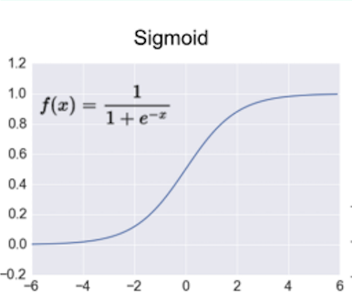
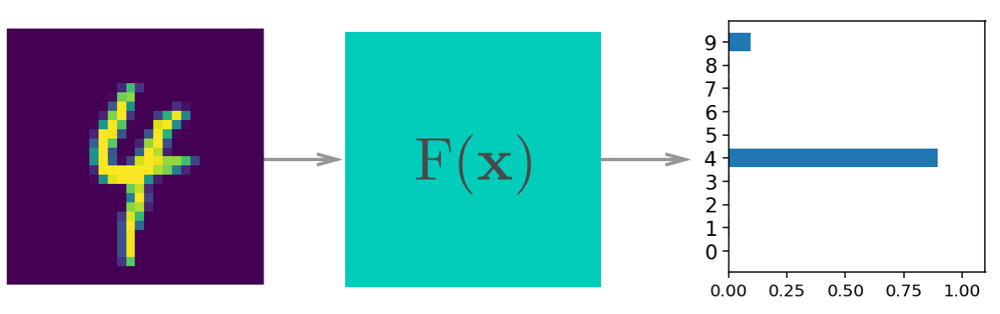
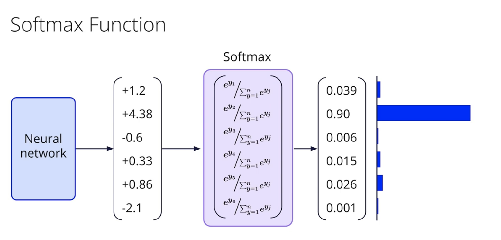

# C-2: Activation Functions and Classification

1. Sigmoid Functions and Activation Functions
    - Sigmoid Function Properties and Derivatives
    - ReLU and its Variants
    - Hyperbolic Tangent (tanh)
    - Softmax for Multi-Class Problems
    - Activation Function Selection Criteria
2. Multi-Class Classification
    - One-Hot Encoding Implementation
    - Softmax Function Application
    - Multi-Class Loss Functions
    - Decision Boundaries in Higher Dimensions
    - Performance Evaluation Metrics
3. Logistic Regression
    - Mathematical Formulation
    - Probabilistic Interpretation
    - Binary Classification Implementation
    - Multi-Class Extension
    - Gradient Calculation Process

##### Mathematics for Activation Functions

###### The Chain Rule in Calculus

The chain rule is one of the most fundamental differentiation techniques, used when you need to find the derivative of a
composite function—essentially a "function within a function."

**Mathematical Statement:** If $y = f(g(x))$, then:

$$
\frac{dy}{dx} = f'(g(x)) \cdot g'(x)
$$

Or in Leibniz notation:

$$
\frac{dy}{dx} = \frac{dy}{du} \cdot \frac{du}{dx}
$$

where $u = g(x)$ is the inner function.

**Intuitive Understanding:** Think of the chain rule as measuring how fast $y$ changes with respect to $x$ by breaking
it into two parts:

1. How fast $y$ changes with respect to the intermediate variable $u$
2. How fast $u$ changes with respect to $x$

The total rate of change is the product of these two rates.

**Step-by-Step Process:**

1. Identify the outer function $f$ and inner function $g$
2. Find the derivative of the outer function: $f'(u)$
3. Find the derivative of the inner function: $g'(x)$
4. Multiply them together: $f'(g(x)) \cdot g'(x)$

**Examples:**

**Example 1:** $y = (3x + 2)^5$

- Outer function: $f(u) = u^5$, so $f'(u) = 5u^4$
- Inner function: $g(x) = 3x + 2$, so $g'(x) = 3$
- Result: $\frac{dy}{dx} = 5(3x + 2)^4 \cdot 3 = 15(3x + 2)^4$

**Example 2:** $y = e^{x^2}$

- Outer function: $f(u) = e^u$, so $f'(u) = e^u$
- Inner function: $g(x) = x^2$, so $g'(x) = 2x$
- Result: $\frac{dy}{dx} = e^{x^2} \cdot 2x = 2xe^{x^2}$

**Example 3:** $y = \sin(4x + 1)$

- Outer function: $f(u) = \sin(u)$, so $f'(u) = \cos(u)$
- Inner function: $g(x) = 4x + 1$, so $g'(x) = 4$
- Result: $\frac{dy}{dx} = \cos(4x + 1) \cdot 4 = 4\cos(4x + 1)$

**Multiple Chain Rule Applications:** For functions with multiple layers like $y = \sin(e^{x^2})$:

$$
\frac{dy}{dx} = \cos(e^{x^2}) \cdot e^{x^2} \cdot 2x = 2xe^{x^2}\cos(e^{x^2})
$$

###### The Quotient Rule in Calculus

The quotient rule is used to find the derivative of a function that is the quotient (division) of two other functions.

**Mathematical Statement:** If $y = \frac{f(x)}{g(x)}$, then:

$$
\frac{dy}{dx} = \frac{f'(x)g(x) - f(x)g'(x)}{[g(x)]^2}
$$

**Memory Aid:** "Low d-high minus high d-low, over low squared"

- "Low" = denominator function $g(x)$
- "High" = numerator function $f(x)$
- "d-high" = derivative of numerator $f'(x)$
- "d-low" = derivative of denominator $g'(x)$

**Step-by-Step Process:**

1. Identify the numerator function $f(x)$ and denominator function $g(x)$
2. Find $f'(x)$ and $g'(x)$
3. Apply the formula: $\Large \frac{f'(x)g(x) - f(x)g'(x)}{[g(x)]^2}$
4. Simplify if possible

**Examples:**

**Example 1:** $y = \frac{x^2}{x + 1}$

- $f(x) = x^2$, so $f'(x) = 2x$
- $g(x) = x + 1$, so $g'(x) = 1$
- Result:
    $$
    \frac{dy}{dx} = \frac{2x(x + 1) - x^2(1)}{(x + 1)^2} = \frac{2x^2 + 2x - x^2}{(x + 1)^2} = \frac{x^2 + 2x}{(x + 1)^2}
    $$

**Example 2:** $y = \frac{\sin(x)}{\cos(x)} = \tan(x)$

- $f(x) = \sin(x)$, so $f'(x) = \cos(x)$
- $g(x) = \cos(x)$, so $g'(x) = -\sin(x)$
- Result:
    $$
    \frac{dy}{dx} = \frac{\cos(x) \cdot \cos(x) - \sin(x) \cdot (-\sin(x))}{\cos^2(x)} = \frac{\cos^2(x) + \sin^2(x)}{\cos^2(x)} = \frac{1}{\cos^2(x)} = \sec^2(x)
    $$

**Example 3:** $y = \frac{e^x}{x^2 + 1}$

- $f(x) = e^x$, so $f'(x) = e^x$
- $g(x) = x^2 + 1$, so $g'(x) = 2x$
- Result:
    $$
    \frac{dy}{dx} = \frac{e^x(x^2 + 1) - e^x(2x)}{(x^2 + 1)^2} = \frac{e^x(x^2 + 1 - 2x)}{(x^2 + 1)^2} = \frac{e^x(x^2 - 2x + 1)}{(x^2 + 1)^2}
    $$

**Combining Chain and Quotient Rules:** When dealing with complex functions, you might need both rules:

For $y = \large  \frac{\sin(2x)}{e^x}$:

- Apply quotient rule first
- Use chain rule for $\sin(2x)$ derivative
- $f(x) = \sin(2x)$, so $f'(x) = 2\cos(2x)$ (chain rule)
- $g(x) = e^x$, so $g'(x) = e^x$
- Result:
    $$
    \frac{dy}{dx} = \frac{2\cos(2x) \cdot e^x - \sin(2x) \cdot e^x}{(e^x)^2} = \frac{e^x(2\cos(2x) - \sin(2x))}{e^{2x}} = \frac{2\cos(2x) - \sin(2x)}{e^x}
    $$

**Alternative to Quotient Rule:** Sometimes it's easier to rewrite the quotient and use the product rule with chain
rule:

$$
\frac{f(x)}{g(x)} = f(x) \cdot [g(x)]^{-1}
$$

Then use the product rule:

$$
\large (uv)' = u'v + uv'
$$

These rules are fundamental building blocks that enable you to differentiate virtually any combination of elementary
functions, forming the foundation for more advanced calculus concepts and applications in neural networks.

##### The Derivative of $e^u$: A Fundamental Exponential Property

The fact that the exponential function $e^u$ is its own derivative is one of the most elegant and important properties
in calculus. Let's explain why this is true through several different approaches.

###### Approach 1: Using the Definition of a Derivative

The derivative of any function f(u) is defined as:

$$
f'(u) = \lim_{h \to 0} \frac{f(u+h) - f(u)}{h}
$$

Applying this to $f(u) = e^u$:

$$
\frac{d}{du}(e^u) = \lim_{h \to 0} \frac{e^{u+h} - e^u}{h}
$$

Using the property that $e^{a+b} = e^a · e^b$:

$$
\frac{d}{du}(e^u) = \lim_{h \to 0} \frac{e^u \cdot e^h - e^u}{h} = \lim_{h \to 0} e^u \cdot \frac{e^h - 1}{h}
$$

We can factor out $e^u$ since it doesn't depend on $h$:

$$
\frac{d}{du}(e^u) = e^u \cdot \lim_{h \to 0} \frac{e^h - 1}{h}
$$

The limit $\lim_{h \to 0} \frac{e^h - 1}{h}$ is actually the definition of the derivative of $e^x$ at $x = 0$, which
equals 1. This is because $e^x$ is defined so that its rate of change at the origin is exactly 1.

Therefore:

$$
\frac{d}{du}(e^u) = e^u \cdot 1 = e^u
$$

##### Understanding the Fundamental Limit

This passage explains one of the most profound insights in calculus: why the number $e$ exists and what makes it special
among all possible bases for exponential functions.

**The Starting Point - Derivative by Definition:** When we try to find the derivative of any exponential function $a^x$
using the limit definition:

$$
\frac{d}{dx}(a^x) = \lim_{h \to 0} \frac{a^{x+h} - a^x}{h}
$$

Using the property $a^{x+h} = a^x \cdot a^h$:

$$
\frac{d}{dx}(a^x) = \lim_{h \to 0} \frac{a^x \cdot a^h - a^x}{h} = a^x \cdot \lim_{h \to 0} \frac{a^h - 1}{h}
$$

**The Critical Discovery:** The derivative of $a^x$ depends on two parts:

1. The value $a^x$ itself
2. The mysterious limit $\lim_{h \to 0} \frac{a^h - 1}{h}$

This limit represents the instantaneous rate of change of $a^x$ at the point $x = 0$. Mathematically, it's asking:
"What's the slope of the curve $y = a^x$ exactly at the point $(0, 1)$?"

###### Understanding How the Limit Becomes the Slope

The key insight is that the limit $\lim_{h \to 0} \frac{a^h - 1}{h}$ is **exactly** this slope formula applied to the
exponential function.

###### Breaking Down the Connection

**Starting with the slope formula:** For the curve $y = a^x$ at the point $(0, 1)$:

- **Point 1**: $(x_1, y_1) = (0, a^0) = (0, 1)$
- **Point 2**: $(x_2, y_2) = (0 + h, a^{0+h}) = (h, a^h)$ where $h$ is a small distance

**Applying the slope formula:**

$$
\text{Slope} = \frac{y_2 - y_1}{x_2 - x_1} = \frac{a^h - 1}{h - 0} = \frac{a^h - 1}{h}
$$

###### The Limit Process

As we make $h$ smaller and smaller, we're looking at points closer and closer to $(0, 1)$:

- When $h = 0.1$: Points $(0, 1)$ and $(0.1, a^{0.1})$
- When $h = 0.01$: Points $(0, 1)$ and $(0.01, a^{0.01})$
- When $h = 0.001$: Points $(0, 1)$ and $(0.001, a^{0.001})$

**The instantaneous slope** is what happens when $h \to 0$: $$\lim_{h \to 0} \frac{a^h - 1}{h}$$

###### Visual Understanding

The slope between two points gives us the **average rate of change**. But as the two points get infinitely close
together (as $h \to 0$), this average rate of change approaches the **instantaneous rate of change** - which is exactly
the derivative!

So the "mysterious limit" $\lim_{h \to 0} \frac{a^h - 1}{h}$ is literally asking:

> "What does the slope approach as we zoom in closer and closer to the point $(0, 1)$ on the curve $y = a^x$?"

This is the fundamental definition of a derivative - it's the slope of the tangent line at a specific point, found by
taking the limit of secant line slopes as the two points approach each other.

**Why Different Bases Give Different Limits:** Let's examine what happens with different bases:

**For $a = 2$:**

$$
\lim_{h \to 0} \frac{2^h - 1}{h} \approx 0.693
$$

This means $\frac{d}{dx}(2^x) = 2^x \cdot 0.693$. The function $2^x$ grows, but not as fast as itself.

**For $a = 3$:**

$$
\lim_{h \to 0} \frac{3^h - 1}{h} \approx 1.099
$$

This means $\frac{d}{dx}(3^x) = 3^x \cdot 1.099$. The function $3^x$ grows faster than itself.

**The Special Case:** Mathematicians realized there must be exactly one base $a$ where this limit equals exactly 1:

$$
\lim_{h \to 0} \frac{a^h - 1}{h} = 1
$$

**Why This Base is Special:** When this limit equals 1, we get the remarkable property:

$$
\frac{d}{dx}(a^x) = a^x \cdot 1 = a^x
$$

This means the function is its own derivative! The rate of growth at any point equals the value of the function at that
point.

**The Definition of $e$:** This special base is defined to be $e \approx 2.71828...$. It's not that we calculated $e$
and then discovered this property—rather, we defined $e$ as the unique number that makes this limit equal to 1.

**Geometric Interpretation:** Consider the graph of $y = a^x$:

- It always passes through the point $(0, 1)$ regardless of the base $a$
- The slope at this point is $\lim_{h \to 0} \frac{a^h - 1}{h}$
- For $e^x$, this slope is exactly 1

This means at the point $(0, 1)$, the tangent line to $y = e^x$ has slope 1, making a 45-degree angle with the x-axis.

**Why This Matters:** This property makes $e$ the "natural" base for exponential functions because:

1. **Differential equations**: The equation $\frac{dy}{dx} = y$ has solutions $y = Ce^x$
2. **Natural growth**: Processes where growth rate equals current amount follow $e^x$
3. **Calculus simplicity**: Integration and differentiation formulas are cleanest with base $e$
4. **Mathematical elegance**: Many formulas in advanced mathematics simplify when using $e$

**The Profound Implication:** The limit $\lim_{h \to 0} \frac{e^h - 1}{h} = 1$ encapsulates the essence of exponential
growth in its purest form. It tells us that $e$ represents the threshold between "slow" exponential growth (like $2^x$)
and "fast" exponential growth (like $3^x$), sitting exactly at the point where the function's growth rate equals its
current value.

This is why $e$ appears throughout nature: compound interest, population growth, radioactive decay, and countless other
natural phenomena follow patterns where the rate of change is proportional to the current state—the defining
characteristic of the exponential function with base $e$.

###### Approach 2: Using the Taylor Series Expansion

We can also understand this through the Taylor series of $e^u$:

$$
e^u = 1 + u + \frac{u^2}{2!} + \frac{u^3}{3!} + \frac{u^4}{4!} + ...
$$

When we differentiate term by term:

$$
\begin{align}
\frac{d}{du}(e^u) &= \frac{d}{du}(1) + \frac{d}{du}(u) + \frac{d}{du}\left(\frac{u^2}{2!}\right) + \frac{d}{du}\left(\frac{u^3}{3!}\right) + ... \\
&= 0 + 1 + \frac{2u}{2!} + \frac{3u^2}{3!} + \frac{4u^3}{4!} + ... \\
&= 1 + u + \frac{u^2}{2!} + \frac{u^3}{3!} + ... \\
\end{align}
$$

This is exactly the Taylor series for $e^u$, confirming that:

$$
\frac{d}{du}(e^u) = e^u
$$

###### Approach 3: The Definition of $e$

The number e is defined specifically so that this property holds. In fact, e could be defined as the unique number such
that:

$$
\lim_{h \to 0} \frac{e^h - 1}{h} = 1
$$

This makes $e$ approximately $2.71828...$ and ensures that the derivative of $e^u$ is exactly $e^u$.

###### Why This Matters

This special property is why the exponential function is so important in mathematics, physics, engineering, and many
other fields:

1. It creates solutions to differential equations where the rate of change is proportional to the current value (like
   compound interest, population growth, radioactive decay)
2. It makes the chain rule application particularly elegant for exponential functions
3. It connects to the sigmoid function's derivative: $\sigma'(x) = \sigma(x)(1-\sigma(x))$
4. It means that we can easily find the derivative of $e^x$ for any complex function $x$ without memorizing additional
   formulas

This self-derivative property makes $e^x$ the most natural base for exponential functions in calculus, just as base 10
is natural for human counting and base 2 is natural for computing.

###### Connecting to the Sigmoid and Derivative Differentiating $e^{-x}$

The exponential function $e^x$ always has a positive slope that increases with $x$. When we negate the input ($e^{-x}$),
we're essentially "flipping" the function horizontally, causing it to decrease as $x$ increases. This is why the
derivative becomes negative. The derivative tells us the rate of change at any point. Since $e^{-x}$ decreases as $x$
increases, its rate of change is negative, explaining why we get $-e^{-x}$.

This result is crucial for deriving the sigmoid derivative. When we apply the quotient rule to
$\sigma(x) = 1/(1+e^{-x})$, the term $-e^{-x}$ appears as the derivative of $e^{-x}$, which then leads to the elegant
form $\sigma'(x) = \sigma(x)(1-\sigma(x))$.

The chain rule gives us a systematic way to handle nested functions, allowing us to break down complex derivatives into
manageable steps - a fundamental technique used throughout calculus and its applications in machine learning.

##### The Quotient Rule: A Detailed Proof

The quotient rule is a fundamental calculus tool that helps us find the derivative of a fraction. Let me walk you
through a complete proof of this important rule.

###### Stating the Quotient Rule

If we have a function $f(x) = \frac{g(x)}{h(x)}$ where both $g(x)$ and $h(x)$ are differentiable, then the quotient rule
states that:

$$
f'(x) = \frac{g'(x)h(x) - g(x)h'(x)}{[h(x)]^2}
$$

###### The Proof Using the Definition of a Derivative

Let's start with the formal definition of a derivative:

$$
f'(x) = \lim_{\Delta x \to 0} \frac{f(x + \Delta x) - f(x)}{\Delta x}
$$

For our function $f(x) = \frac{g(x)}{h(x)}$, we can write:

$$
f'(x) = \lim_{\Delta x \to 0} \frac{\frac{g(x + \Delta x)}{h(x + \Delta x)} - \frac{g(x)}{h(x)}}{\Delta x}
$$

To work with this expression, we need a common denominator for the fractions inside the numerator:

$$
f'(x) = \lim_{\Delta x \to 0} \frac{\large \frac{g(x + \Delta x)h(x) - g(x)h(x + \Delta x)}{h(x + \Delta x)h(x)}}{\Delta x}
$$

Simplifying:

$$
f'(x) = \lim_{\Delta x \to 0} \frac{g(x + \Delta x)h(x) - g(x)h(x + \Delta x)}{h(x + \Delta x)h(x) \cdot \Delta x}
$$

Now, let's add and subtract $g(x)h(x)$ in the numerator:

$$
f'(x) = \lim_{\Delta x \to 0} \frac{g(x + \Delta x)h(x) - g(x)h(x) + g(x)h(x) - g(x)h(x + \Delta x)}{h(x + \Delta x)h(x) \cdot \Delta x}
$$

Regrouping terms:

$$
f'(x) = \lim_{\Delta x \to 0} \frac{h(x)[g(x + \Delta x) - g(x)] - g(x)[h(x + \Delta x) - h(x)]}{h(x + \Delta x)h(x) \cdot \Delta x}
$$

This can be rewritten as:

$$
f'(x) = \lim_{\Delta x \to 0} \frac{h(x) \cdot \frac{g(x + \Delta x) - g(x)}{\Delta x} - g(x) \cdot \frac{h(x + \Delta x) - h(x)}{\Delta x}}{h(x + \Delta x)h(x)}
$$

As $\Delta x$ approaches zero, we recognize the definition of derivatives:

$$
\begin{align}
&\lim_{\Delta x \to 0} \frac{g(x + \Delta x) - g(x)}{\Delta x} = g'(x) \\
&\lim_{\Delta x \to 0} \frac{h(x + \Delta x) - h(x)}{\Delta x} = h'(x)
\end{align}
$$

And we also know that $\lim_{\Delta x \to 0} h(x + \Delta x) = h(x)$

Substituting these into our expression:

$$
f'(x) = \frac{h(x) \cdot g'(x) - g(x) \cdot h'(x)}{h(x) \cdot h(x)} = \frac{g'(x)h(x) - g(x)h'(x)}{[h(x)]^2}
$$

And this is exactly the quotient rule.

###### An Alternative Proof Using the Product Rule

Another elegant way to prove the quotient rule is to use the product rule.

If $f(x) = \frac{g(x)}{h(x)}$, then $f(x) \cdot h(x) = g(x)$

Differentiating both sides using the product rule:

$$
f'(x) \cdot h(x) + f(x) \cdot h'(x) = g'(x)
$$

Solving for $f'(x)$:

$$
f'(x) = \frac{g'(x) - f(x) \cdot h'(x)}{h(x)}
$$

Substituting $f(x) = \frac{g(x)}{h(x)}$:

$$
f'(x) = \frac{g'(x) - \frac{g(x)}{h(x)} \cdot h'(x)}{h(x)} = \frac{g'(x) - \frac{g(x)h'(x)}{h(x)}}{h(x)}
$$

Simplifying:

$$
f'(x) = \frac{g'(x)h(x) - g(x)h'(x)}{[h(x)]^2}
$$

Again, we arrive at the quotient rule.

###### Practical Significance

The quotient rule is what allows us to differentiate expressions like the sigmoid function. Without it, finding the
derivatives of rational functions would be much more challenging. This rule forms part of the foundation that enables us
to perform backpropagation in neural networks, making it a cornerstone of modern machine learning mathematics.

When applied to the sigmoid function $\sigma(x) = \frac{1}{1+e^{-x}}$, the quotient rule gives us the elegant
relationship $\sigma'(x) = \sigma(x)(1-\sigma(x))$, which is not just mathematically beautiful but also computationally
efficient.

##### Proof of the Product Rule in Calculus

The product rule is a fundamental rule in differential calculus that allows us to find the derivative of a product of
two differentiable functions. Let me prove this important rule step by step.

###### Stating the Product Rule

If we have two differentiable functions $f(x)$ and $g(x)$, then the derivative of their product is:

$$
(f(x) \cdot g(x))' = f'(x) \cdot g(x) + f(x) \cdot g'(x)
$$

This rule tells us that the derivative of a product is not simply the product of the derivatives. Instead, it involves a
specific combination of the functions and their derivatives.

###### Proof Using the Definition of the Derivative

We'll start with the formal definition of the derivative:

$$
\frac{d}{dx}[f(x) \cdot g(x)] = \lim_{h \to 0} \frac{f(x+h) \cdot g(x+h) - f(x) \cdot g(x)}{h}
$$

To make this expression more manageable, let's add and subtract the term $f(x+h) \cdot g(x)$ in the numerator:

$$
\frac{d}{dx}[f(x) \cdot g(x)] = \lim_{h \to 0} \frac{f(x+h) \cdot g(x+h) - f(x+h) \cdot g(x) + f(x+h) \cdot g(x) - f(x) \cdot g(x)}{h}
$$

Now we can rearrange this into two terms:

$$
\frac{d}{dx}[f(x) \cdot g(x)] = \lim_{h \to 0} \left[ \frac{f(x+h) \cdot (g(x+h) - g(x))}{h} + \frac{g(x) \cdot (f(x+h) - f(x))}{h} \right]
$$

We can factor out some terms:

$$
\frac{d}{dx}[f(x) \cdot g(x)] = \lim_{h \to 0} \left[ f(x+h) \cdot \frac{g(x+h) - g(x)}{h} + g(x) \cdot \frac{f(x+h) - f(x)}{h} \right]
$$

As $h$ approaches zero, we need to evaluate two key limits:

1. $\lim_{h \to 0} \frac{g(x+h) - g(x)}{h} = g'(x)$ by the definition of the derivative of g(x)
2. $\lim_{h \to 0} \frac{f(x+h) - f(x)}{h} = f'(x)$ by the definition of the derivative of f(x)
3. $\lim_{h \to 0} f(x+h) = f(x)$ by the continuity of f(x)

Applying these limits:

$$
\begin{align}
&\frac{d}{dx}[f(x) \cdot g(x)] = \lim_{h \to 0} f(x+h) \cdot \lim_{h \to 0} \frac{g(x+h) - g(x)}{h} + g(x) \cdot \lim_{h \to 0} \frac{f(x+h) - f(x)}{h} \\
&\frac{d}{dx}[f(x) \cdot g(x)] = f(x) \cdot g'(x) + g(x) \cdot f'(x)
\end{align}
$$

And this completes our proof of the product rule.

###### Intuitive Understanding of the Product Rule

We can think of the product rule in terms of how each factor contributes to the rate of change of the overall product:

Imagine a rectangle with dimensions $f(x)$ and $g(x)$. The area of this rectangle is $f(x) \cdot g(x)$.

When $x$ changes:

- The width $f(x)$ changes at a rate of $f'(x)$
- The height $g(x)$ changes at a rate of $g'(x)$

The total change in area comes from:

1. The change in width while keeping the height constant: $f'(x) \cdot g(x)$
2. The change in height while keeping the width constant: $f(x) \cdot g'(x)$

Adding these two contributions gives us the total rate of change: $f'(x) \cdot g(x) + f(x) \cdot g'(x)$

###### Significance in Mathematics and Applications

The product rule is essential for differentiating complex expressions in calculus. It allows us to break down
complicated products into manageable pieces whose derivatives we can find separately. Without the product rule, finding
derivatives of products would require going back to first principles each time, making many calculations extremely
tedious.

In the context of our earlier discussion about the quotient rule and sigmoid functions, the product rule forms a
foundation for those more advanced derivative formulas. In fact, we used the product rule in our alternative proof of
the quotient rule, showing how these fundamental calculus rules are interconnected.

This rule is applied constantly throughout mathematics, physics, engineering, economics, and any field that uses
calculus to model changing quantities that depend on multiple factors.

##### Understanding Hyperbolic Functions

###### What Are Hyperbolic Functions?

Hyperbolic functions are analogs of the regular trigonometric functions but are based on the hyperbola rather than the
circle. They appear naturally in many physical and engineering problems, from describing the shape of hanging cables to
analyzing signal processing and electrical circuits.

The six basic hyperbolic functions are:

1. Hyperbolic sine: $$\sinh(x) = \large \frac{e^x - e^{-x}}{2}$$
2. Hyperbolic cosine: $$\cosh(x) = \large \frac{e^x + e^{-x}}{2}$$
3. Hyperbolic tangent: $$\tanh(x) = \large \frac{e^x - e^{-x}}{e^x + e^{-x}}$$
4. Hyperbolic cosecant: $$\text{csch}(x) = \large \frac{1}{\sinh(x)}$$
5. Hyperbolic secant: $$\text{sech}(x) = \large \frac{1}{\cosh(x)}$$
6. Hyperbolic cotangent: $$\coth(x) = \large \frac{1}{\tanh(x)}$$

###### The Geometric Connection

While trigonometric functions relate to points on a unit circle, hyperbolic functions relate to points on a hyperbola.
Specifically:

- For points (x,y) on the unit circle, $$x = \cos(\theta)$$ and $$y = \sin(\theta)$$
- For points (x,y) on the unit hyperbola $$x^2 - y^2 = 1$$, $$x = \cosh(t)$$ and $$y = \sinh(t)$$

This geometric interpretation helps explain why they're called "hyperbolic" functions.

###### Properties of Hyperbolic Functions

Hyperbolic functions have properties that parallel trigonometric functions, but with key differences:

For trigonometric functions:

- $$\sin^2(\theta) + \cos^2(\theta) = 1$$
- $$\sin(-\theta) = -\sin(\theta)$$ (odd function)
- $$\cos(-\theta) = \cos(\theta)$$ (even function)

For hyperbolic functions:

- $$\cosh^2(x) - \sinh^2(x) = 1$$ (note the minus sign)
- $$\sinh(-x) = -\sinh(x)$$ (odd function)
- $$\cosh(-x) = \cosh(x)$$ (even function)

These functions grow exponentially rather than oscillating like their trigonometric counterparts. The hyperbolic cosine
(cosh) describes the shape of a hanging chain or cable (called a catenary), which is why we see this shape in suspension
bridges and power lines.

###### Relationship to Exponential Functions

The key insight is that hyperbolic functions can be defined in terms of exponentials:

$$
\begin{align}
&\sinh(x) = \large \frac{e^x - e^{-x}}{2} \\
&\cosh(x) = \large \frac{e^x + e^{-x}}{2}
\end{align}
$$

This relationship to exponentials explains their growth behavior and many of their mathematical properties. It's also
what makes their derivatives particularly nice:

$$
\begin{align}
&\frac{d}{dx}(\sinh(x)) = \cosh(x) \\
&\frac{d}{dx}(\cosh(x)) = \sinh(x) \\
&\frac{d}{dx}(\tanh(x)) = 1 - \tanh²(x)
\end{align}
$$

###### Understanding Hyperbolic Function Derivatives

These derivative formulas reveal the elegant mathematical relationships between hyperbolic functions, which mirror (with
some key differences) the derivatives of their trigonometric counterparts.

**Definition of Hyperbolic Functions:** First, let's establish the definitions using exponential functions:

- $\sinh(x) = \large \frac{e^x - e^{-x}}{2}$ (hyperbolic sine)
- $\cosh(x) = \large \frac{e^x + e^{-x}}{2}$ (hyperbolic cosine)
- $\tanh(x) = \large \frac{\sinh(x)}{\cosh(x)} = \large \frac{e^x - e^{-x}}{e^x + e^{-x}}$ (hyperbolic tangent)

**Derivative of Hyperbolic Sine:**

$$
\frac{d}{dx}(\sinh(x)) = \cosh(x)
$$

**Proof:**

Starting with the definition:

$$
\sinh(x) = \frac{e^x - e^{-x}}{2}
$$

Then, differentiating term by term:

$$
\begin{align}
\frac{d}{dx}(\sinh(x)) &= \frac{d}{dx}\left(\frac{e^x - e^{-x}}{2}\right) \\
&= \frac{1}{2}\left(\frac{d}{dx}(e^x) - \frac{d}{dx}(e^{-x})\right) \\
&= \frac{1}{2}(e^x - e^{-x} \cdot (-1)) \\
&= \frac{1}{2}(e^x + e^{-x}) \\
&= \cosh(x)
\end{align}
$$

**Derivative of Hyperbolic Cosine:**

$$
\frac{d}{dx}(\cosh(x)) = \sinh(x)
$$

**Proof:** Starting with the definition:

$$
\cosh(x) = \frac{e^x + e^{-x}}{2}
$$

Differentiating by terms:

$$
\begin{align}
\frac{d}{dx}(\cosh(x)) &= \frac{1}{2}\left(\frac{d}{dx}(e^x) + \frac{d}{dx}(e^{-x})\right) \\
&= \frac{1}{2}(e^x + e^{-x} \cdot (-1)) \\
&= \frac{1}{2}(e^x - e^{-x}) \\
&= \sinh(x)
\end{align}
$$

**Derivative of Hyperbolic Tangent:**

$$
\frac{d}{dx}(\tanh(x)) = 1 - \tanh^2(x)
$$

**Proof Method 1 - Using Quotient Rule:** Since $\tanh(x) = \frac{\sinh(x)}{\cosh(x)}$, we apply the quotient rule and
use the hyperbolic identity $\cosh^2(x) - \sinh^2(x) = 1$:

$$
\begin{align}
\frac{d}{dx}(\tanh(x)) &= \frac{\cosh(x) \cdot \cosh(x) - \sinh(x) \cdot \sinh(x)}{\cosh^2(x)} \\
&= \frac{\cosh^2(x) - \sinh^2(x)}{\cosh^2(x)} \\
&= \frac{1}{\cosh^2(x)} \\
&= \operatorname{sech}^2(x)
\end{align}
$$

To show this equals $1 - \tanh^2(x)$, we use:

$$
1 - \tanh^2(x) = 1 - \frac{\sinh^2(x)}{\cosh^2(x)} = \frac{\cosh^2(x) - \sinh^2(x)}{\cosh^2(x)} = \frac{1}{\cosh^2(x)}
$$

**Proof Method 2 - Using Exponential Form:**

Starting with

$$
\tanh(x) = \frac{e^x - e^{-x}}{e^x + e^{-x}}
$$

Let $u = \large {e^x - e^{-x}}$ and $v = \large {e^x + e^{-x}}$, so $\tanh(x) = \frac{u}{v}$

Then $u' = \large {e^x + e^{-x}} = v$ and $v' = \large {e^x - e^{-x}} = u$

Using the quotient rule:

$$
\begin{align}
\frac{d}{dx}(\tanh(x)) &= \frac{u'v - uv'}{v^2} = \frac{v \cdot v - u \cdot u}{v^2} = \frac{v^2 - u^2}{v^2} \\
&= \frac{(e^x + e^{-x})^2 - (e^x - e^{-x})^2}{(e^x + e^{-x})^2} \\
&= \frac{(e^{2x} + 2 + e^{-2x}) - (e^{2x} - 2 + e^{-2x})}{(e^x + e^{-x})^2} \\
&= \frac{4}{(e^x + e^{-x})^2} \\
&= \frac{1}{\cosh^2(x)} \\
&= \operatorname{sech}^2(x) \\
&=1-\tanh^2(x)
\end{align}
$$

Therefore:

$$
\tanh'(x) = 1 - \tanh^2(x)
$$

**Comparison with Trigonometric Derivatives:** Notice the similarities and differences with trigonometric functions:

| Function  | Derivative                  |
| --------- | --------------------------- |
| $\sin(x)$ | $\cos(x)$                   |
| $\cos(x)$ | $-\sin(x)$                  |
| $\tan(x)$ | $1 + \tan^2(x) = \sec^2(x)$ |

| Hyperbolic | Derivative                                  |
| ---------- | ------------------------------------------- |
| $\sinh(x)$ | $\cosh(x)$                                  |
| $\cosh(x)$ | $\sinh(x)$                                  |
| $\tanh(x)$ | $1 - \tanh^2(x) = \operatorname{sech}^2(x)$ |

**Key Observations:**

1. **Sign differences**: $\frac{d}{dx}(\cosh(x)) = \sinh(x)$ (no negative sign, unlike $\cos(x)$)
2. **Identity differences**: For $\tanh(x)$, we get $1 - \tanh^2(x)$ instead of $1 + \tan^2(x)$
3. **Fundamental identity**: The hyperbolic identity $\cosh^2(x) - \sinh^2(x) = 1$ is crucial for these derivatives

**Physical and Geometric Significance:**

- Hyperbolic functions describe the shape of a hanging cable (catenary)
- They appear in solutions to certain differential equations
- The derivatives follow naturally from the exponential definitions
- The absence of oscillatory behavior (unlike trig functions) leads to these simpler derivative relationships

These derivative formulas are fundamental in calculus of hyperbolic functions and frequently appear in advanced
mathematics, physics, and engineering applications involving exponential growth and decay processes.

###### Applications in Machine Learning

In neural networks, tanh became popular as an activation function because:

1. It outputs values between $-1$ and $1$, making it zero-centered
2. It has a steeper gradient than the sigmoid function
3. Its derivative has a simple form: $1 - \tanh^2(x)$

This zero-centered property helps reduce the "zigzagging" effect during gradient descent, making learning more
efficient.

Despite being largely replaced by ReLU in many modern networks, tanh remains important in certain architectures,
particularly in RNNs (Recurrent Neural Networks) and for certain gating mechanisms in LSTMs and GRUs.

###### Relationship to Complex Numbers

Interestingly, hyperbolic functions connect to trigonometric functions through complex numbers:

$$
\begin{align}
&\sinh(ix) = i·\sin(x) \\
&\cosh(ix) = \cos(x)
\end{align}
$$

This deep connection reveals the underlying unity of these seemingly different mathematical concepts and explains why
their properties parallel each other so closely.

##### Understanding the Hyperbolic Tangent (tanh) Function

###### What is tanh?

The hyperbolic tangent (tanh) is one of the hyperbolic functions in mathematics. While the regular tangent function
(tan) relates to circles and triangles on a plane, tanh relates to hyperbolas. The tanh function has become particularly
important in neural networks as an activation function.

Tanh is defined by the formula:

$$
\tanh(x) = \frac{e^x - e^{-x}}{e^x + e^{-x}}
$$

This is similar to how the regular tangent function can be expressed in terms of sine and cosine:

$$
\tan(x) = \frac{\sin(x)}{\cos(x)}
$$

###### Relationship to Hyperbolic Sine and Cosine

Just like tan is related to sin and cos, tanh is related to the hyperbolic sine (sinh) and hyperbolic cosine (cosh):

$$
\begin{align}
&\sinh(x) = \large \frac{e^x - e^{-x}}{2} \\
&\cosh(x) = \large \frac{e^x + e^{-x}}{2}
\end{align}
$$

So tanh can be written as:

$$
\tanh(x) = \frac{\sinh(x)}{\cosh(x)}
$$

###### Deriving the Formula for tanh(x)

Let me walk through the derivation of $$\tanh(x) = \large \frac{e^x - e^{-x}}{e^x + e^{-x}}$$ from first principles:

1. We start with the definitions of sinh and cosh:
    - $$\sinh(x) = \large \frac{e^x - e^{-x}}{2}$$
    - $$\cosh(x) = \large \frac{e^x + e^{-x}}{2}$$
2. By definition, $$\tanh(x) = sinh(x)/cosh(x)$$, so:
    - $$\tanh(x) = \large \frac{\sinh(x)}{\cosh(x)}$$
3. The factor of 1/2 appears in both numerator and denominator, so they cancel out:
    - $$\tanh(x) = \large \frac{e^x - e^{-x}}{e^x + e^{-x}}$$

This gives us the standard form of tanh(x).

###### Properties of tanh

Unlike the regular tangent function which has periodic singularities, tanh is smooth and bounded:

- $$\tanh(0) = 0$$
- As $$x$$ approaches positive infinity, $$\tanh(x)$$ approaches 1
- As $$x$$ approaches negative infinity, $$\tanh(x)$$ approaches -1

This makes $$\tanh$$ a useful activation function in neural networks because:

- It provides outputs centered around zero (unlike sigmoid which is centered at 0.5)
- Its range is bound to $$(-1, 1)$$
- Its derivative has a nice form: $$\frac{d}{dx} \ \tanh(x) = 1 - \tanh^2(x)$$

In machine learning, tanh is often preferred over sigmoid for hidden layers because its zero-centered nature makes the
learning process more efficient for subsequent layers.

##### Sigmoid Functions and Activation Functions

Activation functions form the beating heart of neural networks. Without them, even the most complex neural network would
collapse into nothing more than a glorified linear regression model. These special functions introduce the non-linearity
that enables neural networks to learn intricate patterns and relationships in data, essentially giving networks their
power to approximate any function given enough neurons.

Figure: Transfer Learning for Small Data Set, Similar Data

##### Sigmoid Function Properties and Derivatives

The sigmoid function (also called the logistic function) is one of the oldest and most historically significant
activation functions in neural networks. It creates an S-shaped curve that smoothly maps any input value to an output
between 0 and 1. Mathematically, the sigmoid function is defined as:

$$
\sigma(x) = \frac{1}{1 + e^{-x}}
$$

To understand why this function is so important, let's explore its key properties:

1. **Bounded output (0 to 1)**: No matter how extreme the input values are—whether extremely positive or extremely
   negative—the sigmoid function always produces an output between 0 and 1. This makes it naturally suitable for
   representing probabilities. For example:

    - When $x = 0$, $\sigma(x) = 0.5$
    - As $x$ approaches $+\infty$, $\sigma(x)$ approaches $1$
    - As $x$ approaches $-\infty$, $\sigma(x)$ approaches $0$

2. **Smoothness**: The sigmoid function is continuously differentiable everywhere, meaning it has a well-defined
   derivative at every point. This property is crucial for gradient-based learning algorithms like backpropagation.

3. **Monotonicity**: The function strictly increases across its entire domain—larger inputs always produce larger
   outputs. This consistent behavior helps neural networks maintain stable learning dynamics.

4. **Symmetry**: The sigmoid function has point symmetry around (0, 0.5), meaning its shape is perfectly balanced. This
   symmetry provides a natural midpoint at x = 0, where the function outputs exactly 0.5.

Figure: Transfer Learning for Small Data Set, Similar Data

One of the most elegant aspects of the sigmoid function is its derivative, which can be expressed in terms of the
function itself:

$$
\sigma'(x) = \sigma(x)(1-\sigma(x))
$$

Let's derive this step by step:

Starting with the definition:

$$
\sigma(x) = \frac{1}{1+e^{-x}}
$$

Applying the chain rule:

$$
\sigma'(x) = \frac{d}{dx}\left(\frac{1}{1+e^{-x}}\right)
$$

Using the quotient rule:

$$
\begin{align}
\sigma'(x) &= \frac{0 \cdot (1+e^{-x}) - 1 \cdot (-e^{-x})}{(1+e^{-x})^2} \\
&= \frac{e^{-x}}{(1+e^{-x})^2}
\end{align}
$$

Now, observe that: $\sigma(x) = \frac{1}{1+e^{-x}}$ and $1-\sigma(x) = \frac{e^{-x}}{1+e^{-x}}$

Multiplying these terms:

$$
\sigma(x)(1-\sigma(x)) = \frac{1}{1+e^{-x}} \cdot \frac{e^{-x}}{1+e^{-x}} = \frac{e^{-x}}{(1+e^{-x})^2} = \sigma'(x)
$$

This elegant relationship makes computing the derivative very efficient during neural network training—you can calculate
the derivative directly from the function's output without redoing the exponential calculation. This is particularly
useful as:

1. It allows for efficient computation - once you calculate $σ(x)$, you can easily find the derivative
2. It shows the derivative is always positive but reaches its maximum value of 0.25 at $x=0$ and approaches zero as
   $|x|$ gets large
3. This property contributes to the "vanishing gradient problem" in deep networks, as extremely positive or negative
   inputs produce very small derivatives

This relationship also appears in similar forms for other activation functions, showing how these mathematical
properties connect throughout neural network theory.

However, this same relationship reveals the sigmoid's greatest weakness: when the input has a large magnitude (either
very positive or very negative), the derivative approaches zero. For example:

- When x = 6, σ(x) ≈ 0.998, so σ'(x) ≈ 0.002
- When x = -6, σ(x) ≈ 0.002, so σ'(x) ≈ 0.002

This property leads to the "vanishing gradient problem." When inputs fall in regions where the derivative is nearly
zero, the error signal during backpropagation becomes extremely small, effectively stopping the network from learning.
This problem becomes particularly severe in deep networks where these tiny gradients are multiplied across many layers,
essentially reducing the gradient to zero before it reaches the early layers.

Despite this limitation, the sigmoid function still finds use in specific contexts:

- In the output layer of binary classification models, where its 0-1 range naturally represents probabilities
- In certain gating mechanisms of recurrent neural networks like LSTMs and GRUs
- In scenarios where a probability interpretation of activation is needed

Figure:   Fine-tuning Pre-trained Models

##### ReLU and its Variants

The Rectified Linear Unit (ReLU) has revolutionized deep learning by addressing many of the problems associated with
traditional sigmoid and tanh activations. Its extraordinary simplicity belies its effectiveness. The ReLU function is
defined as:

$$
\text{ReLU}(x) = \max(0, x)
$$

In plain language, ReLU outputs the input directly if it's positive, and zero otherwise. This piecewise linear function
looks like a bent line—flat at zero for all negative inputs, and then climbing with slope 1 for all positive inputs.

Figure: Transfer Learning for Small Data Set, Similar Data

Despite (or perhaps because of) its simplicity, ReLU offers several significant advantages:

1. **Computational efficiency**: ReLU involves only a simple comparison and selection operation—much faster to compute
   than the exponential operations in sigmoid or tanh. This efficiency becomes crucial when training large networks.
2. **Sparsity promotion**: By zeroing out negative inputs, ReLU naturally creates sparse activations—many neurons output
   exactly zero. Approximately 50% of neurons are not activated (assuming inputs are centered around zero), which can
   help with:
    - More efficient computation
    - Better feature disentanglement
    - Noise resistance
3. **Reduced vanishing gradient problem**: For all positive inputs, ReLU's derivative is exactly 1, allowing gradients
   to flow without attenuation. This property helps deep networks learn more effectively.

The derivative of ReLU is straightforward:

$$
\text{ReLU}'(x) = \begin{cases} 1 & \text{if } x > 0 \\ 0 & \text{if } x < 0 \\ \text{undefined} & \text{if } x = 0 \end{cases}
$$

In practice, the derivative at x = 0 is typically defined as either 0 or 1, though this point has measure zero (occurs
with probability zero for continuous inputs), so its exact value rarely matters.

##### Dying ReLU Problem

Despite its advantages, ReLU suffers from a significant limitation known as the "dying ReLU problem." If, during
training, a neuron's weights are updated such that its weighted sum becomes consistently negative, that neuron will
always output zero—and more critically, its gradient will also be zero, preventing any further updates. This neuron has
effectively "died" and becomes useless for learning.

The dying ReLU problem is a significant challenge when using ReLU activation functions in neural networks. Let me walk
you through what happens and why it matters.

###### What Causes Neurons to "Die"

ReLU activations work by outputting the input directly when it's positive, and zero when it's negative:

$$
ReLU(x) = max(0, x)
$$

The problem occurs because of how gradients flow during backpropagation. For a ReLU function:

- When input > 0: gradient = 1
- When input ≤ 0: gradient = 0

When a neuron consistently receives negative inputs, its gradient becomes zero, which means no weight updates occur
during training. Once a neuron gets "stuck" in this state, it essentially becomes dead—outputting zero for all inputs
and never learning again.

###### A Simple Example of How Neurons Die

Consider a neuron with weight w = 0.5 and bias b = -0.6. For an input x = 0.7:

- Weighted input: z = w·x + b = 0.5 × 0.7 + (-0.6) = -0.25
- ReLU output: max(0, -0.25) = 0
- Gradient for backpropagation: 0

Since the gradient is zero, this neuron's weights won't update. If this pattern continues across most training examples,
the neuron becomes permanently inactive.

###### Why This Is Problematic

Dead neurons reduce your network's capacity to learn. If you have a layer with 100 neurons and 30 die, you're
effectively working with a smaller network. This means:

- Less capacity to learn complex patterns
- Wasted computational resources
- Potentially poorer model performance

###### Solutions to Prevent Dying ReLUs

Several approaches can address this issue:

Leaky ReLU allows a small gradient for negative inputs: LeakyReLU(x) = x if x > 0, else 0.01x

This ensures neurons always receive some gradient, preventing them from completely dying.

Other variants like PReLU (where the leak rate is learnable) and ELU (which provides a smooth transition at zero) also
address this problem while maintaining ReLU's benefits. Proper weight initialization and careful learning rate selection
can also reduce the likelihood of neurons dying during training.

To address this issue, several ReLU variants have been developed:

1. **Leaky ReLU**: Allows a small positive slope for negative inputs, preventing neurons from dying completely.

    $$
    \begin{align}&\text{LeakyReLU}(x) = \begin{cases} x & \text{if } x > 0 \\ \alpha x & \text{if } x \leq 0 \end{cases}\end{align}
    $$

    where α is a small constant, typically 0.01. This small slope ensures that neurons still receive a gradient even for
    negative inputs.

2. **Parametric ReLU (PReLU)**: Similar to Leaky ReLU, but treats the negative slope α as a learnable parameter rather
   than a fixed constant. This allows the network to determine the optimal negative slope during training.

3. **Exponential Linear Unit (ELU)**:

    $$
    \text{ELU}(x) = \begin{cases} x & \text{if } x > 0 \\ \alpha(e^x - 1) & \text{if } x \leq 0 \end{cases}
    $$

    ELU usesan exponential function for negative inputs, which creates a smooth transition at x = 0 and saturates for
    highly negative inputs. This helps reduce the shift in mean activation toward the positive side (which can slow down
    learning).

4. **Scaled Exponential Linear Unit (SELU)**: A self-normalizing variant of ELU designed to automatically maintain
   activations with zero mean and unit variance across network layers. This property helps training deep networks by
   preventing exploding or vanishing gradients.

5. **Gaussian Error Linear Unit (GELU)**: Approximates x · Φ(x) where Φ(x) is the standard normal cumulative
   distribution function. GELU can be viewed as a smooth interpolation between ReLU and Leaky ReLU that has shown strong
   performance in modern transformer architectures.

To visualize how these functions differ, imagine four inputs: -2, -0.5, 0, and 2:

- ReLU: [0, 0, 0, 2]
- Leaky ReLU (α=0.01): [-0.02, -0.005, 0, 2]
- ELU (α=1): [-0.86, -0.39, 0, 2]
- GELU: [-0.04, -0.15, 0, 1.95]

These variants aim to preserve ReLU's benefits while addressing its limitations. The choice among them often depends on
the specific application, with ReLU still serving as a strong default due to its simplicity and effectiveness.

##### Hyperbolic Tangent (tanh)

The hyperbolic tangent, or tanh function, is another sigmoidal activation function that maps inputs to outputs in the
range (-1, 1). Unlike the standard sigmoid which ranges from 0 to 1, tanh is zero-centered, which offers important
advantages for neural network training.

Figure: Transfer Learning for Small Data Set, Similar Data

The tanh function is defined as:

$$
\tanh(x) = \frac{e^x - e^{-x}}{e^x + e^{-x}}
$$

Visually, tanh creates an S-shaped curve similar to the sigmoid, but stretched vertically to range from -1 to 1 instead
of 0 to 1. In fact, there's a direct relationship between sigmoid and tanh:

$$
\tanh(x) = 2\sigma(2x) - 1
$$

This shows that tanh is essentially a rescaled and shifted version of the sigmoid function. Let's examine the key
properties of tanh:

1. **Bounded output (-1 to 1)**: Like sigmoid, tanh squashes inputs to a finite range, but centered at zero:

    - When $ x = 0, tanh(x) = 0$
    - As $ x $ approaches $ +\infty $, $ tanh(x) $ approaches +1
    - As $ x $ approaches $ -\infty $, $ tanh(x) $ approaches -1

2. **Zero-centered outputs**: This is perhaps the most significant advantage over the standard sigmoid. With outputs
   centered around zero, the average activation tends to be closer to zero, which helps with the learning dynamics of
   the network.

    To understand why this matters, consider a neuron in the next layer receiving these activations as inputs. If all
    inputs are positive (as with sigmoid), all weight updates for that neuron will be either all positive or all
    negative, forcing the optimization to take a zigzag path. Zero-centered activations allow for more direct paths to
    the optimum.

3. **Stronger gradients**: The derivative of tanh reaches a maximum value of 1 (at x = 0), whereas the maximum
   derivative of sigmoid is only 0.25. This generally allows for faster learning with tanh.

The derivative of tanh can also be expressed in terms of the function itself:

$$
\tanh'(x) = 1 - \tanh^2(x)
$$

This can be derived as follows by staring with the definition:

$$
\tanh(x) = \frac{e^x - e^{-x}}{e^x + e^{-x}}
$$

Taking the derivative of the right-hand side and using the quotient rule:

$$
\begin{align}
\tanh'(x) &= \frac{d}{dx}\left(\frac{e^x - e^{-x}}{e^x + e^{-x}}\right)
\\
&= \frac{(e^x + e^{-x})(e^x + e^{-x}) - (e^x - e^{-x})(e^x - e^{-x})}{(e^x + e^{-x})^2}
\\
&= \frac{(e^x + e^{-x})^2 - (e^x - e^{-x})^2}{(e^x + e^{-x})^2}
\\
&= 1 - \frac{(e^x - e^{-x})^2}{(e^x + e^{-x})^2}
\\
&= 1 - \tanh^2(x)
\end{align}
$$

Like the sigmoid, tanh also suffers from the vanishing gradient problem for inputs with large absolute values. When x
has a large magnitude, tanh(x) approaches either 1 or -1, causing the derivative to approach zero. This can slow down
learning in deep networks.

Historically, tanh was often preferred over sigmoid for hidden layers due to its zero-centered nature and stronger
gradients. In modern deep learning, however, ReLU and its variants have largely replaced tanh, except in specific
architectures:

- Recurrent Neural Networks (RNNs): Tanh is still commonly used in traditional RNNs and as part of the gating mechanisms
  in LSTMs and GRUs
- Certain initialization schemes that work well with bounded, zero-centered activations
- Networks where bounded outputs are desirable for stability reasons

The choice between sigmoid, tanh, and ReLU often depends on the specific requirements of the neural network architecture
and the nature of the problem being solved.

##### Softmax for Multi-Class Problems

While sigmoid and tanh work well for binary problems or activating individual neurons, multi-class classification
requires a different approach. The softmax function elegantly extends the concept of the sigmoid to handle multiple
classes by converting a vector of real numbers into a probability distribution.

For an input vector $\mathbf{z} = (z_1, z_2, ..., z_K)$, the softmax function is defined as:

$$
\text{softmax}(z_i) = \frac{e^{z_i}}{\sum_{j=1}^{K} e^{z_j}}
$$

The function takes a vector of K real numbers (often called "logits") and transforms them into K probability values that
sum to 1. Each output value represents the probability of the corresponding class. To build intuition, let's work
through an example:

Imagine we have raw outputs from a neural network trying to classify an image as either a cat, dog, or bird:
$z = [2.0,
1.0, 0.1]$

To convert these to probabilities using softmax:

1. Calculate the exponentials: $e^2.0 ≈ 7.39, e^1.0 ≈ 2.72, e^0.1 ≈ 1.11$
2. Sum the exponentials: $7.39 + 2.72 + 1.11 ≈ 11.22$
3. Divide each exponential by the sum:
    - P(cat) = $7.39/11.22 ≈ 0.66 or 66%$
    - P(dog) = $2.72/11.22 ≈ 0.24 or 24%$
    - P(bird) = $1.11/11.22 ≈ 0.10 or 10%$

This gives us a probability distribution across the three classes that sums to 1, with the highest probability correctly
assigned to the class with the highest initial score.

The softmax function has several important properties that make it ideal for multi-class classification:

1. **Normalization**: The outputs always sum to 1, forming a valid probability distribution. This enables probabilistic
   interpretations of network outputs.
2. **Positive outputs**: All outputs are strictly positive, regardless of the input values. This ensures that every
   class receives some probability, however small.
3. **Relative scale preservation**: The softmax preserves the ordering of inputs—higher input values correspond to
   higher output probabilities. The class with the highest score will always have the highest probability.
4. **Competition mechanism**: An increase in one class's score affects all other classes' probabilities, creating a
   competitive dynamic where classes "compete" for probability mass. This matches the intuition of classification
   problems where assigning higher confidence to one class should reduce confidence in others.
5. **Differentiability**: The softmax function is differentiable everywhere, making it suitable for gradient-based
   optimization.

###### Deriving the Softmax Function

Let's derive the softmax function from first principles. The basic problem we're trying to solve is: how do we convert a
vector of arbitrary real numbers (called "logits") into a probability distribution?

For our input vector $z = (z₁, z₂, ..., zₖ)$, we want to create outputs that:

1. Are all positive (since probabilities can't be negative)
2. Sum to 1 (to form a valid probability distribution)
3. Preserve the relative ordering (larger inputs should yield larger probabilities)

Figure: Understanding Softmax Function

###### Step 1: Making All Values Positive

The exponential function ($e^x$) is perfect for our first requirement because:

- It's always positive for any real input
- It maintains the ordering (if $$z₁ > z₂$$, then $$e^z₁ > e^z₂$$)
- It exaggerates differences between values (enhancing the "winner" in winner-take-all scenarios)

So our first transformation is to compute e^zᵢ for each element in our input vector.

###### Step 2: Ensuring the Sum Equals 1

Now we have positive values, but they don't sum to 1 yet. To normalize them, we divide each exponential by the sum of
all exponentials:

$$
\sigma({zᵢ}) = \frac{e^{zᵢ}} {(e^{z₁} + e^{z₂} + ... + e^{zₖ})} = \frac{e^{zᵢ}} {\sum_{j=1}^{K} e^zⱼ}
$$

This division ensures that:

- All values remain positive
- The sum equals exactly 1
- The relative ordering is preserved

###### Step 3: Understanding the Mathematical Properties

This definition gives the softmax function several important properties:

1. It's a "soft" version of the maximum function (hence the name). As the differences between inputs grow larger, the
   largest input dominates the probability distribution.
2. It creates competition between classes - increasing one input's value necessarily decreases the probability assigned
   to other classes.
3. It's differentiable everywhere, making it suitable for gradient-based optimization methods like those used in neural
   networks.

###### A Simple Example

To make this concrete, let's compute softmax for a small vector $z = [2.0, 1.0, 0.1]$

1. Calculate exponentials:
    - $e^2.0 ≈ 7.39$
    - $e^1.0 ≈ 2.72$
    - $e^0.1 ≈ 1.11$
2. Sum the exponentials: $7.39 + 2.72 + 1.11 ≈ 11.22$
3. Divide each by the sum:
    - $\sigma(z₁) = 7.39/11.22 ≈ 0.66$
    - $\sigma(z₂) = 2.72/11.22 ≈ 0.24$
    - $\sigma(z₃) = 1.11/11.22 ≈ 0.10$

The result is a probability distribution (sums to 1) that reflects the relative magnitudes of our inputs, with the
largest input (2.0) receiving the highest probability (0.66).

This is why softmax is the natural choice for converting neural network outputs into class probabilities for multi-class
classification problems. The derivative of the softmax function is more complex than our previous activation functions
because changing one input affects all outputs (due to the normalization). The derivative takes the form which is also
called Gradient of Softmax (Jacobian Matrix):

$$
\frac{\partial \sigma(z_i)}{\partial z_j} = \begin{cases} \sigma(z_i)(1 - \sigma(z_i)) & \text{if } i = j \\ -\sigma(z_i)\sigma(z_j) & \text{if } i \neq j \end{cases}
$$

Despite this seemingly complex form, when combined with cross-entropy loss (as is typically done in classification
tasks), the gradient simplifies beautifully to:

$$
\frac{\partial \ CE}{\partial z_i} = \sigma(z_i) - y_i
$$

Where,

- CE is cross entropy
- $y_i$ is 1 if class $i$ is the correct class and 0 otherwise.

This simple gradient form makes softmax with cross-entropy particularly effective for classification tasks. The softmax
function is commonly denoted with $\sigma$ (sigma), especially when dealing with multi-class classification. Here's the
corrected and properly notated gradient:

**Alternative Compact Notation:** Using the Kronecker delta $\delta_{ij}$ (which equals 1 if $i = j$ and 0 otherwise):

$$
\frac{\partial \sigma_i(\mathbf{z})}{\partial z_j} = \sigma_i(\mathbf{z})(\delta_{ij} - \sigma_j(\mathbf{z}))
$$

**Why This Notation is Better:**

1. **Standard convention**: $\sigma$ is widely recognized for softmax in machine learning literature
2. **Consistency**: Matches the notation used for sigmoid function $\sigma(x) = \frac{1}{1+e^{-x}}$
3. **Clarity**: Distinguishes softmax from generic function notation
4. **Mathematical elegance**: The subscript $i$ clearly indicates we're dealing with the $i$-th component of the softmax
   output vector

**Derivation Verification:** For the diagonal case ($i = j$):

$$
\frac{\partial \sigma_i}{\partial z_i} = \frac{\partial}{\partial z_i}\left(\frac{e^{z_i}}{\sum_{k=1}^{n} e^{z_k}}\right) = \sigma_i(1 - \sigma_i)
$$

For the off-diagonal case ($i \neq j$):

$$
\frac{\partial \sigma_i}{\partial z_j} = \frac{\partial}{\partial z_j}\left(\frac{e^{z_i}}{\sum_{k=1}^{n} e^{z_k}}\right) = -\sigma_i\sigma_j
$$

This notation is indeed more standard and clearer in the context of neural networks and machine learning applications.

An important practical consideration when implementing softmax is numerical stability. Direct computation can lead to
numerical overflow when exponentiating large values. A common technique to improve stability is to subtract the maximum
value from all inputs before exponentiation:

$$
\sigma(z_i) = \large \frac{e^{z_i - \max_j z_j}}{\sum_{j=1}^{K} e^{z_j - \max_j z_j}}
$$

This produces identical results (since the exponential is invariant to constant shifts) but avoids numerical issues.

Softmax is typically used in the output layer of neural networks for multi-class classification problems. It transforms
raw network outputs into interpretable probabilities that can be directly used for decision-making or further
probabilistic modeling.

##### Deriving the Softmax Derivative

###### First Formula: The Derivative of Softmax

Let's derive the derivative of the softmax function. For our input vector $z = (z₁, z₂, ..., zₖ)$, we know:

$$
\sigma(z_i) = \frac{e^{z_i}}{\sum_{j=1}^{K} e^{z_j}}
$$

Let's denote $$\sigma(z_i)$$ as $$S_i$$ for simplicity. To find $$\partial S_i/\partial z_j$$, we need to consider two
cases:

**Case 1**: When $$i = j$$ (derivative with respect to the same component)

The quotient rule in calculus states that for a function $f(x) = \frac{g(x)}{h(x)}$ where both $g(x)$ and $h(x)$ are
differentiable functions, the derivative of $f(x)$ is:

$$
\frac{d}{dx}\left(\frac{g(x)}{h(x)}\right) = \frac{g'(x)h(x) - g(x)h'(x)}{[h(x)]^2}
$$

This formula tells us that the derivative of a quotient isn't simply the quotient of the derivatives. Instead, it
follows this specific pattern where the denominator's derivative appears with a negative sign in the numerator, and the
whole expression is divided by the square of the original denominator. For this case, we apply the quotient rule since
Sᵢ is a fraction:

$$
\begin{align}
\frac{\partial S_i}{\partial z_i} &= \frac{\partial}{\partial z_i}\left[\frac{e^{z_i}}{\sum_{j=1}^{K} e^{z_j}}\right] \\
&= \frac{\left(\frac{\partial}{\partial z_i}\right)(e^{z_i}) \cdot \sum e^{z_j} - e^{z_i} \cdot \left(\frac{\partial}{\partial z_i}\right)\left(\sum e^{z_j}\right)}{(\sum e^{z_j})^2}
\end{align}
$$

The derivative of $e^{z_i}$ with respect to $z_i$ is $e^{z_i}$, and
$\frac{\partial}{\partial z_i}\left(\sum e^{z_j}\right)$ is also $e^{z_i}$ because only the $i$-th term in the sum
depends on $z_i$. So we get:

$$
\begin{align}
\frac{\partial S_i}{\partial z_i} &= \frac{e^{z_i} \cdot \sum e^{z_j} - e^{z_i} \cdot e^{z_i}}{(\sum e^{z_j})^2} \\
&= \frac{e^{z_i} \cdot (\sum e^{z_j} - e^{z_i})}{(\sum e^{z_j})^2} \\
&= \frac{e^{z_i}}{\sum e^{z_j}} \cdot \frac{\sum e^{z_j} - e^{z_i}}{\sum e^{z_j}} \\
&= S_i \cdot (1 - S_i)
\end{align}
$$

This gives us the first part of the formula: $\sigma(z_i)(1 - \sigma(z_i))$ when $i = j$.

**Case 2**: When $i \neq j$ (derivative with respect to a different component)

In this case, the numerator $e^{z_i}$ doesn't directly depend on $z_j$, but the denominator $\sum e^{z_j}$ does:

$$
\begin{align}
\frac{\partial S_i}{\partial z_j} &= \frac{\partial}{\partial z_j}\left[\frac{e^{z_i}}{\sum_{j=1}^{K} e^{z_j}}\right] \\
&= \frac{(\partial/\partial z_j)(e^{z_i}) \cdot \sum e^{z_j} - e^{z_i} \cdot (\partial/\partial z_j)(\sum e^{z_j})}{(\sum e^{z_j})^2}
\end{align}
$$

Since $e^{z_i}$ doesn't depend on $z_j$ when $i \neq j$, $\partial/\partial z_j \ (e^{z_i}) = 0$. The derivative of the
sum with respect to $z_j$ is $e^{z_j}$.

This gives us:

$$
\begin{align}
\frac{\partial S_i}{\partial z_j} &= \frac{0 \cdot \sum e^{z_j} - e^{z_i} \cdot e^{z_j}}{(\sum e^{z_j})^2} \\
&= \frac{-e^{z_i} \cdot e^{z_j}}{(\sum e^{z_j})^2} \\
&= -\frac{e^{z_i}}{\sum e^{z_j}} \cdot \frac{e^{z_j}}{\sum e^{z_j}} \\
&= -S_i \cdot S_j
\end{align}
$$

This gives us the second part of the formula: $-\sigma(z_i)\sigma(z_j)$ when $i \neq j$.

###### Understanding "When i = j" in the Softmax Derivative

The phrase "when $i = j$" refers to the **diagonal case** of the softmax Jacobian matrix - when we're taking the
derivative of the $i$-th output with respect to the $i$-th input (the same index).

###### The Complete Softmax Derivative Picture

The softmax function has $K$ inputs and $K$ outputs, so its derivative is actually a **Jacobian matrix** with
$K \times K$ elements:

$$\frac{\partial S_i}{\partial z_j} \text{ for all combinations of } i, j$$

###### Two Different Cases

**Case 1: Diagonal elements ($i = j$)**

- Taking $\frac{\partial S_i}{\partial z_i}$ (same index)
- **Result**: $S_i(1 - S_i)$
- **Meaning**: How does output $i$ change when we change its corresponding input $z_i$

**Case 2: Off-diagonal elements ($i \neq j$)**

- Taking $\frac{\partial S_i}{\partial z_j}$ (different indices)
- **Result**: $-S_i S_j$
- **Meaning**: How does output $i$ change when we change a different input $z_j$

###### Why This Distinction Matters

In softmax, **changing one input affects ALL outputs** because of the normalization (all probabilities must sum to 1).

**Example with 3 classes:** If we increase $z_1$:

- $S_1$ will increase (diagonal effect: $S_1(1-S_1)$)
- $S_2$ and $S_3$ will decrease (off-diagonal effect: $-S_1 S_2$ and $-S_1 S_3$)

###### Complete Jacobian Matrix

For a 3-class softmax:

$$
\mathbf{J} = \begin{bmatrix} S_1(1-S_1) & -S_1 S_2 & -S_1 S_3 \\ -S_2 S_1 & S_2(1-S_2) & -S_2 S_3 \\ -S_3 S_1 & -S_3 S_2 & S_3(1-S_3) \end{bmatrix}
$$

###### The Notation Clarification

When the text says "$\sigma(z_i)(1 - \sigma(z_i))$ when $i = j$", it means:

- This formula **only applies** to the diagonal elements
- For off-diagonal elements ($i \neq j$), we use the different formula $-S_i S_j$
- The complete derivative requires considering **both cases**

This is why softmax derivatives are more complex than simple activation functions - each output depends on **all**
inputs, not just its corresponding input.

###### Numerical Example of Softmax Jacobian Matrix

Let's work through a concrete example with $K = 3$ classes.

###### Given Inputs (Logits)

$$
{\large \mathbf{z} = [z_1, z_2, z_3]} = [2.0, 1.0, 0.1]
$$

###### Step 1: Calculate Softmax Outputs

**Exponentials:**

- $e^{z_1} = e^{2.0} \approx 7.39$
- $e^{z_2} = e^{1.0} \approx 2.72$
- $e^{z_3} = e^{0.1} \approx 1.11$

**Sum:** $\sum e^{z_j} = 7.39 + 2.72 + 1.11 = 11.22$

**Softmax probabilities:**

- $S_1 = \frac{7.39}{11.22} \approx 0.659$
- $S_2 = \frac{2.72}{11.22} \approx 0.242$
- $S_3 = \frac{1.11}{11.22} \approx 0.099$

###### Step 2: Calculate Jacobian Elements

**Diagonal elements ($i = j$): $S_i(1 - S_i)$**

- $\frac{\partial S_1}{\partial z_1} = S_1(1 - S_1) = 0.659 \times (1 - 0.659) = 0.659 \times 0.341 \approx 0.225$
- $\frac{\partial S_2}{\partial z_2} = S_2(1 - S_2) = 0.242 \times (1 - 0.242) = 0.242 \times 0.758 \approx 0.183$
- $\frac{\partial S_3}{\partial z_3} = S_3(1 - S_3) = 0.099 \times (1 - 0.099) = 0.099 \times 0.901 \approx 0.089$

**Off-diagonal elements ($i \neq j$): $-S_i S_j$**

- $\frac{\partial S_1}{\partial z_2} = -S_1 S_2 = -0.659 \times 0.242 \approx -0.159$
- $\frac{\partial S_1}{\partial z_3} = -S_1 S_3 = -0.659 \times 0.099 \approx -0.065$
- $\frac{\partial S_2}{\partial z_1} = -S_2 S_1 = -0.242 \times 0.659 \approx -0.159$
- $\frac{\partial S_2}{\partial z_3} = -S_2 S_3 = -0.242 \times 0.099 \approx -0.024$
- $\frac{\partial S_3}{\partial z_1} = -S_3 S_1 = -0.099 \times 0.659 \approx -0.065$
- $\frac{\partial S_3}{\partial z_2} = -S_3 S_2 = -0.099 \times 0.242 \approx -0.024$

###### Step 3: Complete Jacobian Matrix

$$
\begin{align}
\mathbf{J} &= \large \begin{bmatrix} \frac{\partial S_1}{\partial z_1} & \frac{\partial S_1}{\partial z_2} & \frac{\partial S_1}{\partial z_3} \\ \frac{\partial S_2}{\partial z_1} & \frac{\partial S_2}{\partial z_2} & \frac{\partial S_2}{\partial z_3} \\ \frac{\partial S_3}{\partial z_1} & \frac{\partial S_3}{\partial z_2} & \frac{\partial S_3}{\partial z_3} \end{bmatrix} \\ \\

&= \begin{bmatrix} 0.225 & -0.159 & -0.065 \\ -0.159 & 0.183 & -0.024 \\ -0.065 & -0.024 & 0.089 \end{bmatrix}
\end{align}
$$

###### Interpretation

**Row 1**: Shows how $S_1$ changes with respect to all inputs

- Increasing $z_1$ increases $S_1$ by $0.225$ per unit
- Increasing $z_2$ decreases $S_1$ by $0.159$ per unit
- Increasing $z_3$ decreases $S_1$ by $0.065$ per unit

**Key Properties:**

- **Diagonal dominance**: Diagonal elements are positive and largest in their rows
- **Row sums to zero**: Each row sums to approximately $0$ (due to probability normalization)
- **Competition effect**: Off-diagonal elements are negative, showing how classes compete

This $3 \times 3$ Jacobian matrix captures how each of the $3$ softmax outputs responds to changes in each of the $3$
inputs.

###### Second Formula: Gradient of Cross-Entropy with Softmax

Now let's derive why the gradient of cross-entropy loss with respect to softmax inputs simplifies so elegantly.

The cross-entropy loss for a single example is defined as:

$$
L = -\sum_i y_i \log(S_i)
$$

Where $y_i$ is typically 1 for the correct class and 0 for all other classes (one-hot encoding).

The chain rule in calculus states that if a function $f(x)$ can be written as a composition of two functions $g(h(x))$,
then the derivative of $f(x)$ with respect to $x$ is:

$$
\frac{df}{dx} = \frac{dg}{dh} \cdot \frac{dh}{dx}
$$

In other notation, if $y = f(u)$ and $u = g(x)$, then:

$$
\frac{dy}{dx} = \frac{dy}{du} \cdot \frac{du}{dx}
$$

This rule tells us that to find the derivative of a composite function, we multiply the derivative of the outer function
(evaluated at the inner function) by the derivative of the inner function. The chain rule enables us to differentiate
complex nested functions by breaking them down into simpler components.

To find $$\large \frac{\partial L}{\partial z_j}$$, we use the chain rule:

$$
\frac{\partial L}{\partial z_j} = \sum_i \frac{\partial L}{\partial S_i} \cdot \frac{\partial S_i}{\partial z_j}
$$

###### Deriving Why $\frac{\partial L}{\partial S_i} = -\frac{y_i}{S_i}$

This comes from differentiating the **cross-entropy loss function** with respect to the softmax outputs.

###### Starting with Multi-Class Cross-Entropy Loss

The multi-class cross-entropy loss is defined as:

$$
L = -\sum_{i=1}^{K} y_i \log(S_i)
$$

Where:

- $y_i$ is the true label (1 for correct class, 0 for others)
- $S_i$ is the predicted probability from softmax
- $K$ is the number of classes

###### Taking the Partial Derivative

To find $\frac{\partial L}{\partial S_i}$, we differentiate the loss with respect to $S_i$:

$$
\frac{\partial L}{\partial S_i} = \frac{\partial}{\partial S_i}\left(-\sum_{j=1}^{K} y_j \log(S_j)\right)
$$

###### Key Insight: Only One Term Survives

When we differentiate with respect to $S_i$, most terms in the sum become zero because they don't depend on $S_i$. Only
the $j=i$ term matters:

$$
\frac{\partial L}{\partial S_i} = \frac{\partial}{\partial S_i}(-y_i \log(S_i))
$$

All other terms $-y_j \log(S_j)$ where $j \neq i$ have derivative zero with respect to $S_i$.

###### Applying the Derivative Rule

Using the basic derivative rule $\frac{d}{dx}(\log(x)) = \frac{1}{x}$:

$$
\frac{\partial L}{\partial S_i} = -y_i \cdot \frac{\partial}{\partial S_i}(\log(S_i)) = -y_i \cdot \frac{1}{S_i} = -\frac{y_i}{S_i}
$$

###### Concrete Example

For a 3-class problem where the true class is class 2:

- True labels: $y_1 = 0, y_2 = 1, y_3 = 0$
- Loss: $L = -[0 \cdot \log(S_1) + 1 \cdot \log(S_2) + 0 \cdot \log(S_3)] = -\log(S_2)$

**Taking derivatives:**

- $\frac{\partial L}{\partial S_1} = -\frac{0}{S_1} = 0$ (incorrect class)
- $\frac{\partial L}{\partial S_2} = -\frac{1}{S_2}$ (correct class)
- $\frac{\partial L}{\partial S_3} = -\frac{0}{S_3} = 0$ (incorrect class)

###### The General Pattern

$$
\frac{\partial L}{\partial S_i} = -\frac{y_i}{S_i} = \begin{cases} -\frac{1}{S_i} & \text{if } i \text{ is the correct class} \\ 0 & \text{if } i \text{ is an incorrect class} \end{cases}
$$

This derivative tells us:

- **For the correct class**: Loss decreases as $S_i$ increases (we want high probability)
- **For incorrect classes**: Loss is unaffected by changes in their probabilities
- **Magnitude**: The gradient is larger when $S_i$ is small (model is unconfident in correct class)

This is why the formula $\frac{\partial L}{\partial S_i} = -\frac{y_i}{S_i}$ emerges naturally from the definition of
cross-entropy loss.

To find $$\large \frac{\partial L}{\partial z_j}$$, we use the chain rule:

$$
\frac{\partial L}{\partial z_j} = \sum_i \frac{\partial L}{\partial S_i} \cdot \frac{\partial S_i}{\partial z_j}
$$

We know that $$\large \frac{\partial L}{\partial S_i} = -\frac{y_i}{S_i}.$$

Substituting our derivatives from before:

$$
\frac{\partial L}{\partial z_j} = \sum_i \left(-\frac{y_i}{S_i}\right) \cdot \begin{cases} S_i(1-S_i) & \text{if } i = j, \\ -S_i \cdot S_j & \text{if } i \neq j \end{cases}
$$

Let's break this into two parts:

The $i=j$ term:

$$
\left(-\frac{y_j}{S_j}\right) \cdot S_j(1-S_j) = -y_j(1-S_j)
$$

All other terms where $i \neq j$:

$$
\sum_{i \neq j}\left(-\frac{y_i}{S_i}\right) \cdot (-S_i \cdot S_j) = S_j \cdot \sum_{i \neq j}y_i
$$

Combining these:

$$
\begin{align}
\frac{\partial L}{\partial z_j} &= -y_j(1-S_j) + S_j \cdot \sum_{i \neq j}y_i \\
&= -y_j + y_jS_j + S_j \cdot \sum_{i \neq j}y_i \\
&= -y_j + S_j\left(y_j + \sum_{i \neq j}y_i\right) \\
&= -y_j + S_j \cdot \sum_i y_i
\end{align}
$$

This derivation shows the step-by-step simplification of the gradient of cross-entropy loss with respect to the logits.
The first step separates the case where $i=j$ from all other cases. Then we combine and reorganize terms to arrive at a
cleaner expression. The final step leverages the fact that the sum across all classes includes both the $j$-th class and
all other classes.

For one-hot encoded targets where $\sum_i y_i = 1$, this simplifies to:

$$
\frac{\partial L}{\partial z_j} = -y_j + S_j = S_j - y_j = \sigma(z_j) - y_j
$$

This remarkably simple form is why softmax with cross-entropy is so widely used in classification tasks. During
backpropagation, the gradient is just the difference between the predicted probability and the actual target value - an
intuitive error signal that says "adjust the logit in proportion to how wrong your prediction was."

This elegant simplification greatly facilitates the implementation and training of neural networks for classification
tasks.

###### Deriving Why $\partial L/\partial S_i = -y_i/S_i$

This comes from differentiating the **cross-entropy loss function** with respect to the softmax outputs. To understand
why $$\partial L/\partial S_i = -y_i/S_i$$, let's begin with the definition of cross-entropy loss for classification
problems:

$$
L = -\sum_i y_i log(S_i)
$$

Where:

- $L$ is the cross-entropy loss
- $y_i$ is the true probability (typically 0 or 1 for one-hot encoded labels)
- $S_i$ is the predicted probability from the softmax function
- The sum is taken over all classes

###### Taking the Partial Derivative

To find $$\partial L/\partial S_i$$, we need to differentiate this loss function with respect to $S_i$ (the softmax
output for class $i$). For any class $k$ that isn't $i$, the term $$y_k log(S_k)$$ doesn't depend on $$S_i$$, so its
derivative with respect to $S_i$ is zero. Therefore, we only need to focus on the term $$y_i log(S_i)$$ in the sum:

$$
\partial L/\partial S_i = \partial/\partial S_i(-y_i log(S_i))
$$

Using the chain rule, we know that the derivative of $-log(x)$ with respect to $x$ is $-1/x$. So:

$$
\begin{align}
\partial L/\partial S_i &= -y_i · \partial/\partial S_i(log(S_i)) \\
&= -y_i · (1/S_i) \\
&= -y_i/S_i
\end{align}
$$

This is our result:

$$
\partial L/\partial S_i = -y_i/S_i
$$

###### Intuitive Explanation

The derivative tells us how a small change in $$S_i$$ affects the loss function. Let's understand what $$-y_i/S_i$$
means:

1. When $y_i = 1$ (the correct class):
    - The derivative is $$-1/S_i$$
    - As $S_i$ gets smaller (prediction becomes less confident in the correct class), the derivative becomes more
      negative
    - This means the loss increases rapidly when the model assigns low probability to the correct class
2. When $y_i = 0$ (an incorrect class):
    - The derivative is 0
    - Changes in predicted probability for incorrect classes don't directly affect the loss
    - However, since softmax probabilities must sum to 1, increasing probability for incorrect classes necessarily
      decreases probability for the correct class

This aligns with the goal of classification: we want high probabilities for the correct class and low probabilities for
incorrect classes.

###### Example Calculation

If we have a true label $$y = [0, 1, 0]$$ (class 2 is correct) and softmax outputs $$S = [0.1, 0.7, 0.2]$$:

$$
\begin{align}
&\partial L/\partial S_1 = -y_1/S_1 = -0/0.1 = 0 \\
&\partial L/\partial S_2 = -y_2/S_2 = -1/0.7 ≈ -1.43 \\
&\partial L/\partial S_3 = -y_3/S_3 = -0/0.2 = 0
\end{align}
$$

This shows the gradient pushes the model to increase the probability for class 2 (the correct class), while not directly
affecting the other classes through this specific partial derivative.

These partial derivatives with respect to softmax outputs are then used with the chain rule to calculate the gradient
with respect to the logits ($z$ values), which is how we arrive at the beautifully simple form $\sigma(z_j) - y_j$ that
makes training so effective.

##### Activation Function Selection Criteria

Choosing the right activation function is a crucial decision in neural network design that can significantly impact
training dynamics, model performance, and computational efficiency. Several factors guide this selection process:

1. **Nature of the problem**:

    The type of task you're solving often dictates the activation function in your output layer:

    - For binary classification: Sigmoid is natural since it outputs values between 0 and 1, which can be interpreted as
      probabilities.
    - For multi-class classification: Softmax is the standard choice as it produces a probability distribution across
      all classes.
    - For regression problems: Linear activation (or no activation) is typically used to allow the network to predict
      any real value.

    For hidden layers, ReLU and its variants have become the default for most applications, but other considerations may
    apply.

2. **Gradient flow considerations**:

    The flow of gradients through your network is critical for effective learning:

    - Sigmoid and tanh can cause vanishing gradients in deep networks because their derivatives approach zero for inputs
      with large magnitudes.
    - ReLU allows strong gradient flow for positive inputs (derivative = 1) but suffers from "dying neurons" for
      consistently negative inputs (derivative = 0).
    - Leaky variants of ReLU help maintain some gradient flow even for negative inputs.
    - ELU and SELU provide smoother gradient transitions near zero while still addressing vanishing gradients.

    For very deep networks, maintaining gradient flow becomes increasingly important, favoring activations like ReLU
    variants.

3. **Computational efficiency**:

    Training large models requires considering computational costs:

    - ReLU requires only a simple max operation, making it extremely efficient.
    - Sigmoid and tanh involve expensive exponential computations.
    - More complex functions like ELU or GELU incur additional computational overhead.

    On modern hardware optimized for deep learning, these differences may be less significant, but they can matter when
    deploying models on resource-constrained devices.

4. **Network depth and architecture**:

    Different network architectures have different activation requirements:

    - Very deep networks typically perform better with ReLU and its variants due to better gradient flow.
    - Residual networks (ResNets) often use ReLU successfully due to their skip connections that help gradient flow.
    - Self-normalizing networks benefit from SELU, which is designed to maintain activation statistics across layers.
    - Recurrent architectures often use tanh and sigmoid for gating mechanisms due to their bounded ranges.
    - Transformer architectures have shown strong performance with GELU activations.

5. **Regularization effects**:

    Activation functions can have implicit regularization effects:

    - ReLU creates sparse activations (many exact zeros), which can have a regularizing effect similar to dropout.
    - Leaky variants reduce this sparsity but improve gradient flow.
    - Functions like GELU and Swish have been shown to provide slight regularization benefits in some contexts.

6. **Domain-specific considerations**:

    Some domains have established practices:

    - Computer vision models typically use ReLU or its variants in convolutional neural networks.
    - Natural language processing models increasingly use GELU, especially in transformer architectures.
    - Time series models might benefit from tanh's bounded range for stability.

7. **Empirical performance**:

    Ultimately, the most convincing argument for an activation function is empirical success:

    - ReLU revolutionized deep learning by enabling the training of much deeper networks than was previously possible.
    - GELU has shown strong performance in transformer models like BERT and GPT.
    - Swish (x·sigmoid(βx)) demonstrated improvements over ReLU in image classification tasks.
    - For your specific problem, empirical testing on validation data often provides the most reliable guidance.

Modern research continues to develop new activation functions that aim to combine the best properties of existing ones
while addressing their limitations. Some recent innovations include:

- **Swish**: $f(x) = x \cdot \sigma(\beta x)$ where $\beta$ is a trainable parameter or fixed constant. Swish resembles
  ReLU but with a smooth transition that allows small negative values to pass through.
- **Mish**: $f(x) = x \cdot \tanh(\ln(1 + e^x))$. Similar to Swish but with some theoretical advantages in terms of
  smoothness and boundedness of derivatives.
- **GELU**: $f(x) = x \cdot \Phi(x)$ where $\Phi$ is the standard normal CDF. Now widely used in transformer models like
  BERT and GPT.

A practical approach to selecting activation functions is to:

1. Start with default choices based on the task type (ReLU for hidden layers, appropriate output activation for your
   task).
2. If you encounter issues like dying neurons, try variants like Leaky ReLU or ELU.
3. For very deep networks, consider activations designed for depth like SELU.
4. Benchmark several options on your validation data if performance is critical.
5. Consider computational constraints for your deployment environment.

Remember that different layers in your network can use different activation functions if there's a good reason for it.
While consistency is often desirable for simplicity, mixed activation strategies can sometimes yield better results.

##### Multi-Class Classification

Multi-class classification extends our ability to categorize data beyond simple binary decisions into scenarios with
three or more distinct categories. This fundamental capability enables computers to tackle many real-world problems,
from recognizing different objects in images to diagnosing various medical conditions to categorizing documents into
multiple topics.

###### One-Hot Encoding Implementation

One-hot encoding transforms categorical variables into a format that machine learning algorithms can work with
effectively. It's called "one-hot" because exactly one element in the resulting vector is "hot" (set to 1) while all
others are "cold" (set to 0).

To understand why we need one-hot encoding, consider the challenge of representing categories like "Apple," "Banana,"
and "Cherry." We could assign them numeric values 1, 2, and 3, but this would mislead our algorithms into thinking
there's an inherent ordering (that Banana is somehow "between" Apple and Cherry) and that the differences between
categories are uniform. One-hot encoding solves this problem by representing each category as its own dimension in a
vector space.

Let's see how one-hot encoding works with a concrete example. Imagine we have fruit categories [Apple, Banana, Cherry].
Using one-hot encoding, we'd represent them as:

- Apple → [1, 0, 0]
- Banana → [0, 1, 0]
- Cherry → [0, 0, 1]

Mathematically, for a category $c$ from a set of $K$ possible categories, the one-hot encoded vector $y$ is defined as:

$$
y_i = \begin{cases} 1 & \text{if } i = c \\ 0 & \text{otherwise} \end{cases}
$$

for $i = 1, 2, ..., K$.

One-hot encoding creates several important properties that benefit machine learning algorithms:

1. **Equidistance**: In the resulting vector space, all categories are equally distant from each other. The Euclidean
   distance between any two one-hot vectors is exactly $\sqrt{2}$, reflecting that all categories are equally different
   from one another with no implicit hierarchy.
2. **Orthogonality**: One-hot vectors are perpendicular to each other in the geometric sense (their dot product is
   zero). This orthogonality helps learning algorithms clearly distinguish between categories.
3. **Compatibility with neural networks**: One-hot vectors work naturally with the softmax activation function and
   cross-entropy loss commonly used in neural networks for classification tasks.

While one-hot encoding is powerful, it does have limitations, particularly when dealing with many categories. For
instance, if you're encoding words from a vocabulary of 50,000 terms, each word becomes a very sparse 50,000-dimensional
vector with just one non-zero element. This "curse of dimensionality" can lead to computational inefficiency and
overfitting.

To address this issue in practice, several alternatives exist:

- **Embedding layers** in neural networks, which learn dense, lower-dimensional representations of categories
- **Feature hashing** techniques that map categories to a fixed-size vector space using hash functions
- **Target encoding** methods that replace categorical values with statistics derived from the target variable

For most multi-class classification problems with a reasonable number of classes, one-hot encoding remains the standard
approach due to its simplicity and effectiveness.

###### Softmax Function Application

The softmax function transforms raw model outputs into a probability distribution across multiple classes, making it a
cornerstone of multi-class classification in neural networks. It helps us interpret what the network "thinks" about an
input by assigning probabilities to each possible category.

Mathematically, for an input vector $\mathbf{z} = (z_1, z_2, ..., z_K)$ containing the raw scores (logits) for each
class, the softmax function computes:

$$
\text{softmax}(z_i) = \frac{e^{z_i}}{\sum_{j=1}^{K} e^{z_j}}
$$

To develop a deeper understanding, let's walk through how softmax works in a practical neural network context:

Imagine we're building a system to classify handwritten digits (0-9). Our neural network processes an image and outputs
ten values, one for each digit. These raw outputs might look like:

$$
z = [-2.85, 0.86, 3.44, -0.34, -1.86, 0.10, -2.54, 0.21, 2.67, -1.13]
$$

These raw scores don't have a clear interpretation—they're not probabilities, percentages, or any other intuitive
measure. That's where softmax comes in.

The softmax function works in three steps:

1. **Exponentiate all values**: Calculate $e^z$ for each element

    $$
    e^z = [0.058, 2.363, 31.191, 0.712, 0.156, 1.105,0.079, 1.234, 14.440, 0.323]
    $$

2. **Sum all exponentials**: Calculate the denominator for normalization

    $$
    \sum e^z = 51.661
    $$

3. **Divide each exponential by the sum**: This ensures the results sum to 1
    $$
    \sigma(z) = [0.001, 0.046, 0.604, 0.014, 0.003, 0.021, 0.002, 0.024, 0.280, 0.006]
    $$

Now we have a proper probability distribution! The network is indicating it's 60.4% confident the image is a "2", with
"8" as the second most likely digit at 28.0%. All probabilities sum to 1 (or very close to 1, allowing for small
rounding errors).

The softmax function has several important properties that make it ideal for multi-class classification:

1. **Probabilistic output**: It produces values between 0 and 1 that sum to exactly 1, giving us a valid probability
   distribution.
2. **Differentiable**: It has well-defined derivatives everywhere, making it compatible with gradient-based optimization
   methods like backpropagation.
3. **Preserves ranking**: The class with the highest raw score will also have the highest probability after softmax. If
   z₂ > z₈ in the raw scores, then softmax(z₂) > softmax(z₈) in the probabilities.
4. **Emphasizes differences**: The exponential function amplifies differences between values. If one raw score is
   slightly higher than others, its probability after softmax can be substantially higher.

###### Numerical Stability in Softmax Implementation

A critical implementation challenge with softmax arises from the exponential function's sensitivity to input magnitude.
Large positive inputs can cause exponential overflow, while very negative inputs may lead to underflow, both resulting
in computational errors or invalid results.

###### The Numerical Stability Problem

**Overflow Risk with Large Inputs:** Consider inputs like $\mathbf{z} = [1000, 999, 998]$:

- $e^{1000}$ is astronomically large and exceeds computer precision
- This causes overflow errors and invalid probability calculations

**Underflow Risk with Very Negative Inputs:** For inputs like $\mathbf{z} = [-1000, -999, -998]$:

- $e^{-1000}$ approaches machine zero
- Numerical precision is lost in the computation

###### The Mathematical Solution

The key insight is that softmax is **invariant to constant shifts**. We can subtract any constant $C$ from all inputs
without changing the result:

$$
\sigma(z_i) = \frac{e^{z_i}}{\sum_{j=1}^{K} e^{z_j}} = \frac{e^{z_i - C}}{\sum_{j=1}^{K} e^{z_j - C}}
$$

**Proof of Equivalence:**

$$
\begin{align}
\frac{e^{z_i - C}}{\sum_{j=1}^{K} e^{z_j - C}} &= \frac{e^{z_i} \cdot e^{-C}}{\sum_{j=1}^{K} e^{z_j} \cdot e^{-C}} \\
&= \frac{e^{z_i} \cdot e^{-C}}{e^{-C} \sum_{j=1}^{K} e^{z_j}} \\
&= \frac{e^{z_i}}{\sum_{j=1}^{K} e^{z_j}}
\end{align}
$$

The $e^{-C}$ terms cancel out, proving mathematical equivalence.

###### The Numerically Stable Implementation

The optimal choice is $C = \max(\mathbf{z})$, giving us the **numerically stable softmax**:

$$
\sigma(z_i) = \large \frac{e^{z_i - \max_j z_j}}{\sum_{j=1}^{K} e^{z_j - \max_j z_j}}
$$

**Benefits of this approach:**

1. **Largest exponent becomes zero**: $\max(z_i - \max_j z_j) = 0$
2. **All exponents are non-positive**: $z_i - \max_j z_j \leq 0$ for all $i$
3. **Prevents overflow**: $e^0 = 1$ is the largest exponential value
4. **Maintains precision**: All computations stay within numerical bounds

###### Numerical Demonstration

**Original problematic inputs:**

$$
\mathbf{z} = [3.44, 0.86, -2.85, 0.10, -1.86, -2.54, 0.21, 2.67, -1.13, -0.34]
$$

**Step 1: Find maximum and shift**

- $\max(\mathbf{z}) = 3.44$
- ${\Large \mathbf{z}_{\text{shifted}}} = \mathbf{z} - 3.44 = [0.00, -2.58, -6.29, -3.34, -5.30, -5.98, -3.23, -0.77, -4.57, -3.78]$

**Step 2: Apply exponential (now safe)**

- ${\Large e^{\mathbf{z}_{\text{shifted}}}} = [1.000, 0.076, 0.002, 0.035, 0.005, 0.003, 0.040, 0.463, 0.010, 0.023]$

**Step 3: Normalize**

- $\sum({\Large e^{\mathbf{z}_{\text{shifted}}}}) = 1.657$
- $\sigma(\mathbf{z}) = [0.604, 0.046, 0.001, 0.021, 0.003, 0.002, 0.024, 0.280, 0.006, 0.014]$

**Verification**: The probabilities sum to $1.000$ and match the mathematically correct result, but without numerical
instability.

This numerically stable version enables reliable softmax computation in deep learning frameworks, ensuring robust
multi-class classification regardless of the magnitude of network outputs. The technique is universally adopted in
production machine learning systems to prevent numerical failures during training and inference.

##### Multi-Class Loss Functions

Loss functions for multi-class classification measure how well your model's predictions match the true labels. They
provide the learning signal that guides the optimization process, making their choice critical for effective model
training. Several loss functions are commonly used for multi-class problems, each with distinct properties and use
cases.

**Categorical (Multi-class) Cross-Entropy**

This is the most widely used loss function for multi-class classification with softmax outputs. It measures the
dissimilarity between the predicted probability distribution and the true distribution (typically represented as one-hot
encoded vectors). For a single training example, categorical cross-entropy is defined as:

$$
L_{CE} = -\sum_{i=1}^{K} y_i \log(p_i)
$$

Where:

- $K$ is the number of classes
- $y_i$ is the true label (1 for the correct class, 0 for others)
- $p_i$ is the predicted probability for class $i$

To understand this intuitively, let's work through an example. Imagine we're classifying an image that is actually a cat
(class 0), with other possibilities being dog (class 1) and bird (class 2). The true label as a one-hot vector would be
[1, 0, 0].

Scenario 1: Our model makes a confident, correct prediction with probabilities [0.9, 0.05, 0.05]

$$
L_{CE} = -(1 \times \log(0.9) + 0 \times \log(0.05) + 0 \times \log(0.05)) = -\log(0.9) \approx 0.105
$$

Scenario 2: Our model makes an uncertain prediction with probabilities [0.4, 0.3, 0.3]

$$
L_{CE} = -(1 \times \log(0.4) + 0 \times \log(0.3) + 0 \times \log(0.3)) = -\log(0.4) \approx 0.916
$$

Scenario 3: Our model makes a confident, incorrect prediction with probabilities [0.1, 0.8, 0.1]

$$
L_{CE} = -(1 \times \log(0.1) + 0 \times \log(0.8) + 0 \times \log(0.1)) = -\log(0.1) \approx 2.303
$$

This illustrates how cross-entropy harshly penalizes confident incorrect predictions while being more lenient with
uncertain predictions. When the model assigns a probability near zero to the correct class, the loss approaches
infinity, creating a strong learning signal.

For a dataset of $N$ samples, the loss is typically averaged:

$$
L_{CE} = -\frac{1}{N} \sum_{j=1}^{N} \sum_{i=1}^{K} y_{ji} \log(p_{ji})
$$

Since one-hot vectors have only one non-zero element, this simplifies to:

$$
L_{CE} = -\frac{1}{N} \sum_{j=1}^{N} \log(p_{j,c_j})
$$

where $c_j$ is the correct class for sample $j$.

The gradient of this loss with respect to the logits has a remarkably simple form:

$$
\frac{\partial L_{CE}}{\partial z_i} = p_i - y_i
$$

This elegant gradient makes categorical cross-entropy particularly effective for training neural networks. The update
signal is simply the difference between the predicted probability and the target probability for each class.

###### Gradient of the categorical cross-entropy

To derive the gradient of the categorical cross-entropy loss with respect to the logits, Let's walk through the process
step by step. First, let's understand what we're starting with. The categorical cross-entropy loss for a dataset with N
samples is defined as:

$$
L_{CE} = -\frac{1}{N}\sum_{j=1}^{N} \sum_{i=1}^{K} y_{ji} \log(p_{ji})
$$

Where:

- $y_{ji}$ is the true label (1 for correct class, 0 otherwise)
- $p_{ji}$ is the predicted probability for class $i$ of sample $j$
- $K$ is the number of classes

Since we're using one-hot encoding, only one $y_{ji}$ is 1 for each sample (the correct class), and the rest are 0. This
means the inner sum simplifies to just one term - the term corresponding to the correct class:

$$
L_{CE} = -\frac{1}{N}\sum_{j=1}^{N} \log(p_{j,c_j})
$$

Where $c_j$ is the index of the correct class for sample $j$.

Now, to find the gradient with respect to a particular logit $z_i$ for a single sample, we need to apply the chain rule:

$$
\frac{\partial L_{CE}}{\partial z_i} = \frac{\partial L_{CE}}{\partial p_i} \cdot \frac{\partial p_i}{\partial z_i} + \sum_{k \neq i} \frac{\partial L_{CE}}{\partial p_k} \cdot \frac{\partial p_k}{\partial z_i}
$$

This equation is derived from the multivariate chain rule in calculus, which tells us how to find derivatives when
functions depend on intermediate variables.

First, let's understand our situation:

- We have logits $z_i$ (the raw outputs from our neural network)
- These logits get converted to probabilities $p_i$ using the softmax function
- These probabilities are then used to calculate the cross-entropy loss $L_{CE}$

The critical insight is that when you change one logit $z_i$, it affects not just its corresponding probability $p_i$,
but actually all probabilities in the distribution. This happens because the softmax function normalizes across all
classes to ensure the probabilities sum to 1.

The multivariate chain rule states that when a function depends on multiple intermediate variables, we need to sum the
effects through all pathways. For our case:

$$
\frac{\partial L_{CE}}{\partial z_i} = \sum_{k=1}^{K} \frac{\partial L_{CE}}{\partial p_k} \cdot \frac{\partial p_k}{\partial z_i}
$$

This sum represents all the different "paths" through which changing $z_i$ can affect the loss:

- Changing $z_i$ → affects $p_i$ → affects loss
- Changing $z_i$ → affects $p_1$ → affects loss
- Changing $z_i$ → affects $p_2$ → affects loss
- And so on for all probabilities

We can split this sum into two parts for clarity: the term where $k=i$ (the direct effect on the corresponding
probability) and all other terms where $k \neq i$ (the indirect effects on other probabilities):

$$
\frac{\partial L_{CE}}{\partial z_i} = \frac{\partial L_{CE}}{\partial p_i} \cdot \frac{\partial p_i}{\partial z_i} + \sum_{k \neq i} \frac{\partial L_{CE}}{\partial p_k} \cdot \frac{\partial p_k}{\partial z_i}
$$

This separation is useful because, as we'll see later, the derivatives $\frac{\partial p_i}{\partial z_i}$ and
$\frac{\partial p_k}{\partial z_i}$ (for $k \neq i$) take different forms, and separating them makes the calculation
clearer.

In a neural network, we need this complete equation because changing one logit has ripple effects across all output
probabilities due to the normalization in softmax. If we only considered how $z_i$ affects its own probability $p_i$, we
would miss an important part of the gradient signal.

This comprehensive approach ensures that when we update our network weights, we account for the full impact of each
parameter change on the loss function, which is essential for proper optimization during training.

I'll drop the sample index $j$ for clarity.

Let's calculate each part:

1. $\frac{\partial L_{CE}}{\partial p_i} = -\frac{y_i}{p_i}$ (derivative of $-y_i\log(p_i)$ with respect to $p_i$)

2. Now, we need to understand how changing a logit $z_i$ affects the softmax probabilities. For the softmax function:

    $$p_i = \frac{e^{z_i}}{\sum_{k} e^{z_k}}$$

    The derivatives of softmax have two cases:

    - When $i = k$: $\frac{\partial p_i}{\partial z_i} = p_i(1-p_i)$
    - When $i \neq k$: $\frac{\partial p_k}{\partial z_i} = -p_ip_k$

Substituting these into our chain rule expression:

$$
\frac{\partial L_{CE}}{\partial z_i} = -\frac{y_i}{p_i} \cdot p_i(1-p_i) + \sum_{k \neq i} \left(-\frac{y_k}{p_k} \cdot (-p_ip_k)\right)
$$

Simplifying:

$$
\frac{\partial L_{CE}}{\partial z_i} = -y_i(1-p_i) + \sum_{k \neq i} y_kp_i
$$

For one-hot encoded $y$ where only one element is 1 and the rest are 0, the sum term equals zero unless $i$ is the
correct class. Let's continue simplifying:

$$
\frac{\partial L_{CE}}{\partial z_i} = -y_i + y_ip_i + p_i\sum_{k \neq i} y_k
$$

Since $\sum_{k} y_k = 1$ for one-hot encoding, and $\sum_{k \neq i} y_k = 1 - y_i$, we get:

$$
\frac{\partial L_{CE}}{\partial z_i} = -y_i + p_i(y_i + \sum_{k \neq i} y_k) = -y_i + p_i \cdot 1 = p_i - y_i
$$

This gives us the remarkably simple gradient form: the predicted probability minus the true label. This elegant result
shows why softmax with cross-entropy works so well for classification tasks - the gradient provides a direct signal
based on how far our prediction is from the target.

The simplicity of this gradient makes implementation straightforward and training efficient. When a prediction is too
high ($p_i > y_i$), the gradient is positive, pushing the logit down. When a prediction is too low ($p_i < y_i$), the
gradient is negative, pushing the logit up.

**Sparse Categorical Cross-Entropy**

This loss function is functionally equivalent to categorical cross-entropy but takes class indices rather than one-hot
encoded vectors as labels. For large numbers of classes, this saves memory and computation:

$$
L_{SCE} = -\frac{1}{N} \sum_{j=1}^{N} \log(p_{j,c_j})
$$

where $c_j$ is the index of the correct class for sample $j$. Instead of working with large one-hot vectors, we only
need to store and process a single integer per sample.

**Kullback-Leibler Divergence**

KL divergence measures how one probability distribution diverges from another:

$$
L_{KL} = \sum_{i=1}^{K} y_i \log\left(\frac{y_i}{p_i}\right)
$$

For classification with one-hot encoded targets, KL divergence differs from cross-entropy only by a constant (the
entropy of the target distribution). Since this constant doesn't affect optimization, minimizing KL divergence or
cross-entropy leads to the same model parameters.

However, KL divergence becomes particularly useful when the targets are "soft probabilities" rather than hard 0/1
values, such as in knowledge distillation where a smaller model learns from the probability outputs of a larger model.

**Focal Loss**

Focal loss was introduced to address class imbalance problems by down-weighting easy examples to focus training on hard
cases:

$$
L_{FL} = -\sum_{i=1}^{K} \alpha_i y_i (1-p_i)^\gamma \log(p_i)
$$

where:

- $\alpha_i$ is a weighting factor for class $i$ (often set based on class frequency)
- $\gamma$ is the focusing parameter (typically 2) that reduces the relative loss for well-classified examples

The $(1-p_i)^\gamma$ term causes the loss to focus on examples where the model is less confident in the correct class.
When the model is very confident ($p_i$ close to 1), this term becomes small, reducing the loss contribution.

Consider our earlier example with a cat image:

With standard cross-entropy ($\gamma=0$) and a prediction of $[0.9, 0.05, 0.05]$:

$$
L_{CE} = -\log(0.9) \approx 0.105
$$

With focal loss ($\gamma=2$) and the same prediction:

$$
L_{FL} = -(1-0.9)^2 \times \log(0.9) \approx 0.001
$$

The focal loss is much smaller because this is an "easy" example where the model already makes a confident correct
prediction. This allows the training to focus more on difficult examples where improvement is needed.

**Label Smoothing**

Label smoothing is a regularization technique that replaces hard 0/1 labels with soft targets:

$$
y'_i = \begin{cases} 1-\epsilon+\epsilon/K & \text{if } i \text{ is the correct class} \\ \epsilon/K & \text{otherwise} \end{cases}
$$

where $\epsilon$ is the smoothing parameter (typically a small value like 0.1).

For a 3-class problem with true class 0, standard one-hot encoding would give $[1, 0, 0]$. With label smoothing
($\epsilon=0.1$), we'd get $[0.933, 0.033, 0.033]$.

This prevents the model from becoming too confident and improves generalization by:

1. Discouraging the model from assigning probabilities too close to 0 or 1
2. Introducing uncertainty that reflects the inherent ambiguity in many classification tasks
3. Making the model more robust to label noise

Each of these loss functions serves specific purposes in multi-class classification. The standard categorical
cross-entropy remains the most widely used due to its solid theoretical foundation and effectiveness in practice, but
specialized variants can be valuable for addressing specific challenges like class imbalance or overfitting.

##### Decision Boundaries in Higher Dimensions

Decision boundaries in multi-class classification define where the predicted class changes from one category to another.
Understanding these boundaries helps us visualize how our model partitions the feature space and gain insights into its
behavior.

In binary classification, the decision boundary is a single hypersurface, but multi-class classification involves
multiple boundaries that collectively partition the feature space into regions corresponding to different classes.

Let's start with a simple case: For a neural network with softmax output, the decision boundary between classes $i$ and
$j$ occurs at points where their probabilities are equal:

$$
\large p_i = p_j
$$

Substituting the softmax formula:

$$
\frac{e^{z_i}}{\sum_{k=1}^{K} e^{z_k}} = \frac{e^{z_j}}{\sum_{k=1}^{K} e^{z_k}}
$$

Since the denominators are identical, this simplifies to:

$$
\large e^{z_i} = e^{z_j}
$$

Taking the natural logarithm of both sides:

$$
\large z_i = z_j
$$

This tells us something profound: the decision boundary between any two classes depends only on the equality of their
logits, not on the values of other classes' logits. In a neural network, each logit $z_i$ is typically computed as a
linear function of the final hidden layer output **h**:

$$
z_i = \mathbf{w}_i \cdot \mathbf{h} + b_i
$$

Where $\mathbf{w}_i$ is the weight vector for class $i$ and $b_i$ is the bias term.

Thus, the decision boundary between classes $i$ and $j$ is given by:

$$
\begin{align}
&\mathbf{w}_i \cdot \mathbf{h} + b_i = \mathbf{w}_j \cdot \mathbf{h} + b_j \\
&(\mathbf{w}_i - \mathbf{w}_j) \cdot \mathbf{h} + (b_i - b_j) = 0
\end{align}
$$

This is the equation of a hyperplane in the space of the final hidden layer outputs. To visualize this, imagine a 2D
feature space with three classes: red, green, and blue. Each pair of classes creates a boundary line:

- Red vs. Green boundary:
  $(\mathbf{w}_{\text{red}} - \mathbf{w}_{\text{green}}) \cdot \mathbf{h} + (b_{\text{red}} - b_{\text{green}}) = 0$
- Red vs. Blue boundary:
  $(\mathbf{w}_{\text{red}} - \mathbf{w}_{\text{blue}}) \cdot \mathbf{h} + (b_{\text{red}} - b_{\text{blue}}) = 0$
- Green vs. Blue boundary:
  $(\mathbf{w}_{\text{green}} - \mathbf{w}_{\text{blue}}) \cdot \mathbf{h} + (b_{\text{green}} - b_{\text{blue}}) = 0$

These three lines partition the space into regions where each class has the highest probability. The boundaries meet at
points where all three classes have equal probabilities.

For a $K$-class problem, there are potentially $\C(K,2) = \frac{K(K-1)}{2}$ such boundaries. With 10 classes, this means
up to 45 distinct boundary hyperplanes!

The complexity of these decision boundaries depends on the network architecture:

1. **Linear model**: Produces linear decision boundaries directly in the input space, creating a piecewise linear
   partition of the space (like a Voronoi diagram).
2. **Single hidden layer**: Can create non-linear decision boundaries. Each neuron in the hidden layer can be viewed as
   creating a hyperplane in the input space. The output layer then combines these hyperplanes to form more complex
   boundaries.
3. **Deep networks**: Can form highly complex, non-linear decision boundaries by hierarchically transforming the input
   space. Early layers detect simple patterns, and deeper layers combine these patterns to form intricate decision
   regions.

In high-dimensional spaces, visualizing these boundaries becomes challenging. Several techniques help us understand
them:

1. **Dimension reduction**: Methods like PCA, t-SNE, or UMAP can project high-dimensional data onto 2D or 3D spaces for
   visualization. While this loses some information, it can reveal the overall structure of the decision regions.
2. **Pairwise boundary plots**: We can fix all but two features at their mean or median values and plot the decision
   boundaries in the remaining 2D space. By creating multiple such plots for different feature pairs, we gain insight
   into how different features influence classification.
3. **Decision boundary meshes**: For 2D or 3D feature spaces, we can create a grid of points, predict the class for each
   point, and color the resulting mesh to visualize the decision regions.

Understanding these decision boundaries helps us:

- Interpret how the model makes decisions
- Identify regions where the model might be uncertain (near boundaries)
- Detect potential biases in classification
- Generate synthetic examples to improve model performance (e.g., by focusing on boundary regions)
- Compare different models based on the boundaries they create

As the dimensionality of your feature space increases, the geometry becomes increasingly complex and counter-intuitive,
making visualization tools even more valuable for understanding model behavior.

##### Performance Evaluation Metrics

Proper evaluation metrics are essential for assessing the performance of multi-class classification models. Different
metrics reveal different aspects of model performance, and choosing the right ones depends on your specific application
needs.

**Accuracy**

Accuracy is the most intuitive metric, measuring the proportion of correctly classified instances:

$$
\small \text{Accuracy} = \frac{\text{Number of correct predictions}}{\text{Total number of predictions}}
$$

While easy to understand, accuracy can be misleading with imbalanced classes. If 95% of your data belongs to one class,
a model that always predicts that class would achieve 95% accuracy without learning anything useful about the minority
classes.

**Confusion Matrix**

The confusion matrix provides a detailed breakdown of predictions versus actual classes. For a $K$-class problem, it's a
$K \times K$ table where:

- Rows represent the true classes
- Columns represent the predicted classes
- Each cell $(i,j)$ shows how many instances of true class $i$ were predicted as class $j$

For example, a confusion matrix for a 3-class problem might look like:

|              | Predicted A | Predicted B | Predicted C |
| ------------ | ----------- | ----------- | ----------- |
| **Actual A** | 45          | 3           | 2           |
| **Actual B** | 5           | 38          | 7           |
| **Actual C** | 1           | 4           | 35          |

Reading this matrix:

- 45 instances of class A were correctly classified as A
- 3 instances of class A were misclassified as B
- 2 instances of class A were misclassified as C
- And so on...

The confusion matrix reveals the specific types of errors the model makes. In this example, the model confuses classes B
and C more often than A and C, which might suggest that B and C have more similar features.

**Precision, Recall, and F1 Score**

These metrics can be calculated for each class in a one-vs-rest manner:

For class $i$:

- **Precision**: The proportion of positive predictions that are correct.

$$
\small \text{Precision}_i = \frac{\text{TP}_i}{\text{TP}_i + \text{FP}_i}
$$

Where,

- $TP_i$ is true positives (correctly predicted class $i$)

- $FP_i$ is false positives (incorrectly predicted as class $i$).

Precision answers: "Of all instances predicted as class i, what percentage actually belongs to class $i$?"

Low precision indicates many false positives—the model is too liberal in assigning this class.

- **Recall (Sensitivity)**: The proportion of actual positives that are correctly identified.

$$
\small \text{Recall}_i = \frac{\text{TP}_i}{\text{TP}_i + \text{FN}_i}
$$

Where,

- $FN_i$ is false negatives (class i instances predicted as something else).

- Recall answers: "Of all instances actually belonging to class i, what percentage was correctly identified?"

- Low recall indicates many false negatives—the model is missing instances of this class.

- **F1 Score**: The harmonic mean of precision and recall.

$$
\small \text{F1}_i = 2 \cdot \frac{\text{Precision}_i \cdot \text{Recall}_i}{\text{Precision}_i + \text{Recall}_i}
$$

F1 provides a balance between precision and recall. The harmonic mean heavily penalizes extreme values, so a good F1
score requires both reasonable precision and recall.

These per-class metrics need to be aggregated for multi-class problems. Common approaches include:

1. **Macro-averaging**: Calculate metrics for each class independently and then average them, giving equal weight to
   each class regardless of size.

$$
\text{Precision}_{\text{macro}} = \frac{1}{K}\sum_{i=1}^{K} \ \text{Precision}_i
$$

This approach treats all classes as equally important, which is useful when you care about performance across all
classes equally, even rare ones.

2. **Weighted averaging**: Similar to macro-averaging, but weights each class's contribution by its frequency in the
   dataset.

$$
\text{Precision}_{\text{weighted}} = \frac{1}{N}\sum_{i=1}^{K} N_i \cdot \text{Precision}_i
$$

Where $N_i$ is the number of instances of class $i$ and $N$ is the total number of instances.

This gives a more representative overall metric when class sizes vary significantly.

3. **Micro-averaging**: Aggregate the contributions of all classes to compute the average metric.

$$
\text{Precision}_{\text{micro}} = \frac{\sum_{i=1}^{K} \text{TP}_i}{\sum_{i=1}^{K} (\text{TP}_i + \text{FP}_i)}
$$

Micro-averaging calculates metrics using summed counts, effectively giving more weight to classes with more instances.

**Cohen's Kappa**

Cohen's Kappa measures agreement between the classifier and the true labels, corrected for agreement by chance:

$$
{\Large \kappa} = \frac{p_o - p_e}{1 - p_e}
$$

Where:

- $p_o$ is the observed agreement ratio (accuracy)
- $p_e$ is the expected agreement by chance (if the classifier and true labels were independent)

Kappa values range from -1 to 1:

- 1 indicates perfect agreement
- 0 suggests agreement no better than random chance
- Negative values indicate worse than random agreement

Kappa is especially useful for imbalanced datasets where accuracy might be misleading.

**Log-Loss (Cross-Entropy)**

Log-loss evaluates the uncertainty of the model's predictions by heavily penalizing confident incorrect predictions:

$$
\text{Log Loss} = -\frac{1}{N} \sum_{i=1}^{N} \sum_{j=1}^{K} y_{ij} \log(p_{ij})
$$

Where $y_{ij}$ is 1 if instance i belongs to class j and 0 otherwise, and $p_{ij}$ is the predicted probability.

Log-loss is particularly valuable when you need well-calibrated probability estimates, not just correct classifications.
A low log-loss indicates that the model's probability estimates align well with the actual outcomes.

**Matthews Correlation Coefficient (MCC)**

The Matthews Correlation Coefficient provides a balanced measure even with very imbalanced classes. For multi-class
problems, it can be generalized as:

$$
\text{MCC} = \frac{c \cdot s - \sum_{k} p_k \cdot t_k}{\sqrt{(s^2 - \sum_{k} p_k^2) \cdot (s^2 - \sum_{k} t_k^2)}}
$$

Where:

- $c$ is the total number of correctly predicted instances
- $s$ is the total number of instances
- $p_k$ is the number of times class k was predicted
- $t_k$ is the number of times class k truly occurs

MCC ranges from $-1$ to $1$, with higher values indicating better performance. It's considered one of the most balanced
measures for multi-class problems with uneven class distributions.

**Choosing the Right Metrics**

The choice of evaluation metrics should align with your specific goals:

1. Use **accuracy** when:
    - Classes are well balanced
    - All types of errors are equally costly
    - You need a simple, interpretable metric
2. Use **precision** when:
    - False positives are more costly than false negatives
    - Example: Spam detection (where marking legitimate email as spam is worse than letting spam through)
3. Use **recall** when:
    - False negatives are more costly than false positives
    - Example: Disease detection (where missing a disease is worse than a false alarm)
4. Use **F1 score** when:
    - You need a balance between precision and recall
    - Neither false positives nor false negatives are strongly preferred
5. Use **log-loss** when:
    - The quality of probability estimates matters
    - You need a nuanced view of model confidence
    - Example: Risk assessment where probability calibration is crucial
6. Use **MCC or Cohen's Kappa** when:
    - Dealing with imbalanced datasets
    - You need a single balanced measure less affected by class distributions

The best practice is to consider multiple metrics together to gain a comprehensive understanding of model performance.
For example, examining the confusion matrix alongside precision and recall for each class can reveal specific weaknesses
that a single aggregate metric might miss.

When evaluating multi-class classifiers, it's important to consider the context of your problem. For medical
diagnostics, you might prioritize recall for serious conditions while maintaining reasonable precision. For content
recommendation, precision might be more important to ensure relevance. For financial fraud detection, you might use
cost-sensitive metrics that weigh different error types according to their financial impact.

By selecting appropriate metrics and analyzing them together, you can gain a comprehensive understanding of your model's
strengths, weaknesses, and suitability for your specific application. This multi-faceted evaluation approach helps guide
model selection, parameter tuning, and feature engineering efforts to improve performance where it matters most.

##### Logistic Regression

Logistic regression stands as one of the foundational algorithms in machine learning, bridging simple linear models and
more complex neural networks. Despite its name suggesting a regression technique, it's primarily a classification method
with a rich statistical foundation. Let's explore this powerful algorithm in depth.

###### Mathematical Formulation

Logistic regression extends linear regression by applying a transformation that constrains the output to represent a
probability. To understand this critical distinction, let's build the model step by step. We begin with a familiar
linear combination of input features, similar to linear regression:

$$
\large z = w_0 + w_1x_1 + w_2x_2 + ... + w_nx_n = \mathbf{w}^T\mathbf{x} + b
$$

Here:

- $\mathbf{w} = (w_1, w_2, ..., w_n)$ is our weight vector, determining how much each feature contributes
- $\mathbf{x} = (x_1, x_2, ..., x_n)$ is the input feature vector
- $b = w_0$ is the bias term (often incorporated into $\mathbf{w}$ by adding a constant feature $x_0 = 1$)

This linear combination $z$ (often called the "logit") could theoretically range from negative infinity to positive
infinity. But for classification, we need a value between 0 and 1 that we can interpret as a probability. This is where
the sigmoid function comes in:

$$
\hat{y} = \sigma(z) = \frac{1}{1 + e^{-z}} = \frac{1}{1 + e^{-(\mathbf{w}^T\mathbf{x} + b)}}
$$

This S-shaped sigmoid function elegantly transforms our unbounded linear prediction into a probability value. When $z$
is large and positive, $\sigma(z)$ approaches 1; when $z$ is large and negative, $\sigma(z)$ approaches 0; and when
$z = 0$, $\sigma(z) = 0.5$.

To better understand the transformation, imagine we're predicting whether a student will pass an exam based on hours
studied. A linear model might predict "pass" for values above 0.5 and "fail" below, but the predictions wouldn't have a
probabilistic interpretation. With logistic regression, a prediction of 0.8 means "80% probability of passing," which is
much more informative.

The logistic regression model has an interesting interpretation when we examine the log-odds (or logit) of the positive
class:

$$
\log\left(\frac{P(y=1|\mathbf{x})}{P(y=0|\mathbf{x})}\right) = \log\left(\frac{P(y=1|\mathbf{x})}{1-P(y=1|\mathbf{x})}\right) = \mathbf{w}^T\mathbf{x} + b
$$

This reveals that logistic regression assumes a linear relationship not between the inputs and the probability directly,
but between the inputs and the log-odds of the positive class. This subtle but important distinction helps explain why
logistic regression works well for many classification problems where the underlying relationship is not strictly
linear.

This equation shows the connection between the probability of a positive class and the linear combination of features in
logistic regression. Let's break it down step by step. The left side shows the logarithm of the odds ratio (also called
the "logit"):

$$
\log\left(\frac{P(y=1|\mathbf{x})}{P(y=0|\mathbf{x})}\right)
$$

This is the natural logarithm of the ratio between the probability of the positive class ($y=1$) and the probability of
the negative class ($y=0$), given the input features $\mathbf{x}$.

The middle expression shows an alternative way to write this same value:

$$
\log\left(\frac{P(y=1|\mathbf{x})}{1-P(y=1|\mathbf{x})}\right)
$$

This is valid because $P(y=0|\mathbf{x}) = 1 - P(y=1|\mathbf{x})$ since probabilities must sum to 1 in a binary
classification problem.

The right side shows that this log-odds equals a linear combination of the input features:

$$
\mathbf{w}^T\mathbf{x} + b
$$

Where, $\mathbf{w}$ is the weight vector and $b$ is the bias term.

The key insight comes from the definition of the logistic regression model itself. In logistic regression, we model the
probability of the positive class as:

$$
P(y=1|\mathbf{x}) = \sigma(\mathbf{w}^T\mathbf{x} + b) = \frac{1}{1 + e^{-(\mathbf{w}^T\mathbf{x} + b)}}
$$

Where $\sigma$ is the sigmoid function.

From this definition, we can derive the log-odds:

1. First, calculate the odds ratio:
    $$
    \frac{P(y=1|\mathbf{x})}{P(y=0|\mathbf{x})} = \frac{P(y=1|\mathbf{x})}{1-P(y=1|\mathbf{x})} = \frac{\frac{1}{1 + {\Large e^{-(\mathbf{w}^T\mathbf{x} + b)}}}}{1-\frac{1}{1 + {\Large e^{-(\mathbf{w}^T\mathbf{x} + b)}}}}
    $$
2. Simplifying the denominator:
    $$
    1-\frac{1}{1 + e^{-(\mathbf{w}^T\mathbf{x} + b)}} = \frac{1 + e^{-(\mathbf{w}^T\mathbf{x} + b)} - 1}{1 + e^{-(\mathbf{w}^T\mathbf{x} + b)}} = \frac{e^{-(\mathbf{w}^T\mathbf{x} + b)}}{1 + e^{-(\mathbf{w}^T\mathbf{x} + b)}}
    $$
3. Now our odds ratio becomes:
    $$
    \frac{P(y=1|\mathbf{x})}{P(y=0|\mathbf{x})} = \frac{\frac{1}{1 + {\Large e^{-(\mathbf{w}^T\mathbf{x} + b)}}}}{\frac{\Large e^{-(\mathbf{w}^T\mathbf{x} + b)}}{1 + {\Large e^{-(\mathbf{w}^T\mathbf{x} + b)}}}} = \frac{1}{\Large e^{-(\mathbf{w}^T\mathbf{x} + b)}} = {\Large e^{\mathbf{w}^T\mathbf{x} + b}}
    $$
4. Taking the natural logarithm of both sides:
    $$
    \log\left(\frac{P(y=1|\mathbf{x})}{P(y=0|\mathbf{x})}\right) = \log(e^{\mathbf{w}^T\mathbf{x} + b}) = \mathbf{w}^T\mathbf{x} + b
    $$

This demonstrates that in logistic regression, the log-odds (logit) of the positive class is directly modeled as a
linear function of the input features. This is one of the key insights of logistic regression - while the relationship
between the features and the probability is non-linear (due to the sigmoid function), the relationship between the
features and the log-odds is linear.

This linear relationship in the log-odds space is what gives logistic regression its name and makes it both
interpretable and computationally tractable. It's also why logistic regression is considered a linear classifier,
despite the non-linear sigmoid transformation.

For binary classification, the decision boundary (the point where the model switches from predicting class 0 to class 1)
occurs when the predicted probability equals 0.5:

$$
\sigma(z) = 0.5
$$

Here, $\sigma$ refers to the sigmoid function, which is defined as:

$$
\sigma(z) = \frac{1}{1 + e^{-z}}
$$

To find what value of $z$ gives a sigmoid output of 0.5, we substitute this into our equation:

$$
\frac{1}{1 + e^{-z}} = 0.5
$$

Now we solve this step by step:

First, multiply both sides by the denominator:

$$
\begin{align}
1 &= 0.5 \times (1 + e^{-z}) \\
1 &= 0.5 + 0.5e^{-z} \\
0.5 &= 0.5e^{-z} \\
1 &= e^{-z} \\
\ln(1) &= \ln(e^{-z}) \\
0 &= -z \\
z &= 0
\end{align}
$$

This result has an important interpretation: in logistic regression, the decision boundary occurs exactly where the
linear predictor $z = \mathbf{w}^T\mathbf{x} + b$ equals zero. When $z = 0$, the model gives equal probability to both
classes (0.5 each).

In geometric terms, this means the decision boundary is a hyperplane defined by the equation
$\mathbf{w}^T\mathbf{x} + b = 0$. In two dimensions, this would be a line; in three dimensions, a plane; and in higher
dimensions, a hyperplane. This shows why logistic regression, despite using the non-linear sigmoid function, still
creates linear decision boundaries between classes.

Understanding this mathematical formulation helps us see how logistic regression connects to both linear models (through
its use of linear combinations of features) and more complex neural networks (which can be viewed as extensions of
logistic regression with additional layers and non-linearities).

##### Probabilistic Interpretation

One of logistic regression's greatest strengths is its natural probabilistic interpretation, which gives it strong
theoretical foundations and makes its predictions particularly useful for decision-making under uncertainty.

The logistic regression model directly outputs the probability that an instance belongs to the positive class:

$$
P(y=1|\mathbf{x}; \mathbf{w}, b) = \sigma(\mathbf{w}^T\mathbf{x} + b)
$$

Consequently, the probability of the negative class is:

$$
P(y=0|\mathbf{x}; \mathbf{w}, b) = 1 - P(y=1|\mathbf{x}; \mathbf{w}, b) = 1 - \sigma(\mathbf{w}^T\mathbf{x} + b)
$$

We can write these probabilities more concisely as:

$$
P(y|\mathbf{x}; \mathbf{w}, b) = \sigma(\mathbf{w}^T\mathbf{x} + b)^y \cdot (1 - \sigma(\mathbf{w}^T\mathbf{x} + b))^{(1-y)}
$$

This is immediately recognizable as a Bernoulli distribution, where the probability parameter depends on the input
features. This connection to probability theory is not just theoretical—it has practical implications for how we train
and use logistic regression models. When working with a binary classification problem, we have two separate probability
expressions:

$$
\begin{align}
&P(y=1|\mathbf{x}; \mathbf{w}, b) = \sigma(\mathbf{w}^T\mathbf{x} + b) \\ \\
&P(y=0|\mathbf{x}; \mathbf{w}, b) = 1 - \sigma(\mathbf{w}^T\mathbf{x} + b)
\end{align}
$$

The derivation process begins with recognizing that we want a single formula that handles both cases automatically. This
is a mathematical pattern-finding exercise where we look for a function f(y) such that:

- When $y = 1$, $f(y)$ gives us the first equation
- When $y = 0$, $f(y)$ gives us the second equation

We can approach this by thinking about how binary values can be used as "switches" in mathematical expressions. Since we
only have two cases (y=0 and y=1), we can create an expression that selects the right formula based on the value of y.

Let's think about how to construct such an expression. We need something that:

1. Equals $$σ(w^T x + b)$$ when $y = 1$
2. Equals $$1-σ(w^T x + b)$$ when $y = 0$

One way to achieve this is to use y as an exponent. Consider what happens with expressions of the form $$a^y$$:

- When $y = 1: a^1 = a$
- When $y = 0: a^0 = 1$

Similarly, for expressions of the form $b^{(1-y)}$:

- When $y = 1: b^{(1-1)} = b^0 = 1$
- When $y = 0: b^{(1-0)} = b^1 = b$

This gives us a clue for constructing our formula. If we use:

$$
[\sigma(\mathbf{w}^T\mathbf{x} + b)]^y \cdot [1 - \sigma(\mathbf{w}^T\mathbf{x} + b)]^{(1-y)}
$$

Let's verify this works:

For y = 1:

$$
\begin{align}
[\sigma(\mathbf{w}^T\mathbf{x} + b)]^1 \cdot [1 - \sigma(\mathbf{w}^T\mathbf{x} + b)]^{(1-1)} &= \sigma(\mathbf{w}^T\mathbf{x} + b) \cdot [1 - \sigma(\mathbf{w}^T\mathbf{x} + b)]^0 \\
&= \sigma(\mathbf{w}^T\mathbf{x} + b) \cdot 1 \\
&= \sigma(\mathbf{w}^T\mathbf{x} + b)
\end{align}
$$

For y = 0:

$$
\begin{align}
[\sigma(\mathbf{w}^T\mathbf{x} + b)]^0 \cdot [1 - \sigma(\mathbf{w}^T\mathbf{x} + b)]^{(1-0)} &= 1 \cdot [1 - \sigma(\mathbf{w}^T\mathbf{x} + b)]^1 \\
&= 1 - \sigma(\mathbf{w}^T\mathbf{x} + b)
\end{align}
$$

This confirms our formula works for both cases. But there's more to this than just a clever mathematical trick. This
formula has a deeper statistical meaning - it's actually the probability mass function of a Bernoulli distribution.

A Bernoulli distribution describes a random variable that takes value 1 with probability p and value 0 with probability
(1-p). Its probability mass function is:

$$
P(X=x) = p^x \cdot (1-p)^{(1-x)}
$$

In logistic regression, we're modeling the conditional distribution of y given x as a Bernoulli distribution where the
parameter p (probability of success) is given by σ(w^T x + b). This is why our formula takes exactly this form.

This connection to the Bernoulli distribution provides the theoretical foundation for logistic regression and explains
why the model works so well for binary classification problems. It also helps us understand why the negative
log-likelihood (cross-entropy) is the natural loss function for logistic regression - it directly falls out of the
maximum likelihood estimation principle when applying it to this Bernoulli probability model.

Let's explore what this probabilistic interpretation means in practice with an example. Imagine we're predicting whether
a patient has a particular disease based on various medical measurements. A logistic regression model might output:

- Patient A: 0.95 probability of disease
- Patient B: 0.60 probability of disease
- Patient C: 0.30 probability of disease

Unlike a simple "yes/no" classification, these probabilities tell us about the model's confidence. For Patient A, the
model is highly confident; for Patient B, it's more uncertain. This information is crucial for medical decision-making,
where the costs of false positives and false negatives may be very different. For instance, we might set different
probability thresholds for recommending further testing (lower threshold) versus initiating treatment (higher
threshold).

##### Likelihood Function

The likelihood function is a fundamental concept in statistics that often causes confusion. Let me explain what it means
both mathematically and intuitively.

When we say "the likelihood function represents the probability of observing our entire dataset given specific model
parameters," we're referring to a mathematical function that measures how well a particular set of parameters explains
our observed data.

Imagine you're a detective trying to determine the height of a person who left footprints at a crime scene. Each
footprint is a piece of evidence (a data point). If you guess the person is 6 feet tall (your parameter), there's some
probability that a 6-foot-tall person would leave those exact footprints. If you guess 5 feet, there's a different
probability. The likelihood function gives you these probabilities for each possible height.

More formally, for logistic regression, the likelihood function $L(\mathbf{w}, b)$ tells us: "If the true model
parameters were $\mathbf{w}$ and $b$, what is the probability that we would observe exactly the dataset that we did?"

For each data point $(\mathbf{x}^{(i)}, y^{(i)})$, our model assigns a probability
$P(y^{(i)}|\mathbf{x}^{(i)}; \mathbf{w}, b)$ based on the current parameters. This is:

- For positive examples ($y^{(i)}=1$): the probability is $\sigma(\mathbf{w}^T\mathbf{x}^{(i)} + b)$
- For negative examples ($y^{(i)}=0$): the probability is $1-\sigma(\mathbf{w}^T\mathbf{x}^{(i)} + b)$

The likelihood of the entire dataset is the product of these individual probabilities:

$$
L(\mathbf{w}, b) = \prod_{i=1}^{m} P(y^{(i)}|\mathbf{x}^{(i)}; \mathbf{w}, b)
$$

This product makes intuitive sense if we assume each data point was independently sampled. If the probability of rolling
a 6 on a die is 1/6, then the probability of rolling a 6 three times in a row is (1/6) × (1/6) × (1/6).

Here's a small concrete example: Say we have three data points:

1. $(\mathbf{x}^{(1)}, y^{(1)})$ where $y^{(1)}=1$, and our model gives $P(y^{(1)}=1|\mathbf{x}^{(1)})=0.8$
2. $(\mathbf{x}^{(2)}, y^{(2)})$ where $y^{(2)}=0$, and our model gives $P(y^{(2)}=0|\mathbf{x}^{(2)})=0.7$
3. $(\mathbf{x}^{(3)}, y^{(3)})$ where $y^{(3)}=1$, and our model gives $P(y^{(3)}=1|\mathbf{x}^{(3)})=0.9$

The likelihood would be $0.8 × 0.7 × 0.9 = 0.504$.

In maximum likelihood estimation, we're searching for the parameters $\mathbf{w}$ and $b$ that maximize this value -
essentially finding the model that makes our observed data most probable. This is equivalent to finding the parameters
that best explain the evidence we have.

It's important to note that the likelihood is not the probability of the parameters being correct. Rather, it's the
probability of observing our data assuming the parameters are correct. This subtle distinction separates likelihood from
Bayesian posterior probability.

In machine learning practice, we typically work with the log-likelihood for computational stability and convert the
maximization problem to a minimization one by adding a negative sign, resulting in the cross-entropy loss function
that's optimized during training.

###### Starting with the Likelihood Function

In maximum likelihood estimation, we want to find the model parameters (weights $\mathbf{w}$ and bias $b$) that make our
observed data most probable under our model.

The likelihood function represents the probability of observing our entire dataset given specific model parameters:

$$
L(\mathbf{w}, b) = \prod_{i=1}^{m} P(y^{(i)}|\mathbf{x}^{(i)}; \mathbf{w}, b)
$$

This uses the product operator $\prod$ because we assume each data point is independently sampled, so the probability of
observing the entire dataset is the product of the probabilities for each individual sample. The symbol $\prod$ is the
product operator (similar to how $\sum$ is the summation operator). Let me walk through this step-by-step.

For example, if we have three data points with probabilities 0.7, 0.8, and 0.9, the likelihood would be
$0.7 \times 0.8 \times 0.9 = 0.504$.

###### Moving to Log-Likelihood

Working with products of probabilities often leads to numerical underflow (extremely small numbers that computers
struggle to represent accurately). Also, optimization with products is more difficult than with sums.

Taking the natural logarithm converts the product into a sum and doesn't change the location of the maximum (the
parameters that maximize the likelihood will also maximize the log-likelihood):

$$
\begin{align}
\ell(\mathbf{w}, b) &= \log L(\mathbf{w}, b) = \log \prod_{i=1}^{m} P(y^{(i)}|\mathbf{x}^{(i)}; \mathbf{w}, b) \\
&= \sum_{i=1}^{m} \log P(y^{(i)}|\mathbf{x}^{(i)}; \mathbf{w}, b)
\end{align}
$$

This works because the logarithm of a product equals the sum of logarithms: $\log(a \times b) = \log(a) + \log(b)$.

###### Expanding the Log-Likelihood with Bernoulli Probability

We previously derived that for logistic regression, the probability can be written in Bernoulli form:

$$
P(y|\mathbf{x}; \mathbf{w}, b) = \sigma(\mathbf{w}^T\mathbf{x} + b)^y \cdot (1 - \sigma(\mathbf{w}^T\mathbf{x} + b))^{(1-y)}
$$

Where $\sigma(\mathbf{w}^T\mathbf{x} + b)$ is the predicted probability that $y=1$.

When we take the logarithm of this, we get:

$$
\log P(y|\mathbf{x}; \mathbf{w}, b) = y \log(\sigma(\mathbf{w}^T\mathbf{x} + b)) + (1-y) \log(1 - \sigma(\mathbf{w}^T\mathbf{x} + b))
$$

This is because $\log(a^b) = b \log(a)$ and $\log(a \times b) = \log(a) + \log(b)$.

Substituting this back into our log-likelihood formula and using $z^{(i)} = \mathbf{w}^T\mathbf{x}^{(i)} + b$ for
clarity:

$$
\ell(\mathbf{w}, b) = \sum_{i=1}^{m} [y^{(i)} \log \sigma(z^{(i)}) + (1 - y^{(i)}) \log(1 - \sigma(z^{(i)}))]
$$

###### Converting to a Loss Function for Minimization

In optimization, it's conventional to minimize a loss function rather than maximize a likelihood. So we multiply by -1
(to convert maximization to minimization) and normalize by the number of samples (to get the average loss per sample):

$$
J(\mathbf{w}, b) = -\frac{1}{m} \ell(\mathbf{w}, b) = -\frac{1}{m} \sum_{i=1}^{m} [y^{(i)} \log \sigma(z^{(i)}) + (1 - y^{(i)}) \log(1 - \sigma(z^{(i)}))]
$$

This is the binary cross-entropy loss function widely used in logistic regression and neural networks for binary
classification.

###### Why This Is Equivalent to Cross-Entropy

Cross-entropy measures the difference between two probability distributions. For a binary classification problem, if $y$
represents the true distribution (either [1,0] or [0,1]) and $p$ represents our predicted distribution [p, 1-p], then
the cross-entropy is:

$$
H(y, p) = -y \log(p) - (1-y) \log(1-p)
$$

When $y=1$, this gives $-\log(p)$, representing how surprised we are to see a positive example given our prediction $p$.
When $y=0$, this gives $-\log(1-p)$, representing how surprised we are to see a negative example.

The loss function we derived is exactly this cross-entropy, averaged over all samples:

$$
J(\mathbf{w}, b) = \frac{1}{m} \sum_{i=1}^{m} H(y^{(i)}, \sigma(z^{(i)}))
$$

###### The Deeper Connection

This derivation reveals a profound connection: when we use maximum likelihood estimation with a Bernoulli probability
model, we naturally arrive at cross-entropy as our loss function. This isn't a coincidence - it reflects the deep
relationship between statistical inference, information theory, and machine learning.

By minimizing cross-entropy, we're finding the model parameters that make our observed data most probable, effectively
reducing the "surprise" or information content needed to explain our observations given our model.

From a statistical perspective, logistic regression can be derived by assuming that the data for each class comes from a
Gaussian distribution with the same covariance matrix but different means. Under this assumption, the posterior
probability follows the logistic form. This connection to generative models provides additional theoretical grounding.

The probabilistic nature of logistic regression connects it to information theory and maximum likelihood estimation.
When training a logistic regression model, we typically find parameters that maximize the likelihood of the observed
data:

$$
L(\mathbf{w}, b) = \prod_{i=1}^{m} P(y^{(i)}|\mathbf{x}^{(i)}; \mathbf{w}, b)
$$

Taking the logarithm (which preserves the maximum) gives the log-likelihood:

$$
\ell(\mathbf{w}, b) = \sum_{i=1}^{m} \log P(y^{(i)}|\mathbf{x}^{(i)}; \mathbf{w}, b)
$$

Substituting the Bernoulli probability:

$$
\ell(\mathbf{w}, b) = \sum_{i=1}^{m} \left[ y^{(i)} \log \sigma(z^{(i)}) + (1 - y^{(i)}) \log (1 - \sigma(z^{(i)})) \right]
$$

where $z^{(i)} = \mathbf{w}^T\mathbf{x}^{(i)} + b$.

For optimization purposes, we typically minimize the negative log-likelihood, which is equivalent to minimizing the
cross-entropy loss between the predicted probabilities and the true labels:

$$
J(\mathbf{w}, b) = -\frac{1}{m}\ell(\mathbf{w}, b) = -\frac{1}{m}\sum_{i=1}^{m} \left[ y^{(i)} \log \sigma(z^{(i)}) + (1 - y^{(i)}) \log (1 - \sigma(z^{(i)})) \right]
$$

This probabilistic foundation explains why logistic regression uses cross-entropy loss rather than mean squared error
(which would be appropriate for a regression task). It also connects logistic regression to neural networks, where the
same cross-entropy loss function is commonly used for classification tasks.

Beyond providing a theoretical basis for the model, this probabilistic interpretation allows logistic regression to be
integrated into larger probabilistic frameworks, such as Bayesian networks or decision analysis systems, where
uncertainties need to be properly quantified and propagated.

###### Binary Classification Implementation

Implementing logistic regression for binary classification involves several key steps, from preparing your data to
making predictions with the trained model. Let's walk through a complete implementation, highlighting practical
considerations at each stage.

Before training a logistic regression model, we need to ensure our data is properly prepared:

1. **Feature scaling:** Logistic regression is sensitive to the scale of input features because larger-scale features
   can dominate the gradient updates. Standardization (subtracting the mean and dividing by the standard deviation) or
   normalization (scaling to a fixed range, typically [0,1]) helps address this issue.

2. **Handling missing values:** Logistic regression can't handle missing values directly. Common strategies include:

    - Imputation with mean, median, or mode values
    - Using more sophisticated imputation techniques like k-nearest neighbors
    - Creating indicator variables to mark where values were missing

3. **Feature engineering:** Creating new features that capture important relationships can significantly improve model
   performance. Examples include:

    - Interaction terms (multiplying features together)
    - Polynomial features (e.g., squaring or cubing features)
    - Domain-specific transformations

    For instance, in a housing price model, the product of square footage and neighborhood quality might be more
    predictive than either feature alone.

###### Training Process for Logistic Regression

Logistic regression training involves finding the optimal parameters $\mathbf{w}$ and $b$ that minimize the
cross-entropy loss function. This optimization process transforms raw model parameters into a learned classifier capable
of making accurate probabilistic predictions. Multiple sophisticated algorithms have been developed to solve this
optimization problem efficiently.

###### The Optimization Objective

The fundamental goal is to minimize the cross-entropy loss function:

$$
J(\mathbf{w}, b) = -\frac{1}{m}\sum_{i=1}^{m} \left[ y^{(i)} \log \sigma(z^{(i)}) + (1 - y^{(i)}) \log (1 - \sigma(z^{(i)})) \right]
$$

where $z^{(i)} = \mathbf{w}^T\mathbf{x}^{(i)} + b$ and $\sigma(z^{(i)}) = \frac{1}{1 + e^{-z^{(i)}}}$.

This loss function is **convex**, guaranteeing that any local minimum is also a global minimum. This mathematical
property ensures that optimization algorithms will converge to the optimal solution regardless of initialization, making
logistic regression training more reliable than non-convex problems.

###### 1. Gradient Descent

Gradient descent represents the foundational optimization approach, updating parameters by moving in the direction of
steepest descent of the loss function. The algorithm iteratively adjusts parameters based on the negative gradient of
the loss with respect to each parameter.

**Mathematical Foundation:**

The gradients for logistic regression have elegant closed-form expressions:

$$
\begin{align}
&\frac{\partial J}{\partial w_j} = \frac{1}{m}\sum_{i=1}^{m} (\sigma(z^{(i)}) - y^{(i)})x_j^{(i)} \\
&\frac{\partial J}{\partial b} = \frac{1}{m}\sum_{i=1}^{m} (\sigma(z^{(i)}) - y^{(i)})
\end{align}
$$

**Update Rules:**

$$
\begin{align}
&w_j := w_j - \alpha \frac{\partial J}{\partial w_j} \\
&b := b - \alpha \frac{\partial J}{\partial b}
\end{align}
$$

where $\alpha$ is the learning rate hyperparameter.

**Algorithmic Process:**

The standard gradient descent algorithm processes the entire training dataset in each iteration:

1. **Forward Pass**: Compute predictions $\sigma(z^{(i)})$ for all training examples
2. **Loss Calculation**: Evaluate the cross-entropy loss across the complete dataset
3. **Gradient Computation**: Calculate gradients using the full dataset
4. **Parameter Update**: Adjust weights and bias using the computed gradients
5. **Convergence Check**: Assess whether the loss has stabilized or reached a threshold

**Convergence Properties:**

Gradient descent exhibits predictable convergence behavior in logistic regression due to the convex loss surface. The
algorithm follows a deterministic path toward the global minimum, with convergence rate dependent on:

- **Learning Rate Selection**: Optimal $\alpha$ balances convergence speed with stability
- **Condition Number**: The ratio of largest to smallest eigenvalues of the Hessian matrix affects convergence rate
- **Data Scaling**: Feature normalization can dramatically improve convergence speed

**Advantages:**

- **Theoretical Guarantees**: Guaranteed convergence to global optimum for convex problems
- **Stable Updates**: Smooth, predictable parameter updates using complete information
- **Easy Analysis**: Convergence behavior is well-understood mathematically

**Limitations:**

- **Computational Cost**: Requires processing entire dataset for each parameter update
- **Memory Requirements**: Must store and process all training examples simultaneously
- **Slow Convergence**: Can be inefficient for large datasets due to redundant computation

###### 2. Stochastic Gradient Descent (SGD)

Stochastic Gradient Descent addresses the computational limitations of batch gradient descent by updating parameters
based on individual training examples rather than the entire dataset. This fundamental shift from batch to online
learning dramatically changes the optimization dynamics.

**Mathematical Formulation:**

Instead of computing gradients over all examples, SGD uses a single randomly selected example $(x^{(i)}, y^{(i)})$:

$$
\begin{align}
&w_j := w_j - \alpha (\sigma(z^{(i)}) - y^{(i)})x_j^{(i)} \\
&b := b - \alpha (\sigma(z^{(i)}) - y^{(i)})
\end{align}
$$

**Algorithmic Process:**

1. **Random Sampling**: Select a training example $(x^{(i)}, y^{(i)})$ randomly or sequentially
2. **Individual Prediction**: Compute $\sigma(z^{(i)})$ for the selected example
3. **Instantaneous Gradient**: Calculate gradient based solely on this example
4. **Immediate Update**: Adjust parameters without waiting for other examples
5. **Iteration**: Repeat for next randomly selected example

**Stochastic Nature:**

The "stochastic" aspect introduces noise into the optimization process. Each parameter update is based on limited
information, causing the optimization path to fluctuate around the true gradient direction. This noise has both
beneficial and detrimental effects:

**Beneficial Noise Effects:**

- **Escape Local Minima**: Random fluctuations can help escape poor local optima (though not relevant for convex
  logistic regression)
- **Faster Initial Progress**: Early iterations make rapid progress toward reasonable solutions
- **Regularization Effect**: Noise acts as implicit regularization, potentially improving generalization

**Detrimental Noise Effects:**

- **Unstable Convergence**: Parameters oscillate around the optimum rather than converging smoothly
- **Slower Final Convergence**: Near the optimum, noise prevents precise convergence
- **Higher Variance**: Parameter estimates have higher variance than batch methods

**Learning Rate Scheduling:**

To address convergence issues, SGD often employs learning rate decay:

$$\alpha_t = \frac{\alpha_0}{1 + \beta t}$$

where $\alpha_0$ is the initial learning rate, $\beta$ controls decay rate, and $t$ is the iteration number.

**Advantages:**

- **Computational Efficiency**: Updates parameters immediately after each example
- **Memory Efficiency**: Processes one example at a time, minimal memory requirements
- **Online Learning**: Can adapt to new data as it arrives
- **Fast Initial Convergence**: Makes rapid early progress

**Limitations:**

- **Noisy Updates**: High variance in parameter updates due to single-example gradients
- **Convergence Precision**: Difficulty achieving precise convergence due to inherent noise
- **Learning Rate Sensitivity**: Requires careful tuning of learning rate schedules

###### 3. Mini-Batch Gradient Descent

Mini-batch gradient descent represents a sophisticated compromise between the stability of batch gradient descent and
the efficiency of SGD. By processing small subsets of the training data, it captures many advantages of both approaches
while mitigating their primary limitations.

**Mathematical Framework:**

For a mini-batch $\mathcal{B}$ containing $|\mathcal{B}|$ examples:

$$
\begin{align}
&\frac{\partial J_{\mathcal{B}}}{\partial w_j} = \frac{1}{|\mathcal{B}|}\sum_{i \in \mathcal{B}} (\sigma(z^{(i)}) - y^{(i)})x_j^{(i)} \\
&\frac{\partial J_{\mathcal{B}}}{\partial b} = \frac{1}{|\mathcal{B}|}\sum_{i \in \mathcal{B}} (\sigma(z^{(i)}) - y^{(i)})
\end{align}
$$

**Batch Size Selection:**

The choice of mini-batch size significantly impacts training dynamics:

**Small Batches ($16$-$64$ examples):**

- **Higher Noise**: More stochastic behavior, beneficial for escaping local minima
- **Faster Updates**: More frequent parameter updates per epoch
- **Memory Efficient**: Lower memory requirements
- **Regularization Effect**: Noise provides implicit regularization

**Medium Batches ($64$-$256$ examples):**

- **Balanced Trade-off**: Reasonable compromise between stability and efficiency
- **Practical Choice**: Often optimal for many real-world applications
- **Hardware Efficiency**: Good utilization of modern GPU architectures

**Large Batches ($256$-$1024$ examples):**

- **Stable Gradients**: Lower variance, more reliable gradient estimates
- **Vectorization Benefits**: Better computational efficiency through parallel processing
- **Slower Convergence**: Fewer updates per epoch may slow overall convergence

**Algorithmic Process:**

1. **Dataset Shuffling**: Randomly permute the training dataset at the beginning of each epoch

2. **Batch Creation**: Divide the shuffled dataset into mini-batches of fixed size

3. Batch Processing

    : For each mini-batch:

    - Compute forward pass for all examples in the batch
    - Calculate average gradient across the batch
    - Update parameters using the batch gradient

4. **Epoch Completion**: Process all mini-batches to complete one epoch

5. **Convergence Assessment**: Evaluate progress and determine if additional epochs are needed

**Variance-Bias Trade-off:**

Mini-batch size controls the variance-bias trade-off in gradient estimation:

- **Variance**: Decreases as $\frac{1}{\sqrt{|\mathcal{B}|}}$ with batch size
- **Bias**: Remains zero for unbiased gradient estimation
- **Computational Cost**: Increases linearly with batch size

**Advantages:**

- **Computational Efficiency**: Leverages vectorized operations for parallel processing
- **Reduced Variance**: More stable gradients than SGD while maintaining efficiency
- **Hardware Optimization**: Excellent utilization of modern GPU/TPU architectures
- **Convergence Speed**: Often achieves fastest practical convergence

**Practical Considerations:**

- **Memory Management**: Batch size limited by available GPU memory
- **Learning Rate Scaling**: May require learning rate adjustment with batch size changes
- **Synchronization**: In distributed settings, requires coordination across devices

###### 4. Regularization Techniques

Regularization prevents overfitting by constraining model complexity, ensuring that the learned parameters generalize
well to unseen data. In logistic regression, regularization modifies the objective function by adding penalty terms that
discourage large parameter values.

**L2 Regularization (Ridge)**

L2 regularization adds a penalty proportional to the squared magnitude of the weights:

$$
J_{L2}(\mathbf{w}, b) = J(\mathbf{w}, b) + \frac{\lambda}{2m}\sum_{j=1}^{n} w_j^2
$$

**Mathematical Properties:**

- **Quadratic Penalty**: Penalty grows quadratically with weight magnitude
- **Smooth Optimization**: Maintains differentiability of the objective function
- **Weight Shrinkage**: Encourages small but non-zero weights

**Gradient Modifications:**

The gradients include additional regularization terms:

$$
\begin{align}
&\frac{\partial J_{L2}}{\partial w_j} = \frac{1}{m}\sum_{i=1}^{m} (\sigma(z^{(i)}) - y^{(i)})x_j^{(i)} + \frac{\lambda}{m}w_j \\
&\frac{\partial J_{L2}}{\partial b} = \frac{1}{m}\sum_{i=1}^{m} (\sigma(z^{(i)}) - y^{(i)})
\end{align}
$$

Note that the bias term $b$ is typically not regularized to avoid introducing coordinate system dependencies.

**Regularization Effects:**

- **Improved Generalization**: Reduces overfitting by penalizing model complexity
- **Numerical Stability**: Improves conditioning of the optimization problem
- **Feature Scaling Sensitivity**: Performance depends on appropriate feature scaling

**L1 Regularization (Lasso)**

L1 regularization uses the absolute value of weights as a penalty:

$$
J_{L1}(\mathbf{w}, b) = J(\mathbf{w}, b) + \frac{\lambda}{m}\sum_{j=1}^{n} |w_j|
$$

**Sparsity Induction:**

The L1 penalty promotes sparsity by driving some weights to exactly zero:

$$
\frac{\partial J_{L1}}{\partial w_j} = \frac{1}{m}\sum_{i=1}^{m} (\sigma(z^{(i)}) - y^{(i)})x_j^{(i)} + \frac{\lambda}{m}\text{sign}(w_j)
$$

where

$$
\text{sign}(w_j) = \begin{cases} +1 & \text{if } w_j > 0 \\ -1 & \text{if } w_j < 0 \\ 0 & \text{if } w_j = 0 \end{cases}
$$

**Feature Selection Properties:**

- **Automatic Feature Selection**: Sets irrelevant feature weights to exactly zero
- **Model Interpretability**: Resulting sparse models are easier to interpret
- **Computational Benefits**: Sparse models require less computation during inference

**Elastic Net Regularization**

Elastic Net combines L1 and L2 penalties to capture benefits of both approaches:

$$
J_{EN}(\mathbf{w}, b) = J(\mathbf{w}, b) + \frac{\lambda_1}{m}\sum_{j=1}^{n} |w_j| + \frac{\lambda_2}{2m}\sum_{j=1}^{n} w_j^2
$$

**Balanced Regularization:**

- **Sparsity with Stability**: Achieves feature selection while maintaining numerical stability
- **Grouped Variable Selection**: Can select groups of correlated features together
- **Parameter Flexibility**: Two regularization parameters provide fine-grained control

**Hyperparameter Selection:**

Regularization strength $\lambda$ requires careful tuning:

**Cross-Validation Approach:**

1. **Parameter Grid**: Define range of $\lambda$ values to explore
2. **Validation Performance**: Evaluate model performance for each $\lambda$ using cross-validation
3. **Optimal Selection**: Choose $\lambda$ that maximizes validation performance
4. **Final Training**: Train final model on complete dataset with optimal $\lambda$

**Practical Guidelines:**

- **Start Broad**: Initial search over several orders of magnitude
- **Refine Locally**: Fine-tune around promising regions
- **Multiple Metrics**: Consider both accuracy and model complexity
- **Stability**: Prefer solutions that are stable across different random seeds

**Early Stopping**

Early stopping provides an alternative regularization approach by monitoring validation performance during training:

**Algorithm:**

1. **Validation Monitoring**: Track performance on held-out validation set
2. **Patience Parameter**: Define number of iterations to wait for improvement
3. **Best Model Tracking**: Maintain the best model parameters seen so far
4. **Stopping Criterion**: Halt training when validation performance stops improving
5. **Model Selection**: Return the best model parameters from the training process

**Benefits:**

- **Automatic Regularization**: No hyperparameter tuning required for regularization strength
- **Computational Efficiency**: Avoids unnecessary training iterations
- **Robust Performance**: Often provides excellent generalization without manual tuning

The choice among these optimization algorithms depends on dataset size, computational constraints, and convergence
requirements. Modern implementations often combine multiple techniques, such as mini-batch gradient descent with L2
regularization and early stopping, to achieve robust and efficient training for logistic regression models.

##### Multi-Class Extension

Logistic regression can be extended from binary classification to handle multiple classes through several approaches.
The two most common methods are One-vs-Rest (OvR) and Multinomial Logistic Regression (also known as Softmax
Regression).

**1. One-vs-Rest (OvR) Approach:**

The One-vs-Rest approach (sometimes called One-vs-All) takes a divide-and-conquer strategy by breaking down the
multi-class problem into multiple binary classification problems. For a problem with $K$ classes, we train $K$ separate
binary logistic regression models, where each model is trained to distinguish one class from all the others combined.

For each class $k \in {1, 2, ..., K}$, we train a binary classifier with the following mapping:

- Examples from class $k$ are labeled as positive (1)
- Examples from all other classes are labeled as negative (0)

This gives us $K$ separate models, each producing a probability that an example belongs to its respective class:

$$
P(y=k|\mathbf{x}; \mathbf{w}_k, b_k) = \sigma(\mathbf{w}_k^T\mathbf{x} + b_k)
$$

Where $\mathbf{w}_k$ and $b_k$ are the parameters for the $k$-th model.

During prediction, we apply all $K$ models to the input and select the class with the highest probability:

$$
\hat{y} = \arg\max_{k \in {1,2,...,K}} P(y=k|\mathbf{x}; \mathbf{w}_k, b_k)
$$

Let's walk through an example with a 3-class problem (classifying fruits as apples, bananas, or cherries):

1. Train three binary classifiers:
    - Model 1: Apple (1) vs. Not Apple (0)
    - Model 2: Banana (1) vs. Not Banana (0)
    - Model 3: Cherry (1) vs. Not Cherry (0)
2. For a new example, compute probability from each model:
    - P(Apple) = 0.3
    - P(Banana) = 0.6
    - P(Cherry) = 0.2
3. Predict the class with highest probability (Banana in this case)

Note that these probabilities don't necessarily sum to 1, since each model was trained independently.

The OvR approach has several advantages:

- Simplicity and direct extension from binary logistic regression
- Each classifier can be trained and updated independently
- Often works well even when classes are imbalanced
- Can be parallelized easily since models are independent

And some limitations:

- Training $K$ separate models can be computationally expensive for many classes
- Does not directly model the joint probability distribution
- Class probabilities may not be directly comparable
- May struggle with classes that aren't linearly separable from the combination of all others

**2. Multinomial Logistic Regression (Softmax Regression):**

Multinomial logistic regression extends the binary case more directly by modeling the probability distribution over all
classes simultaneously. Instead of the sigmoid function, it uses the softmax function to convert raw scores (logits)
into a probability distribution:

$$
P(y = k|\mathbf{x}; \mathbf{w}_k, b_k) = \frac{e^{\mathbf{w}_k^T\mathbf{x}+b_k}}{\sum_{j=1}^{K} e^{\mathbf{w}_j^T\mathbf{x}+b_j}}
$$

This can be also expressed as:

$$
P(y = k|\mathbf{x}) = \frac{e^{\mathbf{w}_k^T\mathbf{x}+b_k}}{\sum_{j=1}^{K} e^{\mathbf{w}_j^T\mathbf{x}+b_j}}
$$

Where:

- $\mathbf{W} = [\mathbf{w}_1, \mathbf{w}_2, ..., \mathbf{w}_K]$ is the weight matrix containing all weight vectors
- $\mathbf{b} = [b_1, b_2, ..., b_K]$ is the bias vector

During prediction, the model selects the class with the highest probability:

$$
\hat{y} = \arg\max_{k \in \{1,2,...,K\}} P(y=k|\mathbf{x}; \mathbf{W}, \mathbf{b})
$$

Training involves minimizing the negative log-likelihood (cross-entropy loss):

$$
J(\mathbf{W}, \mathbf{b}) = -\frac{1}{m} \sum_{i=1}^{m} \sum_{k=1}^{K} \mathbb{1}\{y^{(i)} = k\} \log P(y^{(i)}=k|\mathbf{x}^{(i)}; \mathbf{W}, \mathbf{b})
$$

Where $\mathbb{1}{y^{(i)} = k}$ is an indicator function that equals 1 when $y^{(i)} = k$ and 0 otherwise.

Let's continue with our fruit classification example using multinomial logistic regression:

1. Train a single model with parameters for all three classes (weight vectors $\large \mathbf{w}_{\text{apple}}$,
   $\large \mathbf{w}_{\text{banana}}$, $\large \mathbf{w}_{\text{cherry}}$ and bias terms $\large b_{\text{apple}}$,
   $\large b_{\text{banana}}$, $\large b_{\text{cherry}}$)
2. For a new example, compute logits for each class:
    - $z_{\text{apple}} = \large \mathbf{w}_{\text{apple}}^T\mathbf{x} + b_{\text{apple}} = 1.2$
    - $z_{\text{banana}} = \large \mathbf{w}_{\text{banana}}^T\mathbf{x} + b_{\text{banana}} = 2.5$
    - $z_{\text{cherry}} = \large \mathbf{w}_{\text{cherry}}^T\mathbf{x} + b_{\text{cherry}} = 0.8$
3. Apply softmax to get probabilities:
    - $\text{P(Apple)} = \frac{e^{1.2}}{e^{1.2} + e^{2.5} + e^{0.8}} \approx 0.22$
    - $\text{P(Banana)} = \frac{e^{2.5}}{e^{1.2} + e^{2.5} + e^{0.8}} \approx 0.65$
    - $\text{P(Cherry)} = \frac{e^{0.8}}{e^{1.2} + e^{2.5} + e^{0.8}} \approx 0.13$
4. Predict the class with highest probability (Banana)

Note that these probabilities always sum to 1, creating a proper probability distribution.

Advantages of multinomial logistic regression include:

- Directly models the probability distribution over all classes
- Often provides better calibrated probabilities
- More efficient than training multiple binary classifiers
- Takes into account the relationships between all classes simultaneously

Limitations include:

- More complex to implement from scratch
- Training all parameters simultaneously can be computationally intensive for many classes
- May struggle with highly imbalanced classes

###### Implementation Considerations for Multi-Class Logistic Regression

Several practical considerations affect the choice between One-vs-Rest (OvR) and multinomial logistic regression
approaches, each carrying distinct implications for model performance, computational efficiency, and interpretability.

###### Parameter Sharing Architecture

In multinomial logistic regression, the model employs a unified parameter structure where identical features are
utilized across all classes, distinguished only by class-specific weight vectors. This architectural design creates a
mathematically coherent framework where each feature contributes to the decision boundary between every pair of classes
through a single, integrated model.

Conversely, the OvR approach constructs independent binary classifiers, each with its own complete parameter set. While
this independence allows for flexibility in model design per class, it sacrifices the mathematical elegance and
parameter efficiency of the unified multinomial approach. The shared parameter structure in multinomial regression
ensures that feature importance relationships are consistently maintained across all classification decisions.

###### Regularization Strategy Implementation

Both approaches accommodate L1 and L2 regularization techniques, though their application differs significantly in scope
and effect. In multinomial logistic regression, regularization operates across the entire unified parameter space,
creating consistent sparsity patterns or weight decay across all class-specific weight vectors simultaneously.

**L2 Regularization Effects:**

- **Multinomial**: Uniform shrinkage applied to all class-specific weights proportionally
- **OvR**: Independent regularization for each binary classifier, potentially leading to inconsistent regularization
  effects across classes

**L1 Regularization for Feature Selection:**

- **Multinomial**: Coordinated feature selection where features are either selected or eliminated across all classes
  simultaneously
- **OvR**: Independent feature selection per classifier, potentially resulting in different feature subsets for
  different binary decisions

The regularization parameter requires careful tuning, where smaller values indicate stronger regularization. This
relationship often confuses practitioners, as it inverts the typical interpretation where larger parameters indicate
stronger effects.

###### Computational Efficiency Analysis

The computational trade-offs between approaches depend heavily on the number of classes and available computational
resources. For problems with moderate numbers of classes (typically fewer than 20), multinomial logistic regression
often proves more efficient due to its unified optimization process and reduced parameter redundancy.

**OvR Computational Advantages:**

- **Parallelization**: Each binary classifier can be trained independently across multiple processors or machines
- **Incremental Learning**: New classes can be added by training additional binary classifiers without retraining
  existing models
- **Memory Efficiency**: Only one binary classifier needs to be loaded into memory at a time during training

**Multinomial Computational Characteristics:**

- **Unified Optimization**: Single optimization problem with coordinated parameter updates
- **Memory Requirements**: All class-specific parameters must be maintained simultaneously
- **Convergence Properties**: Often achieves convergence with fewer iterations due to information sharing across classes

For large-scale problems with hundreds or thousands of classes, the parallelization advantages of OvR can become
decisive, despite the theoretical elegance of the multinomial approach.

###### Probability Calibration Quality

Probability calibration refers to how well predicted probabilities align with actual outcome frequencies.
Well-calibrated probabilities are crucial for applications requiring confidence estimates, risk assessment, or
decision-making under uncertainty.

**Multinomial Calibration Advantages:**

- **Mathematical Consistency**: The softmax function ensures probabilities sum to exactly one across all classes
- **Unified Training**: All class probabilities are learned simultaneously using the same loss function
- **Competitive Learning**: Classes compete directly for probability mass during training

**OvR Calibration Challenges:**

- **Independent Scaling**: Each binary classifier produces probabilities on its own scale
- **Inconsistent Normalization**: Probabilities from different classifiers may not be directly comparable
- **Sum Constraint Violation**: Raw probabilities from binary classifiers typically do not sum to one

Post-hoc calibration techniques such as Platt scaling or isotonic regression can improve OvR probability quality, but
these require additional validation data and computational overhead.

###### Class Imbalance Handling

Class imbalance presents different challenges for each approach, with distinct advantages and mitigation strategies
available.

**OvR Imbalance Advantages:**

- **Independent Optimization**: Each binary classifier can be optimized with class-specific strategies
- **Flexible Weighting**: Different cost-sensitive learning approaches can be applied to each binary problem
- **Threshold Tuning**: Decision thresholds can be optimized independently for each class based on specific
  precision-recall requirements

**OvR Imbalance Strategies:**

- **Cost-Sensitive Learning**: Assign different misclassification costs for each binary classifier
- **Sampling Techniques**: Apply oversampling or undersampling independently to each binary problem
- **Ensemble Methods**: Combine multiple OvR models trained with different sampling strategies

**Multinomial Imbalance Considerations:**

- **Unified Loss Function**: All classes contribute to a single loss function, potentially allowing majority classes to
  dominate
- **Global Optimization**: Imbalance handling must be coordinated across all classes simultaneously
- **Limited Flexibility**: Class-specific optimization strategies are more difficult to implement

**Effective Imbalance Mitigation for Multinomial:**

- **Weighted Loss Functions**: Assign inverse-frequency weights to minority classes in the loss function
- **Focal Loss**: Modify the cross-entropy loss to focus learning on difficult examples
- **Data Augmentation**: Generate synthetic examples for minority classes using techniques like SMOTE

###### Decision Framework for Approach Selection

The choice between OvR and multinomial logistic regression should consider the specific requirements and constraints of
the application:

**Choose Multinomial When:**

- **Moderate Class Numbers**: Fewer than 50 classes where unified optimization is feasible
- **Probability Quality Matters**: Applications requiring well-calibrated probability estimates
- **Mathematical Elegance**: Preference for theoretically coherent models with parameter sharing
- **Balanced Classes**: Relatively balanced class distributions where global optimization is effective

**Choose OvR When:**

- **Large Class Numbers**: Hundreds or thousands of classes where parallelization is essential
- **Severe Class Imbalance**: Highly imbalanced datasets requiring class-specific optimization strategies
- **Computational Constraints**: Limited memory or processing power requiring distributed training
- **Incremental Learning**: Need to add new classes without complete model retraining

**Hybrid Approaches:**

In some applications, hybrid strategies combine elements of both approaches. For example, hierarchical classification
can use multinomial regression for high-level category decisions and OvR for fine-grained subcategory classification
within each major category.

The selection ultimately depends on balancing theoretical optimality with practical constraints, requiring careful
consideration of the specific problem characteristics, available computational resources, and performance requirements
for the target application.

In most cases, when the number of classes is moderate (say, less than 10), multinomial logistic regression is preferred
for its coherent probability model and often superior performance. For problems with many classes or where parallel
training is important, OvR can be more practical.

Both approaches extend logistic regression's capabilities while maintaining its core strength: providing interpretable
probabilistic outputs that make it valuable for classification tasks where understanding the confidence of predictions
is important.

##### Gradient Calculation Process

Understanding the gradient calculation process is essential for implementing logistic regression using gradient-based
optimization methods. The gradient tells us how to adjust each parameter to reduce the error, guiding the learning
process. Let's walk through this calculation step-by-step.

We'll start with the binary logistic regression cost function (cross-entropy loss):

$$
J(\mathbf{w}, b) = -\frac{1}{m}\sum_{i=1}^{m} \left[ y^{(i)} \log \sigma(z^{(i)}) + (1 - y^{(i)}) \log (1 - \sigma(z^{(i)})) \right]
$$

where $z^{(i)} = \mathbf{w}^T\mathbf{x}^{(i)} + b$ and $\sigma(z^{(i)}) = \frac{1}{1 + e^{-z^{(i)}}}$.

To update our parameters using gradient descent, we need to find the partial derivatives of this cost function with
respect to each parameter: $\nabla_{\mathbf{w}} J(\mathbf{w}, b)$ and $\nabla_{b} J(\mathbf{w}, b)$.

**Step 1: Calculate the Derivative of the Sigmoid Function**

The sigmoid function has an elegant derivative that will be useful in our calculations:

$$
\sigma'(z) = \frac{d}{dz}\sigma(z) = \frac{d}{dz}\left(\frac{1}{1+e^{-z}}\right)
$$

Using the quotient rule of calculus:

$$
\sigma'(z) = \frac{0 \cdot (1+e^{-z}) - 1 \cdot (-e^{-z})}{(1+e^{-z})^2} = \frac{e^{-z}}{(1+e^{-z})^2}
$$

With a bit of algebraic manipulation:

$$
\sigma'(z) = \frac{1}{1+e^{-z}} \cdot \frac{e^{-z}}{1+e^{-z}} = \sigma(z)(1 - \sigma(z))
$$

This elegant form of the derivative will simplify our subsequent calculations.

**Step 2: Calculate the Partial Derivative with Respect to $z^{(i)} $ **

For convenience, let's denote $\hat{y}^{(i)} = \sigma(z^{(i)}) $ as our predicted probability. The partial derivative of
the cost function with respect to $z^{(i)} $ is:

$$
\begin{align}
&\frac{\partial}{\partial z^{(i)}} J(\mathbf{w}, b) = -\frac{1}{m}\frac{\partial}{\partial z^{(i)}} \left[ y^{(i)} \log \hat{y}^{(i)} + (1 - y^{(i)}) \log (1 - \hat{y}^{(i)}) \right] \ \end{align}
$$

Here, $\hat{y}^{(i)} = \sigma(z^{(i)})$ is our predicted probability, and $z^{(i)} = \mathbf{w}^T\mathbf{x}^{(i)} + b$
is the logit (pre-activation output). To compute this derivative, we need to apply the chain rule since the loss
function depends on $z^{(i)}$ through $\hat{y}^{(i)}$.

Let's break down what happens when we apply the chain rule to each term:

1. For the first term $y^{(i)} \log \hat{y}^{(i)}$:

    To understand this clearly, we need to break down what's happening when we differentiate $y^{(i)}\log\hat{y}^{(i)}$
    with respect to $z^{(i)}$.

    The chain rule states that if we have a composite function, we multiply the derivatives in sequence. In this case,
    we're trying to find:

    $$
    \frac{\partial}{\partial z^{(i)}}[y^{(i)}\log\hat{y}^{(i)}]
    $$

    First, notice that $y^{(i)}$ is a constant (the true label) and doesn't depend on $z^{(i)}$, so we can treat it as a
    coefficient:

    $$
    \frac{\partial}{\partial z^{(i)}}[y^{(i)}\log\hat{y}^{(i)}] = y^{(i)}\frac{\partial}{\partial z^{(i)}}[\log\hat{y}^{(i)}]
    $$

    Now we need to apply the chain rule because $\log\hat{y}^{(i)}$ is a composite function. The logit $z^{(i)}$ affects
    the loss through the predicted probability $\hat{y}^{(i)}$.

    The chain rule tells us that:

    $$
    {
    \frac{\partial}{\partial z^{(i)}}[\log\hat{y}^{(i)}] = \frac{\partial}{\partial \hat{y}^{(i)}}[\log\hat{y}^{(i)}] \cdot \frac{\partial \hat{y}^{(i)}}{\partial z^{(i)}}
    }
    $$

    This is because we're differentiating a function of $\hat{y}^{(i)}$ with respect to $z^{(i)}$, and $\hat{y}^{(i)}$
    itself is a function of $z^{(i)}$.

    Putting it back together:

    $$
    {
    \frac{\partial}{\partial z^{(i)}}[y^{(i)}\log\hat{y}^{(i)}] = y^{(i)}\frac{\partial}{\partial \hat{y}^{(i)}}[\log\hat{y}^{(i)}] \cdot \frac{\partial \hat{y}^{(i)}}{\partial z^{(i)}}
    }
    $$

    The chain rule allows us to break down complex derivatives into simpler parts. Here, we've separated:

    - How the loss changes with respect to the predicted probability
      ($\frac{\partial}{\partial \hat{y}^{(i)}}[\log\hat{y}^{(i)}]$)

    - How the predicted probability changes with respect to the logit
      ($\frac{\partial \hat{y}^{(i)}}{\partial z^{(i)}}$)

    This approach is particularly important in neural networks where we have many layers of nested functions, and we
    need to propagate gradients backward through the entire network.

    We apply the chain rule:

    $$
    \frac{\partial}{\partial z^{(i)}}[y^{(i)} \log \hat{y}^{(i)}] = y^{(i)} \frac{\partial}{\partial \hat{y}^{(i)}}[\log \hat{y}^{(i)}] \cdot \frac{\partial \hat{y}^{(i)}}{\partial z^{(i)}}
    $$

    We know that $\frac{\partial}{\partial \hat{y}^{(i)}}[\log \hat{y}^{(i)}] = \frac{1}{\hat{y}^{(i)}}$

    So this becomes:

    $$
    y^{(i)} \cdot \frac{1}{\hat{y}^{(i)}} \cdot \frac{\partial \hat{y}^{(i)}}{\partial z^{(i)}} = \frac{y^{(i)}}{\hat{y}^{(i)}} \cdot \frac{\partial \hat{y}^{(i)}}{\partial z^{(i)}}
    $$

2. For the second term $(1 - y^{(i)})\log(1 - \hat{y}^{(i)})$:

    Similarly,

    $$
    \frac{\partial}{\partial z^{(i)}}[(1 - y^{(i)})\log(1 - \hat{y}^{(i)})] = (1 - y^{(i)}) \frac{\partial}{\partial \hat{y}^{(i)}}[\log(1 - \hat{y}^{(i)})] \cdot \frac{\partial \hat{y}^{(i)}}{\partial z^{(i)}}
    $$

    We know that $\frac{\partial}{\partial \hat{y}^{(i)}}[\log(1 - \hat{y}^{(i)})] = \frac{-1}{1 - \hat{y}^{(i)}}$ (note
    the negative sign from the chain rule) So this becomes:

$$
   (1 - y^{(i)}) \cdot \frac{-1}{1 - \hat{y}^{(i)}} \cdot \frac{\partial \hat{y}^{(i)}}{\partial z^{(i)}} = \frac{-(1 - y^{(i)})}{1 - \hat{y}^{(i)}} \cdot \frac{\partial \hat{y}^{(i)}}{\partial z^{(i)}}
$$

Putting these two terms together in our original expression:

$$
\frac{\partial}{\partial z^{(i)}}J(\mathbf{w}, b) = -\frac{1}{m} \left[ \frac{y^{(i)}}{\hat{y}^{(i)}} \cdot \frac{\partial \hat{y}^{(i)}}{\partial z^{(i)}} + \frac{-(1 - y^{(i)})}{1 - \hat{y}^{(i)}} \cdot \frac{\partial \hat{y}^{(i)}}{\partial z^{(i)}} \right]
$$

Simplifying a bit:

$$
\frac{\partial}{\partial z^{(i)}}J(\mathbf{w}, b) = -\frac{1}{m} \left[ \frac{y^{(i)}}{\hat{y}^{(i)}} \cdot \frac{\partial \hat{y}^{(i)}}{\partial z^{(i)}} - \frac{(1 - y^{(i)})}{1 - \hat{y}^{(i)}} \cdot \frac{\partial \hat{y}^{(i)}}{\partial z^{(i)}} \right]
$$

Now we can factor out $\frac{\partial \hat{y}^{(i)}}{\partial z^{(i)}}$:

$$
\frac{\partial}{\partial z^{(i)}}J(\mathbf{w}, b) = -\frac{1}{m} \left[ \frac{y^{(i)}}{\hat{y}^{(i)}} - \frac{(1 - y^{(i)})}{1 - \hat{y}^{(i)}} \right] \cdot \frac{\partial \hat{y}^{(i)}}{\partial z^{(i)}}
$$

The negative sign on the second term was already "pulled out" when we computed the derivative of
$\log(1 - \hat{y}^{(i)})$.

Final rearrangement to match the form in your problem:

$$
\frac{\partial}{\partial z^{(i)}}J(\mathbf{w}, b) = -\frac{1}{m} \left[ \frac{y^{(i)}}{\hat{y}^{(i)}} \cdot \frac{\partial \hat{y}^{(i)}}{\partial z^{(i)}} + \frac{1 - y^{(i)}}{1 - \hat{y}^{(i)}} \cdot \frac{\partial (1 - \hat{y}^{(i)})}{\partial z^{(i)}} \right]
$$

Since $\frac{\partial (1 - \hat{y}^{(i)})}{\partial z^{(i)}} = -\frac{\partial \hat{y}^{(i)}}{\partial z^{(i)}}$, this
is equivalent to our previous expression.

$$
\begin{align}
&\frac{\partial}{\partial z^{(i)}} J(\mathbf{w}, b)= -\frac{1}{m}\left[ \frac{y^{(i)}}{\hat{y}^{(i)}}\frac{\partial \hat{y}^{(i)}}{\partial z^{(i)}} + \frac{1 - y^{(i)}}{1 - \hat{y}^{(i)}}\frac{\partial (1 - \hat{y}^{(i)})}{\partial z^{(i)}} \right] \ \end{align}
$$

From step 1,

$$
\begin{align}
&\frac{\partial \hat{y}^{(i)}}{\partial z^{(i)}} = \sigma'(z^{(i)}) = \hat{y}^{(i)}(1 - \hat{y}^{(i)})\\
&\frac{\partial (1 - \hat{y}^{(i)})}{\partial z^{(i)}} = -\hat{y}^{(i)}(1 - \hat{y}^{(i)})
\end{align}
$$

Substituting these expressions:

$$
\begin{align}
\frac{\partial}{\partial z^{(i)}} J(\mathbf{w}, b) &= -\frac{1}{m}\left[ \frac{y^{(i)}}{\hat{y}^{(i)}}\hat{y}^{(i)}(1 - \hat{y}^{(i)}) - \frac{1 - y^{(i)}}{1 - \hat{y}^{(i)}}\hat{y}^{(i)}(1 - \hat{y}^{(i)}) \right] \\
&= -\frac{1}{m}\left[ y^{(i)}(1 - \hat{y}^{(i)}) - (1 - y^{(i)})\hat{y}^{(i)} \right] \ \end{align}
$$

Let's expand this expression:

$$
\begin{align}
\frac{\partial}{\partial z^{(i)}} J(\mathbf{w}, b)  &= -\frac{1}{m}\left[ y^{(i)} - y^{(i)}\hat{y}^{(i)} - \hat{y}^{(i)} + y^{(i)}\hat{y}^{(i)} \right] \\
&= -\frac{1}{m}\left[ y^{(i)} - \hat{y}^{(i)} \right] \\
&= \frac{1}{m}(\hat{y}^{(i)} - y^{(i)})
\end{align}
$$

This is a remarkably simple form: the partial derivative with respect to $z^{(i)}$ is proportional to the prediction
error ($\hat{y}^{(i)} - y^{(i)}$). This elegant result will make our gradient calculations much more straightforward.

**Step 3: Calculate the Gradients with Respect to Parameters**

Now, we can use the chain rule to calculate the gradients with respect to each weight $w_j$ and the bias $b$:

For a particular weight $w_j$:

$$
\begin{align}
&\frac{\partial J}{\partial w_j} = \sum_{i=1}^{m} \frac{\partial J}{\partial z^{(i)}} \frac{\partial z^{(i)}}{\partial w_j} \ \end{align}
$$

Since $z^{(i)} = \mathbf{w}^T\mathbf{x}^{(i)} + b$, we have $\frac{\partial z^{(i)}}{\partial w_j} = x_j^{(i)}$

This step comes from directly differentiating the definition of $z^{(i)}$ with respect to a specific weight $w_j$. Let's
work through this carefully.

We start with the definition of $z^{(i)}$:

$$
z^{(i)} = \mathbf{w}^T\mathbf{x}^{(i)} + b
$$

This is a dot product of the weight vector and the feature vector, plus a bias term. When we expand this dot product, we
get:

$$
\large z^{(i)} = w_1x_1^{(i)} + w_2x_2^{(i)} + \cdots + w_jx_j^{(i)} + \cdots + w_nx_n^{(i)} + b
$$

Now we want to find $\large \frac{\partial z^{(i)}}{\partial w_j}$, which means we want to know how $z^{(i)}$ changes
when we make a small change to the specific weight $w_j$.

When we differentiate this expression with respect to $w_j$, most terms disappear because they don't contain $w_j$. The
only term that survives is $w_jx_j^{(i)}$, and when we differentiate this term with respect to $w_j$, we get:

$$
\frac{\partial}{\partial w_j}(w_jx_j^{(i)}) = x_j^{(i)}
$$

This follows from the basic derivative rule that $\frac{d}{dx}(ax) = a$ for any constant $a$. In our case, $x_j^{(i)}$
is a constant with respect to $w_j$.

Therefore:

$$
\frac{\partial z^{(i)}}{\partial w_j} = x_j^{(i)}
$$

This result makes intuitive sense: if we increase a particular weight $w_j$ by a small amount, the logit $z^{(i)}$ will
increase proportionally to the corresponding feature value $x_j^{(i)}$. If the feature value is large, the impact of
changing the weight will be larger; if the feature value is zero, changing the weight has no impact on the logit.

This relationship is a crucial part of the gradient calculation in logistic regression and neural networks, as it tells
us how changes in our model parameters affect the model's outputs.

$$
\frac{\partial J}{\partial w_j} = \sum_{i=1}^{m} \frac{\partial J}{\partial z^{(i)}} \frac{\partial z^{(i)}}{\partial w_j}
$$

Substituting $$\frac{\partial z^{(i)}}{\partial w_j} = x_j^{(i)}$$ and
$$\begin{align} &\frac{\partial}{\partial z^{(i)}} J(\mathbf{w}, b) = \frac{1}{m}(\hat{y}^{(i)} - y^{(i)}) \end{align}$$,

$$
\begin{align}
\frac{\partial J}{\partial w_j} &= \sum_{i=1}^{m} \frac{1}{m}(\hat{y}^{(i)} - y^{(i)}) \cdot x_j^{(i)} \\ &= \frac{1}{m}\sum_{i=1}^{m} (\hat{y}^{(i)} - y^{(i)})x_j^{(i)} \ \end{align}
$$

Similarly for the bias:

$$
\begin{align}
&\frac{\partial J}{\partial b} = \sum_{i=1}^{m} \frac{\partial J}{\partial z^{(i)}} \frac{\partial z^{(i)}}{\partial b} \ \end{align}
$$

We start with the definition of the logit:

$$
z^{(i)} = \mathbf{w}^T\mathbf{x}^{(i)} + b
$$

When we expand this, we get:

$$
\large z^{(i)} = w_1x_1^{(i)} + w_2x_2^{(i)} + \cdots + w_nx_n^{(i)} + b
$$

Now, we want to find how $z^{(i)}$ changes when we make a small change to the bias term $b$. This is what
$\frac{\partial z^{(i)}}{\partial b}$ represents.

When we differentiate the expression with respect to $b$, all the terms involving weights and features become zero
because they don't contain $b$. The only term that matters is $b$ itself, and the derivative of $b$ with respect to $b$
is simply 1.

This follows from the basic calculus rule that $\frac{d}{dx}(x) = 1$. No matter what value $b$ has, its derivative with
respect to itself is always 1.

Therefore:

$$
\frac{\partial z^{(i)}}{\partial b} = 1
$$

This makes intuitive sense: if we increase the bias term $b$ by some small amount (say 0.1), then the logit $z^{(i)}$
will increase by exactly that same amount (0.1), regardless of the values of the features or other weights.

This relationship tells us that the bias term has a direct, one-to-one impact on the model's output before the
activation function is applied. Unlike weights, whose impact depends on feature values, the bias provides a consistent
shift to the logit for all examples, which is why it's sometimes called the "intercept" term.

Substituting $\frac{\partial z^{(i)}}{\partial b} = 1$ and
$$\begin{align} &\frac{\partial}{\partial z^{(i)}} J(\mathbf{w}, b) = \frac{1}{m}(\hat{y}^{(i)} - y^{(i)}) \end{align}$$,

$$
\begin{align}
\frac{\partial J}{\partial b} &= \sum_{i=1}^{m} \frac{1}{m}(\hat{y}^{(i)} - y^{(i)}) \cdot 1 \\
&= \frac{1}{m}\sum_{i=1}^{m} (\hat{y}^{(i)} - y^{(i)}) \ \end{align}
$$

These gradient expressions have intuitive interpretations:

- The gradient for each weight $w_j$ is the average of the prediction errors, weighted by the corresponding feature
  value $x_j^{(i)}$. This means that features with larger values have a stronger influence on the gradient, and the
  direction of the update depends on whether the prediction was too high (positive error) or too low (negative error).
- The gradient for the bias $b$ is simply the average of the prediction errors. It serves as a baseline adjustment for
  all predictions.

In vector form, the gradient with respect to the entire weight vector can be written as:

$$
\nabla_{\mathbf{w}} J(\mathbf{w}, b) = \frac{1}{m}\sum_{i=1}^{m} (\hat{y}^{(i)} - y^{(i)})\mathbf{x}^{(i)}
$$

This compact form makes implementation efficient, especially when using vectorized operations in libraries like NumPy.

**Gradient Descent Update Rules**

Using these gradients, the parameter update rules for gradient descent are:

$$
\begin{align}
&\mathbf{w} := \mathbf{w} - \alpha \cdot \frac{1}{m}\sum_{i=1}^{m} (\hat{y}^{(i)} - y^{(i)})\mathbf{x}^{(i)} \\
&b := b - \alpha \cdot \frac{1}{m}\sum_{i=1}^{m} (\hat{y}^{(i)} - y^{(i)})
\end{align}
$$

Where $\alpha$ is the learning rate, controlling how large a step we take in the direction of the negative gradient.

To illustrate with a concrete example, imagine we have a small dataset with three features and four training examples:

$$
\mathbf{X} = \begin{bmatrix}
0.5 & 1.5 & 2.0 \\
1.0 & 2.0 & 1.0 \\
1.5 & 0.5 & 0.5 \\
2.0 & 1.0 & 1.5
\end{bmatrix}, \quad \mathbf{y} = \begin{bmatrix} 0 \\ 1 \\ 0 \\ 1 \end{bmatrix}
$$

And current parameter values:

$$
\mathbf{w} = \begin{bmatrix} 0.2 \\ -0.1 \\ 0.3 \end{bmatrix}, \quad b = 0.1
$$

Let's calculate the gradients and update the parameters:

1. Calculate predictions ($\hat{y}^{(i)}$) for each example:
    - Example 1:
        $$
        \begin{align}
        z^{(1)} &= 0.2×0.5 + (-0.1)×1.5 + 0.3×2.0 + 0.1 = 0.1 + (-0.15) + 0.6 + 0.1 = 0.65\\
        \hat{y}^{(1)} &= \sigma(0.65) \approx 0.657
        \end{align}
        $$
    - Example 2:
        $$
        {
        \begin{align}
        z^{(2)} &= 0.2×1.0 + (-0.1)×2.0 + 0.3×1.0 + 0.1 = 0.2 + (-0.2) + 0.3 + 0.1 = 0.4\\
        \hat{y}^{(2)} &= \sigma(0.4) \approx 0.599
        \end{align}
        }
        $$
    - Example 3:
        $$
        {
        \begin{align}
        z^{(3)} &= 0.2×1.5 + (-0.1)×0.5 + 0.3×0.5 + 0.1 = 0.3 + (-0.05) + 0.15 + 0.1 = 0.5\\
        \hat{y}^{(3)} &= \sigma(0.5) \approx 0.622
        \end{align}
        }
        $$
    - Example 4:
        $$
        {
        \begin{align}
        z^{(4)} &= 0.2×2.0 + (-0.1)×1.0 + 0.3×1.5 + 0.1 = 0.4 + (-0.1) + 0.45 + 0.1 = 0.85\\
        \hat{y}^{(4)} &= \sigma(0.85) \approx 0.701
        \end{align}
        }
        $$
2. Calculate errors ($\hat{y}^{(i)} - y^{(i)}$) for each example:
    - Example 1: $0.657 - 0 = 0.657$
    - Example 2: $0.599 - 1 = -0.401$
    - Example 3: $0.622 - 0 = 0.622$
    - Example 4: $0.701 - 1 = -0.299$
3. Calculate gradients for each parameter:
    - For $w_1$:
        $$
        \frac{\partial J}{\partial w_1} = \frac{1}{4}(0.657×0.5 + (-0.401)×1.0 + 0.622×1.5 + (-0.299)×2.0) \approx 0.039
        $$
    - For $w_2$:
        $$
        \frac{\partial J}{\partial w_2} = \frac{1}{4}(0.657×1.5 + (-0.401)×2.0 + 0.622×0.5 + (-0.299)×1.0) \approx -0.053
        $$
    - For $w_3$:
        $$
        \frac{\partial J}{\partial w_3} = \frac{1}{4}(0.657×2.0 + (-0.401)×1.0 + 0.622×0.5 + (-0.299)×1.5) \approx 0.097
        $$
    - For $b$:
        $$
        \frac{\partial J}{\partial b} = \frac{1}{4}(0.657 + (-0.401) + 0.622 + (-0.299)) \approx 0.145
        $$
4. Update parameters with learning rate $\alpha = 0.1$:
    - $w_1 := 0.2 - 0.1×0.039 = 0.196$
    - $w_2 := -0.1 - 0.1×(-0.053) = -0.095$
    - $w_3 := 0.3 - 0.1×0.097 = 0.290$
    - $b := 0.1 - 0.1×0.145 = 0.086$

This update moves the parameters in the direction that reduces the cross-entropy loss.

**Regularized Gradient Calculation**

When using regularization to prevent overfitting, the gradient calculation needs to include the derivative of the
regularization term.

For L2 regularization:

$$
J_{L2}(\mathbf{w}, b) = J(\mathbf{w}, b) + \frac{\lambda}{2m}\sum_{j=1}^{n} w_j^2
$$

The gradient for each weight becomes:

$$
\frac{\partial J_{L2}}{\partial w_j} = \frac{1}{m}\sum_{i=1}^{m} (\hat{y}^{(i)} - y^{(i)})x_j^{(i)} + \frac{\lambda}{m}w_j
$$

For L1 regularization:

$$
J_{L1}(\mathbf{w}, b) = J(\mathbf{w}, b) + \frac{\lambda}{m}\sum_{j=1}^{n} |w_j|
$$

The gradient includes the subgradient of the absolute value function:

$$
\frac{\partial J_{L1}}{\partial w_j} = \frac{1}{m}\sum_{i=1}^{m} (\hat{y}^{(i)} - y^{(i)})x_j^{(i)} + \frac{\lambda}{m}\text{sign}(w_j)
$$

Where $\text{sign}(w_j)$ is 1 if $w_j > 0$, -1 if $w_j < 0$, and 0 if $w_j = 0$.

Note that the bias term $b$ is typically not regularized, as doing so would introduce an unwanted dependence on the
coordinate system.

**Multi-class Extension**

For multinomial logistic regression, the gradients are calculated similarly but using the softmax function. For class
$k$, the partial derivative with respect to the logit becomes:

$$
\frac{\partial J}{\partial z_k^{(i)}} = \frac{1}{m}(p_k^{(i)} - \mathbb{1}{y^{(i)} = k})
$$

Where $p_k^{(i)}$ is the predicted probability for class $k$ and $\mathbb{1}{y^{(i)} = k}$ is an indicator function that
equals 1 if example $i$ belongs to class $k$ and 0 otherwise.

The gradient calculation then proceeds as before, using the chain rule to compute gradients with respect to the weights
and biases for each class.

This efficient gradient calculation process enables the effective training of logistic regression models using various
optimization algorithms. Understanding these derivatives provides insight into how the model learns from data and how
different features influence the predictions. It also forms the foundation for more complex neural network architectures
that build upon these same principles of gradient-based learning.
