# C-3: Training Techniques

1. Gradient Descent and Backpropagation
    - Gradient Descent Algorithm Steps
    - Learning Rate Selection
    - Backpropagation Mathematics
    - Chain Rule Application
    - Gradient Calculation Optimization
2. Training and Optimizing Neural Networks
    - Underfitting vs. Overfitting
    - Regularization Techniques (L1 and L2)
    - Early Stopping Implementation
    - Dropout Regularization
    - Batch vs. Stochastic Gradient Descent
    - Momentum and Advanced Optimizers
    - Random Restart Techniques
3. Transfer Learning
    - Transfer Learning Approaches
    - Pre-trained Model Utilization
    - Fine-tuning Strategies
    - Domain Adaptation Techniques
    - Case Studies for Different Data Scenarios

#### Gradient Descent and Backpropagation

Gradient descent and backpropagation are foundational techniques that enable neural networks to learn from data. Lets
explain these concepts in a clear, step-by-step manner to help develop a deep understanding of how they work together.

<div align="center">

<p style="color: #555;">Figure:  Gradient Descent and Backpropagation</p>
</div>

###### The Chain Rule in Calculus

The chain rule is one of the most important concepts in calculus. It allows us to find the derivative of composite
functions - functions that are created by combining simpler functions together.

In simple terms, the chain rule states that if you have a composite function f(g(x)), the derivative is calculated as:

$$\frac{d}{dx}[f(g(x))] = \frac{df}{dg} \cdot \frac{dg}{dx}$$

This means the derivative of a composite function equals the derivative of the outer function (evaluated at the inner
function) multiplied by the derivative of the inner function.

The name "chain rule" comes from the fact that we're dealing with a chain of functions, one inside another. We calculate
the derivatives by working through this chain link by link. Let's use a concrete example to see how this works.

Suppose we have: $$y = (x^2 + 1)^3$$

We can think of this as a composite function:

- Inner function: $g(x) = x^2 + 1$
- Outer function: $f(g) = g^3$

To find $\frac{dy}{dx}$ using the chain rule:

1. Find $\frac{df}{dg}$: The derivative of $g^3$ with respect to $g$ is $3g^2$
2. Find $\frac{dg}{dx}$: The derivative of $x^2 + 1$ with respect to $x$ is $2x$
3. Multiply them: $\frac{dy}{dx} = 3g^2 \cdot 2x = 3(x^2 + 1)^2 \cdot 2x = 6x(x^2 + 1)^2$

In neural networks, the chain rule is crucial because the network consists of many nested functions:

- Input goes through weighted sums
- Then through activation functions
- Then through more weighted sums
- Then through more activation functions
- And finally through a loss function

Each layer's computation depends on the previous layer's output, creating a long chain of functions.

For backpropagation, we need to calculate how changing a weight in an early layer affects the final loss. This requires
us to apply the chain rule multiple times, working backward through the network.

In neural networks, we deal with multivariable functions, so we use the multivariate chain rule. The concept is the
same, but we need to consider all possible paths through which a change can propagate.

For example, if we have $z = f(x,y)$ where $x = g(t)$ and $y = h(t)$, then:

$$\frac{dz}{dt} = \frac{\partial f}{\partial x} \cdot \frac{dx}{dt} + \frac{\partial f}{\partial y} \cdot \frac{dy}{dt}$$

In neural networks, each weight affects multiple paths through the network, and we need to account for all of them when
computing gradients.

Backpropagation is essentially a clever application of the chain rule. It allows us to:

1. Compute how the loss changes with respect to each parameter
2. Do this efficiently by reusing calculations (dynamic programming)

Without the chain rule, we wouldn't be able to determine how to adjust weights in earlier layers of the network based on
the error observed at the output.

Does this explanation help clarify what the chain rule is and why it's so important for neural networks? Would you like
me to elaborate on any particular aspect of it?

<div align="center">

<p style="color: #555;">Figure:  Gradient Descent and Backpropagation</p>
</div>

##### Gradient Descent Algorithm Steps

Gradient descent is an optimization algorithm that helps neural networks find the minimum of a function—specifically,
the loss function that measures how far the network's predictions are from the actual targets. Think of it as descending
a valley in a mountain range, where you want to reach the lowest point.

The basic gradient descent algorithm follows these steps:

1. **Initialize parameters**: Start with random or systematic initial weights and biases.
   $\mathbf{W}^{(0)}, \mathbf{b}^{(0)}$

2. **Compute the gradient**: Calculate how much the loss function would change if we made tiny adjustments to each
   parameter. $\nabla_{\mathbf{W}} J(\mathbf{W}, \mathbf{b})$ and $\nabla_{\mathbf{b}} J(\mathbf{W}, \mathbf{b})$

3. **Update parameters**: Adjust parameters in the opposite direction of the gradient (since we want to minimize the
   loss). $\mathbf{W}^{(t+1)} = \mathbf{W}^{(t)} - \alpha \nabla_{\mathbf{W}} J(\mathbf{W}^{(t)}, \mathbf{b}^{(t)})$
   $\mathbf{b}^{(t+1)} = \mathbf{b}^{(t)} - \alpha \nabla_{\mathbf{b}} J(\mathbf{W}^{(t)}, \mathbf{b}^{(t)})$

    Here, $\alpha$ is the learning rate—a critical hyperparameter that controls how big each step is.

4. **Repeat**: Continue this process until the algorithm converges (the changes become very small) or reaches a
   predefined number of iterations.

<div align="center">

<p style="color: #555;">Figure:  Gradient Descent and Backpropagation</p>
</div>

There are three main variants of gradient descent that differ in how much data they use for each update:

**Batch Gradient Descent** uses the entire training dataset for each update:
$\nabla_{\mathbf{W}} J(\mathbf{W}, \mathbf{b}) = \frac{1}{m} \sum_{i=1}^{m} \nabla_{\mathbf{W}} J_i(\mathbf{W}, \mathbf{b})$

It's like surveying the entire landscape before taking each step—stable but computationally expensive.

**Stochastic Gradient Descent (SGD)** updates using just one random example at a time:
$\nabla_{\mathbf{W}} J(\mathbf{W}, \mathbf{b}) \approx \nabla_{\mathbf{W}} J_i(\mathbf{W}, \mathbf{b})$

It's like taking quick steps based on limited information—faster but noisier.

**Mini-batch Gradient Descent** uses small random batches of data (typically 32-256 examples):
$\nabla_{\mathbf{W}} J(\mathbf{W}, \mathbf{b}) \approx \frac{1}{|B|} \sum_{i \in B} \nabla_{\mathbf{W}} J_i(\mathbf{W}, \mathbf{b})$

This represents a practical compromise between the stability of batch updates and the speed of stochastic updates.

##### Learning Rate Selection

The learning rate $\alpha$ is perhaps the most crucial hyperparameter in gradient descent. It determines how large each
step is along the gradient direction. Imagine you're descending a hill—the learning rate is like deciding how big your
stride is.

**If the learning rate is too large**:

- You might take huge steps and overshoot the minimum
- The algorithm may bounce around or even diverge (imagine jumping over the valley completely)
- In extreme cases, the loss might increase instead of decrease
- For quadratic functions, if $\alpha > \frac{2}{\lambda_{max}}$ (where $\lambda_{max}$ is the largest eigenvalue of the
  Hessian matrix), gradient descent will diverge

**If the learning rate is too small**:

- Progress will be painfully slow
- The algorithm might get stuck in shallow local minima
- Training could take an impractical amount of time
- You might reach the maximum number of iterations before finding a good solution

To address these challenges, several learning rate schedules have been developed:

1. **Fixed Learning Rate**: The simplest approach—use the same rate throughout training.

2. **Step Decay**: Reduce the learning rate by a factor after a set number of epochs.
   $\alpha_t = \alpha_0 \cdot \gamma^{\lfloor t/s \rfloor}$

    Where $\gamma$ is the decay factor (e.g., 0.1) and $s$ is the step size in epochs (e.g., 30).

3. **Exponential Decay**: Reduce the learning rate continuously at an exponential rate.
   $\alpha_t = \alpha_0 \cdot e^{-kt}$

    Where $k$ controls how quickly the rate decays.

4. **1/t Decay**: Decrease the learning rate proportionally to the inverse of the iteration number.
   $\alpha_t = \frac{\alpha_0}{1 + kt}$

5. **Cosine Annealing**: Decrease the learning rate following a cosine curve.
   $\alpha_t = \alpha_{min} + \frac{1}{2}(\alpha_0 - \alpha_{min})(1 + \cos(\frac{t\pi}{T}))$

    This provides a gradual reduction that slows down smoothly.

Modern optimization algorithms like AdaGrad, RMSProp, and Adam adaptively adjust learning rates for each parameter based
on its historical gradients. For example, Adam computes:

$m_t = \beta_1 m_{t-1} + (1-\beta_1)\nabla_{\mathbf{W}} J_t$ (momentum term)
$v_t = \beta_2 v_{t-1} + (1-\beta_2)(\nabla_{\mathbf{W}} J_t)^2$ (velocity term)

Then adjusts parameters using: $\mathbf{W}_{t+1} = \mathbf{W}_t - \alpha \frac{\hat{m}_t}{\sqrt{\hat{v}_t} + \epsilon}$

Where $\hat{m}_t$ and $\hat{v}_t$ are bias-corrected versions of $m_t$ and $v_t$.

When selecting a learning rate, consider starting with a small value (like 0.001) and increasing it if training is too
slow, or decreasing it if the loss explodes. Learning rate finders, which gradually increase the rate during a short
pre-training phase, can also help identify optimal values.

##### Backpropagation Mathematics

Backpropagation is the algorithm that makes neural network training practical. While gradient descent tells us how to
adjust weights, backpropagation efficiently computes the gradients needed for these adjustments.

Imagine trying to understand which connections in a neural network contributed to an error—backpropagation
systematically assigns "blame" to each weight by working backward from the output.

<div align="center">

<p style="color: #555;">Figure:  Backpropagation Mathematics</p>
</div>

1. **Forward Pass:**

    In the forward pass, we compute activations through each layer of the network:

    For the first layer:

    - $\mathbf{z}^{(1)} = \mathbf{W}^{(1)}\mathbf{x} + \mathbf{b}^{(1)}$
    - $\mathbf{a}^{(1)} = g^{(1)}(\mathbf{z}^{(1)})$

    Here, $g^{(1)}$ is the activation function for the first layer and $\mathbf{a}^{(1)}$ is the output of the first
    later. Activation functions introduce non-linearity and allow the network to learn complex patterns. Common choices
    include:

    - ReLU: $g(z) = \max(0, z)$
    - Sigmoid: $g(z) = \frac{1}{1 + e^{-z}}$
    - Tanh: $g(z) = \tanh(z)$

    For the second layer, $\mathbf{a}^{(1)}$ works as input:

    - $\mathbf{z}^{(2)} = \mathbf{W}^{(2)}\mathbf{a}^{(1)} + \mathbf{b}^{(2)}$
    - $\mathbf{a}^{(2)} = g^{(2)}(\mathbf{z}^{(2)})$

    Notice how each layer takes the previous layer's activations $\mathbf{a}^{(l-1)}$ as input. We continue this pattern
    through all $L$ layers:

    - $\mathbf{z}^{(L)} = \mathbf{W}^{(L)}\mathbf{a}^{(L-1)} + \mathbf{b}^{(L)}$
    - $\mathbf{a}^{(L)} = g^{(L)}(\mathbf{z}^{(L)})$

    The final output $\mathbf{a}^{(L)}$ represents the network's predictions.

2. **Calculate Output Error**

    Now we need to determine how much each output neuron contributed to the overall error:

    $\boldsymbol{\delta}^{(L)} = \nabla_{\mathbf{a}^{(L)}}J \odot g'^{(L)}(\mathbf{z}^{(L)})$

    Breaking this down:

    - $\nabla_{\mathbf{a}^{(L)}}J$ is the gradient of the loss function with respect to the network's output
    - $g'^{(L)}(\mathbf{z}^{(L)})$ is the derivative of the activation function at the output layer
    - $\odot$ represents element-wise multiplication (Hadamard product)

    For mean squared error (MSE), we have: $J = \frac{1}{2}\sum_i(a_i^{(L)} - y_i)^2$

    Taking the derivative with respect to $\mathbf{a}^{(L)}$:
    $\nabla_{\mathbf{a}^{(L)}}J = (\mathbf{a}^{(L)} - \mathbf{y})$

    So the error becomes: $\boldsymbol{\delta}^{(L)} = (\mathbf{a}^{(L)} - \mathbf{y}) \odot g'^{(L)}(\mathbf{z}^{(L)})$

    For cross-entropy loss with softmax, the calculation simplifies to:
    $\boldsymbol{\delta}^{(L)} = \mathbf{a}^{(L)} - \mathbf{y}$

    This simplification occurs because the derivatives of the softmax and cross-entropy cancel out certain terms,
    leading to this elegant form. The MSE loss function is defined as:

    $$J = \frac{1}{2}\sum_{i=1}^{n}(a_i^{(L)} - y_i)^2$$

    Where:

    - $a_i^{(L)}$ is the output of the $i$-th neuron in the output layer
    - $y_i$ is the corresponding target value
    - The $\frac{1}{2}$ is a conventional scaling factor that makes derivatives cleaner
    - The sum runs over all output neurons

    To calculate how the loss changes when the network output changes, we need to find $\nabla_{\mathbf{a}^{(L)}}J$,
    which is the vector of partial derivatives of the loss with respect to each output neuron.

    For the $i$-th output neuron:

    $$\frac{\partial J}{\partial a_i^{(L)}} = \frac{\partial}{\partial a_i^{(L)}}\left(\frac{1}{2}(a_i^{(L)} - y_i)^2\right)$$

    Using the chain rule:

    $$\frac{\partial J}{\partial a_i^{(L)}} = \frac{1}{2} \cdot 2 \cdot (a_i^{(L)} - y_i) \cdot 1 = (a_i^{(L)} - y_i)$$

    Doing this for all output neurons gives us:

    $$\nabla_{\mathbf{a}^{(L)}}J = \mathbf{a}^{(L)} - \mathbf{y}$$

    Let me walk through the calculus for finding the gradient of loss with respect to the network output in more detail.

    We start with the Mean Squared Error loss function:

    $$J = \frac{1}{2}\sum_{i=1}^{n}(a_i^{(L)} - y_i)^2$$

    Our goal is to find how the loss changes with respect to each output neuron, so we need to compute:

    $$\frac{\partial J}{\partial a_i^{(L)}}$$

    Let's break this down into smaller steps:

    The loss function sums over all output neurons, but when we differentiate with respect to a specific output neuron
    $a_i^{(L)}$, only the term involving that neuron will contribute to the derivative. All other terms (where
    $j \neq i$) will have a derivative of zero.

    $$\frac{\partial J}{\partial a_i^{(L)}} = \frac{\partial}{\partial a_i^{(L)}} \left( \frac{1}{2}\sum_{j=1}^{n}(a_j^{(L)} - y_j)^2 \right)$$

    Since the derivative of a sum is the sum of derivatives, we can write:

    $$\frac{\partial J}{\partial a_i^{(L)}} = \sum_{j=1}^{n} \frac{\partial}{\partial a_i^{(L)}} \left( \frac{1}{2}(a_j^{(L)} - y_j)^2 \right)$$

    For terms where $j \neq i$, $a_j^{(L)}$ is not a function of $a_i^{(L)}$, so:

    $$\frac{\partial}{\partial a_i^{(L)}} \left( \frac{1}{2}(a_j^{(L)} - y_j)^2 \right) = 0 \text{ when } j \neq i$$

    Therefore, only one term in the sum remains:

    $$\frac{\partial J}{\partial a_i^{(L)}} = \frac{\partial}{\partial a_i^{(L)}} \left( \frac{1}{2}(a_i^{(L)} - y_i)^2 \right)$$

    Now we apply the chain rule to differentiate the squared term. The chain rule states that:

    $$\frac{d}{dx}[f(h(x))] = f'(h(x)) \cdot h'(x)$$

    In our case:

    - $f(u) = \frac{1}{2}u^2$ with $f'(u) = u$ [where, $u = h(x) = (a_i^{(L)} - y_i)$]
    - $h(a_i^{(L)}) = a_i^{(L)} - y_i$

    Let's find the derivative $h'(a_i^{(L)}) = 1$ step by step:

    $h(a_i^{(L)}) = a_i^{(L)} - y_i$

    Taking the derivative with respect to $a_i^{(L)}$:

    $h'(a_i^{(L)}) = \frac{d}{da_i^{(L)}}(a_i^{(L)} - y_i)$
    $= \frac{d}{da_i^{(L)}}(a_i^{(L)}) - \frac{d}{da_i^{(L)}}(y_i)$

    The derivative of $a_i^{(L)}$ with respect to itself is 1. This is the basic derivative rule that
    $\frac{d}{dx}(x) = 1$.

    The derivative of $y_i$ with respect to $a_i^{(L)}$ is 0, because $y_i$ is a constant (target value) that doesn't
    depend on $a_i^{(L)}$. This follows the rule that the derivative of any constant is zero: $\frac{d}{dx}(c) = 0$.

    Therefore: $h'(a_i^{(L)}) = 1 - 0 = 1$

    So, $h'(a_i^{(L)}) = 1$

    This derivative $h'(a_i^{(L)}) = 1$ tells us that a small change in $a_i^{(L)}$ causes an equal-sized change in the
    value of $h(a_i^{(L)})$.

    Applying the chain rule:

    $$\frac{\partial}{\partial a_i^{(L)}} \left( \frac{1}{2}(a_i^{(L)} - y_i)^2 \right) = (a_i^{(L)} - y_i) \cdot 1$$

    Finally, we get:

    $$\frac{\partial J}{\partial a_i^{(L)}} = a_i^{(L)} - y_i$$

    When we compute this for all output neurons, we get the vector:

    $$\nabla_{\mathbf{a}^{(L)}}J = \mathbf{a}^{(L)} - \mathbf{y}$$

    Which represents the difference between our predicted outputs and the target values. This vector indicates how much
    each output neuron needs to change to reduce the error, and it becomes the starting point for the backward
    propagation of error through the network.

    This is a vector where each element is the difference between the predicted and actual value for that output neuron.

    However, in backpropagation, we need to calculate how the loss changes with respect to the pre-activation values
    $\mathbf{z}^{(L)}$, not just the outputs $\mathbf{a}^{(L)}$.

    By the chain rule:

    $$\frac{\partial J}{\partial z_i^{(L)}} = \frac{\partial J}{\partial a_i^{(L)}} \cdot \frac{\partial a_i^{(L)}}{\partial z_i^{(L)}}$$

    Since $a_i^{(L)} = g^{(L)}(z_i^{(L)})$, we have:

    $$\frac{\partial a_i^{(L)}}{\partial z_i^{(L)}} = g'^{(L)}(z_i^{(L)})$$

    This is a direct application of the basic derivative rule: if $y = f(x) $, then $\frac{dy}{dx} = f'(x) $.

    In our case:

    - $a_i^{(L)} $ is like $y $
    - $z_i^{(L)} $ is like $x $
    - $g^{(L)} $ is like $f $

    Where $g'^{(L)}$ is the derivative of the activation function used in the output layer.

    Combining these gives us:

    $$\frac{\partial J}{\partial z_i^{(L)}} = (a_i^{(L)} - y_i) \cdot g'^{(L)}(z_i^{(L)})$$

    In vector form, using element-wise multiplication (denoted by $\odot$):

    $$\boldsymbol{\delta}^{(L)} = (\mathbf{a}^{(L)} - \mathbf{y}) \odot g'^{(L)}(\mathbf{z}^{(L)})$$

    This is our error term for the output layer.

    The form of $g'^{(L)}(\mathbf{z}^{(L)})$ depends on the activation function used:

    - For sigmoid: $g'(z) = g(z)(1-g(z)) = a(1-a)$
    - For tanh: $g'(z) = 1 - g(z)^2 = 1 - a^2$
    - For ReLU: $g'(z) = 1$ if $z > 0$, and $g'(z) = 0$ if $z \leq 0$
    - For linear (no activation): $g'(z) = 1$

    The special case of cross-entropy loss with softmax activation at the output layer deserves explanation for why it
    simplifies to $\boldsymbol{\delta}^{(L)} = \mathbf{a}^{(L)} - \mathbf{y}$.

    The cross-entropy loss is defined as:

    $$J = -\sum_{i=1}^{n} y_i \log(a_i^{(L)})$$

    Where softmax gives us:

    $$a_i^{(L)} = \frac{e^{z_i^{(L)}}}{\sum_j e^{z_j^{(L)}}}$$

    When we calculate $\frac{\partial J}{\partial z_i^{(L)}}$ directly (rather than splitting it into parts), the
    derivatives of the softmax and cross-entropy combine in a way that many terms cancel out, giving us the elegant
    result:

    $$\frac{\partial J}{\partial z_i^{(L)}} = a_i^{(L)} - y_i$$

    This means that for softmax with cross-entropy, the error term is simply:

    $$\boldsymbol{\delta}^{(L)} = \mathbf{a}^{(L)} - \mathbf{y}$$

    without needing to explicitly calculate the derivative of the softmax function. This simplification is one reason
    why softmax with cross-entropy is such a popular choice for classification problems - it leads to cleaner and more
    computationally efficient backpropagation.

    Understanding this error calculation is crucial because it's the starting point for the entire backpropagation
    process. All the errors in earlier layers are derived from this initial output error through successive application
    of the chain rule as we propagate backward through the network.

3. **Backward Pass**:

    Propagate the error backward through the network.For a neural network with $L$ layers, backpropagation works through
    these steps:

    $\boldsymbol{\delta}^{(L-1)} = ((\mathbf{W}^{(L)})^T \boldsymbol{\delta}^{(L)}) \odot g'^{(L-1)}(\mathbf{z}^{(L-1)})$
    $\boldsymbol{\delta}^{(L-2)} = ((\mathbf{W}^{(L-1)})^T \boldsymbol{\delta}^{(L-1)}) \odot g'^{(L-2)}(\mathbf{z}^{(L-2)})$

    And so on until we reach the first layer:
    $\boldsymbol{\delta}^{(1)} = ((\mathbf{W}^{(2)})^T \boldsymbol{\delta}^{(2)}) \odot g'^{(1)}(\mathbf{z}^{(1)})$

    This term comes from applying the chain rule in calculus to understand how the loss changes with respect to
    activations in the previous layer. Let's walk through this derivation step by step.

    <div align="center">
    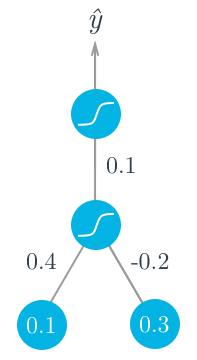
    <p style="color: #555;">Figure:  Backpropagation in Neural Nets</p>
    </div>

    In backpropagation, we're trying to calculate $\boldsymbol{\delta}^{(L-1)}$, which represents how sensitive the loss
    function $J$ is to changes in the pre-activation values $\mathbf{z}^{(L-1)}$ of layer $L-1$:

    $$\boldsymbol{\delta}^{(L-1)} = \frac{\partial J}{\partial \mathbf{z}^{(L-1)}}$$

    To find this, we need to consider all paths through which $\mathbf{z}^{(L-1)}$ can affect the loss $J$. The key
    insight is that $\mathbf{z}^{(L-1)}$ affects $J$ only through its effect on the activations $\mathbf{a}^{(L-1)}$,
    which then affect the next layer.

    Let's apply the chain rule:

    $$\frac{\partial J}{\partial \mathbf{z}^{(L-1)}} = \frac{\partial J}{\partial \mathbf{a}^{(L-1)}} \cdot \frac{\partial \mathbf{a}^{(L-1)}}{\partial \mathbf{z}^{(L-1)}}$$

    The second term $\frac{\partial \mathbf{a}^{(L-1)}}{\partial \mathbf{z}^{(L-1)}}$ is simply the derivative of the
    activation function: $g'^{(L-1)}(\mathbf{z}^{(L-1)})$.

    The first term $\frac{\partial J}{\partial \mathbf{a}^{(L-1)}}$ is more complex. We need to ask: "How do changes in
    $\mathbf{a}^{(L-1)}$ affect the loss $J$?"

    Since $\mathbf{a}^{(L-1)}$ affects $J$ only through its effect on the next layer's pre-activation values
    $\mathbf{z}^{(L)}$, we apply the chain rule again:

    $$\frac{\partial J}{\partial \mathbf{a}^{(L-1)}} = \frac{\partial J}{\partial \mathbf{z}^{(L)}} \cdot \frac{\partial \mathbf{z}^{(L)}}{\partial \mathbf{a}^{(L-1)}}$$

    We already know that $\frac{\partial J}{\partial \mathbf{z}^{(L)}} = \boldsymbol{\delta}^{(L)}$ (this is the error
    term we calculated for layer $L$).

    Now we need to find $\frac{\partial \mathbf{z}^{(L)}}{\partial \mathbf{a}^{(L-1)}}$. Looking at the forward pass
    equation:

    $$\mathbf{z}^{(L)} = \mathbf{W}^{(L)}\mathbf{a}^{(L-1)} + \mathbf{b}^{(L)}$$

    We can see that $\mathbf{z}^{(L)}$ depends on $\mathbf{a}^{(L-1)}$ through the weight matrix $\mathbf{W}^{(L)}$.

    Here's where the matrix calculus gets a bit tricky. Let's consider the individual components. For the $i$-th neuron
    in layer $L$:

    $$z_i^{(L)} = \sum_{j} W_{ij}^{(L)} a_j^{(L-1)} + b_i^{(L)}$$

    If we want to know how $z_i^{(L)}$ changes when $a_j^{(L-1)}$ changes, we get:

    $$\frac{\partial z_i^{(L)}}{\partial a_j^{(L-1)}} = W_{ij}^{(L)}$$

    This means the partial derivative of $z_i^{(L)}$ with respect to $a_j^{(L-1)}$ is precisely the weight connecting
    them.

    When we organize these partial derivatives into a matrix, we get:

    $$\frac{\partial \mathbf{z}^{(L)}}{\partial \mathbf{a}^{(L-1)}} = \mathbf{W}^{(L)}$$

    But there's a dimensional mismatch when we try to multiply this directly with $\boldsymbol{\delta}^{(L)}$. The
    correct way to think about this is that we're backpropagating the error vector $\boldsymbol{\delta}^{(L)}$ through
    the transpose of the weight matrix.

    When we put it all together:

    $$\frac{\partial J}{\partial \mathbf{a}^{(L-1)}} = \boldsymbol{\delta}^{(L)} \cdot (\mathbf{W}^{(L)})^T = (\mathbf{W}^{(L)})^T \boldsymbol{\delta}^{(L)}$$

    However, we previously proved that the derivatives of the softmax and cross-entropy combine in a way that many terms
    cancel out, giving us the elegant result:

    $$\frac{\partial J}{\partial z_i^{(L)}} = a_i^{(L)} - y_i$$

    So we have for the layer $L-1$,
    $\begin{align}\frac{\partial J}{\partial z_i^{(L-1)}} &= a_i^{(L-1)} - y_i \end{align}$

    So we can prove that,

    $a_i^{(L-1)} - y_i =(\mathbf{W}^{(L)})^T \boldsymbol{\delta}^{(L)}$

    The output error for the layer $L$ as proven earlier is:

    $\boldsymbol{\delta}^{(L)} = (\mathbf{a}^{(L)} - \mathbf{y}) \odot g'^{(L)}(\mathbf{z}^{(L)})$

    So, output error for the layer $L-1$:

    $\boldsymbol{\delta}^{(L-1)} = (\mathbf{a}^{(L-1)} - \mathbf{y}) \odot g'^{(L-1)}(\mathbf{z}^{(L-1)})$

    And then:

    $$\boldsymbol{\delta}^{(L-1)} = \frac{\partial J}{\partial \mathbf{z}^{(L-1)}} = \frac{\partial J}{\partial \mathbf{a}^{(L-1)}} \cdot \frac{\partial \mathbf{a}^{(L-1)}}{\partial \mathbf{z}^{(L-1)}} = (\mathbf{W}^{(L)})^T \boldsymbol{\delta}^{(L)} \odot g'^{(L-1)}(\mathbf{z}^{(L-1)})$$

    This gives us our backpropagation formula.

    The transpose of the weight matrix is needed because we're reversing the direction of information flow. During the
    forward pass, weights map from layer $L-1$ to layer $L$. During the backward pass, we're mapping errors from layer
    $L$ back to layer $L-1$.

    Intuitively, if a neuron in layer $L$ has a large error, and there's a strong weight connection to a neuron in layer
    $L-1$, then that neuron in layer $L-1$ bears more responsibility for the error. The transpose operation correctly
    distributes this "blame" based on the connection strengths.

    <div align="center">
    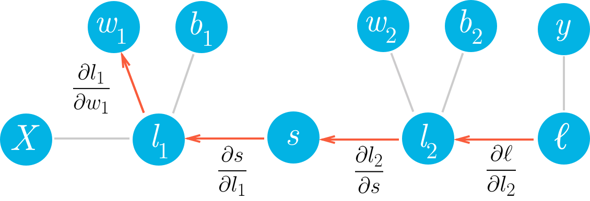
    <p style="color: #555;">Figure:  Gradient Descent and Backpropagation</p>
    </div>

4. **Compute Gradients**: Calculate gradients for weights and biases using the propagated errors.
   $\nabla_{\mathbf{W}^{(l)}}J = \boldsymbol{\delta}^{(l)}(\mathbf{a}^{(l-1)})^T$
   $\nabla_{\mathbf{b}^{(l)}}J = \boldsymbol{\delta}^{(l)}$

    Let me explain the final step of backpropagation, where we compute the actual gradients that will be used to update
    the network's parameters.

    Once we have calculated the error terms (δ) for each layer through backpropagation, we can use these to compute how
    much each weight and bias should be adjusted. The equations for this are:

    $$\nabla_{\mathbf{W}^{(l)}}J = \boldsymbol{\delta}^{(l)}(\mathbf{a}^{(l-1)})^T$$
    $$\nabla_{\mathbf{b}^{(l)}}J = \boldsymbol{\delta}^{(l)}$$

    Let's break down what these equations mean and how they're derived.

    The first equation tells us how to calculate the gradient of the loss with respect to the weights in layer l:

    $$\nabla_{\mathbf{W}^{(l)}}J = \boldsymbol{\delta}^{(l)}(\mathbf{a}^{(l-1)})^T$$

    This can be derived using the chain rule. Remember that during the forward pass:

    $$\mathbf{z}^{(l)} = \mathbf{W}^{(l)}\mathbf{a}^{(l-1)} + \mathbf{b}^{(l)}$$

    We want to know how changing a weight $W_{ij}^{(l)}$ affects the loss. Using the chain rule:

    $$\frac{\partial J}{\partial W_{ij}^{(l)}} = \frac{\partial J}{\partial z_i^{(l)}} \cdot \frac{\partial z_i^{(l)}}{\partial W_{ij}^{(l)}}$$

    We already know that $\frac{\partial J}{\partial z_i^{(l)}} = \delta_i^{(l)}$ (the error term we calculated).

    Looking at the forward pass equation, we can see that:

    $$z_i^{(l)} = \sum_j W_{ij}^{(l)} a_j^{(l-1)} + b_i^{(l)}$$

    Taking the derivative with respect to $W_{ij}^{(l)}$:

    $$\frac{\partial z_i^{(l)}}{\partial W_{ij}^{(l)}} = a_j^{(l-1)}$$

    This means the derivative is simply the activation from the previous layer. Combining these:

    $$\frac{\partial J}{\partial W_{ij}^{(l)}} = \delta_i^{(l)} \cdot a_j^{(l-1)}$$

    When we organize all these partial derivatives into a matrix, we get:

    $$\nabla_{\mathbf{W}^{(l)}}J = \boldsymbol{\delta}^{(l)}(\mathbf{a}^{(l-1)})^T$$

    This is effectively the outer product of the error vector for layer l and the activations from layer l-1. The
    transpose is needed to make the dimensions match correctly.

    Think about what this equation is telling us:

    - If an activation in layer l-1 was large (neuron fired strongly) and the corresponding error in layer l is also
      large, the weight connecting them should receive a large update.
    - If either the activation or the error is close to zero, the weight update will be small.

    This makes intuitive sense! If a neuron in layer l-1 contributed strongly to an error in layer l (by having a high
    activation and connecting to a neuron with high error), then the weight connecting them needs a bigger adjustment.

    The second equation gives us the gradient of the loss with respect to the biases:

    $$\nabla_{\mathbf{b}^{(l)}}J = \boldsymbol{\delta}^{(l)}$$

    This is simpler than the weight gradient. Again using the chain rule:

    $$\frac{\partial J}{\partial b_i^{(l)}} = \frac{\partial J}{\partial z_i^{(l)}} \cdot \frac{\partial z_i^{(l)}}{\partial b_i^{(l)}}$$

    We know that $\frac{\partial J}{\partial z_i^{(l)}} = \delta_i^{(l)}$.

    From the forward pass equation: $$z_i^{(l)} = \sum_j W_{ij}^{(l)} a_j^{(l-1)} + b_i^{(l)}$$

    Taking the derivative with respect to $b_i^{(l)}$: $$\frac{\partial z_i^{(l)}}{\partial b_i^{(l)}} = 1$$

    So: $$\frac{\partial J}{\partial b_i^{(l)}} = \delta_i^{(l)} \cdot 1 = \delta_i^{(l)}$$

    When we put these together for all biases in the layer, we get:
    $$\nabla_{\mathbf{b}^{(l)}}J = \boldsymbol{\delta}^{(l)}$$

    This means the gradient for each bias is simply the corresponding error term for that neuron.

    Once we have these gradients, we can update the weights and biases using gradient descent:

    $$\mathbf{W}^{(l)} := \mathbf{W}^{(l)} - \alpha \nabla_{\mathbf{W}^{(l)}}J$$
    $$\mathbf{b}^{(l)} := \mathbf{b}^{(l)} - \alpha \nabla_{\mathbf{b}^{(l)}}J$$

    Where α is the learning rate that controls how big each adjustment step should be.

    By repeatedly performing forward passes, calculating errors, backpropagating those errors, computing gradients, and
    updating the parameters, the neural network gradually improves its predictions.

    Does this explanation help clarify how we use the propagated errors to compute the final weight and bias gradients?
    Is there anything specific about this step you'd like me to elaborate on further?

##### Backward Pass Considerations

The term $(\mathbf{W}^{(L)})^T \boldsymbol{\delta}^{(L)}$ is a critical component of backpropagation that shows how
errors propagate backward through the network's weights. Let me derive this term carefully so you understand exactly
where it comes from.

To understand this derivation, we need to start with what we're trying to calculate: how sensitive the loss function $J$
is to changes in the pre-activation values of layer $L-1$.

For layer $L-1$, we're looking for $\boldsymbol{\delta}^{(L-1)}$, which is defined as the gradient of the loss with
respect to the pre-activation values:

$$\boldsymbol{\delta}^{(L-1)} = \frac{\partial J}{\partial \mathbf{z}^{(L-1)}}$$

To calculate this, we need to use the chain rule because the loss $J$ doesn't directly depend on $\mathbf{z}^{(L-1)}$.
Rather, $\mathbf{z}^{(L-1)}$ affects $J$ through multiple steps:

1. $\mathbf{z}^{(L-1)}$ determines the activations $\mathbf{a}^{(L-1)}$ via the activation function
2. $\mathbf{a}^{(L-1)}$ serves as input to the next layer, affecting $\mathbf{z}^{(L)}$
3. $\mathbf{z}^{(L)}$ affects the final loss $J$

Following the chain rule, we need to consider all paths through which $\mathbf{z}^{(L-1)}$ can influence $J$. The
immediate effect is on $\mathbf{a}^{(L-1)}$:

$$\frac{\partial J}{\partial \mathbf{z}^{(L-1)}} = \frac{\partial J}{\partial \mathbf{a}^{(L-1)}} \cdot \frac{\partial \mathbf{a}^{(L-1)}}{\partial \mathbf{z}^{(L-1)}}$$

The second factor is straightforward - it's just the derivative of the activation function:
$$\frac{\partial \mathbf{a}^{(L-1)}}{\partial \mathbf{z}^{(L-1)}} = g'^{(L-1)}(\mathbf{z}^{(L-1)})$$

The first factor ($\frac{\partial J}{\partial \mathbf{a}^{(L-1)}}$) is more complex. We need to ask: how do changes in
$\mathbf{a}^{(L-1)}$ affect the loss $J$? This happens because $\mathbf{a}^{(L-1)}$ serves as input to compute
$\mathbf{z}^{(L)}$ in the next layer:

$$\mathbf{z}^{(L)} = \mathbf{W}^{(L)}\mathbf{a}^{(L-1)} + \mathbf{b}^{(L)}$$

Therefore, we need to apply the chain rule again:

$$\frac{\partial J}{\partial \mathbf{a}^{(L-1)}} = \frac{\partial J}{\partial \mathbf{z}^{(L)}} \cdot \frac{\partial \mathbf{z}^{(L)}}{\partial \mathbf{a}^{(L-1)}}$$

We already know that $\frac{\partial J}{\partial \mathbf{z}^{(L)}} = \boldsymbol{\delta}^{(L)}$ by definition.

Now we need to determine $\frac{\partial \mathbf{z}^{(L)}}{\partial \mathbf{a}^{(L-1)}}$. This is asking: how do the
pre-activation values in layer $L$ change when we change the activations in layer $L-1$?

From the forward pass equation $\mathbf{z}^{(L)} = \mathbf{W}^{(L)}\mathbf{a}^{(L-1)} + \mathbf{b}^{(L)}$, we can see
that:

$$\frac{\partial \mathbf{z}^{(L)}}{\partial \mathbf{a}^{(L-1)}} = \mathbf{W}^{(L)}$$

However, there's a dimension mismatch issue here. Let's consider the dimensions of each term:

- $\mathbf{z}^{(L)}$ has dimensions [neurons in layer $L$] × 1
- $\mathbf{a}^{(L-1)}$ has dimensions [neurons in layer $L-1$] × 1
- $\mathbf{W}^{(L)}$ has dimensions [neurons in layer $L$] × [neurons in layer $L-1$]

The partial derivative $\frac{\partial \mathbf{z}^{(L)}}{\partial \mathbf{a}^{(L-1)}}$ should map from the space of
$\mathbf{a}^{(L-1)}$ to the space of $\mathbf{z}^{(L)}$, which means it needs dimensions [neurons in layer $L$] ×
[neurons in layer $L-1$].

Now, when we multiply $\boldsymbol{\delta}^{(L)}$ (with dimensions [neurons in layer $L$] × 1) with this partial
derivative to get $\frac{\partial J}{\partial \mathbf{a}^{(L-1)}}$, we need to ensure the result has dimensions [neurons
in layer $L-1$] × 1.

This is where the transpose comes in. When we compute:

$$\frac{\partial J}{\partial \mathbf{a}^{(L-1)}} = \boldsymbol{\delta}^{(L)} \cdot (\mathbf{W}^{(L)})^T$$

The transpose of $\mathbf{W}^{(L)}$ has dimensions [neurons in layer $L-1$] × [neurons in layer $L$], which when
multiplied with $\boldsymbol{\delta}^{(L)}$ gives us a vector of dimensions [neurons in layer $L-1$] × 1, exactly what
we need.

Therefore:

$$\frac{\partial J}{\partial \mathbf{a}^{(L-1)}} = (\mathbf{W}^{(L)})^T \boldsymbol{\delta}^{(L)}$$

And going back to our original chain rule application:

$$\boldsymbol{\delta}^{(L-1)} = \frac{\partial J}{\partial \mathbf{z}^{(L-1)}} = \frac{\partial J}{\partial \mathbf{a}^{(L-1)}} \cdot \frac{\partial \mathbf{a}^{(L-1)}}{\partial \mathbf{z}^{(L-1)}} = (\mathbf{W}^{(L)})^T \boldsymbol{\delta}^{(L)} \odot g'^{(L-1)}(\mathbf{z}^{(L-1)})$$

This is the backpropagation formula for calculating the error term for layer $L-1$ based on the error term for layer
$L$.

In essence, $(\mathbf{W}^{(L)})^T \boldsymbol{\delta}^{(L)}$ represents how the error at layer $L$ gets propagated back
to affect the activations at layer $L-1$, with each weight determining how much error flows backward along its
connection.

Now we propagate the error backward through the network using the chain rule. For each previous layer, we compute:

$\boldsymbol{\delta}^{(L-1)} = ((\mathbf{W}^{(L)})^T \boldsymbol{\delta}^{(L)}) \odot g'^{(L-1)}(\mathbf{z}^{(L-1)})$

This equation has two key components:

1. $((\mathbf{W}^{(L)})^T \boldsymbol{\delta}^{(L)})$: This propagates the error from layer $L$ back to layer $L-1$
   through the weights. The transpose operation is necessary to match the dimensions.
2. $g'^{(L-1)}(\mathbf{z}^{(L-1)})$: This applies the derivative of the activation function for layer $L-1$, indicating
   how sensitive the activation is to changes in its input.

We continue this pattern all the way back to the first layer:
$\boldsymbol{\delta}^{(L-2)} = ((\mathbf{W}^{(L-1)})^T \boldsymbol{\delta}^{(L-1)}) \odot g'^{(L-2)}(\mathbf{z}^{(L-2)})$

And eventually:
$\boldsymbol{\delta}^{(1)} = ((\mathbf{W}^{(2)})^T \boldsymbol{\delta}^{(2)}) \odot g'^{(1)}(\mathbf{z}^{(1)})$

This backward propagation of error is the key insight of the backpropagation algorithm. It allows us to compute how each
parameter in the network contributed to the final error.

##### Chain Rule Application

The chain rule is the mathematical principle that makes backpropagation possible. It tells us how to calculate
derivatives when functions are composed together—exactly the situation in neural networks, where data flows through
multiple layers of transformations.

For a composite function $f(g(x))$, the chain rule states: $\frac{df}{dx} = \frac{df}{dg} \cdot \frac{dg}{dx}$

In neural networks, we're calculating the derivative of the loss $J$ with respect to weights $\mathbf{W}^{(l)}$ in layer
$l$. This involves a chain of functions—the loss depends on the network output, which depends on the previous layer, and
so on.

Let's break down how the chain rule is applied in backpropagation:

1. **Output Layer Error**: We compute how the loss changes with respect to the pre-activation values:

    $\frac{\partial J}{\partial \mathbf{z}^{(L)}} = \frac{\partial J}{\partial \mathbf{a}^{(L)}} \cdot \frac{\partial \mathbf{a}^{(L)}}{\partial \mathbf{z}^{(L)}}$

    The first term is the derivative of the loss function with respect to the output. The second term is the derivative
    of the activation function.

    Multiplying these gives us $\boldsymbol{\delta}^{(L)}$, the error at the output layer.

2. **Error Backpropagation**: For earlier layers, we compute:

    $\frac{\partial J}{\partial \mathbf{z}^{(l)}} = \frac{\partial J}{\partial \mathbf{z}^{(l+1)}} \cdot \frac{\partial \mathbf{z}^{(l+1)}}{\partial \mathbf{a}^{(l)}} \cdot \frac{\partial \mathbf{a}^{(l)}}{\partial \mathbf{z}^{(l)}}$

    Breaking this down:

    - $\frac{\partial J}{\partial \mathbf{z}^{(l+1)}}$ is the error from the next layer (which we've already computed)
    - $\frac{\partial \mathbf{z}^{(l+1)}}{\partial \mathbf{a}^{(l)}} = (\mathbf{W}^{(l+1)})^T$ because
      $\mathbf{z}^{(l+1)} = \mathbf{W}^{(l+1)}\mathbf{a}^{(l)} + \mathbf{b}^{(l+1)}$
    - $\frac{\partial \mathbf{a}^{(l)}}{\partial \mathbf{z}^{(l)}} = g'^{(l)}(\mathbf{z}^{(l)})$ is the derivative of
      the activation function

    Multiplying these terms gives:
    $\frac{\partial J}{\partial \mathbf{z}^{(l)}} = ((\mathbf{W}^{(l+1)})^T \cdot \frac{\partial J}{\partial \mathbf{z}^{(l+1)}}) \odot g'^{(l)}(\mathbf{z}^{(l)})$

    Which is exactly the backpropagation formula for $\boldsymbol{\delta}^{(l)}$.

3. **Parameter Gradients**: Finally, we compute how changes in weights and biases affect the loss:

    $\frac{\partial J}{\partial \mathbf{W}^{(l)}} = \frac{\partial J}{\partial \mathbf{z}^{(l)}} \cdot \frac{\partial \mathbf{z}^{(l)}}{\partial \mathbf{W}^{(l)}}$

    Since $\mathbf{z}^{(l)} = \mathbf{W}^{(l)}\mathbf{a}^{(l-1)} + \mathbf{b}^{(l)}$, we have:
    $\frac{\partial \mathbf{z}^{(l)}}{\partial \mathbf{W}^{(l)}} = \mathbf{a}^{(l-1)}$

    Therefore: $\frac{\partial J}{\partial \mathbf{W}^{(l)}} = \boldsymbol{\delta}^{(l)} \cdot (\mathbf{a}^{(l-1)})^T$

    Similarly for biases: $\frac{\partial J}{\partial \mathbf{b}^{(l)}} = \boldsymbol{\delta}^{(l)}$

The power of the chain rule is that it breaks a complex derivative into manageable parts. In deep networks, it allows
errors to propagate backward through many layers, enabling learning in early layers despite their distance from the
output.

However, as networks get very deep, repeated application of the chain rule can lead to numerical issues like vanishing
or exploding gradients. If many derivatives are less than 1, their product becomes tiny, causing early layers to learn
very slowly (vanishing gradient). Conversely, if derivatives are large, their product explodes, causing instability.
These issues motivate architectural choices like ReLU activations, residual connections, and careful weight
initialization.

##### Gradient Calculation Optimization

Computing gradients efficiently is crucial for training large neural networks. Several optimization techniques have been
developed to improve the speed, memory usage, and numerical stability of gradient calculations.

**Vectorization**: Instead of processing one example at a time, vectorization computes gradients for multiple examples
simultaneously using matrix operations. This dramatically speeds up computation by leveraging highly optimized linear
algebra libraries like BLAS and cuBLAS.

For example, instead of:

```python
for i in range(batch_size):
    gradients[i] = compute_gradient(examples[i])
```

We compute:

```python
gradients = compute_gradient_vectorized(examples)
```

Mathematically, for a mini-batch of examples, we compute:

$\nabla_{\mathbf{W}^{(l)}}J = \frac{1}{m}\boldsymbol{\delta}^{(l)}(\mathbf{A}^{(l-1)})^T$

Where $\mathbf{A}^{(l-1)}$ contains activations for all examples in the batch, arranged as columns.

**Mini-batch Processing**: Balancing between the computational efficiency of processing multiple examples and the
frequent updates of stochastic gradient descent, mini-batch processing typically uses 32-512 examples per update. This
provides:

- More stable gradient estimates than single examples
- Better utilization of GPU parallelism
- Reasonable memory requirements

The gradients are averaged over the mini-batch:

$\nabla_{\mathbf{W}^{(l)}}J = \frac{1}{|B|}\sum_{i \in B}\nabla_{\mathbf{W}^{(l)}}J_i$

**Automatic Differentiation**: Modern frameworks like TensorFlow and PyTorch implement automatic differentiation, which
builds computational graphs and applies the chain rule automatically. This eliminates the need for manual derivative
calculations and ensures efficiency.

There are two main approaches:

1. **Forward-mode autodiff**: Computes derivatives alongside the forward computation (less common in deep learning)
2. **Reverse-mode autodiff**: Equivalent to backpropagation, computing gradients by working backward from outputs to
   inputs

**Gradient Checkpointing**: For very deep networks that wouldn't fit in GPU memory, gradient checkpointing trades
computation for memory by:

1. Storing only selected intermediate activations during the forward pass
2. Recomputing other activations during the backward pass as needed

This can reduce memory requirements from O(n) to O(√n), with a manageable increase in computation time.

**Mixed Precision Training**: By using lower precision (16-bit) floating point for most computations while keeping a
master copy of weights in higher precision (32-bit), mixed precision training can:

- Speed up computation by 2-3x on modern GPUs
- Reduce memory usage
- Maintain accuracy through techniques like loss scaling to prevent numerical underflow

**Gradient Accumulation**: For cases where the desired batch size would exceed memory limits, gradient accumulation:

1. Processes smaller mini-batches through the network
2. Accumulates their gradients without updating parameters
3. Updates parameters only after several mini-batches have been processed

This enables training with effectively larger batch sizes than would otherwise fit in memory.

**Distributed Gradient Computation**: For very large models or datasets, gradients can be computed across multiple
devices:

- **Data parallelism**: Each device processes different examples and gradients are averaged
- **Model parallelism**: Different parts of the model run on different devices
- **Pipeline parallelism**: Different layers process different batches simultaneously

These approaches require careful synchronization strategies:

- Synchronous updates: Wait for all workers before updating (more stable)
- Asynchronous updates: Update parameters as soon as any worker completes (faster but potentially less stable)

By employing these optimization techniques, modern deep learning systems can efficiently train models with billions of
parameters on massive datasets, making complex applications like large language models and advanced computer vision
systems practical.

#### Training and Optimizing Neural Networks

Training neural networks effectively requires balancing their ability to learn patterns in training data while ensuring
they can generalize to new, unseen data. Let's explore the key concepts and techniques that help achieve this balance.

##### Underfitting vs. Overfitting

When training neural networks, we face a fundamental challenge known as the bias-variance tradeoff, which manifests as
underfitting and overfitting.

**Underfitting** occurs when a model is too simple to capture the underlying patterns in the data. Imagine trying to fit
a straight line to data that follows a curve—the model lacks the flexibility to represent the true relationship.

Signs of underfitting include:

- High training error: The model performs poorly even on the data it was trained on
- High validation error: The model also performs poorly on new data
- Similar performance on both training and validation sets (both equally bad)
- The model makes overly simplistic predictions that miss important patterns

Underfitting typically happens when:

- The model has insufficient capacity (too few layers or neurons)
- Training hasn't continued long enough
- The learning rate is too low
- The model architecture is inappropriate for the problem

**Overfitting** represents the opposite problem—the model learns the training data too well, including its noise and
peculiarities, at the expense of generalization. Think of a student who memorizes test answers without understanding the
underlying concepts.

Signs of overfitting include:

- Very low training error: The model performs extremely well on training data
- High validation error: The model performs poorly on new data
- A large gap between training and validation performance
- The model makes predictions that seem unnecessarily complex or erratic

<div align="center">

<p style="color: #555;">Figure: Overfitting</p>
</div>

Overfitting typically happens when:

- The model has excessive capacity relative to the amount or complexity of training data
- Training continues for too long
- The training data contains noise that the model learns as if it were a pattern
- There are too few training examples compared to the number of parameters

We can visualize this relationship using a model complexity curve. As model complexity increases:

- Training error continuously decreases (the model can memorize more)

- Validation error initially decreases as the model learns true patterns

- Validation error eventually increases as the model begins fitting to noise

<div align="center">
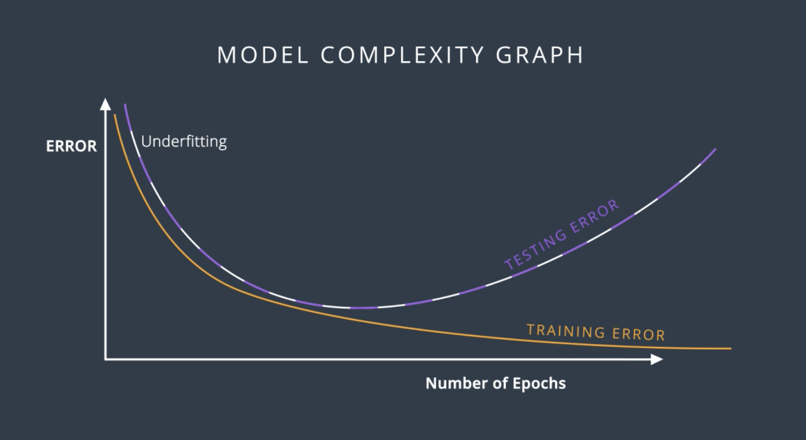
<p style="color: #555;">Figure: Model Complexity Graph</p>
</div>

The optimal model complexity sits at the point where validation error is minimized—complex enough to capture true
patterns but simple enough to ignore noise.

To address underfitting, we can:

- Increase model capacity (add more layers or neurons)
- Train longer with appropriate learning rates
- Use more powerful model architectures
- Improve feature engineering

To address overfitting, we can:

- Apply regularization techniques (discussed next)
- Reduce model complexity
- Get more training data
- Use data augmentation to artificially increase training data diversity
- Employ techniques like early stopping (discussed later)

The art of neural network training largely involves finding this sweet spot between underfitting and overfitting for
each specific problem.

<div align="center">
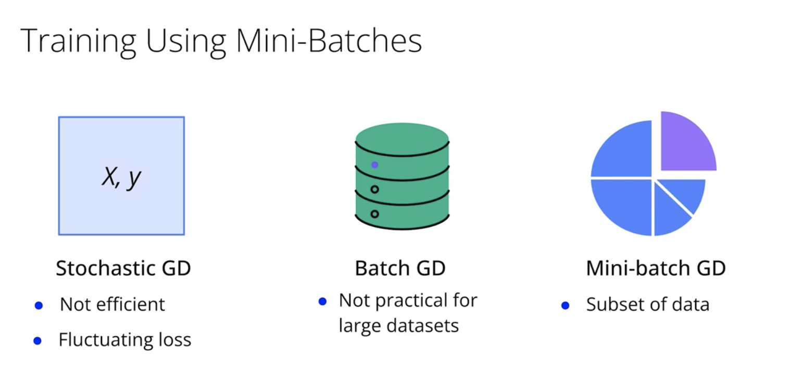
<p style="color: #555;">Figure: Training using Mini-Batches</p>
</div>

##### Regularization Techniques (L1 and L2)

Regularization techniques modify the learning process to reduce a model's complexity and improve its ability to
generalize. They add constraints or penalties that discourage the model from fitting the training data too perfectly.
Let's explore the two most common regularization methods: L1 and L2 regularization.

**L2 Regularization** (also called weight decay or ridge regularization) adds a penalty proportional to the squared
magnitude of weights to the loss function:

$J_{L2}(\mathbf{W}, \mathbf{b}) = J(\mathbf{W}, \mathbf{b}) + \frac{\lambda}{2m} \sum_{l=1}^{L} \sum_{i,j} (W_{ij}^{(l)})^2$

Where:

- $J(\mathbf{W}, \mathbf{b})$ is the original loss function
- $\lambda$ is the regularization strength (a hyperparameter you must tune)
- $m$ is the number of training examples
- $W_{ij}^{(l)}$ represents each individual weight in the network

Think of L2 regularization as placing a "cost" on large weight values. This encourages the network to use all of its
inputs a little bit rather than relying too heavily on any particular input.

When we calculate gradients for weight updates with L2 regularization, we get:

$\frac{\partial J_{L2}}{\partial W_{ij}^{(l)}} = \frac{\partial J}{\partial W_{ij}^{(l)}} + \frac{\lambda}{m}W_{ij}^{(l)}$

This translates into the weight update rule:

$W_{ij}^{(l)} := W_{ij}^{(l)} - \alpha \left(\frac{\partial J}{\partial W_{ij}^{(l)}} + \frac{\lambda}{m}W_{ij}^{(l)}\right)$

Which can be rewritten as:

$W_{ij}^{(l)} := \left(1 - \frac{\alpha\lambda}{m}\right)W_{ij}^{(l)} - \alpha\frac{\partial J}{\partial W_{ij}^{(l)}}$

This shows that L2 regularization effectively shrinks weights by a constant factor on each update—hence the name "weight
decay." L2 regularization:

- Penalizes large weights but rarely forces them exactly to zero
- Tends to produce diffuse, small weights throughout the network
- Works well when all input features are potentially relevant
- Handles correlated features gracefully

**L1 Regularization** adds a penalty proportional to the absolute magnitude of weights:

$J_{L1}(\mathbf{W}, \mathbf{b}) = J(\mathbf{W}, \mathbf{b}) + \frac{\lambda}{m} \sum_{l=1}^{L} \sum_{i,j} |W_{ij}^{(l)}|$

The gradient for L1 regularization is:

$\frac{\partial J_{L1}}{\partial W_{ij}^{(l)}} = \frac{\partial J}{\partial W_{ij}^{(l)}} + \frac{\lambda}{m} \text{sign}(W_{ij}^{(l)})$

Unlike L2, which shrinks weights in proportion to their size, L1 regularization subtracts a constant value from each
weight (the sign of the weight determines the direction). This has a fascinating effect:

- It drives many weights exactly to zero, creating sparse models
- It performs feature selection, completely eliminating the influence of some inputs
- It focuses on the most important features in the data
- It can be beneficial when you suspect many features are irrelevant

We can visualize the difference between L1 and L2 geometrically:

- L2 creates a circular constraint region in weight space, allowing weights to shrink proportionally
- L1 creates a diamond-shaped constraint region, which tends to intersect with axes, zeroing out some weights

**Elastic Net Regularization** combines both approaches:

$J_{\text{elastic}}(\mathbf{W}, \mathbf{b}) = J(\mathbf{W}, \mathbf{b}) + \frac{\lambda_1}{m} \sum_{l} \sum_{i,j} |W_{ij}^{(l)}| + \frac{\lambda_2}{2m} \sum_{l} \sum_{i,j} (W_{ij}^{(l)})^2$

Elastic Net offers a balance:

- It creates some sparsity like L1, helping with feature selection
- It handles correlated features gracefully like L2
- It gives you more fine-grained control through two hyperparameters

When implementing regularization, consider these practical tips:

1. Bias terms are often left unregularized, as they don't contribute significantly to overfitting
2. Different layers may benefit from different regularization strengths (earlier layers often need less regularization)
3. Regularization strength ($\lambda$) should be tuned using validation data—too high and your model will underfit, too
   low and it won't prevent overfitting
4. L2 regularization is generally the default choice for neural networks
5. L1 regularization can be valuable when model size or inference speed is important, as the resulting sparsity can lead
   to computational benefits

The choice between L1 and L2 depends on your specific needs: use L2 when you want to keep all features but reduce their
impact, and L1 when you want the model to be selective about which features it uses.

##### Early Stopping Implementation

Early stopping is a remarkably simple but effective regularization technique that prevents overfitting by monitoring
model performance on a validation set and stopping training when performance begins to deteriorate. Think of it as
knowing when to stop studying for an exam—at some point, you start memorizing the practice questions rather than
learning the underlying concepts.

The fundamental insight behind early stopping is that during training, neural networks typically:

1. First learn general patterns that apply across all data
2. Then begin to memorize specific examples and noise in the training data

By stopping at the sweet spot between these phases, we can capture the useful patterns while avoiding overfitting.

Here's how to implement early stopping:

1. **Split your data**: Divide your available data into training, validation, and test sets (e.g., 70%/15%/15%).
2. **Training loop with monitoring**: After each epoch (a full pass through the training data), evaluate your model on
   the validation set.
3. **Track validation performance**: Monitor a relevant metric like validation loss, accuracy, or F1-score. Keep track
   of the best value seen so far.
4. **Define patience**: Decide how many epochs you're willing to continue training without improvement. This is called
   "patience" and might be anywhere from 5-50 epochs depending on your dataset and model.
5. **Save best model**: Whenever validation performance improves, save a checkpoint of your model.
6. **Stop when progress stalls**: If validation performance hasn't improved for the number of epochs specified by your
   patience parameter, stop training and revert to the best model you saved.

Here's a pseudocode implementation:

```python
best_validation_loss = infinity
patience = 10  # Number of epochs to wait for improvement
wait = 0  # Counter for epochs without improvement
best_model_weights = initial_weights

for epoch in range(max_epochs):
    train_model_for_one_epoch()
    validation_loss = evaluate_on_validation_set()

    if validation_loss < best_validation_loss:
        # Improvement found!
        best_validation_loss = validation_loss
        best_model_weights = current_model_weights
        wait = 0  # Reset counter
    else:
        # No improvement
        wait += 1

    if wait >= patience:
        # We've waited long enough with no improvement
        break

# Restore the best model weights
model_weights = best_model_weights
```

Early stopping can be viewed as a form of regularization because it limits the model's effective capacity by restricting
how many iterations it can use to minimize the training loss. From this perspective, the number of training iterations
plays a similar role to the regularization strength parameter λ in L1 or L2 regularization.

To make early stopping more robust in practice, consider these enhancements:

1. **Smoothed metrics**: Use a moving average of validation performance to reduce the impact of random fluctuations:

    ```python
    smoothed_loss = alpha * current_loss + (1 - alpha) * previous_smoothed_loss
    ```

2. **Minimum improvement threshold**: Only consider improvements significant if they exceed a relative threshold:

    ```python
    if (best_loss - current_loss) / best_loss > min_improvement_threshold:
        # This is a meaningful improvement
    ```

3. **Training curve analysis**: Instead of looking at absolute values, analyze the slope of the validation curve to
   detect plateaus:

    ```python
    slope = calculate_trend_over_last_k_epochs(validation_losses)
    if slope > -min_slope_threshold:
        # We're plateauing
    ```

Early stopping offers several advantages:

- It requires no modification to the loss function or update rule
- It introduces no additional parameters to the model itself
- It reduces computation time by preventing unnecessary training iterations
- It works well in combination with other regularization techniques

However, it also has some limitations:

- It requires a validation set, reducing the data available for training
- It can be affected by noisy validation metrics
- It may stop too early if learning rate schedules would have eventually led to further improvements

In practice, early stopping is almost always used in neural network training—even when other regularization techniques
are applied—because of its simplicity and effectiveness in preventing overfitting while saving computational resources.

##### Dropout Regularization

Dropout is a powerful regularization technique that helps prevent overfitting by randomly "dropping out" (setting to
zero) a fraction of neurons during each training iteration. Think of it as forcing the network to learn with only parts
of its brain working at any time, making it more robust and less dependent on any single neuron.

**How Dropout Works:**

During training, for each example in a mini-batch and for each forward pass, each neuron has a probability $p$ (the
"dropout rate") of being temporarily removed from the network:

$\mathbf{r}^{(l)} \sim \text{Bernoulli}(p)$ $\tilde{\mathbf{a}}^{(l)} = \mathbf{r}^{(l)} \odot \mathbf{a}^{(l)}$

Where:

- $\mathbf{r}^{(l)}$ is a vector of random binary values (0 or 1), with probability $p$ of being 1
- $\odot$ represents element-wise multiplication
- $\mathbf{a}^{(l)}$ is the vector of activations at layer $l$
- $\tilde{\mathbf{a}}^{(l)}$ is the "thinned" activation vector with some values set to zero

These thinned activations are then passed to the next layer. Importantly, at test time (when making predictions on new
data), dropout is disabled, and all neurons are active.

**Scaling During Training and Testing:**

To maintain consistent expected activations between training and testing, we need to adjust for the fact that more
neurons are active during testing. There are two main approaches:

1. **Inverted Dropout** (most common implementation):
    - During training, scale the remaining activations by $\frac{1}{1-p}$:
      $\tilde{\mathbf{a}}^{(l)} = \frac{\mathbf{r}^{(l)}}{1-p} \odot \mathbf{a}^{(l)}$
    - At test time, use the activations as-is (no scaling needed)
2. **Test-time Scaling**:
    - During training, use activations as-is
    - At test time, scale all activations by $(1-p)$: $\mathbf{a}_{\text{test}}^{(l)} = (1-p) \cdot \mathbf{a}^{(l)}$

Both approaches ensure that the expected input to the next layer remains the same during training and testing,
preventing any shifts that could affect performance.

**Why Dropout Works:**

Dropout can be understood from several perspectives:

1. **Model Averaging**: Dropout approximately trains an ensemble of $2^n$ different "thinned" networks, where $n$ is the
   number of neurons. At test time, we're effectively averaging the predictions of all these networks.
2. **Reduced Co-adaptation**: Neurons can't rely on specific other neurons being present, so they must learn more robust
   features. This is like forcing students to understand material independently rather than always relying on the same
   study partner.
3. **Feature Noise**: Dropout adds noise to the feature activations, making the network more robust to variations in the
   input.
4. **Implicit Regularization**: Mathematically, dropout has been shown to approximate an L2-like regularization that
   adapts to the data.

**Practical Implementation Tips:**

1. **Dropout Rate Selection**:
    - Input layer: Lower rates (0.1-0.2) or no dropout
    - Hidden layers: Higher rates (0.2-0.5) with 0.5 being a common default
    - Output layer: Dropout is rarely applied here
2. **Network Size**:
    - Networks with dropout typically need more capacity (larger width)
    - A good rule of thumb: Increase width by roughly 1/(1-p) to maintain effective capacity
3. **Training Dynamics**:
    - Dropout typically slows convergence, requiring more training iterations
    - Often paired with higher learning rates or momentum to counteract this effect
4. **Variations for Different Architectures**:
    - **Spatial Dropout**: For CNNs, drops entire feature maps rather than individual activations
    - **Variational Dropout**: Learns dropout rates automatically during training
    - **Zoneout**: For RNNs, randomly preserves previous hidden states rather than zeroing activations

Here's a simple PyTorch implementation of dropout in a neural network:

```python
import torch.nn as nn

class DropoutNet(nn.Module):
    def __init__(self, input_dim, hidden_dim, output_dim, dropout_rate=0.5):
        super(DropoutNet, self).__init__()
        self.layer1 = nn.Linear(input_dim, hidden_dim)
        self.dropout = nn.Dropout(p=dropout_rate)  # Dropout layer
        self.layer2 = nn.Linear(hidden_dim, output_dim)
        self.relu = nn.ReLU()

    def forward(self, x):
        x = self.layer1(x)
        x = self.relu(x)
        x = self.dropout(x)  # Apply dropout after activation
        x = self.layer2(x)
        return x
```

Note that the framework automatically handles the scaling for us and disables dropout during evaluation mode (when
`model.eval()` is called).

Dropout has become a standard technique in neural network training because it provides significant regularization
benefits with minimal computational overhead. It's especially valuable for large models trained on limited data, where
the risk of overfitting is high.

##### Batch vs. Stochastic Gradient Descent

The choice of how many examples to use for each parameter update has a profound impact on training dynamics, convergence
speed, and final model performance. Let's examine the three main approaches: batch gradient descent, stochastic gradient
descent, and mini-batch gradient descent.

**Batch Gradient Descent (BGD)**:

In batch gradient descent, the entire training dataset is used to compute the gradient for each parameter update:

$\mathbf{W} := \mathbf{W} - \alpha \cdot \frac{1}{m}\sum_{i=1}^{m} \nabla_{\mathbf{W}} J^{(i)}(\mathbf{W}, \mathbf{b})$

$\mathbf{b} := \mathbf{b} - \alpha \cdot \frac{1}{m}\sum_{i=1}^{m} \nabla_{\mathbf{b}} J^{(i)}(\mathbf{W}, \mathbf{b})$

Where $m$ is the total number of training examples.

Imagine surveying an entire mountain range before deciding which direction to step—batch gradient descent gives you the
most accurate information about the overall landscape.

Advantages of BGD:

- **Accurate gradient estimates**: Using the entire dataset provides a precise direction for updates
- **Stable convergence**: Progress is steady and predictable
- **Guaranteed convergence**: For convex problems, it will find the global minimum with the right learning rate
- **Deterministic behavior**: The same starting point always leads to the same result

Disadvantages of BGD:

- **Computational inefficiency**: Processing the entire dataset for each update is slow
- **Memory requirements**: Needs to store gradients for all examples
- **Slow progress**: Updates happen infrequently (once per epoch)
- **Sensitivity to poor local minima**: Can get trapped in suboptimal solutions
- **Redundancy**: Many examples may contribute similar information

**Stochastic Gradient Descent (SGD)**:

In stochastic gradient descent, parameters are updated using just one randomly selected training example for each
update:

$\mathbf{W} := \mathbf{W} - \alpha \cdot \nabla_{\mathbf{W}} J^{(i)}(\mathbf{W}, \mathbf{b})$

$\mathbf{b} := \mathbf{b} - \alpha \cdot \nabla_{\mathbf{b}} J^{(i)}(\mathbf{W}, \mathbf{b})$

This is like taking quick steps based on limited local information—you might not always head in the optimal direction,
but you take many more steps in the same amount of time.

Advantages of SGD:

- **Computational efficiency**: Updates parameters after processing just one example
- **Frequent updates**: Makes rapid progress initially (many updates per epoch)
- **Ability to escape local minima**: The noise in updates can help find better solutions
- **Online learning capability**: Can adapt to new data continuously

Disadvantages of SGD:

- **Noisy updates**: Individual examples give high-variance gradient estimates
- **Erratic convergence**: Progress is noisy with many oscillations
- **Learning rate sensitivity**: Requires careful tuning to avoid divergence
- **Inefficient hardware utilization**: Doesn't leverage modern parallel computing capabilities

**Mini-batch Gradient Descent (MBGD)**:

Mini-batch gradient descent strikes a balance by updating parameters using a small random subset (mini-batch) of the
training data:

$\mathbf{W} := \mathbf{W} - \alpha \cdot \frac{1}{|B|}\sum_{i \in B} \nabla_{\mathbf{W}} J^{(i)}(\mathbf{W}, \mathbf{b})$

$\mathbf{b} := \mathbf{b} - \alpha \cdot \frac{1}{|B|}\sum_{i \in B} \nabla_{\mathbf{b}} J^{(i)}(\mathbf{W}, \mathbf{b})$

Where $B$ is a randomly selected mini-batch (typically 32-512 examples).

Think of this as taking moderately informed steps at a good pace—you get reasonably accurate direction information while
still making frequent progress.

Advantages of MBGD:

- **Balanced approach**: More stable than SGD but more efficient than BGD
- **Efficient hardware utilization**: Leverages GPU parallelization capabilities
- **Reduced variance**: More reliable gradient estimates than SGD
- **Regularization effect**: Some noise in updates can help generalization
- **Practical convergence**: Good balance between update quality and frequency

Disadvantages of MBGD:

- **Hyperparameter sensitivity**: Requires tuning both learning rate and batch size
- **Memory constraints**: Maximum batch size limited by available hardware
- **Batch normalization dependency**: Behavior of normalization layers depends on batch composition

**Comparative Analysis**:

1. **Convergence Speed**:
    - In wall-clock time: MBGD > SGD > BGD (for large datasets)
    - In number of updates needed: BGD > MBGD > SGD
2. **Final Accuracy**:
    - For convex problems: All methods converge to the same solution
    - For non-convex problems (like neural networks): MBGD and SGD often find better solutions than BGD
3. **Memory Requirements**: BGD > MBGD > SGD
4. **Practical Considerations**:
    - Single-core efficiency: SGD > MBGD > BGD
    - GPU/parallel efficiency: MBGD > BGD > SGD

**Batch Size Selection**:

The choice of batch size for mini-batch gradient descent significantly impacts training:

1. **Small batches** (8-32):
    - Higher noise helps escape poor local minima
    - Often result in better generalization
    - Less efficient hardware utilization
    - More frequent updates
2. **Medium batches** (64-256):
    - Good balance of stability and update frequency
    - Efficient GPU utilization
    - Reliable batch statistics for normalization layers
3. **Large batches** (512+):
    - More stable gradient estimates
    - Maximum hardware utilization
    - May require special optimization techniques
    - Can lead to poorer generalization without adjustments

In practice, mini-batch gradient descent with a batch size of 32-128 is the most common choice for neural network
training. The exact optimal value depends on your specific problem, model architecture, and available hardware. When
using very large batches, techniques like LARS (Layer-wise Adaptive Rate Scaling) or linear scaling of learning rates
may be necessary to maintain good generalization performance.

##### Momentum and Advanced Optimizers

While standard gradient descent and its variants provide the foundation for neural network optimization, advanced
optimization techniques incorporate additional mechanisms to accelerate convergence, navigate complex loss landscapes,
and improve final performance. Let's explore these powerful techniques that have transformed deep learning training.

**Momentum**:

Traditional gradient descent can oscillate wildly in ravines (areas where the surface curves much more steeply in one
dimension than in another). Momentum helps address this by adding a fraction of the previous update to the current one:

$\mathbf{v}_t = \gamma \mathbf{v}_{t-1} + \eta \nabla_{\mathbf{\theta}} J(\mathbf{\theta}_{t-1})$
$\mathbf{\theta}_t = \mathbf{\theta}_{t-1} - \mathbf{v}_t$

Where:

- $\mathbf{v}_t$ is the velocity vector at time $t$
- $\gamma$ is the momentum coefficient (typically 0.9)
- $\eta$ is the learning rate

Think of momentum as a ball rolling down a hill. It accumulates velocity in consistent directions and can roll through
small bumps or depressions in the terrain. This provides several benefits:

1. **Accelerated convergence**: Speeds up progress along directions with consistent gradients
2. **Reduced oscillations**: Smooths out the zigzagging in narrow valleys
3. **Escape from local minima**: Can overcome small obstacles due to accumulated momentum
4. **Improved conditioning**: Effectively changes the geometry of the optimization problem

**Nesterov Accelerated Gradient (NAG)**:

Nesterov momentum improves on standard momentum by evaluating the gradient at an approximate future position rather than
the current one:

$\mathbf{v}*t = \gamma \mathbf{v}*{t-1} + \eta \nabla_{\mathbf{\theta}} J(\mathbf{\theta}*{t-1} - \gamma \mathbf{v}*{t-1})$
$\mathbf{\theta}*t = \mathbf{\theta}*{t-1} - \mathbf{v}_t$

This "look-ahead" evaluation provides a correction to the momentum trajectory. Imagine a ball rolling down a hill, but
now it can look ahead to adjust its trajectory before committing to it. This results in:

1. Faster convergence for convex problems (with theoretical guarantees)
2. More responsive behavior to gradient changes
3. Better behavior near minima, reducing overshooting

**Adaptive Learning Rate Methods**:

These optimizers adjust the learning rate individually for each parameter based on the history of gradients, addressing
the problem that some parameters need larger updates than others.

1. **AdaGrad**:

    AdaGrad accumulates squared gradients to adjust the learning rate for each parameter:

    $\mathbf{g}_t = \nabla*{\mathbf{\theta}} J(\mathbf{\theta}_{t-1})$
    $\mathbf{G}_t = \mathbf{G}_{t-1} + \mathbf{g}_t^2$ (element-wise square)
    $\mathbf{\theta}_t = \mathbf{\theta}_{t-1} - \frac{\eta}{\sqrt{\mathbf{G}_t + \epsilon}} \odot \mathbf{g}_t$

    Where $\epsilon$ is a small constant (typically 1e-8) to prevent division by zero.

    AdaGrad effectively gives larger updates to infrequent parameters and smaller updates to frequent ones. However,
    because the accumulated sum $\mathbf{G}_t$ only grows, the learning rate continuously decreases, sometimes causing
    training to stop too early.

2. **RMSProp**:

    RMSProp modifies AdaGrad to use an exponentially weighted moving average instead:

    $\mathbf{G}_t = \beta \mathbf{G}_{t-1} + (1-\beta) \mathbf{g}_t^2$
    $\mathbf{\theta}_t = \mathbf{\theta}_{t-1} - \frac{\eta}{\sqrt{\mathbf{G}_t + \epsilon}} \odot \mathbf{g}_t$

    Where $\beta$ is typically 0.9.

    By using a moving average rather than a sum, RMSProp prevents the aggressive learning rate decay of AdaGrad, making
    it more suitable for non-convex problems like neural networks.

3. **Adam** (Adaptive Moment Estimation):

    Adam combines the benefits of momentum with adaptive learning rates:

    $\mathbf{m}_t = \beta_1 \mathbf{m}_{t-1} + (1-\beta_1) \mathbf{g}_t$ (first moment - momentum)
    $\mathbf{v}_t = \beta_2 \mathbf{v}_{t-1} + (1-\beta_2) \mathbf{g}_t^2$ (second moment - adaptive rates)

    With bias correction to account for the zero initialization:

    $\hat{\mathbf{m}}_t = \frac{\mathbf{m}_t}{1-\beta_1^t}$ $\hat{\mathbf{v}}_t = \frac{\mathbf{v}_t}{1-\beta_2^t}$

    The update rule then becomes:

    $\mathbf{\theta}_t = \mathbf{\theta}_{t-1} - \eta \frac{\hat{\mathbf{m}}_t}{\sqrt{\hat{\mathbf{v}}_t} + \epsilon}$

    Default values are $\beta_1 = 0.9$, $\beta_2 = 0.999$, and $\epsilon = 10^{-8}$.

    Adam has become the default optimizer for many applications because it combines:

    - Speed from momentum
    - Parameter-specific learning rates
    - Bias correction for more accurate estimates
    - Robustness across a wide range of problems

4. **AdamW**:

    A modification of Adam that properly separates weight decay from the adaptive learning rate mechanism:

    $\mathbf{\theta}_t = \mathbf{\theta}_{t-1} - \eta \frac{\hat{\mathbf{m}}_t}{\sqrt{\hat{\mathbf{v}}*t} + \epsilon} - \eta \lambda \mathbf{\theta}*{t-1}$

    Where $\lambda$ is the weight decay coefficient. This seemingly simple change improves generalization in many tasks.

**Specialized Neural Network Optimizers**:

1. **RAdam** (Rectified Adam): Modifies Adam with a term that rectifies the variance of the adaptive learning rate,
   addressing warmup instability and improving convergence.
2. **Lookahead**: Maintains two sets of weights: "fast" weights updated with any optimizer, and "slow" weights that move
   toward the fast weights periodically. This stabilizes training with minimal extra computation.
3. **LAMB** (Layer-wise Adaptive Moments for Batch training): Designed for large-batch training, LAMB scales updates
   based on the layer-wise ratio of weight norm to gradient norm, enabling training with much larger batches.

**Practical Optimizer Selection**:

1. **For starting a new problem**:
    - Adam or AdamW is generally a robust default choice
    - Learning rate of 0.001 (or a range from 3e-4 to 1e-3) is a common starting point
2. **For fine-tuning pre-trained models**:
    - SGD with momentum often provides better generalization
    - Smaller learning rates (1e-4 to 1e-5)
3. **For specific architectures**:
    - CNNs: Often work well with SGD+momentum for image classification
    - RNNs and Transformers: Adam/AdamW with learning rate warmup
4. **For very large models**:
    - AdamW with weight decay between 0.01 and 0.1
    - Learning rate warmup followed by cosine decay

The choice of optimizer interacts with other aspects of training like batch size, regularization, and network
architecture. To find the best optimizer for your specific problem, consider starting with Adam (due to its robust
performance across many tasks) and then experiment with alternatives if needed.

Here's a quick implementation example showing how to use different optimizers in PyTorch:

```python
import torch.optim as optim

# SGD with momentum
optimizer = optim.SGD(model.parameters(), lr=0.01, momentum=0.9)

# Adam
optimizer = optim.Adam(model.parameters(), lr=0.001, betas=(0.9, 0.999))

# AdamW
optimizer = optim.AdamW(model.parameters(), lr=0.001, weight_decay=0.01)

# RMSprop
optimizer = optim.RMSprop(model.parameters(), lr=0.001, alpha=0.99)
```

Advanced optimizers have significantly reduced training time and improved performance for deep learning models across
nearly all domains, making them essential tools in the modern neural network practitioner's toolkit.

##### Random Restart Techniques

Training neural networks can be challenging because of the highly non-convex nature of their loss landscapes. Think of
the optimization process as trying to find the lowest point in a mountain range filled with countless valleys, ridges,
and plateaus. Random restart techniques provide strategies to explore this complex landscape more thoroughly and find
better solutions.

**Basic Random Restart**

The simplest approach repeatedly initializes and trains the neural network with different random weight initializations:

1. Initialize the network with random weights
2. Train until convergence or a stopping criterion is met
3. Store the final model and its performance
4. Repeat steps 1-3 multiple times with different random initializations
5. Select the model with the best performance

This strategy is based on the principle that different starting points lead to different optimization trajectories.
Imagine starting your hike from different locations around a mountain range—each path might lead you to a different
valley, and some valleys are deeper (better minima) than others.

The main advantages of this approach are:

- It's straightforward to implement and parallelize (you can train multiple models simultaneously)
- It requires no modifications to the training procedure itself
- It allows exploration of diverse regions in the parameter space

However, it has notable disadvantages:

- It's computationally expensive, requiring multiple complete training runs
- There's no information sharing between different runs
- It may still miss better minima that are difficult to reach from random initializations

**Advanced Random Restart Variations**

1. **Iterated Local Search**

Instead of completely random restarts, this approach perturbs the parameters of a previously found solution:

$\mathbf{\theta}_{new} = \mathbf{\theta}_{old} + \epsilon \cdot \mathbf{n}$

Where $\mathbf{n}$ is a random noise vector (often Gaussian) and $\epsilon$ controls the perturbation magnitude.

This is like finding a good valley, then climbing partway up and descending again in a slightly different direction to
see if you can find an even better valley nearby. The advantage is that you're exploring the neighborhood of promising
solutions rather than starting from scratch each time.

1. **Basin Hopping**

This technique combines local optimization with acceptance criteria for jumps between different regions:

- Perform local optimization to reach a minimum
- Apply a random perturbation to the parameters
- Perform local optimization again from the perturbed position
- Accept or reject the new solution based on criteria (e.g., Metropolis criterion)

Basin hopping is like systematically exploring a mountain range by finding a valley, recording its depth, then
intentionally climbing out to find another valley, keeping track of the deepest one you've found.

1. **Graduated Optimization**

This approach starts with a simplified or smoothed version of the loss function and gradually transitions to the
original loss:

$J_{\text{smoothed}}(\mathbf{\theta}) = (J * G_{\sigma})(\mathbf{\theta})$

Where $G_{\sigma}$ is a Gaussian kernel with width $\sigma$ that decreases over time.

The concept is similar to looking at a mountain range through progressively clearer lenses. First, you see only the
major valleys (smoothed landscape) and find the general area of interest, then as the picture becomes clearer (less
smoothing), you refine your search to find the true minimum.

1. **Cyclical Learning Rates with Restarts**

This technique periodically increases the learning rate to help the model escape local minima:

$\alpha(t) = \alpha_{min} + \frac{1}{2}(\alpha_{max} - \alpha_{min})(1 + \cos(\frac{2\pi \cdot \text{mod}(t, T)}{T}))$

Where $T$ is the cycle length. After each cycle, the learning rate drops again, effectively allowing the model to
restart from a different position while retaining information from previous training.

This is like periodically giving your hiker a boost of energy to climb out of whatever valley they're in, then letting
them descend again, potentially into a better valley.

1. **Snapshot Ensembles**

This method saves model snapshots at the end of each learning rate cycle, then ensembles these models:

- Train with cyclical learning rates
- Save model weights at the minimum of each cycle
- Average predictions across all saved models during inference

This approach leverages the diversity of solutions found during different cycles, combining their strengths. Rather than
picking just one valley as your answer, you're considering the wisdom from multiple good valleys.

**Implementation Considerations**

1. **Weight Initialization Strategies**

Different initialization methods can significantly impact the quality of random restarts:

- **Glorot/Xavier initialization**: Scales weights based on the number of input and output connections, helping signals
  propagate well in both directions
- **He initialization**: Modified version for ReLU activations that maintains appropriate variance
- **Orthogonal initialization**: Ensures orthogonality between weight vectors, improving gradient flow
- **Pre-trained initialization**: Starting from weights learned on a related task, which often provides a better
  starting point

1. **Randomization Control**

You can control which parts of the model to randomize:

- Full reinitialization: Reset all weights to new random values
- Partial reinitialization: Only reset certain layers (often later layers)
- Selective perturbation: Add noise to weights proportional to their magnitude

1. **Restart Scheduling**

Strategies for deciding when to restart:

- Fixed interval: Restart after a predetermined number of epochs
- Performance-based: Restart when validation performance plateaus
- Adaptive: Adjust restart frequency based on observed improvement
- Probabilistic: Restart with a probability that increases as training progresses

1. **Computational Efficiency**

Approaches to reduce the computational cost:

- Parallel restarts: Train multiple models simultaneously
- Early detection: Use early stopping to quickly abandon unpromising runs
- Transfer learning: Reuse early layers from previous runs
- Progressive training: Increase model complexity after each restart

**Theoretical Insights**

Recent research has provided interesting perspectives on why random restarts work:

1. **Mode Connectivity**: Different solutions (minima) for neural networks are often connected by simple paths of low
   loss. Random restarts help discover these diverse but connected solutions.
2. **High-Dimensional Geometry**: In high-dimensional spaces, local minima are rare compared to saddle points. Random
   restarts help escape saddle points rather than true local minima.
3. **Basin of Attraction**: Different initializations fall into different basins of attraction, leading to qualitatively
   different solutions with potentially different generalization properties.

**Practical Applications**

1. **Hyperparameter Optimization**

Random restarts can be combined with hyperparameter search:

- Run multiple restarts with different hyperparameters
- Select the best combination of initialization and hyperparameters

This approach helps disentangle the effects of initialization luck from actual hyperparameter quality. It's like trying
different hiking routes with different equipment, then determining which equipment really makes a difference versus
which routes were just inherently easier.

1. **Ensemble Creation**

Models trained from different random restarts can be ensembled:

- Diversity of models improves ensemble performance
- Different minima provide complementary perspectives on the data
- Ensembles reduce overall variance in predictions

1. **Architecture Selection**

When comparing different neural network architectures, random restarts help evaluate choices more fairly:

- Multiple runs per architecture account for initialization variance
- Statistical comparison of performance distributions
- More reliable conclusions about architectural differences

Random restart techniques remain an important tool in neural network training, particularly for problems with complex
loss landscapes or when maximum performance is critical. They provide insurance against the inherent randomness in
neural network optimization and increase the probability of finding high-quality solutions.

#### Transfer Learning

Transfer learning is a powerful approach in machine learning where knowledge gained from solving one problem is applied
to a different but related problem. Much like how a human might apply knowledge from learning to ride a bicycle when
learning to ride a motorcycle, neural networks can leverage experience from one task to perform better on another. This
technique has revolutionized how we approach problems with limited data and computational resources.

<div align="center">
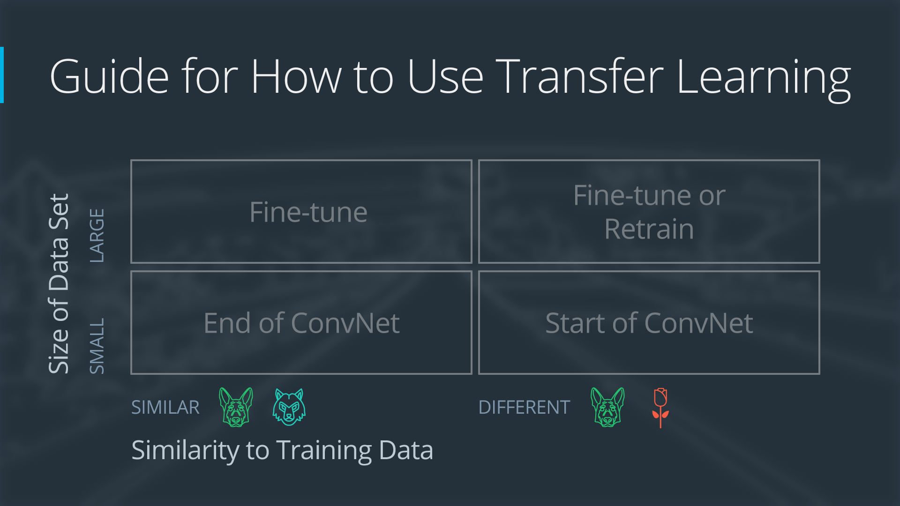
<p style="color: #555;">Figure:  Transfer Learning Usage Guide</p>
</div>

##### Transfer Learning Approaches

Transfer learning encompasses several distinct strategies that vary in how knowledge is transferred between the source
and target domains. Let's explore these approaches in detail:

**Feature-based Transfer Learning**

In this approach, we use pre-trained models as sophisticated feature extractors without modifying their internal
parameters:

1. A deep neural network is pre-trained on a large dataset (like ImageNet for images or a large corpus for text)
2. We remove the final classification layers, leaving the feature extraction portion intact
3. We use this truncated network to transform raw inputs into learned feature representations
4. These rich features become inputs to a new model that we train specifically for our target task

Mathematically, if $f_θ$ represents our pre-trained model with parameters $θ$, and $x$ is an input, we compute a feature
representation $h = f_θ(x)$. We then train a new model $g_ϕ$ with parameters $ϕ$ to map these features to our target
output:

$y = g_ϕ(h) = g_ϕ(f_θ(x))$

This approach works particularly well when:

- Your target dataset is small (hundreds or few thousands of examples)
- Computational resources are limited
- The source and target domains share similar low-level features but differ in high-level concepts

Imagine using a network trained on general images to extract features from medical X-rays—while the final classification
task differs dramatically, both domains benefit from similar edge, texture, and shape detectors in early layers.

**Fine-tuning Based Transfer Learning**

With fine-tuning, we not only use the pre-trained model structure but also its learned parameters as initialization
points that we then adjust for our new task:

1. We start with a pre-trained model $f_θ$
2. We replace the final layer(s) to match our new output requirements
3. We train the entire network or portions of it on our target dataset
4. During training, we typically use a lower learning rate to prevent destroying the valuable pre-trained features

Fine-tuning comes in several variations:

- **Shallow fine-tuning**: Only the new layers and perhaps the last few layers of the original model are updated
- **Deep fine-tuning**: All layers are updated, but earlier layers typically use smaller learning rates
- **Gradual unfreezing**: We progressively unfreeze and train deeper layers over time, starting from the output layers

Fine-tuning generally outperforms feature-based transfer when:

- Your target dataset is moderately sized (thousands to tens of thousands of examples)
- You have sufficient computational resources
- The source and target domains have meaningful similarities

**Multi-task Learning**

Unlike sequential transfer (learn task A, then task B), multi-task learning simultaneously trains a model on several
related tasks:

1. A shared network learns common representations across all tasks
2. Task-specific branches extend from this shared base for different outputs
3. The combined loss function includes contributions from all tasks: $L_{\text{total}} = \sum_{i=1}^{n} w_i L_i$ where
   $L_i$ is the loss for task $i$ and $w_i$ is its weight

The advantage of multi-task learning comes from the mutual reinforcement between tasks. For example, a model learning to
simultaneously detect edges, recognize objects, and estimate depth in images will develop representations that capture
multiple aspects of visual understanding, potentially performing better on each task than separate models would.

**Domain Adaptation**

This specialized form of transfer learning focuses specifically on bridging the gap between domains where the task
remains the same but the data distribution changes:

1. The fundamental task (like classification) stays consistent
2. The input distribution changes (e.g., daytime photos → nighttime photos)
3. The model needs to adapt to perform well across this domain shift

Domain adaptation employs techniques like:

- Adversarial training to create domain-invariant features
- Statistical alignment of feature distributions between domains
- Explicit modeling of domain differences

For example, a self-driving car system trained on data from California might need domain adaptation to work properly in
snowy Minnesota conditions, even though the fundamental task of identifying road features remains the same.

**Zero-shot and Few-shot Learning**

These approaches transfer knowledge to entirely new classes or tasks with minimal or no labeled examples:

- **Zero-shot learning** leverages semantic descriptions (like text attributes) to classify previously unseen
  categories. For instance, a model might classify an animal it's never seen before based on a textual description of
  its characteristics.
- **Few-shot learning** adapts to new categories with only a handful of examples (often 1-5 per class). Rather than
  learning specific categories, these models learn how to compare and differentiate between examples, enabling quick
  adaptation to new classes.

These methods are crucial when collecting examples of all possible classes is impractical—imagine a visual recognition
system that could identify rare animals or unusual medical conditions with just a few examples.

**Knowledge Distillation**

This approach transfers knowledge from a large, complex model (the "teacher") to a smaller, simpler model (the
"student"):

1. The teacher model is trained on a large dataset
2. It produces soft targets (probability distributions) for training examples
3. The student model is trained to match both the correct labels and the teacher's soft targets
4. The loss function combines a standard task loss with a distillation loss:
   $L = α L_{\text{task}}(y, \hat{y}*{\text{student}}) + (1-α) L*{\text{distill}}(\hat{y}*{\text{teacher}}, \hat{y}*{\text{student}})$

Knowledge distillation is valuable when deployment constraints (like memory, processing power, or latency requirements)
prevent using the large teacher model directly, but we still want to benefit from its learned knowledge.

Each of these transfer learning approaches offers different tradeoffs in terms of computational requirements, data
efficiency, and performance. The best choice depends on the specific characteristics of your source and target domains,
the amount of available target data, and your computational constraints.

##### Pre-trained Model Utilization

Pre-trained models serve as the foundation for most transfer learning applications. Using these models effectively
requires understanding how to select the right model, access it properly, and integrate it into your solution. Let's
explore the practical aspects of working with pre-trained models:

<div align="center">
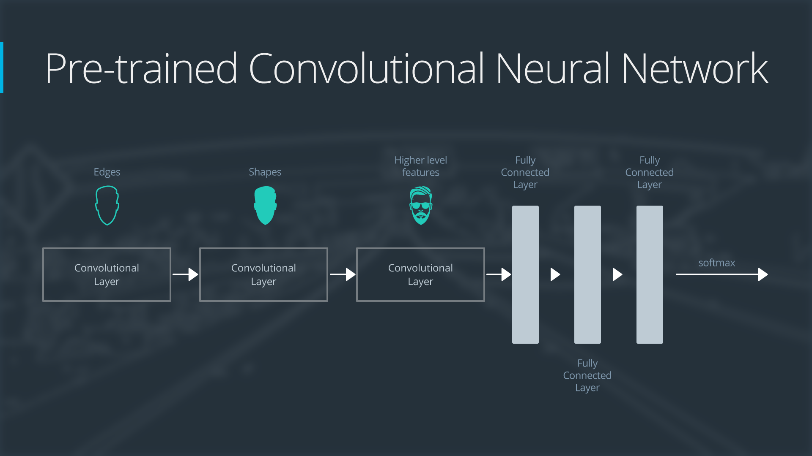
<p style="color: #555;">Figure: Pre-trained Convolutional Neural Nets</p>
</div>

**Sources of Pre-trained Models**

Today's machine learning landscape offers numerous repositories where you can find models pre-trained on large datasets:

1. Model Zoos and Repositories

    :

    - **TensorFlow Hub**: Google's repository of reusable model components
    - **PyTorch Hub**: Facebook's collection of pre-trained models
    - **Hugging Face Models**: Especially rich in NLP models like BERT, GPT, etc.
    - **Timm (PyTorch Image Models)**: Comprehensive collection of computer vision models

These repositories provide standardized interfaces, documentation, and often example code that shows how to use the
models effectively.

1. **Foundation Models**:
    - Large-scale models trained on diverse, extensive datasets
    - Examples include BERT/RoBERTa for text, ResNet/EfficientNet for images, and CLIP for multimodal tasks
    - These models capture broad knowledge that transfers well to many downstream tasks
    - They typically contain millions or billions of parameters
2. **Domain-Specific Models**:
    - Specialized models pre-trained for particular fields like medical imaging, satellite imagery, or financial data
    - Often maintained by industry or academic groups focused on specific domains
    - May incorporate domain knowledge in their architecture or training process
    - Usually outperform general models on domain-specific tasks

**Selection Criteria for Pre-trained Models**

Choosing the right pre-trained model involves considering several factors:

1. **Task Alignment**: How similar is the pre-training task to your target task? A model trained for image
   classification might transfer well to object detection but less well to image generation. Look for:

    - Similar input and output structures
    - Comparable complexity level
    - Related cognitive processes (for AI tasks that mirror human cognition)

2. **Domain Similarity**: How closely does the pre-training data match your target data? Consider:

    - Visual characteristics (for images): lighting, perspective, style, resolution
    - Language characteristics (for text): formality, technical vocabulary, sentence structure
    - Distribution of classes or features

    The closer these align, the better the transfer will generally work.

3. **Model Architecture Considerations**:

    - **Size and computational requirements**: Larger isn't always better if you have constraints
    - **Inference speed**: Critical for real-time applications
    - **Memory usage**: Important for deployment on edge devices or mobile
    - **Hardware compatibility**: Some architectures are optimized for specific hardware

4. **Pre-training Data**:

    - **Size and diversity**: Generally, models trained on larger, more diverse datasets transfer better
    - **Potential biases**: Models inherit biases present in their training data
    - **Licensing and ethical considerations**: Some models have restrictions on commercial use
    - **Potential overlap with test data**: Be wary of data leakage if your test set might overlap with the pre-training
      data

**Feature Extraction Process**

When using pre-trained models as feature extractors, you have several options for how to extract and use the features:

1. **Layer Selection**: Different layers of a neural network capture different levels of abstraction:

    - **Early layers** capture low-level features like edges, colors, or character patterns
    - **Middle layers** represent mid-level features like textures, shapes, or grammatical structures
    - **Later layers** encode high-level concepts like objects, scenes, or semantic meaning

    The best layer depends on how similar your task is to the original pre-training task. If the tasks are very
    different, earlier or middle layers often work better.

2. **Feature Aggregation**: For models producing multi-dimensional outputs (like convolutional networks), you need to
   aggregate features:

    - **Global pooling**: Average or max pooling across spatial dimensions
    - **Attention mechanisms**: Weighted aggregation focusing on the most relevant parts
    - **Multi-layer features**: Combining features from different layers for richer representation
    - **Regional features**: Extracting features from specific regions of interest

3. **Feature Post-processing**:

    - **Dimensionality reduction**: Using PCA or t-SNE to reduce feature size
    - **Normalization**: Standardizing features to have zero mean and unit variance
    - **Feature selection**: Keeping only the most informative dimensions

**Practical Implementation Steps**

Let's walk through a typical implementation of pre-trained model utilization in PyTorch:

```python
import torch
from torchvision import models, transforms

# 1. Load pre-trained model
model = models.resnet50(pretrained=True)  # Load ResNet-50 with pre-trained weights

# 2. Modify for feature extraction by removing the classification head
feature_extractor = torch.nn.Sequential(*list(model.children())[:-1])
feature_extractor.eval()  # Set to evaluation mode

# 3. Define preprocessing to match what the model expects
preprocess = transforms.Compose([
    transforms.Resize(256),                    # Resize to 256x256
    transforms.CenterCrop(224),                # Take center 224x224 crop
    transforms.ToTensor(),                     # Convert to tensor (0-1 range)
    transforms.Normalize([0.485, 0.456, 0.406],  # Normalize with ImageNet statistics
                         [0.229, 0.224, 0.225])
])

# 4. Extract features for an image
def extract_features(image):
    # Preprocess the image
    image_tensor = preprocess(image).unsqueeze(0)  # Add batch dimension

    # Extract features without computing gradients
    with torch.no_grad():
        features = feature_extractor(image_tensor)

    # Convert to flat feature vector
    features = features.squeeze()

    return features

# 5. Train a simple classifier on these features
def train_classifier(features_dataset, labels, num_classes):
    # Define a simple linear classifier
    classifier = torch.nn.Linear(features_dataset.shape[1], num_classes)

    # Define loss function and optimizer
    criterion = torch.nn.CrossEntropyLoss()
    optimizer = torch.optim.Adam(classifier.parameters(), lr=0.001)

    # Training loop
    for epoch in range(100):  # 100 epochs
        # Forward pass
        outputs = classifier(features_dataset)
        loss = criterion(outputs, labels)

        # Backward pass and optimize
        optimizer.zero_grad()
        loss.backward()
        optimizer.step()

        if epoch % 10 == 0:
            print(f'Epoch {epoch}, Loss: {loss.item():.4f}')

    return classifier
```

This approach allows you to leverage the powerful feature representations learned by pre-trained models while training
only a simple classifier on top, dramatically reducing the amount of data and computation needed compared to training
from scratch.

When using pre-trained models, remember that they're only as good as the data they were trained on. Always evaluate
their performance on your specific task and be aware of potential biases or limitations that might transfer from the
pre-training process.

##### Fine-tuning Strategies

Fine-tuning adapts a pre-trained model to a specific target task by updating some or all of its parameters. This process
is more involved than using a model as a fixed feature extractor, but it often yields better performance. Let's explore
effective strategies for fine-tuning pre-trained models.

**Layer-wise Fine-tuning Strategies**

There are several approaches to deciding which layers of a pre-trained model to update during fine-tuning:

1. **Feature Extraction (Freeze All Pre-trained Layers)**

    In this approach, we treat the pre-trained model as a fixed feature extractor:

    - All pre-trained weights remain frozen (not updated)
    - Only the newly added layers (typically a classifier) are trained
    - This is technically not fine-tuning, but rather transfer learning with feature extraction

    This strategy is appropriate when:

    - Your target dataset is very small (hundreds of examples)
    - Your computational resources are limited
    - Your target task is very similar to the pre-training task

    The intuition is that the pre-trained model already captures useful features, and you just need to learn how to use
    these features for your specific classification task.

2. **Shallow Fine-tuning (Update Only Top Layers)**

    With shallow fine-tuning, we freeze most of the network but allow the later layers to adapt:

    - Early and middle layers remain frozen
    - Later layers and newly added components are updated
    - This reflects the idea that earlier layers capture generic features (edges, textures) that transfer well across
      tasks, while later layers are more task-specific

    This approach works well when:

    - Your target dataset is moderately sized (thousands of examples)
    - Your target task differs from the pre-training task in high-level features
    - You want to balance adaptation with the risk of overfitting

    For example, when fine-tuning a vision model, you might freeze the first few convolutional blocks and only train the
    last block plus your new classifier.

3. **Deep Fine-tuning (Update All Layers)**

    In deep fine-tuning, we update all model parameters:

    - The entire network is trained end-to-end
    - Pre-trained weights serve only as initialization
    - This allows maximum adaptation to the target task

    This strategy is appropriate when:

    - Your target dataset is large (tens of thousands+ examples)
    - Your target domain differs significantly from the source domain
    - You have sufficient computational resources
    - You employ proper regularization to prevent overfitting

    Deep fine-tuning provides the most flexibility but requires careful management of the learning process to avoid
    destroying the valuable knowledge in the pre-trained weights.

4. **Gradual Unfreezing**

    This more sophisticated approach progressively unlocks layers for training:

    - Start with all pre-trained layers frozen
    - Train only the newly added layers for a few epochs
    - Unfreeze the last pre-trained layer and train for a few more epochs
    - Continue progressively unfreezing layers from top to bottom

    This strategy helps prevent catastrophic forgetting (where new learning erases valuable pre-trained knowledge) and
    allows careful adaptation of each level of the network. It's particularly useful for NLP models like BERT, where
    lower layers capture more transferable linguistic knowledge.

5. **Discriminative Fine-tuning**

    Instead of using the same learning rate for all layers, discriminative fine-tuning applies different learning rates
    to different layers:

    - Lower learning rates for earlier layers (to preserve general features)
    - Higher learning rates for later layers (to adapt to the target task)
    - A common formula: $\eta^{(l)} = \eta^{(l+1)} / \alpha$, where $\alpha > 1$ is a decay factor

    This approach acknowledges that different layers may need different degrees of adaptation and helps balance
    retention of pre-trained knowledge with adaptation to new tasks.

**Optimization Strategies for Fine-tuning**

1. **Learning Rate Selection**

    Choosing appropriate learning rates is crucial for successful fine-tuning:

    - Use much smaller learning rates than you would for training from scratch (typically 10-100x smaller)
    - Common range for pre-trained layers: 1e-5 to 1e-3
    - New layers can use higher rates: 1e-4 to 1e-2

    Too high a learning rate can destroy pre-trained features, while too low a rate may prevent adequate adaptation.

2. **Learning Rate Scheduling**

    Several scheduling strategies work well for fine-tuning:

    - **Warm-up phase**: Gradually increase the learning rate from a very small value
    - **Cosine annealing**: Gradually decrease the learning rate following a cosine curve
    - **One-cycle policy**: Start small, increase to a maximum, then decrease again

    These schedules help stabilize training and often lead to better convergence than fixed learning rates.

3. **Optimizer Selection**

    The choice of optimizer affects fine-tuning performance:

    - **Adam/AdamW**: Often effective for fine-tuning with adaptive learning rates
    - **SGD with momentum**: Sometimes gives better generalization after convergence
    - **LAMB/LARS**: Designed specifically for large-batch training in fine-tuning scenarios

4. **Batch Size Considerations**

    Batch size affects both the learning dynamics and memory requirements:

    - Smaller batch sizes (4-32) often work well for fine-tuning
    - Gradient accumulation can be used for effective larger batches with limited memory
    - The learning rate should generally scale with batch size (linear scaling rule)

**Regularization During Fine-tuning**

Preventing overfitting is particularly important during fine-tuning:

1. **Weight Decay**

    Weight decay (L2 regularization) helps prevent the model from deviating too far from pre-trained weights:

    - Often set stronger than when training from scratch
    - AdamW separates weight decay from adaptive learning rates for better results
    - Typical values range from 0.01 to 0.1 for AdamW

2. **Dropout Adjustment**

    Dropout regularization may need adjustment during fine-tuning:

    - Often reduced compared to training from scratch
    - Higher dropout rates can be applied to newly added layers
    - Consider spatial dropout for convolutional networks

3. **Mixup and CutMix**

    Data augmentation techniques that combine examples can prevent overfitting:

    - Mixup: Creates virtual training examples by linearly combining inputs and targets
    - CutMix: Cuts and pastes patches between training images
    - Both improve robustness and generalization during fine-tuning

4. **Constraint-based Regularization**

    You can explicitly penalize large deviations from pre-trained weights:

    - Add a penalty term: $L_{\text{penalty}} = \lambda \sum_i (w_i - w_i^{\text{pre-trained}})^2$
    - This prevents catastrophic forgetting while allowing necessary adaptation

**Advanced Fine-tuning Techniques**

Several techniques have been developed to make fine-tuning more efficient:

1. **Adapter-based Fine-tuning**

    Instead of modifying the original weights:

    - Insert small trainable "adapter" modules between frozen pre-trained layers
    - Only train these adapters (typically small bottleneck modules)
    - This drastically reduces parameter count while maintaining performance
    - Enables efficient multi-task adaptation by swapping adapters

2. **Low-Rank Adaptation (LoRA)**

    This technique parameterizes weight updates as low-rank matrices:

    - Express updates as $W = W_{\text{pre-trained}} + BA$, where $B$ and $A$ are low-rank matrices
    - Significantly reduces parameter count for fine-tuning
    - Particularly effective for large language models
    - Can reduce memory requirements by 3-10x compared to full fine-tuning

3. **Prompt Tuning**

    For language models, prompt tuning offers an extremely parameter-efficient approach:

    - Keep model weights frozen
    - Only optimize continuous prompt embeddings (virtual tokens)
    - These learned prompts guide the model to the desired behavior
    - Works surprisingly well for large language models (>10B parameters)

A practical implementation example of different fine-tuning strategies might look like this:

```python
import torch
import torch.nn as nn
from torchvision import models

def create_fine_tuning_model(base_model_name, num_classes, strategy='deep'):
    # Load pre-trained model
    if base_model_name == 'resnet50':
        base_model = models.resnet50(pretrained=True)
        features_dim = base_model.fc.in_features
        base_model.fc = nn.Identity()  # Remove classification head

    # Create new classification head
    classifier = nn.Sequential(
        nn.Dropout(0.3),  # Add dropout for regularization
        nn.Linear(features_dim, num_classes)
    )

    # Apply freezing strategy
    if strategy == 'feature_extraction':
        # Freeze all pre-trained layers
        for param in base_model.parameters():
            param.requires_grad = False

    elif strategy == 'shallow':
        # Freeze early layers, only train later layers
        # For ResNet, we have layer1, layer2, layer3, layer4
        layers_to_train = ['layer4', 'fc']
        for name, param in base_model.named_parameters():
            param.requires_grad = any(layer in name for layer in layers_to_train)

    elif strategy == 'gradual':
        # Start with all frozen for gradual unfreezing later
        for param in base_model.parameters():
            param.requires_grad = False

    # Complete model combines base and new classifier
    model = nn.Sequential(
        base_model,
        classifier
    )

    return model

def configure_optimizer(model, strategy='discriminative', base_lr=1e-4):
    if strategy == 'single_lr':
        # Single learning rate for all parameters
        return torch.optim.AdamW(
            model.parameters(),
            lr=base_lr,
            weight_decay=0.01
        )

    elif strategy == 'discriminative':
        # Different learning rates for different layers
        param_groups = []

        # Base model (feature extractor) - lower learning rate
        param_groups.append({
            'params': model[0].parameters(),
            'lr': base_lr / 10
        })

        # Classifier - higher learning rate
        param_groups.append({
            'params': model[1].parameters(),
            'lr': base_lr
        })

        return torch.optim.AdamW(
            param_groups,
            weight_decay=0.01
        )

def create_scheduler(optimizer, num_epochs, num_training_steps):
    # Learning rate scheduler with warmup
    from transformers import get_linear_schedule_with_warmup

    return get_linear_schedule_with_warmup(
        optimizer,
        num_warmup_steps=int(0.1 * num_training_steps),
        num_training_steps=num_training_steps
    )
```

Choosing the right fine-tuning strategy depends on your specific situation. Start with a simpler approach (feature
extraction or shallow fine-tuning) for smaller datasets, and move toward deeper fine-tuning as your dataset size
increases. Always use a validation set to monitor performance and prevent overfitting, and consider experimenting with
different strategies to find what works best for your particular task.

##### Domain Adaptation Techniques

Domain adaptation addresses the challenge of transferring knowledge when the source and target domains have different
distributions but share the same task. For example, a model trained on daytime driving images might need to work for
nighttime driving, or a sentiment analyzer trained on book reviews might need to analyze social media posts. Let's
explore how to bridge these domain gaps.

**Statistical Divergence Minimization**

These approaches aim to reduce the statistical difference between source and target domain representations:

1. **Maximum Mean Discrepancy (MMD)**

    MMD measures the distance between domain distributions in a reproducing kernel Hilbert space (RKHS):

    - The objective is to minimize the MMD between source and target features:
      $\text{MMD}^2(X_s, X_t) = \left| \frac{1}{n_s} \sum_{i=1}^{n_s} \phi(x_s^i) - \frac{1}{n_t} \sum_{j=1}^{n_t} \phi(x_t^j) \right|^2_{\mathcal{H}}$
    - In practice, this is computed using the kernel trick, often with a Gaussian kernel
    - The loss function combines classification loss on source domain with the MMD term

    Think of MMD as measuring how different the "average" instance looks between domains, then trying to make these
    averages more similar.

2. **Correlation Alignment (CORAL)**

    CORAL aligns the second-order statistics (covariance) between domains:

    - Compute covariance matrices for both source and target features
    - Minimize the difference between these matrices: $| C_s - C_t |^2_F$
    - This "whitens" the source features and "recolors" them with the target covariance

    CORAL is computationally efficient and intuitive: it makes the feature distributions have the same shape, even if
    their centers differ.

3. **Optimal Transport**

    This approach models domain adaptation as a mass transportation problem:

    - Find the optimal way to transform source distribution into target distribution
    - Wasserstein distance provides a theoretically sound measure of domain discrepancy
    - Though computationally intensive, it can capture more complex transformations between domains

    Optimal transport is like finding the most efficient way to reshape the source distribution into the target shape,
    accounting for both the mass and the distance it needs to move.

**Adversarial Domain Adaptation**

These approaches use adversarial training to learn domain-invariant features:

1. **Domain-Adversarial Neural Networks (DANN)**

    DANN employs a domain classifier that the feature extractor tries to fool:

    - The architecture has three components:
        - Feature extractor ($G_f$): Maps inputs to feature space
        - Label predictor ($G_y$): Classifies based on features
        - Domain classifier ($G_d$): Predicts whether features come from source or target
    - A gradient reversal layer ensures that the feature extractor learns to fool the domain classifier
    - The overall objective function combines classification accuracy with domain confusion:
      $\min_{G_f, G_y} \max_{G_d} \mathcal{L}_y(G_y(G_f(X_s)), Y_s) - \lambda \mathcal{L}_d(G_d(G_f(X)), D)$

    DANN creates features that perform well on the task but don't contain information about which domain they came
    from—like learning an accent-neutral way of speaking that works across regions.

2. **Adversarial Discriminative Domain Adaptation (ADDA)**

    ADDA uses a two-stage approach:

    - First stage: Pre-train source feature extractor and classifier on source data
    - Second stage: Train a separate target feature extractor to fool a domain discriminator
    - The target feature extractor is initialized with the source extractor weights

    This approach allows different architectures for source and target, and often provides more stable training than
    DANN.

3. **CycleGAN-based Adaptation**

    This approach uses generative models to transform examples between domains:

    - Train generators to convert source→target and target→source
    - Employ cycle consistency to preserve content (converting back should return the original)
    - Can be applied at the input level (e.g., transform night images to look like day images)
    - Can also work at the feature level

    CycleGAN approaches are particularly effective for visual domain adaptation, like adapting between different weather
    conditions or artistic styles.

**Self-supervised and Semi-supervised Approaches**

These methods leverage unlabeled target data to guide adaptation:

1. **Self-ensembling**

    Self-ensembling enforces consistency across different views of the same data:

    - Use a teacher model (exponential moving average of student parameters)
    - Apply different augmentations to target examples
    - Ensure consistent predictions across these augmentations
    - Loss function: $\mathcal{L} = \mathcal{L}*{\text{cls}}(X_s, Y_s) + \lambda \mathcal{L}*{\text{consistency}}(X_t)$

    This approach leverages the insight that a good model should be invariant to certain transformations of the input,
    regardless of domain.

2. **Pseudo-labeling**

    Pseudo-labeling bootstraps a model on the target domain:

    - Train model on source domain
    - Generate pseudo-labels for target domain examples
    - Retrain including high-confidence pseudo-labeled examples
    - Iterate this process to progressively adapt

    This approach is like giving the model practice tests in the target domain, starting with the easiest questions and
    gradually increasing difficulty.

3. **Contrastive Domain Adaptation**

    Contrastive learning can be applied across domains:

    - Pull together representations of same-class examples across domains
    - Push apart different-class examples
    - Use a contrastive loss like InfoNCE

    This creates a feature space where class information is dominant and domain information is minimized.

**Normalization-based Approaches**

These simpler techniques operate by normalizing feature statistics:

1. **Domain-specific Batch Normalization**

    This approach maintains separate normalization statistics for each domain:

    - Standard batch norm computes mean and variance over each mini-batch
    - Domain-specific BN keeps separate statistics for source and target
    - During training, use the appropriate domain's statistics
    - Simple but effective for many applications

    This acknowledges that feature distributions differ between domains, even though the underlying meaning is the same.

2. **Adaptive Batch Normalization (AdaBN)**

    AdaBN is an even simpler technique:

    - Train network normally on source domain
    - Before inference on target domain, recalculate batch norm statistics on target data
    - No need to update any model weights

    This works surprisingly well for many domain shifts and requires minimal computation.

**Implementation Example**

The below code defines a custom PyTorch implementation of a Gradient Reversal Layer, which is a crucial component in
Domain-Adversarial Neural Networks (DANN). The Gradient Reversal Layer (GRL) is a special neural network layer that
behaves differently during forward and backward passes:

1. During the **forward pass**, it acts as an identity function - it simply passes the input through unchanged.

2. During the **backward pass** (gradient computation), it multiplies the gradient by -1 and scales it by a factor
   alpha. This reverses the direction of the gradient.

This implementation has two classes:

###### GradientReversalLayer

This is a custom autograd function (extending `torch.autograd.Function`), which allows you to define custom forward and
backward behavior:

```python
class GradientReversalLayer(torch.autograd.Function):
    @staticmethod
    def forward(ctx, x, alpha):
        ctx.alpha = alpha        # Store alpha for the backward pass
        return x.clone()         # Return a copy of the input (identity function)

    @staticmethod
    def backward(ctx, grad_output):
        # Negate the gradient and scale by alpha
        return grad_output.neg() * ctx.alpha, None  # Return None for alpha gradient
```

- `forward()`: During the forward pass, it stores the scaling factor `alpha` in the context (`ctx`) and returns a copy
  of the input `x` unchanged.
- `backward()`: During backpropagation, it receives the gradient from the next layer (`grad_output`), negates it, scales
  it by `alpha`, and passes it backward. The `None` is for the gradient of `alpha` (which we don't need to update).

###### GradientReversal

This is a standard PyTorch module wrapper that makes the custom autograd function easier to use in model definitions:

```python
class GradientReversal(nn.Module):
    def __init__(self, alpha=1.0):
        super(GradientReversal, self).__init__()
        self.alpha = alpha

    def forward(self, x):
        return GradientReversalLayer.apply(x, self.alpha)
```

It simply initializes with a scaling factor `alpha` and applies the GradientReversalLayer function to the input when
called.

The Gradient Reversal Layer is essential for adversarial domain adaptation because:

1. **Adversarial Training**: In DANN, we want the feature extractor to learn features that are both:

    - Good for the main task (e.g., classification)
    - Unable to distinguish between domains (domain-invariant)

2. **Gradient Reversal Trick**: To achieve this, we need the domain classifier to improve at domain classification while
   simultaneously forcing the feature extractor to produce features that confuse the domain classifier.

3. **Mathematical Implementation**: The GRL creates an adversarial relationship where:

    - The domain classifier tries to minimize domain classification loss
    - The feature extractor tries to maximize domain classification loss (make domains indistinguishable)

4. **Alpha Parameter**: The `alpha` parameter controls the strength of this adversarial effect:
    - Small alpha: Focus more on the main task early in training
    - Large alpha: Increase domain adaptation effect later in training

In practice, this clever mathematical trick enables end-to-end training of domain adaptation networks without needing to
use more complex adversarial training procedures like those in GANs. The feature extractor learns to extract
domain-invariant features because the reversed gradient pushes it away from features that help distinguish between
domains.

The DANN implementation consists of three main components:

1. **The Feature Extractor**: This part extracts features from both source and target domains.

2. **The Task Classifier**: This classifies samples based on their class labels (only trained on source domain samples
   where we have labels).

3. **The Domain Classifier with Gradient Reversal**: This tries to determine whether a sample comes from the source or
   target domain. The gradient reversal layer is the key innovation - it causes the feature extractor to learn features
   that cannot distinguish between domains.

The complete implementation should look like this:

```python
class DANN(nn.Module):
    def __init__(self, input_dim, hidden_dim, num_classes):
        super(DANN, self).__init__()

        # Feature extractor
        self.feature_extractor = nn.Sequential(
            nn.Linear(input_dim, hidden_dim),
            nn.ReLU(),
            nn.Dropout(0.5),
            nn.Linear(hidden_dim, hidden_dim),
            nn.ReLU(),
            nn.Dropout(0.5)
        )

        # Task classifier
        self.classifier = nn.Sequential(
            nn.Linear(hidden_dim, num_classes)
        )

        # Domain classifier with gradient reversal
        self.domain_classifier = nn.Sequential(
            GradientReversal(),  # Gradient reversal layer
            nn.Linear(hidden_dim, hidden_dim // 2),
            nn.ReLU(),
            nn.Dropout(0.5),
            nn.Linear(hidden_dim // 2, 2)  # Binary classification: source or target
        )

    def forward(self, x, alpha=1.0):
        # Extract features
        features = self.feature_extractor(x)

        # Task prediction
        class_outputs = self.classifier(features)

        # Domain prediction (with gradient reversal)
        self.domain_classifier[0].alpha = alpha  # Control adaptation strength
        domain_outputs = self.domain_classifier(features)

        return class_outputs, domain_outputs
```

The training process works as follows:

1. For each batch, we process both source domain samples (with labels) and target domain samples (without labels).

2. For source domain samples, we compute both the classification loss (based on the known labels) and the domain
   classification loss.

3. For target domain samples, we only compute the domain classification loss.

4. The gradient reversal layer ensures that while the domain classifier is learning to distinguish between domains, the
   feature extractor is simultaneously learning to produce features that make domains indistinguishable.

5. We gradually increase the adaptation strength (alpha parameter) during training to allow the network to first learn
   good feature representations before focusing on domain invariance.

This adversarial approach is powerful because it directly optimizes for domain-invariant features that are still
discriminative for the main classification task. The implementation provided shows the complete picture of how these
components work together to achieve effective domain adaptation.

This implementation demonstrates a complete domain adaptation approach using adversarial training. The gradient reversal
layer is critical—during backpropagation, it multiplies the gradient by -1, causing the feature extractor to learn
features that confuse the domain classifier.

When implementing domain adaptation, consider these practical tips:

1. **Gradual adaptation**: Start with a small adaptation weight and increase it over time
2. **Visual inspection**: Visualize feature distributions (e.g., using t-SNE) to verify domain alignment
3. **Validation strategy**: Use a small labeled set from the target domain if possible
4. **Combination of techniques**: Often, combining approaches (like adversarial + MMD) works better than a single method

Domain adaptation continues to be an active research area, with techniques becoming increasingly sophisticated at
bridging domain gaps. The choice of adaptation technique depends on factors such as the nature of the domain shift,
availability of target domain data, computational constraints, and the specific requirements of your application.

##### Case Studies for Different Data Scenarios

Understanding how to approach transfer learning in different data scenarios is crucial for effective application. Let's
explore practical case studies that illustrate best practices tailored to specific situations you might encounter.

**Scenario 1: Small Target Dataset, Similar Domain**

_Example: Medical image classification with 200 labeled examples_

**Characteristics:**

- Limited labeled data (50-500 examples)
- Target domain visually similar to source domain
- Same basic features are relevant to both tasks

Imagine you need to classify different types of skin lesions from images, but you only have 200 labeled examples. The
visual characteristics (colors, textures, shapes) are similar to those in natural images, though the context and
specific patterns differ.

<div align="center">
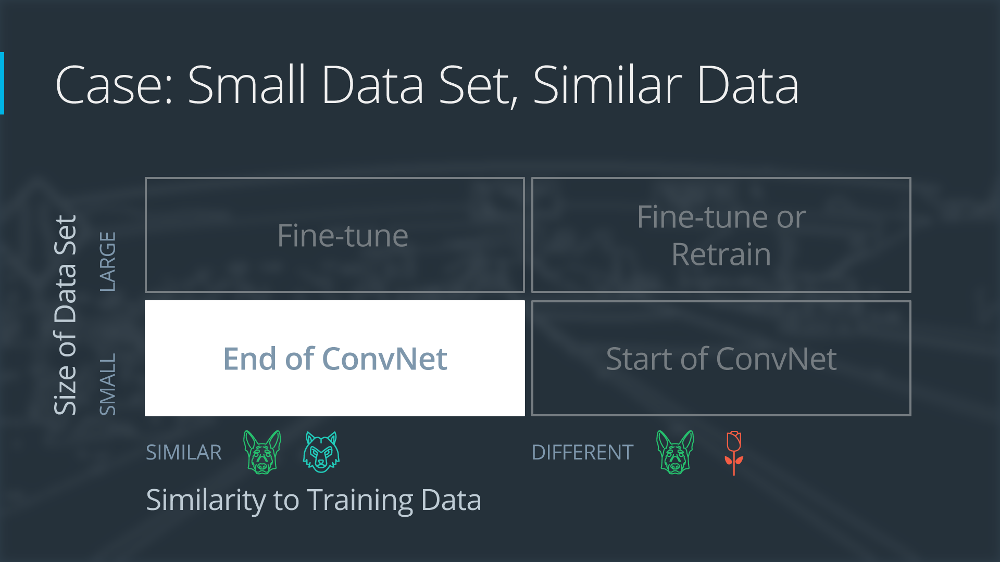
<p style="color: #555;">Figure: Transfer Learning for Small Data Set, Similar Data</p>
</div>

**Recommended Approach:**

1. **Start with a powerful pre-trained backbone**: Use a model like ResNet-50 pre-trained on ImageNet
2. **Freeze the convolutional layers**: Preserve the feature extraction capabilities that transfer well
3. **Replace and train only the classification head**: Add a simple structure with appropriate regularization
4. **Apply heavy domain-specific data augmentation**: Rotations, flips, color jitter to expand your effective dataset
   size
5. **Use early stopping**: Monitor validation performance carefully to prevent overfitting

<div align="center">
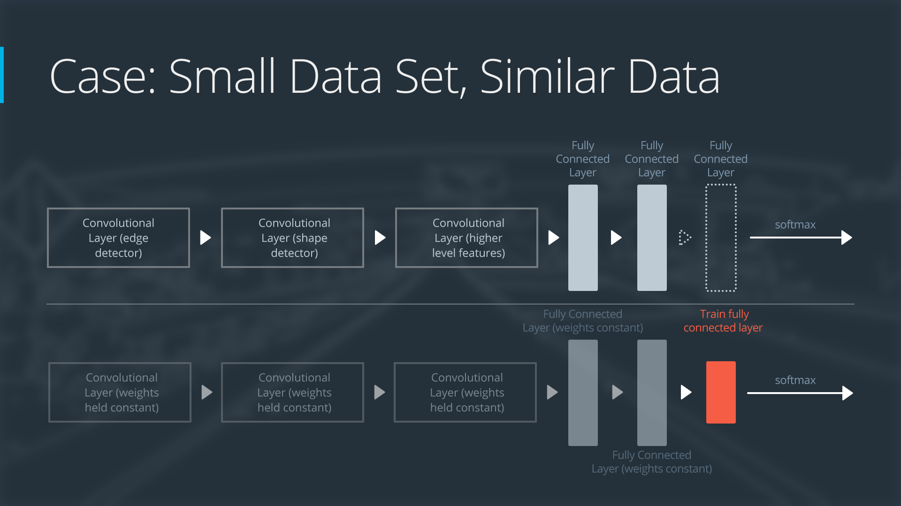
<p style="color: #555;">Figure: Transfer Learning for Small Data Set, Similar Data</p>
</div>

Here's how you might implement this approach:

```python
def create_skin_lesion_model():
    # Load pre-trained model
    model = torchvision.models.resnet50(pretrained=True)

    # Freeze all layers
    for param in model.parameters():
        param.requires_grad = False

    # Replace classification head with smaller network and dropout
    model.fc = nn.Sequential(
        nn.Dropout(0.5),  # Strong dropout to prevent overfitting
        nn.Linear(model.fc.in_features, 128),
        nn.ReLU(),
        nn.Dropout(0.4),
        nn.Linear(128, num_lesion_classes)
    )

    # Use strong regularization in optimizer
    optimizer = torch.optim.Adam(
        model.fc.parameters(),  # Only train the new layers
        lr=1e-4,
        weight_decay=1e-2      # Strong L2 regularization
    )

    # Domain-specific augmentation pipeline
    transforms = transforms.Compose([
        transforms.RandomRotation(20),
        transforms.RandomResizedCrop(224, scale=(0.8, 1.0)),
        transforms.ColorJitter(brightness=0.1, contrast=0.1, saturation=0.1),  # Handle stain variations
        transforms.RandomHorizontalFlip(),
        transforms.RandomVerticalFlip(),  # Medical images have no fixed orientation
        transforms.ToTensor(),
        transforms.Normalize([0.485, 0.456, 0.406], [0.229, 0.224, 0.225])
    ])

    return model, optimizer, transforms
```

With this approach, you can often achieve 85-95% of the performance of a fully supervised approach trained on much more
data. The model benefits from the general visual features learned on ImageNet while adapting specifically to your task.

**Scenario 2: Small Target Dataset, Different Domain**

_Example: Satellite imagery classification with 300 examples_

**Characteristics:**

- Limited labeled data
- Significant visual differences from common pre-training datasets
- Different low-level features (spectral properties, viewpoint, scale)

In this case, imagine you're working with satellite imagery to classify land use (urban, forest, water, etc.). The
overhead perspective and spectral properties differ significantly from natural images that models like ResNet were
trained on.

<div align="center">
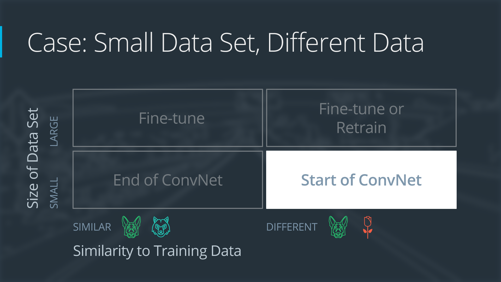
<p style="color: #555;">Figure: Transfer Learning for Small Data Set, Different Data</p>
</div>

**Recommended Approach:**

1. **Use pre-trained model but remove later layers**: Later layers contain too domain-specific information

2. **Freeze only the earliest layers**: These capture basic edges and textures that still transfer well

3. **Add domain-specific layers before classification**: These help bridge the domain gap

4. **Implement gradual unfreezing during training**: Start training output layers, then gradually unfreeze earlier
   layers

5. **Apply domain-specific preprocessing**: Normalize using satellite imagery statistics, not ImageNet

6. **Consider simple domain adaptation techniques**: Center alignment or AdaBN can help bridge the domain gap

<div align="center">
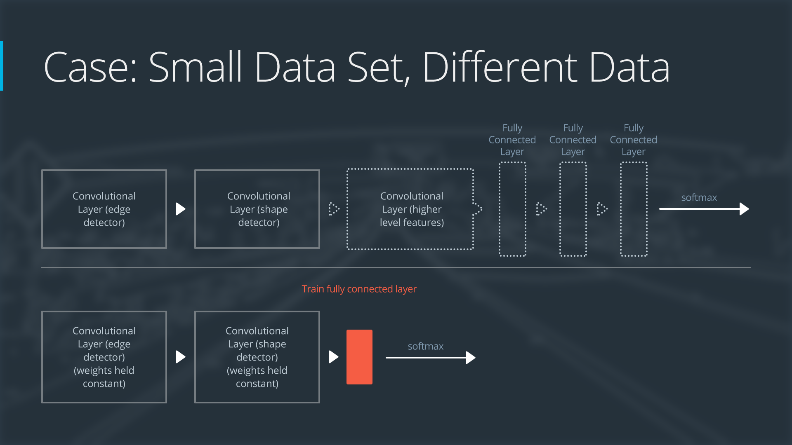
<p style="color: #555;">Figure: Transfer Learning for Small Data Set, Different Data</p>
</div>

```python
def create_satellite_model():
    base_model = torchvision.models.resnet50(pretrained=True)

    # Freeze only early layers (basic feature detectors)
    for name, param in base_model.named_parameters():
        if 'layer1' in name or 'layer2' in name:
            param.requires_grad = False
        else:
            param.requires_grad = True

    # Create new model with domain-specific layers
    model = nn.Sequential(
        *list(base_model.children())[:-2],  # Remove final pooling and FC
        nn.Conv2d(2048, 512, kernel_size=1),  # Domain-specific convolution
        nn.ReLU(),
        nn.AdaptiveAvgPool2d(1),
        nn.Flatten(),
        nn.Linear(512, 256),
        nn.ReLU(),
        nn.Dropout(0.5),
        nn.Linear(256, num_landuse_classes)
    )

    # Learning rate scheduler for gradual unfreezing
    def create_scheduler(optimizer, total_epochs):
        # Scheduler to gradually unfreeze deeper layers
        def lambda_lr(epoch):
            if epoch < 5:  # First 5 epochs: train only the new layers
                return 0.01 if 'layer3' in name or 'layer4' in name else 0
            elif epoch < 10:  # Next 5 epochs: also train layer3
                return 0.01 if 'layer2' in name else 0.1
            else:  # After 10 epochs: train all unfrozen layers
                return 0.1

        return torch.optim.lr_scheduler.LambdaLR(optimizer, lr_lambda=lambda_lr)

    # Domain-specific normalization using satellite image statistics
    transforms = transforms.Compose([
        transforms.RandomRotation(180),  # Satellite images have no fixed orientation
        transforms.RandomResizedCrop(224, scale=(0.7, 1.0)),
        transforms.ToTensor(),
        transforms.Normalize([0.2, 0.3, 0.4], [0.15, 0.18, 0.2])  # Example satellite image statistics
    ])

    return model, create_scheduler, transforms
```

This approach acknowledges the significant domain gap while still leveraging transferable low-level features. You can
expect lower initial performance than in Scenario 1, but still significant improvement over training from scratch.

**Scenario 3: Large Target Dataset, Similar Domain**

_Example: Product image classification with 50,000 examples_

**Characteristics:**

- Substantial labeled data (10,000+ examples)
- Visual similarity to pre-training datasets
- Sufficient data to fine-tune effectively

Here, you're building a system to classify product images for an e-commerce site. While the domain is different from
ImageNet, the basic visual properties of product photos share many characteristics with general images.

<div align="center">
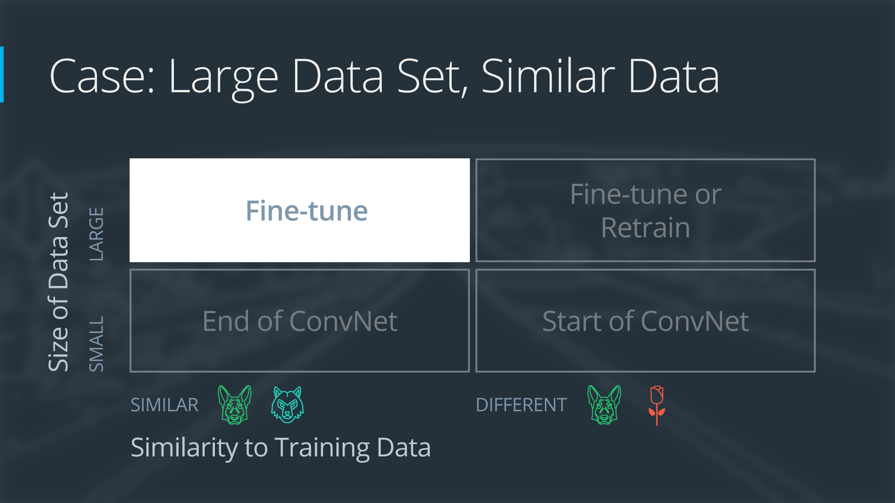
<p style="color: #555;">Figure: Transfer Learning for Large Data Set, Similar Data</p>
</div>
**Recommended Approach:**

1. **Use a pre-trained model as initialization** for all layers
2. **Fine-tune all layers with discriminative learning rates**: Lower rates for early layers, higher for later layers
3. **Use learning rate warmup followed by cosine annealing**: This helps find better minima
4. **Apply moderate regularization**: With more data, you can use lighter regularization
5. **Consider knowledge distillation**: After fine-tuning a large model, distill to a smaller architecture for
   production

<div align="center">
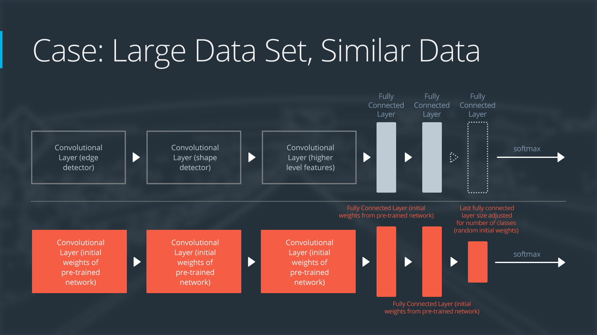
<p style="color: #555;">Figure: Transfer Learning for Large Data Set, Similar Data</p>
</div>

```python
def create_product_classification_model():
    # Use a modern architecture
    model = torchvision.models.efficientnet_b0(pretrained=True)

    # Replace classifier for the target number of classes
    num_features = model.classifier[1].in_features
    model.classifier = nn.Sequential(
        nn.Dropout(0.2),  # Lighter dropout than previous scenarios
        nn.Linear(num_features, num_product_classes)
    )

    # Create parameter groups with discriminative learning rates
    params = [
        {'params': model.features[:4].parameters(), 'lr': 1e-5},  # Early layers: lowest LR
        {'params': model.features[4:].parameters(), 'lr': 5e-5},  # Middle layers: medium LR
        {'params': model.classifier.parameters(), 'lr': 1e-4}     # New layers: highest LR
    ]

    # Use AdamW with moderate weight decay
    optimizer = torch.optim.AdamW(params, weight_decay=1e-4)

    # OneCycleLR scheduler combines warmup and annealing
    scheduler = torch.optim.lr_scheduler.OneCycleLR(
        optimizer,
        max_lr=[1e-5, 5e-5, 1e-4],  # Different max LR for each group
        steps_per_epoch=len(train_loader),
        epochs=num_epochs,
        pct_start=0.1  # 10% of training for warmup
    )

    # Balanced augmentation strategy
    transforms = transforms.Compose([
        transforms.RandomResizedCrop(224),
        transforms.RandomHorizontalFlip(),
        transforms.ColorJitter(brightness=0.05, contrast=0.05, saturation=0.05),
        transforms.ToTensor(),
        transforms.Normalize([0.485, 0.456, 0.406], [0.229, 0.224, 0.225])
    ])

    return model, optimizer, scheduler, transforms

```

With this approach, you can expect near state-of-the-art performance, often reaching 95%+ of what's possible with any
approach. The larger dataset allows effective fine-tuning of all layers while the pre-training still provides a
significant head start compared to training from scratch.

**Scenario 4: Few-Shot Learning Scenario**

_Example: Personalized face recognition with 5 examples per person_

**Characteristics:**

- Very few examples per class (1-10)
- Need to generalize to new classes with minimal data
- Classes weren't seen during pre-training

In this scenario, you're building a face recognition system that needs to identify specific people with only a few
reference images of each person.

**Recommended Approach:**

1. **Use a pre-trained face recognition model**: Models like FaceNet or ArcFace already learn face embeddings
2. **Implement a meta-learning framework**: Like Prototypical Networks or Model-Agnostic Meta-Learning (MAML)
3. **Leverage strong data augmentation**: Create multiple variations of your few examples
4. **Use metric learning objectives**: Contrastive or triplet loss to learn good embeddings
5. **Implement episodic training**: Simulate few-shot scenarios during training

```python
class PrototypicalNetwork(nn.Module):
    def __init__(self):
        super().__init__()
        # Load pre-trained face embedding network
        self.embedding_model = load_pretrained_face_model()

        # Freeze the base model
        for param in self.embedding_model.parameters():
            param.requires_grad = False

        # Small adaptation network (optional)
        self.adaptation = nn.Sequential(
            nn.Linear(512, 512),  # Assuming 512-dim face embeddings
            nn.ReLU(),
            nn.Linear(512, 512)
        )

    def forward(self, x):
        # Extract face embeddings
        with torch.no_grad():
            embeddings = self.embedding_model(x)

        # Apply adaptation network
        return self.adaptation(embeddings)

def train_prototypical_network(model, dataset, episodes=1000):
    optimizer = torch.optim.Adam(model.adaptation.parameters(), lr=1e-4)

    for episode in range(episodes):
        # Sample support and query examples
        support_images, support_labels = sample_support_set(dataset, n_way=5, k_shot=5)
        query_images, query_labels = sample_query_set(dataset, support_labels)

        # Extract embeddings
        support_embeddings = model(support_images)
        query_embeddings = model(query_images)

        # Compute prototypes (mean embedding per class)
        prototypes = {}
        for class_idx in torch.unique(support_labels):
            mask = support_labels == class_idx
            prototypes[class_idx] = support_embeddings[mask].mean(0)

        # Compute distances to prototypes
        distances = []
        for class_idx, prototype in prototypes.items():
            # Calculate euclidean distance
            distance = torch.sum((query_embeddings.unsqueeze(1) - prototype.unsqueeze(0))**2, dim=2)
            distances.append(distance)

        # Stack distances and convert to logits (negative distances)
        logits = -torch.stack(distances, dim=1)

        # Compute loss and accuracy
        loss = F.cross_entropy(logits, query_labels)

        # Update model
        optimizer.zero_grad()
        loss.backward()
        optimizer.step()
```

This few-shot learning approach can achieve surprising accuracy (often 70-90%) with extremely limited data per class.
The key insight is that the model learns how to compare examples rather than memorizing specific classes, allowing it to
generalize to new classes with minimal examples.

**Scenario 5: Unsupervised Domain Adaptation**

_Example: Adapting a road sign detector from synthetic to real images_

**Characteristics:**

- Labeled source domain (synthetic data)
- Unlabeled target domain (real-world data)
- Need to perform well on target domain despite having no labels

<div align="center">
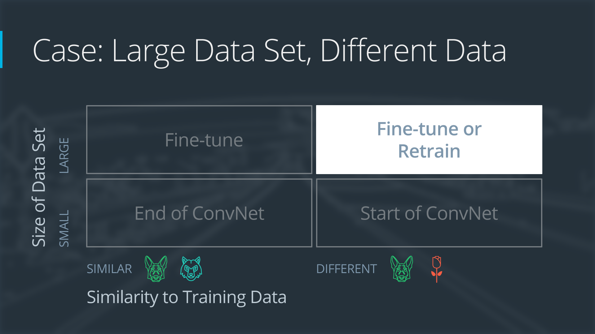
<p style="color: #555;">Figure: Transfer Learning for Large Data Set, Different Data</p>
</div>
In this scenario, you've trained a model on synthetic (computer-generated) road sign images with perfect labels, but
need it to work on real-world dashcam footage where you have no labels.

**Recommended Approach:**

1. **Pre-train on source domain** with labeled data
2. **Apply domain adaptation technique**: Domain-Adversarial Neural Networks (DANN) works well for visual tasks
3. **Use self-training with confidence thresholding**: Generate pseudo-labels for high-confidence predictions
4. **Implement consistency regularization**: Ensure predictions are consistent across augmentations
5. **Consider style transfer** to visually bridge the domain gap

<div align="center">

<p style="color: #555;">Figure: Transfer Learning for Large Data Set, Different Data</p>
</div>

```python
def train_road_sign_adaptation(source_loader, target_loader, num_epochs=50):
    # Load pre-trained model on synthetic data
    model = RoadSignModel()
    model.load_state_dict(torch.load('synthetic_pretrained.pth'))

    # Add domain classifier with gradient reversal
    feature_dim = model.feature_size
    domain_classifier = nn.Sequential(
        GradientReversal(alpha=1.0),
        nn.Linear(feature_dim, 1024),
        nn.ReLU(),
        nn.Dropout(0.5),
        nn.Linear(1024, 1024),
        nn.ReLU(),
        nn.Dropout(0.5),
        nn.Linear(1024, 2)  # Source or target domain
    )

    # Prepare optimizers
    optimizer = torch.optim.SGD([
        {'params': model.parameters()},
        {'params': domain_classifier.parameters()}
    ], lr=0.001, momentum=0.9)

    # Loss functions
    classification_loss = nn.CrossEntropyLoss()
    domain_loss = nn.CrossEntropyLoss()
    consistency_loss = nn.MSELoss()

    for epoch in range(num_epochs):
        # Adjust adaptation strength
        alpha = min(2.0, (epoch + 1) / (num_epochs * 0.1))
        domain_classifier[0].alpha = alpha

        # Training loop
        for batch_idx, ((source_imgs, source_labels), (target_imgs, _)) in enumerate(zip(source_loader, target_loader)):
            # Prepare domain labels
            source_domain = torch.zeros(source_imgs.size(0), dtype=torch.long)
            target_domain = torch.ones(target_imgs.size(0), dtype=torch.long)

            # Forward pass - source data
            source_features, source_preds = model(source_imgs, return_features=True)
            source_domain_preds = domain_classifier(source_features)

            # Forward pass - target data
            target_features, target_preds = model(target_imgs, return_features=True)
            target_domain_preds = domain_classifier(target_features)

            # Classification loss (only on source)
            cls_loss = classification_loss(source_preds, source_labels)

            # Domain classification loss
            d_loss = domain_loss(source_domain_preds, source_domain) + domain_loss(target_domain_preds, target_domain)

            # Pseudo-labeling (high confidence predictions)
            with torch.no_grad():
                confidence, pseudo_labels = F.softmax(target_preds, dim=1).max(dim=1)

            # Only use high-confidence predictions
            mask = confidence > 0.9
            if mask.sum() > 0:
                pseudo_loss = classification_loss(target_preds[mask], pseudo_labels[mask])
            else:
                pseudo_loss = 0

            # Consistency regularization
            target_aug = augment_differently(target_imgs)
            _, target_aug_preds = model(target_aug)
            cons_loss = consistency_loss(target_aug_preds, target_preds.detach())

            # Total loss
            total_loss = cls_loss + 0.3 * d_loss + 0.5 * pseudo_loss + 0.2 * cons_loss

            # Update models
            optimizer.zero_grad()
            total_loss.backward()
            optimizer.step()
```

This approach enables adapting models across significant domain shifts without requiring labels in the target domain.
While there will still be a performance gap compared to having labeled target data, unsupervised domain adaptation can
significantly improve over using the source-only model, often recovering 50-80% of the performance drop.

**Key Takeaways Across Scenarios**

These case studies illustrate how transfer learning approaches should be tailored to your specific scenario. Here are
some general principles:

1. **Data size is the primary determinant** of how much fine-tuning you should do:

    - Very small datasets: Freeze most or all pre-trained layers
    - Medium datasets: Gradually unfreeze layers from top to bottom
    - Large datasets: Fine-tune all layers but with discriminative learning rates

2. **Domain similarity affects where you should focus adaptation**:

    - Similar domains: Later layers need more adaptation than early layers
    - Different domains: Consider domain adaptation techniques or more extensive architectural modifications

3. **Regularization needs change with data size**:

    - Small datasets: Heavy regularization (dropout, weight decay, data augmentation)
    - Large datasets: Lighter regularization but still important

4. **Optimization strategies matter**:
    - Learning rate scheduling becomes more important as you fine-tune more layers
    - Adaptive optimizers like Adam work well for most transfer learning scenarios
    - Batch size can be smaller for fine-tuning than training from scratch

By selecting the appropriate transfer learning strategy for your specific scenario, you can maximize the benefits of
pre-trained models while addressing the unique challenges of your application.
