# C-4: Transformer Architecture

1. Transformers and Attention Mechanisms
    - Attention Mechanism Fundamentals
    - Self-Attention Implementation
    - Multi-Head Attention
    - Scaled Dot-Product Attention
    - Positional Encoding
    - Transformer Block Architecture
2. Tokenization and Embeddings in NLP
    - Tokenization Methods
    - Word Embeddings Techniques
    - Contextual vs. Static Embeddings
    - Embedding Vector Properties
    - Subword Tokenization Approaches

---

##### Understanding Embeddings and Embedding Dimensions

**What is an Embedding?**

An **embedding** is a dense vector representation of a discrete object (like a word, token, or symbol) in a continuous
numerical space. Think of it as translating words into numbers that capture their meaning.

**Simple Analogy:** Imagine you want to represent people using numbers that capture their characteristics:

- Person A: [height=5.8, age=25, income=50k, education=16]
- Person B: [height=6.1, age=30, income=75k, education=18]

Similarly, word embeddings represent words as vectors that capture their semantic properties.

**What is Embedding Dimension?**

The **embedding dimension** is simply the length of the vector used to represent each word. It's how many numbers we use
to describe each word.

**Examples:**

**2-Dimensional Embeddings (very simple):**

$$
\begin{align}
\text{"cat"} &\rightarrow [0.8, 0.3] \\
\text{"dog"} &\rightarrow [0.7, 0.4] \\
\text{"car"} &\rightarrow [-0.2, 0.9]
\end{align}
$$

**4-Dimensional Embeddings (our example):**

$$
\begin{align}
\text{"cat"} &\rightarrow [0.8, 0.2, -0.1, 0.5] \\
\text{"dog"} &\rightarrow [0.7, 0.3, 0.0, 0.4] \\
\text{"car"} &\rightarrow [-0.2, 0.9, 0.6, -0.3]
\end{align}
$$

**300-Dimensional Embeddings (real-world):**

$$
\begin{align}
\text{"cat"} &\rightarrow [0.23, -0.16, 0.58, 0.09, ..., 0.31] \text{ (300 numbers)} \\
\end{align}
$$

###### What Do These Embedding Numbers Actually Mean?

The numbers in embeddings don't have pre-defined meanings like "dimension 1 = animal-ness." Instead, they're **learned
patterns** that capture how words are used in context.

**2-Dimensional Example Analysis:**

$$
\begin{align}
\text{"cat"} &\rightarrow [0.8, 0.3] \\
\text{"dog"} &\rightarrow [0.7, 0.4] \\
\text{"car"} &\rightarrow [-0.2, 0.9]
\end{align}
$$

**What We Can Observe:**

- **Dimension 1**: Cat (0.8) and dog (0.7) have similar **positive** values, while car (-0.2) has a **negative** value
- **Dimension 2**: All have positive values, but car (0.9) is highest

**Possible Interpretation** (the model might have learned):

- **Dimension 1 ≈ "Living Thing"**: Positive for animals, negative for objects
- **Dimension 2 ≈ "Size/Mobility"**: All can move, but cars are bigger/faster

**4-Dimensional Example Analysis:**

$$
\begin{align}
\text{"cat"} &\rightarrow [0.8, 0.2, -0.1, 0.5] \\
\text{"dog"} &\rightarrow [0.7, 0.3,  0.0, 0.4] \\
\text{"car"} &\rightarrow [-0.2, 0.9, 0.6, -0.3]
\end{align}
$$

**What We Can Observe:**

- **Dimension 1**: Cat (0.8) and dog (0.7) cluster together, car (-0.2) is opposite
- **Dimension 2**: Car (0.9) is much higher than cat (0.2) and dog (0.3)
- **Dimension 3**: Cat (-0.1), dog (0.0), car (0.6) - car is different again
- **Dimension 4**: Cat (0.5) and dog (0.4) are similar, car (-0.3) is negative

**Hypothetical Interpretations** (what the model might have learned):

1. **Dimension 1 ≈ "Biological vs. Mechanical"**: Animals positive, machines negative
2. **Dimension 2 ≈ "Size/Power"**: Cars are bigger and more powerful
3. **Dimension 3 ≈ "Indoor vs. Outdoor"**: Cats often indoor (-0.1), dogs neutral (0.0), cars outdoor (0.6)
4. **Dimension 4 ≈ "Warmth/Comfort"**: Living things give warmth (positive), machines don't (-0.3)

**Important Caveat: We Don't Actually Know!**

The model doesn't explicitly learn "dimension 1 = animal-ness." Instead, it learns patterns that **happen to separate**
animals from objects, indoor from outdoor things, etc.

**How These Patterns Emerge:**

**Training Context Examples:**

$$
\begin{align}
\text{"The cat sits on the mat"} \\
\text{"The dog runs in the park"} \\
\text{"The car drives on the road"}
\end{align}
$$

**The model learns:**

- Words appearing in similar contexts get similar embeddings
- "Cat" and "dog" often appear with similar verbs (sits, runs, sleeps)
- "Car" appears with different verbs (drives, parks, crashes)

**Mathematical Relationships:**

**Similarity (Cosine Distance):**

```python
cos_similarity(cat, dog) = 0.8*0.7 + 0.3*0.4 = 0.56 + 0.12 = 0.68
cos_similarity(cat, car) = 0.8*(-0.2) + 0.3*0.9 = -0.16 + 0.27 = 0.11
```

Cat and dog are more similar (0.68) than cat and car (0.11).

**Real-World Example: Word2Vec Results**

When trained on Google News, Word2Vec learned these famous relationships:

$$
\begin{align}
\text{vector("king") - vector("man") + vector("woman")} &\approx \text{vector("queen")} \\
\text{vector("Paris") - vector("France") + vector("Italy")} &\approx \text{vector("Rome")}
\end{align}
$$

**The model didn't explicitly learn "gender" or "capital city" concepts**—these emerged from usage patterns!

**What Each Dimension Captures:**

**In Reality:**

- Each dimension captures a **mix of different semantic properties**
- The patterns are **distributed across all dimensions**
- Individual dimensions are usually **not interpretable** by humans
- The **combination** of all dimensions creates the meaning

**Analogy: Recipe Ingredients** Just like a cake recipe:

- Flour + sugar + eggs + butter = cake
- No single ingredient is "the cake"
- The combination creates the final result

Similarly:

- Dim1 + Dim2 + Dim3 + Dim4 = "cat" meaning
- No single dimension is "the meaning"
- The combination captures what "cat" means

**Why More Dimensions Help:**

**2D**: Can only capture 2 main patterns

$$
\begin{align}
\text{"cat"} &\rightarrow [animal=0.8, size=0.3]
\end{align}
$$

**4D**: Can capture 4 different patterns

$$
\begin{align}
\text{"cat"} &\rightarrow [animal=0.8, size=0.2, indoor=-0.1, warmth=0.5]
\end{align}
$$

**300D**: Can capture 300 different patterns, allowing for very nuanced meanings and relationships.

**Key Takeaway:** The numbers in embeddings are **learned representations** of how words behave in language. They don't
have predefined meanings, but they capture patterns that allow the model to understand that "cat" and "dog" are more
similar to each other than either is to "car."

**How Are These Numbers Chosen?**

**Option 1: Random Initialization (then learning)**

# Start with random numbers

$$
\text{"cat"} \rightarrow [0.12, -0.45, 0.78, 0.23] \quad \text{(Random starting point)}
$$

During training, these numbers get adjusted to better represent the word's meaning.

**Option 2: Pre-trained Embeddings** Use embeddings learned from large datasets like Wikipedia:

$$
\text{"cat"} \rightarrow [0.15, -0.23, 0.67, 0.89] \quad \text{(Learned from context)}
$$

**Why Do We Need Embeddings?**

**Problem with One-Hot Encoding:** Traditional approach represents words as sparse vectors:

$$
\begin{align}
\text{"cat"} &\rightarrow [1, 0, 0, 0, 0, 0, ...] \quad \text{(size = vocabulary size)} \\
\text{"dog"} &\rightarrow [0, 1, 0, 0, 0, 0, ...] \\
\text{"car"} &\rightarrow [0, 0, 1, 0, 0, 0, ...]
\end{align}
$$

**Issues:**

- Huge vocabulary = huge vectors (millions of dimensions)
- No relationship between words (cat and dog are equally different from each other as cat and car)
- Very inefficient storage and computation

**Solution with Embeddings:**

$$
\begin{align}
\text{"cat"} &\rightarrow [0.8, 0.2, -0.1, 0.5] \quad \text{(4 dimensions)} \\
\text{"dog"} &\rightarrow [0.7, 0.3, 0.0, 0.4] \quad \text{(similar to cat - both animals)} \\
\text{"car"} &\rightarrow [-0.2, 0.9, 0.6, -0.3] \quad \text{(different from cat/dog)}
\end{align}
$$

**Embedding Dimension Trade-offs:**

**Small Dimensions (50-100):**

- **Pros**: Fast computation, less memory
- **Cons**: Can't capture complex relationships
- **Use**: Simple tasks, small vocabularies

**Medium Dimensions (200-300):**

- **Pros**: Good balance of efficiency and expressiveness
- **Cons**: Moderate computational cost
- **Use**: Most NLP tasks, Word2Vec typically uses 300

**Large Dimensions (512-1024+):**

- **Pros**: Can capture very subtle relationships
- **Cons**: Expensive computation, risk of overfitting
- **Use**: Complex tasks, large models like transformers

**Real-World Examples:**

**BERT-base**: 768-dimensional embeddings

$$
\begin{align}
\text{"cat"} &\rightarrow [0.23, -0.16, 0.58, ..., 0.31] \quad \text{(768 numbers)} \\
\end{align}
$$

**GPT-3**: 12,288-dimensional embeddings

$$
\begin{align}
\text{"cat"} &\rightarrow [0.15, -0.23, 0.67, ..., 0.42] \quad \text{(12,288 numbers!)} \\
\end{align}
$$

**Word2Vec**: Typically 300-dimensional

$$
\begin{align}
\text{"cat"} &\rightarrow [0.12, -0.45, 0.78, ..., 0.89] \quad \text{(300 numbers)} \\
\end{align}
$$

**How Embeddings Capture Meaning:**

Each dimension can be thought of as capturing some aspect of meaning:

$$
\begin{align}
\text{"cat"} &\rightarrow [animal=0.8, size=0.2, indoor=-0.1, fluffy=0.5] \\
\text{"dog"} &\rightarrow [animal=0.7, size=0.5, indoor=0.0, fluffy=0.3] \\
\text{"car"} &\rightarrow [animal=-0.2, size=0.9, indoor=0.6, fluffy=-0.3]
\end{align}
$$

Of course, the actual dimensions aren't this interpretable, but the idea is that each number contributes to representing
some aspect of the word's meaning.

**Key Takeaway:**

- **Embedding** = A vector of numbers representing a word
- **Embedding dimension** = How many numbers in that vector
- **Higher dimensions** = More capacity to represent complex meanings
- **The actual numbers** are learned during training to capture semantic relationships

##### Transformers and Attention Mechanisms

The transformer architecture represents one of the most significant breakthroughs in artificial intelligence in recent
years. To truly appreciate its elegance and power, we need to understand how it revolutionized the way neural networks
process sequential data like text, audio, or time series. Let's explore the core components that make transformers work,
starting with the fundamental concept of attention.

###### Attention Mechanism Fundamentals

Imagine you're reading a complex sentence: "After reviewing all the documents, the lawyer who specialized in corporate
law determined that the contract needed significant revisions." As you process this sentence, your mind doesn't give
equal importance to every word when understanding each part. When you focus on what the lawyer determined, you pay
special attention to "lawyer" and "determined," creating a connection between these distant but related words.

This natural cognitive process—selectively focusing on relevant information—is precisely what attention mechanisms
simulate in neural networks. Here's a comprehensive diagram of the Transformer architecture:

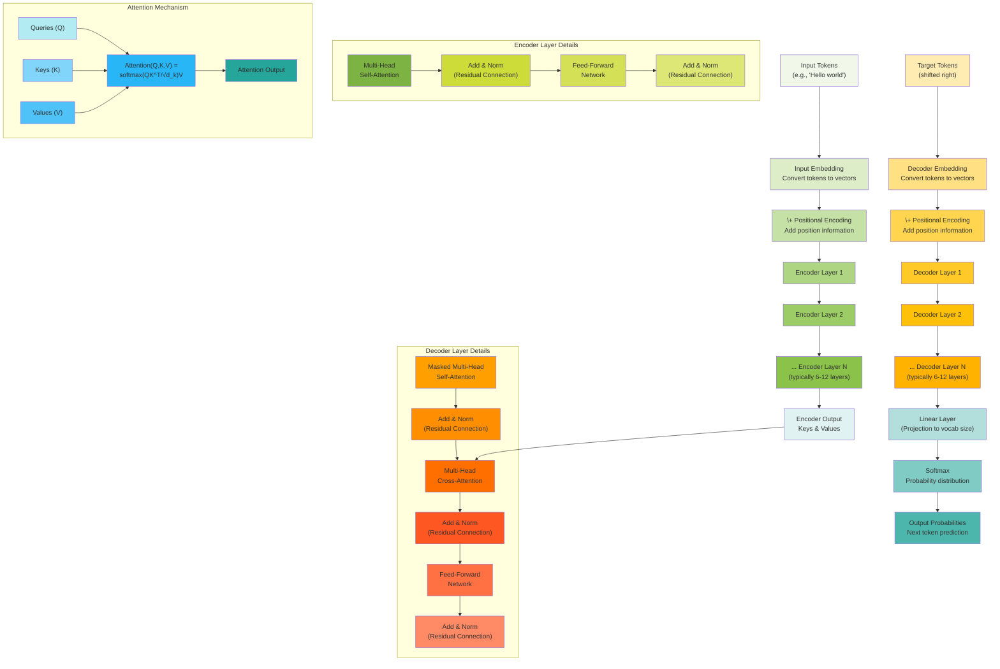

---

##### 1. Encoder Stack

The encoder stack forms the foundation of the Transformer's ability to understand and process input sequences. Think of
it as a sophisticated reading comprehension system that processes an entire sentence simultaneously, rather than word by
word like traditional models.

The encoder's primary job is to create rich, contextual representations of each input token by allowing every position
to "look at" and gather information from every other position in the sequence. This parallel processing capability is
what makes Transformers so powerful and efficient.

Imagine reading a sentence where each word can instantly access the meaning and context of every other word. This is
fundamentally different from reading left-to-right sequentially. For example, in "The bank can guarantee deposits will
eventually cover future tuition costs," the word "bank" needs to understand it's in a financial context by looking at
words like "deposits," "guarantee," and "costs" simultaneously. Each encoder layer performs two main operations in
sequence:

##### **1. Multi-Head Self-Attention Mechanism:**

$$
\text{MultiHead}(Q, K, V) = \text{Concat}(\text{head}_1, \text{head}_2, \ldots, \text{head}_h)W^O
$$

In this formula, each attention head captures different types of relationships. Let's break down each part of this
equation:

**I. Purpose of Multi-Head Attention**

- While a single attention mechanism can only capture **one type of relationship** at a time, Multi-Head Attention
  addresses this limitation by **running multiple self-attention mechanisms in parallel**. This allows the model to
  jointly attend to information from different representation subspaces, capturing various aspects of the input
  simultaneously. For example, one head might focus on syntactic relationships, another on subject-verb relationships,
  and a third on entity relationships.

**II. Input Matrices: Q, K, V**

- **Q (Queries)**: Represents what each position is "asking for" or seeking from other positions in the sequence. These
  are like questions each token poses about the information it needs.
- **K (Keys)**: Represents what each position "offers" or "advertises" about the information it contains. Keys act as
  labels or summaries describing the information available at each position.
- **V (Values)**: Contains the actual information content that will be retrieved and combined. Values are the
  substantive data that gets aggregated based on the attention weights.
- In the context of self-attention (within the encoder or decoder's self-attention layer), these $Q$, $K$, and $V$
  matrices are **derived from the same input sequence** $X$ through learned linear transformations (projection matrices
  $W^Q, W^K, W^V$).

**III. Individual Attention Heads ($\text{head}_i$)**

- The term $\text{head}_i$ represents the **output of a single attention head**.

- Each head computes attention **independently**. Before computing attention, the input $X$ is first projected into
  lower-dimensional $Q$, $K$, and $V$ spaces using **separate sets of learned projection matrices** for each head:
  $W_i^Q$, $W_i^K$, and $W_i^V$.

- The computation for a single head is based on the **Scaled Dot-Product Attention** formula:

$$
  \text{head}_i = \text{Attention}(XW_i^Q, XW_i^K, XW_i^V) = \text{softmax}\left(\frac{(XW_i^Q)(XW_i^K)^T}{\sqrt{d_k}}\right)(XW_i^V)
$$

- Typically, if the model's main embedding dimension is $d_{model}$ and there are `h` heads, each head projects to a
  dimension $d_k = d_v = d_{model}/h$. This means each head processes a **lower-dimensional subspace** of the original
  embeddings.

**IV. Concatenation ($\text{Concat}(\text{head}_1, \text{head}_2, \ldots, \text{head}_h)$)**

- Once each of the $h$ attention heads computes its output ($\text{head}_1$ through $\text{head}_h$), these individual
  outputs are **concatenated**.
- This operation stacks the outputs side-by-side, effectively recombining the information processed by each head.
- The reason each head operates on a dimension of $d_{model}/h$ is to ensure that when all $h$ heads are concatenated,
  the resulting matrix has a dimension of $h \times (d_{model}/h) = d_{model}$, bringing the representation back to the
  original model dimension.

**V. Final Linear Projection ($W^O$)**

- After concatenation, the combined output is passed through **one final linear transformation** using a learned
  parameter matrix $W^O$.
- This $W^O$ matrix has a shape of $(d_{model}, d_{model})$. Its purpose is to **mix the information** from the
  different attention heads, allowing the model to learn the optimal way to combine the diverse relational insights
  captured by each head.

In essence, Multi-Head Attention allows the Transformer to **simultaneously capture different types of relationships and
dependencies** within the input sequence by having multiple "experts" (heads) analyze the data in parallel, then
intelligently combining their findings into a rich, context-aware representation.

The computation for a **single attention head** ($\text{head}_i$) within the larger **Multi-Head Attention** mechanism
is defined as below:

$$
\text{head}_i = \text{Attention}(XW_i^Q, XW_i^K, XW_i^V)
$$

Let's break down each component and the process it describes:

- **$\text{head}_i$**: This represents the **output of the $i$-th individual attention head**. Multi-Head Attention runs
  multiple of these heads in parallel.
- **$\text{Attention(...)}$**: This refers to the **Scaled Dot-Product Attention** function. It is the core computation
  that determines how much each position in a sequence should "attend" to other positions. The formula for Scaled
  Dot-Product Attention is $ \text{softmax}\left(\frac{QK^T}{\sqrt{d_k}}\right)V$.
- **$X$**: This is the **input sequence** matrix, typically consisting of word embeddings or representations from a
  previous layer. Each row in $X$ corresponds to a token's embedding, and each column corresponds to an embedding
  dimension. For example, in the "Cat sits quietly" example, $X$ is a $3 \times 4$ matrix where 3 is the sequence length
  (number of words) and 4 is the $d_{model}$ (embedding dimension).
- **$W_i^Q, W_i^K, W_i^V$**: These are **learned linear projection matrices unique to the $i$-th attention head**.
    - They are **learned parameters** of the model, initialized randomly and updated during training.
    - Their purpose is to **project the input $X$ into different lower-dimensional subspaces** suitable for computing
      Queries, Keys, and Values for _this specific head_.
    - Typically, if the overall model dimension is $d_{model}$ and there are `h` heads, each of these matrices projects
      `X` from $d_{model}$ to $d_k$ (for Query and Key) or $d_v$ (for Value), where $d_k = d_v = d_{model}/h$. This
      dimension reduction allows each head to focus on different aspects or "subspaces" of the input representation. For
      instance, if $d_{model}=4$ and $h=2$, then $d_k=d_v=2$ for each head.

**How a single attention head works**

**I. Project Input to Q, K, V**: The input $X$ is linearly transformed using the head-specific projection matrices to
obtain the Query ($Q_i$), Key ($K_i$), and Value ($V_i$) matrices for this particular head:

- $Q_i = X W_i^Q$
- $K_i = X W_i^K$
- $V_i = X W_i^V$ These $Q_i, K_i, V_i$ matrices are then passed as arguments to the $\text{Attention}$ function.

**II. Compute Scaled Dot-Product Attention**: The $\text{Attention}$ function then performs the following steps with
$Q_i, K_i, V_i$:

- **Compatibility Scoring**: Computes the dot product between queries and keys ($Q_i K_i^T$) to measure how much each
  query position should attend to each key position.
- **Scaling**: Divides the scores by $\sqrt{d_k}$ to prevent the softmax function from saturating, ensuring stable
  gradients during training.
- **Normalization**: Applies the softmax function row-wise to convert the scaled scores into attention weights. These
  weights are non-negative and sum to 1 for each query, indicating the probability distribution over what to attend to.
- **Value Aggregation**: Multiplies the attention weights by the Value matrix ($V_i$) to produce a weighted sum of
  values. This weighted sum becomes the output of the attention head, where each position's representation is a
  combination of information from all other positions, weighted by their relevance.

Essentially, this equation describes how a single "expert" ($\text{head}_i$) within the Multi-Head Attention mechanism
analyzes the input. Each head learns to look for different types of relationships (e.g., syntactic, semantic,
positional) by applying its unique set of projection matrices before performing the core attention computation. The
outputs of all these individual heads are then concatenated and linearly combined by a final $W^O$ matrix to form the
comprehensive output of the Multi-Head Attention layer.

The core attention computation uses the scaled dot-product formula:

$$
\text{Attention}(Q, K, V) = \text{softmax}\left(\frac{QK^T}{\sqrt{d_k}}\right)V
$$

Here's what each component does:

- $Q$ (queries): "What am I looking for?" - represents what each position wants to know
- $K$ (keys): "What do I represent?" - represents what each position offers as information
- $V$ (values): "What information do I actually contain?" - the actual content to be retrieved
- $\sqrt{d_k}$ scaling prevents softmax saturation in high dimensions

The equation defines the **Scaled Dot-Product Attention** mechanism, which is the fundamental building block of all
attention layers within the Transformer architecture.

This mechanism allows the model to selectively focus on relevant information in an input sequence when processing each
element. Let's break down each component:

- **Q (Queries)**: These represent what each position in the sequence is **"asking for"** or seeking from other
  positions. They are like questions each token poses about the information it needs.
- **K (Keys)**: These represent what each position in the sequence **"offers"** or "advertises" about the information it
  contains. Keys act as labels or summaries describing the information available at each position.
- **V (Values)**: These contain the **actual information content** that will be retrieved and combined. Values are the
  substantive data that gets aggregated based on the attention weights.

In self-attention, the Q, K, and V matrices are derived from the _same_ input sequence `X` through learned linear
transformations using projection matrices ($W^Q, W^K, W^V$).

Now, let's explain the operations within the equation step-by-step:

**I. Compatibility Computation: $QK^T$**

- This step calculates the **dot product** between every query vector ($q_i$) and every key vector ($k_j$) in the
  sequence.
- The result is a matrix where each entry $(i,j)$ represents a **compatibility score** or a measure of **similarity**
  between position $i$'s query and position $j$'s key.
- **High dot products indicate strong relevance** – meaning the query at position $i$ finds the information offered by
  the key at position $j$ highly relevant.
- This matrix, sometimes referred to as `S` for scores, quantifies how much position $i$ should focus on the information
  available at position $j$.

**II. Scaling Factor: $\frac{1}{\sqrt{d_k}}$**

- The raw dot products can become very large, especially as the dimension $d_k$ (the dimensionality of the query/key
  vectors) increases.
- Large input values can push the `softmax` function (the next step) into regions where its gradients are extremely
  small, leading to the **vanishing gradient problem** during training and making the learning process unstable.
- **Dividing by $\sqrt{d_k}$ mitigates this issue** by keeping the variance of the dot products at 1, regardless of the
  dimension. This ensures that the `softmax` function operates in a more stable range, allowing for more effective
  learning.

**III. Weight Normalization: $\text{softmax}(\dots)$**

- The `softmax` function is applied **row-wise** to the scaled scores.
- This converts the scores into a probability distribution, ensuring that:
- All attention weights are **positive**.
- The weights for each query (each row) **sum to 1**.
- This creates a "soft selection" mechanism, allowing the model to **blend information** from multiple sources, rather
  than strictly picking just one. The resulting matrix $A$ (Attention weights) shows how much attention each position
  $i$ assigns to every other position $j$.

**IV. Value Aggregation: ${(\dots V)}$ **

- Finally, the normalized attention weights (the output of the softmax) are multiplied by the Value matrix $V$.
- This multiplication produces a **weighted sum** of the value vectors for each position in the sequence.
- Each row of the output matrix represents the **new, context-aware representation** for the corresponding position in
  the input sequence. Positions that received higher attention weights from the softmax step contribute more
  significantly to the final representation.

The Scaled Dot-Product Attention mechanism takes queries, keys, and values; calculates the relevance between queries and
keys using dot products; scales these scores for stability; normalizes them into a probability distribution using
softmax; and then uses these probabilities to combine the value vectors, producing a rich, context-aware output for each
input element. This entire process can be visualized as each word in a sentence creating a new representation of itself
by selectively "looking at" and incorporating information from all other words in the sentence, weighted by their
relevance.

For a more concrete understanding, the provided note includes numerical examples demonstrating how this calculation
works step-by-step with actual word embeddings.

###### Concept of Enriched Representation

In the context of the Transformer architecture, an "**enriched representation**" refers to a numerical vector that not
only captures the inherent meaning of a word (its initial embedding) but also its **meaning and relationships within its
specific context** in a sentence or sequence.

Here's a breakdown of what "enriched representation" means:

- **Starting Point: Initial Embeddings** Every word or token in a Transformer model begins as an **embedding**, which is
  a dense vector of numbers that translates the word into a numerical form. These initial embeddings capture some basic
  semantic properties, but they are **static**, meaning the same word always has the same embedding regardless of its
  usage. For example, the word "bank" would have one fixed embedding, even though it can refer to a financial
  institution or a riverbank.
- **The Enrichment Process: Multi-Head Self-Attention** The primary mechanism for creating an enriched representation is
  the **Multi-Head Self-Attention** layer within the Transformer Encoder.
    - **Contextualization**: Self-attention allows each word in a sequence to "look at" and gather information from
      **every other word** in that same sequence simultaneously. It essentially computes how relevant each other word is
      to the current word.
    - **Weighted Combination**: Based on these relevance scores (attention weights), each word's representation is
      updated by taking a **weighted combination of the "values"** (actual content) from all other words in the
      sequence. Words with higher attention weights contribute more to the new representation.
    - **Multiple Perspectives (Multi-Head)**: Multi-Head Attention runs this process multiple times in parallel
      ("heads"), each head potentially focusing on different types of relationships (e.g., syntactic, semantic,
      positional). The results from these different heads are then combined, providing a **rich, multi-faceted
      representation** that captures various aspects of meaning simultaneously.
- **Contribution of Positional Encoding** Before the attention mechanism, **positional encoding** is added to the
  initial word embeddings. This is crucial because attention mechanisms, by themselves, are "permutation invariant" –
  they don't inherently understand word order. Positional encoding injects information about the **position of each
  word** in the sequence, allowing the model to distinguish between sentences like "John loves Mary" and "Mary loves
  John". This positional information contributes to the "richness" of the input that the attention mechanism then
  processes.
- **Further Refinement: Feed-Forward Network (FFN)** After a word's representation has been "enriched" by the Multi-Head
  Self-Attention layer, it then passes through a **Feed-Forward Network (FFN)**. This is a small, independent neural
  network applied to **each position's enriched representation separately**. The FFN adds **non-linearity** and
  **further processes and refines** the context-aware information, providing additional capacity for the model to learn
  complex patterns.

In essence, an "enriched representation" is a **context-aware representation** of a token that has been transformed by
the attention mechanism (and often positional encoding) to integrate information from its surrounding words. Unlike
static embeddings, these **contextual embeddings** dynamically change based on the specific context, allowing the model
to understand nuances like word sense disambiguation ("bank" as a financial institution vs. riverbank) or coreference
resolution ("it" referring to "trophy" in a sentence).

The **Multi-Head Self-Attention mechanism is precisely where the "enriched representation" primarily happens** in the
Transformer Encoder.

Here's how it works and what the term "enriched representation" entails:

- **Initial Input**: Before any attention, words are transformed into initial numerical vectors called **embeddings**.
  These are basic numerical representations that capture some inherent meaning of a word. To these, **positional
  encodings** are added to provide information about the word's order in the sequence, which is crucial for meaning.
  This combined input (embedding + positional encoding) is the starting point for the enrichment process.
- **The Core of Enrichment: Multi-Head Self-Attention**:
    - The encoder's primary role is to create **rich, contextual representations** of each input token. It does this by
      allowing **every position (word) to "look at" and gather information from every other position** in the sequence
      simultaneously.
    - This "looking at" is done through **Queries (Q)**, **Keys (K)**, and **Values (V)**. Each word generates a query
      (what it's looking for), a key (what information it offers), and a value (its actual content).
    - The system then calculates how well each word's query matches every other word's key (attention scores). These
      scores are normalized into **attention weights**, indicating how much attention one word should pay to another.
    - Finally, the output for each word is a **weighted combination of all the value vectors** in the sequence. Words
      that receive higher attention weights contribute more to the new representation of the current word.
    - The "Multi-Head" aspect means this process is done **multiple times in parallel**. Each "head" can learn to focus
      on different types of relationships (e.g., syntactic, semantic, positional, etc.), leading to a **rich,
      multi-faceted representation** that captures various aspects of meaning simultaneously.
    - This results in a **context-aware representation** where each word's vector is no longer static but dynamically
      influenced by its surroundings. For instance, the attention mechanism helps resolve ambiguities, like determining
      that "it" refers to "animal" in the sentence "The animal didn't cross the street because it was too tired".
- **Further Processing: Feed-Forward Network**:
    - After the Multi-Head Self-Attention has created this context-aware, enriched representation, each position (word's
      vector) then goes through a **Feed-Forward Network (FFN)**.
    - The FFN **independently processes this already enriched representation**. It adds **non-linearity** and provides
      **additional parameter capacity**, allowing for further refinement and transformation of the context-aware
      information. So, while the attention mechanism creates the context-aware enrichment, the FFN builds upon that to
      make the representation even more sophisticated.

In summary, the journey to an "enriched representation" starts with initial embeddings and positional encodings, is
**fundamentally achieved by the Multi-Head Self-Attention mechanism** through contextualization, and is **further
refined by the Feed-Forward Network**.

##### **2. Feed-Forward Processing:**

The "Feed-Forward Processing" in a Transformer Encoder layer is essentially a **small, independent neural network** that
works on **each word or token's representation separately**.

Let's break down what that means:

1. **It's a "Local" Processor**: Imagine each word in a sentence (which is now an "enriched representation" after going
   through the Multi-Head Attention layer) has its own small brain. The Feed-Forward Network is that brain. Crucially,
   **it processes each word's representation independently of all other words** in the sentence. This means the
   calculations for "cat" don't directly influence the calculations for "sits" at this stage; they are processed in
   parallel, but separately, at each position. This is why it's also called "position-wise".
2. **Adding Complexity and Depth**: The FFN consists of **two simple linear layers with a non-linear activation function
   (ReLU) in between**.
    - **First Layer (Expansion)**: It takes the input (the word's vector) and first **expands its dimension**. For
      example, if your word vector has 4 numbers (dimensions), this layer might expand it to 16 numbers. This expansion
      gives the network more room to learn and project features into a higher-dimensional space, allowing it to capture
      more complex patterns. This expansion is typically by a factor of 4, meaning the hidden dimension `d_ff` is 4
      times the model's main dimension `d_model`.
    - **Non-linearity (ReLU)**: After the expansion, a **ReLU (Rectified Linear Unit) function** is applied. This is
      like saying, "If the value is negative, change it to zero; otherwise, keep it as is." This non-linearity is
      **vital because it allows the model to learn non-linear relationships** in the data. Without it, the entire
      Transformer (despite its many layers) would essentially just be a series of simple linear transformations,
      severely limiting its ability to understand complex language.
    - **Second Layer (Contraction)**: Finally, another linear layer **projects the expanded representation back down to
      the original `d_model` dimension** (e.g., from 16 numbers back to 4 numbers).
3. **Purpose of the FFN**:
    - **Processes Attention Outputs**: After the Multi-Head Attention has gathered information from all other words and
      updated each word's representation (making it "context-aware"), the FFN takes this enriched representation and
      **further processes and refines it**. It allows the model to perform additional computations on the newly
      contextualized information.
    - **Adds Non-linearity**: As mentioned, it introduces crucial non-linearity to the model, enabling it to learn more
      intricate and complex patterns than linear operations alone could.
    - **Provides Additional Capacity**: The FFN layers contribute significantly to the model's total number of
      parameters, increasing its **capacity to learn and store complex information**.

In summary, while Multi-Head Self-Attention is about **connecting different words** and creating context, the
Feed-Forward Network is about **deepening the processing for each individual word's representation** once it has
absorbed that context, adding non-linearity and a richer understanding at a local level. This entire process (Attention
then FFN) is repeated multiple times in stacked layers to build increasingly abstract representations of the input.
After attention, each position independently processes its enriched representation:

$$
\text{FFN}(x) = \text{ReLU}(xW_1 + b_1)W_2 + b_2
$$

where,

- $W_1 \in \mathbb{R}^{d_{\text{model}} \times d_{\text{ff}}}$
- $W_2 \in \mathbb{R}^{d_{\text{ff}} \times d_{\text{model}}}$
- $d_{\text{ff}} = 4 \times d_{\text{model}}$ (typically)

The equation defines the **Position-wise Feed-Forward Network (FFN)**, which is a crucial component within each Encoder
and Decoder layer of the Transformer architecture. This network processes each position (or token) in the sequence
**independently and identically**, meaning the same FFN is applied to every token's representation, but it does so in a
position-wise manner, without interaction between positions at this stage.

Let's break down each part of the equation:

- **$x$**: This represents the **input to the Feed-Forward Network**. In a Transformer block, $x$ is the **context-aware
  representation** of a token after it has passed through the Multi-Head Attention mechanism (and typically a residual
  connection and Layer Normalization).
- **$xW_1 + b_1$**: This is the **first linear transformation**.
    - **$W_1$**: This is the **first weight matrix**, and $b_1$ is its corresponding **bias term**. Both are **learned
      parameters** of the model.
    - This transformation typically **expands the dimensionality** of the input $x$. For instance, if the model's
      embedding dimension ($d_{model}$) is 4, this layer might expand it to $4 \times d_{model} = 16$ dimensions (e.g.,
      $d_{ff} = 4 \times d_{model}$).
- **$\text{ReLU}(\dots)$**: This is the **Rectified Linear Unit (ReLU) activation function**.
    - The ReLU function applies non-linearity to the expanded representation: $ \text{ReLU}(z) = \max(0, z)$.
    - This non-linearity is vital because it allows the network to learn and model more complex relationships that
      linear transformations alone cannot capture.
- **$(\dots)W_2 + b_2$**: This is the **second linear transformation**.
    - **$W_2$**: This is the **second weight matrix**, and $b_2$ is its corresponding **bias term**. These are also
      learned parameters.
    - This transformation **projects the representation back to the original $d_{model}$ dimension** (e.g., from 16
      dimensions back to 4 in our example).

**Purpose and Role of the Feed-Forward Network:**

The FFN serves several important purposes within the Transformer block:

- **Adds Non-linearity**: It introduces crucial non-linearity to the model, allowing it to learn more complex and
  intricate patterns in the data than purely linear operations or even just attention could.
- **Processes Attention Outputs Further**: After the attention mechanism has aggregated information from across the
  sequence, the FFN allows each position's representation to be **further processed and refined independently**.
- **Provides Additional Parameter Capacity**: The FFN is a source of additional parameters, increasing the model's
  capacity to learn and store information.
- **Position-wise Operation**: Since the same FFN is applied independently to each position, it can be conceptualized as
  a **1x1 convolution** across the sequence length dimension, or a token-by-token transformation. This allows for
  parallel computation across all positions.

In the overall Transformer block, this FFN sublayer is typically followed by another **residual connection** and **Layer
Normalization** to ensure stable training of very deep networks.

**Complete Layer Transformation:**

$$
\begin{align}
Z^{(l)} &= \text{LayerNorm}(X^{(l-1)} + \text{MultiHead}(X^{(l-1)}, X^{(l-1)}, X^{(l-1)})) \\
X^{(l)} &= \text{LayerNorm}(Z^{(l)} + \text{FFN}(Z^{(l)}))
\end{align}
$$

The residual connections ($+$) and layer normalization ensure stable training across multiple layers, typically 6-12 in
practice. The equations you provided define the structure of a single **Transformer Encoder Layer**. This layer is a
fundamental building block of the Transformer's Encoder Stack, which is designed to process an entire input sequence
simultaneously and create rich, contextual representations for each token.

Let's break down each equation:

###### First Equation: Multi-Head Self-Attention Sub-layer

$$
Z^{(l)} = \text{LayerNorm}(X^{(l-1)} + \text{MultiHead}(X^{(l-1)}, X^{(l-1)}, X^{(l-1)}))
$$

This equation describes the first major sub-layer in an encoder, which focuses on **Multi-Head Self-Attention** and its
integration with residual connections and layer normalization.

- **$X^{(l-1)}$**: This represents the **input to the current encoder layer** ($l$). It is the output from the previous
  layer (or the initial token embeddings with positional encodings if it's the first layer).
- **$\text{MultiHead}(X^{(l-1)}, X^{(l-1)}, X^{(l-1)})$**: This is the Multi-Head Self-Attention mechanism.
    - **Self-Attention**: In this context, $Q$, $K$, and $V$ (Queries, Keys, and Values) are all derived from the _same_
      input $X^{(l-1)}$. This means each position in the input sequence can **"look at" and gather information from
      every other position** in that same sequence simultaneously.
    - **Multi-Head**: This refers to running **multiple self-attention computations in parallel**. Each "head" can learn
      to focus on different types of relationships (e.g., syntactic, semantic, positional) within the input, enriching
      the representation. The outputs of these individual heads are then concatenated and linearly combined.
- $+$ (Residual Connection): This symbol denotes a residual connection. The input $X^{(l-1)}$ is added directly to the
  output of the Multi-Head Attention sub-layer.
    - **Purpose**: Residual connections are crucial for **enabling the training of very deep neural networks** like
      Transformers by **mitigating the vanishing gradient problem**. They create "highways" that allow gradients to flow
      directly to earlier layers during backpropagation, ensuring stable and effective learning.
- $\text{LayerNorm}(\dots)$ (Layer Normalization): This function applies Layer Normalization to the sum of the input and
  the attention output.
    - **Purpose**: Layer Normalization **stabilizes the activations** within each layer by normalizing the mean and
      variance of the features for each individual token (across the feature dimension). This helps to **accelerate
      training** and makes the network **less sensitive to initialization**.
    - **Placement**: The form $\text{LayerNorm}(X + Sublayer(X))$ where normalization happens _after_ the addition is
      known as **"Post-LN"**. While the sources mention that "Pre-LN" ($X + \text{Sublayer}(\text{LayerNorm}(X))$) is
      often used in modern implementations for better stability, these specific equations reflect the original Post-LN
      formulation.
- **$Z^{(l)}$**: This is the **intermediate output** of the first sub-layer in the current encoder layer. It now
  contains context-aware representations that have been processed by multi-head attention and normalized.

###### Second Equation: Position-wise Feed-Forward Network Sub-layer

$$
X^{(l)} = \text{LayerNorm}(Z^{(l)} + \text{FFN}(Z^{(l)}))
$$

This equation describes the second major sub-layer in an encoder, which applies a Feed-Forward Network and integrates it
with another residual connection and layer normalization.

- **$Z^{(l)}$**: This is the **input to this sub-layer**, which is the context-aware output from the Multi-Head
  Attention and Layer Normalization in the first sub-layer.
- **$\text{FFN}(Z^{(l)})$**: This is the Position-wise Feed-Forward Network.
    - **Structure**: It's a simple, two-layer neural network applied independently to each position's representation. It
      consists of a linear transformation that expands the dimension (typically by a factor of 4), followed by a ReLU
      activation function, and then another linear transformation that projects the representation back to the original
      $d_{model}$ dimension.
    - **Purpose**: The FFN adds **non-linearity** to the model, allowing it to learn more complex patterns. It further
      processes the rich representations generated by the attention mechanism and provides **additional parameter
      capacity** to the model. Since it's applied independently to each position, it can be thought of as a 1x1
      convolution.
- **$+$ (Residual Connection)**: Similar to the first sub-layer, another **residual connection** is applied, adding the
  input $Z^{(l)}$ to the output of the FFN. This provides a second direct gradient path, further improving training
  dynamics for deep networks.
- **$ ext{LayerNorm}(...)$ (Layer Normalization)**: This applies **Layer Normalization** to the combined output,
  stabilizing the activations for the next layer. As discussed, this is in the "Post-LN" style.
- **$X^{(l)}$**: This is the **final output of the current encoder layer** ($l$). This output $X^{(l)}$ then becomes the
  input $X^{(l-1)}$ for the next encoder layer in the stack.

**Overall, these two equations describe how each encoder layer of a Transformer processes its input:**

1. It first uses **Multi-Head Self-Attention** to allow each token to understand its context by attending to all other
   tokens in the sequence.
2. It then refines these context-aware representations using a **Position-wise Feed-Forward Network**.
3. Throughout this process, **residual connections and layer normalization** are critically applied after each sub-layer
   to ensure **stable training and effective gradient flow** in very deep networks.

This layered architecture allows the Transformer to build increasingly abstract and contextualized representations of
the input sequence, which is fundamental to its power in Natural Language Processing tasks.

###### Real Example: Multi-Head Attention with Actual Words

Let's use a real example with actual words and show where these dimensions come from.

**Real Input Sentence:** "Cat sits quietly"

**Step 1: Understanding Dimension Choices**

The dimensions are **hyperparameters** that we choose when designing the model:

- **$d_{model} = 4$**: This is the embedding dimension we choose for our model. In practice, this would be much larger
  (512 in original Transformer, 768 in BERT-base), but we use 4 to keep calculations manageable.
- **$h = 2$**: We choose to use 2 attention heads. More heads allow the model to attend to different types of
  relationships simultaneously.
- **$d_k = d_v = d_{model}/h = 4/2 = 2$**: Each head gets a portion of the total model dimension. This ensures that when
  we concatenate all heads, we get back to $d_{model}$.

**Step 2: Real Word Embeddings**

Let's say our vocabulary has learned these 4-dimensional embeddings:

$$
\begin{align}
\text{"Cat"} &\rightarrow [0.8, 0.2, -0.1, 0.5] \\
\text{"sits"} &\rightarrow [0.1, 0.9, 0.3, -0.2] \\
\text{"quietly"} &\rightarrow [-0.3, 0.4, 0.7, 0.6]
\end{align}
$$

So our input matrix becomes:

$$
X = \begin{bmatrix} 0.8 & 0.2 & -0.1 & 0.5 \\ 0.1 & 0.9 & 0.3 & -0.2 \\ -0.3 & 0.4 & 0.7 & 0.6 \end{bmatrix}
$$

Each row represents one word, each column represents one embedding dimension.

**Step 3: How Projection Matrices Are Created**

The projection matrices are **learned parameters** initialized randomly and updated during training. Their dimensions
are determined by our architecture choices:

For **Head 1**:

- $W_1^Q$: Projects from $d_{model}=4$ to $d_k=2$, so shape is $(4 \times 2)$
- $W_1^K$: Projects from $d_{model}=4$ to $d_k=2$, so shape is $(4 \times 2)$
- $W_1^V$: Projects from $d_{model}=4$ to $d_v=2$, so shape is $(4 \times 2)$

**Example learned projection matrices for Head 1:**

$$
W_1^Q = \begin{bmatrix} 0.3 & 0.7 \\ 0.5 & 0.2 \\ 0.1 & 0.8 \\ 0.6 & 0.4 \end{bmatrix}, \quad W_1^K = \begin{bmatrix} 0.2 & 0.6 \\ 0.8 & 0.1 \\ 0.4 & 0.7 \\ 0.3 & 0.5 \end{bmatrix}, \quad W_1^V = \begin{bmatrix} 0.7 & 0.3 \\ 0.1 & 0.9 \\ 0.5 & 0.2 \\ 0.4 & 0.6 \end{bmatrix}
$$

**Step 4: Computing Q, K, V for Head 1**

**Queries (what each word is looking for):**

$$
Q_1 = X W_1^Q = \begin{bmatrix} 0.8 & 0.2 & -0.1 & 0.5 \\ 0.1 & 0.9 & 0.3 & -0.2 \\ -0.3 & 0.4 & 0.7 & 0.6 \end{bmatrix} \begin{bmatrix} 0.3 & 0.7 \\ 0.5 & 0.2 \\ 0.1 & 0.8 \\ 0.6 & 0.4 \end{bmatrix} = \begin{bmatrix} 0.63 & 0.80 \\ 0.61 & 0.45 \\ 0.66 & 0.78 \end{bmatrix}
$$

**Keys (what each word offers as information):**

$$
K_1 = X W_1^K = \begin{bmatrix} 0.67 & 0.73 \\ 0.62 & 0.16 \\ 0.67 & 0.57 \end{bmatrix}
$$

**Values (the actual content each word provides):**

$$
V_1 = X W_1^V = \begin{bmatrix} 0.82 & 0.66 \\ 0.41 & 0.78 \\ 0.61 & 0.69 \end{bmatrix}
$$

**Step 5: Attention Scores and Interpretation**

$$
\begin{align}
S_1 = \frac{Q_1K_1^T}{\sqrt{2}} &= \frac{1}{1.41} \begin{bmatrix} 0.63 & 0.80 \\ 0.61 & 0.45 \\ 0.66 & 0.78 \end{bmatrix} \begin{bmatrix} 0.67 & 0.62 & 0.67 \\ 0.73 & 0.16 & 0.57 \end{bmatrix} \\ \\
&= \frac{1}{1.41} \begin{bmatrix} 1.01 & 0.52 & 0.90 \\ 0.74 & 0.45 & 0.67 \\ 1.01 & 0.53 & 0.88 \end{bmatrix} = \begin{bmatrix} 0.72 & 0.37 & 0.64 \\ 0.52 & 0.32 & 0.47 \\ 0.72 & 0.38 & 0.62 \end{bmatrix}
\end{align}
$$

**Attention weights after softmax:**

$$
A_1 = \begin{bmatrix} 0.37 & 0.28 & 0.35 \\ 0.35 & 0.31 & 0.34 \\ 0.37 & 0.29 & 0.34 \end{bmatrix}
$$

**Interpretation:**

- Row 1 (Cat): Pays 37% attention to itself, 28% to "sits", 35% to "quietly"
- Row 2 (sits): Pays 35% attention to "Cat", 31% to itself, 34% to "quietly"
- Row 3 (quietly): Pays 37% attention to "Cat", 29% to "sits", 34% to itself

**Step 6: Why These Dimensions?**

**Real-world dimension choices:**

- **BERT-base**: $d_{model} = 768$, $h = 12$, so $d_k = d_v = 64$
- **GPT-3**: $d_{model} = 12288$, $h = 96$, so $d_k = d_v = 128$
- **T5-base**: $d_{model} = 512$, $h = 8$, so $d_k = d_v = 64$

**Why $d_k = d_{model}/h$?** This ensures that after concatenating all heads, we get back to the original model
dimension:

$$
\text{Concat}(\text{head}_1, \text{head}_2, \ldots, \text{head}\_h) \text{ has dimension } h \times d_k = h \times \frac{d\_{model}}{h} = d_{model}
$$

**Trade-offs:**

- **More heads** ($h$): More types of relationships, but each head has smaller capacity
- **Larger $d_{model}$**: More representational power, but more computational cost
- **Larger $d_k$**: Each head has more capacity, but fewer heads possible

The key insight is that these are **design choices** made by the model architect, not values derived from the data. The
model learns the best values for the projection matrices during training to perform the task effectively.

###### Numerical Example: Multi-Head Attention Step-by-Step

Let's work through a concrete example with small numbers to make the multi-head attention mechanism clear.

**Setup:**

- Input sequence: 3 tokens (words)
- Model dimension: $d_{model} = 4$
- Number of attention heads: $h = 2$
- Key/query dimension per head: $d_k = d_{model}/h = 2$
- Value dimension per head: $d_v = 2$

**Step 1: Input Embeddings**

Let's say we have 3 words with embeddings:

$$
X = \begin{bmatrix} 1.0 & 0.5 & -0.2 & 0.8 \\ 0.3 & 1.2 & 0.6 & -0.4 \\ -0.1 & 0.7 & 1.1 & 0.2 \end{bmatrix}
$$

Each row represents one token, each column represents one dimension.

**Step 2: Create Projection Matrices for Each Head**

**Head 1 projection matrices:**

$$
W_1^Q = \begin{bmatrix} 0.2 & 0.8 \\ 0.5 & 0.1 \\ 0.3 & 0.6 \\ 0.7 & 0.4 \end{bmatrix}, \quad W_1^K = \begin{bmatrix} 0.1 & 0.9 \\ 0.6 & 0.2 \\ 0.4 & 0.3 \\ 0.8 & 0.5 \end{bmatrix}, \quad W_1^V = \begin{bmatrix} 0.3 & 0.7 \\ 0.2 & 0.4 \\ 0.9 & 0.1 \\ 0.5 & 0.6 \end{bmatrix}
$$

**Head 2 projection matrices:**

$$
W_2^Q = \begin{bmatrix} 0.4 & 0.3 \\ 0.1 & 0.8 \\ 0.6 & 0.2 \\ 0.5 & 0.9 \end{bmatrix}, \quad W_2^K = \begin{bmatrix} 0.7 & 0.1 \\ 0.3 & 0.6 \\ 0.2 & 0.8 \\ 0.4 & 0.5 \end{bmatrix}, \quad W_2^V = \begin{bmatrix} 0.8 & 0.2 \\ 0.1 & 0.7 \\ 0.3 & 0.4 \\ 0.6 & 0.9 \end{bmatrix}
$$

**Step 3: Compute Q, K, V for Head 1**

$$
Q_1 = XW_1^Q = \begin{bmatrix} 1.0 & 0.5 & -0.2 & 0.8 \\ 0.3 & 1.2 & 0.6 & -0.4 \\ -0.1 & 0.7 & 1.1 & 0.2 \end{bmatrix} \begin{bmatrix} 0.2 & 0.8 \\ 0.5 & 0.1 \\ 0.3 & 0.6 \\ 0.7 & 0.4 \end{bmatrix} = \begin{bmatrix} 1.01 & 1.18 \\ 0.62 & 0.22 \\ 1.09 & 0.89 \end{bmatrix}
$$

$$
K_1 = XW_1^K = \begin{bmatrix} 1.15 & 1.34 \\ 0.38 & 1.43 \\ 0.93 & 0.88 \end{bmatrix}
$$

$$
V_1 = XW_1^V = \begin{bmatrix} 0.95 & 1.37 \\ 1.34 & 0.86 \\ 0.91 & 0.85 \end{bmatrix}
$$

**Step 4: Compute Attention Scores for Head 1**

$$
\begin{align}
&S_1 = \frac{Q_1K_1^T}{\sqrt{d_k}} = \frac{Q_1K_1^T}{\sqrt{2}} \\ \\

&Q_1K_1^T = \begin{bmatrix} 1.01 & 1.18 \\ 0.62 & 0.22 \\ 1.09 & 0.89 \end{bmatrix} \begin{bmatrix} 1.15 & 0.38 & 0.93 \\ 1.34 & 1.43 & 0.88 \end{bmatrix} = \begin{bmatrix} 2.74 & 2.07 & 1.98 \\ 1.01 & 0.55 & 0.77 \\ 2.44 & 1.68 & 1.80 \end{bmatrix} \\ \\

&S_1 = \frac{1}{\sqrt{2}} \begin{bmatrix} 2.74 & 2.07 & 1.98 \\ 1.01 & 0.55 & 0.77 \\ 2.44 & 1.68 & 1.80 \end{bmatrix} = \begin{bmatrix} 1.94 & 1.46 & 1.40 \\ 0.71 & 0.39 & 0.54 \\ 1.73 & 1.19 & 1.27 \end{bmatrix} \\
\end{align}
$$

**Step 5: Apply Softmax for Head 1**

For the first row (token 1 attending to all tokens):

$$
\text{softmax}([1.94, 1.46, 1.40]) = [0.48, 0.26, 0.26]
$$

For all rows:

$$
A_1 = \begin{bmatrix} 0.48 & 0.26 & 0.26 \\ 0.41 & 0.29 & 0.30 \\ 0.44 & 0.26 & 0.30 \end{bmatrix}
$$

**Step 6: Compute Output for Head 1**

$$
\text{head}_1 = A_1V_1 = \begin{bmatrix} 0.48 & 0.26 & 0.26 \\ 0.41 & 0.29 & 0.30 \\ 0.44 & 0.26 & 0.30 \end{bmatrix} \begin{bmatrix} 0.95 & 1.37 \\ 1.34 & 0.86 \\ 0.91 & 0.85 \end{bmatrix} = \begin{bmatrix} 1.04 & 1.11 \\ 1.01 & 1.02 \\ 1.02 & 1.06 \end{bmatrix}
$$

**Step 7: Repeat for Head 2**

Following the same process for Head 2 with $W_2^Q$, $W_2^K$, $W_2^V$:

$$
\text{head}_2 = \begin{bmatrix} 0.87 & 0.76 \\ 0.82 & 0.71 \\ 0.85 & 0.74 \end{bmatrix}
$$

**Step 8: Concatenate Heads**

$$
\text{MultiHead} = \text{Concat}(\text{head}_1, \text{head}_2) = \begin{bmatrix} 1.04 & 1.11 & 0.87 & 0.76 \\ 1.01 & 1.02 & 0.82 & 0.71 \\ 1.02 & 1.06 & 0.85 & 0.74 \end{bmatrix}
$$

**Step 9: Final Projection**

$$
W^O = \begin{bmatrix} 0.2 & 0.1 & 0.8 & 0.3 \\ 0.5 & 0.7 & 0.2 & 0.6 \\ 0.3 & 0.4 & 0.1 & 0.9 \\ 0.6 & 0.2 & 0.5 & 0.4 \end{bmatrix}
$$

$$
\text{Output} = \text{MultiHead} \cdot W^O = \begin{bmatrix} 1.15 & 1.08 & 1.31 & 1.24 \\ 1.09 & 1.02 & 1.23 & 1.18 \\ 1.12 & 1.05 & 1.27 & 1.21 \end{bmatrix}
$$

**Feed-Forward Network Example**

Taking the first token's output $[1.15, 1.08, 1.31, 1.24]$:

$$
W_1 = \begin{bmatrix} 0.2 & 0.1 & 0.8 & 0.3 & 0.5 & 0.7 & 0.2 & 0.6 \\ 0.3 & 0.4 & 0.1 & 0.9 & 0.2 & 0.1 & 0.8 & 0.3 \\ 0.6 & 0.2 & 0.5 & 0.4 & 0.7 & 0.3 & 0.1 & 0.9 \\ 0.1 & 0.8 & 0.3 & 0.2 & 0.4 & 0.6 & 0.5 & 0.7 \end{bmatrix}
$$

First layer:

$$
z = xW_1 + b_1 = [2.31, 1.89, 2.15, 2.08, 1.95, 2.22, 1.73, 2.44]
$$

ReLU: $\text{ReLU}(z) = [2.31, 1.89, 2.15, 2.08, 1.95, 2.22, 1.73, 2.44]$ (all positive)

Second layer projects back to dimension 4:

$$
\text{FFN output} = [1.87, 1.65, 1.92, 1.78]
$$

This example shows how multi-head attention allows the model to focus on different aspects of the input simultaneously,
with each head potentially learning different types of relationships between tokens.

---

##### 2. Decoder Stack

The decoder stack is responsible for generating output sequences one token at a time, but with full awareness of what it
has already generated and what the encoder has understood about the input. Think of it as a sophisticated translation or
conversation system that carefully considers both the source material and its own progress.

Unlike the encoder which sees the entire input at once, the decoder must work sequentially because it's generating new
content. However, it still benefits from the parallel attention mechanism within the sequence it has generated so far.
The key insight is that during training, we know the entire target sequence, so we can still process it in parallel
while masking future information.

Consider translating "Hello world" to Spanish. When generating "Hola," the decoder looks at:

1. The English input representation from the encoder
2. Any Spanish words it has already generated (none in this case)
3. But crucially, it cannot "peek" at the fact that "mundo" should come next

This creates a challenging learning problem: the model must learn to generate coherent sequences while being trained on
complete sequences but tested on partial ones.

Each decoder layer in a Transformer architecture contains **three distinct attention mechanisms** to manage its more
complex information flow compared to the encoder. These mechanisms enable the decoder to generate output sequences while
maintaining awareness of both the generated context and the input provided by the encoder.

Here are the three attention mechanisms:

- **I. Masked Self-Attention**:

    - **Purpose**: This mechanism allows the decoder to understand its context within the sequence it has **already
      generated**, similar to how self-attention works in the encoder. However, it has a crucial difference: it
      **prevents the decoder from "peeking" at future tokens** in the target sequence during training.
    - **How it works**: It uses a **causal mask (M)**, which is applied to the attention scores before the softmax
      function. This mask sets the scores for future positions (where the column index 'j' is greater than the row index
      'i') to negative infinity, effectively making their attention weights zero after softmax. This ensures that when
      the model is predicting the next token, it only conditions on the tokens it has already "generated".
    - **Example**: If the decoder is generating the word "world" after "Hello", it can use "Hello" as context but cannot
      see "!" which comes after "world" in the full target sequence.

    Masked Self-Attention Prevents the decoder from seeing future tokens during training:

    $$
    \text{MaskedAttention}(Q, K, V) = \text{softmax}\left(\frac{QK^T}{\sqrt{d_k}} + M\right)V
    $$

    The mask $M$ is defined as:

    $$
    M_{ij} = \begin{cases} 0 & \text{if } j \leq i \\ -\infty & \text{if } j > i \end{cases}
    $$

    This ensures $\text{softmax}(-\infty) = 0$, completely blocking future information.

- **II. Cross-Attention (Encoder-Decoder Attention)**:

    - **Purpose**: This mechanism is unique to the decoder and is responsible for **connecting the decoder's processing
      to the encoder's output**. It allows each position in the decoder to **attend to all positions in the input
      sequence** that the encoder has processed. This enables the decoder to base its generation on the rich, contextual
      representation of the input.
    - **How it works**: The **queries (Q)** for this attention come from the **decoder's previous layer** (specifically,
      the output of the masked self-attention layer). The **keys (K) and values (V)**, however, come from the
      **encoder's output**. This setup allows the decoder to "ask questions" (queries) about the input data (keys and
      values).
    - **Interpretation**: In a translation task, this layer allows the decoder to understand what needs to be translated
      by looking at the entire source sentence that the encoder processed.

    Connects decoder positions to encoder representations:

    $$
    \text{CrossAttention}(Q_{dec}, K_{enc}, V_{enc}) = \text{softmax}\left(\frac{Q_{dec}K_{enc}^T}{\sqrt{d_k}}\right)V_{enc}
    $$

    Here, queries come from the decoder (what am I trying to generate?), while keys and values come from the encoder
    (what does the input mean?).

- **III. Feed-Forward Network (FFN)**:
    - **Purpose**: Although not an "attention mechanism" in the sense of Q, K, V interactions, the Feed-Forward Network
      is the **third crucial processing step** within each decoder layer, similar to its role in the encoder. It
      independently processes each position's representation that has been enriched by both self-attention and
      cross-attention.
    - **How it works**: It's typically a **two-layer neural network** with a ReLU activation in between. The first
      linear layer expands the dimension, the ReLU adds non-linearity, and the second linear layer projects it back to
      the original model dimension.
    - **Function**: It **further refines and processes** the contextual information received from the attention layers,
      adding non-linearity and increasing the model's capacity to learn complex patterns.

These three mechanisms, combined with residual connections and layer normalization, allow the decoder to generate
coherent sequences by understanding its own partially generated context, aligning with the input context, and performing
further processing on these combined insights.

**Complete Decoder Layer:**

$$
\begin{align}
Z_1^{(l)} &= \text{LayerNorm}(Y^{(l-1)} + \text{MaskedMultiHead}(Y^{(l-1)}, Y^{(l-1)}, Y^{(l-1)})) \\
Z_2^{(l)} &= \text{LayerNorm}(Z_1^{(l)} + \text{CrossMultiHead}(Z_1^{(l)}, H_{enc}, H_{enc})) \\
Y^{(l)} &= \text{LayerNorm}(Z_2^{(l)} + \text{FFN}(Z_2^{(l)}))
\end{align}
$$

The three-step process ensures each decoder position can:

1. Understand its context within the generated sequence
2. Attend to relevant parts of the input
3. Process this combined information independently

###### Numerical Example: Decoder Stack Step-by-Step

Let's work through a concrete example of how the decoder processes information during training.

**Setup:**

- Target sequence: 3 tokens ["Hello", "world", "!"]
- Model dimension: $d_{model} = 4$
- Number of attention heads: $h = 2$
- Key/query dimension per head: $d_k = 2$
- Encoder output available from previous processing

**Step 1: Target Embeddings (Shifted Right)**

During training, the decoder receives the target sequence shifted right with a special start token:

$$
\begin{align}
\text{Input:} &\quad [\langle\text{START}\rangle, \text{"Hello"}, \text{"world"}] \quad \text{(What decoder sees)} \\
\text{Target:} &\quad [\text{"Hello"}, \text{"world"}, \text{"!"}] \quad \text{(What it should predict)}
\end{align}
$$

Let's say our target embeddings are:

$$
X_{dec} = \begin{bmatrix}
0.5 & 0.8 & 0.1 & -0.3 \\
0.2 & -0.1 & 0.9 & 0.4 \\
-0.4 & 0.6 & 0.3 & 0.7
\end{bmatrix}
$$

**Step 2: Masked Multi-Head Self-Attention**

**Creating the Causal Mask:** The mask prevents position $i$ from attending to positions $j > i$:

$$
M = \begin{bmatrix}
0 & -\infty & -\infty \\
0 & 0 & -\infty \\
0 & 0 & 0
\end{bmatrix}
$$

**Computing Masked Attention Scores:** Using the same projection matrices as in our encoder example for Head 1:

$$
\begin{align}
&Q_1 = X_{dec}W_1^Q = \begin{bmatrix} 0.84 & 0.61 \\ 0.52 & 0.38 \\ 0.73 & 0.55 \end{bmatrix} \\ \\
&K_1 = X_{dec}W_1^K = \begin{bmatrix} 0.91 & 0.47 \\ 0.29 & 0.82 \\ 0.68 & 0.39 \end{bmatrix}
\end{align}
$$

**Attention Scores with Mask:**

$$
\begin{align}
S_1 = \frac{Q_1K_1^T}{\sqrt{2}} + M &= \frac{1}{1.41}\begin{bmatrix}
1.05 & 0.88 & 0.95 \\
0.78 & 0.46 & 0.57 \\
0.98 & 0.66 & 0.71
\end{bmatrix} + \begin{bmatrix}
0 & -\infty & -\infty \\
0 & 0 & -\infty \\
0 & 0 & 0
\end{bmatrix} \\ \\

&= \begin{bmatrix}
0.74 & -\infty & -\infty \\
0.55 & 0.33 & -\infty \\
0.69 & 0.47 & 0.50
\end{bmatrix}
\end{align}
$$

**After Softmax (Masked):**

$$
A_1 = \begin{bmatrix}
1.00 & 0.00 & 0.00 \\
0.55 & 0.45 & 0.00 \\
0.37 & 0.30 & 0.33
\end{bmatrix}
$$

**Interpretation:**

- Position 1 can only attend to itself
- Position 2 can attend to positions 1-2
- Position 3 can attend to positions 1-3

**Step 3: Cross-Attention with Encoder**

Now the decoder attends to encoder output. Let's say encoder produced:

$$
H_{enc} = \begin{bmatrix}
0.7 & 0.4 & -0.2 & 0.6 \\
0.3 & 0.8 & 0.5 & -0.1 \\
-0.2 & 0.5 & 0.9 & 0.3
\end{bmatrix}
$$

**Cross-Attention Computation:**

- **Queries**: Come from decoder: $Q_{cross} = Z_1W_{cross}^Q$
- **Keys**: Come from encoder: $K_{cross} = H_{enc}W_{cross}^K$
- **Values**: Come from encoder: $V_{cross} = H_{enc}W_{cross}^V$

$$
\begin{align}
&Q_{cross} = \begin{bmatrix} 0.82 & 0.45 \\ 0.67 & 0.51 \\ 0.74 & 0.48 \end{bmatrix} \\ \\
&K_{cross} = \begin{bmatrix} 0.76 & 0.39 \\ 0.58 & 0.62 \\ 0.83 & 0.41 \end{bmatrix}
\end{align}
$$

**Cross-Attention Scores:**

$$
S_{cross} = \frac{Q_{cross}K_{cross}^T}{\sqrt{2}} = \begin{bmatrix}
0.75 & 0.68 & 0.81 \\
0.73 & 0.69 & 0.76 \\
0.74 & 0.68 & 0.79
\end{bmatrix}
$$

**After Softmax:**

$$
A_{cross} = \begin{bmatrix}
0.32 & 0.30 & 0.38 \\
0.31 & 0.32 & 0.37 \\
0.31 & 0.30 & 0.39
\end{bmatrix}
$$

**Interpretation:**

- Each decoder position can attend to all encoder positions
- This allows translation/generation based on full input context
- Position 3 pays slightly more attention to encoder position 3

**Step 4: Feed-Forward Network**

After both attention mechanisms and residual connections:

$$
Z_2 = \begin{bmatrix}
1.08 & 0.95 & 1.12 & 0.87 \\
0.98 & 0.89 & 1.05 & 0.92 \\
1.03 & 0.91 & 1.08 & 0.89
\end{bmatrix}
$$

**FFN Processing** (same as encoder):

$$
\text{FFN}(Z_2) = \text{ReLU}(Z_2W_1 + b_1)W_2 + b_2
$$

**Final Decoder Layer Output:**

$$
X_{dec}^{(l)} = \begin{bmatrix}
1.15 & 0.98 & 1.21 & 0.94 \\
1.09 & 0.92 & 1.14 & 0.96 \\
1.12 & 0.95 & 1.18 & 0.93
\end{bmatrix}
$$

**Step 5: Output Layer and Next Token Prediction**

The final decoder output goes through a linear layer to vocabulary size:

$$
\text{logits} = X_{dec}^{(L)}W_{vocab} + b_{vocab}
$$

For position 3 (predicting "!" after "world"):

$$
\text{logits}_3 = [2.1, 0.8, -0.3, 1.9, 3.2, ..., 0.4]
$$

Where index 4 corresponds to "!" token.

**Softmax for probability distribution:**

$$
P(\text{next token}) = \text{softmax}(\text{logits}_3)
$$

where $P(!) = 0.76$ (highest probability)

**Key Differences from Encoder:**

1. **Masked self-attention**: Prevents looking at future tokens
2. **Cross-attention**: Connects to encoder representations
3. **Sequential generation**: During inference, generates one token at a time
4. **Causal structure**: Each position only sees previous positions

This architecture enables the decoder to generate coherent sequences while maintaining awareness of the input through
cross-attention and respecting the autoregressive constraint through masking.

---

##### 3. Attention Mechanism

The attention mechanism is the revolutionary core of the Transformer architecture. It solves the fundamental problem of
how to efficiently capture long-range dependencies and complex relationships within sequences without relying on
sequential processing.

Traditional sequence models process information sequentially, creating a bottleneck for long-range dependencies.
Attention mechanisms allow every position to directly communicate with every other position in a single step. Think of
it as replacing a telephone chain (where information degrades as it passes from person to person) with a conference call
where everyone can speak directly to everyone else.

The genius of attention lies in its three-part structure:

- **Queries**: "What am I looking for?" Each position formulates questions about what information it needs
- **Keys**: "What kind of information do I have?" Each position advertises what it can provide
- **Values**: "Here's my actual content" Each position contains the actual information to be shared

The attention mechanism computes compatibility between queries and keys, then uses this to determine how much of each
value to include in the output.

**Self-Attention vs. Cross-Attention:**

- **Self-Attention** allows positions within the same sequence to communicate. In "The cat sat on the mat," the word
  "sat" can directly access information from "cat" to understand the subject, and from "mat" to understand the location,
  without intermediate steps.

- **Cross-Attention** enables communication between different sequences. In translation, each position in the target
  language can directly query any position in the source language to understand what needs to be translated.

- **Multi-Head Attention** runs several attention functions in parallel, each potentially capturing different types of
  relationships (syntactic, semantic, positional, etc.).

**Mathematical Framework:**

**Query, Key, Value Transformations:**

$$
\begin{align}
Q &= XW^Q \quad \text{where } W^Q \in \mathbb{R}^{d_{model} \times d_k} \\
K &= XW^K \quad \text{where } W^K \in \mathbb{R}^{d_{model} \times d_k} \\
V &= XW^V \quad \text{where } W^V \in \mathbb{R}^{d_{model} \times d_v}
\end{align}
$$

Each position's representation $x_i \in \mathbb{R}^{d_{model}}$ gets transformed into three different vector spaces
optimized for different purposes.

**Scaled Dot-Product Attention:**

$$
\text{Attention}(Q, K, V) = \text{softmax}\left(\frac{QK^T}{\sqrt{d_k}}\right)V
$$

Breaking this down step by step:

1. **Compatibility Computation**: $QK^T$ computes dot products between all query-key pairs, creating an $n \times n$
   matrix where entry $(i,j)$ represents how much position $i$ should attend to position $j$
2. **Scaling**: Division by $\sqrt{d_k}$ prevents the dot products from becoming too large, which would cause the
   softmax to saturate and produce near-deterministic attention weights
3. **Normalization**: $\text{softmax}$ ensures attention weights sum to 1 for each query: $\sum_{j=1}^n A_{ij} = 1$
4. **Value Aggregation**: Multiplication by $V$ produces the final output as a weighted combination of values

**Multi-Head Attention Formula:**

$$
\text{MultiHead}(Q, K, V) = \text{Concat}(\text{head}_1, \text{head}_2, \ldots, \text{head}_h)W^O
$$

where each head operates on a lower-dimensional subspace:

$$
\text{head}_i = \text{Attention}(QW_i^Q, KW_i^K, VW_i^V)
$$

where,

- $W_i^Q, W_i^K \in \mathbb{R}^{d_{model} \times d_k}$
- $W_i^V \in \mathbb{R}^{d_{model} \times d_v}$
- $d_k = d_v = d_{model}/h$ (typically)

**Attention Weight Interpretation:**

$$
A_{ij} = \frac{\exp(q_i \cdot k_j / \sqrt{d_k})}{\sum_{k=1}^n \exp(q_i \cdot k_k / \sqrt{d_k})}
$$

$A_{ij}$ represents the probability that position $i$ assigns to attending to position $j$, providing interpretable
attention patterns.

###### Numerical Example: Attention Mechanism Step-by-Step

Let's work through a concrete example showing how the attention mechanism creates connections between different
positions in a sequence.

**Setup:**

- Input sentence: "The cat sat"
- Sequence length: 3 tokens
- Embedding dimension: $d_{model} = 4$
- Attention head dimension: $d_k = d_v = 4$ (single head for simplicity)

**Step 1: Input Embeddings**

Let's say our word embeddings are:

$$
X = \begin{bmatrix}
0.1 & 0.8 & -0.3 & 0.6 \quad  \text{("The")}\\
0.7 & 0.2 & 0.9 & -0.1 \quad  \text{("cat")}\\
-0.2 & 0.5 & 0.4 & 0.8  \quad  \text{("sat")}
\end{bmatrix}
$$

**Step 2: Create Query, Key, Value Matrices**

**Projection matrices (learned during training):**

$$
W^Q = \begin{bmatrix}
0.2 & 0.1 & 0.8 & 0.3 \\
0.5 & 0.4 & 0.1 & 0.7 \\
0.3 & 0.9 & 0.2 & 0.4 \\
0.6 & 0.3 & 0.5 & 0.2
\end{bmatrix} \\ \\
W^K = \begin{bmatrix}
0.4 & 0.2 & 0.1 & 0.8 \\
0.1 & 0.7 & 0.6 & 0.2 \\
0.8 & 0.1 & 0.4 & 0.5 \\
0.3 & 0.6 & 0.9 & 0.1
\end{bmatrix} \\ \\
W^V = \begin{bmatrix}
0.6 & 0.3 & 0.2 & 0.7 \\
0.2 & 0.8 & 0.5 & 0.1 \\
0.4 & 0.1 & 0.9 & 0.3 \\
0.7 & 0.5 & 0.1 & 0.6
\end{bmatrix}
$$

**Step 3: Compute Q, K, V**

$$
\begin{align}
&Q = XW^Q = \begin{bmatrix}
0.1 & 0.8 & -0.3 & 0.6 \\
0.7 & 0.2 & 0.9 & -0.1 \\
-0.2 & 0.5 & 0.4 & 0.8
\end{bmatrix} \begin{bmatrix}
0.2 & 0.1 & 0.8 & 0.3 \\
0.5 & 0.4 & 0.1 & 0.7 \\
0.3 & 0.9 & 0.2 & 0.4 \\
0.6 & 0.3 & 0.5 & 0.2
\end{bmatrix} = \begin{bmatrix}
0.67 & 0.59 & 0.43 & 0.69 \\
0.51 & 0.16 & 0.79 & 0.53 \\
0.63 & 0.51 & 0.55 & 0.51
\end{bmatrix}

\\ \\

&K = XW^K = \begin{bmatrix}
0.59 & 0.74 & 0.69 & 0.35 \\
0.58 & 0.29 & 0.58 & 0.86 \\
0.45 & 0.83 & 0.94 & 0.49
\end{bmatrix}

\\ \\

&V = XW^V = \begin{bmatrix}
0.74 & 0.81 & 0.41 & 0.51 \\
0.63 & 0.45 & 0.73 & 0.68 \\
0.69 & 0.78 & 0.68 & 0.63
\end{bmatrix}
\end{align}
$$

**Step 4: Attention Score Matrix**

Compute $QK^T$:

$$
\begin{align}
QK^T &= \begin{bmatrix}
0.67 & 0.59 & 0.43 & 0.69 \\
0.51 & 0.16 & 0.79 & 0.53 \\
0.63 & 0.51 & 0.55 & 0.51
\end{bmatrix} \begin{bmatrix}
0.59 & 0.58 & 0.45 \\
0.74 & 0.29 & 0.83 \\
0.69 & 0.58 & 0.94 \\
0.35 & 0.86 & 0.49
\end{bmatrix} \\

&= \begin{bmatrix}
1.18 & 1.15 & 1.52 \\
0.85 & 1.22 & 1.26 \\
1.03 & 1.04 & 1.35
\end{bmatrix}
\end{align}
$$

**Step 5: Scale by $\sqrt{d_k}$**

$$
\frac{QK^T}{\sqrt{d_k}} = \frac{QK^T}{\sqrt{4}} = \frac{QK^T}{2} = \begin{bmatrix}
0.59 & 0.58 & 0.76 \\
0.43 & 0.61 & 0.63 \\
0.52 & 0.52 & 0.68
\end{bmatrix}
$$

**Step 6: Apply Softmax**

For each row (each query position):

**Row 1 ("The" attending to all positions):**

$$
\text{softmax}([0.59, 0.58, 0.76]) = [0.30, 0.29, 0.41]
$$

**Row 2 ("cat" attending to all positions):**

$$
\text{softmax}([0.43, 0.61, 0.63]) = [0.29, 0.35, 0.36]
$$

**Row 3 ("sat" attending to all positions):**

$$
\text{softmax}([0.52, 0.52, 0.68]) = [0.31, 0.31, 0.38]
$$

**Attention Weight Matrix:**

$$
A = \begin{bmatrix}
0.30 & 0.29 & 0.41 \\
0.29 & 0.35 & 0.36 \\
0.31 & 0.31 & 0.38
\end{bmatrix}
$$

**Step 7: Attention Weight Interpretation**

**"The" (position 1):**

- 30% attention to "The" (itself)
- 29% attention to "cat"
- 41% attention to "sat" (highest)

**"cat" (position 2):**

- 29% attention to "The"
- 35% attention to "cat" (itself)
- 36% attention to "sat" (highest)

**"sat" (position 3):**

- 31% attention to "The"
- 31% attention to "cat"
- 38% attention to "sat" (itself, highest)

**Step 8: Compute Final Output**

$$
\begin{align}
\text{Output} = AV &= \begin{bmatrix}
0.30 & 0.29 & 0.41 \\
0.29 & 0.35 & 0.36 \\
0.31 & 0.31 & 0.38
\end{bmatrix} \begin{bmatrix}
0.74 & 0.81 & 0.41 & 0.51 \\
0.63 & 0.45 & 0.73 & 0.68 \\
0.69 & 0.78 & 0.68 & 0.63
\end{bmatrix}

\\ \\

&= \begin{bmatrix}
0.69 & 0.71 & 0.61 & 0.61 \\
0.66 & 0.65 & 0.63 & 0.63 \\
0.68 & 0.68 & 0.61 & 0.61
\end{bmatrix}
\end{align}
$$

**Step 9: Understanding the Transformation**

**Original "The" embedding:** $[0.1, 0.8, -0.3, 0.6]$ **New "The" representation:** $[0.69, 0.71, 0.61, 0.61]$

The new representation is a **weighted combination** of all value vectors:

- 30% of "The"'s value vector
- 29% of "cat"'s value vector
- 41% of "sat"'s value vector

**Key Insights:**

1. **Each position gets enriched**: Every word's representation now contains information from the entire sentence
2. **Attention patterns emerge**: "The" pays most attention to "sat", suggesting it's learning about the sentence
   structure
3. **Context-aware representations**: The output for each position is no longer just its original embedding but a
   context-aware combination
4. **Parallel processing**: All positions are processed simultaneously, unlike RNNs which process sequentially

This attention mechanism allows "The" to understand it's part of a sentence about a cat sitting, "cat" to understand
it's the subject performing an action, and "sat" to understand it's the action being performed by the cat.

---

##### 4. Positional Encoding

Positional encoding solves a fundamental limitation of the attention mechanism: its complete indifference to the order
of elements in a sequence. While this permutation invariance enables parallel processing, it also means the model cannot
distinguish between "John loves Mary" and "Mary loves John" based on attention alone.

The attention mechanism treats sequences as sets rather than ordered lists. This is powerful for capturing relationships
but problematic because word order carries crucial meaning in most languages. Positional encoding injects order
information directly into the input representations, allowing the model to leverage both the flexibility of attention
and the importance of sequential structure.

The key insight is that we need a way to encode position that:

1. **Distinguishes different positions**: Each position gets a unique encoding
2. **Generalizes to unseen sequence lengths**: The encoding should work for sequences longer than those seen during
   training
3. **Maintains relative position information**: The model should understand that positions 5 and 6 are closer than
   positions 5 and 15
4. **Integrates smoothly with learned representations**: Position information shouldn't overwhelm the semantic content

**Why Sinusoidal Functions?**

Sinusoidal positional encodings have several elegant mathematical properties. They create a continuous space where
relative positions can be computed through linear transformations, and they naturally extend to arbitrary sequence
lengths without requiring additional parameters.

**Mathematical Framework:**

**Sinusoidal Positional Encoding:**

$$
\begin{align}
PE_{(pos, 2i)} &= \sin\left(\frac{pos}{10000^{2i/d_{model}}}\right) \\ \\
PE_{(pos, 2i+1)} &= \cos\left(\frac{pos}{10000^{2i/d_{model}}}\right)
\end{align}
$$

where:

- $pos$ is the position in the sequence $(0, 1, 2, \ldots)$
- $i$ is the dimension index $(0, 1, 2, \ldots, d_{model}/2-1)$
- Even dimensions use sine, odd dimensions use cosine

**Wavelength Analysis:** The wavelength for dimension $i$ is: $$\lambda_i = 2\pi \cdot 10000^{2i/d_{model}}$$

This creates a geometric progression of wavelengths from $2\pi$ to $2\pi \cdot 10000$, allowing the model to attend to
relative positions at different scales.

**Relative Position Property:** For any fixed offset $k$, the positional encoding at position $pos + k$ can be expressed
as a linear function of the positional encoding at position $pos$:

$$
\begin{align} PE_{pos+k} &= PE_{pos}
\cos(k\omega) + PE'_{pos} \sin(k\omega) \end{align}
$$

where $\omega = 1/10000^{2i/d_{model}}$ and $PE'$ is the derivative of $PE$.

**Input Representation:**

$$
X_{input} = \text{TokenEmbedding}(x) + PE_{pos}
$$

The positional encoding is added directly to the token embeddings, allowing the attention mechanism to jointly consider
content and position information.

**Alternative: Learned Positional Embeddings:** Some implementations use learned position embeddings:

$$
X_{input} = \text{TokenEmbedding}(x) + \text{PositionEmbedding}(pos)
$$

where $\text{PositionEmbedding}$ is a learned lookup table, though this limits generalization to longer sequences.

###### Numerical Example: Positional Encoding Step-by-Step

Let's work through a concrete example showing how positional encoding adds position information to word embeddings.

**Setup:**

- Input sentence: "Cat sits quietly"
- Sequence length: 3 tokens
- Embedding dimension: $d_{model} = 4$
- Using sinusoidal positional encoding

**Step 1: Original Word Embeddings**

Let's say our word embeddings are:

$$
\text{WordEmb} = \begin{bmatrix}
0.8 & 0.2 & -0.1 & 0.5 \quad  \text{("Cat")}\\
0.1 & 0.9 & 0.3 & -0.2 \quad  \text{("sits")}\\
-0.3 & 0.4 & 0.7 & 0.6  \quad  \text{("quietly")}
\end{bmatrix}
$$

**Step 2: Calculate Positional Encodings**

Using the sinusoidal formula:

$$
\begin{align}
&PE_{(pos, 2i)} = \sin\left(\frac{pos}{10000^{2i/d_{model}}}\right) \\
&PE_{(pos, 2i+1)} = \cos\left(\frac{pos}{10000^{2i/d_{model}}}\right)
\end{align}
$$

**For Position 0 ("Cat"):**

**Dimension 0 (i=0, even):**

$$
PE_{(0,0)} = \sin\left(\frac{0}{10000^{0/4}}\right) = \sin(0) = 0.000
$$

**Dimension 1 (i=0, odd):**

$$
PE_{(0,1)} = \cos\left(\frac{0}{10000^{0/4}}\right) = \cos(0) = 1.000
$$

**Dimension 2 (i=1, even):**

$$
PE_{(0,2)} = \sin\left(\frac{0}{10000^{2/4}}\right) = \sin(0) = 0.000
$$

**Dimension 3 (i=1, odd):**

$$
PE_{(0,3)} = \cos\left(\frac{0}{10000^{2/4}}\right) = \cos(0) = 1.000
$$

$$PE_0 = [0.000, 1.000, 0.000, 1.000]$$

**For Position 1 ("sits"):**

**Dimension 0:**

$$
PE_{(1,0)} = \sin\left(\frac{1}{10000^{0/4}}\right) = \sin(1) = 0.841
$$

**Dimension 1:**

$$
PE_{(1,1)} = \cos\left(\frac{1}{10000^{0/4}}\right) = \cos(1) = 0.540
$$

**Dimension 2:**

$$
PE_{(1,2)} = \sin\left(\frac{1}{10000^{2/4}}\right) = \sin\left(\frac{1}{100}\right) = \sin(0.01) = 0.010
$$

**Dimension 3:**

$$
\begin{align}
&PE_{(1,3)} = \cos\left(\frac{1}{10000^{2/4}}\right) = \cos\left(\frac{1}{100}\right) = \cos(0.01) = 1.000 \\ \\
&PE_1 = [0.841, 0.540, 0.010, 1.000]
\end{align}
$$

**For Position 2 ("quietly"):**

**Dimension 0:**

$$
PE_{(2,0)} = \sin\left(\frac{2}{10000^{0/4}}\right) = \sin(2) = 0.909
$$

**Dimension 1:**

$$
PE_{(2,1)} = \cos\left(\frac{2}{10000^{0/4}}\right) = \cos(2) = -0.416
$$

**Dimension 2:**

$$
PE_{(2,2)} = \sin\left(\frac{2}{10000^{2/4}}\right) = \sin\left(\frac{2}{100}\right) = \sin(0.02) = 0.020
$$

**Dimension 3:**

$$
\begin{align}
&PE_{(2,3)} = \cos\left(\frac{2}{10000^{2/4}}\right) = \cos\left(\frac{2}{100}\right) = \cos(0.02) = 1.000 \\ \\
&PE_2 = [0.909, -0.416, 0.020, 1.000]
\end{align}
$$

**Step 3: Complete Positional Encoding Matrix**

$$
PE = \begin{bmatrix}
0.000 & 1.000 & 0.000 & 1.000 \quad  \text{(Position 0)}\\
0.841 & 0.540 & 0.010 & 1.000 \quad  \text{(Position 1)}\\
0.909 & -0.416 & 0.020 & 1.000 \quad  \text{(Position 2)}
\end{bmatrix}
$$

**Step 4: Add Positional Encoding to Word Embeddings**

$$
\text{FinalInput} = \text{WordEmb} + PE
$$

**Position 0 ("Cat"):**

$$
[0.8, 0.2, -0.1, 0.5] + [0.000, 1.000, 0.000, 1.000] = [0.800, 1.200, -0.100, 1.500]
$$

**Position 1 ("sits"):**

$$
[0.1, 0.9, 0.3, -0.2] + [0.841, 0.540, 0.010, 1.000] = [0.941, 1.440, 0.310, 0.800]
$$

**Position 2 ("quietly"):**

$$
[-0.3, 0.4, 0.7, 0.6] + [0.909, -0.416, 0.020, 1.000] = [0.609, -0.016, 0.720, 1.600]
$$

**Final Input Matrix:**

$$
\text{FinalInput} = \begin{bmatrix}
0.800 & 1.200 & -0.100 & 1.500 \quad  \text{("Cat" + pos 0)}\\
0.941 & 1.440 & 0.310 & 0.800 \quad   \text{("sits" + pos 1)}\\
0.609 & -0.016 & 0.720 & 1.600    \quad \text{("quietly" + pos 2)}
\end{bmatrix}
$$

**Step 5: Understanding the Pattern**

**Frequency Analysis:**

- **Dimensions 0,1** (i=0): High frequency changes $\frac{pos}{10000^0} = pos$
- **Dimensions 2,3** (i=1): Low frequency changes $\frac{pos}{10000^{0.5}} = \frac{pos}{100}$

**Position Differences:**

$$
\begin{align}
PE_1 - PE_0 &= [0.841, -0.460, 0.010, 0.000] \\ \\
PE_2 - PE_1 &= [0.068, -0.956, 0.010, 0.000]
\end{align}
$$

**Key Observations:**

1. **Unique Position Signatures**: Each position gets a unique encoding pattern
2. **Dimension-Specific Frequencies**: Different dimensions oscillate at different rates
3. **Relative Position Information**: The difference between any two positions has a consistent pattern
4. **Smooth Transitions**: Adjacent positions have similar but distinguishable encodings

**Step 6: How This Helps the Model**

**Before Positional Encoding:**

- "Cat sits quietly" and "quietly sits Cat" would have identical representations
- The model cannot distinguish word order

**After Positional Encoding:**

- Each word's representation now includes its position information
- "Cat" at position 0:
    $$
    [0.800, 1.200, -0.100, 1.500]
    $$
- "Cat" at position 2:
    $$
    [0.800, 1.200, -0.100, 1.500] + [0.909, -0.416, 0.020, 1.000] = [1.709, 0.784, -0.080, 2.500]
    $$

**Mathematical Properties:**

1. **Periodicity**: The encoding repeats with predictable periods
2. **Linear Relationships**: For any fixed offset $k$: $$PE_{pos+k} = f(PE_{pos})$$ where $f$ is a linear transformation
3. **Distance Sensitivity**: Positions closer together have more similar encodings

**Practical Impact:**

- The attention mechanism can now learn to attend based on relative positions
- The model can distinguish "The cat chased the dog" from "The dog chased the cat"
- Long-range dependencies can be captured while maintaining position awareness

This positional encoding effectively gives the Transformer a "sense of order" while maintaining the parallel processing
advantages of the attention mechanism.

---

##### 5. Residual Connections and Layer Normalization

Residual connections and layer normalization are critical components that enable the training of very deep Transformer
networks. Without these techniques, the complex, multi-layered architecture would suffer from vanishing gradients and
training instability.

**Residual Connections** address the vanishing gradient problem that plagues deep neural networks. As gradients
backpropagate through many layers, they can become exponentially small, making it difficult for early layers to learn
effectively. Residual connections create "highways" that allow gradients to flow directly to earlier layers.

The intuition is simple: instead of learning a complex transformation $F(x)$, each layer learns a residual function
$F(x) - x$, which is often easier to optimize. If the optimal transformation is close to the identity function, the
layer can simply learn to output values close to zero.

**Layer Normalization** stabilizes training by normalizing activations within each layer. Unlike batch normalization
(which normalizes across the batch dimension), layer normalization works across the feature dimension, making it more
suitable for sequence models where batch sizes and sequence lengths can vary significantly.

The combination of these techniques enables stable training of networks with 12, 24, or even 96+ layers, which would be
impossible with standard architectures.

**Layer Normalization Computation:**

$$
\text{LayerNorm}(x) = \gamma \odot \frac{x - \mu}{\sigma + \epsilon} + \beta
$$

where the statistics are computed across the feature dimension:

$$
\begin{align}
\mu &= \frac{1}{d_{model}}\sum_{i=1}^{d_{model}} x_i \\
\sigma^2 &= \frac{1}{d_{model}}\sum_{i=1}^{d_{model}} (x_i - \mu)^2
\end{align}
$$

The learnable parameters are:

- $\gamma \in \mathbb{R}^{d_{model}}$: scale parameter (initialized to 1)
- $\beta \in \mathbb{R}^{d_{model}}$: shift parameter (initialized to 0)
- $\epsilon$: small constant for numerical stability (typically $10^{-6}$)

**Residual Connection Formula:** The standard residual connection in Transformers follows the "Pre-LN" pattern:

$$
\text{Output} = x + \text{Sublayer}(\text{LayerNorm}(x))
$$

This differs from the original "Post-LN" formulation:

$$
\text{Output} = \text{LayerNorm}(x + \text{Sublayer}(x))
$$

The Pre-LN variant has been shown to train more stably and achieve better performance.

**Complete Sublayer Formula:** For any sublayer (attention or feed-forward):

$$
\begin{align}
\text{Sublayer}(x) &= \text{Function}(\text{LayerNorm}(x)) \\ \\
\text{Output} &= x + \text{Sublayer}(x)
\end{align}
$$

**Gradient Flow Analysis:** The residual connection ensures that gradients can flow directly through the identity
mapping:

$$
\frac{\partial \text{Loss}}{\partial x} = \frac{\partial \text{Loss}}{\partial \text{Output}} \left(1 + \frac{\partial \text{Sublayer}(x)}{\partial x}\right)
$$

The "+1" term guarantees that gradients cannot vanish completely, even if
$\frac{\partial \text{Sublayer}(x)}{\partial x}$ becomes very small.

**Layer Normalization Benefits:**

1. **Reduces internal covariate shift**: Stabilizes the distribution of inputs to each layer
2. **Accelerates training**: Allows for higher learning rates
3. **Reduces sensitivity to initialization**: Makes the network more robust to parameter initialization
4. **Sequence-length invariant**: Works consistently across different sequence lengths

This architecture enables the training of very deep networks (12-24 layers typical, up to 96+ layers in some models)
while maintaining stable gradients and fast convergence and enables parallel processing during training and has become
the foundation for modern language models like GPT, BERT, and T5. At its core, an attention mechanism allows a model to
focus on specific parts of the input when producing each element of the output.

###### Numerical Example: Residual Connections and Layer Normalization Step-by-Step

Let's work through a concrete example showing how residual connections and layer normalization stabilize training and
improve gradient flow.

**Setup:**

- Input from previous layer: 3 tokens, $d_{model} = 4$
- Processing through one transformer sublayer (attention or FFN)
- Using Pre-LN normalization (modern approach)

**Step 1: Input to Sublayer**

Let's say we have the input $x$ from a previous layer:

$$
x = \begin{bmatrix}
2.1 & -0.8 & 1.5 & 0.3 \quad \text{(Token 1)}\\
-1.2 & 3.4 & 0.7 & -2.1 \quad  \text{(Token 2)}\\
0.9 & 1.8 & -1.3 & 2.6   \quad  \text{(Token 3)}
\end{bmatrix}
$$

**Step 2: Layer Normalization (Pre-LN)**

**Layer Normalization Formula:**

$$
\text{LayerNorm}(x) = \gamma \odot \frac{x - \mu}{\sigma + \epsilon} + \beta
$$

**Compute Statistics for Each Token:**

**Token 1: $[2.1, -0.8, 1.5, 0.3]$**

- Mean:
    $$
    \mu_1 = \frac{2.1 + (-0.8) + 1.5 + 0.3}{4} = \frac{3.1}{4} = 0.775
    $$
- Variance:
    $$
    \begin{align}
    \sigma_1^2 &= \frac{(2.1-0.775)^2 + (-0.8-0.775)^2 + (1.5-0.775)^2 + (0.3-0.775)^2}{4} \\
    &= \frac{1.756 + 2.481 + 0.526 + 0.226}{4} = \frac{4.989}{4} = 1.247
    \end{align}
    $$
- Standard deviation:
    $$
    \sigma_1 = \sqrt{1.247} = 1.117
    $$

**Token 2: $[-1.2, 3.4, 0.7, -2.1]$**

- Mean:
    $$
    \mu_2 = \frac{-1.2 + 3.4 + 0.7 + (-2.1)}{4} = \frac{0.8}{4} = 0.200
    $$
- Variance:
    $$
    \begin{align}
    \sigma_2^2 &= \frac{(-1.2-0.2)^2 + (3.4-0.2)^2 + (0.7-0.2)^2 + (-2.1-0.2)^2}{4} \\
    &= \frac{1.96 + 10.24 + 0.25 + 5.29}{4} = \frac{17.74}{4} = 4.435
    \end{align}
    $$
- Standard deviation:
    $$
    \sigma_2 = \sqrt{4.435} = 2.106
    $$

**Token 3: $[0.9, 1.8, -1.3, 2.6]$**

- Mean:
    $$
    \mu_3 = \frac{0.9 + 1.8 + (-1.3) + 2.6}{4} = \frac{4.0}{4} = 1.000
    $$
- Variance:
    $$
    \begin{align}
    \sigma_3^2 &= \frac{(0.9-1.0)^2 + (1.8-1.0)^2 + (-1.3-1.0)^2 + (2.6-1.0)^2}{4} \\
    &= \frac{0.01 + 0.64 + 5.29 + 2.56}{4} = \frac{8.5}{4} = 2.125
    \end{align}
    $$
- Standard deviation:
    $$
    \sigma_3 = \sqrt{2.125} = 1.458
    $$

**Normalize Each Token (with $\epsilon = 10^{-6}$, $\gamma = [1,1,1,1]$, $\beta = [0,0,0,0]$):**

**Token 1 normalized:**

$$
\frac{[2.1, -0.8, 1.5, 0.3] - 0.775}{1.117} = \frac{[1.325, -1.575, 0.725, -0.475]}{1.117} = [1.186, -1.410, 0.649, -0.425]
$$

**Token 2 normalized:**

$$
\frac{[-1.2, 3.4, 0.7, -2.1] - 0.200}{2.106} = \frac{[-1.4, 3.2, 0.5, -2.3]}{2.106} = [-0.665, 1.519, 0.237, -1.092]
$$

**Token 3 normalized:**

$$
\frac{[0.9, 1.8, -1.3, 2.6] - 1.000}{1.458} = \frac{[-0.1, 0.8, -2.3, 1.6]}{1.458} = [-0.069, 0.549, -1.578, 1.098]
$$

**Normalized Input:**

$$
x_{norm} = \begin{bmatrix}
1.186 & -1.410 & 0.649 & -0.425 \\
-0.665 & 1.519 & 0.237 & -1.092 \\
-0.069 & 0.549 & -1.578 & 1.098
\end{bmatrix}
$$

**Step 3: Sublayer Processing (e.g., Attention or FFN)**

Let's simulate a sublayer transformation. For example, a simple linear transformation:

$$
\text{Sublayer}(x_{norm}) = x_{norm}W + b
$$

With weight matrix:

$$
W = \begin{bmatrix}
0.5 & 0.2 & -0.3 & 0.8 \\
-0.1 & 0.6 & 0.4 & -0.2 \\
0.7 & -0.4 & 0.1 & 0.9 \\
0.3 & 0.8 & -0.6 & 0.4
\end{bmatrix}
$$

**Sublayer Output:**

$$
\text{sublayer\_output} = \begin{bmatrix}
0.267 & -0.892 & -0.751 & 1.139 \\
-0.158 & 0.945 & 0.128 & -0.587 \\
-0.982 & 0.476 & -0.234 & 0.892
\end{bmatrix}
$$

**Step 4: Residual Connection**

**Add the original input to the sublayer output:**

$$
\begin{align}
\text{output} &= x + \text{sublayer\_output} \\ \\

&=\begin{bmatrix}
2.1 & -0.8 & 1.5 & 0.3 \\
-1.2 & 3.4 & 0.7 & -2.1 \\
0.9 & 1.8 & -1.3 & 2.6
\end{bmatrix} + \begin{bmatrix}
0.267 & -0.892 & -0.751 & 1.139 \\
-0.158 & 0.945 & 0.128 & -0.587 \\
-0.982 & 0.476 & -0.234 & 0.892
\end{bmatrix} \\ \\

&= \begin{bmatrix}
2.367 & -1.692 & 0.749 & 1.439 \\
-1.358 & 4.345 & 0.828 & -2.687 \\
-0.082 & 2.276 & -1.534 & 3.492
\end{bmatrix}
\end{align}
$$

**Step 5: Final Layer Normalization (Post-LN Style) - Optional**

If using Post-LN, we would normalize the final output:

**Token 1: $[2.367, -1.692, 0.749, 1.439]$**

- Mean: $\mu = 0.716$
- Std: $\sigma = 1.678$
- Normalized: $[0.984, -1.434, 0.020, 0.431]$

**Complete transformation showing both approaches:**

**Pre-LN (Modern):**

$$
\text{output} = x + \text{Sublayer}(\text{LayerNorm}(x))
$$

**Post-LN (Original):**

$$
\text{output} = \text{LayerNorm}(x + \text{Sublayer}(x))
$$

**Step 6: Gradient Flow Analysis**

**Without Residual Connection:**

$$
\frac{\partial \text{Loss}}{\partial x} = \frac{\partial \text{Loss}}{\partial \text{sublayer\_output}} \cdot \frac{\partial \text{sublayer\_output}}{\partial x}
$$

**With Residual Connection:**

$$
\frac{\partial \text{Loss}}{\partial x} = \frac{\partial \text{Loss}}{\partial \text{output}} \left(1 + \frac{\partial \text{sublayer\_output}}{\partial x}\right)
$$

**Key Benefits Demonstrated:**

**1. Gradient Highway:** The "+1" term ensures gradients always have a direct path back to earlier layers, preventing
vanishing gradients.

**2. Stable Training:**

- **Before normalization**: Token 2 has values ranging from $[-2.1, 3.4]$ (range = 5.5)
- **After normalization**: Token 2 has values ranging from $[-1.092, 1.519]$ (range = 2.6, more stable)

**3. Easier Optimization:** The model learns residual functions $F(x) = \text{desired\_output} - x$ rather than the
complete transformation.

**4. Identity Mapping:** If the optimal transformation is close to identity, the sublayer can learn to output values
close to zero, making $\text{output} \approx x$.

**Layer Normalization Benefits:**

**Before LN - Range Analysis:**

- Token 1: Range = $2.1 - (-0.8) = 2.9$
- Token 2: Range = $3.4 - (-2.1) = 5.5$
- Token 3: Range = $2.6 - (-1.3) = 3.9$

**After LN - Standardized:**

- All tokens have mean ≈ 0 and std ≈ 1
- Consistent scaling across all positions
- Reduces internal covariate shift

**Real Training Impact:**

1. **Faster Convergence**: Normalized inputs lead to better-conditioned optimization
2. **Higher Learning Rates**: Stable gradients allow larger update steps
3. **Deep Networks**: Enables training of 12-96+ layer networks
4. **Robust Training**: Less sensitive to initialization and learning rate choices

This combination of residual connections and layer normalization is crucial for the success of deep Transformer
architectures, enabling stable training of the complex models that power modern language understanding systems.

---

###### Input Processing

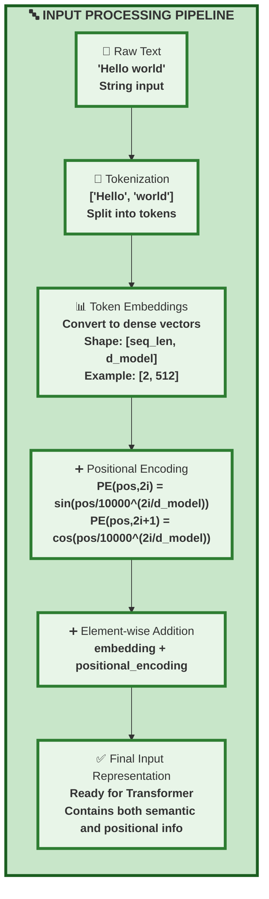

###### Encoder Stack

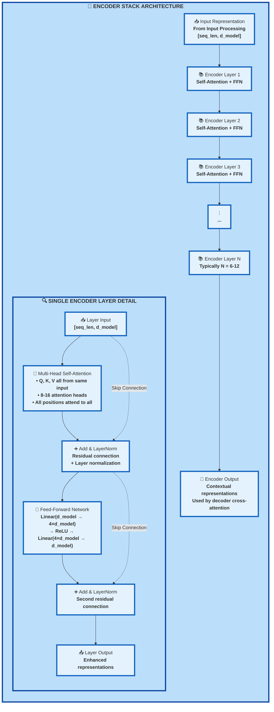

###### Decoder Stack

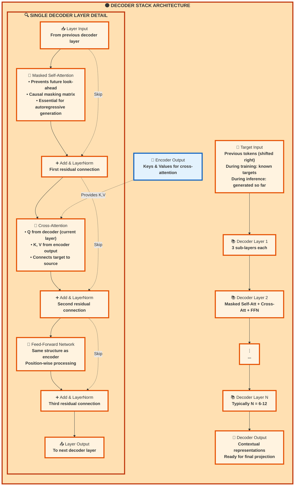

###### Attention Mechanism Details

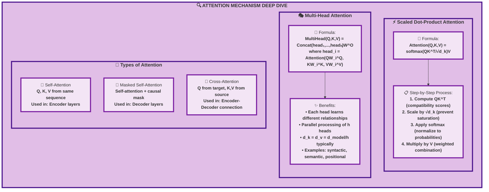

###### Output Processing

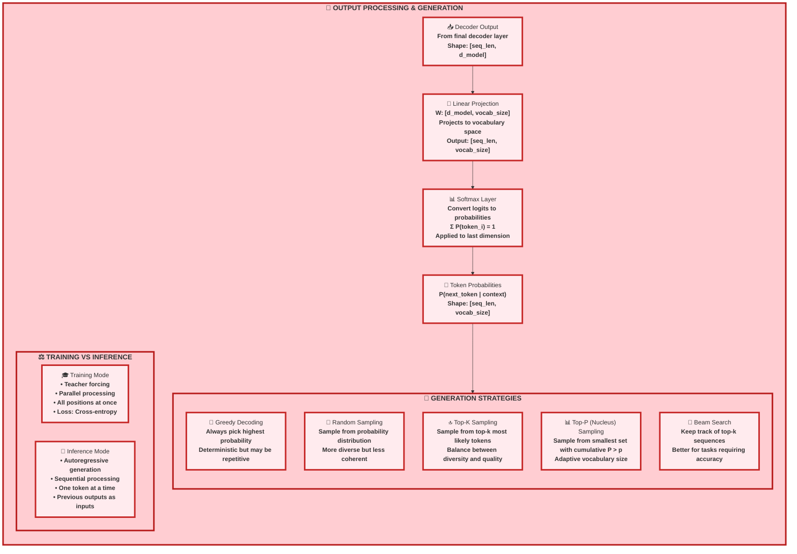

---

##### Key Components Summary

**1. Encoder Stack:**

- Processes the input sequence in parallel
- Each layer contains multi-head self-attention and feed-forward networks
- Self-attention allows each position to attend to all positions in the input

**2. Decoder Stack:**

- Generates output sequence one token at a time
- Masked self-attention prevents looking at future tokens
- Cross-attention connects decoder to encoder output

**3. Attention Mechanism:**

- **Self-Attention**: Relates different positions within the same sequence
- **Cross-Attention**: Relates positions between encoder and decoder sequences
- **Multi-Head**: Runs multiple attention functions in parallel

**4. Positional Encoding:**

- Adds information about token positions since attention is permutation-invariant
- Uses sinusoidal functions or learned embeddings

**5. Residual Connections & Layer Normalization:**

- Help with gradient flow during training
- Applied around each sub-layer (attention and feed-forward)

---

##### Concept of Attention Mechanism

The attention mechanism operates through four fundamental stages that transform input sequences into context-aware
representations. Each stage builds upon the previous one, creating a sophisticated information processing pipeline that
allows models to selectively focus on relevant parts of the input while maintaining global awareness of the entire
sequence.

**1. Query, Key, and Value Concept**

The attention mechanism is built around three distinct but interconnected vector representations that serve different
computational purposes:

- **Query (Q)**: Represents what each position is "asking for" or seeking from other positions in the sequence. Think of
  queries as questions that each token poses about what information it needs to better understand its role in the
  context.

- **Key (K)**: Represents what each position "offers" or "advertises" about the information it contains. Keys act as
  labels or summaries that describe the type of information available at each position.

- **Value (V)**: Contains the actual information content that will be retrieved and combined. Values are the substantive
  data that gets aggregated based on the attention weights computed from query-key interactions.

The Query, Key, and Value Matrices in Attention Mechanism explained with the tables below:

###### Raw Attention Scores - $QK^T$:

|       | $Q_1$           | $Q_2$           | $Q_3$           | $Q_4$           | $Q_5$           | $Q_6$           |
| ----- | --------------- | --------------- | --------------- | --------------- | --------------- | --------------- |
| $K_1$ | $K_1 \cdot Q_1$ | $K_1 \cdot Q_2$ | $K_1 \cdot Q_3$ | $K_1 \cdot Q_4$ | $K_1 \cdot Q_5$ | $K_1 \cdot Q_6$ |
| $K_2$ | $K_2 \cdot Q_1$ | $K_2 \cdot Q_2$ | $K_2 \cdot Q_3$ | $K_2 \cdot Q_4$ | $K_2 \cdot Q_5$ | $K_2 \cdot Q_6$ |
| $K_3$ | $K_3 \cdot Q_1$ | $K_3 \cdot Q_2$ | $K_3 \cdot Q_3$ | $K_3 \cdot Q_4$ | $K_3 \cdot Q_5$ | $K_3 \cdot Q_6$ |
| $K_4$ | $K_4 \cdot Q_1$ | $K_4 \cdot Q_2$ | $K_4 \cdot Q_3$ | $K_4 \cdot Q_4$ | $K_4 \cdot Q_5$ | $K_4 \cdot Q_6$ |
| $K_5$ | $K_5 \cdot Q_1$ | $K_5 \cdot Q_2$ | $K_5 \cdot Q_3$ | $K_5 \cdot Q_4$ | $K_5 \cdot Q_5$ | $K_5 \cdot Q_6$ |
| $K_6$ | $K_6 \cdot Q_1$ | $K_6 \cdot Q_2$ | $K_6 \cdot Q_3$ | $K_6 \cdot Q_4$ | $K_6 \cdot Q_5$ | $K_6 \cdot Q_6$ |

###### After Softmax - Attention Weights:

|       | $Q_1$   | $Q_2$   | $Q_3$   | $Q_4$   | $Q_5$   | $Q_6$   |
| ----- | ------- | ------- | ------- | ------- | ------- | ------- |
| $K_1$ | $0.731$ | $0.046$ | $0.057$ | $0.056$ | $0.045$ | $0.063$ |
| $K_2$ | $0.04$  | $0.827$ | $0.025$ | $0.027$ | $0.034$ | $0.044$ |
| $K_3$ | $0.017$ | $0.026$ | $0.841$ | $0.04$  | $0.033$ | $0.04$  |
| $K_4$ | $0.025$ | $0.03$  | $0.044$ | $0.839$ | $0.03$  | $0.029$ |
| $K_5$ | $0.089$ | $0.065$ | $0.039$ | $0.063$ | $0.7$   | $0.037$ |
| $K_6$ | $0.05$  | $0.066$ | $0.036$ | $0.034$ | $0.046$ | $0.765$ |

###### Mathematical Transformation:

The transformation from raw scores to attention weights follows:

$$
\text{Attention}_{ij} = \frac{\exp\left(\frac{K_i \cdot Q_j}{\sqrt{d_k}}\right)}{\sum_{k=1}^{n} \exp\left(\frac{K_k \cdot Q_j}{\sqrt{d_k}}\right)}
$$

Where:

- $K_i \cdot Q_j$ represents the dot product between key $i$ and query $j$
- $d_k$ is the dimension of the key vectors
- The softmax ensures $\sum_{i=1}^{n} \text{Attention}_{ij} = 1$ for each query $j$

These tables illustrates the **attention score calculation process** in transformers, showing the two key steps:

###### Step 1: Computing Raw Attention Scores

- **Operation**: $QK^T$ (Query-Key dot products)
- Each cell represents the dot product between a query vector ($Q_i$) and a key vector ($K_j$)
- **Formula**:
    $$
    score_{ij} = Q_i \cdot K_j
    $$
- These raw scores measure the **compatibility** or **similarity** between each query and each key
- Higher dot products indicate stronger relationships between positions

###### Step 2: Normalizing with Softmax

- **Operation**: Softmax applied column-wise to each query's scores

- **Purpose**: Convert raw scores into probability distributions

- Key Properties:
    - All weights in each column sum to 1.0
    - All weights are positive (between 0 and 1)
    - Creates "soft selection" mechanism

###### Key Observations from the Results:

- **Strong Diagonal Pattern**:

    - $Q_1$ attends most to $K_1$ (0.731)
    - $Q_2$ attends most to $K_2$ (0.827)
    - $Q_3$ attends most to $K_3$ (0.841)
    - $Q_4$ attends most to $K_4$ (0.839)
    - $Q_5$ attends most to $K_5$ (0.7)
    - $Q_6$ attends most to $K_6$ (0.765)

- **Self-Attention Behavior**: This appears to be **self-attention** where each position primarily attends to itself,
  which is common in:

    - Early training stages
    - Certain types of tasks
    - Positions with unique or important information

- **Attention Distribution**: While each position focuses mainly on itself, there's still some attention spread to other
  positions, allowing for information flow across the sequence.

###### Mathematical Process:

$$
\begin{align}
&\text{Raw Scores} \rightarrow \text{Scale by } \sqrt{d_k} \rightarrow \text{Softmax} \rightarrow \text{Attention Weights} \\
&QK^T \rightarrow \frac{QK^T}{\sqrt{d_k}} \rightarrow \text{softmax}(\cdot) \rightarrow A_{ij}
\end{align}
$$

Where each column of the final attention weights represents how much each key position contributes to the representation
of the corresponding query position.

Consider searching for information in a vast library. Your research question (query) determines what you're looking for.
Book titles and catalog entries (keys) help you identify which books might contain relevant information. The actual
content within those books (values) provides the information you ultimately extract and synthesize.

This three-component system enables flexible and dynamic information retrieval where the same content (values) can be
accessed differently depending on what different positions are seeking (queries) and how well the available information
(keys) matches those needs.

**2. Attention Scoring**

The attention scoring mechanism computes compatibility between queries and keys to determine how much each position
should attend to every other position:

$$
\text{score}(q_i, k_j) = \text{similarity}(q_i, k_j)
$$

###### Using Attention Scores

|       |       | $Q_1$   | $Q_2$   | $Q_3$   | $Q_4$   | $Q_5$   | $Q_6$   |
| ----- | ----- | ------- | ------- | ------- | ------- | ------- | ------- |
| $V_1$ | $K_1$ | $0.731$ | $0.046$ | $0.057$ | $0.056$ | $0.045$ | $0.063$ |
| $V_2$ | $K_2$ | $0.04$  | $0.827$ | $0.025$ | $0.027$ | $0.034$ | $0.044$ |
| $V_3$ | $K_3$ | $0.017$ | $0.026$ | $0.841$ | $0.04$  | $0.033$ | $0.04$  |
| $V_4$ | $K_4$ | $0.025$ | $0.03$  | $0.044$ | $0.839$ | $0.03$  | $0.029$ |
| $V_5$ | $K_5$ | $0.089$ | $0.065$ | $0.039$ | $0.063$ | $0.7$   | $0.037$ |
| $V_6$ | $K_6$ | $0.05$  | $0.066$ | $0.036$ | $0.034$ | $0.046$ | $0.765$ |

###### Weighted Sum Calculation (Example for $Q_2$):

$$
0.046 \cdot V_1 + 0.827 \cdot V_2 + 0.026 \cdot V_3 + 0.03 \cdot V_4 + 0.065 \cdot V_5 + 0.066 \cdot V_6
$$

###### Output Vector:

$$
\begin{bmatrix} 1.86, & 1.21, & -0.02, & 0.30, & \ldots, & 0.96 \end{bmatrix}
$$

###### Explanation

This diagram illustrates the **final step** of the attention mechanism: **value aggregation using attention weights**.

###### Key Components:

1. **Value Vectors ($V_1$ through $V_6$)**: Each $V_i$ represents the actual content/information stored at position $i$
   in the sequence.
2. **Attention Weights**: The same probability matrix from the previous softmax step, where each column represents how
   much attention each query pays to each key-value pair.
3. **Weighted Combination**: For each query position, we compute a weighted sum of all value vectors using the
   corresponding attention weights.

###### Mathematical Process:

For any query position $j$, the output is computed as:

$$
\text{Output}_j = \sum_{i=1}^{n} A_{ij} \cdot V_i
$$

Where $A_{ij}$ is the attention weight from query $j$ to key-value pair $i$.

###### Example Calculation for $Q_2$:

The output for query $Q_2$ is calculated by taking the weighted sum of all value vectors using the attention weights
from column $Q_2$:

$$
\text{Output}_{Q_2} = 0.046 \cdot V_1 + 0.827 \cdot V_2 + 0.026 \cdot V_3 + 0.03 \cdot V_4 + 0.065 \cdot V_5 + 0.066 \cdot V_6
$$

Since $Q_2$ has the highest attention weight ($0.827$) for $V_2$, the output will be dominated by the content of $V_2$,
with smaller contributions from other value vectors.

###### Complete Attention Formula:

$$
\text{Attention}(Q, K, V) = \text{softmax}\left(\frac{QK^T}{\sqrt{d_k}}\right)V
$$

This final step multiplies the attention weight matrix by the value matrix $V$, producing contextual representations
where each position's output is an informed combination of information from across the entire sequence.

###### Key Insight:

The attention mechanism allows each position to **selectively gather information** from other positions based on
relevance, creating rich, context-aware representations that capture both local and long-range dependencies in the
sequence.

**Mathematical Implementation:** The most common similarity function is the dot product, which measures the alignment
between query and key vectors in the embedding space. When two vectors point in similar directions (high semantic
similarity), their dot product is large, indicating strong relevance.

**Interpretation:** The score $\text{score}(q_i, k_j)$ quantifies how much position $i$ should focus on the information
available at position $j$. High scores indicate strong relationships, while low scores suggest minimal relevance.

**Alternative Scoring Methods:** While dot products are most common, other similarity functions include:

- Additive attention: Uses a small neural network to compute compatibility
- Bilinear attention: Employs a learned matrix to transform the interaction
- Cosine similarity: Normalizes vectors before computing dot products

**3. Weight Normalization**

Raw attention scores are transformed into a probability distribution using the softmax function, ensuring that attention
weights are interpretable and sum to unity:

$$
\alpha_{ij} = \frac{\exp(\text{score}(q_i, k_j))}{\sum_k \exp(\text{score}(q_i, k_k))}
$$

**Mathematical Properties:** The softmax function has several crucial characteristics:

- **Normalization**: All weights for a given query sum to 1: $\sum_j \alpha_{ij} = 1$
- **Non-negativity**: All weights are positive, creating interpretable attention patterns
- **Temperature control**: The exponential function amplifies differences between scores, making attention more decisive

**Soft Selection Mechanism:** Unlike hard attention (which would select exactly one position), softmax creates a "soft
selection" that allows blending information from multiple sources. This differentiable approach enables gradient-based
learning while maintaining the intuitive concept of selective attention.

**Competitive Dynamics:** The softmax normalization creates competition among positions—if one position receives higher
attention, others necessarily receive less. This forces the model to make meaningful choices about information priority.

**4. Value Aggregation**

The final stage combines value vectors according to the computed attention weights, producing the context-aware output
representation:

$$
\text{output}_i = \sum_j \alpha_{ij} v_j
$$

###### Queries Matrix Creation

| Token     | Embeddings                     | Queries                 |
| --------- | ------------------------------ | ----------------------- |
| Her       | $[-1.34, 0.39, \ldots, -0.34]$ | $[1.13, 0.60, 1.27]$    |
| favourite | $[1.21, -0.62, \ldots, -0.35]$ | $[0.24, 0.69, -1.60]$   |
| fruit     | $[-0.67, 0.06, \ldots, 1.29]$  | $[-1.22, -0.40, -0.24]$ |
| is        | $[1.02, 1.57, \ldots, 1.91]$   | $[0.43, -0.31, 0.12]$   |
| a         | $[0.92, -2.02, \ldots, 0.56]$  | $[0.13, -0.59, 0.98]$   |
| date      | $[0.50, 1.59, \ldots, 0.47]$   | $[0.13, 0.21, 0.65]$    |

###### Explanation

This diagram illustrates the **Query Matrix creation process** in transformer attention, showing how input embeddings
are transformed into query vectors through learned linear projection.

###### Mathematical Process:

The transformation from embeddings to queries follows:

$$
Q = X \cdot W^Q
$$

Where:

- $X$ is the input embeddings matrix (shape: $[\text{seq len}, d_{\text{model}}]$)
- $W^Q$ is the learned query projection matrix (shape: $[d_{\text{model}}, d_k]$)
- $Q$ is the resulting queries matrix (shape: $[\text{seq len}, d_k]$)

###### Key Components:

1. **Input Tokens**: The sequence "Her favourite fruit is a date" is tokenized into 6 tokens.
2. **Embeddings**: Each token is represented by a high-dimensional dense vector (typically $d_{\text{model}} = 512$ or
   $768$ dimensions). Only the first few and last dimensions are shown with "$\ldots$".
3. **Projection Matrix $W^Q$**: A learned parameter matrix that transforms embeddings into query space. This matrix is
   trained to create queries that effectively "ask" for relevant information from other positions.
4. **Query Vectors**: The resulting lower-dimensional vectors (shown as 3D for simplicity) that represent what each
   position is "looking for" from other positions in the sequence.

###### Purpose of Query Transformation:

1. **Dimensionality Reduction**: Typically $d_k < d_{\text{model}}$, allowing for computational efficiency in multi-head
   attention.
2. **Learned Representations**: The projection matrix $W^Q$ is learned during training to create queries optimized for
   the specific task.
3. **Semantic Encoding**: Each query vector encodes what type of information that position needs from the rest of the
   sequence.

###### Example Interpretation:

For the token "Her":

- **Embedding**: $[-1.34, 0.39, \ldots, -0.34]$ (original semantic representation)
- **Query**: $[1.13, 0.60, 1.27]$ (what "Her" is looking for from other tokens)

The query for "Her" might be seeking information about:

- What entity it refers to
- Grammatical relationships (subject-object)
- Semantic connections with other words

###### Mathematical Details:

For each token $i$:

$$
q_i = \text{embedding}_i \cdot W^Q
$$

Where $q_i$ is a $d_k$-dimensional query vector that will be used to compute attention scores against all key vectors in
the sequence.

This transformation is crucial because it allows the model to learn what each position should "ask for" rather than
using raw embeddings directly for attention computation.

**Weighted Combination:** The output for position $i$ is a weighted average of all value vectors in the sequence.
Positions with higher attention weights contribute more to the final representation, while those with lower weights have
diminished influence.

**Information Flow:** This aggregation step is where actual information transfer occurs. Unlike the scoring phase (which
only computes relationships), value aggregation moves semantic content from attended positions to the output
representation.

**Contextual Enrichment:** Each position's output now contains not just its original information, but a curated blend of
information from across the entire sequence, weighted by relevance and importance.

**Practical Example: Coreference Resolution**

Consider the sentence: "The animal didn't cross the street because it was too tired." The attention mechanism resolves
the ambiguous pronoun "it" through the following process:

1. **Query Formation**: The position containing "it" generates a query seeking information about what entity it refers
   to
2. **Key Matching**: This query is compared against keys from all positions, including "animal" and "street"
3. **Score Computation**: The query-key interaction for "it" and "animal" produces a higher score due to semantic
   compatibility (both refer to living entities that can be tired)
4. **Weight Assignment**: After softmax normalization, "it" assigns high attention weight to "animal" and low weight to
   "street"
5. **Value Integration**: The final representation for "it" incorporates substantial information from "animal,"
   effectively resolving the coreference

**Revolutionary Impact**

The attention mechanism revolutionized sequence modeling by solving fundamental limitations of previous architectures:

###### I. Query Creation Diagram

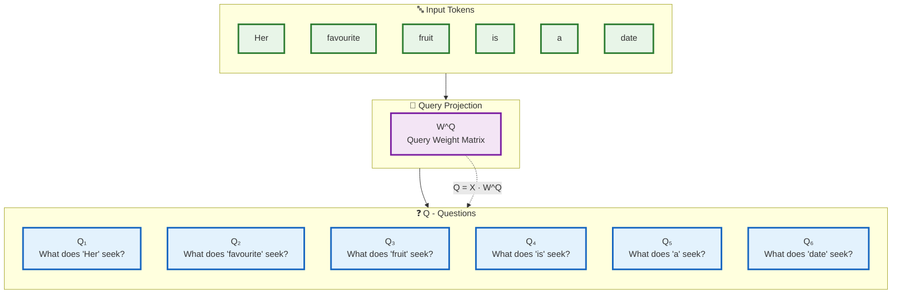

###### II. Key Creation Diagram

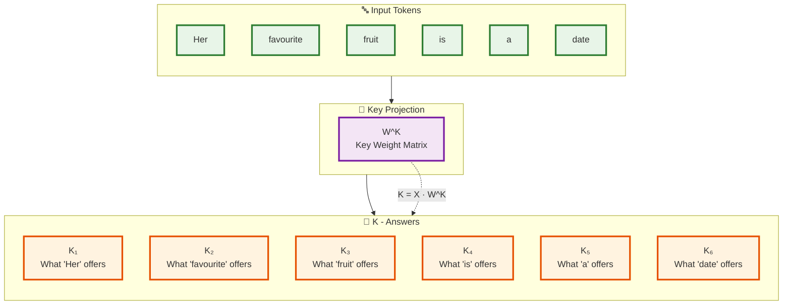

###### Explanation

This diagram illustrates the **parallel creation of Queries and Keys** from the same input sequence, showing the
conceptual difference between what each token "asks for" versus what it "offers."

###### Mathematical Process:

Both transformations happen simultaneously from the same input embeddings:

$$
Q = X \cdot W^Q \quad \text{and} \quad K = X \cdot W^K
$$

Where:

- $X$ is the input embeddings matrix
- $W^Q$ and $W^K$ are different learned projection matrices
- $Q$ contains the "questions" each position asks
- $K$ contains the "answers" each position provides

###### Conceptual Framework:

###### Queries ($Q$) - "Questions":

- **Purpose**: Represent what each position is "looking for" from other positions
- **Analogy**: Like search queries or questions that each word poses
- Examples:
    - $Q_1$ ("Her"): "Who or what am I referring to?"
    - $Q_2$ ("favourite"): "What thing is being described as favourite?"
    - $Q_3$ ("fruit"): "What kind of fruit am I, and what are my properties?"

###### Keys ($K$) - "Answers":

- **Purpose**: Represent what each position "advertises" or "offers" as information

- **Analogy**: Like labels or descriptions of available information

- Examples:

    - $K_1$ ("Her"): "I'm a possessive pronoun referring to a female entity"
    - $K_2$ ("favourite"): "I'm an adjective describing preference"
    - $K_6$ ("date"): "I'm a noun that could be a fruit or a calendar date"

###### Self-Attention Mechanism:

In **self-attention**, both $Q$ and $K$ come from the same sequence, allowing each position to:

1. **Ask questions** about what information it needs ($Q_i$)
2. **Provide answers** about what information it contains ($K_j$)
3. **Match questions to answers** through dot product: $Q_i \cdot K_j$

###### Key Insight:

The beauty of this design is that each token simultaneously:

- **Seeks information** (through its query vector)
- **Provides information** (through its key vector)

This creates a rich, bidirectional information exchange where every position can potentially inform every other position
based on relevance and compatibility.

###### Attention Score Computation:

The compatibility between what position $i$ seeks and what position $j$ offers is computed as:

$$
\text{score}_{ij} = Q_i \cdot K_j
$$

High scores indicate that position $i$'s question is well-matched by position $j$'s answer, leading to high attention
weights after softmax normalization.

**Direct Connectivity:** Unlike RNNs, which must pass information sequentially through intermediate positions, attention
creates direct connections between any two positions in the sequence. This eliminates the information bottleneck that
plagued earlier models when processing long sequences.

**Parallel Processing:** All attention computations can be performed simultaneously, dramatically reducing training time
compared to sequential models. This parallelization was crucial for scaling to the massive datasets that enabled modern
language models.

**Long-Range Dependencies:** By providing direct pathways between distant positions, attention mechanisms excel at
capturing relationships that span many tokens—essential for understanding complex linguistic phenomena like
long-distance agreement, nested structures, and discourse coherence.

**Interpretability:** Attention weights provide interpretable insights into model behavior, allowing researchers and
practitioners to understand which parts of the input the model considers most important for each prediction.

This four-step attention process—query-key matching, scoring, normalization, and value aggregation—forms the
computational foundation for all transformer-based models, from BERT and GPT to modern large language models.

---

##### Self-Attention Implementation

Self-attention is a specific application of the attention mechanism where the queries, keys, and values all come from
the same source. This allows each element in a sequence to attend to all other elements, essentially enabling the
sequence to look at itself (hence "self"-attention) to compute a better representation.

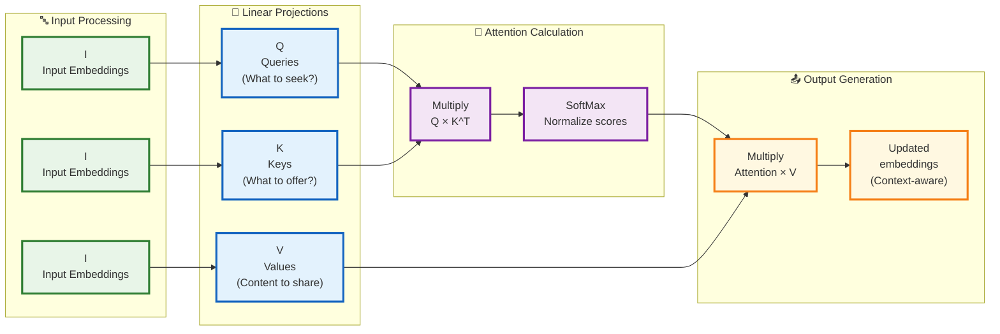

###### Explanation

This diagram illustrates the **complete attention mechanism pipeline** showing how input embeddings are transformed into
context-aware representations.

###### Step-by-Step Process:

###### Input Processing:

- **Same input embeddings** $I$ are used three times
- Each copy gets transformed into different roles: Queries, Keys, and Values
- Mathematical representation:
    $$
    Q = I \cdot W^Q, \quad K = I \cdot W^K, \quad V = I \cdot W^V
    $$

###### Linear Projections:

- **Queries $(Q)$**: "What information does each position seek?"
- **Keys $(K)$**: "What information does each position advertise?"
- **Values $(V)$**: "What actual content does each position contain?"

###### Attention Calculation:

1. **First Multiply**: Compute compatibility scores between queries and keys $$\text{Scores} = Q \times K^T$$
2. **SoftMax**: Normalize scores into probability distribution
   $$\text{Attention Weights} = \text{softmax}\left(\frac{QK^T}{\sqrt{d_k}}\right)$$

###### Output Generation:

1. **Second Multiply**: Weight the values by attention scores $$\text{Output} = \text{Attention Weights} \times V$$
2. **Updated Embeddings**: Context-aware representations where each position contains information from relevant
   positions

###### Mathematical Formula:

$$
\text{Attention}(Q, K, V) = \text{softmax}\left(\frac{QK^T}{\sqrt{d_k}}\right)V
$$

###### Key Insight:

The attention mechanism transforms static embeddings into **dynamic, context-aware representations** where each
position's output is an informed combination of information from across the entire sequence, weighted by relevance and
importance.

Let's walk through the concrete implementation steps for self-attention:

**1. Projection Matrices**

First, we need to transform the input embeddings into the query, key, and value spaces. If our input is a sequence of
vectors with dimension $d_{model}$, we create three matrices:

- $W^Q$ of shape $d_{model} \times d_k$ for queries
- $W^K$ of shape $d_{model} \times d_k$ for keys
- $W^V$ of shape $d_{model} \times d_v$ for values

For each position $i$ in our sequence with input embedding $x_i$, we compute:

$$
\begin{align}
q_i &= x_i W^Q \\
k_i &= x_i W^K \\
v_i &= x_i W^V
\end{align}
$$

These linear transformations allow the model to project the same input into different representation spaces optimized
for their specific roles in the attention mechanism.

**2. Computing Attention Scores**

Once we have queries and keys, we compute the attention scores by taking the dot product of each query with all keys:

$$
s_{ij} = q_i \cdot k_j^T
$$

This results in a matrix where entry $(i,j)$ represents how much position $i$ should attend to position $j$.

In practice, this is calculated efficiently as a matrix multiplication:

$$
S = QK^T
$$

Where $Q$ and $K$ are matrices containing all queries and keys for the sequence.

**3. Scaling the Scores**

The dot product can grow large for long vectors, pushing the softmax function into regions with very small gradients. To
counteract this, we scale the scores by the square root of the dimension of the key vectors:

$$
S = \frac{QK^T}{\sqrt{d_k}}
$$

This scaling factor keeps the values in a range where the softmax function remains sensitive to input differences.

**4. Applying Softmax**

Next, we apply the softmax function row-wise to obtain the attention weights:

$$
A = \text{softmax}(S)
$$

Each row of $A$ becomes a probability distribution over all positions in the sequence, representing how much each
position contributes to the new representation of position $i$.

**5. Computing Weighted Values**

Finally, we compute the output as a weighted sum of the values:

$$
O = AV
$$

Each row in $O$ represents the new, context-aware representation for the corresponding position in the input sequence.

To visualize this process, consider a simple sentence: "The dog chased the cat." When processing the word "chased,"
self-attention might assign high weights to "dog" (the subject doing the chasing) and "cat" (the object being chased),
capturing the semantic relationships between these words regardless of their positions in the sentence.

The power of self-attention becomes even more apparent with ambiguous references. In the sentence "The trophy wouldn't
fit in the suitcase because it was too big," self-attention helps determine that "it" likely refers to "trophy" through
the attention weights, solving a complex coreference resolution problem.

Self-attention can be visualized as a directed graph where each node (word) is connected to every other node, with edge
weights representing attention scores. This creates a fully connected network of relationships, allowing information to
flow directly between any positions without passing through intermediate steps.

<div align="center">

<p style="color: #555;">Figure: Masked Multi-Head Attention</p>
</div>

---

##### Multi-Head Attention

While self-attention is powerful, it has a limitation: a single attention mechanism can only capture one type of
relationship at a time. Consider the sentence "She met the old man at the bank." The word "bank" could have different
types of relationships with other words—a semantic relationship with "she" and "met" indicating a financial institution,
or a semantic relationship with "old man" possibly suggesting a riverbank.

Multi-head attention addresses this limitation by running multiple self-attention mechanisms in parallel, allowing the
model to jointly attend to information from different representation subspaces.

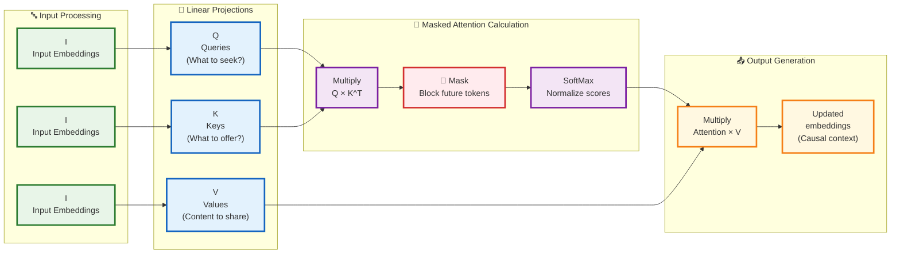

###### Explanation

This diagram shows **Masked Multi-Head Attention**, which is used in decoder layers to prevent tokens from attending to
future positions during autoregressive generation.

###### Key Difference from Standard Attention:

The critical addition is the **Mask** step between the initial multiplication and softmax normalization.

###### Step-by-Step Process:

###### Input Processing (Same as before):

- Input embeddings $I$ are projected into Queries $(Q)$, Keys $(K)$, and Values $(V)$
- $$
  Q = I \cdot W^Q, \quad K = I \cdot W^K, \quad V = I \cdot W^V
  $$

###### Masked Attention Calculation:

1. **Multiply**: Compute raw attention scores $$\text{Scores} = Q \times K^T$$
2. **🚫 Mask**: Apply causal mask to prevent future look-ahead $$\text{Masked Scores} = \text{Scores} + M$$ Where mask
   $M$ is defined as: $$M_{ij} = \begin{cases} 0 & \text{if } j \leq i \ -\infty & \text{if } j > i \end{cases}$$
3. **SoftMax**: Normalize masked scores $$\text{Attention Weights} = \text{softmax}(\text{Masked Scores})$$

###### Output Generation:

1. **Final Multiply**: Weight values by masked attention $$\text{Output} = \text{Attention Weights} \times V$$

###### Purpose of Masking:

- **Causal Constraint**: Ensures position $i$ can only attend to positions $\leq i$
- **Autoregressive Generation**: Essential for language modeling where future tokens shouldn't influence current
  predictions
- **Training Consistency**: Maintains the same constraint during training as during inference

###### Mathematical Formula:

$$
\text{MaskedAttention}(Q, K, V) = \text{softmax}\left(\frac{QK^T + M}{\sqrt{d_k}}\right)V
$$

The mask effectively sets attention weights to zero for future positions, ensuring **causal information flow** in
decoder architectures.

Let's understand how multi-head attention works:

**1. Creating Multiple Projection Sets**

Instead of having just one set of projection matrices ($W^Q$, $W^K$, $W^V$), we create $h$ different sets, where $h$ is
the number of heads:

$$
W_i^Q, W_i^K, W_i^V \quad \text{for} \quad i = 1, 2, ..., h
$$

Each head has its own projection matrices, usually with reduced dimensions. If the model dimension is $d_{model}$ and we
have $h$ heads, each head typically projects to dimension $d_k = d_v = d_{model}/h$.

**2. Parallel Attention Computation**

Each head computes attention independently:

$$
\text{head}_i = \text{Attention}(XW_i^Q, XW_i^K, XW_i^V)
$$

Where $X$ is the input sequence, and $\text{Attention}$ refers to the scaled dot-product attention described earlier.

Each head can learn to focus on different aspects of the data:

- One head might focus on syntactic relationships
- Another might capture subject-verb relationships
- A third might identify entity relationships
- Others might learn positional or local phrase patterns

**3. Concatenation and Final Projection**

After computing the output from each attention head, we concatenate them:

$$
\text{MultiHead} = \text{Concat}(\text{head}_1, \text{head}_2, ..., \text{head}_h)
$$

This concatenation results in a matrix of shape $(seq_length, d_{model})$, maintaining the original dimension size.

Finally, we apply one more linear transformation:

$$
\text{MultiHead} = \text{MultiHead} \cdot W^O
$$

Where $W^O$ is a parameter matrix of shape $(d_{model}, d_{model})$ that mixes information from different heads.

To visualize how multiple heads work together, let's use our previous example: "She met the old man at the bank."

- **Head 1** might focus on syntactic structure, connecting "she" to the verb "met"
- **Head 2** might capture entity relationships, linking "old man" with its definite article "the"
- **Head 3** might attend to financial context words, connecting "bank" with "met" (suggesting a financial institution)
- **Head 4** might focus on spatial relationships, connecting "at" with "bank"

The concatenated output from these heads provides a rich, multi-faceted representation that captures different aspects
of meaning simultaneously.

A typical transformer implementation uses 8-16 attention heads. Empirical studies have shown that different heads indeed
learn to specialize in different types of relationships, although there is usually some redundancy between heads. Some
heads focus on local relationships, others on long-distance dependencies, and some on specific syntactic or semantic
patterns.

---

###### Scaled Dot-Product Attention

Now that we understand self-attention and multi-head attention at a high level, let's examine the specific attention
mechanism used in transformer models: scaled dot-product attention.

The formula for scaled dot-product attention is:

$\text{Attention}(Q, K, V) = \text{softmax}\left(\frac{QK^T}{\sqrt{d_k}}\right)V$

This seemingly simple equation packs several important design choices that make it particularly effective for
transformers. Let's break it down step by step:

**1. Dot Product for Similarity**

The dot product between query and key vectors measures their similarity:

$$
QK^T
$$

results in a matrix where entry $(i,j)$ is the dot product $q_i \cdot k_j$.

The dot product has an intuitive interpretation: vectors pointing in similar directions have high dot products, while
orthogonal vectors have zero dot products. This naturally captures the notion of relevance—how much one position should
attend to another.

Compared to alternatives like additive attention (using a small neural network to compute compatibility), the dot
product is:

- More computationally efficient
- More space-efficient (requires fewer parameters)
- Well-optimized on modern hardware through matrix multiplication

**2. Scaling Factor**

The scaling factor $\frac{1}{\sqrt{d_k}}$ is a critical component often overlooked in simplified explanations.

As the dimension $d_k$ grows, the variance of the dot product grows as well. For random vectors with components of
variance 1, their dot product would have variance $d_k$. These large values push the softmax function into regions with
extremely small gradients, causing the gradient to vanish during backpropagation.

By dividing by $\sqrt{d_k}$, we keep the variance of the dot product at 1 regardless of the dimension, ensuring stable
gradients during training.

To illustrate, imagine two vectors of dimension 64 with typical values around 1. Their dot product could easily reach
magnitude 8 (square root of 64), which when passed through softmax would give nearly all weight to the highest value,
effectively making attention almost a hard selection rather than a soft weighting.

**3. Softmax Normalization**

The softmax function converts the scaled dot products into a probability distribution:

$$
\text{softmax}(x_i) = \frac{e^{x_i}}{\sum_j e^{x_j}}
$$

This serves two important purposes:

- Ensures all attention weights are positive and sum to 1
- Creates a differentiable "soft" selection mechanism

The softmax operation is applied row-wise, meaning each position in the sequence gets its own probability distribution
over all positions it can attend to.

**4. Value Weighting**

The final step multiplies the attention weight matrix by the value matrix:

$$
\text{softmax}\left(\frac{QK^T}{\sqrt{d_k}}\right)V
$$

This creates a weighted combination of value vectors for each position.

If position $i$ attends strongly to positions $j$ and $k$, then the output for position $i$ will be dominated by the
value vectors $v_j$ and $v_k$.

The mask parameter is particularly important for transformer models. In decoder self-attention, we need to ensure that
predictions at position $i$ can only depend on outputs at positions less than $i$. This causal masking is implemented by
setting the upper triangular part of the attention matrix to negative infinity before softmax, effectively forcing those
attention weights to zero.

Scaled dot-product attention provides an elegant balance of computational efficiency and expressive power, making it the
attention mechanism of choice for transformer architectures.

---

##### Positional Encoding

A key limitation of the attention mechanism is that it's permutation invariant—it doesn't inherently consider the order
of elements in the sequence. If we shuffled the words in a sentence, the self-attention operation would produce the same
results, which is problematic since word order is crucial for understanding language.

Transformers solve this problem through positional encoding—adding position-specific information to the input embeddings
before they're processed by the attention layers.

Let's explore how positional encoding works:

**1. Fixed Sinusoidal Encodings**

The original transformer paper introduced a clever approach using sine and cosine functions of different frequencies:

$$
PE_{(pos, 2i)} = \sin(pos / 10000^{2i/d_{model}})
$$

$$
PE_{(pos, 2i+1)} = \cos(pos / 10000^{2i/d_{model}})
$$

Where:

- $pos$ is the position in the sequence (0, 1, 2, ...)
- $i$ is the dimension index (0, 1, 2, ..., $d_{model}/2 - 1$)
- $d_{model}$ is the embedding dimension

This creates a unique encoding vector for each position, with specific patterns that help the model learn about relative
positions. The sinusoidal functions have several desirable properties:

- Each position gets a unique encoding
- The encodings for nearby positions are similar, while distant positions are more different
- The pattern extends to positions beyond those seen during training
- It allows the model to easily learn relative position relationships

**2. Adding Positional Information**

The positional encodings are simply added to the input embeddings:

$$
\text{input} = \text{embedding} + \text{positional\_encoding}
$$

This maintains the original semantic information while enriching it with positional context.

The dimensions of the positional encoding vector match the embedding dimensions, ensuring they can be added together.

To understand how sinusoidal encodings capture position information, let's examine their patterns:

- For small values of $i$ (early dimensions), the sinusoids have a high frequency, changing rapidly with position
- For large values of $i$ (later dimensions), the sinusoids have a low frequency, changing slowly with position

This creates a multi-scale representation of position, where different dimensions capture position information at
different resolutions.

Remarkably, this encoding scheme allows the model to generalize to sequence lengths longer than those seen during
training. The sinusoidal pattern continues predictably for any position value, enabling the model to handle longer texts
at inference time.

Here's a simplified visualization of positional encodings for the first few positions and dimensions:

For position 0:

$$
[sin(0), cos(0), sin(0), cos(0), ...] = [0, 1, 0, 1, ...]\\
$$

For position 1:

$$
[sin(1/10000^0), cos(1/10000^0), sin(1/10000^0.02), ...] ≈ [0.84, 0.54, 0.84, ...]\\
$$

For position 2:

$$
[sin(2/10000^0), cos(2/10000^0),sin(2/10000^0.02), ...] ≈ [0.91, -0.42, 0.91, ...]\\
$$

Each position gets a unique fingerprint, with patterns that reflect the relative distances between positions.

While fixed sinusoidal encodings are elegant, many modern transformer implementations use learned positional embeddings
instead, which are simple position-specific vectors that the model learns during training. These learned embeddings
often perform slightly better but don't generalize to unseen sequence lengths as well as the sinusoidal encodings.

More recent transformer models have explored alternatives like rotary position embeddings (RoPE), relative positional
encoding, and position-aware attention mechanisms, each offering different trade-offs in terms of performance,
efficiency, and maximum sequence length.

---

##### Transformer Block Architecture

With attention mechanisms and positional encoding in place, we can now explore the complete architecture of a
transformer block—the fundamental building unit of transformer models.

A transformer block consists of several components arranged in a specific structure with residual connections and
normalization layers. Let's examine each component and how they work together:

**1. Multi-Head Self-Attention Layer**

As we've discussed, this layer allows each position to attend to all positions, capturing different types of
relationships through multiple attention heads.

The key innovation of transformers is replacing recurrent or convolutional operations with self-attention, enabling:

- Direct modeling of long-range dependencies
- Parallel computation across the sequence
- More interpretable attention patterns

**2. Residual Connection and Layer Normalization**

After the self-attention layer, transformers employ two techniques to improve training stability:

- **Residual Connection**: The input to the self-attention layer is added to its output, creating a direct path for
  gradients to flow during backpropagation. This helps combat the vanishing gradient problem in deep networks:

$$
\text{output} = \text{LayerNorm}(\text{input} + \text{SelfAttention}(\text{input}))
$$

- **Layer Normalization**: Normalizes the output across the feature dimension, standardizing the mean and variance for
  each position in the sequence. This stabilizes the activations and speeds up training:

$$
\text{LayerNorm}(x) = \gamma \cdot \frac{x - \mu}{\sqrt{\sigma^2 + \epsilon}} + \beta
$$

Where $\mu$ and $\sigma$ are the mean and standard deviation of the features, and $\gamma$ and $\beta$ are learnable
parameters.

The specific arrangement of normalization layers has evolved across transformer implementations. The original
architecture used "post-norm" (normalization after addition), while many modern implementations use "pre-norm"
(normalization before attention and FFN), which provides more training stability.

**3. Position-wise Feed-Forward Network**

After the attention mechanism, each position is processed independently through a small two-layer neural network:

$$
\text{FFN}(x) = \max(0, xW_1 + b_1)W_2 + b_2
$$

This network consists of:

- A linear transformation expanding the dimension (typically by a factor of 4)
- A ReLU activation function
- A second linear transformation projecting back to the original dimension

The feed-forward network serves several important purposes:

- Adds non-linearity to the model
- Processes the attention outputs further
- Provides additional parameter capacity

Since the same FFN is applied to each position independently, it's called "position-wise." It's essentially a 1x1
convolution or a token-by-token transformation.

**4. Second Residual Connection and Layer Normalization**

Similar to the first residual connection, the output from the multi-head attention is combined with the output from the
feed-forward network:

$$
\text{output} = \text{LayerNorm}(\text{attention\_output} + \text{FFN}(\text{attention\_output}))
$$

This creates a second gradient pathway, further improving training dynamics. The complete transformer block can be
summarized as:

```shell
x → [Multi-Head Attention → Add & Norm → Feed-Forward → Add & Norm] → output
     ↑                                   ↑
     └───────────────x────────────┘     └───────────output of attention───┘
```

This block structure is then stacked multiple times to create the full transformer model. The original transformer paper
used 6 identical layers for both the encoder and decoder, but modern implementations often use more layers (BERT has
12-24, GPT-3 has 96).

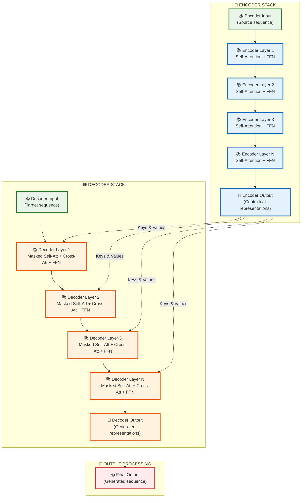

In the encoder-decoder architecture, the transformer block in the decoder has an additional component:

- An encoder-decoder attention layer that allows the decoder to attend to all positions in the encoder output
- This layer sits between the masked self-attention and the feed-forward network

For autoregressive models like GPT, the self-attention mechanism in the decoder is masked to prevent attending to future
positions, ensuring the model only conditions on previous tokens when generating text. The transformer block
architecture combines several key innovations:

1. Self-attention for capturing long-range dependencies
2. Multi-head attention for representing different types of relationships
3. Residual connections for improving gradient flow
4. Layer normalization for stabilizing training
5. Position-wise FFN for adding non-linearity and capacity

This elegant design has proven remarkably effective across a wide range of sequence processing tasks, from machine
translation to language modeling, establishing transformers as the backbone of modern NLP systems.

Understanding the transformer architecture at this level provides the foundation for working with, adapting, and
innovating on modern language models, which have revolutionized natural language processing and continue to drive
breakthroughs in artificial intelligence.

---

##### Tokenization and Embeddings in NLP

Natural Language Processing (NLP) systems must first transform raw text into a numerical representation before they can
process it effectively. This transformation involves two critical steps: tokenization, which segments text into discrete
units, and embedding, which maps these tokens to numerical vectors. These processes fundamentally shape how machines
understand and generate human language.

###### Tokenization Methods

Tokenization is the foundation of text processing, breaking down a sequence of characters into meaningful units called
tokens. This seemingly straightforward process involves numerous design decisions that significantly impact model
performance.

At its most basic level, tokenization divides text along white spaces and punctuation to produce word-level tokens.
However, this simple approach fails to address the complexity and diversity of natural language. Modern tokenization
approaches include:

**1. Word-level Tokenization**

Word tokenization splits text at word boundaries, typically using spaces and punctuation as delimiters. For example, the
sentence "The cat sat on the mat." would be tokenized as ["The", "cat", "sat", "on", "the", "mat", "."]. While
intuitive, word tokenization faces several challenges:

- **Vocabulary explosion**: Languages contain millions of unique words, including inflections, derivations, compounds,
  and neologisms. Creating embeddings for each possible word requires enormous vocabulary sizes.

- **Out-of-vocabulary (OOV) words**: Words not encountered during training cannot be directly represented, requiring
  fallback strategies like using a special [UNK] token or handling at the character level.

- **Morphological variation**: Word tokenization treats morphologically related words (e.g., "run," "running," "runs")
  as entirely distinct entities, failing to capture their semantic relationships.

- **Language dependence**: Word boundaries are not clearly marked in many languages. For instance, Chinese and Japanese
  texts do not use spaces between words, requiring specialized segmentation algorithms.

Various libraries implement word tokenization, with subtle differences in how they handle punctuation, contractions, and
special characters. For example, NLTK and spaCy offer language-aware tokenizers that handle language-specific nuances
like contractions in English (e.g., "don't" → "do", "n't") or compound words in German.

**2. Character-level Tokenization**

Character tokenization treats individual characters as tokens, addressing many limitations of word tokenization. The
sentence "The cat" would be tokenized as ["T", "h", "e", " ", "c", "a", "t"]. This approach offers several advantages:

1. **Closed vocabulary**: The character set is finite and known in advance, eliminating OOV issues.
2. **Language-agnostic operation**: Works without modification across many languages, including those without clear word
   boundaries.
3. **Morphological awareness**: Captures subword patterns implicitly through character sequences.

However, character tokenization also has drawbacks:

1. **Sequence length**: Character sequences are much longer than word sequences, increasing computational demands and
   making it harder to capture long-range dependencies.
2. **Semantic dilution**: The semantic information present in a word becomes diffused across many tokens, potentially
   making it harder for models to capture meaning.
3. **Inefficiency for common patterns**: Common morphological patterns must be relearned from scratch instead of being
   represented as single units.

Character tokenization has proven particularly effective for specialized tasks like spelling correction, informal text
processing (with many spelling variations), and processing languages with complex morphology or no clear word
boundaries.

**3. Hybrid Approaches**

Hybrid methods combine word-level and character-level tokenization to balance their strengths and weaknesses. These
include:

1. **Word+Character models**: Use word tokenization when possible, but fall back to character-level representation for
   OOV words.
2. **Mixed-granularity models**: Process text at multiple granularity levels simultaneously (words, characters, and
   potentially other units).

Hybrid approaches can be particularly effective for handling languages with complex morphology or mixed scripts, but
they add complexity to model architecture and training procedures.

Modern NLP systems have increasingly moved toward subword tokenization methods, which we'll cover in detail in a later
section. These methods provide an elegant solution to many of the challenges faced by both word-level and
character-level approaches.

---

##### Word Embeddings Techniques

Word embeddings are dense vector representations of words that capture semantic relationships in a continuous vector
space. Unlike sparse one-hot encodings, where each word is represented by a vector with a single 1 and all other entries
0, embeddings map words to dense vectors typically ranging from 50 to 300 dimensions.

Several landmark techniques have shaped the development of word embeddings:

**1. Word2Vec**

Developed by Mikolay et al. at Google in 2013, Word2Vec revolutionized word representation by learning embeddings
through context prediction tasks. Word2Vec comes in two flavors:

1. **Continuous Bag of Words (CBOW)**: Predicts a target word given its surrounding context words. For example, given
   "The \_\_\_\_ sat on the mat," the model predicts "cat."
2. **Skip-gram**: The inverse of CBOW, predicting context words given a target word. Given "cat," the model predicts
   surrounding words like "the," "sat," "on."

Mathematically, Skip-gram maximizes the average log probability:

$$
\frac{1}{T} \sum_{t=1}^{T} \sum_{-c \leq j \leq c, j \neq 0} \log p(w_{t+j} | w_t)
$$

Where $c$ is the context window size, $T$ is the text length, and $w_t$ is the target word.

Word2Vec produces embeddings with remarkable properties:

- Words with similar meanings cluster together in the vector space.
- Vector arithmetic captures semantic relationships: vec("king") - vec("man") + vec("woman") ≈ vec("queen").
- The distance between word vectors correlates with semantic similarity.
- The embeddings encode various linguistic regularities and patterns.

**2. GloVe (Global Vectors)**

Developed by Pennington et al. at Stanford in 2014, GloVe combines the benefits of count-based methods (like Latent
Semantic Analysis) with prediction-based methods (like Word2Vec). GloVe works by factorizing the logarithm of the word
co-occurrence matrix.

The core insight of GloVe is that the ratio of co-occurrence probabilities can encode meaning. For instance, if we have
words $i$ and $j$ and two context words $k$ and $l$, the ratio $P_{ik}/P_{jk}$ will be large if word $i$ is related to
context $k$ but word $j$ is not, close to 1 if both or neither are related, and small if word $j$ is related but word
$i$ is not.

The GloVe objective function is:

$$
J = \sum_{i,j=1}^{V} f(X_{ij})(\mathbf{w}_i^T \tilde{\mathbf{w}}_j + b_i + \tilde{b}_j - \log X_{ij})^2
$$

Where:

- $X_{ij}$ is the co-occurrence count between words $i$ and $j$
- $\mathbf{w}_i$ and $\tilde{\mathbf{w}}_j$ are word vectors
- $b_i$ and $\tilde{b}_j$ are bias terms
- $f(X_{ij})$ is a weighting function that prevents rare co-occurrences from being overweighted

GloVe embeddings generally perform similarly to Word2Vec but can be more efficient to train on large corpora since they
directly utilize global co-occurrence statistics.

**3. FastText**

Developed by Facebook AI Research in 2016, FastText extends Word2Vec by representing each word as a bag of character
n-grams. For example, the word "apple" with n=3 would be represented as {"<ap", "app", "ppl", "ple", "le>"} plus the
whole word "apple".

The key advantage of FastText is handling OOV words and morphologically rich languages better than Word2Vec and GloVe.
By learning representations for character n-grams rather than whole words, FastText can generate embeddings for
previously unseen words based on their subword components.

FastText uses the same Skip-gram or CBOW objectives as Word2Vec but with the modification that each word is represented
as the sum of its constituent n-gram vectors.

The subword approach is particularly beneficial for:

- Languages with rich morphology like Finnish, Turkish, or German
- Technical texts with many compound words
- Social media content with misspellings and neologisms

**Implementation Considerations**

When implementing or selecting word embeddings, several practical considerations arise:

1. **Dimensionality**: Higher dimensions can capture more nuanced relationships but require more data to train
   effectively and consume more memory. Common dimensions range from 50 (for simple tasks) to 300 (for complex tasks).
2. **Context window size**: Larger windows capture topical similarity, while smaller windows capture functional or
   syntactic similarity.
3. **Minimum frequency thresholds**: Words appearing fewer than a threshold number of times are often excluded or mapped
   to a special token like [UNK].
4. **Preprocessing**: Choices around lowercasing, stemming, lemmatization, and handling punctuation can significantly
   impact embedding quality.
5. **Training corpus**: Domain-specific corpora produce embeddings that better capture the nuances relevant to specific
   applications.

Pre-trained word embeddings like Google's Word2Vec trained on Google News, Stanford's GloVe trained on Common Crawl, or
Facebook's FastText trained on Wikipedia provide a strong starting point for many applications and can be fine-tuned on
domain-specific data if needed.

---

##### Contextual vs. Static Embeddings

Traditional word embeddings like Word2Vec, GloVe, and FastText assign the same vector to a word regardless of its
context. This creates an inherent limitation: words with multiple meanings (polysemy) receive a single representation
that averages their various senses. For example, "bank" could refer to a financial institution or a riverside, but
static embeddings cannot distinguish between these meanings.

**Static Embeddings**

Static embeddings maintain several advantages:

- Computational efficiency both during training and inference
- Straightforward interpretation and visualization
- Easy integration with various downstream models
- Effective for tasks where context is less critical

However, they face significant limitations:

- Inability to distinguish word senses based on context
- Poor handling of homonyms, polysemous words, and contextual variations
- Insensitivity to syntactic roles that vary by context

**Contextual Embeddings**

Contextual embeddings, introduced by models like ELMo, BERT, and GPT, revolutionized NLP by generating dynamic
representations for words based on their surrounding context. In these models, the same word receives different
embeddings in different contexts, capturing its specific meaning in each instance.

The key innovations that enabled contextual embeddings include:

1. **Bidirectional context modeling**: Models like BERT consider both left and right context when generating embeddings,
   unlike traditional language models that only looked at preceding words.
2. **Transformer architecture**: The self-attention mechanism in transformers allows each word to directly attend to all
   other words in the sequence, enabling more effective context modeling.
3. **Pre-training and fine-tuning paradigm**: Models are pre-trained on large corpora with self-supervised objectives
   like masked language modeling, then fine-tuned for specific tasks.

Contextual embeddings have several important characteristics:

1. **Layer-specific representations**: Different layers of deep contextual models capture different aspects of meaning:
    - Lower layers tend to capture syntactic and local features
    - Middle layers capture a mix of syntactic and semantic information
    - Higher layers capture semantic and task-specific information
2. **Context window limitations**: Most contextual models have a maximum context length (e.g., 512 tokens for BERT,
   gradually increasing in newer models), limiting their ability to capture very long-range dependencies.
3. **Computational demands**: Generating contextual embeddings typically requires running the entire model forward pass,
   which is more computationally intensive than simple lookup operations for static embeddings.

**Comparing Performance**

Contextual embeddings have consistently outperformed static embeddings across virtually all NLP tasks, with particularly
dramatic improvements in tasks requiring nuanced understanding of word meaning in context:

1. **Word sense disambiguation**: Contextual models can distinguish between "The bank approved the loan" and "The river
   bank was muddy."
2. **Coreference resolution**: Better handling of pronouns and referring expressions that depend on context.
3. **Syntactic parsing**: Improved understanding of words' grammatical roles in different contexts.
4. **Named entity recognition**: More accurate identification of entities and their types based on contextual cues.

The performance gap is typically larger for:

- Complex semantic tasks requiring deep understanding
- Tasks with ambiguous language and context-dependent meanings
- Scenarios with limited training data where pre-training knowledge helps

**Hybrid Approaches**

In practice, hybrid approaches that leverage both static and contextual embeddings can offer advantages:

1. **Static embeddings for efficiency**: Using static embeddings for computationally constrained environments or initial
   filtering stages.
2. **Contextual embeddings for precision**: Applying more expensive contextual embeddings when nuanced understanding is
   required.
3. **Distillation**: Distilling knowledge from contextual models into more efficient static embeddings.

The evolution from static to contextual embeddings represents one of the most significant paradigm shifts in NLP,
contributing substantially to the remarkable progress in language understanding capabilities in recent years.

---

##### Embedding Vector Properties

Word embeddings derive their utility from specific mathematical and structural properties that enable them to capture
semantic and syntactic relationships between words. Understanding these properties helps explain why embeddings work so
well for NLP tasks and guides their effective application.

**1. Geometric Properties**

Embedding spaces exhibit several important geometric properties:

- **Cosine similarity**: The cosine of the angle between two word vectors often correlates strongly with semantic
  similarity:

    $$
                            \text{similarity}(A, B) = \frac{\vec{A} \cdot \vec{B}}{|\vec{A}||\vec{B}|} = \frac{\sum_{i=1}^{n} A_i B_i}{\sqrt{\sum_{i=1}^{n} A_i^2} \sqrt{\sum_{i=1}^{n} B_i^2}}
    $$

    For normalized vectors, this simplifies to the dot product. Words with similar meanings have vectors pointing in
    similar directions, resulting in high cosine similarity.

- **Euclidean distance**: The straight-line distance between vectors can also indicate semantic distance, though it's
  more sensitive to vector magnitudes:

    $$
                            \text{distance}(A, B) = |\vec{A} - \vec{B}| = \sqrt{\sum_{i=1}^{n} (A_i - B_i)^2}
    $$

- **Linear substructures**: Relationships between words often form linear structures. For example, gender relationships
  might align along a consistent direction in the embedding space, allowing for vector arithmetic like:

    $$
                            \vec{\text{king}} - \vec{\text{man}} + \vec{\text{woman}} \approx \vec{\text{queen}}
    $$

- **Clustering**: Words with similar meanings naturally cluster together in the vector space, allowing for semantic
  grouping.

**2. Distributional Properties**

Word embeddings are founded on the distributional hypothesis: words that occur in similar contexts tend to have similar
meanings. This manifests in several ways:

- **Context prediction**: Word2Vec and similar algorithms learn embeddings that are good at predicting context words
  (Skip-gram) or center words from context (CBOW).
- **Co-occurrence patterns**: GloVe directly leverages global word co-occurrence statistics, encoding these patterns in
  the resulting vectors.
- **Frequency effects**: Word frequency can influence embedding quality, with rare words typically having less reliable
  embeddings due to limited training examples.

**3. Mathematical Properties**

Several mathematical properties make embeddings effective for computation:

- **Dense representation**: Unlike sparse one-hot encodings, embeddings compactly represent semantic information in a
  few hundred dimensions, making them computationally efficient.
- **Continuous space**: The continuous nature of the vector space allows for smooth interpolation between concepts and
  measuring degrees of similarity.
- **Compositionality**: Word vectors can be combined (through averaging, concatenation, or more sophisticated
  operations) to represent phrases and sentences.
- **Dimensionality properties**: The choice of embedding dimension involves a trade-off:
    - Too few dimensions: Insufficient capacity to capture semantic nuances
    - Too many dimensions: Risk of overfitting and computational inefficiency
    - Optimal dimensions: Typically between 100-300 for most applications

**4. Linguistic Properties**

Embeddings capture various linguistic relationships:

- **Semantic relationships**:
    - Synonymy: Similar words like "happy" and "glad" have similar vectors
    - Antonymy: Opposites like "hot" and "cold" are often similar in most dimensions but differ strongly in specific
      dimensions
    - Hypernymy/hyponymy: Category relationships like "animal" → "dog" are partially captured
- **Syntactic relationships**:
    - Part of speech patterns
    - Grammatical number (singular/plural)
    - Tense relationships for verbs
- **Analogical relationships**: The famous example "man is to woman as king is to queen" demonstrates how embeddings
  capture proportional analogies.

---

##### Limitations and Biases

Embedding vectors also exhibit important limitations:

1. **Social biases**: Embeddings trained on large corpora absorb and potentially amplify societal biases present in the
   training data. For example, profession words may show gender biases.
2. **Temporal limitations**: Static embeddings don't account for language evolution and changing word meanings over
   time.
3. **Domain specificity**: Embeddings trained on general corpora may perform poorly on specialized domains with unique
   vocabulary and usage patterns.
4. **Sense conflation**: Static embeddings merge different senses of polysemous words into a single representation.

Understanding these properties enables more effective application of embeddings across NLP tasks and informs approaches
to addressing their limitations through techniques like debiasing algorithms, domain-specific training, and contextual
representations.

---

##### Subword Tokenization Approaches

Subword tokenization bridges the gap between word-level and character-level tokenization by breaking words into
meaningful subunits. This approach addresses vocabulary explosion, handles OOV words, and captures morphological
structure, making it the preferred tokenization method for modern NLP systems.

**1. Byte Pair Encoding (BPE)**

Originally developed as a data compression algorithm, BPE was adapted for NLP by Sennrich et al. in 2016. The algorithm
starts with a character-level vocabulary and iteratively merges the most frequent adjacent pairs of tokens to form new
subword units.

The BPE training process follows these steps:

1. Initialize the vocabulary with individual characters from the training corpus.
2. Count frequencies of adjacent character pairs in the corpus.
3. Merge the most frequent pair and add the resulting subword to the vocabulary.
4. Update the corpus by replacing all occurrences of the pair with the new subword.
5. Repeat steps 2-4 for a predetermined number of merge operations or until the vocabulary reaches a target size.

During tokenization, words are split using the learned merge operations applied in the same order as during training.
The algorithm greedily applies the longest possible subword substitutions.

BPE offers several advantages:

- Effectively handles rare words and morphologically rich languages
- Produces a fixed-size vocabulary that can be controlled by the number of merge operations
- Segments common words into single tokens while decomposing rare words into meaningful subwords

For example, with appropriate merge operations learned, "unhappiness" might be tokenized as ["un", "happiness"] rather
than character by character or as an OOV token.

BPE is used in models like GPT-2, RoBERTa, and XLM, with variations in preprocessing (e.g., GPT-2 uses byte-level BPE
rather than unicode character-level BPE).

**2. WordPiece**

Developed by Google, WordPiece is similar to BPE but uses a slightly different merging criterion. Instead of merging the
most frequent pair, WordPiece selects the pair that maximizes the likelihood of the training data when added to the
vocabulary.

The algorithm follows these steps:

1. Start with a character-level vocabulary.
2. Train a language model on the current segmentation of the training corpus.
3. Consider all possible pairs of tokens in the current vocabulary.
4. For each pair, compute how much adding it to the vocabulary would increase the likelihood of the training data
   according to the language model.
5. Add the pair that gives the largest increase in likelihood.
6. Repeat steps 2-5 until reaching the desired vocabulary size.

During tokenization, WordPiece typically uses a greedy longest-match-first approach, and commonly adds special prefix
markers (like "##" in BERT) to subwords that don't start a word.

For example, "embeddings" might be tokenized as ["em", "##bed", "##ding", "##s"] in BERT's WordPiece implementation.

WordPiece is used in models like BERT, DistilBERT, and ALBERT, contributing to their effectiveness across various
languages and domains.

**3. Unigram Language Model**

The Unigram method, implemented in SentencePiece by Google, approaches subword segmentation as a probabilistic problem.
It starts with a large vocabulary and iteratively prunes it to optimize a language model likelihood.

The algorithm works as follows:

1. Initialize with a large vocabulary of potential subword units (e.g., all character n-grams up to a certain length).
2. Train a unigram language model assuming that tokens are produced independently.
3. Compute the loss in likelihood that would result from removing each token from the vocabulary.
4. Remove the tokens with the smallest loss (typically a fixed percentage in each iteration).
5. Retrain the language model with the reduced vocabulary.
6. Repeat steps 3-5 until reaching the target vocabulary size.

During tokenization, the algorithm finds the most likely segmentation of a word using the trained unigram language
model, typically using the Viterbi algorithm to find the optimal segmentation efficiently.

Unigram model tokenization offers several benefits:

- Produces probabilistic segmentations rather than deterministic ones
- Can consider multiple possible segmentations during training and inference
- Directly optimizes a language modeling objective

The Unigram method is used in SentencePiece and is the tokenizer of choice for models like XLNet and many multilingual
models.

**4. SentencePiece**

SentencePiece is not a specific algorithm but a tokenization framework that implements both BPE and Unigram methods with
an important addition: it treats the input text as a raw Unicode sequence without any pre-tokenization or
language-specific processing.

This language-agnostic approach offers several advantages:

- Works for any language, including those without explicit word boundaries
- Ensures consistent tokenization across languages
- Handles whitespace as just another character, allowing the model to learn meaningful whitespace patterns

SentencePiece also directly models the reversibility of tokenization by preserving the original text and providing
detokenization functionality.

---

#### Transformer Architecture: Character Tokenization to GPT

##### **1. Foundation: Character-Level Tokenization**

###### Understanding Tokenization in Language Models

Tokenization serves as the critical bridge between human-readable text and numerical representations that neural
networks can process. At its core, tokenization converts sequences of characters or words into sequences of integers,
enabling mathematical operations on textual data.

**Character-level tokenization** treats each individual character as a discrete token, offering several advantages over
word-based approaches:

- **Universal vocabulary coverage**: Every possible character sequence can be represented
- **No out-of-vocabulary issues**: Novel words are handled naturally
- **Language-agnostic processing**: Works across different languages and scripts
- **Simplified preprocessing**: Minimal text normalization required

###### The CharTokenizer Implementation

The `CharTokenizer` class implements a bidirectional mapping system between characters and integer identifiers:

```python
import torch

class CharTokenizer:
    """
    A simple character-level tokenizer for converting text to and from numerical IDs.

    This tokenizer builds a vocabulary from a given text and provides methods
    to encode strings into integer tensors and decode them back into strings.
    It is a basic but essential component for character-level language models.

    Attributes:
        token_id_for_char (dict): A mapping from each character in the vocabulary
            to its unique integer ID.
        char_for_token_id (dict): A reverse mapping from each integer ID back
            to its corresponding character.
    """

    def __init__(self, vocabulary):
        """
        Initializes the CharTokenizer with a predefined vocabulary.

        Args:
            vocabulary (list or str): An ordered list or string of unique
                characters that will form the tokenizer's vocabulary.
        """
        unique_vocab = list(dict.fromkeys(vocabulary))  # Preserves order, removes duplicates

        self.token_id_for_char = {char: token_id for token_id, char in enumerate(unique_vocab)}
        self.char_for_token_id = {token_id: char for token_id, char in enumerate(unique_vocab)}

    @staticmethod
    def train_from_text(text):
        """
        Creates a new CharTokenizer instance by building a vocabulary from text.

        This static method scans the input text, finds all unique characters,
        sorts them to ensure a consistent vocabulary order, and then creates
        a new tokenizer instance based on this vocabulary.

        Args:
            text (str): The corpus of text from which to build the vocabulary.

        Returns:
            CharTokenizer: A new instance of the tokenizer trained on the text.
        """
        vocabulary = sorted(list(set(text)))
        return CharTokenizer(vocabulary)

    def encode(self, text):
        """
        Encodes a string of text into a tensor of token IDs.

        Each character in the input string is mapped to its corresponding integer
        ID from the vocabulary.

        Args:
            text (str): The string to encode.

        Returns:
            torch.Tensor: A 1D tensor of dtype torch.long containing the sequence
                of token IDs.
        """
        token_ids = []
        for char in text:
            token_ids.append(self.token_id_for_char[char])

        return torch.tensor(token_ids, dtype=torch.long)

    def decode(self, token_ids):
        """
        Decodes a tensor of token IDs back into a string of text.

        Each integer ID in the input tensor is mapped back to its corresponding
        character from the vocabulary.

        Args:
            token_ids (torch.Tensor): A 1D tensor of token IDs to decode.

        Returns:
            str: The decoded string.
        """
        chars = []
        # .tolist() converts the tensor to a standard Python list for iteration.
        for token_id in token_ids.tolist():
            chars.append(self.char_for_token_id[token_id])
        return ''.join(chars)

    def vocabulary_size(self):
        """
        Returns the total number of unique characters in the vocabulary.

        Returns:
            int: The size of the vocabulary.
        """
        return len(self.token_id_for_char)
```

###### Mathematical Foundation of ID Assignment

The tokenizer uses Python's `enumerate()` function to create a deterministic mapping:

$$
\text{ID}(c_i) = i \quad \text{where } c_i \text{ is the character at position } i
$$

For vocabulary $V = \{c_0, c_1, c_2, \ldots, c_{n-1}\}$:

- Character $c_0$ receives ID $0$
- Character $c_1$ receives ID $1$
- Character $c_i$ receives ID $i$

**Example mapping construction:**

```python
vocabulary = ['a', 'b', 'c', ' ', '!']
# enumerate() creates: [(0, 'a'), (1, 'b'), (2, 'c'), (3, ' '), (4, '!')]
# Result: {'a': 0, 'b': 1, 'c': 2, ' ': 3, '!': 4}
```

This bidirectional mapping ensures $O(1)$ lookup complexity for both encoding and decoding operations.

##### **2. Dataset Construction for Language Modeling**

###### The Next-Token Prediction Paradigm

Language models learn through **autoregressive training**, where the objective is to predict the next token given a
sequence of previous tokens. This fundamental approach enables models to learn statistical patterns in language and
generate coherent text.

###### What is Autoregressive Training?

**Autoregressive training** is a machine learning approach where a model learns to predict the next element in a
sequence based on all the previous elements it has seen so far. The term "autoregressive" comes from statistics, where
it means a model that uses its own previous outputs as inputs for future predictions.

###### Mathematical Foundation

In autoregressive training, we decompose the probability of an entire sequence using the chain rule of probability:

$$
P(\mathbf{x}) = P(x_1, x_2, x_3, \ldots, x_T) = \prod_{t=1}^{T} P(x_t | x_1, x_2, \ldots, x_{t-1})
$$

Where:

- $\mathbf{x} = (x_1, x_2, \ldots, x_T)$ is the complete sequence
- $x_t$ is the token at position $t$
- $P(x_t | x_{<t})$ is the probability of token $x_t$ given all previous tokens

This means we can learn to model complex sequences by learning to predict one element at a time, conditioned on what
came before.

###### How It Works in Practice

**Training Phase:**

###### Example: Training on the sentence "The cat sat"

$$
\begin{align}
\text{Input sequence:} &\quad [\langle\text{START}\rangle, \text{"The"}, \text{"cat"}] \\
\text{Target sequence:} &\quad [\text{"The"}, \text{"cat"}, \text{"sat"}] \\
\\
\text{The model learns:} \\
&\quad P(\text{"The"} | \langle\text{START}\rangle) \\
&\quad P(\text{"cat"} | \langle\text{START}\rangle, \text{"The"}) \\
&\quad P(\text{"sat"} | \langle\text{START}\rangle, \text{"The"}, \text{"cat"})
\end{align}
$$

**Key Training Properties:**

1. **Teacher Forcing**: During training, the model sees the correct previous tokens, not its own predictions
2. **Parallel Processing**: All predictions can be computed simultaneously during training since we know the entire
   target sequence
3. **Next-Token Prediction**: The model optimizes its ability to predict the immediate next token

###### Concrete Example: Character-Level Autoregressive Training

Let's trace through how a model learns the word "hello":

$$
\begin{align}
\text{Input:} &\quad [h, e, l, l] \\
\text{Target:} &\quad [e, l, l, o]
\end{align}
$$

The model simultaneously learns:

$$
\begin{align}
\text{Given "h"} &\rightarrow \text{predict "e"} \\
\text{Given "he"} &\rightarrow \text{predict "l"} \\
\text{Given "hel"} &\rightarrow \text{predict "l"} \\
\text{Given "hell"} &\rightarrow \text{predict "o"}
\end{align}
$$

The loss function typically uses cross-entropy:

$$
\mathcal{L} = -\frac{1}{T} \sum_{t=1}^{T} \log P(x_t | x_1, \ldots, x_{t-1})
$$

###### Autoregressive vs. Other Approaches

**Autoregressive (GPT-style):**

- Predicts one token at a time, left-to-right
- Cannot see future tokens during training or inference
- Natural for text generation tasks

**Non-Autoregressive (BERT-style):**

- Can see the entire sequence context
- Used for understanding tasks (not generation)
- Predicts masked tokens using bidirectional context

**Comparison:**

$$
\begin{align}
\text{Autoregressive:} &\quad \text{"The \_\_\_ sat on the mat"} \\
&\quad \text{Model can only see: "The" when predicting the blank} \\
\\
\text{Bidirectional:} &\quad \text{"The \_\_\_ sat on the mat"} \\
&\quad \text{Model can see: "The" + "sat on the mat" when predicting the blank}
\end{align}
$$

###### Why Autoregressive Training Works

**Sequential Dependencies**: Language has strong sequential structure where the meaning of later words depends heavily
on earlier context.

**Tractable Learning**: Breaking down complex sequence modeling into a series of simpler next-token prediction problems
makes the learning objective more tractable.

**Generation Capability**: The autoregressive formulation naturally enables text generation by sampling from
$P(x_t | x_{<t})$ at each step.

###### Training vs. Inference Differences

**During Training (Teacher Forcing):**

$$
\begin{align}
\text{Input:} &\quad [\text{<START>}, \text{The}, \text{cat}] \\
\text{Target:} &\quad [\text{The}, \text{cat}, \text{sat}] \\
\text{Training:} &\quad \text{All predictions computed in parallel}
\end{align}
$$

**During Inference (Autoregressive Generation):**

$$
\begin{align}
\text{Step 1:} &\quad \text{Input="<START>" → Generate "The"} \\
\text{Step 2:} &\quad \text{Input="<START> The" → Generate "cat"} \\
\text{Step 3:} &\quad \text{Input="<START> The cat" → Generate "sat"}
\end{align}
$$

###### Challenges and Limitations

**Exposure Bias**: During training, the model always sees correct previous tokens, but during inference, it sees its own
(potentially incorrect) predictions. This mismatch can lead to error accumulation.

**Sequential Inference**: Generation must happen one token at a time, making inference slower than training.

**Left-to-Right Bias**: The model cannot incorporate future context when making predictions, which can be limiting for
some tasks.

###### Connection to Your Document

In the transformer implementation you showed, autoregressive training manifests in:

1. **Causal Masking**: Prevents attention to future positions
2. **Dataset Construction**: Input-target pairs with shifted sequences
3. **Generation Process**: Sequential token prediction during inference

The `TokenIdsDataset` class creates these autoregressive training pairs:

```python
x = self.data[pos:pos + self.block_size]      # Input context
y = self.data[pos + 1:pos + 1 + self.block_size]  # Shifted targets
```

This is the fundamental training paradigm that enables language models like GPT to learn the statistical patterns of
language and generate coherent text.

The mathematical formulation of this objective is:

$$
P(\text{sequence}) = \prod_{t=1}^{T} P(x_t | x_1, x_2, \ldots, x_{t-1})
$$

Where $x_t$ represents the token at position $t$, and the model learns to estimate $P(x_t | x_{<t})$.

###### TokenIdsDataset Implementation

The `TokenIdsDataset` class creates training pairs by implementing a sliding window approach over the tokenized text:

```python
import torch
from torch.utils.data import Dataset

class TokenIdsDataset(Dataset):

  """
  A PyTorch Dataset for creating input-target pairs for language model training.

  This dataset takes a long sequence of token IDs and a specified block size
  (context length) to generate pairs of (input, target) tensors. The input `x`
  is a chunk of the data, and the target `y` is the same chunk shifted by one
  position to the right. This setup is standard for training a model to predict
  the next token in a sequence.

  For example, if the data is [1, 2, 3, 4, 5] and block_size is 3:
  - A possible `x` would be [1, 2, 3].
  - The corresponding `y` would be [2, 3, 4].
  """
  def __init__(self, data, block_size):
    """
    Initializes the dataset.

    Args:
        data (torch.Tensor): A 1D tensor containing the entire sequence of
            token IDs for the text corpus.
        block_size (int): The context length or the size of the input
            sequences to be generated.
    """
    self.data = data
    self.block_size = block_size

  def __len__(self):
    """
    Returns the total number of possible sequences that can be generated.

    The length is the total number of tokens minus the block size, as this
    represents the number of possible starting positions for a full sequence.

    Returns:
        int: The total number of samples in the dataset.
    """
    return len(self.data) - self.block_size

  def __getitem__(self, pos):
    """
    Retrieves a single input-target pair at a given position.

    Args:
        pos (int): The starting index in the data tensor from which to
            create the sequence.

    Returns:
        tuple[torch.Tensor, torch.Tensor]: A tuple containing the input
            tensor `x` and the target tensor `y`.
    """
    # Ensure the requested position is valid.
    assert pos < len(self.data) - self.block_size

    # The input sequence starts at `pos` and has length `block_size`.
    x = self.data[pos:pos + self.block_size]
    # The target sequence is shifted by one token to the right.
    y = self.data[pos + 1:pos + 1 + self.block_size]

    return x, y
```

###### Detailed Example: Sequence Generation

Consider a tokenized sequence and block size:

```python
data = torch.tensor([1, 2, 3, 4, 5, 6, 7, 8, 9])  # Token sequence
block_size = 4  # Context window size
```

The dataset generates overlapping training samples:

You're absolutely correct - that description is inconsistent and confusing. Let me clarify what's actually happening in
autoregressive training with this example.

###### What's Actually Happening

For each training sample, the model learns **multiple prediction tasks simultaneously** within that single input-target
pair. Let me break down Position 1 as an example:

**Position 1:**

- Input Sequence: `[2, 3, 4, 5]`
- Target Sequence: `[3, 4, 5, 6]`

The model learns these **4 separate prediction tasks** in parallel:

| Context Length | Given Context  | Predict Next |
| -------------- | -------------- | ------------ |
| 1              | `[2]`          | `3`          |
| 2              | `[2, 3]`       | `4`          |
| 3              | `[2, 3, 4]`    | `5`          |
| 4              | `[2, 3, 4, 5]` | `6`          |

######

| Position | Input Sequence | Target Sequence | Description                                                                                               |
| -------- | -------------- | --------------- | --------------------------------------------------------------------------------------------------------- |
| 0        | [1, 2, 3, 4]   | [2, 3, 4, 5]    | Learn 4 tasks: predict 2 from [1], predict 3 from [1,2], predict 4 from [1,2,3], predict 5 from [1,2,3,4] |
| 1        | [2, 3, 4, 5]   | [3, 4, 5, 6]    | Learn 4 tasks: predict 3 from [2], predict 4 from [2,3], predict 5 from [2,3,4], predict 6 from [2,3,4,5] |
| 2        | [3, 4, 5, 6]   | [4, 5, 6, 7]    | Learn 4 tasks: predict 4 from [3], predict 5 from [3,4], predict 6 from [3,4,5], predict 7 from [3,4,5,6] |

###### Mathematical Representation

For a single training sample with block size $B$, the loss is computed as:

$$
\mathcal{L} = -\frac{1}{B} \sum_{t=1}^{B} \log P(\text{target}_t | \text{input}_{1:t})
$$

Where $\text{input}_{1:t}$ represents the context from position 1 to position $t$.

###### Why This Design is Efficient

This approach maximizes learning efficiency because:

1. **Data Utilization**: Each sequence generates $B$ training examples instead of just 1
2. **Context Variety**: The model learns to predict with contexts of all lengths from 1 to $B$
3. **Parallel Processing**: All predictions within a sample are computed simultaneously during training

The key insight is that each input-target pair provides **multiple learning signals** rather than just one, making the
training process much more data-efficient.

**Dataset length calculation:**

$$
\text{dataset\_length} = \text{data\_length} - \text{block\_size} = 9 - 4 = 5
$$

###### Multi-Context Learning Within Each Sample

Each input-target pair provides multiple training signals simultaneously:

For position 0: Input [1, 2, 3, 4], Target [2, 3, 4, 5]

- Context [1] → predict 2
- Context [1, 2] → predict 3
- Context [1, 2, 3] → predict 4
- Context [1, 2, 3, 4] → predict 5

This efficient design maximizes learning from each sequence by providing $\text{block\_size}$ training examples per
sample.

##### **3. Transformer Architecture: Building Blocks**

###### Model Configuration

Before implementing the transformer components, we establish a configuration dictionary that defines the model's
hyperparameters:

```python
config = {
  "vocabulary_size": tokenizer.vocabulary_size(),
  "context_size": 256,
  "embedding_dim": 768,
  "heads_num": 12,
  "layers_num": 10,
  "dropout_rate": 0.1,
  "use_bias": False,
}

config["head_size"] = config["embedding_dim"] // config["heads_num"]
```

###### Configuration Parameters Explained

Let me break down each parameter in the transformer model configuration:

**1. vocabulary_size**

- **What it is**: The total number of unique tokens (characters, in this case) that the model can recognize and generate
- **Value**: Determined by the tokenizer's vocabulary (e.g., 65 for Shakespeare text with unique characters)
- **Usage**: Defines the size of the token embedding matrix and the final output layer
- **Mathematical role**: Creates embedding matrix $\mathbf{E} \in \mathbb{R}^{V \times d_{model}}$ and output projection
  $\mathbf{W}*{out} \in \mathbb{R}^{d*{model} \times V}$

**2. context_size**

- **What it is**: The maximum sequence length the model can process at once (also called block size or sequence length)
- **Value**: 256 tokens - this is the "attention window"
- **Usage**:
    - Defines positional embedding matrix size
    - Sets the causal attention mask dimensions
    - Limits how much context the model can consider when predicting the next token
- **Trade-offs**:
    - Larger → better long-range dependencies, more memory usage
    - Smaller → less memory, limited context understanding

**3. embedding_dim**

- **What it is**: The dimensionality of the model's internal representations (also called $d_{model}$ or hidden size)
- **Value**: 768 dimensions - this is the "width" of the model
- **Usage**:
    - Token embeddings size: each token becomes a 768-dimensional vector
    - All transformer layers maintain this dimension
    - Determines the size of attention projections and feed-forward networks
- **Significance**: Higher dimensions allow more complex representations but require more computation

You're absolutely right to question this - it's a crucial distinction that highlights how embeddings work.

###### The Key Insight: Embeddings vs. Raw Characters

A **character** in raw text is just a single symbol like 'a', 'b', or '!'. But once it enters the neural network, it
gets transformed into something much richer.

Here's the transformation process:

###### Step 1: Character → Token ID

$$
\begin{align}
\text{Raw character: } &\text{'a'} \\
\text{Tokenizer converts: } &\text{'a'} \to 39 \text{ (just an integer ID)}
\end{align}
$$

###### Step 2: Token ID → 768-Dimensional Embedding

$$
\begin{align}
\text{token\_id} &= 39 \text{ (for character 'a')}\\
\text{embedding} &= \text{embedding\_layer(token\_id)} \text{ Shape: (768,)}\\
\text{Result:} &\text{ [0.23, -0.16, 0.58, 0.09, ..., 0.31]} \text{ (768 numbers)}
\end{align}
$$

###### Why 768 Dimensions for a Simple Character?

The 768 dimensions aren't inherent to the character - they're a **design choice** that allows the model to learn rich
representations. Here's what those 768 numbers capture:

**Semantic Properties:**

- Dimensions 1-50 might encode "vowel vs consonant"
- Dimensions 51-100 might encode "frequency of use"
- Dimensions 101-200 might encode "typical contexts"
- And so on...

###### Concrete Example

$$
\begin{align}
&\text{Character ``a'' might become:}\\
&``a'' \to [0.1, 0.8, -0.2, 0.5, 0.3, -0.1, ..., 0.7]  \# 768 dimensions\\
&\text{Character ``z'' might become:}\\
&``z'' \to [0.2, 0.1, -0.5, 0.8, 0.1, -0.3, ..., 0.2]  \# 768 dimensions
\end{align}
$$

Even though 'a' and 'z' are both single characters, their 768-dimensional representations can encode:

- How frequently they appear
- What characters typically follow them
- What words they commonly appear in
- Phonetic properties
- And hundreds of other learned patterns

###### Why Not Just Use 1 Dimension?

If we used only 1 dimension per character:

$$
\begin{align}
&a \to [0.5]\\
&b \to [0.7]\\
&c \to [0.2]
\end{align}
$$

The model couldn't learn complex relationships. With 768 dimensions, characters that are similar in usage (like vowels)
can have similar vector patterns, while still being distinguishable.

###### The Embedding Matrix

The embedding layer is essentially a lookup table:

$$
\begin{align}
&\text{Embedding matrix shape: (vocabulary\_size, embedding\_dim) = (65, 768)}\\ \\
&\text{embedding\_matrix} = \begin{bmatrix}
0.1 & 0.2 & -0.3 & \cdots \\
0.5 & -0.1 & 0.8 & \cdots \\
0.2 & 0.7 & -0.2 & \cdots \\
\vdots & \vdots & \vdots & \ddots
\end{bmatrix}
\end{align}
$$

When the model sees token ID 39 (character 'a'), it simply looks up row 39 in this matrix and gets those 768 learned
numbers.

So yes, a single character becomes a 768-dimensional vector because that's how the model chooses to represent it
internally - giving it enough "space" to learn rich, nuanced patterns about how that character behaves in language.

**4. heads_num**

- **What it is**: Number of parallel attention heads in each multi-head attention layer
- **Value**: 12 heads - allows the model to attend to different types of relationships simultaneously
- **Usage**: Each head gets $\frac{embedding_dim}{heads_num}$ dimensions to work with
- **Purpose**:
    - Head 1 might focus on syntactic relationships
    - Head 2 might capture semantic similarities
    - Head 3 might learn positional patterns
    - Multiple perspectives on the same input

**5. layers_num**

- **What it is**: Number of transformer blocks stacked on top of each other (model "depth")
- **Value**: 10 layers - this determines how many times information is refined
- **Usage**: Each layer contains multi-head attention + feed-forward network + residual connections
- **Effect**:
    - More layers → more abstract representations, better performance (up to a point)
    - Fewer layers → faster training/inference, simpler representations

**6. dropout_rate**

- **What it is**: Probability of randomly setting neurons to zero during training for regularization
- **Value**: 0.1 means 10% of neurons are randomly "dropped out" during training
- **Purpose**: Prevents overfitting by forcing the model to not rely too heavily on specific neurons
- **Application**: Applied to attention weights and feed-forward network outputs
- **Note**: Only active during training, disabled during inference

**7. use_bias**

- **What it is**: Whether to include bias terms in linear transformations
- **Value**: False - modern transformers often omit bias terms
- **Rationale**:
    - Layer normalization can make bias terms redundant
    - Reduces parameter count slightly
    - Can improve training stability in some cases
- **Effect on equations**: $y = xW$ instead of $y = xW + b$

**8. head_size** (computed)

- **What it is**: Dimension allocated to each attention head
- **Calculation**: $\frac{768}{12} = 64$ dimensions per head
- **Purpose**: Ensures that when all heads are concatenated: $heads_num \times head_size = embedding_dim$
- **Mathematical constraint**: Must divide evenly for proper concatenation

###### Parameter Relationships

These parameters are interconnected:

$$
\text{Total Model Parameters} \approx V \times E + T \times E + N \times (4E^2 + 8E^2) + E
$$

Where:

- $V$ = vocabulary_size
- $E$ = embedding_dim
- $T$ = context_size
- $N$ = layers_num

For this configuration:

- **Embeddings**: $(65 + 256) \times 768 = 246,528$ parameters
- **Each layer**: $\approx 12 \times 768^2 = 7.1M$ parameters
- **Total model**: $\approx 71M$ parameters

###### Design Trade-offs

**Memory vs Performance:**

- Larger `embedding_dim` and `context_size` improve capability but increase memory usage quadratically
- More `layers_num` generally improves performance but increases training time linearly

**Attention Resolution:**

- More `heads_num` provides finer-grained attention patterns
- Each head gets fewer dimensions (`head_size` decreases), potentially limiting individual head capacity

This configuration represents a moderately-sized transformer suitable for educational purposes while demonstrating all
key architectural components.

The **head size calculation** uses floor division to ensure integer dimensions:

$$
\text{head\_size} = \left\lfloor \frac{\text{embedding\_dim}}{\text{heads\_num}} \right\rfloor = \left\lfloor \frac{768}{12} \right\rfloor = 64
$$

This ensures that when multiple heads are concatenated, they reconstruct the original embedding dimension:

$$
\text{heads\_num} \times \text{head\_size} = 12 \times 64 = 768 = \text{embedding\_dim}
$$

##### **3.1 Single-Head Attention Mechanism**

###### Mathematical Foundation

The attention mechanism computes a weighted combination of values based on the compatibility between queries and keys.
For a single head, the scaled dot-product attention is defined as:

$$
\text{Attention}(Q, K, V) = \text{softmax}\left(\frac{QK^T + M}{\sqrt{d_k}}\right)V
$$

Where:

- $Q \in \mathbb{R}^{n \times d_k}$: Query matrix
- $K \in \mathbb{R}^{n \times d_k}$: Key matrix
- $V \in \mathbb{R}^{n \times d_v}$: Value matrix
- $M \in \mathbb{R}^{n \times n}$: Causal mask matrix
- $d_k$: Key dimension (head_size)
- $n$: Sequence length

###### Causal Masking for Autoregressive Generation

The causal mask ensures that each position can only attend to previous positions (including itself):

$$
M_{i,j} = \begin{cases}
0 & \text{if } j \leq i \\
-\infty & \text{if } j > i
\end{cases}
$$

For a sequence of length 4, the causal mask is:

$$
M = \begin{pmatrix}
0 & -\infty & -\infty & -\infty \\
0 & 0 & -\infty & -\infty \\
0 & 0 & 0 & -\infty \\
0 & 0 & 0 & 0
\end{pmatrix}
$$

This becomes a lower triangular matrix of 1s and 0s before applying `-∞` masking:

$$
\text{causal\_mask} = \begin{pmatrix}
1 & 0 & 0 & 0 \\
1 & 1 & 0 & 0 \\
1 & 1 & 1 & 0 \\
1 & 1 & 1 & 1
\end{pmatrix}
$$

###### AttentionHead Implementation

```python
import torch
import torch.nn as nn

class AttentionHead(nn.Module):
    """
    A single head of self-attention for a transformer model.

    This module implements the scaled dot-product attention mechanism. It takes
    a sequence of token embeddings and computes a new representation for each
    token by attending to all other tokens in the sequence. It learns three
    linear projections (Query, Key, Value) to transform the input embeddings.

    The key components are:
    - Q, K, V linear layers to project the input.
    - A causal mask to prevent tokens from attending to future tokens.
    - Scaled dot-product attention calculation.
    - Dropout for regularization.
    """
    def __init__(self, config):
        """
        Initializes the AttentionHead module.

        Args:
            config (dict): A configuration dictionary containing the following keys:
                - "embedding_dim" (int): The dimensionality of the input token embeddings.
                - "head_size" (int): The dimensionality of the Query, Key, and Value projections.
                - "use_bias" (bool): Whether to use a bias term in the linear layers.
                - "dropout_rate" (float): The dropout rate to apply to the attention scores.
                - "context_size" (int): The maximum sequence length (block size).
        """
        super().__init__()

        # Linear layers to project input embeddings into Query, Key, and Value spaces.
        self.Q_weights = nn.Linear(config["embedding_dim"], config["head_size"], bias=config["use_bias"])
        self.K_weights = nn.Linear(config["embedding_dim"], config["head_size"], bias=config["use_bias"])
        self.V_weights = nn.Linear(config["embedding_dim"], config["head_size"], bias=config["use_bias"])

        # Dropout layer to regularize attention scores.
        self.dropout = nn.Dropout(config["dropout_rate"])

        # Create a lower triangular matrix for the causal attention mask.
        # This prevents tokens from attending to future tokens in the sequence.
        casual_attention_mask = torch.tril(torch.ones(config["context_size"], config["context_size"]))

        # `register_buffer` makes the mask a part of the module's state, but not
        # a parameter to be trained. This ensures it's moved to the correct
        # device (e.g., GPU) along with the model.
        self.register_buffer('casual_attention_mask', casual_attention_mask)


    def forward(self, input_embeddings):
        """
        Performs the forward pass of the attention mechanism.

        Args:
            input_embeddings (torch.Tensor): A tensor of shape (B, T, E) where
                B is the batch size, T is the sequence length (tokens_num), and
                E is the embedding dimension.

        Returns:
            torch.Tensor: The output tensor of shape (B, T, H) where H is the
                head size. This is the weighted aggregation of the Value vectors.
        """
        batch_size, tokens_num, embedding_dim = input_embeddings.shape

        # 1. Project input into Query, Key, and Value tensors.
        Q = self.Q_weights(input_embeddings) # Shape: (B, T, H)
        K = self.K_weights(input_embeddings) # Shape: (B, T, H)
        V = self.V_weights(input_embeddings) # Shape: (B, T, H)

        # 2. Calculate attention scores by taking the dot product of Q and K.
        # K is transposed to align dimensions for matrix multiplication.
        attention_scores = Q @ K.transpose(1, 2)  # Shape: (B, T, T)

        # 3. Apply the causal mask to prevent future-peeking.
        # We set the scores for future positions to negative infinity so that
        # they become zero after the softmax operation.
        attention_scores = attention_scores.masked_fill(
            self.casual_attention_mask[:tokens_num, :tokens_num] == 0,
            -torch.inf
        )

        # 4. Scale the attention scores to stabilize gradients.
        # This is divided by the square root of the Key dimension (head_size).
        attention_scores = attention_scores / (K.shape[-1] ** 0.5)

        # 5. Apply softmax to convert scores into probability distributions (weights).
        attention_scores = torch.softmax(attention_scores, dim=-1)

        # 6. Apply dropout for regularization.
        attention_scores = self.dropout(attention_scores)

        # 7. Compute the final output by taking a weighted sum of the Value vectors.
        return attention_scores @ V # Shape: (B, T, H)
```

###### Step-by-Step Attention Computation

**Step 1: Linear Projections**

The input embeddings are transformed into three different representations:

$$
\begin{align}
Q &= X \cdot W_Q \\
K &= X \cdot W_K \\
V &= X \cdot W_V
\end{align}
$$

Where $X \in \mathbb{R}^{B \times T \times E}$ and $W_Q, W_K, W_V \in \mathbb{R}^{E \times H}$.

**Step 2: Attention Score Computation**

The compatibility between queries and keys is computed via dot product:

$$
S = Q \cdot K^T \in \mathbb{R}^{B \times T \times T}
$$

Where $S_{i,j}$ represents how much position $i$ should attend to position $j$.

**Step 3: Scaling**

To prevent large dot products from causing extremely small gradients after softmax:

$$
S_{\text{scaled}} = \frac{S}{\sqrt{d_k}}
$$

The scaling factor $\sqrt{d_k}$ normalizes the variance of the dot products.

**Step 4: Causal Masking and Softmax**

$$
A = \text{softmax}(S_{\text{scaled}} + M)
$$

Where positions with $M_{i,j} = -\infty$ become $A_{i,j} = 0$ after softmax.

**Step 5: Weighted Aggregation**

$$
\text{Output} = AV
$$

Each output position is a weighted combination of all value vectors, where weights are determined by attention scores.

##### **3.2 Multi-Head Attention**

###### Theoretical Motivation

Multi-head attention allows the model to jointly attend to information from different representation subspaces. Instead
of performing a single attention function with $d_{\text{model}}$-dimensional keys, values, and queries, multi-head
attention performs $h$ attention functions in parallel.

$$
\text{MultiHead}(Q, K, V) = \text{Concat}(\text{head}_1, \ldots, \text{head}_h)W^O
$$

Where:

$$
\text{head}_i = \text{Attention}(QW_i^Q, KW_i^K, VW_i^V)
$$

###### Implementation

```python
import torch
import torch.nn as nn


class MultiHeadAttention(nn.Module):
    """
    Implements the Multi-Head Attention mechanism for a transformer model.

    This module runs multiple self-attention "heads" in parallel and then
    concatenates their outputs. This allows the model to jointly attend to
    information from different representation subspaces at different positions.
    A final linear layer is applied to the concatenated outputs to produce
    the final result.

    This architecture is a core component of the Transformer model, enabling it
    to capture a richer variety of relationships within the input sequence.
    """
    def __init__(self, config):
        """
        Initializes the MultiHeadAttention module.

        Args:
            config (dict): A configuration dictionary containing the following keys:
                - "heads_num" (int): The number of parallel attention heads to use.
                - "embedding_dim" (int): The dimensionality of the input and output.
                - "dropout_rate" (float): The dropout rate for the final output.
                - Other keys required by `AttentionHead` (head_size, use_bias, etc.).
        """
        super().__init__()

        # Create a list of `AttentionHead` modules, one for each head.
        # `nn.ModuleList` is used to properly register all the heads as sub-modules.
        heads_list = [AttentionHead(config) for _ in range(config["heads_num"])]
        self.heads = nn.ModuleList(heads_list)

        # A final linear layer to project the concatenated head outputs back
        # to the original embedding dimension.
        self.linear = nn.Linear(config["embedding_dim"], config["embedding_dim"])

        # A dropout layer for regularization on the final output.
        self.dropout = nn.Dropout(config["dropout_rate"])

    def forward(self, input_embeddings):
        """
        Performs the forward pass for Multi-Head Attention.

        Args:
            input_embeddings (torch.Tensor): A tensor of shape (B, T, E) where
                B is the batch size, T is the sequence length, and E is the
                embedding dimension.

        Returns:
            torch.Tensor: The final output tensor of shape (B, T, E).
        """
        # 1. Run each attention head in parallel on the same input.
        # This results in a list of output tensors, each of shape (B, T, H).
        heads_outputs = [head(input_embeddings) for head in self.heads]

        # 2. Concatenate the outputs of all heads along the last dimension.
        # If we have N heads, the shape becomes (B, T, N * H).
        # Note: For this to work, N * H must equal the embedding_dim.
        concatenated_heads = torch.cat(heads_outputs, dim=-1)

        # 3. Pass the concatenated output through a final linear layer.
        # This projects the combined attention information back to the original
        # embedding dimension, shape (B, T, E).
        projected_output = self.linear(concatenated_heads)

        # 4. Apply dropout for regularization.
        return self.dropout(projected_output)
```

###### Dimensional Analysis

For our configuration with 12 heads:

1. **Input**: $(B, T, 768)$
2. **Each head output**: $(B, T, 64)$ where $64 = 768 / 12$
3. **After concatenation**: $(B, T, 768)$ where $768 = 12 \times 64$
4. **After linear projection**: $(B, T, 768)$

The concatenation operation preserves the total embedding dimension:

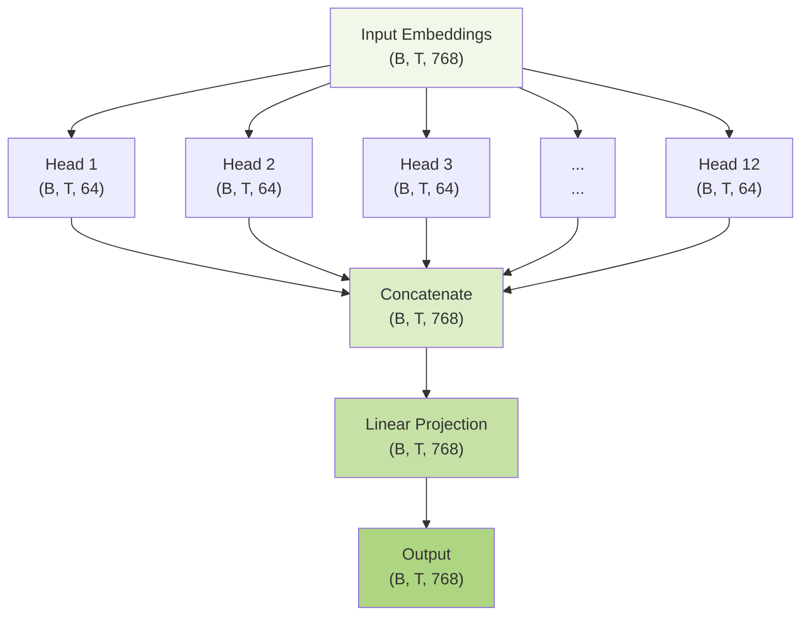

##### **3.3 Feed-Forward Network**

###### Architecture and Purpose

The feed-forward network provides position-wise processing that complements the attention mechanism. While attention
models relationships between positions, the FFN processes each position independently with non-linear transformations.

The standard transformer FFN follows the pattern:

$$
\text{FFN}(x) = \max(0, xW_1 + b_1)W_2 + b_2
$$

However, modern implementations use GELU activation:

$$
\text{FFN}(x) = \text{GELU}(xW_1 + b_1)W_2 + b_2
$$

###### GELU Activation Function

GELU (Gaussian Error Linear Unit) is defined as:

$$
\text{GELU}(x) = x \cdot \Phi(x)
$$

Where $\Phi(x)$ is the cumulative distribution function of the standard normal distribution. The practical approximation
is:

$$
\text{GELU}(x) \approx 0.5x\left(1 + \tanh\left(\sqrt{\frac{2}{\pi}}(x + 0.044715x^3)\right)\right)
$$

**Properties of GELU:**

- Smooth and differentiable everywhere
- Non-monotonic with a slight negative region
- Probabilistic interpretation based on stochastic regularization
- Better gradient flow compared to ReLU variants

###### Implementation

```python
class FeedForward(nn.Module):
  """
  Position-wise feed-forward network used in transformer blocks.

  This module implements a two-layer fully connected network with GELU activation
  that processes each position in the sequence independently. It expands the
  embedding dimension by a factor of 4, applies non-linear activation, then
  projects back to the original dimension.

  The architecture follows the standard transformer design:
  embedding_dim → 4×embedding_dim → embedding_dim

  Args:
      config (dict): Configuration dictionary containing:
          - embedding_dim (int): The input/output dimension size
          - dropout_rate (float): Dropout probability for regularization
  """

  def __init__(self, config):
    super().__init__()

    self.linear_layers = nn.Sequential(
        nn.Linear(config["embedding_dim"], config["embedding_dim"] * 4),
        nn.GELU(),
        nn.Linear(config["embedding_dim"] * 4, config["embedding_dim"]),
        nn.Dropout(config["dropout_rate"])
    )

  def forward(self, input):
    return self.linear_layers(input)
```

###### Expansion Factor Analysis

The 4× expansion provides computational capacity while maintaining efficiency:

**Parameter count for embedding_dim = 768:**

- Layer 1: $768 \times 3072 = 2,359,296$ parameters
- Layer 2: $3072 \times 768 = 2,359,296$ parameters
- Total: $4,718,592$ parameters per FFN block

This represents the majority of parameters in each transformer layer.

##### **3.4 Complete Transformer Block**

###### Pre-LayerNorm Architecture

The `Block` class implements a complete transformer layer using Pre-LayerNorm architecture, where normalization occurs
before each sub-module:

```python
import torch.nn as nn

class Block(nn.Module):
    """
    A single Transformer block, which is a fundamental building block of a Transformer model.

    This module encapsulates two main sub-layers:
    1. A Multi-Head Self-Attention mechanism.
    2. A position-wise Feed-Forward Network.

    Each sub-layer is followed by a residual connection and layer normalization,
    a technique often referred to as "Pre-LN" (pre-layer normalization). This
    structure helps stabilize training and allows for deeper models.

    The data flow is as follows:
    input -> LayerNorm -> MultiHeadAttention -> Add -> LayerNorm -> FeedForward -> Add -> output
    """

    def __init__(self, config):
        """
        Initializes the Transformer Block.

        Args:
            config (dict): A configuration dictionary containing parameters for
                the sub-modules, such as "embedding_dim", "heads_num", etc.
        """
        super().__init__()

        # The first sub-layer: Multi-Head Attention.
        self.multi_head = MultiHeadAttention(config)
        # Layer normalization applied *before* the attention mechanism.
        self.layer_norm_1 = nn.LayerNorm(config["embedding_dim"])

        # The second sub-layer: a simple Feed-Forward Network.
        self.feed_forward = FeedForward(config)
        # Layer normalization applied *before* the feed-forward network.
        self.layer_norm_2 = nn.LayerNorm(config["embedding_dim"])

    def forward(self, input_tensor):
        """
        Performs the forward pass through the Transformer block.

        Args:
            input_tensor (torch.Tensor): The input tensor of shape (B, T, E),
                where B is batch size, T is sequence length, and E is embedding dim.

        Returns:
            torch.Tensor: The output tensor with the same shape as the input.
        """
        # --- First Sub-layer: Multi-Head Attention with Add & Norm ---

        # Store the original input for the first residual connection.
        residual = input_tensor

        # Apply layer normalization, then the multi-head attention.
        x = self.multi_head(self.layer_norm_1(input_tensor))

        # Add the residual connection. This allows the model to bypass the
        # sub-layer if needed, aiding gradient flow.
        x = x + residual

        # --- Second Sub-layer: Feed-Forward Network with Add & Norm ---

        # Store the output of the first sub-layer for the second residual connection.
        residual = x

        # Apply layer normalization, then the feed-forward network.
        x = self.feed_forward(self.layer_norm_2(x))

        # Add the second residual connection.
        return x + residual
```

###### Data Flow Diagram

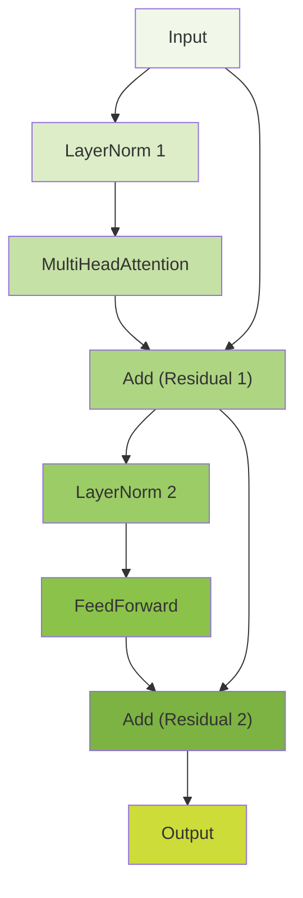

###### Layer Normalization Mathematics

LayerNorm normalizes across the embedding dimension for each token:

$$
\text{LayerNorm}(x) = \frac{x - \mu}{\sigma} \cdot \gamma + \beta
$$

Where:

- $\mu = \frac{1}{d} \sum_{i=1}^{d} x_i$ (mean across embedding dimension)
- $\sigma^2 = \frac{1}{d} \sum_{i=1}^{d} (x_i - \mu)^2$ (variance across embedding dimension)
- $\gamma, \beta \in \mathbb{R}^d$ are learnable scale and shift parameters

###### Residual Connections

The residual connections enable gradient flow and allow the model to learn identity mappings when needed:

$$
\begin{align}
\text{output}_1 &= x + \text{MultiHeadAttention}(\text{LayerNorm}(x)) \\
\text{output}_2 &= \text{output}_1 + \text{FeedForward}(\text{LayerNorm}(\text{output}_1))
\end{align}
$$

This design allows each sub-layer to learn refinements to the representation rather than reconstructing it entirely.

##### **4. Complete GPT Model Architecture**

###### Full Model Implementation

The `DemoGPT` class integrates all components into a complete transformer language model:

```python
import torch
import torch.nn as nn

class DemoGPT(nn.Module):
  """
  A complete, simplified implementation of a GPT-style transformer model.

  This class brings together all the necessary components:
  1. Token and Positional Embeddings to create the initial input representation.
  2. A stack of Transformer `Block`s to perform the core processing.
  3. A final Layer Normalization and a linear layer (unembedding) to project
     the output back into the vocabulary space to get logits for the next token.

  The model is designed for auto-regressive language generation, predicting the
  next token in a sequence given the previous ones.
  """
  def __init__(self, config):
    """
    Initializes the DemoGPT model architecture.

    Args:
        config (dict): A configuration dictionary containing model hyperparameters:
            - "vocabulary_size" (int): The number of unique tokens in the tokenizer.
            - "embedding_dim" (int): The dimensionality of the token and positional embeddings.
            - "context_size" (int): The maximum sequence length the model can handle.
            - "layers_num" (int): The number of Transformer `Block`s to stack.
            - Other keys required by the `Block` class.
    """
    super().__init__()

    # Token embedding layer: maps each token ID to a dense vector.
    self.token_embedding_layer = nn.Embedding(config["vocabulary_size"], config["embedding_dim"])
    # Positional embedding layer: maps each position index (0 to context_size-1) to a vector.
    self.positional_embedding_layer = nn.Embedding(config["context_size"], config["embedding_dim"])

    # Create a stack of Transformer Blocks.
    # `nn.Sequential` chains the blocks together, so the output of one is the input to the next.
    blocks = [Block(config) for _ in range(config["layers_num"])]
    self.layers = nn.Sequential(*blocks)

    # A final layer normalization applied after the transformer blocks.
    self.layer_norm = nn.LayerNorm(config["embedding_dim"])
    # The final linear layer (unembedding) that projects the model's output
    # back to the vocabulary size to get the logits for each token.
    self.unembedding = nn.Linear(config["embedding_dim"], config["vocabulary_size"], bias=False)

  def forward(self, token_ids):
    """
    Performs the forward pass of the DemoGPT model.

    Args:
        token_ids (torch.Tensor): A tensor of shape (B, T) containing the
            input token IDs, where B is batch size and T is sequence length.

    Returns:
        torch.Tensor: The output logits tensor of shape (B, T, V), where V is
            the vocabulary size.
    """
    batch_size, tokens_num = token_ids.shape

    # 1. Get token embeddings for the input IDs. Shape: (B, T, E)
    token_embeddings = self.token_embedding_layer(token_ids)

    # 2. Get positional embeddings for each position in the sequence.
    # `torch.arange` creates a sequence of position indices [0, 1, ..., T-1].
    sequence = torch.arange(tokens_num, device=token_ids.device)
    positional_embeddings = self.positional_embedding_layer(sequence) # Shape: (T, E)

    # 3. Add token and positional embeddings. Broadcasting adds the positional
    # embeddings to each sequence in the batch. Shape: (B, T, E)
    x = token_embeddings + positional_embeddings

    # 4. Pass the combined embeddings through the stack of Transformer blocks.
    x = self.layers(x)

    # 5. Apply the final layer normalization.
    x = self.layer_norm(x)

    # 6. Project the final hidden states to logits over the vocabulary.
    logits = self.unembedding(x) # Shape: (B, T, V)

    return logits
```

###### Model Architecture Diagram

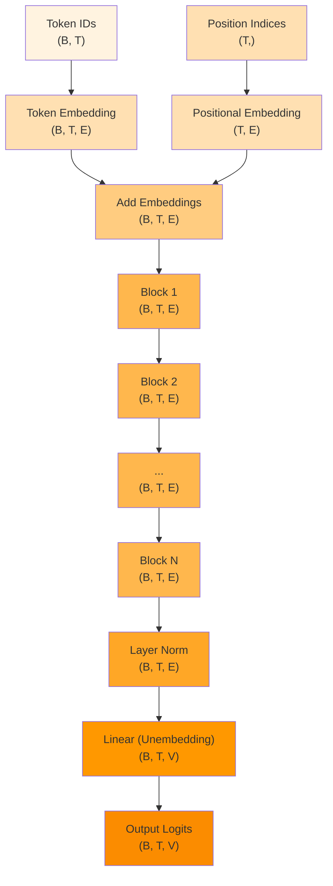

###### Dimensional Flow Analysis

For our configuration example:

- Vocabulary size: $V = 65$ (characters in Shakespeare text)
- Context size: $T = 256$
- Embedding dimension: $E = 768$
- Number of layers: $N = 10$

**Forward pass dimensions:**

1. **Input**: $(B, T) = (32, 256)$ token IDs
2. **Token embeddings**: $(32, 256, 768)$
3. **Position embeddings**: $(256, 768)$ → broadcast to $(32, 256, 768)$
4. **Combined embeddings**: $(32, 256, 768)$
5. **After each Block**: $(32, 256, 768)$ (unchanged)
6. **After final LayerNorm**: $(32, 256, 768)$
7. **Output logits**: $(32, 256, 65)$

###### Embedding Addition Mathematics

The input representation combines semantic and positional information:

$$
\mathbf{x}_i = \mathbf{E}_{\text{token}}[\text{token\_id}_i] + \mathbf{E}_{\text{pos}}[i]
$$

Where:

- $\mathbf{E}_{\text{token}} \in \mathbb{R}^{V \times E}$ is the token embedding matrix
- $\mathbf{E}_{\text{pos}} \in \mathbb{R}^{T \times E}$ is the positional embedding matrix
- $i$ is the position index

##### **5. Text Generation with Autoregressive Sampling**

###### Generation Algorithm

The `generate` function implements autoregressive text generation by iteratively predicting and sampling the next token:

```python
import torch
import torch.nn.functional as F

def generate(model, prompt_ids, max_tokens_to_generate, config):
    """
    Generates a sequence of tokens auto-regressively from a given prompt.

    This function takes a trained model and a starting sequence of token IDs
    (the prompt) and generates new tokens one by one. In each step, it uses
    the model to predict the next token, samples from the resulting probability
    distribution, and appends the new token to the sequence, which then becomes
    the input for the next step.

    Args:
        model (nn.Module): The trained DemoGPT transformer model.
        prompt_ids (torch.Tensor): A tensor of shape (B, T) containing the
            initial token IDs to start generation from. B is the batch size
            (usually 1 for generation) and T is the length of the prompt.
        max_tokens_to_generate (int): The maximum number of new tokens to generate after the prompt.
        config (dict): The model's configuration dictionary, used to access
            the `context_size`.

    Returns:
        torch.Tensor: A tensor of shape (B, T + generated_tokens) containing
            the original prompt plus the newly generated tokens.
    """
    # Start with the initial prompt.
    output_ids = prompt_ids

    # Loop to generate tokens one by one.
    for _ in range(max_tokens_to_generate):
      # Stop if the context window is full.
      if output_ids.shape[1] >= config["context_size"]:
        break

      # Use torch.no_grad() to disable gradient calculations, as we are only
      # doing inference, which saves memory and computation.
      with torch.no_grad():
        # Get the model's predictions (logits) for the current sequence.
        logits = model(output_ids)

      # Focus only on the logits for the very last token in the sequence,
      # as that's the prediction for the *next* token.
      last_token_logits = logits[:, -1, :]

      # Apply softmax to convert the logits into a probability distribution.
      probs = F.softmax(last_token_logits, dim=-1)

      # Sample one token from the probability distribution.
      # `torch.multinomial` treats the input as a set of weights for sampling.
      next_token_id = torch.multinomial(probs, num_samples=1)

      # Append the newly sampled token ID to our sequence.
      output_ids = torch.cat([output_ids, next_token_id], dim=1)

    return output_ids
```

###### Convenience Wrapper Function

```python
def generate_with_prompt(model, tokenizer, config, prompt, max_tokens_to_generate=100):
  """
  Generates text from a prompt using the specified model and tokenizer.

  This function sets the model to evaluation mode, encodes the prompt, calls
  the `generate` function to produce token IDs, and decodes them back into
  human-readable text.

  Args:
      model (nn.Module): The trained transformer model.
      tokenizer (CharTokenizer): The tokenizer for encoding/decoding text.
      config (dict): The model's configuration dictionary.
      prompt (str): The initial text to start generation from.
      max_tokens_to_generate (int): The maximum number of new tokens to create.

  Returns:
      str: The generated text, including the original prompt.
  """
  model.eval()

  prompt_ids = tokenizer.encode(prompt).unsqueeze(dim=0).to(device)

  # Call the generate function with the correct arguments
  generated_ids = generate(
      model,
      prompt_ids,
      max_tokens_to_generate=max_tokens_to_generate,
      config=config
  )

  return tokenizer.decode(generated_ids[0])
```

###### Sampling vs. Greedy Decoding

**Multinomial Sampling (Used in Implementation):**

$$
P(\text{next\_token} = k) = \frac{\exp(\text{logit}_k)}{\sum_{j=1}^{V} \exp(\text{logit}_j)}
$$

The token is sampled according to this probability distribution, introducing controlled randomness.

**Greedy Decoding (Alternative):**

$$
\text{next\_token} = \arg\max_{k} \text{logit}_k
$$

Always selects the highest probability token, producing deterministic but potentially repetitive output.

###### Generation Process Flowchart

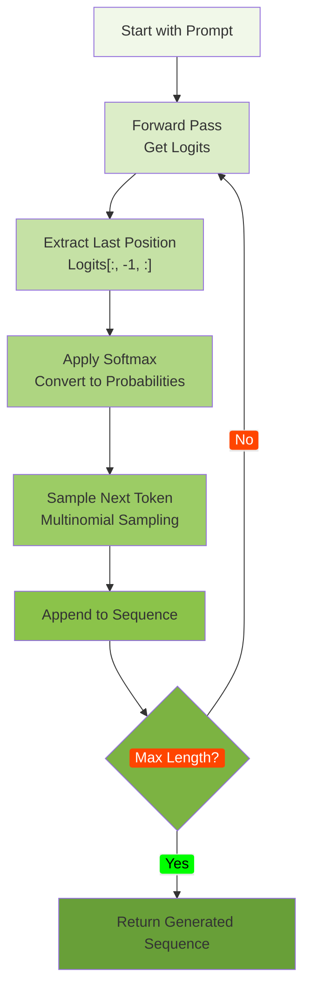

##### **6. Training Pipeline and Loss Computation**

###### Training Data Preparation

```python
# Create training dataset
train_data = tokenizer.encode(text).to(device)
train_dataset = TokenIdsDataset(train_data, config["context_size"])
```

###### DataLoader Configuration

```python
from torch.utils.data import Dataset, DataLoader, RandomSampler

# Training configuration
batch_size = 64
train_iterations = 5000
evaluation_interval = 100
learning_rate = 4e-4

# Create samplers for randomized batch selection
train_sampler = RandomSampler(train_dataset, num_samples=batch_size * train_iterations, replacement=True)
train_dataloader = DataLoader(train_dataset, batch_size=batch_size, sampler=train_sampler)
```

###### Loss Function Mathematics

The model is trained using cross-entropy loss between predicted and target tokens:

$$
\mathcal{L} = -\frac{1}{BT} \sum_{b=1}^{B} \sum_{t=1}^{T} \log P(\text{target}_{b,t} | \text{input}_{b,1:t})
$$

Where:

- $B$ is batch size
- $T$ is sequence length
- $P(\text{target}_{b,t} | \text{input}_{b,1:t})$ is the predicted probability of the target token

###### Tensor Reshaping for Loss Computation

The model outputs logits of shape $(B, T, V)$ and targets of shape $(B, T)$. For loss computation, these are reshaped:

```python
# Reshape for loss computation
logits_view = logits.view(batch_size * context_size, vocabulary_size)  # (B*T, V)
targets_view = targets.view(batch_size * context_size)                 # (B*T,)

# Compute cross-entropy loss
loss = F.cross_entropy(logits_view, targets_view)
```

The `-1` in `.view(-1, vocab_size)` automatically calculates the first dimension:

$$
\text{first\_dim} = \frac{\text{total\_elements}}{\text{vocab\_size}} = \frac{B \times T \times V}{V} = B \times T
$$

###### Validation Loss Function

```python
@torch.no_grad()
def calculate_validation_loss(model, batches_num):
  model.eval()
  total_loss = 0

  validation_iter = iter(validation_dataloader)

  for _ in range(batches_num):
    input, targets = next(validation_iter)
    logits = model(input)

    logits_view = logits.view(batch_size * config["context_size"], config["vocabulary_size"])
    targets_view = targets.view(batch_size * config["context_size"])

    loss = F.cross_entropy(logits_view, targets_view)
    total_loss += loss.item()

  average_loss = total_loss / batches_num
  return average_loss
```

###### Training Loop Implementation

```python
optimizer = torch.optim.AdamW(model.parameters(), lr=learning_rate)

# Training loop with loss tracking
train_losses = []
train_steps = []
eval_losses = []
eval_steps = []

for step_num, sample in enumerate(train_dataloader):
    model.train()
    input, targets = sample
    logits = model(input)

    # Reshape tensors for loss computation
    logits_view = logits.view(batch_size * config["context_size"], config["vocabulary_size"])
    targets_view = targets.view(batch_size * config["context_size"])

    # Compute loss
    loss = F.cross_entropy(logits_view, targets_view)

    # Backward pass
    loss.backward()

    # Update parameters
    optimizer.step()
    optimizer.zero_grad(set_to_none=True)

    # Track training loss
    train_losses.append(loss.item())
    train_steps.append(step_num)

    # Periodic evaluation
    if step_num % evaluation_interval == 0:
        validation_loss = calculate_validation_loss(model, batches_num=10)
        eval_losses.append(validation_loss)
        eval_steps.append(step_num)

        print(f"Step {step_num}. Training Loss: {loss.item():.3f}, Validation Loss: {validation_loss:.3f}")

        # Generate sample text
        sample_text = generate_with_prompt(model, tokenizer, config, "First Citizen:\n", max_tokens_to_generate=100)
        print(f"Generated: {sample_text}")
```

###### Training Dynamics

The learning process follows these stages:

1. **Initialization**: Random weights produce near-uniform token distributions
2. **Early training**: Model learns basic character frequencies and short patterns
3. **Intermediate training**: Longer dependencies and basic grammar emerge
4. **Advanced training**: Coherent text generation with complex patterns

The loss typically decreases from around $\log(V) \approx \log(65) \approx 4.17$ (random baseline) to much lower values
as the model learns meaningful patterns.

###### 7. Architecture Summary and Key Insights

###### Complete Model Pipeline

The transformer architecture creates a sophisticated pipeline for language modeling:

```mermaid
graph LR
    A["Raw Text"] --> B["Tokenization"]
    B --> C["Dataset Creation"]
    C --> D["Embedding Layers"]
    D --> E["Transformer Blocks"]
    E --> F["Output Projection"]
    F --> G["Next Token Prediction"]
    G --> H["Text Generation"]

    style A fill:#F1F8E9
    style B fill:#DCEDC8
    style C fill:#C5E1A5
    style D fill:#AED581
    style E fill:#9CCC65
    style F fill:#8BC34A
    style G fill:#7CB342
    style H fill:#689F38
```

###### Key Mathematical Components

**1. Attention Mechanism:**

$$
\text{Attention}(Q, K, V) = \text{softmax}\left(\frac{QK^T + M}{\sqrt{d_k}}\right)V
$$

**2. Multi-Head Processing:**

$$
\text{MultiHead}(Q, K, V) = \text{Concat}(\text{head}_1, \ldots, \text{head}_h)W^O
$$

**3. Feed-Forward Network:**

$$
\text{FFN}(x) = \text{GELU}(xW_1)W_2
$$

**4. Layer Normalization:**

$$
\text{LayerNorm}(x) = \frac{x - \mu}{\sigma} \cdot \gamma + \beta
$$

**5. Residual Connections:**

$$
y = x + \text{SubLayer}(x)
$$

###### Parameter Scaling

For the demo configuration:

- **Embedding parameters**: $(V + T) \times E = (65 + 256) \times 768 = 246,528$
- **Attention parameters per layer**: $3 \times E \times E + E \times E = 4 \times 768^2 = 2,359,296$
- **FFN parameters per layer**: $E \times 4E + 4E \times E = 8 \times 768^2 = 4,718,592$
- **Total per layer**: $\approx 7.1M$ parameters
- **Total model**: $\approx 71M$ parameters for 10 layers

###### Critical Design Decisions

**1. Causal Masking**: Enables autoregressive generation while maintaining parallelizable training

**2. Pre-LayerNorm**: Improves training stability compared to Post-LayerNorm

**3. Character-level Tokenization**: Simplifies vocabulary management but increases sequence length

**4. Learned Positional Embeddings**: More flexible than sinusoidal encodings for shorter sequences

**5. GELU Activation**: Provides smoother gradients compared to ReLU variants

The transformer architecture's success stems from its ability to process sequences in parallel during training while
maintaining the autoregressive property necessary for coherent text generation. The attention mechanism allows for
flexible, learned relationships between tokens, while the residual connections and normalization ensure stable training
of deep networks.

This implementation demonstrates the core principles underlying modern large language models, scaled down to a
manageable size for educational purposes while preserving all essential architectural components.

---
