# C-4: Transformer Architecture

1. Transformers and Attention Mechanisms
    - Attention Mechanism Fundamentals
    - Self-Attention Implementation
    - Multi-Head Attention
    - Scaled Dot-Product Attention
    - Positional Encoding
    - Transformer Block Architecture
2. Tokenization and Embeddings in NLP
    - Tokenization Methods
    - Word Embeddings Techniques
    - Contextual vs. Static Embeddings
    - Embedding Vector Properties
    - Subword Tokenization Approaches

##### Understanding Embeddings and Embedding Dimensions

**What is an Embedding?**

An **embedding** is a dense vector representation of a discrete object (like a word, token, or symbol) in a continuous
numerical space. Think of it as translating words into numbers that capture their meaning.

**Simple Analogy:** Imagine you want to represent people using numbers that capture their characteristics:

- Person A: [height=5.8, age=25, income=50k, education=16]
- Person B: [height=6.1, age=30, income=75k, education=18]

Similarly, word embeddings represent words as vectors that capture their semantic properties.

**What is Embedding Dimension?**

The **embedding dimension** is simply the length of the vector used to represent each word. It's how many numbers we use
to describe each word.

**Examples:**

**2-Dimensional Embeddings (very simple):**

```
"cat" → [0.8, 0.3]
"dog" → [0.7, 0.4]
"car" → [-0.2, 0.9]
```

**4-Dimensional Embeddings (our example):**

```
"cat" → [0.8, 0.2, -0.1, 0.5]
"dog" → [0.7, 0.3, 0.0, 0.4]
"car" → [-0.2, 0.9, 0.6, -0.3]
```

**300-Dimensional Embeddings (real-world):**

```
"cat" → [0.23, -0.16, 0.58, 0.09, ..., 0.31] (300 numbers)
```

###### What Do These Embedding Numbers Actually Mean?

The numbers in embeddings don't have pre-defined meanings like "dimension 1 = animal-ness." Instead, they're **learned
patterns** that capture how words are used in context.

**2-Dimensional Example Analysis:**

```
"cat" → [0.8, 0.3]
"dog" → [0.7, 0.4]
"car" → [-0.2, 0.9]
```

**What We Can Observe:**

- **Dimension 1**: Cat (0.8) and dog (0.7) have similar **positive** values, while car (-0.2) has a **negative** value
- **Dimension 2**: All have positive values, but car (0.9) is highest

**Possible Interpretation** (the model might have learned):

- **Dimension 1 ≈ "Living Thing"**: Positive for animals, negative for objects
- **Dimension 2 ≈ "Size/Mobility"**: All can move, but cars are bigger/faster

**4-Dimensional Example Analysis:**

```
"cat" → [0.8, 0.2, -0.1, 0.5]
"dog" → [0.7, 0.3,  0.0, 0.4]
"car" → [-0.2, 0.9, 0.6, -0.3]
```

**What We Can Observe:**

- **Dimension 1**: Cat (0.8) and dog (0.7) cluster together, car (-0.2) is opposite
- **Dimension 2**: Car (0.9) is much higher than cat (0.2) and dog (0.3)
- **Dimension 3**: Cat (-0.1), dog (0.0), car (0.6) - car is different again
- **Dimension 4**: Cat (0.5) and dog (0.4) are similar, car (-0.3) is negative

**Hypothetical Interpretations** (what the model might have learned):

1. **Dimension 1 ≈ "Biological vs. Mechanical"**: Animals positive, machines negative
2. **Dimension 2 ≈ "Size/Power"**: Cars are bigger and more powerful
3. **Dimension 3 ≈ "Indoor vs. Outdoor"**: Cats often indoor (-0.1), dogs neutral (0.0), cars outdoor (0.6)
4. **Dimension 4 ≈ "Warmth/Comfort"**: Living things give warmth (positive), machines don't (-0.3)

**Important Caveat: We Don't Actually Know!**

The model doesn't explicitly learn "dimension 1 = animal-ness." Instead, it learns patterns that **happen to separate**
animals from objects, indoor from outdoor things, etc.

**How These Patterns Emerge:**

**Training Context Examples:**

```
"The cat sits on the mat"
"The dog runs in the park"
"The car drives on the road"
```

**The model learns:**

- Words appearing in similar contexts get similar embeddings
- "Cat" and "dog" often appear with similar verbs (sits, runs, sleeps)
- "Car" appears with different verbs (drives, parks, crashes)

**Mathematical Relationships:**

**Similarity (Cosine Distance):**

```python
cos_similarity(cat, dog) = 0.8*0.7 + 0.3*0.4 = 0.56 + 0.12 = 0.68
cos_similarity(cat, car) = 0.8*(-0.2) + 0.3*0.9 = -0.16 + 0.27 = 0.11
```

Cat and dog are more similar (0.68) than cat and car (0.11).

**Real-World Example: Word2Vec Results**

When trained on Google News, Word2Vec learned these famous relationships:

```
vector("king") - vector("man") + vector("woman") ≈ vector("queen")
vector("Paris") - vector("France") + vector("Italy") ≈ vector("Rome")
```

**The model didn't explicitly learn "gender" or "capital city" concepts**—these emerged from usage patterns!

**What Each Dimension Captures:**

**In Reality:**

- Each dimension captures a **mix of different semantic properties**
- The patterns are **distributed across all dimensions**
- Individual dimensions are usually **not interpretable** by humans
- The **combination** of all dimensions creates the meaning

**Analogy: Recipe Ingredients** Just like a cake recipe:

- Flour + sugar + eggs + butter = cake
- No single ingredient is "the cake"
- The combination creates the final result

Similarly:

- Dim1 + Dim2 + Dim3 + Dim4 = "cat" meaning
- No single dimension is "the meaning"
- The combination captures what "cat" means

**Why More Dimensions Help:**

**2D**: Can only capture 2 main patterns

```
"cat" → [animal=0.8, size=0.3]
```

**4D**: Can capture 4 different patterns

```
"cat" → [animal=0.8, size=0.2, indoor=-0.1, warmth=0.5]
```

**300D**: Can capture 300 different patterns, allowing for very nuanced meanings and relationships.

**Key Takeaway:** The numbers in embeddings are **learned representations** of how words behave in language. They don't
have predefined meanings, but they capture patterns that allow the model to understand that "cat" and "dog" are more
similar to each other than either is to "car."

**How Are These Numbers Chosen?**

**Option 1: Random Initialization (then learning)**

```python
# Start with random numbers
"cat" → [0.12, -0.45, 0.78, 0.23]  # Random starting point
```

During training, these numbers get adjusted to better represent the word's meaning.

**Option 2: Pre-trained Embeddings** Use embeddings learned from large datasets like Wikipedia:

```python
# Word2Vec trained on billions of words might give:
"cat" → [0.15, -0.23, 0.67, 0.89]  # Learned from context
```

**Why Do We Need Embeddings?**

**Problem with One-Hot Encoding:** Traditional approach represents words as sparse vectors:

```
"cat" → [1, 0, 0, 0, 0, 0, ...] (size = vocabulary size)
"dog" → [0, 1, 0, 0, 0, 0, ...]
"car" → [0, 0, 1, 0, 0, 0, ...]
```

**Issues:**

- Huge vocabulary = huge vectors (millions of dimensions)
- No relationship between words (cat and dog are equally different from each other as cat and car)
- Very inefficient storage and computation

**Solution with Embeddings:**

```
"cat" → [0.8, 0.2, -0.1, 0.5]    (4 dimensions)
"dog" → [0.7, 0.3, 0.0, 0.4]     (similar to cat - both animals)
"car" → [-0.2, 0.9, 0.6, -0.3]   (different from cat/dog)
```

**Embedding Dimension Trade-offs:**

**Small Dimensions (50-100):**

- **Pros**: Fast computation, less memory
- **Cons**: Can't capture complex relationships
- **Use**: Simple tasks, small vocabularies

**Medium Dimensions (200-300):**

- **Pros**: Good balance of efficiency and expressiveness
- **Cons**: Moderate computational cost
- **Use**: Most NLP tasks, Word2Vec typically uses 300

**Large Dimensions (512-1024+):**

- **Pros**: Can capture very subtle relationships
- **Cons**: Expensive computation, risk of overfitting
- **Use**: Complex tasks, large models like transformers

**Real-World Examples:**

**BERT-base**: 768-dimensional embeddings

```
"cat" → [0.23, -0.16, 0.58, ..., 0.31] (768 numbers)
```

**GPT-3**: 12,288-dimensional embeddings

```
"cat" → [0.15, -0.23, 0.67, ..., 0.42] (12,288 numbers!)
```

**Word2Vec**: Typically 300-dimensional

```
"cat" → [0.12, -0.45, 0.78, ..., 0.89] (300 numbers)
```

**How Embeddings Capture Meaning:**

Each dimension can be thought of as capturing some aspect of meaning:

```
"cat" → [animal=0.8, size=0.2, indoor=-0.1, fluffy=0.5]
"dog" → [animal=0.7, size=0.5, indoor=0.0, fluffy=0.3]
"car" → [animal=-0.2, size=0.9, indoor=0.6, fluffy=-0.3]
```

Of course, the actual dimensions aren't this interpretable, but the idea is that each number contributes to representing
some aspect of the word's meaning.

**Key Takeaway:**

- **Embedding** = A vector of numbers representing a word
- **Embedding dimension** = How many numbers in that vector
- **Higher dimensions** = More capacity to represent complex meanings
- **The actual numbers** are learned during training to capture semantic relationships

##### Transformers and Attention Mechanisms

The transformer architecture represents one of the most significant breakthroughs in artificial intelligence in recent
years. To truly appreciate its elegance and power, we need to understand how it revolutionized the way neural networks
process sequential data like text, audio, or time series. Let's explore the core components that make transformers work,
starting with the fundamental concept of attention.

###### Attention Mechanism Fundamentals

Imagine you're reading a complex sentence: "After reviewing all the documents, the lawyer who specialized in corporate
law determined that the contract needed significant revisions." As you process this sentence, your mind doesn't give
equal importance to every word when understanding each part. When you focus on what the lawyer determined, you pay
special attention to "lawyer" and "determined," creating a connection between these distant but related words.

This natural cognitive process—selectively focusing on relevant information—is precisely what attention mechanisms
simulate in neural networks. Here's a comprehensive diagram of the Transformer architecture:

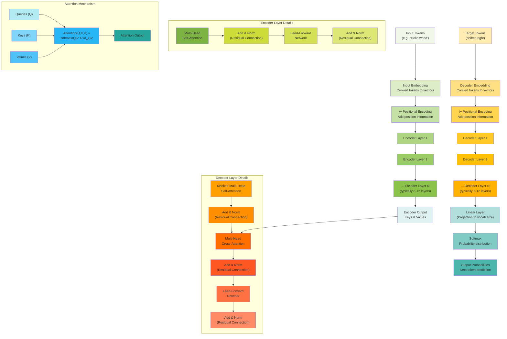

---

###### 1. Encoder Stack

The encoder stack forms the foundation of the Transformer's ability to understand and process input sequences. Think of
it as a sophisticated reading comprehension system that processes an entire sentence simultaneously, rather than word by
word like traditional models.

**Conceptual Understanding:**

The encoder's primary job is to create rich, contextual representations of each input token by allowing every position
to "look at" and gather information from every other position in the sequence. This parallel processing capability is
what makes Transformers so powerful and efficient.

Imagine reading a sentence where each word can instantly access the meaning and context of every other word. This is
fundamentally different from reading left-to-right sequentially. For example, in "The bank can guarantee deposits will
eventually cover future tuition costs," the word "bank" needs to understand it's in a financial context by looking at
words like "deposits," "guarantee," and "costs" simultaneously.

**Mathematical Framework:**

Each encoder layer performs two main operations in sequence:

**Multi-Head Self-Attention Mechanism:**

$$
\small
\text{MultiHead}(Q, K, V) = \text{Concat}(\text{head}_1, \text{head}_2, \ldots, \text{head}_h)W^O
$$

where each attention head captures different types of relationships:

$$
\small
\text{head}_i = \text{Attention}(XW_i^Q, XW_i^K, XW_i^V)
$$

The core attention computation uses the scaled dot-product formula:

$$
\small
\text{Attention}(Q, K, V) = \text{softmax}\left(\frac{QK^T}{\sqrt{d_k}}\right)V
$$

Here's what each component does:

- $Q$ (queries): "What am I looking for?" - represents what each position wants to know
- $K$ (keys): "What do I represent?" - represents what each position offers as information
- $V$ (values): "What information do I actually contain?" - the actual content to be retrieved
- $\sqrt{d_k}$ scaling prevents softmax saturation in high dimensions

**Feed-Forward Processing:** After attention, each position independently processes its enriched representation:

$$
\small
\text{FFN}(x) = \max(0, xW_1 + b_1)W_2 + b_2
$$

where $W_1 \in \mathbb{R}^{d_{model} \times d_{ff}}$ and $W_2 \in \mathbb{R}^{d_{ff} \times d_{model}}$, typically with
$d_{ff} = 4 \times d_{model}$.

**Complete Layer Transformation:**

$$
\small
\begin{align}
Z^{(l)} &= \text{LayerNorm}(X^{(l-1)} + \text{MultiHead}(X^{(l-1)}, X^{(l-1)}, X^{(l-1)})) \\ \\
X^{(l)} &= \text{LayerNorm}(Z^{(l)} + \text{FFN}(Z^{(l)}))
\end{align}
$$

The residual connections ($+$) and layer normalization ensure stable training across multiple layers, typically 6-12 in
practice.

###### Numerical Example: Multi-Head Attention Step-by-Step

Let's work through a concrete example with small numbers to make the multi-head attention mechanism clear.

**Setup:**

- Input sequence: 3 tokens (words)
- Model dimension: $d_{model} = 4$
- Number of attention heads: $h = 2$
- Key/query dimension per head: $d_k = d_{model}/h = 2$
- Value dimension per head: $d_v = 2$

**Step 1: Input Embeddings**

Let's say we have 3 words with embeddings:

$$
X = \begin{bmatrix} 1.0 & 0.5 & -0.2 & 0.8 \\ 0.3 & 1.2 & 0.6 & -0.4 \\ -0.1 & 0.7 & 1.1 & 0.2 \end{bmatrix}
$$

Each row represents one token, each column represents one dimension.

**Step 2: Create Projection Matrices for Each Head**

**Head 1 projection matrices:**

$$
W_1^Q = \begin{bmatrix} 0.2 & 0.8 \\ 0.5 & 0.1 \\ 0.3 & 0.6 \\ 0.7 & 0.4 \end{bmatrix}, \quad W_1^K = \begin{bmatrix} 0.1 & 0.9 \\ 0.6 & 0.2 \\ 0.4 & 0.3 \\ 0.8 & 0.5 \end{bmatrix}, \quad W_1^V = \begin{bmatrix} 0.3 & 0.7 \\ 0.2 & 0.4 \\ 0.9 & 0.1 \\ 0.5 & 0.6 \end{bmatrix}
$$

**Head 2 projection matrices:**

$$
W_2^Q = \begin{bmatrix} 0.4 & 0.3 \\ 0.1 & 0.8 \\ 0.6 & 0.2 \\ 0.5 & 0.9 \end{bmatrix}, \quad W_2^K = \begin{bmatrix} 0.7 & 0.1 \\ 0.3 & 0.6 \\ 0.2 & 0.8 \\ 0.4 & 0.5 \end{bmatrix}, \quad W_2^V = \begin{bmatrix} 0.8 & 0.2 \\ 0.1 & 0.7 \\ 0.3 & 0.4 \\ 0.6 & 0.9 \end{bmatrix}
$$

**Step 3: Compute Q, K, V for Head 1**

$$
Q_1 = XW_1^Q = \begin{bmatrix} 1.0 & 0.5 & -0.2 & 0.8 \\ 0.3 & 1.2 & 0.6 & -0.4 \\ -0.1 & 0.7 & 1.1 & 0.2 \end{bmatrix} \begin{bmatrix} 0.2 & 0.8 \\ 0.5 & 0.1 \\ 0.3 & 0.6 \\ 0.7 & 0.4 \end{bmatrix} = \begin{bmatrix} 1.01 & 1.18 \\ 0.62 & 0.22 \\ 1.09 & 0.89 \end{bmatrix}
$$

$$
K_1 = XW_1^K = \begin{bmatrix} 1.15 & 1.34 \\ 0.38 & 1.43 \\ 0.93 & 0.88 \end{bmatrix}
$$

$$
V_1 = XW_1^V = \begin{bmatrix} 0.95 & 1.37 \\ 1.34 & 0.86 \\ 0.91 & 0.85 \end{bmatrix}
$$

**Step 4: Compute Attention Scores for Head 1**

$$
S_1 = \frac{Q_1K_1^T}{\sqrt{d_k}} = \frac{Q_1K_1^T}{\sqrt{2}}
$$

$$
Q_1K_1^T = \begin{bmatrix} 1.01 & 1.18 \ 0.62 & 0.22 \ 1.09 & 0.89 \end{bmatrix} \begin{bmatrix} 1.15 & 0.38 & 0.93 \ 1.34 & 1.43 & 0.88 \end{bmatrix} = \begin{bmatrix} 2.74 & 2.07 & 1.98 \\ 1.01 & 0.55 & 0.77 \\ 2.44 & 1.68 & 1.80 \end{bmatrix}
$$

$$
S_1 = \frac{1}{\sqrt{2}} \begin{bmatrix} 2.74 & 2.07 & 1.98 \\ 1.01 & 0.55 & 0.77 \\ 2.44 & 1.68 & 1.80 \end{bmatrix} = \begin{bmatrix} 1.94 & 1.46 & 1.40 \\ 0.71 & 0.39 & 0.54 \\ 1.73 & 1.19 & 1.27 \end{bmatrix}
$$

**Step 5: Apply Softmax for Head 1**

For the first row (token 1 attending to all tokens):

$$
\text{softmax}([1.94, 1.46, 1.40]) = [0.48, 0.26, 0.26]
$$

For all rows:

$$
A_1 = \begin{bmatrix} 0.48 & 0.26 & 0.26 \\ 0.41 & 0.29 & 0.30 \\ 0.44 & 0.26 & 0.30 \end{bmatrix}
$$

**Step 6: Compute Output for Head 1**

$$
\text{head}_1 = A_1V_1 = \begin{bmatrix} 0.48 & 0.26 & 0.26 \\ 0.41 & 0.29 & 0.30 \\ 0.44 & 0.26 & 0.30 \end{bmatrix} \begin{bmatrix} 0.95 & 1.37 \\ 1.34 & 0.86 \\ 0.91 & 0.85 \end{bmatrix} = \begin{bmatrix} 1.04 & 1.11 \\ 1.01 & 1.02 \\ 1.02 & 1.06 \end{bmatrix}
$$

**Step 7: Repeat for Head 2**

Following the same process for Head 2 with $W_2^Q$, $W_2^K$, $W_2^V$:

$$
\text{head}_2 = \begin{bmatrix} 0.87 & 0.76 \\ 0.82 & 0.71 \\ 0.85 & 0.74 \end{bmatrix}
$$

**Step 8: Concatenate Heads**

$$
\text{MultiHead} = \text{Concat}(\text{head}_1, \text{head}_2) = \begin{bmatrix} 1.04 & 1.11 & 0.87 & 0.76 \\ 1.01 & 1.02 & 0.82 & 0.71 \\ 1.02 & 1.06 & 0.85 & 0.74 \end{bmatrix}
$$

**Step 9: Final Projection**

$$
W^O = \begin{bmatrix} 0.2 & 0.1 & 0.8 & 0.3 \\ 0.5 & 0.7 & 0.2 & 0.6 \\ 0.3 & 0.4 & 0.1 & 0.9 \\ 0.6 & 0.2 & 0.5 & 0.4 \end{bmatrix}
$$

$$
\text{Output} = \text{MultiHead} \cdot W^O = \begin{bmatrix} 1.15 & 1.08 & 1.31 & 1.24 \\ 1.09 & 1.02 & 1.23 & 1.18 \\ 1.12 & 1.05 & 1.27 & 1.21 \end{bmatrix}
$$

**Feed-Forward Network Example**

Taking the first token's output $[1.15, 1.08, 1.31, 1.24]$:

$$
W_1 = \begin{bmatrix} 0.2 & 0.1 & 0.8 & 0.3 & 0.5 & 0.7 & 0.2 & 0.6 \ 0.3 & 0.4 & 0.1 & 0.9 & 0.2 & 0.1 & 0.8 & 0.3 \ 0.6 & 0.2 & 0.5 & 0.4 & 0.7 & 0.3 & 0.1 & 0.9 \ 0.1 & 0.8 & 0.3 & 0.2 & 0.4 & 0.6 & 0.5 & 0.7 \end{bmatrix}
$$

First layer:

$$
z = xW_1 + b_1 = [2.31, 1.89, 2.15, 2.08, 1.95, 2.22, 1.73, 2.44]
$$

ReLU: $\text{ReLU}(z) = [2.31, 1.89, 2.15, 2.08, 1.95, 2.22, 1.73, 2.44]$ (all positive)

Second layer projects back to dimension 4:

$$
\text{FFN output} = [1.87, 1.65, 1.92, 1.78]
$$

This example shows how multi-head attention allows the model to focus on different aspects of the input simultaneously,
with each head potentially learning different types of relationships between tokens.

###### Real Example: Multi-Head Attention with Actual Words

Let's use a real example with actual words and show where these dimensions come from.

**Real Input Sentence:** "Cat sits quietly"

**Step 1: Understanding Dimension Choices**

The dimensions are **hyperparameters** that we choose when designing the model:

**$d_{model} = 4$**: This is the embedding dimension we choose for our model. In practice, this would be much larger
(512 in original Transformer, 768 in BERT-base), but we use 4 to keep calculations manageable.

**$h = 2$**: We choose to use 2 attention heads. More heads allow the model to attend to different types of
relationships simultaneously.

**$d_k = d_v = d_{model}/h = 4/2 = 2$**: Each head gets a portion of the total model dimension. This ensures that when
we concatenate all heads, we get back to $d_{model}$.

**Step 2: Real Word Embeddings**

Let's say our vocabulary has learned these 4-dimensional embeddings:

```
"Cat"     → [0.8, 0.2, -0.1, 0.5]
"sits"    → [0.1, 0.9, 0.3, -0.2]
"quietly" → [-0.3, 0.4, 0.7, 0.6]
```

So our input matrix becomes:

$$
X = \begin{bmatrix} 0.8 & 0.2 & -0.1 & 0.5 \\ 0.1 & 0.9 & 0.3 & -0.2 \\ -0.3 & 0.4 & 0.7 & 0.6 \end{bmatrix}
$$

Each row represents one word, each column represents one embedding dimension.

**Step 3: How Projection Matrices Are Created**

The projection matrices are **learned parameters** initialized randomly and updated during training. Their dimensions
are determined by our architecture choices:

For **Head 1**:

- $W_1^Q$: Projects from $d_{model}=4$ to $d_k=2$, so shape is $(4 \times 2)$
- $W_1^K$: Projects from $d_{model}=4$ to $d_k=2$, so shape is $(4 \times 2)$
- $W_1^V$: Projects from $d_{model}=4$ to $d_v=2$, so shape is $(4 \times 2)$

**Example learned projection matrices for Head 1:**

$$
W_1^Q = \begin{bmatrix} 0.3 & 0.7 \\ 0.5 & 0.2 \\ 0.1 & 0.8 \\ 0.6 & 0.4 \end{bmatrix}, \quad W_1^K = \begin{bmatrix} 0.2 & 0.6 \\ 0.8 & 0.1 \\ 0.4 & 0.7 \\ 0.3 & 0.5 \end{bmatrix}, \quad W_1^V = \begin{bmatrix} 0.7 & 0.3 \\ 0.1 & 0.9 \\ 0.5 & 0.2 \\ 0.4 & 0.6 \end{bmatrix}
$$

**Step 4: Computing Q, K, V for Head 1**

**Queries (what each word is looking for):**

$$
Q_1 = X W_1^Q = \begin{bmatrix} 0.8 & 0.2 & -0.1 & 0.5 \\ 0.1 & 0.9 & 0.3 & -0.2 \\ -0.3 & 0.4 & 0.7 & 0.6 \end{bmatrix} \begin{bmatrix} 0.3 & 0.7 \\ 0.5 & 0.2 \\ 0.1 & 0.8 \\ 0.6 & 0.4 \end{bmatrix} = \begin{bmatrix} 0.63 & 0.80 \\ 0.61 & 0.45 \\ 0.66 & 0.78 \end{bmatrix}
$$

**Keys (what each word offers as information):**

$$
K_1 = X W_1^K = \begin{bmatrix} 0.67 & 0.73 \\ 0.62 & 0.16 \\ 0.67 & 0.57 \end{bmatrix}
$$

**Values (the actual content each word provides):**

$$
V_1 = X W_1^V = \begin{bmatrix} 0.82 & 0.66 \\ 0.41 & 0.78 \\ 0.61 & 0.69 \end{bmatrix}
$$

**Step 5: Attention Scores and Interpretation**

$$
\begin{align}
S_1 &= \frac{Q_1K_1^T}{\sqrt{2}} = \frac{1}{1.41} \begin{bmatrix} 0.63 & 0.80 \\ 0.61 & 0.45 \\ 0.66 & 0.78 \end{bmatrix} \begin{bmatrix} 0.67 & 0.62 & 0.67 \\ 0.73 & 0.16 & 0.57 \end{bmatrix} \\
&= \frac{1}{1.41} \begin{bmatrix} 1.01 & 0.52 & 0.90 \\ 0.74 & 0.45 & 0.67 \\ 1.01 & 0.53 & 0.88 \end{bmatrix} = \begin{bmatrix} 0.72 & 0.37 & 0.64 \\ 0.52 & 0.32 & 0.47 \\ 0.72 & 0.38 & 0.62 \end{bmatrix}
\end{align}
$$

**Attention weights after softmax:**

$$
A_1 = \begin{bmatrix} 0.37 & 0.28 & 0.35 \\ 0.35 & 0.31 & 0.34 \\ 0.37 & 0.29 & 0.34 \end{bmatrix}
$$

**Interpretation:**

- Row 1 (Cat): Pays 37% attention to itself, 28% to "sits", 35% to "quietly"
- Row 2 (sits): Pays 35% attention to "Cat", 31% to itself, 34% to "quietly"
- Row 3 (quietly): Pays 37% attention to "Cat", 29% to "sits", 34% to itself

**Step 6: Why These Dimensions?**

**Real-world dimension choices:**

- **BERT-base**: $d_{model} = 768$, $h = 12$, so $d_k = d_v = 64$
- **GPT-3**: $d_{model} = 12288$, $h = 96$, so $d_k = d_v = 128$
- **T5-base**: $d_{model} = 512$, $h = 8$, so $d_k = d_v = 64$

**Why $d_k = d_{model}/h$?** This ensures that after concatenating all heads, we get back to the original model
dimension:

$$
\text{Concat}(\text{head}_1, \text{head}_2, \ldots, \text{head}\_h) \text{ has dimension } h \times d_k = h \times \frac{d\_{model}}{h} = d_{model}
$$

**Trade-offs:**

- **More heads** ($h$): More types of relationships, but each head has smaller capacity
- **Larger $d_{model}$**: More representational power, but more computational cost
- **Larger $d_k$**: Each head has more capacity, but fewer heads possible

The key insight is that these are **design choices** made by the model architect, not values derived from the data. The
model learns the best values for the projection matrices during training to perform the task effectively.

---

###### 2. Decoder Stack

The decoder stack is responsible for generating output sequences one token at a time, but with full awareness of what it
has already generated and what the encoder has understood about the input. Think of it as a sophisticated translation or
conversation system that carefully considers both the source material and its own progress.

**Conceptual Understanding:**

Unlike the encoder which sees the entire input at once, the decoder must work sequentially because it's generating new
content. However, it still benefits from the parallel attention mechanism within the sequence it has generated so far.
The key insight is that during training, we know the entire target sequence, so we can still process it in parallel
while masking future information.

Consider translating "Hello world" to Spanish. When generating "Hola," the decoder looks at:

1. The English input representation from the encoder
2. Any Spanish words it has already generated (none in this case)
3. But crucially, it cannot "peek" at the fact that "mundo" should come next

This creates a challenging learning problem: the model must learn to generate coherent sequences while being trained on
complete sequences but tested on partial ones.

**Mathematical Framework:**

Each decoder layer contains three attention mechanisms, creating a more complex information flow:

**Masked Self-Attention:** Prevents the decoder from seeing future tokens during training:

$$
\small
\text{MaskedAttention}(Q, K, V) = \text{softmax}\left(\frac{QK^T}{\sqrt{d_k}} + M\right)V
$$

The mask $M$ is defined as:

$$
\small
M_{ij} = \begin{cases} 0 & \text{if } j \leq i \\ -\infty & \text{if } j > i \end{cases}
$$

This ensures $\text{softmax}(-\infty) = 0$, completely blocking future information.

**Cross-Attention:** Connects decoder positions to encoder representations:

$$
\small
\text{CrossAttention}(Q_{dec}, K_{enc}, V_{enc}) = \text{softmax}\left(\frac{Q_{dec}K_{enc}^T}{\sqrt{d_k}}\right)V_{enc}
$$

Here, queries come from the decoder (what am I trying to generate?), while keys and values come from the encoder (what
does the input mean?).

**Complete Decoder Layer:**

$$
\small
\begin{align}
Z_1^{(l)} &= \text{LayerNorm}(Y^{(l-1)} + \text{MaskedMultiHead}(Y^{(l-1)}, Y^{(l-1)}, Y^{(l-1)})) \\
Z_2^{(l)} &= \text{LayerNorm}(Z_1^{(l)} + \text{CrossMultiHead}(Z_1^{(l)}, H_{enc}, H_{enc})) \\
Y^{(l)} &= \text{LayerNorm}(Z_2^{(l)} + \text{FFN}(Z_2^{(l)}))
\end{align}
$$

The three-step process ensures each decoder position can:

1. Understand its context within the generated sequence
2. Attend to relevant parts of the input
3. Process this combined information independently

---

###### 3. Attention Mechanism

The attention mechanism is the revolutionary core of the Transformer architecture. It solves the fundamental problem of
how to efficiently capture long-range dependencies and complex relationships within sequences without relying on
sequential processing.

**Conceptual Understanding:**

Traditional sequence models process information sequentially, creating a bottleneck for long-range dependencies.
Attention mechanisms allow every position to directly communicate with every other position in a single step. Think of
it as replacing a telephone chain (where information degrades as it passes from person to person) with a conference call
where everyone can speak directly to everyone else.

The genius of attention lies in its three-part structure:

- **Queries**: "What am I looking for?" Each position formulates questions about what information it needs
- **Keys**: "What kind of information do I have?" Each position advertises what it can provide
- **Values**: "Here's my actual content" Each position contains the actual information to be shared

The attention mechanism computes compatibility between queries and keys, then uses this to determine how much of each
value to include in the output.

**Self-Attention vs. Cross-Attention:**

**Self-Attention** allows positions within the same sequence to communicate. In "The cat sat on the mat," the word "sat"
can directly access information from "cat" to understand the subject, and from "mat" to understand the location, without
intermediate steps.

**Cross-Attention** enables communication between different sequences. In translation, each position in the target
language can directly query any position in the source language to understand what needs to be translated.

**Multi-Head Attention** runs several attention functions in parallel, each potentially capturing different types of
relationships (syntactic, semantic, positional, etc.).

**Mathematical Framework:**

**Query, Key, Value Transformations:**

$$
\small
\begin{align}
Q &= XW^Q \quad \text{where } W^Q \in \mathbb{R}^{d_{model} \times d_k} \\
K &= XW^K \quad \text{where } W^K \in \mathbb{R}^{d_{model} \times d_k} \\
V &= XW^V \quad \text{where } W^V \in \mathbb{R}^{d_{model} \times d_v}
\end{align}
$$

Each position's representation $x_i \in \mathbb{R}^{d_{model}}$ gets transformed into three different vector spaces
optimized for different purposes.

**Scaled Dot-Product Attention:**

$$
\small
\text{Attention}(Q, K, V) = \text{softmax}\left(\frac{QK^T}{\sqrt{d_k}}\right)V
$$

Breaking this down step by step:

1. **Compatibility Computation**: $QK^T$ computes dot products between all query-key pairs, creating an $n \times n$
   matrix where entry $(i,j)$ represents how much position $i$ should attend to position $j$
2. **Scaling**: Division by $\sqrt{d_k}$ prevents the dot products from becoming too large, which would cause the
   softmax to saturate and produce near-deterministic attention weights
3. **Normalization**: $\text{softmax}$ ensures attention weights sum to 1 for each query: $\sum_{j=1}^n A_{ij} = 1$
4. **Value Aggregation**: Multiplication by $V$ produces the final output as a weighted combination of values

**Multi-Head Attention Formula:**

$$
\small
\text{MultiHead}(Q, K, V) = \text{Concat}(\text{head}_1, \text{head}_2, \ldots, \text{head}_h)W^O
$$

where each head operates on a lower-dimensional subspace:

$$
\small
\text{head}_i = \text{Attention}(QW_i^Q, KW_i^K, VW_i^V)
$$

with $W_i^Q, W_i^K \in \mathbb{R}^{d_{model} \times d_k}$, $W_i^V \in \mathbb{R}^{d_{model} \times d_v}$, and typically
$d_k = d_v = d_{model}/h$.

**Attention Weight Interpretation:**

$$
\small
A_{ij} = \frac{\exp(q_i \cdot k_j / \sqrt{d_k})}{\sum_{k=1}^n \exp(q_i \cdot k_k / \sqrt{d_k})}
$$

$A_{ij}$ represents the probability that position $i$ assigns to attending to position $j$, providing interpretable
attention patterns.

---

###### 4. Positional Encoding

Positional encoding solves a fundamental limitation of the attention mechanism: its complete indifference to the order
of elements in a sequence. While this permutation invariance enables parallel processing, it also means the model cannot
distinguish between "John loves Mary" and "Mary loves John" based on attention alone.

**Conceptual Understanding:**

The attention mechanism treats sequences as sets rather than ordered lists. This is powerful for capturing relationships
but problematic because word order carries crucial meaning in most languages. Positional encoding injects order
information directly into the input representations, allowing the model to leverage both the flexibility of attention
and the importance of sequential structure.

The key insight is that we need a way to encode position that:

1. **Distinguishes different positions**: Each position gets a unique encoding
2. **Generalizes to unseen sequence lengths**: The encoding should work for sequences longer than those seen during
   training
3. **Maintains relative position information**: The model should understand that positions 5 and 6 are closer than
   positions 5 and 15
4. **Integrates smoothly with learned representations**: Position information shouldn't overwhelm the semantic content

**Why Sinusoidal Functions?**

Sinusoidal positional encodings have several elegant mathematical properties. They create a continuous space where
relative positions can be computed through linear transformations, and they naturally extend to arbitrary sequence
lengths without requiring additional parameters.

**Mathematical Framework:**

**Sinusoidal Positional Encoding:**

$$
\small
\begin{align}
PE_{(pos, 2i)} &= \sin\left(\frac{pos}{10000^{2i/d_{model}}}\right) \\
PE_{(pos, 2i+1)} &= \cos\left(\frac{pos}{10000^{2i/d_{model}}}\right)
\end{align}
$$

where:

- $pos$ is the position in the sequence $(0, 1, 2, \ldots)$
- $i$ is the dimension index $(0, 1, 2, \ldots, d_{model}/2-1)$
- Even dimensions use sine, odd dimensions use cosine

**Wavelength Analysis:** The wavelength for dimension $i$ is: $$\lambda_i = 2\pi \cdot 10000^{2i/d_{model}}$$

This creates a geometric progression of wavelengths from $2\pi$ to $2\pi \cdot 10000$, allowing the model to attend to
relative positions at different scales.

**Relative Position Property:** For any fixed offset $k$, the positional encoding at position $pos + k$ can be expressed
as a linear function of the positional encoding at position $pos$:

$$
 \begin{align} PE_{pos+k} &= PE_{pos}
\cos(k\omega) + PE'_{pos} \sin(k\omega) \end{align}
$$

where $\omega = 1/10000^{2i/d_{model}}$ and $PE'$ is the derivative of $PE$.

**Input Representation:**

$$
\small
X_{input} = \text{TokenEmbedding}(x) + PE_{pos}
$$

The positional encoding is added directly to the token embeddings, allowing the attention mechanism to jointly consider
content and position information.

**Alternative: Learned Positional Embeddings:** Some implementations use learned position embeddings:

$$
\small
X_{input} = \text{TokenEmbedding}(x) + \text{PositionEmbedding}(pos)
$$

where $\text{PositionEmbedding}$ is a learned lookup table, though this limits generalization to longer sequences.

---

###### 5. Residual Connections and Layer Normalization

Residual connections and layer normalization are critical components that enable the training of very deep Transformer
networks. Without these techniques, the complex, multi-layered architecture would suffer from vanishing gradients and
training instability.

**Conceptual Understanding:**

**Residual Connections** address the vanishing gradient problem that plagues deep neural networks. As gradients
backpropagate through many layers, they can become exponentially small, making it difficult for early layers to learn
effectively. Residual connections create "highways" that allow gradients to flow directly to earlier layers.

The intuition is simple: instead of learning a complex transformation $F(x)$, each layer learns a residual function
$F(x) - x$, which is often easier to optimize. If the optimal transformation is close to the identity function, the
layer can simply learn to output values close to zero.

**Layer Normalization** stabilizes training by normalizing activations within each layer. Unlike batch normalization
(which normalizes across the batch dimension), layer normalization works across the feature dimension, making it more
suitable for sequence models where batch sizes and sequence lengths can vary significantly.

The combination of these techniques enables stable training of networks with 12, 24, or even 96+ layers, which would be
impossible with standard architectures.

**Mathematical Framework:**

**Layer Normalization Computation:**

$$
\small
\text{LayerNorm}(x) = \gamma \odot \frac{x - \mu}{\sigma + \epsilon} + \beta
$$

where the statistics are computed across the feature dimension:

$$
\begin{align}
\mu &= \frac{1}{d_{model}}\sum_{i=1}^{d_{model}} x_i \\
\sigma^2 &= \frac{1}{d_{model}}\sum_{i=1}^{d_{model}} (x_i - \mu)^2
\end{align}
$$

The learnable parameters are:

- $\gamma \in \mathbb{R}^{d_{model}}$: scale parameter (initialized to 1)
- $\beta \in \mathbb{R}^{d_{model}}$: shift parameter (initialized to 0)
- $\epsilon$: small constant for numerical stability (typically $10^{-6}$)

**Residual Connection Formula:** The standard residual connection in Transformers follows the "Pre-LN" pattern:

$$
\small
\text{Output} = x + \text{Sublayer}(\text{LayerNorm}(x))
$$

This differs from the original "Post-LN" formulation:

$$
\small
\text{Output} = \text{LayerNorm}(x + \text{Sublayer}(x))
$$

The Pre-LN variant has been shown to train more stably and achieve better performance.

**Complete Sublayer Formula:** For any sublayer (attention or feed-forward):

$$
\small
\begin{align}
\text{Sublayer}(x) &= \text{Function}(\text{LayerNorm}(x)) \\ \\
\text{Output} &= x + \text{Sublayer}(x)
\end{align}
$$

**Gradient Flow Analysis:** The residual connection ensures that gradients can flow directly through the identity
mapping:

$$
\small
\frac{\partial \text{Loss}}{\partial x} = \frac{\partial \text{Loss}}{\partial \text{Output}} \left(1 + \frac{\partial \text{Sublayer}(x)}{\partial x}\right)
$$

The "+1" term guarantees that gradients cannot vanish completely, even if
$\frac{\partial \text{Sublayer}(x)}{\partial x}$ becomes very small.

**Layer Normalization Benefits:**

1. **Reduces internal covariate shift**: Stabilizes the distribution of inputs to each layer
2. **Accelerates training**: Allows for higher learning rates
3. **Reduces sensitivity to initialization**: Makes the network more robust to parameter initialization
4. **Sequence-length invariant**: Works consistently across different sequence lengths

This architecture enables the training of very deep networks (12-24 layers typical, up to 96+ layers in some models)
while maintaining stable gradients and fast convergence and enables parallel processing during training and has become
the foundation for modern language models like GPT, BERT, and T5. At its core, an attention mechanism allows a model to
focus on specific parts of the input when producing each element of the output.

---

##### Key Components Summary

**1. Encoder Stack:**

- Processes the input sequence in parallel
- Each layer contains multi-head self-attention and feed-forward networks
- Self-attention allows each position to attend to all positions in the input

**2. Decoder Stack:**

- Generates output sequence one token at a time
- Masked self-attention prevents looking at future tokens
- Cross-attention connects decoder to encoder output

**3. Attention Mechanism:**

- **Self-Attention**: Relates different positions within the same sequence
- **Cross-Attention**: Relates positions between encoder and decoder sequences
- **Multi-Head**: Runs multiple attention functions in parallel

**4. Positional Encoding:**

- Adds information about token positions since attention is permutation-invariant
- Uses sinusoidal functions or learned embeddings

**5. Residual Connections & Layer Normalization:**

- Help with gradient flow during training
- Applied around each sub-layer (attention and feed-forward)

---

Let's break down this process step by step:

**1. Query, Key, and Value Concept**

Think of attention as a sophisticated information retrieval system:

- **Query (Q)**: Represents what we're looking for or asking about
- **Key (K)**: Represents the available information and how it relates to our query
- **Value (V)**: Contains the actual content we want to retrieve

<div align="center">
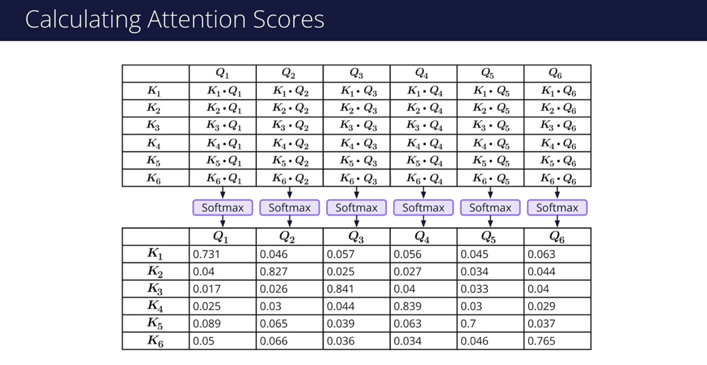
<p style="color: #555;">Figure: Query, Key, and Value Matrices in Attention Mechanism</p>
</div>

An intuitive analogy is searching in a library. Your query is what you're interested in finding, each book title serves
as a key that might match your query, and the content inside each book is the value you ultimately want to access.

**2. Attention Scoring**

For each query, we calculate its compatibility or relevance to every key:

$$
\text{score}(q_i, k_j) = \text{similarity}(q_i, k_j)
$$

   <div align="center">
   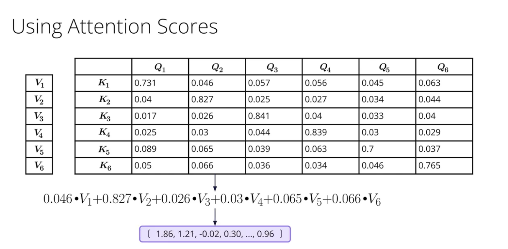
   <p style="color: #555;">Figure: Query, Key, and Value Matrices in Attention Mechanism</p>
   </div>

This score measures how much attention should be paid to the jth value when creating the output for position i. Various
similarity functions can be used, including dot products, scaled dot products, or additive attention.

**3. Weight Normalization**

The raw scores are converted into a probability distribution using the softmax function:

$$
\alpha_{ij} = \frac{\exp(\text{score}(q_i, k_j))}{\sum_k \exp(\text{score}(q_i, k_k))}
$$

This ensures all weights sum to 1, creating a "soft selection" mechanism. Rather than making a hard choice to select
specific values, attention takes a weighted average, allowing the model to blend information from multiple sources.

**4. Value Aggregation**

Finally, we compute a weighted sum of the values:

$$
\text{output}_i = \sum_j \alpha_{ij} v_j
$$

The output for position i is a weighted combination of all values, with weights determined by the attention scores.

<div align="center">
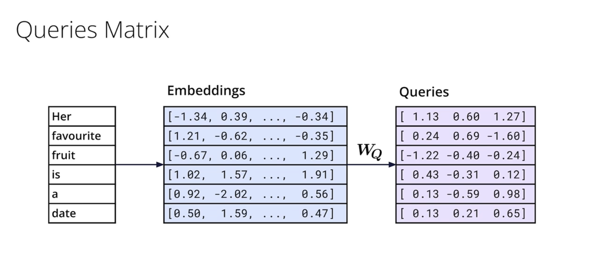
<p style="color: #555;">Figure: Query, Key, and Value Matrices in Attention Mechanism</p>
</div>

Let's work through a simplified example. Imagine processing the sentence "The animal didn't cross the street because it
was too tired." What does "it" refer to—the animal or the street? An attention mechanism would calculate high scores
between "it" and "animal" based on their semantic relationship, helping resolve this ambiguity.

The revolutionary aspect of attention mechanisms is their ability to create direct connections between any positions in
a sequence, regardless of their distance. This solved a fundamental limitation of previous sequence models like RNNs,
which struggled with long-range dependencies due to their sequential nature.

<div align="center">
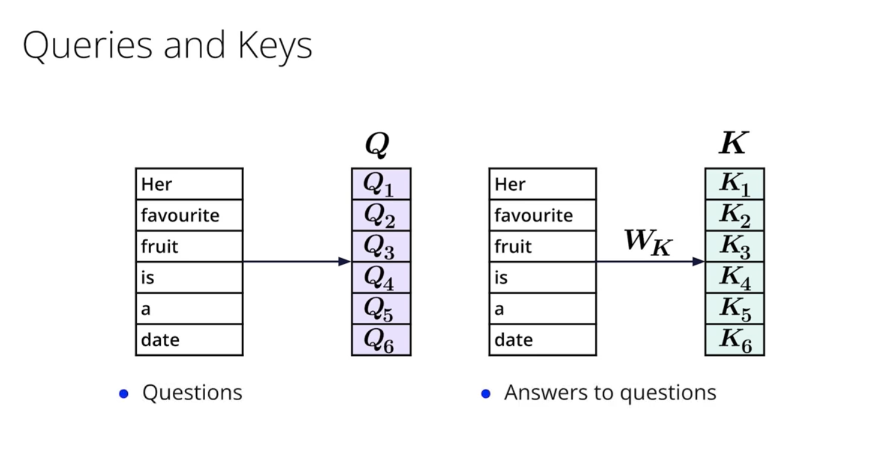
<p style="color: #555;">Figure: Query, Key, and Value Matrices in Attention Mechanism</p>
</div>

##### Self-Attention Implementation

Self-attention is a specific application of the attention mechanism where the queries, keys, and values all come from
the same source. This allows each element in a sequence to attend to all other elements, essentially enabling the
sequence to look at itself (hence "self"-attention) to compute a better representation.

<div align="center">
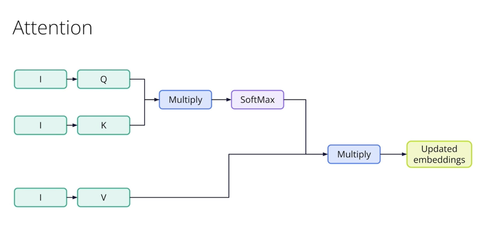
<p style="color: #555;">Figure: Query, Key, and Value Matrices in Attention Mechanism</p>
</div>

Let's walk through the concrete implementation steps for self-attention:

**1. Projection Matrices**

First, we need to transform the input embeddings into the query, key, and value spaces. If our input is a sequence of
vectors with dimension $d_{model}$, we create three matrices:

- $W^Q$ of shape $d_{model} \times d_k$ for queries
- $W^K$ of shape $d_{model} \times d_k$ for keys
- $W^V$ of shape $d_{model} \times d_v$ for values

For each position $i$ in our sequence with input embedding $x_i$, we compute:

$$
\begin{align}
q_i &= x_i W^Q \\
k_i &= x_i W^K \\
v_i &= x_i W^V
\end{align}
$$

These linear transformations allow the model to project the same input into different representation spaces optimized
for their specific roles in the attention mechanism.

**2. Computing Attention Scores**

Once we have queries and keys, we compute the attention scores by taking the dot product of each query with all keys:

$$
s_{ij} = q_i \cdot k_j^T
$$

This results in a matrix where entry $(i,j)$ represents how much position $i$ should attend to position $j$.

In practice, this is calculated efficiently as a matrix multiplication:

$$
S = QK^T
$$

Where $Q$ and $K$ are matrices containing all queries and keys for the sequence.

**3. Scaling the Scores**

The dot product can grow large for long vectors, pushing the softmax function into regions with very small gradients. To
counteract this, we scale the scores by the square root of the dimension of the key vectors:

$$
S = \frac{QK^T}{\sqrt{d_k}}
$$

This scaling factor keeps the values in a range where the softmax function remains sensitive to input differences.

**4. Applying Softmax**

Next, we apply the softmax function row-wise to obtain the attention weights:

$$
A = \text{softmax}(S)
$$

Each row of $A$ becomes a probability distribution over all positions in the sequence, representing how much each
position contributes to the new representation of position $i$.

**5. Computing Weighted Values**

Finally, we compute the output as a weighted sum of the values:

$$
O = AV
$$

Each row in $O$ represents the new, context-aware representation for the corresponding position in the input sequence.

To visualize this process, consider a simple sentence: "The dog chased the cat." When processing the word "chased,"
self-attention might assign high weights to "dog" (the subject doing the chasing) and "cat" (the object being chased),
capturing the semantic relationships between these words regardless of their positions in the sentence.

The power of self-attention becomes even more apparent with ambiguous references. In the sentence "The trophy wouldn't
fit in the suitcase because it was too big," self-attention helps determine that "it" likely refers to "trophy" through
the attention weights, solving a complex coreference resolution problem.

Self-attention can be visualized as a directed graph where each node (word) is connected to every other node, with edge
weights representing attention scores. This creates a fully connected network of relationships, allowing information to
flow directly between any positions without passing through intermediate steps.

<div align="center">
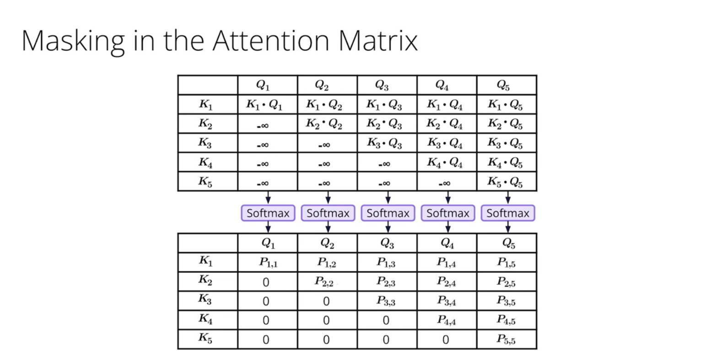
<p style="color: #555;">Figure: Masked Multi-Head Attention</p>
</div>

##### Multi-Head Attention

While self-attention is powerful, it has a limitation: a single attention mechanism can only capture one type of
relationship at a time. Consider the sentence "She met the old man at the bank." The word "bank" could have different
types of relationships with other words—a semantic relationship with "she" and "met" indicating a financial institution,
or a semantic relationship with "old man" possibly suggesting a riverbank.

Multi-head attention addresses this limitation by running multiple self-attention mechanisms in parallel, allowing the
model to jointly attend to information from different representation subspaces.

<div align="center">
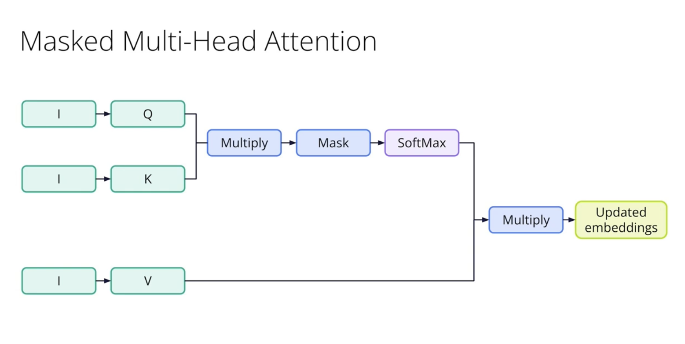
<p style="color: #555;">Figure: Masked Multi-Head Attention</p>
</div>

Let's understand how multi-head attention works:

**1. Creating Multiple Projection Sets**

Instead of having just one set of projection matrices ($W^Q$, $W^K$, $W^V$), we create $h$ different sets, where $h$ is
the number of heads:

$$
        W_i^Q, W_i^K, W_i^V \quad \text{for} \quad i = 1, 2, ..., h
$$

        Each head has its own projection matrices, usually with reduced dimensions. If the model dimension is $d_{model}$
        and we have $h$ heads, each head typically projects to dimension $d_k = d_v = d_{model}/h$.

**2. Parallel Attention Computation**

Each head computes attention independently:

$$
\text{head}_i = \text{Attention}(XW_i^Q, XW_i^K, XW_i^V)
$$

Where $X$ is the input sequence, and $\text{Attention}$ refers to the scaled dot-product attention described earlier.

Each head can learn to focus on different aspects of the data:

- One head might focus on syntactic relationships
- Another might capture subject-verb relationships
- A third might identify entity relationships
- Others might learn positional or local phrase patterns

**3. Concatenation and Final Projection**

After computing the output from each attention head, we concatenate them:

$$
\text{MultiHead} = \text{Concat}(\text{head}_1, \text{head}_2, ..., \text{head}_h)
$$

This concatenation results in a matrix of shape $(seq_length, d_{model})$, maintaining the original dimension size.

Finally, we apply one more linear transformation:

$$
\text{MultiHead} = \text{MultiHead} \cdot W^O
$$

Where $W^O$ is a parameter matrix of shape $(d_{model}, d_{model})$ that mixes information from different heads.

<div align="center">
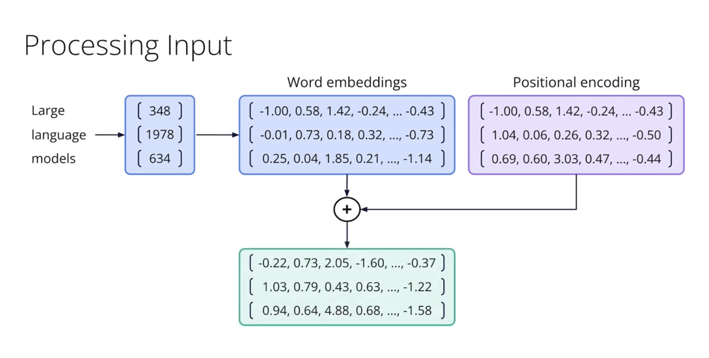
<p style="color: #555;">Figure: Query, Key, and Value Matrices in Attention Mechanism</p>
</div>

To visualize how multiple heads work together, let's use our previous example: "She met the old man at the bank."

- **Head 1** might focus on syntactic structure, connecting "she" to the verb "met"
- **Head 2** might capture entity relationships, linking "old man" with its definite article "the"
- **Head 3** might attend to financial context words, connecting "bank" with "met" (suggesting a financial institution)
- **Head 4** might focus on spatial relationships, connecting "at" with "bank"

The concatenated output from these heads provides a rich, multi-faceted representation that captures different aspects
of meaning simultaneously.

A typical transformer implementation uses 8-16 attention heads. Empirical studies have shown that different heads indeed
learn to specialize in different types of relationships, although there is usually some redundancy between heads. Some
heads focus on local relationships, others on long-distance dependencies, and some on specific syntactic or semantic
patterns.

##### Scaled Dot-Product Attention

Now that we understand self-attention and multi-head attention at a high level, let's examine the specific attention
mechanism used in transformer models: scaled dot-product attention.

The formula for scaled dot-product attention is:

$\text{Attention}(Q, K, V) = \text{softmax}\left(\frac{QK^T}{\sqrt{d_k}}\right)V$

This seemingly simple equation packs several important design choices that make it particularly effective for
transformers. Let's break it down step by step:

**1. Dot Product for Similarity**

The dot product between query and key vectors measures their similarity:

$$
QK^T
$$

results in a matrix where entry $(i,j)$ is the dot product $q_i \cdot k_j$.

The dot product has an intuitive interpretation: vectors pointing in similar directions have high dot products, while
orthogonal vectors have zero dot products. This naturally captures the notion of relevance—how much one position should
attend to another.

Compared to alternatives like additive attention (using a small neural network to compute compatibility), the dot
product is:

- More computationally efficient
- More space-efficient (requires fewer parameters)
- Well-optimized on modern hardware through matrix multiplication

**2. Scaling Factor**

The scaling factor $\frac{1}{\sqrt{d_k}}$ is a critical component often overlooked in simplified explanations.

As the dimension $d_k$ grows, the variance of the dot product grows as well. For random vectors with components of
variance 1, their dot product would have variance $d_k$. These large values push the softmax function into regions with
extremely small gradients, causing the gradient to vanish during backpropagation.

By dividing by $\sqrt{d_k}$, we keep the variance of the dot product at 1 regardless of the dimension, ensuring stable
gradients during training.

To illustrate, imagine two vectors of dimension 64 with typical values around 1. Their dot product could easily reach
magnitude 8 (square root of 64), which when passed through softmax would give nearly all weight to the highest value,
effectively making attention almost a hard selection rather than a soft weighting.

**3. Softmax Normalization**

The softmax function converts the scaled dot products into a probability distribution:

$$
\text{softmax}(x_i) = \frac{e^{x_i}}{\sum_j e^{x_j}}
$$

This serves two important purposes:

- Ensures all attention weights are positive and sum to 1
- Creates a differentiable "soft" selection mechanism

The softmax operation is applied row-wise, meaning each position in the sequence gets its own probability distribution
over all positions it can attend to.

**4. Value Weighting**

The final step multiplies the attention weight matrix by the value matrix:

$$
\text{softmax}\left(\frac{QK^T}{\sqrt{d_k}}\right)V
$$

This creates a weighted combination of value vectors for each position.

If position $i$ attends strongly to positions $j$ and $k$, then the output for position $i$ will be dominated by the
value vectors $v_j$ and $v_k$.

The mask parameter is particularly important for transformer models. In decoder self-attention, we need to ensure that
predictions at position $i$ can only depend on outputs at positions less than $i$. This causal masking is implemented by
setting the upper triangular part of the attention matrix to negative infinity before softmax, effectively forcing those
attention weights to zero.

Scaled dot-product attention provides an elegant balance of computational efficiency and expressive power, making it the
attention mechanism of choice for transformer architectures.

##### Positional Encoding

A key limitation of the attention mechanism is that it's permutation invariant—it doesn't inherently consider the order
of elements in the sequence. If we shuffled the words in a sentence, the self-attention operation would produce the same
results, which is problematic since word order is crucial for understanding language.

Transformers solve this problem through positional encoding—adding position-specific information to the input embeddings
before they're processed by the attention layers.

Let's explore how positional encoding works:

**1. Fixed Sinusoidal Encodings**

The original transformer paper introduced a clever approach using sine and cosine functions of different frequencies:

$$
PE_{(pos, 2i)} = \sin(pos / 10000^{2i/d_{model}})
$$

$$
PE_{(pos, 2i+1)} = \cos(pos / 10000^{2i/d_{model}})
$$

Where:

- $pos$ is the position in the sequence (0, 1, 2, ...)
- $i$ is the dimension index (0, 1, 2, ..., $d_{model}/2 - 1$)
- $d_{model}$ is the embedding dimension

This creates a unique encoding vector for each position, with specific patterns that help the model learn about relative
positions. The sinusoidal functions have several desirable properties:

- Each position gets a unique encoding
- The encodings for nearby positions are similar, while distant positions are more different
- The pattern extends to positions beyond those seen during training
- It allows the model to easily learn relative position relationships

**2. Adding Positional Information**

The positional encodings are simply added to the input embeddings:

$$
\text{input} = \text{embedding} + \text{positional\_encoding}
$$

This maintains the original semantic information while enriching it with positional context.

The dimensions of the positional encoding vector match the embedding dimensions, ensuring they can be added together.

To understand how sinusoidal encodings capture position information, let's examine their patterns:

- For small values of $i$ (early dimensions), the sinusoids have a high frequency, changing rapidly with position
- For large values of $i$ (later dimensions), the sinusoids have a low frequency, changing slowly with position

This creates a multi-scale representation of position, where different dimensions capture position information at
different resolutions.

Remarkably, this encoding scheme allows the model to generalize to sequence lengths longer than those seen during
training. The sinusoidal pattern continues predictably for any position value, enabling the model to handle longer texts
at inference time.

Here's a simplified visualization of positional encodings for the first few positions and dimensions:

For position 0:

$$
[sin(0), cos(0), sin(0), cos(0), ...] = [0, 1, 0, 1, ...]\\
$$

For position 1:

$$
[sin(1/10000^0), cos(1/10000^0), sin(1/10000^0.02), ...] ≈ [0.84, 0.54, 0.84, ...]\\
$$

For position 2:

$$
[sin(2/10000^0), cos(2/10000^0),sin(2/10000^0.02), ...] ≈ [0.91, -0.42, 0.91, ...]\\
$$

Each position gets a unique fingerprint, with patterns that reflect the relative distances between positions.

While fixed sinusoidal encodings are elegant, many modern transformer implementations use learned positional embeddings
instead, which are simple position-specific vectors that the model learns during training. These learned embeddings
often perform slightly better but don't generalize to unseen sequence lengths as well as the sinusoidal encodings.

More recent transformer models have explored alternatives like rotary position embeddings (RoPE), relative positional
encoding, and position-aware attention mechanisms, each offering different trade-offs in terms of performance,
efficiency, and maximum sequence length.

##### Transformer Block Architecture

With attention mechanisms and positional encoding in place, we can now explore the complete architecture of a
transformer block—the fundamental building unit of transformer models.

A transformer block consists of several components arranged in a specific structure with residual connections and
normalization layers. Let's examine each component and how they work together:

**1. Multi-Head Self-Attention Layer**

As we've discussed, this layer allows each position to attend to all positions, capturing different types of
relationships through multiple attention heads.

The key innovation of transformers is replacing recurrent or convolutional operations with self-attention, enabling:

- Direct modeling of long-range dependencies
- Parallel computation across the sequence
- More interpretable attention patterns

**2. Residual Connection and Layer Normalization**

After the self-attention layer, transformers employ two techniques to improve training stability:

- **Residual Connection**: The input to the self-attention layer is added to its output, creating a direct path for
  gradients to flow during backpropagation. This helps combat the vanishing gradient problem in deep networks:

$$
\text{output} = \text{LayerNorm}(\text{input} + \text{SelfAttention}(\text{input}))
$$

- **Layer Normalization**: Normalizes the output across the feature dimension, standardizing the mean and variance for
  each position in the sequence. This stabilizes the activations and speeds up training:

$$
\text{LayerNorm}(x) = \gamma \cdot \frac{x - \mu}{\sqrt{\sigma^2 + \epsilon}} + \beta
$$

Where $\mu$ and $\sigma$ are the mean and standard deviation of the features, and $\gamma$ and $\beta$ are learnable
parameters.

The specific arrangement of normalization layers has evolved across transformer implementations. The original
architecture used "post-norm" (normalization after addition), while many modern implementations use "pre-norm"
(normalization before attention and FFN), which provides more training stability.

**3. Position-wise Feed-Forward Network**

After the attention mechanism, each position is processed independently through a small two-layer neural network:

$$
\text{FFN}(x) = \max(0, xW_1 + b_1)W_2 + b_2
$$

This network consists of:

- A linear transformation expanding the dimension (typically by a factor of 4)
- A ReLU activation function
- A second linear transformation projecting back to the original dimension

The feed-forward network serves several important purposes:

- Adds non-linearity to the model
- Processes the attention outputs further
- Provides additional parameter capacity

Since the same FFN is applied to each position independently, it's called "position-wise." It's essentially a 1x1
convolution or a token-by-token transformation.

**4. Second Residual Connection and Layer Normalization**

Similar to the first residual connection, the output from the multi-head attention is combined with the output from the
feed-forward network:

$$
\text{output} = \text{LayerNorm}(\text{attention\_output} + \text{FFN}(\text{attention\_output}))
$$

This creates a second gradient pathway, further improving training dynamics.

The complete transformer block can be summarized as:

```shell
x → [Multi-Head Attention → Add & Norm → Feed-Forward → Add & Norm] → output
     ↑                                   ↑
     └───────────────x────────────┘     └───────────output of attention───┘
```

<div align="center">
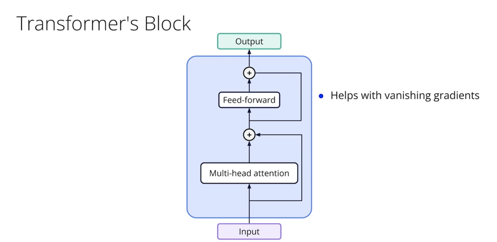
<p style="color: #555;">Figure: Transformer Block</p>
</div>

This block structure is then stacked multiple times to create the full transformer model. The original transformer paper
used 6 identical layers for both the encoder and decoder, but modern implementations often use more layers (BERT has
12-24, GPT-3 has 96).

<div align="center">
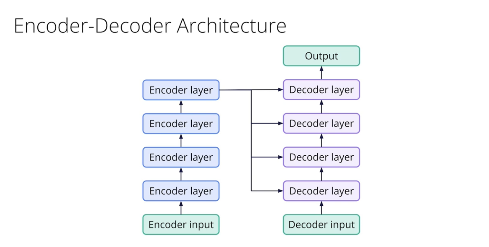
<p style="color: #555;">Figure: Encoder-Decoder Architecture</p>
</div>

In the encoder-decoder architecture, the transformer block in the decoder has an additional component:

- An encoder-decoder attention layer that allows the decoder to attend to all positions in the encoder output
- This layer sits between the masked self-attention and the feed-forward network

For autoregressive models like GPT, the self-attention mechanism in the decoder is masked to prevent attending to future
positions, ensuring the model only conditions on previous tokens when generating text.

<div align="center">
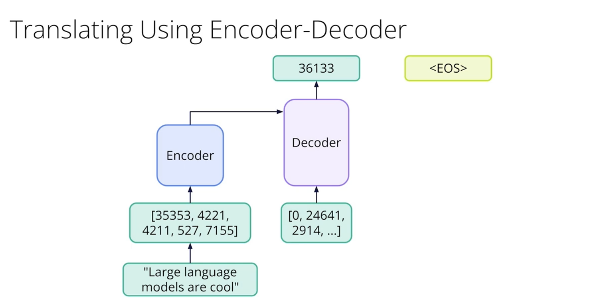
<p style="color: #555;">Figure: Translating using Encoder-Decoder Architecture</p>
</div>

The transformer block architecture combines several key innovations:

1. Self-attention for capturing long-range dependencies
2. Multi-head attention for representing different types of relationships
3. Residual connections for improving gradient flow
4. Layer normalization for stabilizing training
5. Position-wise FFN for adding non-linearity and capacity

This elegant design has proven remarkably effective across a wide range of sequence processing tasks, from machine
translation to language modeling, establishing transformers as the backbone of modern NLP systems.

Understanding the transformer architecture at this level provides the foundation for working with, adapting, and
innovating on modern language models, which have revolutionized natural language processing and continue to drive
breakthroughs in artificial intelligence.

#### Tokenization and Embeddings in NLP

Natural Language Processing (NLP) systems must first transform raw text into a numerical representation before they can
process it effectively. This transformation involves two critical steps: tokenization, which segments text into discrete
units, and embedding, which maps these tokens to numerical vectors. These processes fundamentally shape how machines
understand and generate human language.

##### Tokenization Methods

Tokenization is the foundation of text processing, breaking down a sequence of characters into meaningful units called
tokens. This seemingly straightforward process involves numerous design decisions that significantly impact model
performance.

At its most basic level, tokenization divides text along white spaces and punctuation to produce word-level tokens.
However, this simple approach fails to address the complexity and diversity of natural language. Modern tokenization
approaches include:

**Word-level Tokenization**

Word tokenization splits text at word boundaries, typically using spaces and punctuation as delimiters. For example, the
sentence "The cat sat on the mat." would be tokenized as ["The", "cat", "sat", "on", "the", "mat", "."]. While
intuitive, word tokenization faces several challenges:

1. **Vocabulary explosion**: Languages contain millions of unique words, including inflections, derivations, compounds,
   and neologisms. Creating embeddings for each possible word requires enormous vocabulary sizes.
2. **Out-of-vocabulary (OOV) words**: Words not encountered during training cannot be directly represented, requiring
   fallback strategies like using a special [UNK] token or handling at the character level.
3. **Morphological variation**: Word tokenization treats morphologically related words (e.g., "run," "running," "runs")
   as entirely distinct entities, failing to capture their semantic relationships.
4. **Language dependence**: Word boundaries are not clearly marked in many languages. For instance, Chinese and Japanese
   texts do not use spaces between words, requiring specialized segmentation algorithms.

Various libraries implement word tokenization, with subtle differences in how they handle punctuation, contractions, and
special characters. For example, NLTK and spaCy offer language-aware tokenizers that handle language-specific nuances
like contractions in English (e.g., "don't" → "do", "n't") or compound words in German.

**Character-level Tokenization**

Character tokenization treats individual characters as tokens, addressing many limitations of word tokenization. The
sentence "The cat" would be tokenized as ["T", "h", "e", " ", "c", "a", "t"]. This approach offers several advantages:

1. **Closed vocabulary**: The character set is finite and known in advance, eliminating OOV issues.
2. **Language-agnostic operation**: Works without modification across many languages, including those without clear word
   boundaries.
3. **Morphological awareness**: Captures subword patterns implicitly through character sequences.

However, character tokenization also has drawbacks:

1. **Sequence length**: Character sequences are much longer than word sequences, increasing computational demands and
   making it harder to capture long-range dependencies.
2. **Semantic dilution**: The semantic information present in a word becomes diffused across many tokens, potentially
   making it harder for models to capture meaning.
3. **Inefficiency for common patterns**: Common morphological patterns must be relearned from scratch instead of being
   represented as single units.

Character tokenization has proven particularly effective for specialized tasks like spelling correction, informal text
processing (with many spelling variations), and processing languages with complex morphology or no clear word
boundaries.

**Hybrid Approaches**

Hybrid methods combine word-level and character-level tokenization to balance their strengths and weaknesses. These
include:

1. **Word+Character models**: Use word tokenization when possible, but fall back to character-level representation for
   OOV words.
2. **Mixed-granularity models**: Process text at multiple granularity levels simultaneously (words, characters, and
   potentially other units).

Hybrid approaches can be particularly effective for handling languages with complex morphology or mixed scripts, but
they add complexity to model architecture and training procedures.

Modern NLP systems have increasingly moved toward subword tokenization methods, which we'll cover in detail in a later
section. These methods provide an elegant solution to many of the challenges faced by both word-level and
character-level approaches.

##### Word Embeddings Techniques

Word embeddings are dense vector representations of words that capture semantic relationships in a continuous vector
space. Unlike sparse one-hot encodings, where each word is represented by a vector with a single 1 and all other entries
0, embeddings map words to dense vectors typically ranging from 50 to 300 dimensions.

Several landmark techniques have shaped the development of word embeddings:

**Word2Vec**

Developed by Mikolay et al. at Google in 2013, Word2Vec revolutionized word representation by learning embeddings
through context prediction tasks. Word2Vec comes in two flavors:

1. **Continuous Bag of Words (CBOW)**: Predicts a target word given its surrounding context words. For example, given
   "The \_\_\_\_ sat on the mat," the model predicts "cat."
2. **Skip-gram**: The inverse of CBOW, predicting context words given a target word. Given "cat," the model predicts
   surrounding words like "the," "sat," "on."

Mathematically, Skip-gram maximizes the average log probability:

$$
\frac{1}{T} \sum_{t=1}^{T} \sum_{-c \leq j \leq c, j \neq 0} \log p(w_{t+j} | w_t)
$$

Where $c$ is the context window size, $T$ is the text length, and $w_t$ is the target word.

Word2Vec produces embeddings with remarkable properties:

- Words with similar meanings cluster together in the vector space.
- Vector arithmetic captures semantic relationships: vec("king") - vec("man") + vec("woman") ≈ vec("queen").
- The distance between word vectors correlates with semantic similarity.
- The embeddings encode various linguistic regularities and patterns.

**GloVe (Global Vectors)**

Developed by Pennington et al. at Stanford in 2014, GloVe combines the benefits of count-based methods (like Latent
Semantic Analysis) with prediction-based methods (like Word2Vec). GloVe works by factorizing the logarithm of the word
co-occurrence matrix.

The core insight of GloVe is that the ratio of co-occurrence probabilities can encode meaning. For instance, if we have
words $i$ and $j$ and two context words $k$ and $l$, the ratio $P_{ik}/P_{jk}$ will be large if word $i$ is related to
context $k$ but word $j$ is not, close to 1 if both or neither are related, and small if word $j$ is related but word
$i$ is not.

The GloVe objective function is:

$$
J = \sum_{i,j=1}^{V} f(X_{ij})(\mathbf{w}_i^T \tilde{\mathbf{w}}_j + b_i + \tilde{b}_j - \log X_{ij})^2
$$

Where:

- $X_{ij}$ is the co-occurrence count between words $i$ and $j$
- $\mathbf{w}_i$ and $\tilde{\mathbf{w}}_j$ are word vectors
- $b_i$ and $\tilde{b}_j$ are bias terms
- $f(X_{ij})$ is a weighting function that prevents rare co-occurrences from being overweighted

GloVe embeddings generally perform similarly to Word2Vec but can be more efficient to train on large corpora since they
directly utilize global co-occurrence statistics.

**FastText**

Developed by Facebook AI Research in 2016, FastText extends Word2Vec by representing each word as a bag of character
n-grams. For example, the word "apple" with n=3 would be represented as {"<ap", "app", "ppl", "ple", "le>"} plus the
whole word "apple".

The key advantage of FastText is handling OOV words and morphologically rich languages better than Word2Vec and GloVe.
By learning representations for character n-grams rather than whole words, FastText can generate embeddings for
previously unseen words based on their subword components.

FastText uses the same Skip-gram or CBOW objectives as Word2Vec but with the modification that each word is represented
as the sum of its constituent n-gram vectors.

The subword approach is particularly beneficial for:

- Languages with rich morphology like Finnish, Turkish, or German
- Technical texts with many compound words
- Social media content with misspellings and neologisms

**Implementation Considerations**

When implementing or selecting word embeddings, several practical considerations arise:

1. **Dimensionality**: Higher dimensions can capture more nuanced relationships but require more data to train
   effectively and consume more memory. Common dimensions range from 50 (for simple tasks) to 300 (for complex tasks).
2. **Context window size**: Larger windows capture topical similarity, while smaller windows capture functional or
   syntactic similarity.
3. **Minimum frequency thresholds**: Words appearing fewer than a threshold number of times are often excluded or mapped
   to a special token like [UNK].
4. **Preprocessing**: Choices around lowercasing, stemming, lemmatization, and handling punctuation can significantly
   impact embedding quality.
5. **Training corpus**: Domain-specific corpora produce embeddings that better capture the nuances relevant to specific
   applications.

Pre-trained word embeddings like Google's Word2Vec trained on Google News, Stanford's GloVe trained on Common Crawl, or
Facebook's FastText trained on Wikipedia provide a strong starting point for many applications and can be fine-tuned on
domain-specific data if needed.

##### Contextual vs. Static Embeddings

Traditional word embeddings like Word2Vec, GloVe, and FastText assign the same vector to a word regardless of its
context. This creates an inherent limitation: words with multiple meanings (polysemy) receive a single representation
that averages their various senses. For example, "bank" could refer to a financial institution or a riverside, but
static embeddings cannot distinguish between these meanings.

**Static Embeddings**

Static embeddings maintain several advantages:

- Computational efficiency both during training and inference
- Straightforward interpretation and visualization
- Easy integration with various downstream models
- Effective for tasks where context is less critical

However, they face significant limitations:

- Inability to distinguish word senses based on context
- Poor handling of homonyms, polysemous words, and contextual variations
- Insensitivity to syntactic roles that vary by context

**Contextual Embeddings**

Contextual embeddings, introduced by models like ELMo, BERT, and GPT, revolutionized NLP by generating dynamic
representations for words based on their surrounding context. In these models, the same word receives different
embeddings in different contexts, capturing its specific meaning in each instance.

The key innovations that enabled contextual embeddings include:

1. **Bidirectional context modeling**: Models like BERT consider both left and right context when generating embeddings,
   unlike traditional language models that only looked at preceding words.
2. **Transformer architecture**: The self-attention mechanism in transformers allows each word to directly attend to all
   other words in the sequence, enabling more effective context modeling.
3. **Pre-training and fine-tuning paradigm**: Models are pre-trained on large corpora with self-supervised objectives
   like masked language modeling, then fine-tuned for specific tasks.

Contextual embeddings have several important characteristics:

1. **Layer-specific representations**: Different layers of deep contextual models capture different aspects of meaning:
    - Lower layers tend to capture syntactic and local features
    - Middle layers capture a mix of syntactic and semantic information
    - Higher layers capture semantic and task-specific information
2. **Context window limitations**: Most contextual models have a maximum context length (e.g., 512 tokens for BERT,
   gradually increasing in newer models), limiting their ability to capture very long-range dependencies.
3. **Computational demands**: Generating contextual embeddings typically requires running the entire model forward pass,
   which is more computationally intensive than simple lookup operations for static embeddings.

**Comparing Performance**

Contextual embeddings have consistently outperformed static embeddings across virtually all NLP tasks, with particularly
dramatic improvements in tasks requiring nuanced understanding of word meaning in context:

1. **Word sense disambiguation**: Contextual models can distinguish between "The bank approved the loan" and "The river
   bank was muddy."
2. **Coreference resolution**: Better handling of pronouns and referring expressions that depend on context.
3. **Syntactic parsing**: Improved understanding of words' grammatical roles in different contexts.
4. **Named entity recognition**: More accurate identification of entities and their types based on contextual cues.

The performance gap is typically larger for:

- Complex semantic tasks requiring deep understanding
- Tasks with ambiguous language and context-dependent meanings
- Scenarios with limited training data where pre-training knowledge helps

**Hybrid Approaches**

In practice, hybrid approaches that leverage both static and contextual embeddings can offer advantages:

1. **Static embeddings for efficiency**: Using static embeddings for computationally constrained environments or initial
   filtering stages.
2. **Contextual embeddings for precision**: Applying more expensive contextual embeddings when nuanced understanding is
   required.
3. **Distillation**: Distilling knowledge from contextual models into more efficient static embeddings.

The evolution from static to contextual embeddings represents one of the most significant paradigm shifts in NLP,
contributing substantially to the remarkable progress in language understanding capabilities in recent years.

##### Embedding Vector Properties

Word embeddings derive their utility from specific mathematical and structural properties that enable them to capture
semantic and syntactic relationships between words. Understanding these properties helps explain why embeddings work so
well for NLP tasks and guides their effective application.

**Geometric Properties**

Embedding spaces exhibit several important geometric properties:

1. **Cosine similarity**: The cosine of the angle between two word vectors often correlates strongly with semantic
   similarity:

    $$
       \text{similarity}(A, B) = \frac{\vec{A} \cdot \vec{B}}{|\vec{A}||\vec{B}|} = \frac{\sum_{i=1}^{n} A_i B_i}{\sqrt{\sum_{i=1}^{n} A_i^2} \sqrt{\sum_{i=1}^{n} B_i^2}}
    $$

    For normalized vectors, this simplifies to the dot product. Words with similar meanings have vectors pointing in
    similar directions, resulting in high cosine similarity.

2. **Euclidean distance**: The straight-line distance between vectors can also indicate semantic distance, though it's
   more sensitive to vector magnitudes:

    $$
       \text{distance}(A, B) = |\vec{A} - \vec{B}| = \sqrt{\sum_{i=1}^{n} (A_i - B_i)^2}
    $$

3. **Linear substructures**: Relationships between words often form linear structures. For example, gender relationships
   might align along a consistent direction in the embedding space, allowing for vector arithmetic like:
    $$
       \vec{\text{king}} - \vec{\text{man}} + \vec{\text{woman}} \approx \vec{\text{queen}}
    $$
4. **Clustering**: Words with similar meanings naturally cluster together in the vector space, allowing for semantic
   grouping.

**Distributional Properties**

Word embeddings are founded on the distributional hypothesis: words that occur in similar contexts tend to have similar
meanings. This manifests in several ways:

1. **Context prediction**: Word2Vec and similar algorithms learn embeddings that are good at predicting context words
   (Skip-gram) or center words from context (CBOW).
2. **Co-occurrence patterns**: GloVe directly leverages global word co-occurrence statistics, encoding these patterns in
   the resulting vectors.
3. **Frequency effects**: Word frequency can influence embedding quality, with rare words typically having less reliable
   embeddings due to limited training examples.

**Mathematical Properties**

Several mathematical properties make embeddings effective for computation:

1. **Dense representation**: Unlike sparse one-hot encodings, embeddings compactly represent semantic information in a
   few hundred dimensions, making them computationally efficient.
2. **Continuous space**: The continuous nature of the vector space allows for smooth interpolation between concepts and
   measuring degrees of similarity.
3. **Compositionality**: Word vectors can be combined (through averaging, concatenation, or more sophisticated
   operations) to represent phrases and sentences.
4. **Dimensionality properties**: The choice of embedding dimension involves a trade-off:
    - Too few dimensions: Insufficient capacity to capture semantic nuances
    - Too many dimensions: Risk of overfitting and computational inefficiency
    - Optimal dimensions: Typically between 100-300 for most applications

**Linguistic Properties**

Embeddings capture various linguistic relationships:

1. **Semantic relationships**:
    - Synonymy: Similar words like "happy" and "glad" have similar vectors
    - Antonymy: Opposites like "hot" and "cold" are often similar in most dimensions but differ strongly in specific
      dimensions
    - Hypernymy/hyponymy: Category relationships like "animal" → "dog" are partially captured
2. **Syntactic relationships**:
    - Part of speech patterns
    - Grammatical number (singular/plural)
    - Tense relationships for verbs
3. **Analogical relationships**: The famous example "man is to woman as king is to queen" demonstrates how embeddings
   capture proportional analogies.

**Limitations and Biases**

Embedding vectors also exhibit important limitations:

1. **Social biases**: Embeddings trained on large corpora absorb and potentially amplify societal biases present in the
   training data. For example, profession words may show gender biases.
2. **Temporal limitations**: Static embeddings don't account for language evolution and changing word meanings over
   time.
3. **Domain specificity**: Embeddings trained on general corpora may perform poorly on specialized domains with unique
   vocabulary and usage patterns.
4. **Sense conflation**: Static embeddings merge different senses of polysemous words into a single representation.

Understanding these properties enables more effective application of embeddings across NLP tasks and informs approaches
to addressing their limitations through techniques like debiasing algorithms, domain-specific training, and contextual
representations.

##### Subword Tokenization Approaches

Subword tokenization bridges the gap between word-level and character-level tokenization by breaking words into
meaningful subunits. This approach addresses vocabulary explosion, handles OOV words, and captures morphological
structure, making it the preferred tokenization method for modern NLP systems.

**Byte Pair Encoding (BPE)**

Originally developed as a data compression algorithm, BPE was adapted for NLP by Sennrich et al. in 2016. The algorithm
starts with a character-level vocabulary and iteratively merges the most frequent adjacent pairs of tokens to form new
subword units.

The BPE training process follows these steps:

1. Initialize the vocabulary with individual characters from the training corpus.
2. Count frequencies of adjacent character pairs in the corpus.
3. Merge the most frequent pair and add the resulting subword to the vocabulary.
4. Update the corpus by replacing all occurrences of the pair with the new subword.
5. Repeat steps 2-4 for a predetermined number of merge operations or until the vocabulary reaches a target size.

During tokenization, words are split using the learned merge operations applied in the same order as during training.
The algorithm greedily applies the longest possible subword substitutions.

BPE offers several advantages:

- Effectively handles rare words and morphologically rich languages
- Produces a fixed-size vocabulary that can be controlled by the number of merge operations
- Segments common words into single tokens while decomposing rare words into meaningful subwords

For example, with appropriate merge operations learned, "unhappiness" might be tokenized as ["un", "happiness"] rather
than character by character or as an OOV token.

BPE is used in models like GPT-2, RoBERTa, and XLM, with variations in preprocessing (e.g., GPT-2 uses byte-level BPE
rather than unicode character-level BPE).

**WordPiece**

Developed by Google, WordPiece is similar to BPE but uses a slightly different merging criterion. Instead of merging the
most frequent pair, WordPiece selects the pair that maximizes the likelihood of the training data when added to the
vocabulary.

The algorithm follows these steps:

1. Start with a character-level vocabulary.
2. Train a language model on the current segmentation of the training corpus.
3. Consider all possible pairs of tokens in the current vocabulary.
4. For each pair, compute how much adding it to the vocabulary would increase the likelihood of the training data
   according to the language model.
5. Add the pair that gives the largest increase in likelihood.
6. Repeat steps 2-5 until reaching the desired vocabulary size.

During tokenization, WordPiece typically uses a greedy longest-match-first approach, and commonly adds special prefix
markers (like "##" in BERT) to subwords that don't start a word.

For example, "embeddings" might be tokenized as ["em", "##bed", "##ding", "##s"] in BERT's WordPiece implementation.

WordPiece is used in models like BERT, DistilBERT, and ALBERT, contributing to their effectiveness across various
languages and domains.

**Unigram Language Model**

The Unigram method, implemented in SentencePiece by Google, approaches subword segmentation as a probabilistic problem.
It starts with a large vocabulary and iteratively prunes it to optimize a language model likelihood.

The algorithm works as follows:

1. Initialize with a large vocabulary of potential subword units (e.g., all character n-grams up to a certain length).
2. Train a unigram language model assuming that tokens are produced independently.
3. Compute the loss in likelihood that would result from removing each token from the vocabulary.
4. Remove the tokens with the smallest loss (typically a fixed percentage in each iteration).
5. Retrain the language model with the reduced vocabulary.
6. Repeat steps 3-5 until reaching the target vocabulary size.

During tokenization, the algorithm finds the most likely segmentation of a word using the trained unigram language
model, typically using the Viterbi algorithm to find the optimal segmentation efficiently.

Unigram model tokenization offers several benefits:

- Produces probabilistic segmentations rather than deterministic ones
- Can consider multiple possible segmentations during training and inference
- Directly optimizes a language modeling objective

The Unigram method is used in SentencePiece and is the tokenizer of choice for models like XLNet and many multilingual
models.

**SentencePiece**

SentencePiece is not a specific algorithm but a tokenization framework that implements both BPE and Unigram methods with
an important addition: it treats the input text as a raw Unicode sequence without any pre-tokenization or
language-specific processing.

This language-agnostic approach offers several advantages:

- Works for any language, including those without explicit word boundaries
- Ensures consistent tokenization across languages
- Handles whitespace as just another character, allowing the model to learn meaningful whitespace patterns

SentencePiece also directly models the reversibility of tokenization by preserving the original text and providing
detokenization functionality.

**Practical Considerations**

When implementing subword tokenization, several practical considerations affect performance:

1. **Vocabulary size**: Larger vocabularies reduce the average number of tokens per sentence, speeding up processing,
   but may not generalize as well to rare words. Common sizes range from 8,000 to 50,000 subwords.
2. **Special tokens**: Most implementations add special tokens like [UNK] (unknown), [CLS] (classification), [SEP]
   (separator), [MASK] (masked token), and [PAD] (padding).
3. **Pre-normalization**: Text normalization choices like lowercase, accent removal, or Unicode normalization impact the
   resulting tokenization.
4. **Handling whitespace**: Different approaches include treating spaces as separate tokens, preserving them as part of
   tokens, or using special markers.
5. **Subword markers**: Visual indicators like "##" in BERT or "▁" (underscore) in SentencePiece help track token
   boundaries.

Subword tokenization has become the standard approach in modern NLP systems due to its balanced handling of vocabulary
size, OOV words, and morphological structure. Most state-of-the-art models like BERT, GPT, RoBERTa, and T5 use some form
of subword tokenization, though they differ in specific implementation details.
