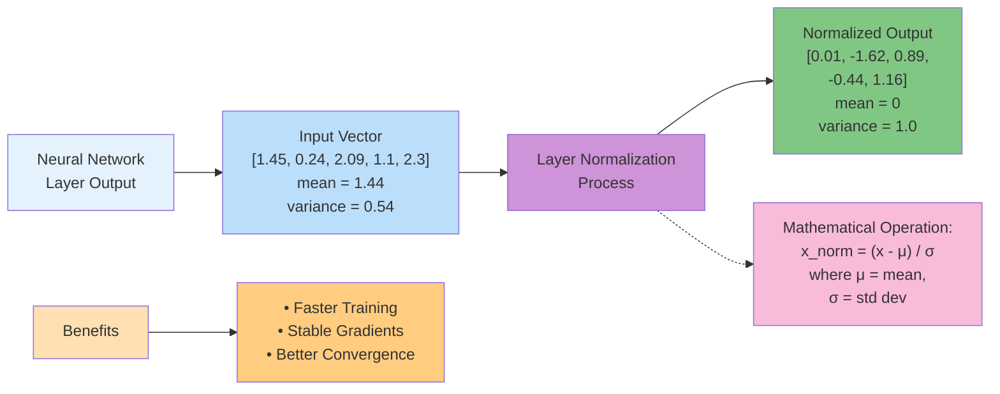
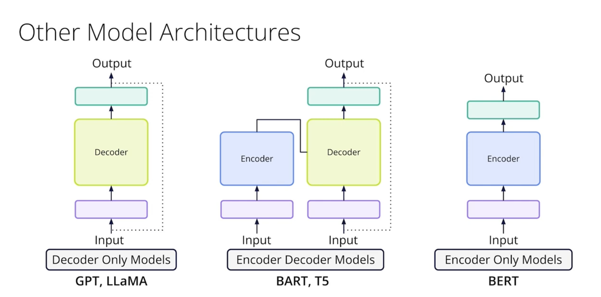
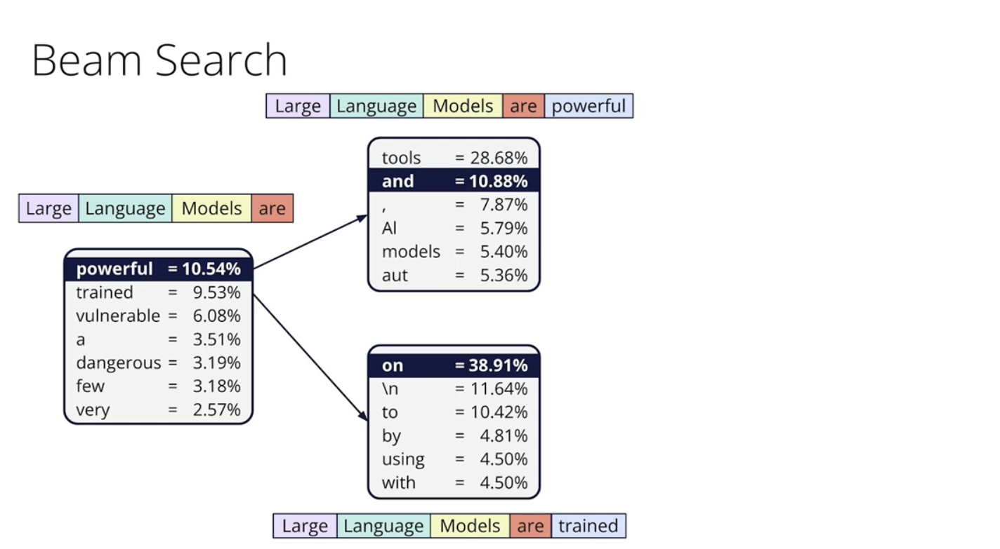
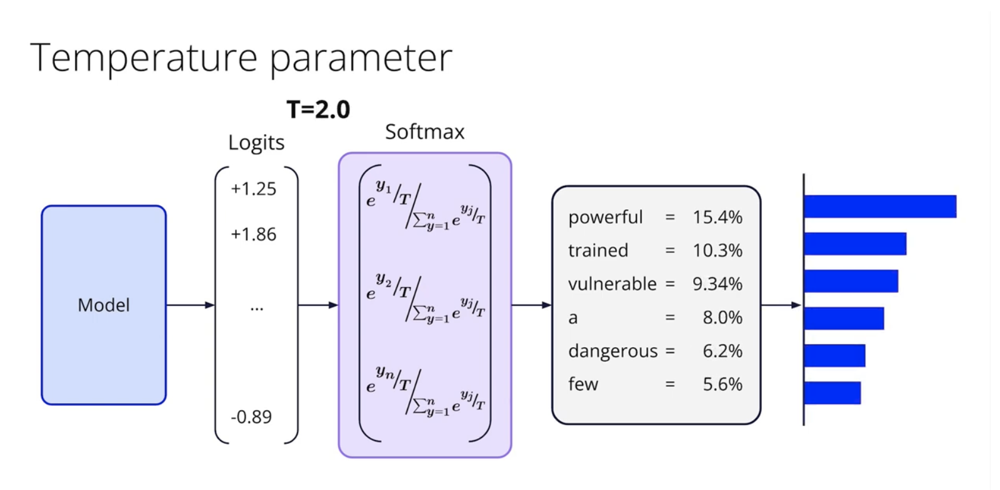
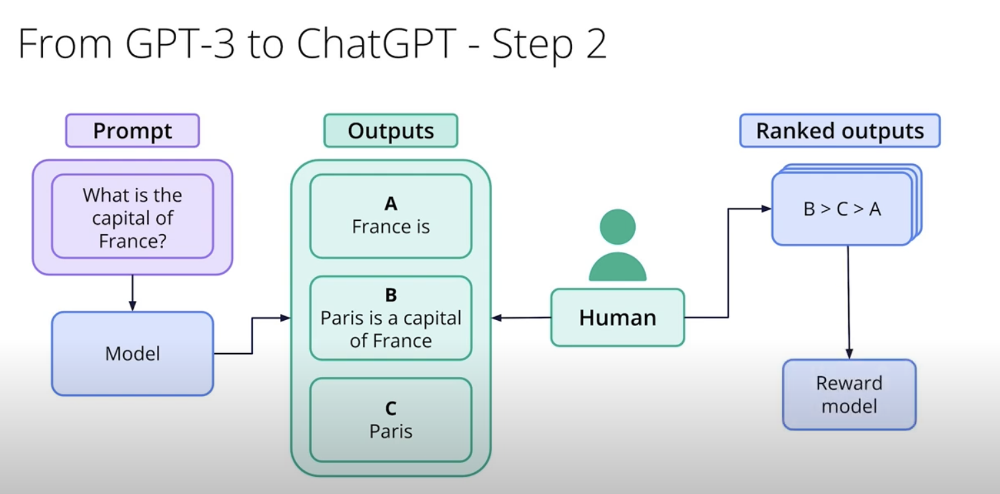
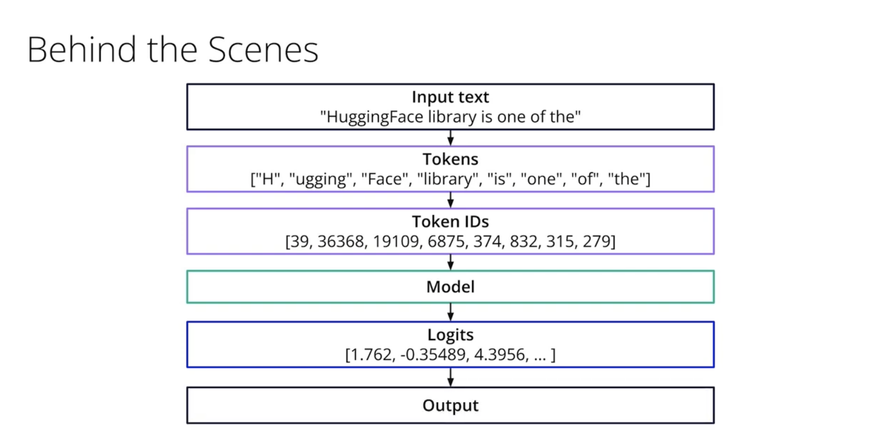
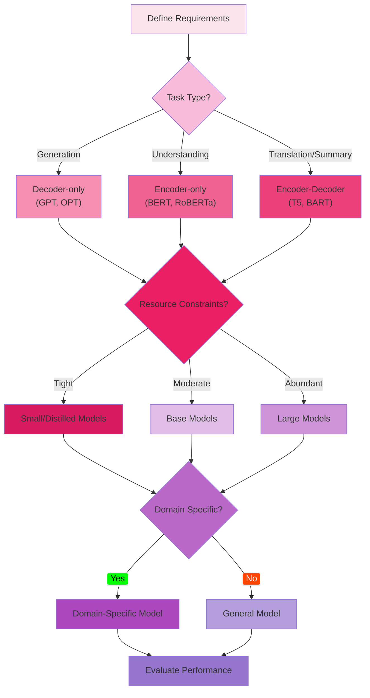
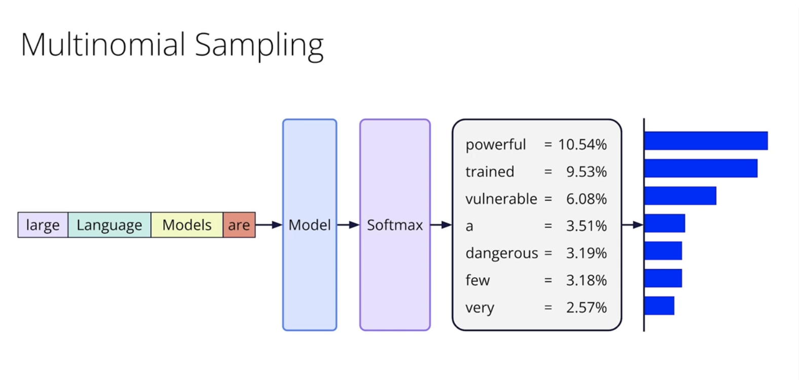

# C-5: Implementation and Applications

1. **Building Transformer Models in PyTorch**
    - Model Components Implementation
    - Attention Block Coding
    - Feedforward Networks
    - Layer Normalization
    - Training and Evaluation Process
2. **Decoder-only Architecture**
    - GPT-style Models
    - Causal Masking Implementation
    - Autoregressive Property
    - Generation Strategies
    - Applications and Limitations
3. **Using Pre-trained Models with Hugging Face**
    - Pipeline API Usage
    - Model Selection Guidelines
    - Text Generation Parameters
    - Fine-tuning Pre-trained Models
    - Multi-modal Applications

---

#### Building Transformer Models

##### Understanding the Transformer Revolution

Imagine you're trying to understand a conversation where multiple people are speaking simultaneously, and you need to
figure out not just what each person is saying, but how their words relate to everyone else's. This is essentially the
challenge that transformers solve in natural language processing. Unlike previous approaches that processed text
sequentially (like reading word by word), transformers can look at all words simultaneously and understand their
relationships, much like how you might grasp the overall meaning of a sentence at a glance rather than parsing it word
by word.

The transformer architecture represents one of the most significant breakthroughs in deep learning, fundamentally
changing how machines process and understand language. To truly appreciate this innovation, let's build our
understanding from the ground up, starting with the key insight: **attention is all you need**.

##### Model Components Implementation

###### The Architecture Blueprint

A **Transformer model** can be thought of as a sophisticated assembly line for processing language. Instead of reading
words one by one, it's designed to look at all words in a sentence simultaneously, understanding how they relate to each
other to grasp the overall meaning, much like how your brain comprehends a sentence at a glance. At its core, it
consists of several key components that work in harmony to achieve this deep understanding:

###### 1. Input Embeddings

The first step in this assembly line is to transform raw text into a format that a computer can understand and process.
Words, or subword units (like "un" or "##ing"), are discrete, non-numerical symbols. To work with them mathematically,
we convert them into **continuous vector representations** called **embeddings**.

- **What is an Embedding?** Imagine translating words into numbers that capture their meaning. Just as you might
  represent a person with a list of numbers for "height," "age," and "income," word embeddings represent words as
  vectors that capture their semantic properties. For example, the word "cat" might be represented as a vector like
  $[0.8, 0.2, -0.1, 0.5]$.
- **Why are they needed?** Traditional methods like "one-hot encoding" create extremely long vectors (millions of
  dimensions for a large vocabulary) where each word is entirely unrelated to another (e.g., "cat" and "dog" are as
  different as "cat" and "car"). Embeddings, on the other hand, are **dense** and **capture relationships**: words used
  in similar contexts tend to have similar embedding vectors. This means "cat" and "dog" will be "closer" in the
  numerical space than "cat" and "car".
- **Embedding Dimension**: This is simply the **length of the vector** used to represent each word. More dimensions
  allow the model to capture more nuanced meanings and relationships. Common dimensions range from 50 for simple tasks
  to 300 for complex ones, with models like BERT-base using 768 dimensions and GPT-3 using 12,288.
- **Combined Representation**: The **input embeddings** are formed by adding the word's learned numerical representation
  to a special **positional encoding** (which we'll discuss next). This way, the final representation for each word
  contains both its meaning and its order within the sentence.
    - **Numerical Example**: Let's say the word "cat" at position 1 has a word embedding of $[0.2, -0.5, 0.8, 0.1]$. If
      its positional embedding for position 1 is $[0.1, 0.0, -0.1, 0.2]$, then the combined input embedding for "cat"
      becomes: $$ [0.2, -0.5, 0.8, 0.1] + [0.1, 0.0, -0.1, 0.2] = [0.3, -0.5, 0.7, 0.3] $$ This new vector now contains
      both what "cat" means and its specific location in the sentence.

###### 2. Positional Encodings

A crucial limitation of the fundamental attention mechanism (the next component) is that it treats a sequence of words
as a **set**, not an ordered list. This means "John loves Mary" would be treated identically to "Mary loves John" if
only attention were used. **Positional encodings** inject information about the **order of tokens** into the input
representations.

- **Why are they needed?** They ensure the model knows the position of each word, allowing it to understand, for
  example, which word is the subject and which is the object in a sentence.

- How they work

    : The original Transformer uses

    sinusoidal functions

    to create unique position-specific patterns for each word. These functions have properties that allow them to:

    - **Uniquely identify each position**.
    - **Generalize to sequences longer than those seen during training**.
    - **Maintain information about relative positions** (e.g., positions 5 and 6 are closer than 5 and 15).

- **Mathematical Framework**: For a position $pos$ and a dimension index $i$ (where $i$ ranges from $0$ to
  $d_{model}/2 - 1$): $$ PE*{(pos, 2i)} = \sin\left(\frac{pos}{10000^{2i/d*{model}}}\right) $$ $$ PE*{(pos, 2i+1)} =
  \cos\left(\frac{pos}{10000^{2i/d*{model}}}\right) $$ Even dimensions use sine, and odd dimensions use cosine.
  Different dimensions oscillate at different frequencies, creating a multi-scale representation of position.

- Numerical Example: Let's consider a

    ```
    d_model = 4
    ```

    and calculate the positional encoding for

    ```
    position 1
    ```

    ("sits"):

    - For dimension 0 ($i=0$, even):
      $PE_{(1,0)} = \sin\left(\frac{1}{10000^{0/4}}\right) = \sin(1) \approx \mathbf{0.841}$
    - For dimension 1 ($i=0$, odd):
      $PE_{(1,1)} = \cos\left(\frac{1}{10000^{0/4}}\right) = \cos(1) \approx \mathbf{0.540}$
    - For dimension 2 ($i=1$, even):
      $PE_{(1,2)} = \sin\left(\frac{1}{10000^{2/4}}\right) = \sin\left(\frac{1}{100}\right) = \sin(0.01) \approx \mathbf{0.010}$
    - For dimension 3 ($i=1$, odd):
      $PE_{(1,3)} = \cos\left(\frac{1}{10000^{2/4}}\right) = \cos\left(\frac{1}{100}\right) = \cos(0.01) \approx \mathbf{1.000}$
      So, the positional encoding for "sits" at position 1 would be $[0.841, 0.540, 0.010, 1.000]$. This unique
      numerical pattern is added to the word's semantic embedding.

###### 3. Attention Mechanisms

This is the **core innovation** of the Transformer. The attention mechanism allows the model to **dynamically focus on
relevant parts of the input** when processing each element, much like how your brain focuses on "scientist" and
"revolutionized" when understanding "The scientist who discovered penicillin... revolutionized medicine". It enables
every part of the sequence to directly "communicate" with every other part.

The attention mechanism is built around three distinct types of transformed representations:

- A representation of what each position is **asking for** or seeking from other positions (often referred to as $Q$).
- A representation of what each position **offers as information** or advertises about its content (often referred to as
  $K$).
- The **actual content** that each position provides, which will be retrieved and combined (often referred to as $V$).
- **Scaled Dot-Product Attention**: This is the fundamental operation for calculating how much each part of the sequence
  should "attend to" every other part. The formula is: $$ \text{Attention}(Q, K, V) =
  \text{softmax}\left(\frac{QK^T}{\sqrt{d_k}}\right)V $$ Let's break it down:
    1. **Similarity Measurement**: The term $QK^T$ computes the **dot product** between every pair of "asking for"
       representations and "offering information" representations. A higher dot product means the two parts are more
       similar or relevant to each other.
    2. **Scaling**: We divide the scores by $\sqrt{d_k}$ (the square root of the dimension of the "offering information"
       representations). This is crucial to prevent the scores from becoming too large, which would make the `softmax`
       function less effective and lead to unstable training.
    3. **Normalization**: The `softmax` function converts these scaled scores into **attention weights** (probabilities)
       that sum to 1 for each position. This creates a "soft selection" mechanism, allowing the model to blend
       information from multiple sources.
    4. **Content Aggregation**: Finally, these attention weights are used to compute a **weighted sum** of the "actual
       content" representations ($V$). The parts with higher attention weights contribute more to the new, context-aware
       representation of each position.
- **Multi-Head Attention**: Instead of a single attention function, Transformers use **multiple "attention heads"**
  working in parallel. Imagine having several experts, each focusing on a different type of relationship:
    - One head might learn to focus on **syntactic relationships** (e.g., subject-verb agreement).
    - Another might capture **semantic dependencies** (e.g., the meaning of words).
    - A third might track **coreference** (e.g., resolving what a pronoun refers to). Each head processes the input
      through its own set of transformations. Their individual outputs are then **concatenated** and passed through a
      final linear transformation, mixing the information from all heads back into the model's original dimension. This
      provides a richer, multi-faceted understanding of the input.
    - **Numerical Example (Multi-Head Attention - Simplified)**: Let's use a small example with an input of 3 tokens
      (words) and a model dimension of 4, with 2 attention heads (so each head has dimension 2). Our input matrix (from
      embeddings) is $X$: $$ X = \begin{bmatrix} 1.0 & 0.5 & -0.2 & 0.8 \quad \text{(Token 1)}\ 0.3 & 1.2 & 0.6 & -0.4
      \quad \text{(Token 2)}\ -0.1 & 0.7 & 1.1 & 0.2 \quad \text{(Token 3)} \end{bmatrix} $$ For **Head 1**, we have
      learned projection matrices, say $W_1^Q$, $W_1^K$, $W_1^V$.
        1. Compute the transformed representations for Head 1: $$ Q_1 = XW_1^Q, \quad K_1 = XW_1^K, \quad V_1 = XW_1^V
           $$ For instance, $Q_1$ might be: $$ Q_1 = \begin{bmatrix} 1.01 & 1.18 \ 0.62 & 0.22 \ 1.09 & 0.89
           \end{bmatrix} $$
        2. Compute attention scores $S_1 = \frac{Q_1 K_1^T}{\sqrt{d_k}}$. After scaling by $\sqrt{2}$, $S_1$ might look
           like: $$ S_1 = \begin{bmatrix} 1.94 & 1.46 & 1.40 \ 0.71 & 0.39 & 0.54 \ 1.73 & 1.19 & 1.27 \end{bmatrix} $$
        3. Apply `softmax` to get attention weights $A_1$: $$ A_1 = \begin{bmatrix} 0.48 & 0.26 & 0.26 \ 0.41 & 0.29 &
           0.30 \ 0.44 & 0.26 & 0.30 \end{bmatrix} $$ (Interpretation: For Token 1, it pays 48% attention to itself, 26%
           to Token 2, 26% to Token 3).
        4. Compute the output for Head 1: $\text{head}_1 = A_1 V_1$. $$ \text{head}\_1 = \begin{bmatrix} 1.04 & 1.11 \
           1.01 & 1.02 \ 1.02 & 1.06 \end{bmatrix} $$ This process is repeated for **Head 2** to get $\text{head}_2$.
           Finally, $\text{head}_1$ and $\text{head}_2$ are **concatenated** and put through a final projection ($W^O$)
           to get the combined Multi-Head Attention output: $$ \text{MultiHead Output} = \text{Concat}(\text{head}\_1,
           \text{head}\_2) \cdot W^O $$

###### 4. Feed-Forward Networks

After the attention mechanism has gathered and combined information from across the sequence, each position is then
processed independently by a **Feed-Forward Network (FFN)**. Think of this as the "thinking" step after the "looking"
step of attention.

- **Structure**: An FFN typically consists of **two linear transformations** with a non-linear activation function (like
  ReLU or GELU) in between.
- **Expansion and Compression**: The first linear layer typically **expands the dimension** (e.g., from $d_{model}=768$
  to an "intermediate size" of $4 \times d_{model}=3072$). This gives the network more capacity to learn complex
  patterns, like providing a larger "workspace" for processing. The second linear layer then projects the representation
  back to the original model dimension.
- **Role**: The FFN adds **non-linearity** to the model, allowing it to learn more complex relationships than simple
  linear transformations. It further processes the rich, context-aware representations received from the attention
  layers.

###### 5. Layer Normalization

Layer normalization is a **crucial technique for stabilizing the learning process** and enabling the training of very
deep neural networks like Transformers. Without it, gradients can become too small (vanishing) or too large (exploding),
making effective training difficult.

- **How it Works**: Unlike batch normalization (which normalizes across samples in a batch), layer normalization
  normalizes the activations **within each individual sample** and **across its feature (hidden) dimension**. For each
  word's vector, it calculates the mean ($\mu$) and variance ($\sigma^2$) across all its numerical features. It then
  normalizes the features to have a mean of 0 and a standard deviation of 1, followed by a learned scaling ($\gamma$)
  and shifting ($\beta$) operation. $$ \text{LayerNorm}(x) = \gamma \odot \frac{x - \mu}{\sigma + \epsilon} + \beta $$
  where $\epsilon$ is a small constant for numerical stability.

- Benefits:

    - **Stabilizes Distributions**: It ensures that the input distribution to each sub-layer remains consistent,
      regardless of the previous layer's output.
    - **Accelerates Training**: Stable activations allow for higher learning rates and faster convergence.
    - **Robustness**: It makes the network less sensitive to how its parameters are initially set.

- Residual Connections

    : Layer Normalization is often paired with

    Residual Connections

    (or "skip connections"). These connections add the input of a sub-layer directly to its output, creating "highways"
    for gradients to flow. This directly combats the vanishing gradient problem, ensuring that gradients can always pass
    through an "identity pathway" even if the layer itself has small gradients.

    - A common pattern, called **Pre-Norm** (used in modern Transformers), applies layer normalization _before_ the
      attention or feed-forward sub-layer, and then adds the original input to the sub-layer's output.
    - $$ \text{Output} = \text{input} + \text{Sublayer}(\text{LayerNorm}(\text{input})) $$

- Numerical Example (Layer Normalization)

    : Consider a vector representing a single word's hidden state: $x =$

    - Mean ($\mu$): $(2+4+6+8)/4 = \mathbf{5}$
    - Variance ($\sigma^2$): $((2-5)^2 + (4-5)^2 + (6-5)^2 + (8-5)^2)/4 = (9+1+1+9)/4 = \mathbf{5}$
    - Standard Deviation ($\sigma$): $\sqrt{5} \approx \mathbf{2.24}$
    - Normalized values (before $\gamma, \beta$):
        - $(2-5)/2.24 \approx \mathbf{-1.34}$
        - $(4-5)/2.24 \approx \mathbf{-0.45}$
        - $(6-5)/2.24 \approx \mathbf{0.45}$
        - $(8-5)/2.24 \approx \mathbf{1.34}$ The output of Layer Normalization is approximately
          $[-1.34, -0.45, 0.45, 1.34]$, which now has a mean near zero and standard deviation near one.

###### 6. Output Projections

The final component in a Transformer layer, especially in the Decoder, is the **Output Projection**. After all the
complex processing through attention and feed-forward networks, the model's internal numerical representations need to
be converted back into predictions that make sense in human language.

- **Role**: This is typically a **linear layer** that transforms the final internal representation of each token into a
  set of **logits**. These logits correspond to scores for every possible token in the model's vocabulary.
- **Prediction**: A `softmax` function is then applied to these logits to convert them into a **probability
  distribution** over the vocabulary. The token with the highest probability is often chosen as the next word in a
  generation task, or the probabilities are used for other language understanding tasks.

These components, working together and stacked in multiple layers (typically 6 to over 96 layers), enable Transformers
to achieve their remarkable capabilities in understanding and generating human language.

###### Key components Summary

1. **Input Embeddings**: Convert discrete tokens (words or subwords) into continuous vector representations
2. **Positional Encodings**: Add information about word order (since transformers process all positions simultaneously)
3. **Attention Mechanisms**: Allow the model to focus on relevant parts of the input
4. **Feed-forward Networks**: Process information at each position independently
5. **Layer Normalization**: Stabilize the learning process
6. **Output Projections**: Convert internal representations back to predictions

##### Configuration Parameters

Before building a transformer, we need to define its architecture through configuration parameters. Think of these as
the blueprint specifications:

- **Vocabulary Size**: The total number of unique tokens the model can recognize (typically 30,000-50,000 for most
  languages)
- **Hidden Size (d_model)**: The dimensionality of the model's internal representations (commonly 768 for BERT-base,
  1024 for BERT-large)
- **Number of Attention Heads**: How many different "perspectives" the model uses to look at the input (typically 12
  or 16)
- **Number of Layers**: The depth of the network (12 for BERT-base, 24 for BERT-large, up to 96 for GPT-3)
- **Intermediate Size**: The dimensionality of the feed-forward network's hidden layer (typically 4× the hidden size)

These parameters create a delicate balance: larger values generally improve performance but increase computational
requirements exponentially.

##### The Embedding Layer: From Words to Vectors

The journey of understanding begins with embeddings. Consider the word "cat" – to a computer, this is just a sequence of
characters. The embedding layer transforms it into a dense vector of numbers that captures its meaning in a
high-dimensional space.

**Word Embeddings**: Each token in our vocabulary is assigned a unique vector of size `hidden_size`. Initially random,
these vectors are learned during training to capture semantic relationships. For example:

- Similar words (cat, kitten) will have similar vectors
- The vector arithmetic can capture analogies: king - man + woman ≈ queen

**Positional Embeddings**: Since transformers process all positions simultaneously, they lose the natural ordering of
words. Positional embeddings solve this by adding position-specific patterns to each word embedding. For a sequence of
length $n$, we create position embeddings for positions $0, 1, 2, ..., n-1$.

The final embedding for a token at position $i$ is:

$$
\text{embedding}_i = \text{word embedding}_i + \text{position embedding}_i
$$

**Numerical Example**: Let's say we have a simple 3-word sentence "The cat sleeps" with a hidden size of 4:

- Word embedding for "cat": $[0.2, -0.5, 0.8, 0.1]$
- Position embedding for position 1: $[0.1, 0.0, -0.1, 0.2]$
- Combined embedding: $[0.3, -0.5, 0.7, 0.3]$

This combined representation now contains both semantic information (what the word means) and positional information
(where it appears in the sentence).

---

##### Attention Block Coding

###### The Heart of the Transformer: Multi-Head Attention

Attention represents the transformer's revolutionary breakthrough – the ability to dynamically focus on relevant parts
of the input when processing each element. To grasp this concept intuitively, consider reading a complex sentence: "The
scientist who discovered penicillin in 1928 revolutionized medicine." When your brain processes the word
"revolutionized," it automatically connects this action back to "scientist" despite the intervening descriptive clause.
This remarkable cognitive ability to maintain long-range dependencies and contextual relationships is precisely what
attention mechanisms achieve through mathematical operations.

The attention mechanism solves a fundamental challenge in sequence processing: how can a model understand that certain
words in a sentence are more relevant to each other than their physical proximity would suggest? Traditional sequential
models like RNNs process information step by step, potentially losing important connections across long distances.
Attention, however, allows every position to directly interact with every other position, creating a rich web of
contextual understanding.

###### Scaled Dot-Product Attention: The Mathematical Foundation

The fundamental operation in attention involves computing how much each word should "attend to" every other word in the
sequence. This is accomplished through three distinct transformations that serve different conceptual purposes:

**1. Query ($Q$): "What am I looking for?"** Think of queries as questions that each position asks about the sequence.
When processing "revolutionized," the query might be asking: "Who or what is performing this action?"

**2. Key ($K$): "What do I have to offer?"** Keys represent the information that each position advertises about itself.
The word "scientist" would have a key that essentially says: "I am a person who performs actions."

**3. Value ($V$): "What information do I contain?"** Values hold the actual content that will be retrieved and combined.
This is the substantive information that gets passed forward in the network.

The complete attention formula elegantly combines these three components:

$$
\text{Attention}(Q, K, V) = \text{softmax}\left(\frac{QK^T}{\sqrt{d_k}}\right)V
$$

###### Step-by-Step Mathematical Breakdown

**Step 1: Compute Attention Scores**

$$
\text{scores} = QK^T
$$

This matrix multiplication computes compatibility scores between every query and every key. Each element
$\text{scores}_{ij}$ represents how well query $i$ matches key $j$. Higher scores indicate stronger semantic or
syntactic relationships.

The dot product operation captures similarity because:

- Parallel vectors (similar meaning) produce large positive values
- Orthogonal vectors (unrelated concepts) produce values near zero
- Opposite vectors (contradictory concepts) produce negative values

**Step 2: Scale the Scores**

$$
\text{scaled scores} = \frac{\text{scores}}{\sqrt{d_k}}
$$

We divide by $\sqrt{d_k}$ (where $d_k$ is the dimension of the key vectors) for crucial mathematical stability. Without
scaling, large dot products can push the softmax function into saturation regions where gradients become extremely
small, effectively halting learning.

**Why specifically $\sqrt{d_k}$?** When vectors have dimension $d_k$ with components drawn from a standard normal
distribution, their dot product has variance $d_k$. Dividing by $\sqrt{d_k}$ normalizes this variance to 1, maintaining
consistent scale regardless of embedding dimension.

**Step 3: Apply Softmax Normalization**

$$
\text{attention weights} = \text{softmax}(\text{scaled scores})
$$

The softmax function converts raw scores into probability distributions:

$$
\text{softmax}(x_i) = \frac{e^{x_i}}{\sum_{j=1}^{n} e^{x_j}}
$$

This ensures that:

- All attention weights are positive
- Weights for each query sum to exactly 1
- The transformation is differentiable for gradient-based learning

**Step 4: Weighted Sum of Values**

$$
\text{output} = \text{attention weights} \cdot V
$$

The final output represents a context-aware representation where each position receives information from all other
positions, weighted by their computed relevance. This creates rich, contextual embeddings that capture both local and
global dependencies.

###### Detailed Numerical Example

Let's work through a complete numerical example using a simplified 3-token sequence with dimension 2. Consider the
tokens representing "The scientist revolutionized":

**Input Matrices:**

Queries $Q$ (what each position is looking for):

$$
Q = \begin{bmatrix} 1 & 0 \\ 0 & 1 \\ 1 & 1 \end{bmatrix}
$$

Keys $K$ (what each position offers):

$$
K = \begin{bmatrix} 1 & 0 \\ 0 & 1 \\ 1 & 1 \end{bmatrix}
$$

Values $V$ (the actual content to be retrieved):

$$
V = \begin{bmatrix} 1 & 2 \\ 3 & 4 \\ 5 & 6 \end{bmatrix}
$$

**Step 1: Compute Raw Attention Scores**

$$
QK^T = \begin{bmatrix} 1 & 0 \\ 0 & 1 \\ 1 & 1 \end{bmatrix} \begin{bmatrix} 1 & 0 & 1 \\ 0 & 1 & 1 \end{bmatrix} = \begin{bmatrix} 1 & 0 & 1 \\ 0 & 1 & 1 \\ 1 & 1 & 2 \end{bmatrix}
$$

**Interpreting the scores:**

- Position 0 (query $[1,0]$) scores: $1$ with position 0, $0$ with position 1, $1$ with position 2
- Position 1 (query $[0,1]$) scores: $0$ with position 0, $1$ with position 1, $1$ with position 2
- Position 2 (query $[1,1]$) scores: $1$ with position 0, $1$ with position 1, $2$ with position 2

**Step 2: Scale by $\sqrt{d_k} = \sqrt{2} \approx 1.414$**

$$
\frac{1}{\sqrt{2}} \begin{bmatrix} 1 & 0 & 1 \\ 0 & 1 & 1 \\ 1 & 1 & 2 \end{bmatrix} = \begin{bmatrix} 0.707 & 0 & 0.707 \\ 0 & 0.707 & 0.707 \\ 0.707 & 0.707 & 1.414 \end{bmatrix}
$$

**Step 3: Apply Softmax Row-wise**

For row 0: $[0.707, 0, 0.707]$

$$
\begin{align}
\text{softmax}([0.707, 0, 0.707]) &= \left[\frac{e^{0.707}}{e^{0.707}+e^0+e^{0.707}}, \frac{e^0}{e^{0.707}+e^0+e^{0.707}}, \frac{e^{0.707}}{e^{0.707}+e^0+e^{0.707}}\right] \\ \\
&= \left[\frac{2.028}{2.028+1+2.028}, \frac{1}{2.028+1+2.028}, \frac{2.028}{2.028+1+2.028}\right] = [0.403, 0.199, 0.403]
\end{align}
$$

For row 1: $[0, 0.707, 0.707]$

$$
\text{softmax}([0, 0.707, 0.707]) = \left[\frac{1}{1+2.028+2.028}, \frac{2.028}{1+2.028+2.028}, \frac{2.028}{1+2.028+2.028}\right] = [0.199, 0.403, 0.403]
$$

For row 2: $[0.707, 0.707, 1.414]$

$$
\text{softmax}([0.707, 0.707, 1.414]) = \left[\frac{2.028}{2.028+2.028+4.115}, \frac{2.028}{2.028+2.028+4.115}, \frac{4.115}{2.028+2.028+4.115}\right] = [0.249, 0.249, 0.505]
$$

**Final Attention Weight Matrix:**

$$
\text{Attention Weights} = \begin{bmatrix} 0.403 & 0.199 & 0.403 \\ 0.199 & 0.403 & 0.403 \\ 0.249 & 0.249 & 0.505 \end{bmatrix}
$$

**Step 4: Compute Weighted Sum with Values**

For position 0 output:

$$
\begin{align}
\text{output}_0 &= 0.403 \begin{bmatrix} 1 \\ 2 \end{bmatrix} + 0.199 \begin{bmatrix} 3 \\ 4 \end{bmatrix} + 0.403 \begin{bmatrix} 5 \\ 6 \end{bmatrix} \\ \\
&= \begin{bmatrix} 0.403 \times 1 + 0.199 \times 3 + 0.403 \times 5 \\ 0.403 \times 2 + 0.199 \times 4 + 0.403 \times 6 \end{bmatrix} = \begin{bmatrix} 3.015 \\ 4.024 \end{bmatrix}
\end{align}
$$

Similarly for positions 1 and 2:

$$
\text{output}_1 = \begin{bmatrix} 3.615 \\ 4.615 \end{bmatrix}, \quad \text{output}_2 = \begin{bmatrix} 4.015 \\ 5.020 \end{bmatrix}
$$

**Complete Attention Output:**

$$
\text{Attention Output} = \begin{bmatrix} 3.015 & 4.024 \\ 3.615 & 4.615 \\ 4.015 & 5.020 \end{bmatrix}
$$

###### Interpreting the Results

**Attention Pattern Analysis:**

- Position 0 attends equally to positions 0 and 2 (weights: 0.403 each), minimally to position 1 (weight: 0.199)
- Position 1 attends more to positions 1 and 2 (weights: 0.403 each) than position 0 (weight: 0.199)
- Position 2 shows strongest self-attention (weight: 0.505) while attending equally to positions 0 and 1 (weights: 0.249
  each)

**Contextual Information Flow:** The final output vectors are weighted combinations of all value vectors, where the
weights reflect learned relationships. Position 2's output vector $[4.015, 5.020]$ contains the most information from
its own value vector $[5, 6]$ but also incorporates contextual information from positions 0 and 1.

This mathematical framework enables transformers to capture complex linguistic relationships, allowing models to
understand that "scientist" and "revolutionized" are semantically connected despite intervening words, forming the
foundation for the transformer's remarkable language understanding capabilities.

---

###### Multi-Head Attention: Multiple Perspectives

Instead of using a single attention function, transformers use multiple "attention heads" that can focus on different
types of relationships. Think of it like having multiple experts, each looking for different patterns:

- One head might focus on syntactic relationships (subject-verb agreement)
- Another might capture semantic dependencies (word meanings)
- Yet another might track coreference (pronouns and their antecedents)

For $h$ heads with model dimension $d_{model}$:

- Each head has dimension $d_k = d_{model} / h$
- Separate $Q$, $K$, $V$ projections for each head
- Outputs are concatenated and projected back to $d_{model}$

The multi-head attention formula:

$$
\text{MultiHead}(Q, K, V) = \text{Concat}(\text{head}_1, ..., \text{head}_h)W^O
$$

Where each head is:

$$
\text{head}_i = \text{Attention}(QW_i^Q, KW_i^K, VW_i^V)
$$

###### Residual Connections and Layer Normalization

After the attention computation, two crucial operations ensure stable training:

1. **Residual Connection**: Add the input back to the output $$\text{output} = \text{input} + \text{AttentionOutput}$$

    This helps with gradient flow and allows the network to learn incremental changes.

2. **Layer Normalization**: Normalize across the feature dimension
   $$\text{LayerNorm}(x) = \gamma \cdot \frac{x - \mu}{\sqrt{\sigma^2 + \epsilon}} + \beta$$

    Where $\mu$ and $\sigma$ are the mean and standard deviation computed across the hidden dimension for each position.

---

##### Feedforward Networks

###### The Processing Power

After attention determines what information to focus on, the feed-forward network (FFN) processes this information at
each position independently. Think of it as the "thinking" step after the "looking" step of attention.

The FFN consists of two linear transformations with a non-linear activation in between:

$$
\text{FFN}(x) = W_2 \cdot \text{activation}(W_1 \cdot x + b_1) + b_2
$$

Where:

- $W_1 \in \mathbb{R}^{d_{model} \times d_{ff}}$ expands the dimension (typically $d_{ff} = 4 \cdot d_{model}$)
- $W_2 \in \mathbb{R}^{d_{ff} \times d_{model}}$ projects back to model dimension
- The activation function is typically GELU or ReLU

###### Why the Expansion?

The expansion to a larger intermediate dimension ($d_{ff} = 4 \cdot d_{model}$) gives the network more capacity to learn
complex patterns. It's like temporarily giving the model more "workspace" to process information before compressing it
back to the original size.

**Numerical Example**: With $d_{model} = 768$ and $d_{ff} = 3072$:

- Input: vector of size 768
- After $W_1$: expanded to size 3072
- After activation: non-linear transformation applied
- After $W_2$: compressed back to size 768

This expansion-compression pattern allows the model to learn more complex transformations than a single linear layer
would permit.

---

##### Layer Normalization

###### Stabilizing the Learning Process

Layer normalization is crucial for training deep networks effectively. Unlike batch normalization (which normalizes
across the batch dimension), layer normalization operates on each example independently, normalizing across the feature
dimension.

The formula:

$$
\text{LayerNorm}(x) = \gamma \cdot \frac{x - \mu}{\sqrt{\sigma^2 + \epsilon}} + \beta
$$

Where for each position in the sequence:

- $\mu = \frac{1}{d} \sum_{i=1}^{d} x_i$ (mean across hidden dimension)
- $\sigma^2 = \frac{1}{d} \sum_{i=1}^{d} (x_i - \mu)^2$ (variance across hidden dimension)
- $\gamma$ and $\beta$ are learned parameters for scaling and shifting
- $\epsilon$ is a small constant (typically $10^{-12}$) for numerical stability



###### Mathematical Process Breakdown

The diagram illustrates how layer normalization transforms the input vector to have zero mean and unit variance:

**Input Statistics:**

- Mean:
    $$
    \mu = \frac{1.45 + 0.24 + 2.09 + 1.1 + 2.3}{5} = 1.44
    $$
- Variance:
    $$
    \sigma^2 = \frac{(1.45-1.44)^2 + (0.24-1.44)^2 + (2.09-1.44)^2 + (1.1-1.44)^2 + (2.3-1.44)^2}{5} = 0.54
    $$
- Standard deviation:
    $$
    \sigma = \sqrt{0.54} = 0.735
    $$

**Normalization Formula:**

$$
\large x_{\text{norm}} = \frac{x - \mu}{\sigma}
$$

**Element-wise calculations:**

- $x_1: \frac{1.45 - 1.44}{0.735} = 0.01$
- $x_2: \frac{0.24 - 1.44}{0.735} = -1.62$
- $x_3: \frac{2.09 - 1.44}{0.735} = 0.89$
- $x_4: \frac{1.1 - 1.44}{0.735} = -0.44$
- $x_5: \frac{2.3 - 1.44}{0.735} = 1.16$

The result is a normalized vector with mean $= 0$ and variance $= 1.0$, which stabilizes training and enables faster
convergence.

**Numerical Example**: Consider a hidden state vector:

$$
x = [2, 4, 6, 8]
$$

- Mean:
    $$
    \mu = (2+4+6+8)/4 = 5
    $$
- Variance:
    $$
    \sigma^2 = ((2-5)^2 + (4-5)^2 + (6-5)^2 + (8-5)^2)/4 = 5
    $$
- Standard deviation:
    $$
    \sigma = \sqrt{5} \approx 2.24
    $$
- Normalized:
    $$
    x_{norm} = [(2-5)/2.24, (4-5)/2.24, (6-5)/2.24, (8-5)/2.24]
    $$
- Result:
    $$
    x_{norm} \approx [-1.34, -0.45, 0.45, 1.34]
    $$

With learned $\gamma = 1$ and $\beta = 0$, the output equals the normalized values.

---

###### Pre-Norm vs Post-Norm

There are two common patterns for applying layer normalization:

**Post-Norm** (Original Transformer): $$\text{output} = \text{LayerNorm}(\text{input} + \text{Sublayer}(\text{input}))$$

**Pre-Norm** (Modern Transformers): $$\text{output} = \text{input} + \text{Sublayer}(\text{LayerNorm}(\text{input}))$$

Pre-norm has become more popular because:

- It provides better gradient flow in very deep networks
- It stabilizes training, especially for large models
- It often converges faster

---

##### Training and Evaluation Process

###### The Learning Journey

Training a transformer involves several key considerations that go beyond standard neural network training:

**1. Learning Rate Scheduling**

Transformers benefit from a specific learning rate schedule with warmup:

- Start with a very low learning rate
- Linearly increase for the first few thousand steps (warmup)
- Then decrease, often following an inverse square root schedule

The formula for the original transformer schedule:

$$
lr = d_{model}^{-0.5} \cdot \min(\text{step}^{-0.5}, \text{step} \cdot \text{warmup steps}^{-1.5})
$$

This schedule helps because:

- Initial warmup prevents large gradient updates when parameters are random
- Gradual decay helps fine-tune the model as training progresses

**2. Gradient Clipping**

Due to the complex interactions in transformers, gradients can occasionally explode. Gradient clipping prevents this by
scaling down gradients that exceed a threshold:

$$
g' = \begin{cases} g & \text{if } ||g|| \leq \text{threshold} \\ \frac{\text{threshold}}{||g||} \cdot g & \text{otherwise} \end{cases}
$$

Typical threshold values range from 1.0 to 5.0.

**3. Loss Calculation for Language Modeling**

For autoregressive language modeling, we use cross-entropy loss:

$$
\mathcal{L} = -\sum_{t=1}^{T} \log P(x_t | x_{<t})
$$

Where $P(x_t | x_{<t})$ is the model's predicted probability for the correct token at position $t$.

**4. Perplexity as an Evaluation Metric**

Perplexity measures how well a model predicts text:

$$
\text{Perplexity} = \exp\left(\frac{1}{N} \sum_{i=1}^{N} -\log P(x_i | x_{<i})\right)
$$

Lower perplexity indicates better performance. A perplexity of 20 means the model is as confused as if it were choosing
uniformly among 20 alternatives at each step.

**5. Computational Considerations**

Training transformers requires careful resource management:

- **Memory**: Attention has $O(n^2)$ memory complexity for sequence length $n$
- **Computation**: Each layer requires $O(n^2 \cdot d + n \cdot d^2)$ operations
- **Gradient Accumulation**: For large models that don't fit in memory, accumulate gradients over multiple smaller
  batches

<div align="center">  <p style="color: #555;">Figure: Encoder-Decoder Architecture</p> </div>

---

##### Decoder-only Architecture

While the original transformer used both encoder and decoder components, researchers discovered that using only the
decoder portion could achieve remarkable results for many language tasks. This insight led to the development of GPT
(Generative Pre-trained Transformer) and similar models that have revolutionized natural language processing.

The key insight is elegant: by training a model to predict the next word given all previous words, we can create a
system that naturally learns to understand and generate language. This autoregressive approach mirrors how humans
produce text – one word at a time, with each choice influenced by what came before.

###### GPT-style Models

GPT-style models embrace radical simplification while maintaining the power of the transformer architecture. Instead of
separate encoding and decoding stages, these models use a unified stack of transformer decoder blocks, modified to work
without encoder input.

<div align="center">  <p style="color: #555;">Figure: Other Model Architectures</p> </div>

The core design principles that make GPT models powerful:

**1. Unidirectional (Causal) Attention**

Unlike bidirectional models (like BERT) that can look at the entire context, GPT models use causal attention where each
position can only attend to previous positions. This constraint is essential for generation – you can't look at words
that haven't been generated yet!

The attention mask ensures position $i$ can only attend to positions $j \leq i$:

$$
\text{Mask}_{ij} = \begin{cases} 0 & \text{if } j \leq i \\ -\infty & \text{if } j > i \end{cases}
$$

**2. Deep Architecture**

GPT models stack many transformer layers to build increasingly abstract representations:

- GPT-1: 12 layers
- GPT-2: Up to 48 layers
- GPT-3: Up to 96 layers
- GPT-4: Estimated 100+ layers

Each layer refines the representation, with lower layers capturing syntax and grammar, middle layers understanding
semantics, and upper layers handling complex reasoning.

**3. The Language Modeling Objective**

The training objective is deceptively simple – predict the next token:

$$
\mathcal{L}(\theta) = -\sum_{i=1}^{n} \log P_\theta(x_i | x_1, x_2, ..., x_{i-1})
$$

This objective forces the model to learn:

- Syntax (grammatical structure)
- Semantics (word meanings and relationships)
- World knowledge (facts and common sense)
- Reasoning patterns (logical connections)

**4. Scale as a Key Ingredient**

The GPT family demonstrates that scale dramatically improves capabilities:

| Model | Parameters | Training Tokens | Emergent Capabilities                        |
| ----- | ---------- | --------------- | -------------------------------------------- |
| GPT-1 | 117M       | ~5B             | Basic text completion                        |
| GPT-2 | 1.5B       | ~10B            | Coherent paragraph generation                |
| GPT-3 | 175B       | ~300B           | Few-shot learning, complex reasoning         |
| GPT-4 | ~1T+       | ~10T+           | Multimodal understanding, advanced reasoning |

The relationship between scale and capability appears to follow power laws, with new abilities emerging at certain scale
thresholds.

---

##### Causal Masking Implementation

Causal masking is the mechanism that enforces the autoregressive property in decoder-only transformers. It prevents each
position from "seeing into the future" – a critical constraint for valid text generation.

Consider a sequence of 5 tokens. The causal mask looks like:

$$
\text{Mask} = \begin{bmatrix} 0 & -\infty & -\infty & -\infty & -\infty \\ 0 & 0 & -\infty & -\infty & -\infty \\ 0 & 0 & 0 & -\infty & -\infty \\ 0 & 0 & 0 & 0 & -\infty \\ 0 & 0 & 0 & 0 & 0 \end{bmatrix}
$$

When added to attention scores before softmax, the $-\infty$ values become 0 after softmax, effectively blocking
attention to future positions.

**How It Works in Practice**:

1. **During Training**: All positions are processed in parallel, but each position only attends to previous positions
2. **During Generation**: Tokens are generated one at a time, naturally respecting causality

**Numerical Example**: For the sentence "The cat sits", when processing "sits":

- Can attend to: "The" (position 0), "cat" (position 1), "sits" (position 2)
- Cannot attend to: Any future positions (which don't exist yet during generation)

The attention scores before masking might be:

$$
\text{Scores} = \begin{bmatrix} 2.1 & 1.5 & 3.2 & 0.8 \end{bmatrix}
$$

After applying causal mask for position 2:

$$
\text{Masked Scores} = \begin{bmatrix} 2.1 & 1.5 & 3.2 & -\infty \end{bmatrix}
$$

After softmax:

$$
\text{Attention Weights} = \begin{bmatrix} 0.25 & 0.15 & 0.60 & 0.00 \end{bmatrix}
$$

##### Autoregressive Property

The autoregressive property is the mathematical foundation that allows decoder-only models to generate coherent text.
It's based on the chain rule of probability, decomposing the joint probability of a sequence into a product of
conditional probabilities.

For a sequence $x = (x_1, x_2, ..., x_n)$:

$$
P(x) = P(x_1) \cdot P(x_2|x_1) \cdot P(x_3|x_1, x_2) \cdot ... \cdot P(x_n|x_1, ..., x_{n-1})
$$

This can be written more compactly as:

$$
P(x) = \prod_{i=1}^{n} P(x_i | x_{<i})
$$

**Why This Matters**:

1. **Natural Language Structure**: Language is inherently sequential – each word depends on previous context
2. **Generation Capability**: By modeling conditional probabilities, we can generate text by sampling from these
   distributions
3. **Flexibility**: The same model can be used for various tasks by framing them as conditional generation

**The Generation Process**:

Starting with a prompt $x_{1:k}$, generate the next token by:

1. Compute $P(x_{k+1} | x_{1:k})$ for all possible tokens
2. Sample from this distribution (or select the maximum)
3. Append the selected token to the sequence
4. Repeat until reaching a stop condition

**Mathematical Properties**:

The log-likelihood of a sequence under the model:

$$
\log P(x) = \sum_{i=1}^{n} \log P(x_i | x_{<i})
$$

This additive form is convenient for:

- Gradient computation during training
- Comparing different sequences (higher log-likelihood = more probable)
- Computing perplexity: $\text{PPL} = \exp(-\frac{1}{n} \log P(x))$

**Challenges of Autoregression**:

1. **Error Accumulation**: Mistakes compound as generation proceeds
2. **Exposure Bias**: Training sees perfect context, but generation uses model predictions
3. **Length Bias**: Tendency toward shorter or longer sequences depending on training

##### Generation Strategies

Once trained, a decoder-only model provides probability distributions over the vocabulary at each step. How we sample
from these distributions dramatically affects the generated text's quality, creativity, and coherence.

**1. Greedy Decoding**

The simplest approach: always select the highest probability token.

$$
x_{t+1} = \arg\max_{x} P(x | x_{1:t})
$$

Advantages:

- Deterministic and reproducible
- Fast computation
- Good for tasks requiring accuracy

Disadvantages:

- Repetitive and predictable output
- Can get stuck in loops
- Misses potentially better sequences

**2. Beam Search**

Maintain $k$ most probable sequences (beams) at each step:

<div align="center">  <p style="color: #555;">Figure: Beam Search</p> </div>

At each step:

1. Expand each beam with top-$k$ next tokens
2. Keep only the $k$ highest-scoring sequences overall
3. Continue until all beams reach end tokens

The score of a sequence:

$$
\text{Score}(x_{1:n}) = \sum_{i=1}^{n} \log P(x_i | x_{<i})
$$

Often normalized by length to avoid bias toward shorter sequences:

$$
\text{Normalized Score} = \frac{1}{n^\alpha} \sum_{i=1}^{n} \log P(x_i | x_{<i})
$$

Where $\alpha \in [0.6, 0.7]$ is the length penalty factor.

**3. Temperature Sampling**

Modify the probability distribution's sharpness before sampling:

$$
P'(x_i) = \frac{\exp(\log P(x_i) / T)}{\sum_j \exp(\log P(x_j) / T)}
$$

<div align="center">  <p style="color: #555;">Figure: Temperature Parameter</p> </div>

Where $T$ is the temperature:

- $T < 1$: Sharper distribution (more focused)
- $T = 1$: Original distribution
- $T > 1$: Flatter distribution (more random)

**Numerical Example**: Original probabilities: [0.7, 0.2, 0.1]

With $T = 0.5$ (focused):

- Logits: [-0.357, -1.609, -2.303]
- Scaled: [-0.714, -3.218, -4.606]
- New probabilities: [0.89, 0.08, 0.02]

With $T = 2.0$ (creative):

- Scaled: [-0.179, -0.805, -1.152]
- New probabilities: [0.48, 0.31, 0.21]

**4. Top-k Sampling**

Restrict sampling to the $k$ most likely tokens:

1. Sort tokens by probability
2. Keep only top $k$
3. Renormalize probabilities
4. Sample from this reduced distribution

This prevents sampling very unlikely tokens while maintaining diversity.

**5. Nucleus (Top-p) Sampling**

Dynamically select the smallest set of tokens whose cumulative probability exceeds threshold $p$:

1. Sort tokens by probability (descending)
2. Calculate cumulative sum
3. Keep tokens until cumulative probability > $p$
4. Renormalize and sample

**Example with $p = 0.9$**:

- Token probabilities: $[0.4, 0.3, 0.15, 0.08, 0.04, 0.03]$
- Cumulative: $[0.4, 0.7, 0.85, 0.93, 0.97, 1.0]$
- Keep first 4 tokens (cumulative = 0.93 > 0.9)
- Renormalize: $[0.43, 0.32, 0.16, 0.09]$

**6. Repetition Control**

Several techniques prevent repetitive text:

**Repetition Penalty**: Reduce probability of previously used tokens by factor $\rho$:

$$
P'(x_i) = \begin{cases} P(x_i) / \rho & \text{if } x_i \in \text{previous tokens} \\ P(x_i) & \text{otherwise} \end{cases}
$$

**N-gram Blocking**: Forbid exact repetition of n-grams:

- Track all n-grams in generated text
- Set probability to 0 for tokens that would create repeated n-grams

**Comparison of Strategies**:

| Strategy        | Coherence | Diversity | Use Case          |
| --------------- | --------- | --------- | ----------------- |
| Greedy          | High      | Low       | Factual Q&A       |
| Beam Search     | High      | Low       | Translation       |
| Temperature=0.7 | Good      | Moderate  | General text      |
| Top-k=40        | Good      | Good      | Creative writing  |
| Top-p=0.9       | Good      | Adaptive  | Most applications |

---

##### Applications and Limitations

###### Where Decoder-Only Models Excel

**Applications**:

1. **Text Generation**: From creative writing to technical documentation
2. **Code Generation**: Understanding programming patterns and generating functional code
3. **Conversational AI**: Maintaining context over long dialogues
4. **Few-Shot Learning**: Adapting to new tasks with just a few examples
5. **Reasoning Tasks**: Chain-of-thought prompting for complex problem-solving

The versatility comes from the models' ability to:

- Capture long-range dependencies
- Generate coherent text at multiple scales
- Adapt to various domains through prompting

**Fundamental Limitations**:

**1. Hallucination Problem**

Models can generate plausible-sounding but false information. This occurs because:

- Training objective rewards likely text, not truthful text
- Models interpolate between training examples
- No explicit fact-checking mechanism

Mitigation strategies:

- Retrieval-augmented generation (RAG)
- Fine-tuning on curated factual data
- Post-generation fact-checking

**2. Context Length Constraints**

All transformers have finite context windows:

- Attention complexity: $O(n^2)$ for sequence length $n$
- Memory requirements grow quadratically
- Information at the beginning of long contexts may be "forgotten"

Recent innovations (sparse attention, linear attention) partially address this.

**3. Reasoning Limitations**

While capable of impressive reasoning, models struggle with:

- Multi-step mathematical proofs
- Consistent logical deduction
- Causal reasoning
- Temporal reasoning

Chain-of-thought prompting helps but doesn't fully solve these issues.

**4. Computational Requirements**

Large models require substantial resources:

- GPT-3 (175B parameters): ~350GB of memory for inference
- Training costs: Millions of dollars for large models
- Inference latency: Proportional to model size and sequence length

This limits accessibility and raises environmental concerns.

**5. Bias and Safety Concerns**

Models inherit biases from training data:

- Social biases (gender, race, culture)
- Geographical biases (overrepresentation of certain regions)
- Linguistic biases (better performance on
- certain languages)

Addressing these requires:

- Diverse training data
- Bias detection and mitigation techniques
- Alignment training (RLHF - Reinforcement Learning from Human Feedback)
- Continuous monitoring and evaluation

##### Future Directions

The field is rapidly evolving to address these limitations:

- **Efficient architectures**: Reducing computational requirements while maintaining performance
- **Multimodal integration**: Combining text with vision, audio, and other modalities
- **Improved factuality**: Better grounding in verified information sources
- **Enhanced reasoning**: Architectural innovations for better logical reasoning
- **Continuous learning**: Updating knowledge without full retraining

##### Using Pre-trained Models with Hugging Face

###### The Democratization of AI

The Hugging Face ecosystem has transformed how practitioners work with transformer models, making state-of-the-art NLP
accessible to everyone. Instead of requiring massive computational resources to train models from scratch, developers
can leverage pre-trained models and adapt them to specific needs.

<div align="center">  <p style="color: #555;">Figure: Using Pre-trained Transformers</p> </div>

##### Pipeline API Usage

###### The Power of Abstraction

The Pipeline API represents the highest level of abstraction in the Hugging Face ecosystem. It encapsulates the entire
workflow – from raw text to processed results – in a simple interface. Think of it as a black box that handles all the
complex preprocessing, model inference, and postprocessing steps automatically.

**Core Components of a Pipeline**:

- **Tokenizer**: Converts raw text into tokens the model understands
- **Model**: The pre-trained transformer that processes the tokens
- **Post-processor**: Converts model outputs into human-readable results

**How Pipelines Work Internally**:

When you use a pipeline for sentiment analysis, here's what happens behind the scenes:

- **Text Input**: "I love this movie!"
- **Tokenization**: ["I", "love", "this", "movie", "!"] → [101, 1045, 2293, 2023, 3185, 999, 102]
- **Model Processing**: Tokens → Hidden states → Logits
- **Post-processing**: Logits → Probabilities → {"label": "POSITIVE", "score": 0.999}

**Common Pipeline Types and Their Applications**:

| Pipeline Type            | Input              | Output               | Use Case                   |
| ------------------------ | ------------------ | -------------------- | -------------------------- |
| sentiment-analysis       | Text               | Label + Score        | Customer feedback analysis |
| text-generation          | Prompt             | Generated text       | Content creation           |
| question-answering       | Question + Context | Answer               | Information extraction     |
| ner                      | Text               | Entities + Positions | Information extraction     |
| summarization            | Long text          | Summary              | Document processing        |
| translation              | Text               | Translated text      | Multilingual applications  |
| zero-shot-classification | Text + Labels      | Classifications      | Flexible categorization    |

<div align="center">  <p style="color: #555;">Figure: Hugging Face Library</p> </div>

**Advanced Pipeline Features**:

- **Batch Processing**: Process multiple texts simultaneously for efficiency
- **Device Management**: Automatically handle GPU/CPU allocation
- **Model Caching**: Download models once, use them repeatedly
- **Automatic Model Selection**: Choose appropriate default models for each task

The Pipeline API strikes a perfect balance between simplicity and power, making it ideal for:

- Rapid prototyping
- Production applications with standard requirements
- Educational purposes
- Benchmarking and evaluation

---

##### Model Selection Guidelines

###### Choosing the Right Tool for the Job

With thousands of models available on the Hugging Face Hub, selecting the optimal model requires understanding the
tradeoffs between different architectures, sizes, and specializations.

**Key Dimensions for Model Selection**:

**1. Architecture Type**

Different architectures excel at different tasks:

| Architecture | Type            | Strengths             | Best For                       |
| ------------ | --------------- | --------------------- | ------------------------------ |
| BERT         | Encoder-only    | Bidirectional context | Classification, NER, QA        |
| GPT          | Decoder-only    | Generation, few-shot  | Text generation, completion    |
| T5           | Encoder-decoder | Versatility           | Translation, summarization     |
| RoBERTa      | Encoder-only    | Robust training       | General understanding tasks    |
| BART         | Encoder-decoder | Denoising             | Text generation, summarization |

**2. Model Size Considerations**

Model size directly impacts performance and resource requirements:

| Size Category | Parameters | Memory   | Inference Speed | Accuracy |
| ------------- | ---------- | -------- | --------------- | -------- |
| Tiny          | <10M       | <50MB    | Very Fast       | Lower    |
| Small         | 10-100M    | 50-500MB | Fast            | Good     |
| Base          | 100-500M   | 0.5-2GB  | Moderate        | Better   |
| Large         | 500M-1B    | 2-4GB    | Slower          | High     |
| XL            | >1B        | >4GB     | Slow            | Highest  |

**The Performance-Efficiency Tradeoff**:

$$
\text{Utility} = \alpha \cdot \text{Performance} - \beta \cdot \text{Computational Cost}
$$

Where $\alpha$ and $\beta$ weight the importance of performance vs. efficiency for your use case.

**3. Domain Specialization**

Models trained on domain-specific data typically outperform general models:

| Domain     | Example Models      | Advantages                             |
| ---------- | ------------------- | -------------------------------------- |
| Biomedical | BioBERT, PubMedBERT | Medical terminology, clinical concepts |
| Legal      | Legal-BERT          | Legal language, case law understanding |
| Financial  | FinBERT             | Financial terminology, sentiment       |
| Scientific | SciBERT             | Scientific literature, citations       |
| Code       | CodeBERT, CodeT5    | Programming languages, documentation   |

**4. Language Support**

Consider your language requirements:

- **Monolingual models**: Better performance for specific language
- **Multilingual models**: Support multiple languages but with some performance tradeoff
- **Cross-lingual models**: Can transfer knowledge between languages

**Decision Framework for Model Selection**:



**Evaluation Metrics for Selection**:

- **Task-Specific Metrics**:
    - Classification: Accuracy, F1, Precision, Recall
    - Generation: Perplexity, BLEU, ROUGE
    - QA: Exact Match, F1
- **Efficiency Metrics**:
    - Inference time per sample
    - Memory usage
    - Model size on disk
    - Energy consumption
- **Robustness Metrics**:
    - Performance on out-of-distribution data
    - Adversarial robustness
    - Fairness across demographic groups

---

##### Text Generation Parameters

###### Fine-Tuning the Creative Process

Text generation involves numerous parameters that control the characteristics of generated text. Understanding these
parameters is essential for achieving the desired balance between creativity, coherence, and quality.

**Core Generation Parameters**:

**1. Temperature ($T$)**

Controls randomness by scaling the logits before softmax:

$$
P'(x_i) = \frac{\exp(z_i / T)}{\sum_j \exp(z_j / T)}
$$

Where $z_i$ are the raw logits from the model.

Effect on distribution entropy: $$H(P) = -\sum_i P(x_i) \log P(x_i)$$

- Low $T$ → Lower entropy → More focused
- High $T$ → Higher entropy → More diverse

**Numerical Example**: Original logits: $[2.0, 1.0, 0.5, -1.0]$

With $T = 0.5$:

- Scaled: $[4.0, 2.0, 1.0, -2.0]$
- Probabilities: $[0.84, 0.11, 0.04, 0.01]$
- Entropy: $0.68$

With $T = 2.0$:

- Scaled: $[1.0, 0.5, 0.25, -0.5]$
- Probabilities: $[0.42, 0.26, 0.20, 0.12]$
- Entropy: $1.75$

**2. Top-k Sampling**

Limits vocabulary to $k$ most likely tokens:

Algorithm:

- Sort probabilities:
    $$
    P(x_1) \geq P(x_2) \geq ... \geq P(x_V)
    $$
- Keep top $k$:
    $$
    {x_1, x_2, ..., x_k}
    $$
- Renormalize (for $i \leq k$):
    $$
    P'(x_i) = P(x_i) / \sum_{j=1}^k P(x_j)
    $$

Trade-off:

- Small $k$ (5-20): Safe but potentially boring
- Medium $k$ (40-50): Good balance
- Large $k$ (100+): More creative but risk of incoherence

**3. Top-p (Nucleus) Sampling**

Dynamically selects vocabulary size based on cumulative probability:

Algorithm:

- Sort probabilities descending
- Find smallest set $S$ where $\sum_{x \in S} P(x) \geq p$
- Sample from renormalized distribution over $S$

Advantage over top-k: Adapts to the probability distribution's shape

- Peaked distribution → Smaller nucleus
- Flat distribution → Larger nucleus

**4. Repetition Penalty ($\rho$)**

Discourages repetition by modifying probabilities:

$$
P'(x_i) = \begin{cases} P(x_i) / \rho & \text{if } x_i \in \text{generated tokens} \\ P(x_i) \cdot C & \text{otherwise} \end{cases}
$$

Where $C$ is a normalization constant.

Effect scales with repetition count:

- First occurrence: Penalty = $\rho$
- Second occurrence: Penalty = $\rho^2$
- $n$-th occurrence: Penalty = $\rho^n$

**5. Length Control**

**Length Penalty** in beam search:

$$
\text{Score} = \frac{1}{(5 + |Y|)^\alpha} \sum_{i=1}^{|Y|} \log P(y_i | y_{<i})
$$

Where:

- $|Y|$ is sequence length
- $\alpha$ controls preference (typically 0.6-0.7)
- The constant 5 prevents too much penalty for very short sequences

**Optimal Parameter Combinations**:

| Task              | Temperature | Top-p | Top-k | Rep. Penalty |
| ----------------- | ----------- | ----- | ----- | ------------ |
| Factual Q&A       | 0.1-0.3     | 0.7   | 10    | 1.0          |
| Technical Writing | 0.3-0.5     | 0.8   | 40    | 1.1          |
| Creative Writing  | 0.7-0.9     | 0.9   | 50    | 1.2          |
| Poetry            | 0.9-1.2     | 0.95  | 0     | 1.0          |
| Dialogue          | 0.6-0.8     | 0.9   | 40    | 1.3          |

---

##### **Advanced Techniques**

**1. Contrastive Decoding**

Use two models to improve generation:

$$
P_{\text{contrastive}}(x) = P_{\text{large}}(x) - \alpha \cdot P_{\text{small}}(x)
$$

This emphasizes tokens where the large model is more confident than the small model.

**2. Typical Sampling**

Sample from tokens with "typical" information content:

$$
\text{Typical}(x) = \exp(-|H(P) + \log P(x)|)
$$

Where $H(P)$ is the entropy of the distribution.

**3. Mirostat**

Dynamically adjusts top-k to maintain constant perplexity during generation, providing more consistent output quality.

---

##### Fine-tuning Pre-trained Models

###### Adapting General Intelligence to Specific Tasks

Fine-tuning allows us to specialize pre-trained models for specific domains or tasks, leveraging transfer learning to
achieve high performance with limited data.

<div align="center">  <p style="color: #555;">Figure: Fine-tuning Pre-trained Models</p> </div>

**The Transfer Learning Paradigm**:

Pre-training captures general language understanding:

$$
\theta^* = \arg\min_\theta \mathcal{L}_{\text{pretrain}}(\theta; \mathcal{D}_{\text{large}})
$$

Fine-tuning adapts to specific task:

$$
\theta_{\text{fine}} = \arg\min_\theta \mathcal{L}_{\text{task}}(\theta; \mathcal{D}_{\text{task}}) \text{ initialized from } \theta^*
$$

**Why Fine-tuning Works**:

1. **Feature Reuse**: Lower layers learn general features (syntax, basic semantics)
2. **Hierarchical Learning**: Higher layers can be quickly adapted to new tasks
3. **Data Efficiency**: Requires orders of magnitude less data than training from scratch

**Fine-tuning Strategies**:

**1. Full Fine-tuning**

Update all parameters:

- Pros: Maximum flexibility and performance
- Cons: Risk of catastrophic forgetting, requires more data

**2. Layer-wise Fine-tuning**

Different learning rates for different layers:

$$
\eta_l = \eta_{\text{base}} \cdot \lambda^{L-l}
$$

Where $l$ is the layer index and $\lambda < 1$ (typically 0.9).

**3. Parameter-Efficient Fine-tuning (PEFT)**

**LoRA (Low-Rank Adaptation)**: Instead of updating weight matrix $W \in \mathbb{R}^{d \times k}$, learn low-rank
decomposition:

$$
W' = W + BA
$$

Where $B \in \mathbb{R}^{d \times r}$ and $A \in \mathbb{R}^{r \times k}$ with $r \ll \min(d, k)$.

Parameters reduced from $d \times k$ to $r \times (d + k)$.

**Example**: For $d = k = 768$ and $r = 16$:

- Original parameters: 589,824
- LoRA parameters: 24,576 (4% of original)

**Adapter Layers**: Insert small bottleneck layers:

$$
h' = h + f(hW_{\text{down}})W_{\text{up}}
$$

Where $W_{\text{down}} \in \mathbb{R}^{d \times r}$ and $W_{\text{up}} \in \mathbb{R}^{r \times d}$.

**Data Requirements for Fine-tuning**:

| Task Complexity        | Data Required    | Examples                   |
| ---------------------- | ---------------- | -------------------------- |
| Simple Classification  | 100-1K samples   | Sentiment analysis         |
| Complex Classification | 1K-10K samples   | Multi-label classification |
| Generation Tasks       | 10K-100K samples | Summarization              |
| Domain Adaptation      | 100K+ samples    | Medical/Legal domains      |

**Learning Rate Scheduling for Fine-tuning**:

Linear warmup with decay:

$$
\eta(t) =  \begin{cases} \frac{t}{T_{\text{warm}}} \cdot \eta_{\text{max}} & t < T_{\text{warm}} \\ \eta_{\text{max}} \cdot \frac{T_{\text{total}} - t}{T_{\text{total}} - T_{\text{warm}}} & t \geq T_{\text{warm}} \end{cases}
$$

Typical values:

- $\eta_{\text{max}}$: 2e-5 to 5e-5
- $T_{\text{warm}}$: 6% of total steps
- Weight decay: 0.01

**Preventing Catastrophic Forgetting**:

**1. Elastic Weight Consolidation (EWC)**:

$$
\mathcal{L}_{\text{EWC}} = \mathcal{L}_{\text{task}} + \lambda \sum_i F_i(\theta_i - \theta_i^*)^2
$$

Where $F_i$ is the Fisher information matrix diagonal.

**2. Gradual Unfreezing**:

- Start by training only the top layer
- Progressively unfreeze lower layers
- Prevents disruption of learned features

**3. Mixed Training**: Include some original pre-training data to maintain general capabilities.

##### Multi-modal Applications

###### Beyond Text: Integrating Multiple Modalities

The transformer architecture's flexibility has enabled powerful multi-modal models that process and relate different
types of data – text, images, audio, and more.

<div align="center">  <p style="color: #555;">Figure: Multimodal Distribution</p> </div>

**Vision-Language Models**:

**CLIP (Contrastive Language-Image Pre-training)**:

CLIP learns joint embeddings for images and text using contrastive learning:

$$
\mathcal{L}_{\text{CLIP}} = -\frac{1}{N} \sum_{i=1}^{N} \left[ \log \frac{\exp(s_{ii}/\tau)}{\sum_{j=1}^{N} \exp(s_{ij}/\tau)} + \log \frac{\exp(s_{ii}/\tau)}{\sum_{j=1}^{N} \exp(s_{ji}/\tau)} \right]
$$

Where:

- $s_{ij} = \text{similarity}(\text{image}_i, \text{text}_j)$
- $\tau$ is temperature parameter
- Diagonal elements $s_{ii}$ are positive pairs

The model learns to:

- Maximize similarity between matched image-text pairs
- Minimize similarity between unmatched pairs

**Applications of Vision-Language Models**:

- **Zero-shot Image Classification**: Given image $I$ and text labels ${t_1, ..., t_n}$:
    $$
    P(t_i | I) = \frac{\exp(\text{sim}(I, t_i)/\tau)}{\sum_j \exp(\text{sim}(I, t_j)/\tau)}
    $$
- **Image-Text Retrieval**: Find images matching text query or vice versa using embedding similarity.
- **Visual Question Answering**: Combine image and question embeddings to generate answers.

**Audio-Language Models**:

**Wav2Vec2 for Speech Recognition**:

Processes raw audio waveforms:

- **Feature extraction**: CNN layers extract features from raw audio
- **Contextualization**: Transformer layers process features
- **CTC decoding**: Connectionist Temporal Classification for text output

The CTC loss handles alignment between audio and text:

$$
\mathcal{L}_{\text{CTC}} = -\log P(Y | X) = -\log \sum_{\pi \in \mathcal{B}^{-1}(Y)} P(\pi | X)
$$

Where $\mathcal{B}^{-1}(Y)$ maps text $Y$ to all possible alignments.

**Multimodal Fusion Strategies**:

- **Early Fusion**: Combine modalities at input level
- **Late Fusion**: Process separately, combine at decision level
- **Cross-Attention Fusion**: Allow modalities to attend to each other

**Cross-Modal Attention**:

$$
\text{Attention}_{\text{cross}}(Q_{\text{text}}, K_{\text{image}}, V_{\text{image}})
$$

This allows text queries to attend to image features and vice versa.

**Challenges in Multimodal Learning**:

- **Modality Gap**: Different modalities have different statistical properties
- **Alignment**: Temporal or spatial alignment between modalities
- **Missing Modalities**: Handling cases where some modalities are unavailable
- **Computational Cost**: Processing multiple modalities increases requirements

**Future Directions**:

The field is moving toward:

- **Unified architectures**: Single model handling all modalities
- **Emergent cross-modal understanding**: Learning relationships not explicitly trained
- **Efficient multimodal models**: Reducing computational overhead
- **New modalities**: Incorporating touch, smell, proprioception
