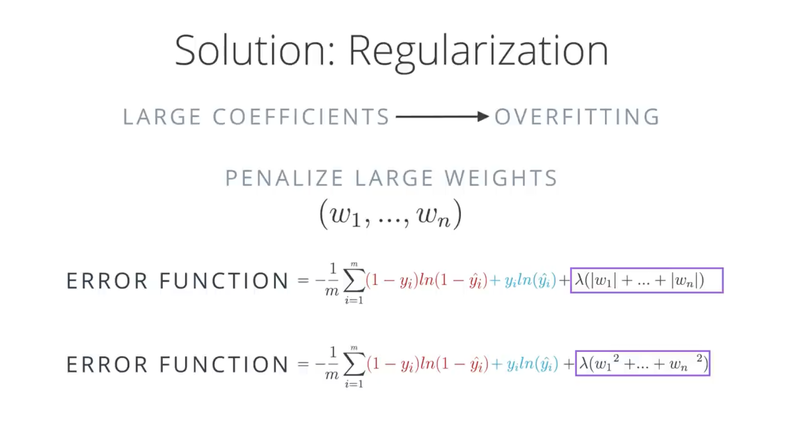

# Neural Networks
# ===============

# Perceptron Algorithm

A perceptron is one of the simplest forms of artificial neural networks - imagine it as a basic decision-maker that draws a line to separate two groups of data points. Just like how you might draw a line to separate apples from oranges based on their features, a perceptron tries to find the best dividing line between two classes of data.

## Technical Details

### Basic Formula
The prediction (ŷ) is given by:
ŷ = step(w₁x₁ + w₂x₂ + b)

Where:
- (w₁, w₂) are weights
- (x₁, x₂) are input features
- b is the bias term
- step() is the step function

### Update Rules
For a point with coordinates (p, q) and label y:

1. If correctly classified:
   - No changes needed to weights or bias

2. If classified positive but actually negative:
   - w₁ = w₁ - αp
   - w₂ = w₂ - αq
   - b = b - α

3. If classified negative but actually positive:
   - w₁ = w₁ + αp
   - w₂ = w₂ + αq
   - b = b + α

Where α is the learning rate.

### Key Points:
- Algorithm iteratively adjusts the decision boundary
- Learning continues until all points are correctly classified or maximum iterations reached
- Convergence guaranteed if data is linearly separable
- Visualized as a line in 2D space or hyperplane in higher dimensions

The final solution shows the optimal decision boundary (solid line), while the dotted lines show the algorithm's learning progression.


# Log-Loss Error Function

Think of log-loss as a way to measure how wrong your predictions are in classification problems. Instead of just counting incorrect predictions, it punishes you more heavily when you're very confident about a wrong prediction (like being 99% sure someone is a fraud when they're not) and less when you're uncertain. It's like a teacher who takes off more points when you write a wrong answer confidently versus when you show some doubt.

## Technical Details

### Basic Formula
Log Loss = -1/N ∑(y_i * log(p_i) + (1-y_i) * log(1-p_i))

Where:
- N is the number of observations
- y_i is the actual value (0 or 1)
- p_i is the predicted probability
- log is the natural logarithm

### Properties
1. Always positive
2. Lower values are better
3. Perfect predictions → Log Loss = 0
4. Approaches infinity as predictions get worse

### Key Points:
- Used primarily in binary classification
- Common in logistic regression
- Differentiable (good for gradient descent)
- Penalizes confident incorrect predictions heavily
- Rewards accurate probability estimates

### Practical Applications:
- Machine learning model evaluation
- Model comparison
- Risk assessment
- Probability calibration
- Classification tasks

Remember: Log-loss is particularly useful when you need probabilistic predictions rather than just class labels.


# Predictions

The prediction is essentially the answer we get from the algorithm:

- A discrete answer will be of the form "no" or "yes" (or 0 or 1).
- A continuous answer will be a number, normally between 0 and 1.

When our prediction gives us a continuous number between 0 and 1, this is equivalent to the probability that the given data point should belong to the given classification (e.g., a data point might get a prediction of 0.5, with this being equivalent to a 50% probability that it is correctly classified).

With our linear example, the probability is a function of the distance from the line. The further a data point is from the line, the larger the probability that it is classified correctly.

# Sigmoid Functions

The way we move from discrete predictions to continuous is to simply change our activation function from a step function to a sigmoid function. A sigmoid function is an s-shaped function that gives us:

- Output values close to 1 when the input is a large positive number
- Output values close to 0 when the input is a large negative number
- Output values close to 0.5 when the input is close to zero

The formula for our sigmoid function is:

σ(x) = 1/(1 + e^(-x))

Before our model consisted of a line with a positive region and a negative region. But now, by applying the sigmoid function, our model consists of an entire probability space where, for each point, we can get a probability that the classification is correct.


# Multi-Class Classification and Softmax

Imagine sorting different fruits into baskets - you don't just decide between apples and oranges, but also bananas, pears, and more. That's multi-class classification, and softmax is like your brain calculating the probability of which basket each fruit belongs in. Instead of a simple yes/no decision, it gives you percentage chances for each possible category.

## Technical Details

### Softmax Function
For a vector z of K classes:
```
softmax(z_i) = e^(z_i) / Σ(e^(z_j))
```
Where:
- z_i is the input for class i
- e is Euler's number
- Σ runs over all classes j

### Properties
1. Outputs sum to 1 (100%)
2. All outputs are between 0 and 1
3. Larger inputs lead to larger probabilities
4. Preserves relative order of inputs

### Key Features
- Converts raw scores to probabilities
- Handles any number of classes
- Each output represents probability for that class
- Commonly used in neural networks
- Differentiable (good for backpropagation)

### Common Applications
- Image classification
- Natural language processing
- Speech recognition
- Document categorization
- Medical diagnosis

### Loss Function
Usually paired with cross-entropy loss:
```
Loss = -Σ(y_i * log(p_i))
```
Where:
- y_i is true label (one-hot encoded)
- p_i is predicted probability

Remember: Softmax is essentially a "soft" version of the maximum function, giving proportional probabilities rather than a single winner.


# One-Hot Encoding

Imagine you're organizing a wardrobe with different types of clothing items. Instead of labeling a piece as "number 1" or "number 2", you create separate yes/no columns for each type - one for shirts, one for pants, one for dresses, etc. That's one-hot encoding - converting categorical data into a format where each category gets its own binary column.

## Technical Details

### Basic Format
For categories [A, B, C]:
```
A → [1, 0, 0]
B → [0, 1, 0]
C → [0, 0, 1]
```

### Example
Original data: "Color" column with [Red, Blue, Green]
```
Red   → [1, 0, 0]
Blue  → [0, 1, 0]
Green → [0, 0, 1]
```

### Properties
- Only one '1' per encoding (hence "one-hot")
- Rest are '0's
- Number of columns equals number of categories
- No ordinal relationship implied
- Sparse representation

### Common Applications
- Machine learning models
- Neural networks
- Text processing
- Categorical feature encoding
- Natural language processing

### Advantages
- No ordinal relationship assumed
- Equal distance between categories
- Works well with most algorithms
- Clear binary representation

### Disadvantages
- High dimensionality for many categories
- Sparse matrices
- Memory intensive
- Can be computationally expensive

Remember: One-hot encoding is essential when working with algorithms that expect numerical input but your data is categorical.


# Maximum Likelihood

Imagine you're trying to figure out if a coin is fair by flipping it many times. Maximum likelihood is like asking: "What probability of getting heads would make my actual results most likely to occur?" It's a method that finds the parameters that make your observed data most probable.

The key idea is that we want to calculate P(all), which is the product of all the independent probabilities of each point. This helps indicate how well the model performs in classifying all the points. To get the best model, we will want to maximize this probability.

## Technical Details

### Basic Formula
Log Likelihood = Σ log(P(x|θ))
Where:
- P(x|θ) is probability of data x given parameters θ
- Σ sums over all observations
- Log is used for computational convenience

### Key Concepts
1. Likelihood Function
   - Measures probability of observed data
   - Function of parameters, not data
   - Usually maximized using calculus

2. Log-Likelihood
   - Converts products to sums
   - Preserves same maximum
   - Computationally more stable

### Common Applications
- Parameter estimation
- Statistical inference
- Machine learning models
- Distribution fitting
- Regression analysis

### Steps
1. Write likelihood function
2. Take log of function
3. Find derivative
4. Set derivative to zero
5. Solve for parameters

### Advantages
- Statistically well-founded
- Often has closed-form solution
- Provides consistent estimates
- Works with many distributions

Remember: Maximum likelihood gives us the parameters that make the observed data most probable, but doesn't guarantee they're the "true" parameters.


# Cross-Entropy

The logarithm function has a very nice identity that says that the logarithm of a product is the sum of the logarithms of the factors:

log(ab) = log(a) + log(b)

So if we take the logarithm of our product, we get a sum of the logarithms of the factors.

We'll actually be taking the natural logarithm, ln, which is base e instead of base 10. In practice, everything works the same as what we showed here with log because everything gets scaled by the same factor. However, using ln is the convention, so we'll use it here as well.


The logarithm of a number between zero and one is always a negative number, so that means all of our probabilities (which are between zero and one) will give us negative results when we take their logarithm. Thus, we will want to take the negative of each of these results (i.e., multiply each one by -1).

In the end, what we calculate is a sum of negative logarithms of our probabilities, like this:

-log(0.6) - log(0.2) - log(0.1) - log(0.7) = 4.8

This is called the cross-entropy. A good model gives a high probability and the negative of a logarithm of a large number is a small number—thus, in the end:

- A high cross-entropy indicates a bad model
- A low cross-entropy indicates a good model

We can think of the negatives of these logarithms as errors at each point. The higher the probability, the lower the error—and the lower the cross-entropy. So now our goal has shifted from maximizing the probability to minimizing the cross-entropy.


Think of cross-entropy as a measure of how surprised your model is when seeing the true answers - like a test score where you get penalized more harshly for being confidently wrong than for being unsure. When you're very confident (90%) but wrong, you get a bigger penalty than when you're unsure (51%) and wrong.

## Technical Details

### Basic Formula
```
H(y,ŷ) = -Σ y_i * log(ŷ_i)
```
Where:
- y_i are true values
- ŷ_i are predicted probabilities
- Σ sums over all classes


Formula for cross-entropy

Cross-entropy = -Σ[y_i ln(p_i) + (1 - y_i)ln(1 - p_i)]

From i=1 to m

Where:
- y_i is the true label (0 or 1)
- p_i is the predicted probability
- ln is the natural logarithm
- m is the number of training examples
- Σ represents the sum over all training examples

This is the binary cross-entropy formula specifically used for binary classification problems.


### Key Properties
1. Always positive
2. Zero only when prediction equals reality
3. Higher when predictions are confidently wrong
4. Lower when predictions match true labels

### Examples
- Perfect prediction (1.0) → CE ≈ 0
- Wrong prediction (0.0) → CE → ∞
- Uncertain prediction (0.5) → Moderate CE

### Applications
- Classification problems
- Neural networks
- Model evaluation
- Information theory
- Deep learning

### Important Points
- Used as loss function
- Measures prediction quality
- Related to maximum likelihood
- Good for gradient descent
- Works with multiple classes

Remember: The goal is to minimize cross-entropy, as lower values indicate better model predictions.


# Multi-Class Cross-Entropy

Imagine a weather prediction system that needs to decide between sunny, rainy, or cloudy - not just a simple yes/no. Multi-class cross-entropy helps measure how well our predictions match reality when we have multiple possible outcomes, penalizing the model more heavily when it's confidently wrong about any of the classes.

## Technical Details

### Basic Formula
```
H(y,p) = -Σ Σ y_ij * log(p_ij)
```
Where:
- y_ij is 1 if sample i belongs to class j, else 0
- p_ij is predicted probability that sample i belongs to class j
- First Σ sums over all samples
- Second Σ sums over all classes

### Properties
1. Extends binary cross-entropy to multiple classes
2. Works with one-hot encoded labels
3. Each class contributes to total loss
4. Always non-negative
5. Zero only for perfect predictions

### Common Applications
- Deep learning classification
- Natural language processing
- Image recognition
- Speech recognition
- Document classification

### Important Considerations
- Requires normalized probabilities (sum to 1)
- Often paired with softmax activation
- More computationally intensive than binary
- Handles class imbalance naturally
- Differentiable (good for gradient descent)

Remember: The goal remains minimizing the cross-entropy, which happens when predicted probabilities match true distributions across all classes.


# Logistic Regression

Think of logistic regression like a sophisticated yes/no decision maker - similar to how a doctor might determine if a patient has a condition based on various symptoms. Despite its name, it's actually used for classification, not regression, and predicts the probability of an outcome being in a particular category.

## Technical Details

### Basic Formula
```
P(y=1) = 1 / (1 + e^(-z))
where z = wx + b
```
Where:
- w = weights
- x = input features
- b = bias term
- e = Euler's number

### Key Components
1. Sigmoid Function
   - Transforms linear input to [0,1] range
   - Creates S-shaped curve
   - Output interpreted as probability

2. Cost Function (Binary Cross-Entropy)
```
J(w,b) = -(1/m)Σ[y_i log(ŷ_i) + (1-y_i)log(1-ŷ_i)]
```

### Formula for the error function (for binary classification problems)

Error function = -(1/m)Σ[(1 - y_i)(ln(1 - ŷ_i)) + y_i ln(ŷ_i)]
From i=1 to m

And the total formula for the error is then:

E(W,b) = -(1/m)Σ[(1 - y_i)(ln(1 - σ(Wx^(i) + b))) + y_i ln(σ(Wx^(i) + b))]
From i=1 to m

For multiclass problems, the error function is:

Error function = -(1/m)Σ Σ y_ij ln(ŷ_ij)
From i=1 to m, j=1 to n

Now that we know how to calculate the error, our goal will be to minimize it.

Where:
- m is number of samples
- n is number of classes
- y_i are true values
- ŷ_i are predicted values
- W is weight matrix
- b is bias term 
- σ is sigmoid function
- x^(i) is input vector for sample i


### Properties
- Binary classification (usually)
- Outputs probabilities
- Requires numeric input features
- Assumes linear decision boundary
- Easy to interpret coefficients

### Common Applications
- Medical diagnosis
- Credit risk assessment
- Email spam detection
- Customer churn prediction
- Marketing response prediction

### Advantages
- Simple to implement
- Fast to train
- Probabilistic interpretation
- Works well with linear boundaries
- Less prone to overfitting


# Gradient Descent

Imagine rolling a ball down a hill - it naturally finds the lowest point by following the steepest path downward. That's essentially what gradient descent does in machine learning: it finds the minimum of a function by repeatedly taking steps in the direction where the function decreases most quickly (the steepest descent).

## The Calculation Process

### Step 1: The Error Function
The error function E tells us how wrong our predictions are:
```
E = -(1/m)Σ(y_i ln(ŷ_i) + (1 - y_i)ln(1 - ŷ_i))
```

### Step 2: Finding the Direction (Gradient)
We calculate partial derivatives to find which direction leads downhill:
- For weights: ∂E/∂w_j = -(y - ŷ)x_j
- For bias: ∂E/∂b = -(y - ŷ)

### Step 3: Update Rule
We update parameters by moving in the opposite direction of the gradient:
```
w'_i ← w_i + α(y - ŷ)x_i
b' ← b + α(y - ŷ)
```
Where:
- α is the learning rate (step size)
- (y - ŷ) is the prediction error
- x_i are the input features

### Significance
1. Larger errors cause bigger steps
2. Direction depends on whether prediction was too high or too low
3. Step size is controlled by learning rate α
4. Process repeats until convergence

The beauty of this calculation is its elegant form: the gradient turns out to be just the error (y - ŷ) times the input features, making it computationally efficient and intuitively meaningful.


# Gradient calculation

In the last few videos, we learned that in order to minimize the error function, we need to take some derivatives. So let's get our hands dirty and actually compute the derivative of the error function. The first thing to notice is that the sigmoid function has a really nice derivative. Namely,

σ'(x) = σ(x)(1 - σ(x))

The reason for this is the following, we can calculate it using the quotient formula:

σ'(x) = ∂/∂x 1/(1+e^-x)
       = e^-x/(1+e^-x)²
       = 1/(1+e^-x) · e^-x/(1+e^-x)
       = σ(x)(1 - σ(x))

And now, let's recall that if we have m points labelled x^(1), x^(2),...,x^(m), the error formula is:

E = -(1/m)Σ(y_i ln(ŷ_i) + (1 - y_i)ln(1 - ŷ_i))

where the prediction is given by ŷ_i = σ(Wx^(i) + b).

Our goal is to calculate the gradient of E, at a point x = (x₁,...,x_n), given by the partial derivatives

∇E = (∂/∂w₁E,...,∂/∂w_n E,∂/∂b E)

To simplify our calculations, we'll actually think of the error that each point produces, and calculate the derivative of this error. The total error, then, is the average of the errors at all the points. The error produced by each point is, simply,

E = -y ln(ŷ) - (1 - y)ln(1 - ŷ)

In order to calculate the derivative of this error with respect to the weights, we'll first calculate ∂/∂w_j ŷ. Recall that ŷ = σ(Wx + b), so:

∂/∂w_j ŷ = ∂/∂w_j σ(Wx + b)
          = σ(Wx + b)(1 - σ(Wx + b)) · ∂/∂w_j(Wx + b)
          = ŷ(1 - ŷ) · ∂/∂w_j(Wx + b)
          = ŷ(1 - ŷ) · ∂/∂w_j(w₁x₁ + ... + w_jx_j + ... + w_nx_n + b)
          = ŷ(1 - ŷ) · x_j

The last equality is because the only term in the sum which is not a constant with respect to w_j is precisely w_jx_j, which clearly has derivative x_j.

Now, we can go ahead and calculate the derivative of the error E at a point x, with respect to the weight w_j.

∂/∂w_j E = ∂/∂w_j[-y log(ŷ) - (1 - y)log(1 - ŷ)]
          = -y ∂/∂w_j log(ŷ) - (1 - y)∂/∂w_j log(1 - ŷ)
          = -y · 1/ŷ · ∂/∂w_j ŷ - (1 - y) · 1/(1-ŷ) · ∂/∂w_j(1 - ŷ)
          = -y · 1/ŷ · ŷ(1 - ŷ)x_j - (1 - y) · 1/(1-ŷ) · (-1)ŷ(1 - ŷ)x_j
          = -y(1 - ŷ) · x_j + (1 - y)ŷ · x_j
          = -(y - ŷ)x_j

A similar calculation will show us that

∂/∂b E = -(y - ŷ)

This actually tells us something very important. For a point with coordinates (x₁,...,x_n), label y, and prediction ŷ, the gradient of the error function at that point is (-(y - ŷ)x₁,...,-(y - ŷ)x_n,-(y - ŷ)). In summary, the gradient is

∇E = -(y - ŷ)(x₁,...,x_n,1).

If you think about it, this is fascinating. The gradient is actually a scalar times the coordinates of the point! And what is the scalar? Nothing less than a multiple of the difference between the label and the prediction. What significance does this have?

So, a small gradient means we'll change our coordinates by a little bit, and a large gradient means we'll change our coordinates by a lot.

If this sounds anything like the perceptron algorithm, this is no coincidence! We'll see it in a bit.

# Gradient descent step

Therefore, since the gradient descent step simply consists in subtracting a multiple of the gradient of the error function at every point, then this updates the weights in the following way:

w'_i ← w_i - α[-(y - ŷ)x_i],

which is equivalent to

w'_i ← w_i + α(y - ŷ)x_i.

Similarly, it updates the bias in the following way:

b' ← b + α(y - ŷ),

Note: Since we've taken the average of the errors, the term we are adding should be 1/m · α instead of α, but as α is a constant, then in order to simplify calculations, we'll just take 1/m · α to be our learning rate, and abuse the notation by just calling it α.


# Logistic Regression Algorithm

Think of logistic regression algorithm like teaching a computer to make yes/no decisions by gradually adjusting its decision-making weights until it gets better at predicting - similar to how you might adjust the temperature knob on an oven until you get it just right.

## Algorithm Steps

Here are our steps for logistic regression:

1. Start with random weights: w₁,...,w_n, b

2. For every point (x₁,...,x_n):
   - For i = 1...n:
     - Update w'_i ← w_i - a(ŷ - y)x_i
     - Update b' ← b - a(ŷ - y)

3. Repeat until the error is small

## Key Components

### Initial Setup
- Begin with random weights and bias
- These are the starting parameters that will be refined

### Update Process
- For each data point:
  - Calculate predicted value (ŷ)
  - Compare with actual value (y)
  - Adjust weights and bias accordingly

### Convergence
- Continue updating until error becomes acceptably small
- Error measures the difference between predictions and actual values

### Learning Rate (a)
- Controls how big steps we take in updating
- Too large: might overshoot
- Too small: slow learning


Here are the key points of contrast between gradient descent and the perceptron algorithm that Luis mentioned in the video:

# Gradient Descent

With gradient descent, we change the weights from w_i to w_i + a(y - ŷ)x_i.

# Perceptron Algorithm

With the perceptron algorithm we only change the weights on the misclassified points. If a point x is misclassified:

- We change w_i:
  - To w_i + ax_i if positive
  - To w_i - ax_i if negative

- If correctly classified: y - ŷ = 0

- If misclassified:
  - y - ŷ = 1 if positive
  - y - ŷ = -1 if negative


# PERCEPTRON ALGORITHM:

If x is misclassified:

Change w_i to {
    w_i + α x_i if positive
    w_i - α x_i if negative
}

If correctly classified: y-ŷ=0

If misclassified: {
    y-ŷ = 1 if positive
    y-ŷ = -1 if negative
}


### Neural Network Architecture

We will combine two linear models to get our non-linear model. Essentially the steps to do this are:

Calculate the probability for each model
Apply weights to the probabilities
Add the weighted probabilities
Apply the sigmoid function to the result

Multiple layers
Now, not all neural networks look like the one above. They can be way more complicated! In particular, we can do the following things:

Add more nodes to the input, hidden, and output layers.
Add more layers.
We'll see the effects of these changes in the next video.

Neural networks have a certain special architecture with layers:

The first layer is called the input layer, which contains the inputs.
The next layer is called the hidden layer, which is the set of linear models created with the input layer.
The final layer is called the output layer, which is where the linear models get combined to obtain a nonlinear model.
Neural networks can have different architectures, with varying numbers of nodes and layers:

Input nodes. In general, if we have n nodes in the input layer, then we are modeling data in n-dimensional space (e.g., 3 nodes in the input layer means we are modeling data in 3-dimensional space).
Output nodes. If there are more nodes in the output layer, this simply means we have more outputs—for example, we may have a multiclass classification model.
Layers. If there are more layers then we have a deep neural network. Our linear models combine to create nonlinear models, which then combine to create even more nonlinear models!

#### Multi-Class Classification

And here we elaborate a bit more into what can be done if our neural network needs to model data with more than one output.

When we have three or more classes, we could construct three separate neural networks—one for predicting each class. However, this is not necessary. Instead, we can add more nodes in the output layer. Each of these nodes will give us the probability that the item belongs to the given class.


# Feedforward Neural Networks

Imagine a production line where raw materials (input) move through multiple processing stations, each station transforming the material a bit, until you get the final product (output). That's how feedforward works in neural networks - information flows forward through layers, each layer transforming the data in specific ways.

## Technical Details

### Process Steps
1. Take the input vector
2. Apply a sequence of linear models and sigmoid functions
3. Combine maps to create a highly non-linear map

### Mathematical Formula
ŷ = σ ∘ W^(2) ∘ σ ∘ W^(1)(x)

Where:
- σ is the sigmoid function
- W^(1) is first layer weights
- W^(2) is second layer weights
- ∘ represents function composition

### Key Features
- One-way flow (forward only)
- Layer-by-layer processing
- Non-linear transformations
- Sequential computation
- No cycles or loops

### Applications
- Pattern recognition
- Classification tasks
- Regression problems
- Feature learning
- Function approximation

Remember: The power of feedforward networks comes from their ability to transform input through multiple layers, creating increasingly complex representations of the data.

# Backpropagation

Think of backpropagation like tracing back your steps after making a mistake to figure out exactly where things went wrong. In neural networks, it's how we calculate which weights need adjusting and by how much, by working backwards from the output error to determine each layer's contribution to that error.


Now, we're ready to get our hands into training a neural network. For this, we'll use the method known as backpropagation. In a nutshell, backpropagation will consist of:

Doing a feedforward operation.
Comparing the output of the model with the desired output.
Calculating the error.
Running the feedforward operation backwards (backpropagation) to spread the error to each of the weights.
Use this to update the weights, and get a better model.
Continue this until we have a model that is good.
Sounds more complicated than what it actually is. Let's take a look in the next few videos. The first video will show us a conceptual interpretation of what backpropagation is.


# Calculation of the derivative of the sigmoid function

Recall that the sigmoid function has a beautiful derivative, which we can see in the following calculation. This will make our backpropagation step much cleaner.

σ'(x) = ∂/∂x 1/(1+e^-x)
      = e^-x/(1+e^-x)²
      = 1/(1+e^-x) · e^-x/(1+e^-x)
      = σ(x)(1 - σ(x))

## Technical Details

### Basic Process
1. Forward Pass:
   - Input goes through network
   - Calculate predicted output
   - Measure error

2. Backward Pass:
   - Start from output error
   - Calculate gradients layer by layer
   - Propagate error backwards

### Key Components
```
Error gradient = Local gradient × Upstream gradient
```

### Chain Rule Application
- Output layer: δ = (y - ŷ) × σ'(z)
- Hidden layers: δ = (W^T δ_next) × σ'(z)
where:
- δ is error term
- σ' is derivative of activation function
- W^T is transposed weight matrix

### Update Rules
- Weights: W_new = W_old - α × (input × δ)
- Biases: b_new = b_old - α × δ

### Key Features
- Efficient gradient computation
- Layer-wise updates
- Uses chain rule of calculus
- Enables deep learning
- Computationally efficient

Remember: Backpropagation is what makes deep learning possible by efficiently computing how each weight contributes to the overall error.


# Implementing Gradient Descent


# Mean Squared Error (MSE)

Imagine measuring how far off your darts are from the bullseye by measuring the distance of each throw, squaring those distances (to make all errors positive), and then taking the average. That's essentially what MSE does - it measures the average squared difference between predictions and actual values.

## Technical Definition
```
MSE = (1/n) Σ(y_i - ŷ_i)²
```
Where:
- n is number of samples
- y_i is actual value
- ŷ_i is predicted value
- Σ sums over all samples

## Key Properties
1. Always non-negative (due to squaring)
2. Perfect predictions yield MSE = 0
3. Larger errors are penalized more heavily
4. Unit of measurement is squared
5. Sensitive to outliers

## Advantages
- Simple to compute
- Easy to differentiate
- Clear interpretation
- Good for regression problems
- Penalizes large errors more than small ones

## Disadvantages
- Scale-dependent
- Can be dominated by outliers
- Squared units make interpretation less intuitive
- May not be ideal for classification tasks

Remember: MSE is particularly useful when larger errors are more problematic than smaller ones, as the squaring effect emphasizes bigger differences.


# Gradient Descent with Squared Errors

We want to find the weights for our neural networks. Let's start by thinking about the goal. The network needs to make predictions as close as possible to the real values. To measure this, we use a metric of how wrong the predictions are, the error. A common metric is the sum of the squared errors (SSE):

E = 1/2 ΣΣ[y_j^μ - ŷ_j^μ]²
        μ  j

where ŷ is the prediction and y is the true value, and you take the sum over all output units j and another sum over all data points μ. This might seem like a really complicated equation at first, but it's fairly simple once you understand the symbols and can say what's going on in words.

First, the inside sum over j. This variable j represents the output units of the network. So this inside sum is saying for each output unit, find the difference between the true value y and the predicted value from the network ŷ, then square the difference, then sum up all those squares.

Then the other sum over μ is a sum over all the data points. So, for each data point you calculate the inner sum of the squared differences for each output unit. Then you sum up those squared differences for each data point. That gives you the overall error for all the output predictions for all the data points.

The SSE is a good choice for a few reasons. The square ensures the error is always positive and larger errors are penalized more than smaller errors. Also, it makes the math nice, always a plus.

Remember that the output of a neural network, the prediction, depends on the weights

ŷ_j^μ = f(Σ w_ij x_i^μ)
           i

and accordingly the error depends on the weights

E = 1/2 ΣΣ[y_j^μ - f(Σ w_ij x_i^μ)]²
        μ  j            i

We want the network's prediction error to be as small as possible and the weights are the knobs we can use to make that happen. Our goal is to find weights w_ij that minimize the squared error E. To do this with a neural network, typically you'd use gradient descent.


As Luis said, with gradient descent, we take multiple small steps towards our goal. In this case, we want to change the weights in steps that reduce the error. Continuing the analogy, the error is our mountain and we want to get to the bottom. Since the fastest way down a mountain is in the steepest direction, the steps taken should be in the direction that minimizes the error the most. We can find this direction by calculating the gradient of the squared error.

Gradient is another term for rate of change or slope. If you need to brush up on this concept, check out Khan Academy's [great lectures] on the topic.

To calculate a rate of change, we turn to calculus, specifically derivatives. A derivative of a function f(x) gives you another function f'(x) that returns the slope of f(x) at point x. For example, consider f(x) = x². The derivative of x² is f'(x) = 2x. So, at x = 2, the slope is f'(2) = 4. Plotting this out, it looks like:

[Note: The text contains a link that I cannot process, but I've included it in brackets to maintain the original format]

The gradient is just a derivative generalized to functions with more than one variable. We can use calculus to find the gradient at any point in our error function, which depends on the input weights. You'll see how the gradient descent step is derived on the next page.

Below I've plotted an example of the error of a neural network with two inputs, and accordingly, two weights. You can read this like a topographical map where points on a contour line have the same error and darker contour lines correspond to larger errors.

At each step, you calculate the error and the gradient, then use those to determine how much to change each weight. Repeating this process will eventually find weights that are close to the minimum of the error function, the black dot in the middle.


Caveats
Since the weights will just go wherever the gradient takes them, they can end up where the error is low, but not the lowest. These spots are called local minima. If the weights are initialized with the wrong values, gradient descent could lead the weights into a local minimum, illustrated below.

If we want our neural network to make reasonable predictions, we need to have a way of setting the weights. To address this, we can present the neural network with data that we know to be true and then set the model parameters (the weights) to match that data.

The most essential component we need for this is some measure of how bad our predictions are. The measure we'll use is the sum of the squared errors (SSE), which looks like this:

E = 1/2 Σ(y^μ - ŷ^μ)²
       μ

The SSE is a measure of our network's performance. If it's high, the network is making bad predictions. If it's low, the network is making good predictions. Minimizing the SSE is our goal in gradient descent:

- Starting at some random weight, we make a step in the direction towards the minimum, opposite to the gradient or slope.

- If we take many steps, always descending down a gradient, eventually the weights will find the minimum of the error function.


# Mean Square Error

We're going to make a small change to how we calculate the error here. Instead of the SSE, we're going to use the mean of the square errors (MSE). Now that we're using a lot of data, summing up all the weight steps can lead to really large updates that make the gradient descent diverge. To compensate for this, you'd need to use a quite small learning rate. Instead, we can just divide by the number of records in our data, m to take the average. This way, no matter how much data we use, our learning rates will typically be in the range of 0.01 to 0.001. Then, we can use the MSE (shown below) to calculate the gradient and the result is the same as before, just averaged instead of summed.

E = 1/2m Σ(y^μ - ŷ^μ)²
          μ

Here's the general algorithm for updating the weights with gradient descent:

- Set the weight step to zero: Δw_i = 0

- For each record in the training data:
  - Make a forward pass through the network, calculating the output ŷ = f(Σ_i w_ix_i)
  - Calculate the error term for the output unit, δ = (y - ŷ) * f'(Σ_i w_ix_i)
  - Update the weight step Δw_i = Δw_i + δx_i

- Update the weights w_i = w_i + ηΔw_i/m where η is the learning rate and m is the number of records. Here we're averaging the weight steps to help reduce any large variations in the training data.

- Repeat for e epochs.

You can also update the weights on each record instead of averaging the weight steps after going through all the records.

Remember that we're using the sigmoid for the activation function, f(h) = 1/(1 + e^-h)

And the gradient of the sigmoid is f'(h) = f(h)(1 - f(h))

where h is the input to the output unit,

h = Σ_i w_ix_i


### Backpropagation

Now we've come to the problem of how to make a multilayer neural network learn. Before, we saw how to update weights with gradient descent. The backpropagation algorithm is just an extension of that, using the chain rule to find the error with the respect to the weights connecting the input layer to the hidden layer (for a two layer network).

To update the weights to hidden layers using gradient descent, you need to know how much error each of the hidden units contributed to the final output. Since the output of a layer is determined by the weights between layers, the error resulting from units is scaled by the weights going forward through the network. Since we know the error at the output, we can use the weights to work backwards to hidden layers.

For example, in the output layer, you have errors δᵒₖ attributed to each output unit k. Then, the error attributed to hidden unit j is the output errors, scaled by the weights between the output and hidden layers (and the gradient):

δʰⱼ = ∑ Wⱼₖδᵒₖf'(hⱼ)

Then, the gradient descent step is the same as before, just with the new errors:

Δwᵢⱼ = ηδʰⱼxᵢ

where wᵢⱼ are the weights between the inputs and hidden layer and xᵢ are input unit values. This form holds for however many layers there are. The weight steps are equal to the step size times the output error of the layer times the values of the inputs to that layer

Δwₚq = ηδoutput Vᵢₙ

Here, you get the output error, δoutput, by propagating the errors backwards from higher layers. And the input values, Vᵢₙ are the inputs to the layer, the hidden layer activations to the output unit for example.

<br>


<br>


Let's walk through the steps of calculating the weight updates for a simple two layer network. Suppose there are two input values, one hidden unit, and one output unit, with sigmoid activations on the hidden and output units. The following image depicts this network. (Note: the input values are shown as nodes at the bottom of the image, while the network's output value is shown as ŷ at the top. The inputs themselves do not count as a layer, which is why this is considered a two layer network.)

[Network diagram showing weights and connections]

Assume we're trying to fit some binary data and the target is y = 1. We'll start with the forward pass, first calculating the input to the hidden unit

h = ∑ᵢwᵢxᵢ = 0.1 × 0.4 - 0.2 × 0.3 = -0.02

and the output of the hidden unit

a = f(h) = sigmoid(-0.02) = 0.495.

Using this as the input to the output unit, the output of the network is

ŷ = f(W · a) = sigmoid(0.1 × 0.495) = 0.512.

With the network output, we can start the backwards pass to calculate the weight updates for both layers. Using the fact that for the sigmoid function f'(W · a) = f(W · a)(1 - f(W · a)), the error term for the output unit is

δᵒ = (y - ŷ)f'(W · a) = (1 - 0.512) × 0.512 × (1 - 0.512) = 0.122.

Now we need to calculate the error term for the hidden unit with backpropagation. Here we'll scale the error term from the output unit by the weight W connecting it to the hidden unit. For the hidden unit error term, δʰⱼ = ∑ₖ Wⱼₖδᵒₖf'(hⱼ), but since we have one hidden unit and one output unit, this is much simpler.

δʰ = Wδᵒf'(h) = 0.1 × 0.122 × 0.495 × (1 - 0.495) = 0.003

Now that we have the errors, we can calculate the gradient descent steps. The hidden to output weight step is the learning rate, times the output unit error, times the hidden unit activation value.

ΔW = ηδᵒa = 0.5 × 0.122 × 0.495 = 0.0302

Then, for the input to hidden weights wᵢⱼ, it's the learning rate times the hidden unit error, times the input values.

Δwᵢ = ηδʰxᵢ = (0.5 × 0.003 × 0.1, 0.5 × 0.003 × 0.3) = (0.00015, 0.00045)

From this example, you can see one of the effects of using the sigmoid function for the activations. The maximum derivative of the sigmoid is 0.25, so the errors in the output layer get reduced by at least 75%, and errors in the hidden layer are scaled down by at least 93.75%! You can see that if you have a lot of layers, using a sigmoid activation function will quickly reduce the weight steps to tiny values in layers near the input. This is known as the vanishing gradient problem. Later in the course you'll learn about other activation functions that perform better in this regard and are more commonly used in modern network architectures.


Now we've seen that the error term for the output layer is

δₖ = (yₖ - ŷₖ)f'(aₖ)

and the error term for the hidden layer is

δⱼ = ∑[wⱼₖδₖ]f'(hⱼ)

For now we'll only consider a simple network with one hidden layer and one output unit. Here's the general algorithm for updating the weights with backpropagation:

• Set the weight steps for each layer to zero
  • The input to hidden weights Δwᵢⱼ = 0
  • The hidden to output weights ΔWⱼ = 0

• For each record in the training data:
  • Make a forward pass through the network, calculating the output ŷ
  • Calculate the error gradient in the output unit, δᵒ = (y - ŷ)f'(z) where z = ∑ⱼ Wⱼaⱼ, the input to the output unit.
  • Propagate the errors to the hidden layer δʰⱼ = δᵒWⱼf'(hⱼ)
  • Update the weight steps:
    • ΔWⱼ = ΔWⱼ + δᵒaⱼ
    • Δwᵢⱼ = Δwᵢⱼ + δʰⱼaᵢ

• Update the weights, where η is the learning rate and m is the number of records:
  • Wⱼ = Wⱼ + ηΔWⱼ/m
  • wᵢⱼ = wᵢⱼ + ηΔwᵢⱼ/m
  • Repeat for e epochs.


# Training Neural Networks

We've learned how to build a deep neural network and how to train it to fit our data. However, there are many things that can fail when training a neural network. For example:

Our architecture can be poorly chosen
Our data can be noisy
Our model can take far too long to run

We need to learn ways to optimize the training of our models—and that's what we'll be getting into in this lesson! By the end of this lesson, you'll be able to:

Separate data into testing and training sets in order to objectively test a model and ensure that it can generalize beyond the training data.
Distinguish between underfitting and overfitting, and identify the underlying causes of each.
Use early stopping to end the training process at a point that minimizes both testing error and training error.
Apply regularization to reduce overfitting.
Use dropout to randomly turn off portions of a network during training and ensure no single part of the network dominates the resulting model disproportionately.
Use random restart to avoid getting stuck in local minima.
Use the hyperbolic tangent function and ReLU to improve gradient descent.
Distinguish between batch gradient descent vs stochastic gradient descent.
Adjust the learning rate of the gradient descent algorithm in order to improve model optimization.
Use momentum to avoid getting stuck in local minima.


When comparing models to determine which is better, we need a way of objectively testing them. To accomplish this, we can divide our data into two parts:

A training set that we use to train the models
A testing set that we use only for testing the models
While training, we only use the training data—we set the testing data aside and don't use it as input for our learning algorithm.

Then, once our models are trained, we reintroduce the testing set. A model that performs well on the training data may not perform well on the testing data. We'll see one reason for this, called overfitting, next.


When we train our models, it is entirely possible to get them to a point where they perform very well on our training data—but then perform very poorly on our testing data. Two common reasons for this are underfitting and overfitting

### Underfitting

Underfitting means that our model is too simplistic. There is a poor fit between our model and the data because we have oversimplified the problem.
Underfitting is sometimes referred to as error due to bias. Our training data may be biased and this bias may be incorporated into the model in a way that oversimplifies it.
For example, suppose we train an image classifier to recognize dogs. And suppose that the only type of animal in the training set is a dog. Perhaps the model learns a biased and overly simple rule like, "if it has four legs it is a dog". When we then test our model on some data that has other animals, it may misclassify a cat as a dog—in other words, it will underfit the data because it has error due to bias.

### Overfitting

Overfitting means that our model is too complicated. The fit between our model and the training data is too specific—the model will perform very well on the training data but will fail to generalize to new data.
Overfitting is sometimes referred to as error due to variance. This means that there are random or irrelevant differences among the data points in our training data and we have fit the model so closely to these irrelevant differences that it performs poorly when we try to use it with our testing data.
For example, suppose we want our image classifier to recognize dogs, but instead we train it to recognize "dogs that are yellow, orange, or grey." If our testing set includes a dog that is brown, for example, our model will put it in a separate class, which was not what we wanted. Our model is too specific—we have fit the data to some unimportant differences in the training data and now it will fail to generalize.

Applying This to Neural Networks
Generally speaking, underfitting tends to happen with neural networks that have overly simple architecture, while overfitting tends to happen with models that are highly complex.

The bad news is, it's really hard to find the right architecture for a neural network. There is a tendency to create a network that either has overly simplistic architecture or overly complicated architecture. In general terms, the approach we will take is to err on the side of an overly complicated model, and then we'll apply certain techniques to reduce the risk of overfitting.


### Early Stopping

When training our neural network, we start with random weights in the first epoch and then change these weights as we go through additional epochs. Initially, we expect these changes to improve our model as the neural network fits the training data more closely. But after some time, further changes will start to result in overfitting.

We can monitor this by measuring both the training error and the testing error. As we train the network, the training error will go down—but at some point, the testing error will start to increase. This indicates overfitting and is a signal that we should stop training the network prior to that point. We can see this relationship in a model complexity graph like this one:

<br>


<br>


Have a look at the graph and make sure you can recognize the following:

On the Y-axis, we have a measure of the error and on the X-axis we have a measure of the complexity of the model (in this case, it's the number of epochs).
On the left we have high testing and training error, so we're underfitting.
On the right, we have high testing error and low training error, so we're overfitting.
Somewhere in the middle, we have our happy Goldilocks point (the point that is "just right").
In summary, we do gradient descent until the testing error stops decreasing and starts to increase. At that moment, we stop. This algorithm is called early stopping and is widely used to train neural networks.


Large Co-efficients -> Overfitting
Small Co-efficients -> Underfitting


<br>



<br>


### Considering the Activation Functions

A key point here is to consider the activation functions of these two equations:


<br>


<br>

When we apply sigmoid to small values such as 
x1 + x2, we get the function on the left, which has a nice slope for gradient descent.
When we multiply the linear function by 10 and take sigmoid of 10x1 + 10x2 , our predictions are much better since they're closer to zero and one. But the function becomes much steeper and it's much harder to do graident descent.

Conceptually, the model on the right is too certain and it gives little room for applying gradient descent. Also, the points that are classified incorrectly in the model on the right will generate large errors and it will be hard to tune the model to correct them.


# Regularization

Now the question is, how do we prevent this type of overfitting from happening? The trouble is that large coefficients are leading to overfitting, so what we need to do is adjust our error function by, essentially, penalizing large weights.

If you recall, our original error function looks like this:

-1/m ∑ᵢ₌₁ᵐ (1 - yᵢ)ln(1 - ŷᵢ) + yᵢln(ŷᵢ)

We want to take this and add a term that is big when the weights are big. There are two ways to do this. One way is to add the sums of absolute values of the weights times a constant lambda:

+λ(|w₁| + ... + |wₙ|)

The other one is to add the sum of the squares of the weights times that same constant:

+λ(w₁² + ... + wₙ²)

In both cases, these terms are large if the weights are large.


L1 vs L2 Regularization
The first approach (using absolute values) is called L1 regularization, while the second (using squares) is called L2 regularization. Here are some general guidelines for deciding between the two:

L1 Regularization
L1 tends to result in sparse vectors. That means small weights will tend to go to zero.
If we want to reduce the number of weights and end up with a small set, we can use L1.
L1 is also good for feature selection. Sometimes we have a problem with hundreds of features, and L1 regularization will help us select which ones are important, turning the rest into zeroes.

L2 Regularization
L2 tends not to favor sparse vectors since it tries to maintain all the weights homogeneously small. L2 gives better results for training models so it's the one we'll use the most.


# Activation Functions

Think of activation functions as the decision-makers in neural networks - they determine whether and how strongly each neuron should "fire" based on its inputs. Just like neurons in our brain don't fire in a simple linear way, these functions introduce non-linearity that allows neural networks to learn complex patterns.

Mathematically, activation functions transform the output of each neuron:

**Sigmoid**: σ(x) = 1/(1 + e⁻ˣ)
- Output range: (0,1)
- Gradient: f'(x) = σ(x)(1 - σ(x))
- Key issues:
  - Saturating gradients: f'(x) → 0 as |x| → ∞
  - Not zero-centered
  - Computationally expensive

**ReLU**: f(x) = max(0,x)
- Output range: [0,∞)
- Gradient: f'(x) = {1 if x > 0, 0 otherwise}
- Benefits:
  - No saturation for positive values
  - Sparse activation (~50%)
  - Computationally efficient
- Issue: "Dying ReLU" problem

**Modern Variants**:
1. Leaky ReLU: f(x) = {x if x > 0, αx otherwise}
2. ELU: f(x) = {x if x > 0, α(e^x - 1) otherwise}
3. SELU: Self-normalizing variant


# Regularization

Think of regularization as putting a leash on your neural network - it prevents the model from becoming too complex and "memorizing" the training data. Just like how we want students to learn general concepts rather than memorize specific examples, regularization helps neural networks learn patterns that generalize well to new data.

Mathematically, regularization modifies the loss function L(θ) by adding penalty terms:

**L₁ Regularization**:
L_reg(θ) = L(θ) + λ∑|wᵢ|
- Gradient: ∂Ω/∂w = sign(w)
- Properties:
  - Creates sparse solutions (many w = 0)
  - Effective feature selection
  - Non-differentiable at w = 0

**L₂ Regularization**:
L_reg(θ) = L(θ) + λ∑wᵢ²
- Gradient: ∂Ω/∂w = 2w
- Properties:
  - Weight decay interpretation: w ← w(1 - 2λη) - η∂L/∂w
  - Smoother solutions
  - All weights shrink proportionally

**Combined Approaches**:
- Elastic Net: α∑|wᵢ| + (1-α)∑wᵢ²
- Dropout: Randomly zero out units (p: keep probability)
  Training: y = f(Wx) * mask/p
  Inference: y = f(Wx)
- Early Stopping: Monitor validation error

The strength parameter λ controls the trade-off between fitting the data and keeping weights small.


### Dropout 

When training a neural network, sometimes one part of the network has very large weights and it ends up dominating the training, while another part of the network doesn't really play much of a role (so it doesn't get trained).

To solve this, we can use a method called dropout in which we turn part of the network off and let the rest of the network train:

We go through the epochs and randomly turn off some of the nodes. This forces the other nodes to pick up the slack and take a larger part in the training.
To drop nodes, we give the algorithm a parameter that indicates the probability that each node will get dropped during each epoch. For example, if we set this parameter to 0.2, this means that during each epoch, each node has a 20% probability of being turned off.
Note that some nodes may get turned off more than others and some may never get turned off. This is OK since we're doing it over and over; on average, each node will get approximately the same treatment.


# Local Minima and Random Restart

The optimization landscape of neural networks is incredibly complex, with many peaks, valleys, and saddle points. When training gets stuck in a poor local minimum, we might end up with a suboptimal solution despite the network appearing to be "trained". Random restart is one of the fundamental strategies to escape these local minima.

Mathematically, the challenge can be formalized as:

**Local Minimum Problem**:
- For weight vector w, a local minimum occurs when:
  - ∇L(w) = 0 (gradient is zero)
  - ∇²L(w) is positive definite (all eigenvalues > 0)
- Not all local minima are created equal:
  L(w_local) > L(w_global)

**Random Restart Techniques**:
1. Basic Random Restart:
   - Initialize: w_new = w_0 + ϵ, ϵ ~ N(0,σ²)
   - Run multiple times with different seeds
   - Keep best solution: w* = argmin_w L(w)

2. Momentum-Based Escape:
   - Update rule: v_t = μv_(t-1) - η∇L(w)
   - Weight update: w_t = w_(t-1) + v_t
   - μ: momentum coefficient

3. Learning Rate Scheduling:
   - η_t = η_0 / √t
   - Allows larger steps early, finer tuning later

**Practical Considerations**:
- Number of restarts needed increases with dimension
- Trade-off between exploration (high σ²) and exploitation
- Computational cost vs. solution quality
- Can combine with other techniques (e.g., simulated annealing)


### Other Activation Functions

#### The Vanishing Gradient Problem

To summarize the vanishing gradient problem:

- The sigmoid curve gets pretty flat on the sides, so if we calculate the derivative at a point far to the right or far to the left, this derivative is almost zero.
- This is problematic because it is the derivative that tells us what direction to move in. This is especially problematic in most linear perceptrons.


## Hyperbolic Tangent

One alternative activation function is the hyperbolic tangent, which is given by the formula:

tanh(x) = (e^x - e^(-x))/(e^x + e^(-x))

This is similar to sigmoid, but since our range is between minus one and one, the derivatives are larger—and this small difference has a big impact on neural networks.

## Rectified Linear Unit (ReLU)

Another very popular activation function is the Rectified Linear Unit (ReLU). The formula is:

relu(x) = {x if x ≥ 0
          0 if x < 0

In other words:
• If the input is positive, return the same value.
• If the input is negative, return zero.

This function is used a lot instead of the sigmoid and it can improve the training significantly without sacrificing much accuracy (since the derivative is one if the number is positive).


### Batch Gradient Descent

First, let's review our batch gradient descent algorithm:

In order to decrease error, we take a bunch of steps following the negative of the gradient, which is the error function.
Each step is called an epoch.
In each epoch, we take our input (all of our data) and run it through the entire neural network.
Then we find our predictions and calculate the error (how far the predictions are from the actual labels).
Finally, we back-propagate this error in order to update the weights in the neural network. This will give us a better boundary for predicting our data.
If we have a large number of data points then this process will involve huge matrix computations, which would use a lot of memory.

### Stochastic Gradient Descent

To expedite this, we can use only some of our data at each step. If the data is well-distributed then a subset of the data can give us enough information about the gradient.

This is the idea behind stochastic gradient descent. We take small subsets of the data and run them through the neural network, calculating the gradient of the error function based on these points and moving one step in that direction.

We still want to use all our data, so what we do is the following:

Split the data into several batches.
Take the points in the first batch and run them through the neural network.
Calculate the error and its gradient.
Back-propagate to update the weights (which will define a better boundary region).
Repeat the above steps for the rest of the batches.
Notice that with this approach we take multiple steps, whereas with batch gradient descent we take only one step with all the data. Each step may be less accurate, but, in practice, it's much better to take a bunch of slightly inaccurate steps than to take only one good one.


#### Learning Rate Decay

Here are some key ideas to keep in mind when choosing a learning rate:

If the learning rate is large:

This means the algorithm is taking large steps, which can make it faster.
However, the large steps may cause it to miss (overshoot) the minimum.
If the learning learning rate is small:

This means the algorithm is taking small steps, which can make it slower.
However, it will make steady progress and have a better chance of arriving at the local minimum.
If your model is not working, a good general rule of thumb is to try decreasing the learning rate. The best learning rates are those that decrease as the algorithm is getting closer to a solution.


### Momentum

Another way to solve the local minimum problem is with momentum. Momentum is a constant β between 0 and 1.

We use β to get a sort of weighted average of the previous steps:

   step(n) + βstep(n - 1) + β²step(n - 2) + β³step(n - 3) + ...

The previous step gets multiplied by 1, the one before it gets multiplied by β, the one before that by β², the one before that by β³, and so on. Because β has a value between 0 and 1, raising it to increasingly large powers means that the value will get smaller and smaller. In this way, the steps that happened a long time ago will be multiplied by tiny values and thus matter less than the ones that happened recently.

This can get us over "humps" and help us discover better minima. Once we get to the global minimum, the momentum will still be pushing us away, but not as much.


In this lesson, we learned ways to optimize the training of our models. If you followed along with everything, you now know how to:

- Separate data into testing and training sets in order to objectively test a model and ensure that it can generalize beyond the training data.
- Distinguish between underfitting and overfitting, and identify the underlying causes of each.
- Use early stopping to end the training process at a point that minimizes both testing error and training error.
- Apply regularization to reduce overfitting.
- Use dropout to randomly turn off portions of a network during training and ensure no single part of the network dominates the resulting model disproportionately.
- Use random restart to avoid getting stuck in local minima.
- Use the hyperbolic tangent function and ReLU to improve gradient descent.
- Distinguish between batch gradient descent vs stochastic gradient descent.
Adjust the learning rate of the gradient descent algorithm in order to improve model optimization.
Use momentum to avoid getting stuck in local minima.


### Transfer Learning

The Four Main Cases When Using Transfer Learning
Transfer learning involves taking a pre-trained neural network and adapting the neural network to a new, different data set.

Depending on both:

- the size of the new data set, and
- the similarity of the new data set to the original data set

the approach for using transfer learning will be different. There are four main cases:

1. new data set is small, new data is similar to original training data
2. new data set is small, new data is different from original training data
3. new data set is large, new data is similar to original training data
4. new data set is large, new data is different from original training data


<br>


<br>

A large data set might have one million images. A small data could have two-thousand images. The dividing line between a large data set and small data set is somewhat subjective. Overfitting is a concern when using transfer learning with a small data set.

Images of dogs and images of wolves would be considered similar; the images would share common characteristics. A data set of flower images would be different from a data set of dog images.

Each of the four transfer learning cases has its own approach. In the following sections, we will look at each case one by one.

Demonstration Network

To explain how each situation works, we will start with a generic pre-trained convolutional neural network and explain how to adjust the network for each case. Our example network contains three convolutional layers and three fully connected layers:


<br>


<br>


Here is an generalized overview of what the convolutional neural network does:

- the first layer will detect edges in the image
- the second layer will detect shapes
- the third convolutional layer detects higher level features

Each transfer learning case will use the pre-trained convolutional neural network in a different way.

#### Case 1: Small Data Set, Similar Data


<br>


<br>

If the new data set is small and similar to the original training data:

- slice off the end of the neural network
- add a new fully connected layer that matches the number of classes in the new data set
- randomize the weights of the new fully connected layer; freeze all the weights from the pre-trained network
- train the network to update the weights of the new fully connected layer

To avoid overfitting on the small data set, the weights of the original network will be held constant rather than re-training the weights.

Since the data sets are similar, images from each data set will have similar higher level features. Therefore most or all of the pre-trained neural network layers already contain relevant information about the new data set and should be kept.

Here's how to visualize this approach:

<br>


<br>

#### Case 2: Small Data Set, Different Data

<br>


<br>

If the new data set is small and different from the original training data:

- slice off most of the pre-trained layers near the beginning of the network
- add to the remaining pre-trained layers a new fully connected layer that matches the number of classes in the new data set
- randomize the weights of the new fully connected layer; freeze all the weights from the pre-trained network
- train the network to update the weights of the new fully connected layer


Because the data set is small, overfitting is still a concern. To combat overfitting, the weights of the original neural network will be held constant, like in the first case.

But the original training set and the new data set do not share higher level features. In this case, the new network will only use the layers containing lower level features.

Here is how to visualize this approach:

<br>


<br>


#### Case 3: Large Data Set, Similar Data


<br>


<br>


If the new data set is large and similar to the original training data:

- remove the last fully connected layer and replace with a layer matching the number of classes in the new data set
- randomly initialize the weights in the new fully connected layer
- initialize the rest of the weights using the pre-trained weights
- re-train the entire neural network

Overfitting is not as much of a concern when training on a large data set; therefore, you can re-train all of the weights.

Because the original training set and the new data set share higher level features, the entire neural network is used as well.

Here is how to visualize this approach:


<br>


<br>

#### Case 4: Large Data Set, Different Data


<br>


<br>

If the new data set is large and different from the original training data:

- remove the last fully connected layer and replace with a layer matching the number of classes in the new data set
- retrain the network from scratch with randomly initialized weights
- alternatively, you could just use the same strategy as the "large and similar" data case

Even though the data set is different from the training data, initializing the weights from the pre-trained network might make training faster. So this case is exactly the same as the case with a large, similar data set.

If using the pre-trained network as a starting point does not produce a successful model, another option is to randomly initialize the convolutional neural network weights and train the network from scratch.

Here is how to visualize this approach:


<br>


<br>


# Programming Transformer Neural Networks in PyTorch


# Understanding Tokenization in NLP

Tokenization is a fundamental preprocessing step in Natural Language Processing (NLP) that involves breaking down text into smaller units called tokens. These tokens can be words, characters, subwords, or symbols, depending on the chosen tokenization method.

## Basic Types of Tokenization

### Word Tokenization
Word tokenization splits text into individual words. For example:
"The cat sat on the mat" → ["The", "cat", "sat", "on", "the", "mat"]

This method faces challenges with:
- Contractions (don't, won't)
- Hyphenated words (state-of-the-art)
- Special characters and punctuation
- Numbers and dates

### Character Tokenization
Character tokenization breaks text into individual characters, including spaces and punctuation. This approach is particularly useful for languages without clear word boundaries, like Chinese or Japanese.

### Subword Tokenization
Modern NLP systems often use subword tokenization, which breaks words into meaningful subunits. Popular algorithms include:

- BPE (Byte Pair Encoding): Iteratively merges most frequent character pairs
- WordPiece: Similar to BPE but uses likelihood rather than frequency
- SentencePiece: Treats the text as a sequence of unicode characters
- Unigram: Uses a probabilistic model to find the optimal subword units

## Advanced Considerations

### Language-Specific Challenges
Different languages require different tokenization approaches:
- English: Dealing with contractions, compound words
- Chinese/Japanese: No spaces between words
- German: Long compound words
- Arabic: Complex morphology and diacritics

### Special Token Handling
Modern tokenizers typically add special tokens for:
- Start of sequence [SOS]
- End of sequence [EOS]
- Padding [PAD]
- Unknown words [UNK]
- Masks for masked language modeling [MASK]

### Impact on Model Performance
Tokenization choices significantly affect:
- Vocabulary size
- Model complexity
- Training efficiency
- Out-of-vocabulary word handling
- Overall model performance

## Best Practices

- Choose tokenization method based on your specific task and language
- Consider vocabulary size implications
- Handle edge cases (URLs, emails, special characters)
- Maintain consistency between training and inference
- Document tokenization choices for reproducibility
- Test tokenization on representative data samples

## Implementation Considerations

When implementing tokenization:
- Use established libraries (NLTK, spaCy, transformers)
- Consider preprocessing steps (lowercasing, removing special characters)
- Handle edge cases and errors gracefully
- Optimize for performance with large datasets
- Maintain consistent tokenization across your pipeline

Tokenization remains a critical step in NLP that can significantly impact model performance. Understanding its nuances and choosing the appropriate method for your specific use case is essential for successful NLP applications.


#### The Bag of Words Model

How It Works
The Bag of Words model uses a binary vector as an input.
Each value in the vector is either one or zero, created from input token IDs.

#### Steps Involved

1. Tokenization:
  - Start with an input sentence and split it into individual tokens.
  - Convert all words to lowercase.
  - Remove tokens for words that have very little useful information, such as "a," "the," and other stop words.
  - Convert each token into a corresponding token ID.

2. Creating Input Vectors:
  - For each token ID, if the ID value is, for example, 345, set one in the corresponding position in the vector.
  - Repeat this process for all other input IDs.
  - The input vector will have as many elements as there are unique words in the vocabulary. For instance, if the vocabulary has 65,000 words, the input vector will have 65,000 elements.
  Model Training and Application


With this binary vector, we can pass the input to a neural network or other machine learning models.
Training a model with these input vectors allows it to perform tasks like classifying text (e.g., determining if messages are spam or non-spam).
Limitations of the Bag of Words Model
Ignores Word Order: The model does not consider the sequence in which words appear, which is crucial for understanding the context.
Ignores Grammatical Structure: It overlooks punctuation and sentence structure, missing out on important linguistic nuances.
Limited Semantic Meaning: The model's token representation only indicates the presence of words, lacking deeper semantic insights.
Handling Unseen Words: The model struggles with words not seen during training, as they are not represented in the vocabulary.
Moving Beyond Simple Models
While the Bag of Words model can be effective for some simple tasks, it often falls short for more complex applications. To address these limitations, we will explore two key improvements:

Better Word Representation: Methods that provide more nuanced and semantically rich representations of words.
Advanced Neural Network Architectures: More sophisticated models designed for NLP tasks, capable of capturing complex patterns and relationships in text.
These advancements will help us build more robust and effective machine learning models for processing and understanding natural language.


# Understanding Embedding Vectors in Machine Learning

Embedding vectors are dense, continuous numerical representations of discrete data in a lower-dimensional space. They capture semantic relationships and meaningful patterns in the data.

## Core Concepts

### Definition and Purpose
Embeddings convert categorical or discrete data into continuous vector representations where:
- Similar items are mapped to nearby points in the vector space
- Relationships between items are preserved through vector arithmetic
- Complex patterns can be captured in relatively few dimensions

### Key Properties
- Dimensionality: Typically ranges from 50 to 1000 dimensions
- Density: All elements are meaningful, unlike sparse one-hot encodings
- Learned: Values are trained to optimize for specific tasks
- Transferable: Can be reused across different downstream tasks

## Types of Embeddings

### Word Embeddings
- Word2Vec: Uses skip-gram or CBOW architecture
- GloVe: Based on global word co-occurrence statistics
- FastText: Incorporates subword information
- BERT embeddings: Contextual representations

### Other Common Applications
- Document embeddings
- Graph embeddings
- Product embeddings
- User embeddings
- Image embeddings

## Training Methods

### Supervised Learning
- Train embeddings directly for a specific task
- Use labeled data to guide the learning process
- Optimize for task-specific objectives

### Self-Supervised Learning
- Predict context from input
- Masked language modeling
- Contrastive learning approaches
- Next sentence prediction

### Transfer Learning
- Use pre-trained embeddings
- Fine-tune for specific tasks
- Leverage learned representations

## Practical Applications

### Natural Language Processing
- Semantic similarity
- Document classification
- Machine translation
- Question answering
- Named entity recognition

### Recommender Systems
- User-item interactions
- Content-based filtering
- Collaborative filtering
- Cold-start problem solutions

## Technical Considerations

### Dimensionality
- Higher dimensions capture more information
- Too many dimensions lead to computational overhead
- Too few dimensions limit expressive power
- Need to balance accuracy vs. efficiency

### Quality Assessment
- Intrinsic evaluation (similarity tasks)
- Extrinsic evaluation (downstream performance)
- Visualization techniques (t-SNE, PCA)
- Analogy testing

### Implementation Best Practices
- Normalize vectors when appropriate
- Handle out-of-vocabulary items
- Consider computational resources
- Cache frequently used embeddings
- Use appropriate distance metrics

## Advanced Topics

### Multi-Modal Embeddings
- Combine different types of data
- Cross-modal retrieval
- Joint representation learning
- Alignment between modalities

### Dynamic Embeddings
- Time-aware representations
- Adaptive embeddings
- Online learning approaches
- Contextual updates

### Challenges and Solutions
- Handling rare items
- Scaling to large vocabularies
- Addressing bias in embeddings
- Maintaining interpretability
- Efficient storage and retrieval

Embedding vectors have revolutionized machine learning by providing powerful representations for discrete data. Their ability to capture semantic relationships and support transfer learning has made them essential in modern AI applications.


What Are Embedding Vectors?

Definition: Each word is represented as a smaller multi-dimensional vector, where each value represents certain characteristics of the word relevant to the model.
Training: The size of the vectors is decided before training, and the model learns these vectors during the training process.
Properties of Embedding Vectors

Interpretability: The specific values in embedding vectors are not directly interpretable, but they have meaningful properties.
Dimensionality: Embedding vectors usually have hundreds or thousands of dimensions, making them challenging to visualize.
Similarity in Embeddings

Semantic Similarity: Words with similar meanings are represented by similar vectors.
For example, "laptop" and "computer" will have similar vector values and will be close to each other in the embedding space, while "orange" and "banana" will be close in their respective cluster.
Computing Similarity: Dot Product

Dot Product Operation:
Given two vectors, the dot product is calculated by multiplying corresponding values and summing the results.
The result indicates the similarity:

Positive Result: Indicates similarity between words.
Zero Result: Indicates unrelated words.
Negative Result: Indicates opposite meanings.
Example Calculations
Semantic Relationships: Embedding vectors can reveal relationships:
Gender Analogy: The difference between "woman" and "man" vectors, when added to "king," approximates the "queen" vector.
Geographical Analogy: The difference between "Rome" and "Paris" vectors is similar to the difference between "France" and "Italy."
Methods for Obtaining Word Embeddings
Pre-trained Embedding Models:
These are independent models trained specifically to compute word embeddings and can be used in various applications.
Transformers and Embeddings:
During the training of a Transformer model, word embeddings are learned as part of the process, eliminating the need for separate embedding libraries.
Using Embedding Vectors in Models
Application:
Tokenize an input sentence and convert each token into an embedding vector.
These vectors can then be flattened and passed into a neural network.
Sequential Data Processing:
Instead of using a feedforward neural network, architectures designed for sequential data, like text, are often more suitable.


How RNNs Work
Sequential Data Processing
Token-by-Token Processing: In RNNs, data is processed one token at a time. The first input token is passed through the network, and its output, along with the hidden state, is used as input for the next token.
Hidden State: The hidden layer's output, called the hidden state, retains information about previous tokens, allowing the network to use this context when processing subsequent tokens.
Initial State: An initial empty state is passed when processing the first token to start the sequence.
Applications of RNNs
RNNs are well-suited for tasks involving sequential data, such as:

Text Processing: Handling sequences in natural language processing.
Audio Processing: Analyzing sequences in audio data.
Time Series Analysis: Interpreting data points collected or recorded at time intervals.
RNN Architectures
Standard RNN
One-to-One: Typically used for classification tasks, where only the final output is used to classify an input sequence, such as determining if a text is spam or not.
Variations of RNNs
One-to-Many RNN:
Description: Takes an initial input and generates multiple output tokens.
Use Cases: Tag generation, music generation.
Many-to-Many RNN:
Description: Processes an input sequence and generates an output sequence token by token.
Use Cases: Language translation, sequence-to-sequence tasks.
Challenges with RNNs
Difficulty Accessing Previous States: RNNs struggle to retain information from tokens seen long ago due to the nature of the hidden state update process.
Diminishing Gradient Problem: In deep networks, gradients can become very small, slowing down training and making it difficult to capture dependencies over long sequences.
Solutions and Improvements
LSTM (Long Short-Term Memory):
Designed to better retain information over longer sequences by using gates to control the flow of information.
GRU (Gated Recurrent Unit):
Simplifies the LSTM model while still addressing some of its key challenges.
The Next Evolution: Transformers
The next major advancement in NLP came with the Transformer architecture, which uses the attention mechanism to handle the challenges RNNs face, especially with long-range dependencies and gradient issues.

By understanding RNNs and their variations, we gain insight into why newer architectures like Transformers have been so revolutionary in the field of NLP. In the following sections, we will explore these advanced architectures and their benefits.


# 1. Recurrent Neural Networks (RNN)

RNNs are neural networks designed to work with sequential data by maintaining an internal state (memory) that gets updated as they process input sequences.

## Core Architecture
- Sequential processing of inputs
- Hidden state maintenance
- Recurrent connections
- Ability to handle variable-length sequences

## Types of RNNs
1. Simple RNN (Vanilla)
   - Basic recurrent structure
   - Suffers from vanishing/exploding gradients

2. LSTM (Long Short-Term Memory)
   - Gates: Input, Forget, Output
   - Cell state for long-term memory
   - Better gradient flow
   - More stable training

3. GRU (Gated Recurrent Unit)
   - Simplified version of LSTM
   - Reset and Update gates
   - Fewer parameters than LSTM
   - Often similar performance

## Common Applications
- Natural Language Processing
- Time Series Prediction
- Speech Recognition
- Music Generation
- Video Processing

## Limitations
- Sequential processing is slow
- Limited parallel processing
- Difficulty with long-range dependencies
- Vanishing/exploding gradients
- Memory constraints

# 2. Transformer Architecture

Transformers revolutionized deep learning by introducing self-attention mechanisms and parallel processing capabilities.


<br>


<br>

## Core Components

### Encoder
- Self-attention layers
- Feed-forward networks
- Layer normalization
- Residual connections

### Decoder
- Masked self-attention
- Encoder-decoder attention
- Feed-forward networks
- Output generation

## Key Mechanisms

### Self-Attention
- Query, Key, Value matrices
- Attention scores computation
- Scaled dot-product attention
- Multi-head attention

### Positional Encoding
- Adds position information
- Sine/cosine functions
- Learnable positions
- Maintains sequence order

## Advantages
- Parallel processing
- Better long-range dependencies
- No recurrence needed
- Stable training
- State-of-the-art performance

## Applications
- Machine Translation
- Text Generation
- Document Summarization
- Image Recognition
- Speech Processing
- Protein Structure Prediction

## Architecture Variants
1. BERT
   - Bidirectional encoder
   - Masked language modeling
   - Next sentence prediction

2. GPT
   - Decoder-only architecture
   - Autoregressive modeling
   - Large-scale training

3. T5
   - Text-to-text framework
   - Unified approach
   - Transfer learning

## Implementation Considerations

### Training
- Large computational requirements
- Extensive data needed
- Careful hyperparameter tuning
- Memory management
- Gradient accumulation

### Optimization
- Model parallelism
- Mixed precision training
- Efficient attention mechanisms
- Knowledge distillation
- Model pruning

Both architectures have their place in modern deep learning:
- RNNs excel at smaller sequential tasks with clear temporal dependencies
- Transformers dominate large-scale language tasks and complex sequence modeling

The choice between them depends on:
- Task requirements
- Available compute resources
- Data characteristics
- Latency requirements
- Model interpretability needs


Overview of Transformer Model Functionality
Tokenization and Embeddings:
The input prompt is split into tokens, each converted into a token ID and then into an embedding vector.
The same token ID consistently produces the same embedding vector.
Attention Mechanism:
Embedding vectors are refined in the attention block.
Example: The word "date" in different sentences can have different meanings. The attention mechanism updates the embedding vector based on the context provided by other words in the input.
The process of interaction between embedding vectors is called attention, which uses attention scores to show the relationships between input tokens.
Transformer Block:
Comprises an attention block followed by a feedforward network.
Multiple Transformer blocks (layers) are chained together, with the output from one layer becoming the input for the next.
Output and Softmax:
The final layer provides a probability distribution for the next token to generate, using the softmax function.
Benefits of Transformers
Parallel Processing: Transformers can process the entire input prompt simultaneously, unlike RNNs.
Efficiency with Long Texts: Better handling of longer texts.
Ease of Training: More straightforward training compared to RNN models.
Performance: Superior performance on real-world tasks.
Concept of Context Window
Context Window: The maximum number of tokens a model can handle at once, including both the input prompt and the output generated so far.
Variability: The size of the context window varies by model:
Smaller models may handle around 2,000 tokens.
Larger models, like recent Gemini models, can handle over 1.5 million tokens.
Tokenization: A single word may be split into multiple tokens. For example, in GPT models, it typically takes four tokens to represent three words.


# Building the Transformer Neural Network | PyTorch


