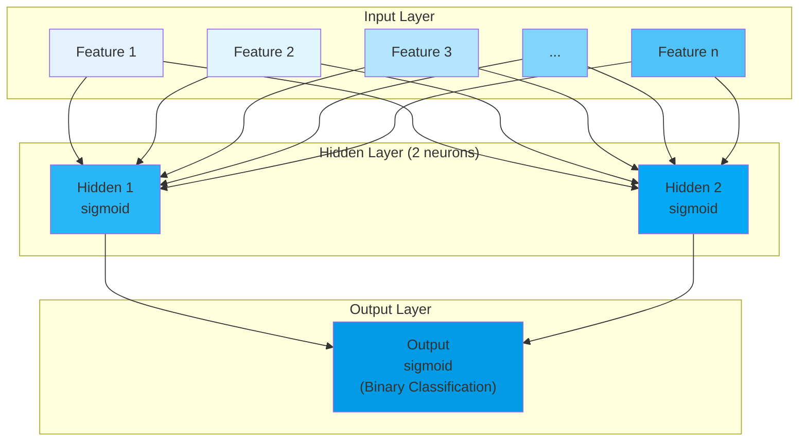

#####  Neural Network Architecture Diagram




##### Numerical Example: Student Grade Prediction

**Problem**: Predict if a student passes (1) or fails (0) based on study hours and sleep hours.

**Training Data**: One sample
- Student: study_hours = 6, sleep_hours = 8, actual_grade = 1 (pass)

**Initial Parameters**:

$$
\begin{align}
\text{Input features: } \mathbf{x} &= [6, 8] \\
\text{Target: } y &= 1 \\
\\
\text{Initial Weights:} \\
\mathbf{W}_{ih} &= \begin{bmatrix} 0.2 & 0.3 \\ 0.4 & 0.1 \end{bmatrix} \quad \text{(input to hidden)} \\
\mathbf{w}_{ho} &= [0.5, -0.2] \quad \text{(hidden to output)} \\
\\
\text{Learning rate: } \alpha &= 0.1
\end{align}
$$

Different weights are essential for the neural network to learn effectively. Here's why:

###### Breaking Symmetry

**If all weights were identical:**

$$
\begin{align}
\mathbf{W}_{ih} &= \begin{bmatrix} 0.2 & 0.2 \\ 0.2 & 0.2 \end{bmatrix} \\
\end{align}
$$

**Problem**: Both hidden neurons would:
- Receive identical inputs: `0.2×input1 + 0.2×input2`
- Produce identical outputs
- Receive identical error gradients during backpropagation
- Update by identical amounts

**Result**: The two hidden neurons would remain functionally identical throughout training, effectively reducing your network to having only one hidden neuron.

###### Mathematical Proof of the Problem

**Forward pass with identical weights:**
$$
\begin{align}
\mathbf{hidden\_input} &= \mathbf{x} \cdot \mathbf{W}_{ih} = [6, 8] \cdot \begin{bmatrix} 0.2 & 0.2 \\ 0.2 & 0.2 \end{bmatrix} = [4.8, 4.8] \\
\mathbf{hidden\_output} &= \sigma(\mathbf{hidden\_input}) = [\sigma(4.8), \sigma(4.8)] = [0.992, 0.992]
\end{align}
$$

**Backpropagation with identical weights:**

Both neurons receive the same error signal and update identically, maintaining the symmetry forever.

###### Why Different Weights Enable Learning

**With different weights:**

$$
\mathbf{W}_{ih} = \begin{bmatrix} 0.2 & 0.3 \\ 0.4 & 0.1 \end{bmatrix} \quad \text{(Different weights)}
$$

**Each neuron specializes:**
- **Hidden neuron 1**: Emphasizes input2 (weight 0.4 vs 0.2)
- **Hidden neuron 2**: Emphasizes input1 (weight 0.3 vs 0.1)

**This allows:**
- **Neuron 1** might learn to detect "high sleep hours" patterns
- **Neuron 2** might learn to detect "high study hours" patterns
- **Combined** they can capture complex relationships between both inputs

###### The Diversity Principle

Different initial weights create **functional diversity**:

**Weight Matrix Analysis:**

$$
\begin{align}
\text{From input 1: } [0.2, 0.3] &\rightarrow \text{Different influence on each hidden neuron} \\
\text{From input 2: } [0.4, 0.1] &\rightarrow \text{Different influence on each hidden neuron}
\end{align}
$$

This creates two distinct "feature detectors" in the hidden layer, each capable of learning different aspects of the input patterns.

###### Random Initialization Strategy

The code uses random initialization specifically to ensure diversity:
```python
weights_input_hidden = np.random.normal(scale=1 / n_features ** .5,
                                        size=(n_features, n_hidden))
```

This guarantees that each connection starts with a different value, breaking symmetry from the beginning and enabling each neuron to develop its own specialized function during training.

Without different weights, you lose the representational power that comes from having multiple neurons work together to capture different aspects of the data patterns.

###### Forward Propagation

**Step 1: Input to Hidden Layer**
$$
\begin{align}
\mathbf{hidden\_input} &= \mathbf{x} \cdot \mathbf{W}_{ih} \\
&= [6, 8] \cdot \begin{bmatrix} 0.2 & 0.3 \\ 0.4 & 0.1 \end{bmatrix} \\
&= [6 \times 0.2 + 8 \times 0.4, \quad 6 \times 0.3 + 8 \times 0.1] \\
&= [1.2 + 3.2, \quad 1.8 + 0.8] \\
&= [4.4, 2.6]
\end{align}
$$

**Step 2: Apply Sigmoid to Hidden Layer**

$$
\begin{align}
\mathbf{hidden\_output} &= \sigma(\mathbf{hidden\_input}) \\
&= \left[ \frac{1}{1 + e^{-4.4}}, \quad \frac{1}{1 + e^{-2.6}} \right] \\
&= [0.988, 0.931]
\end{align}
$$

**Step 3: Hidden to Output Layer**

$$
\begin{align}
\mathbf{output\_input} &= \mathbf{hidden\_output} \cdot \mathbf{w}_{ho} \\
&= [0.988, 0.931] \cdot [0.5, -0.2] \\
&= 0.988 \times 0.5 + 0.931 \times (-0.2) \\
&= 0.494 - 0.186 = 0.308
\end{align}
$$

**Step 4: Apply Sigmoid to Output**

$$
\begin{align}
\mathbf{output} &= \sigma(\mathbf{output\_input}) \\
&= \frac{1}{1 + e^{-0.308}} \\
&= 0.576
\end{align}
$$

**Prediction**: 0.576 (57.6% chance of passing)

###### Backpropagation

**Step 1: Calculate Output Error**
$$
\begin{align}
\mathbf{error} &= y - \mathbf{output} = 1 - 0.576 = 0.424 \\
\mathbf{output\_error\_term} &= \text{error} \times \mathbf{output} \times (1 - \mathbf{output}) \\
&= 0.424 \times 0.576 \times (1 - 0.576) \\
&= 0.424 \times 0.576 \times 0.424 = 0.104
\end{align}
$$

**Step 2: Propagate Error to Hidden Layer**

$$
\begin{align}
\mathbf{hidden\_error} &= \text{output\_error\_term} \times \mathbf{w}_{ho} \\
&= 0.104 \times [0.5, -0.2] \\
&= [0.052, -0.021] \\\\

\mathbf{hidden\_error\_term} &= \mathbf{hidden\_error} \times \mathbf{hidden\_output} \times (1 - \mathbf{hidden\_output}) \\
\text{For hidden neuron 1:} \quad &0.052 \times 0.988 \times (1 - 0.988) \\
&= 0.052 \times 0.988 \times 0.012 = 0.0006 \\
\text{For hidden neuron 2:} \quad &-0.021 \times 0.931 \times (1 - 0.931) \\
&= -0.021 \times 0.931 \times 0.069 = -0.001 \\\\

\mathbf{hidden\_error\_term} &= [0.0006, -0.001]
\end{align}
$$

**Step 3: Calculate Weight Updates**

**Update weights_hidden_output**:
$$
\begin{align}
\Delta \mathbf{w}_{ho} &= \alpha \times \text{output\_error\_term} \times \mathbf{hidden\_output} \\
&= 0.1 \times 0.104 \times [0.988, 0.931] \\
&= [0.0103, 0.0097]
\end{align}
$$

**Update weights_input_hidden**:
$$
\begin{align}
\Delta \mathbf{W}_{ih} &= \alpha \times \mathbf{hidden\_error\_term} \times \mathbf{x}^T \\
&= 0.1 \times [0.0006, -0.001] \times \begin{bmatrix} 6 \\ 8 \end{bmatrix} \\
&= [0.00036, -0.0006]
\end{align}
$$

$$
\begin{align}
\mathbf{weights}_{ih} &= \mathbf{weights}_{ih} + \Delta \mathbf{W}_{ih} \\
&= \begin{bmatrix} 0.2 & 0.3 \\ 0.4 & 0.1 \end{bmatrix} + \begin{bmatrix} 0.00036 & -0.0006 \\ 0.00048 & -0.0008 \end{bmatrix} \\
&= \begin{bmatrix} 0.20036 & 0.2994 \\ 0.40048 & 0.0992 \end{bmatrix}
\end{align}
$$

###### Learning Progress

**After Weight Update**:
- **Hidden layer weights** slightly adjusted to better capture input patterns
- **Output weights** increased for hidden neuron 1 (positive contribution) and decreased for hidden neuron 2 (negative contribution)
- **Next iteration** would use these updated weights for improved prediction

**Key Learning**: The network learned that the current prediction (57.6%) was too low for a passing student, so it adjusted weights to increase future predictions for similar input patterns.

This process repeats for all training samples and multiple epochs until the network learns to accurately distinguish between passing and failing students based on study and sleep hours.
