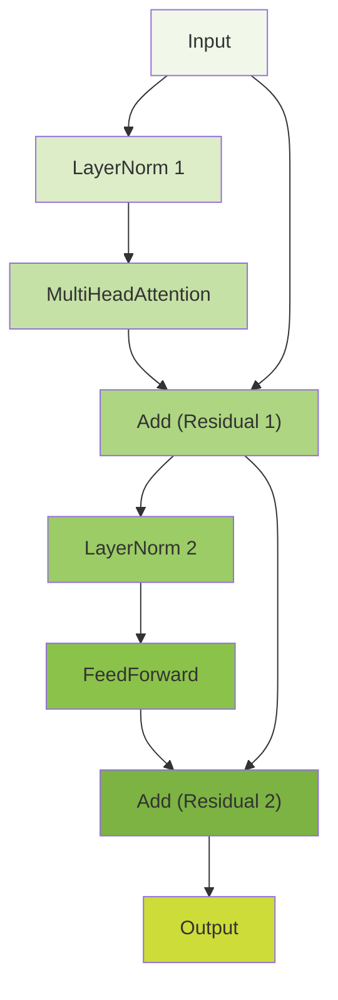

```python
import torch
import torch.nn as nn
import torch.nn.functional as F
from get_device import get_device

device = get_device()
print(f"Using device: {device}")
```

    Using device: mps


```python
from pathlib import Path

text = Path('../../data/tiny-shakespeare.txt').read_text()
```


```python
print(text[0:1000])
```

    First Citizen:
    Before we proceed any further, hear me speak.
    
    All:
    Speak, speak.
    
    First Citizen:
    You are all resolved rather to die than to famish?
    
    All:
    Resolved. resolved.
    
    First Citizen:
    First, you know Caius Marcius is chief enemy to the people.
    
    All:
    We know't, we know't.
    
    First Citizen:
    Let us kill him, and we'll have corn at our own price.
    Is't a verdict?
    
    All:
    No more talking on't; let it be done: away, away!
    
    Second Citizen:
    One word, good citizens.
    
    First Citizen:
    We are accounted poor citizens, the patricians good.
    What authority surfeits on would relieve us: if they
    would yield us but the superfluity, while it were
    wholesome, we might guess they relieved us humanely;
    but they think we are too dear: the leanness that
    afflicts us, the object of our misery, is as an
    inventory to particularise their abundance; our
    sufferance is a gain to them Let us revenge this with
    our pikes, ere we become rakes: for the gods know I
    speak this in hunger for bread, not in thirst for revenge.
    
    


---

# Character-Level Tokenizer for Language Models

###### Purpose and Overview

The `CharTokenizer` class implements a character-level tokenization system that converts text into numerical representations for neural language models. Unlike word-based tokenizers, this approach treats each individual character as a token, making it suitable for character-level language modeling tasks.

###### Core Functionality

**Bidirectional Mapping System:**
The tokenizer maintains two dictionaries for efficient conversion:
- `token_id_for_char`: Maps characters to unique integer IDs
- `char_for_token_id`: Maps integer IDs back to characters

**Key Operations:**
- **Encoding**: Text → Tensor of integer IDs
- **Decoding**: Tensor of integer IDs → Text
- **Vocabulary Management**: Builds and maintains character vocabulary

###### Detailed Method Analysis

**Initialization Process:**
```python
tokenizer = CharTokenizer(['a', 'b', 'c', ' ', '!'])
# Creates mappings:
# token_id_for_char = {'a': 0, 'b': 1, 'c': 2, ' ': 3, '!': 4}
# char_for_token_id = {0: 'a', 1: 'b', 2: 'c', 3: ' ', 4: '!'}
```

**Training from Text:**
```python
text = "hello world"
tokenizer = CharTokenizer.train_from_text(text)
# Vocabulary: [' ', 'd', 'e', 'h', 'l', 'o', 'r', 'w']  # Sorted unique characters
```

**Encoding Example:**
```python
text = "hello"
encoded = tokenizer.encode(text)
# Result: tensor([3, 4, 5, 5, 6])  # Each character mapped to its ID
```

**Decoding Example:**
```python
token_ids = torch.tensor([3, 4, 5, 5, 6])
decoded = tokenizer.decode(token_ids)
# Result: "hello"  # IDs mapped back to characters
```

The IDs are generated automatically by the `enumerate()` function in the `__init__` method. Here's exactly how it works:

###### ID Assignment Process

```python
def __init__(self, vocabulary):
    self.token_id_for_char = {char: token_id for token_id, char in enumerate(vocabulary)}
    self.char_for_token_id = {token_id: char for token_id, char in enumerate(vocabulary)}
```

###### Step-by-Step Breakdown

**Input vocabulary:** `['a', 'b', 'c', ' ', '!']`

**enumerate() function creates pairs:**
```python
list(enumerate(['a', 'b', 'c', ' ', '!']))
# Result: [(0, 'a'), (1, 'b'), (2, 'c'), (3, ' '), (4, '!')]
```

**Dictionary comprehension assigns IDs:**
```python
# For token_id_for_char:
{char: token_id for token_id, char in enumerate(vocabulary)}
# Becomes: {'a': 0, 'b': 1, 'c': 2, ' ': 3, '!': 4}

# For char_for_token_id:
{token_id: char for token_id, char in enumerate(vocabulary)}
# Becomes: {0: 'a', 1: 'b', 2: 'c', 3: ' ', 4: '!'}
```

###### The enumerate() Function

`enumerate(sequence)` returns pairs of `(index, item)` where the index starts at 0:
- Position 0: 'a' gets ID 0
- Position 1: 'b' gets ID 1
- Position 2: 'c' gets ID 2
- Position 3: ' ' gets ID 3
- Position 4: '!' gets ID 4

The IDs are simply the sequential positions of characters in the vocabulary list, starting from 0. This ensures each character has a unique integer identifier that can be used as an index in neural network embedding layers.


###### Practical Application Workflow

**Step 1: Vocabulary Creation**
The tokenizer scans input text to identify all unique characters and creates a sorted vocabulary ensuring consistent ordering across different runs.

**Step 2: Text Processing**
During encoding, each character in the input text is looked up in the vocabulary and replaced with its corresponding integer ID, creating a sequence of numbers suitable for neural network processing.

**Step 3: Neural Network Integration**
The encoded tensors can be fed directly into embedding layers of neural networks, where each character ID is mapped to a learned vector representation.

**Step 4: Output Decoding**
Model predictions (sequences of token IDs) are converted back to readable text using the reverse mapping.

###### Use Cases and Applications

**Character-Level Language Models:**
- Text generation at character granularity
- Handling out-of-vocabulary words naturally
- Working with any language or script without preprocessing

**Advantages:**
- No unknown token issues (every character is in vocabulary)
- Handles misspellings and novel words
- Language-agnostic approach
- Simple implementation and debugging

**Limitations:**
- Longer sequences than word-based tokenization
- May struggle with long-range dependencies
- Computationally more intensive for long texts

###### Technical Implementation Details

**Data Types:**
The tokenizer uses `torch.long` dtype for token IDs, which is standard for indexing operations in PyTorch embeddings and ensures compatibility with neural network layers.

**Memory Efficiency:**
The bidirectional mapping approach provides O(1) lookup time for both encoding and decoding operations, making it efficient for processing large texts.

**Vocabulary Consistency:**
The sorting of unique characters ensures deterministic vocabulary creation, crucial for model reproducibility across different training runs.

This tokenizer serves as a foundational component for character-level natural language processing tasks, providing the essential interface between raw text and numerical representations required by neural networks.


---

You're absolutely right to question this! The current `__init__` method has a **serious flaw** - it doesn't handle duplicates properly.

###### The Problem with Duplicates

If the vocabulary contains duplicates, the dictionary comprehension will overwrite previous mappings:

```python
# Problematic input with duplicates:
vocabulary = ['a', 'b', 'a', 'c', 'a']

# enumerate() produces:
[(0, 'a'), (1, 'b'), (2, 'a'), (3, 'c'), (4, 'a')]

# Dictionary comprehension overwrites:
token_id_for_char = {'a': 0, 'b': 1, 'a': 2, 'c': 3, 'a': 4}
# Final result: {'a': 4, 'b': 1, 'c': 3}  # 'a' only maps to ID 4!

char_for_token_id = {0: 'a', 1: 'b', 2: 'a', 3: 'c', 4: 'a'}
# Final result: {0: 'a', 1: 'b', 2: 'a', 3: 'c', 4: 'a'}  # Multiple IDs for 'a'
```

###### The Broken Behavior

This creates inconsistent mappings:
- `encode('a')` would return ID 4 (the last occurrence)
- `decode([0])` would return 'a' 
- But `encode(decode([0]))` wouldn't equal `[0]` - it would be `[4]`!

###### How the Code Should Handle This

The code currently **doesn't** handle duplicates properly. A robust implementation should either:

**Option 1: Remove duplicates before processing:**
```python
def __init__(self, vocabulary):
    unique_vocab = list(dict.fromkeys(vocabulary))  # Preserves order, removes duplicates
    self.token_id_for_char = {char: token_id for token_id, char in enumerate(unique_vocab)}
    self.char_for_token_id = {token_id: char for token_id, char in enumerate(unique_vocab)}
```

**Option 2: Raise an error for duplicates:**
```python
def __init__(self, vocabulary):
    if len(set(vocabulary)) != len(vocabulary):
        raise ValueError("Vocabulary contains duplicate characters")
    self.token_id_for_char = {char: token_id for token_id, char in enumerate(vocabulary)}
    self.char_for_token_id = {token_id: char for token_id, char in enumerate(vocabulary)}
```

###### Why `train_from_text()` Works

The `train_from_text()` method avoids this issue by explicitly removing duplicates:
```python
vocabulary = sorted(list(set(text)))  # set() removes duplicates
```

So the class works correctly when using `train_from_text()`, but the `__init__` method itself is vulnerable to duplicate inputs. This is a design flaw that should be addressed for robustness.

---


```python
import torch

class CharTokenizer:
    """
    A simple character-level tokenizer for converting text to and from numerical IDs.

    This tokenizer builds a vocabulary from a given text and provides methods
    to encode strings into integer tensors and decode them back into strings.
    It is a basic but essential component for character-level language models.

    Attributes:
        token_id_for_char (dict): A mapping from each character in the vocabulary
            to its unique integer ID.
        char_for_token_id (dict): A reverse mapping from each integer ID back
            to its corresponding character.
    """
  
    # def __init__(self, vocabulary):
    #     """
    #     Initializes the CharTokenizer with a predefined vocabulary.

    #     Args:
    #         vocabulary (list or str): An ordered list or string of unique
    #             characters that will form the tokenizer's vocabulary.
    #     """
    #     self.token_id_for_char = {char: token_id for token_id, char in enumerate(vocabulary)}
    #     self.char_for_token_id = {token_id: char for token_id, char in enumerate(vocabulary)}

    def __init__(self, vocabulary):
        """
        Initializes the CharTokenizer with a predefined vocabulary.

        Args:
            vocabulary (list or str): An ordered list or string of unique
                characters that will form the tokenizer's vocabulary.
        """        
        
        unique_vocab = list(dict.fromkeys(vocabulary))  # Preserves order, removes duplicates
        self.token_id_for_char = {char: token_id for token_id, char in enumerate(unique_vocab)}
        self.char_for_token_id = {token_id: char for token_id, char in enumerate(unique_vocab)}

    @staticmethod
    def train_from_text(text):
        """
        Creates a new CharTokenizer instance by building a vocabulary from text.

        This static method scans the input text, finds all unique characters,
        sorts them to ensure a consistent vocabulary order, and then creates
        a new tokenizer instance based on this vocabulary.

        Args:
            text (str): The corpus of text from which to build the vocabulary.

        Returns:
            CharTokenizer: A new instance of the tokenizer trained on the text.
        """
        vocabulary = sorted(list(set(text)))
        return CharTokenizer(vocabulary)

    def encode(self, text):
        """
        Encodes a string of text into a tensor of token IDs.

        Each character in the input string is mapped to its corresponding integer
        ID from the vocabulary.

        Args:
            text (str): The string to encode.

        Returns:
            torch.Tensor: A 1D tensor of dtype torch.long containing the sequence
                of token IDs.
        """
        token_ids = []
        for char in text:
            token_ids.append(self.token_id_for_char[char])
        return torch.tensor(token_ids, dtype=torch.long)

    def decode(self, token_ids):
        """
        Decodes a tensor of token IDs back into a string of text.

        Each integer ID in the input tensor is mapped back to its corresponding
        character from the vocabulary.

        Args:
            token_ids (torch.Tensor): A 1D tensor of token IDs to decode.

        Returns:
            str: The decoded string.
        """
        chars = []
        # .tolist() converts the tensor to a standard Python list for iteration.
        for token_id in token_ids.tolist():
            chars.append(self.char_for_token_id[token_id])
        return ''.join(chars)

    def vocabulary_size(self):
        """
        Returns the total number of unique characters in the vocabulary.

        Returns:
            int: The size of the vocabulary.
        """
        return len(self.token_id_for_char)
```


```python
tokenizer = CharTokenizer.train_from_text(text)
```


```python
print(tokenizer.encode("Hello world"))

print("\n")

print(tokenizer.encode("Helleoo"))
```

    tensor([20, 43, 50, 50, 53,  1, 61, 53, 56, 50, 42])
    
    
    tensor([20, 43, 50, 50, 43, 53, 53])


```python
print(tokenizer.decode(tokenizer.encode("Hello world")))
```

    Hello world


```python
tokenizer.vocabulary_size()
```


    65


```python
import pprint

pp = pprint.PrettyPrinter(depth=4)
```


```python
pp.pprint(tokenizer.char_for_token_id)
```

    {0: '\n',
     1: ' ',
     2: '!',
     3: '$',
     4: '&',
     5: "'",
     6: ',',
     7: '-',
     8: '.',
     9: '3',
     10: ':',
     11: ';',
     12: '?',
     13: 'A',
     14: 'B',
     15: 'C',
     16: 'D',
     17: 'E',
     18: 'F',
     19: 'G',
     20: 'H',
     21: 'I',
     22: 'J',
     23: 'K',
     24: 'L',
     25: 'M',
     26: 'N',
     27: 'O',
     28: 'P',
     29: 'Q',
     30: 'R',
     31: 'S',
     32: 'T',
     33: 'U',
     34: 'V',
     35: 'W',
     36: 'X',
     37: 'Y',
     38: 'Z',
     39: 'a',
     40: 'b',
     41: 'c',
     42: 'd',
     43: 'e',
     44: 'f',
     45: 'g',
     46: 'h',
     47: 'i',
     48: 'j',
     49: 'k',
     50: 'l',
     51: 'm',
     52: 'n',
     53: 'o',
     54: 'p',
     55: 'q',
     56: 'r',
     57: 's',
     58: 't',
     59: 'u',
     60: 'v',
     61: 'w',
     62: 'x',
     63: 'y',
     64: 'z'}


```python
pp.pprint(tokenizer.token_id_for_char)
```

    {'\n': 0,
     ' ': 1,
     '!': 2,
     '$': 3,
     '&': 4,
     "'": 5,
     ',': 6,
     '-': 7,
     '.': 8,
     '3': 9,
     ':': 10,
     ';': 11,
     '?': 12,
     'A': 13,
     'B': 14,
     'C': 15,
     'D': 16,
     'E': 17,
     'F': 18,
     'G': 19,
     'H': 20,
     'I': 21,
     'J': 22,
     'K': 23,
     'L': 24,
     'M': 25,
     'N': 26,
     'O': 27,
     'P': 28,
     'Q': 29,
     'R': 30,
     'S': 31,
     'T': 32,
     'U': 33,
     'V': 34,
     'W': 35,
     'X': 36,
     'Y': 37,
     'Z': 38,
     'a': 39,
     'b': 40,
     'c': 41,
     'd': 42,
     'e': 43,
     'f': 44,
     'g': 45,
     'h': 46,
     'i': 47,
     'j': 48,
     'k': 49,
     'l': 50,
     'm': 51,
     'n': 52,
     'o': 53,
     'p': 54,
     'q': 55,
     'r': 56,
     's': 57,
     't': 58,
     'u': 59,
     'v': 60,
     'w': 61,
     'x': 62,
     'y': 63,
     'z': 64}


---

# Language Model Dataset: Token Sequence Generation

###### Purpose and Functionality

The `TokenIdsDataset` class creates training data for autoregressive language models by converting a sequence of tokens into input-target pairs. This dataset implements the standard "next token prediction" training paradigm where the model learns to predict the subsequent token given a context window.

###### Core Concept: Shifted Sequences

**Training Objective:** Given a sequence of tokens, predict the next token
**Implementation:** For each position, create pairs where the target is the input shifted by one position

###### Detailed Example Walkthrough

**Setup:**
```python
data = torch.tensor([1, 2, 3, 4, 5, 6, 7, 8, 9])  # Token sequence
block_size = 4  # Context window size
dataset = TokenIdsDataset(data, block_size)
```

**Dataset Length Calculation:**
```python
len(dataset) = len(data) - block_size = 9 - 4 = 5
# 5 possible starting positions for complete sequences
```

**Sample Generation:**
```python
# Position 0: x = [1, 2, 3, 4], y = [2, 3, 4, 5]
# Position 1: x = [2, 3, 4, 5], y = [3, 4, 5, 6]  
# Position 2: x = [3, 4, 5, 6], y = [4, 5, 6, 7]
# Position 3: x = [4, 5, 6, 7], y = [5, 6, 7, 8]
# Position 4: x = [5, 6, 7, 8], y = [6, 7, 8, 9]
```

###### Token-by-Token Prediction Logic

For each input-target pair, the model learns multiple next-token predictions simultaneously:

**Example with Position 0:**
```python
Input:  [1, 2, 3, 4]
Target: [2, 3, 4, 5]

# Training signals:
# Given context [1] → predict 2
# Given context [1, 2] → predict 3  
# Given context [1, 2, 3] → predict 4
# Given context [1, 2, 3, 4] → predict 5
```

###### Implementation Analysis

**Memory Efficiency:**
The dataset doesn't store all possible sequences but generates them on-demand using tensor slicing, making it memory-efficient for large corpora.

**Boundary Handling:**
```python
def __len__(self):
    return len(self.data) - self.block_size
```
This ensures every generated sequence has exactly `block_size` input tokens and `block_size` target tokens, preventing index overflow.

**Tensor Slicing:**
```python
x = self.data[pos:pos + block_size]        # Input: 4 tokens
y = self.data[pos + 1:pos + 1 + block_size] # Target: 4 tokens (shifted)
```

###### Integration with Training Loop

**DataLoader Usage:**
```python
from torch.utils.data import DataLoader

dataloader = DataLoader(dataset, batch_size=32, shuffle=True)

for batch_x, batch_y in dataloader:
    # batch_x shape: (32, block_size)  
    # batch_y shape: (32, block_size)
    predictions = model(batch_x)
    loss = criterion(predictions.view(-1, vocab_size), batch_y.view(-1))
```

The `-1` in `.view(-1, vocab_size)` tells PyTorch to automatically calculate that dimension based on the tensor's total size. Here's why this is necessary:

###### Tensor Shape Problem

**Before reshaping:**
```python
# predictions shape: (batch_size, block_size, vocab_size)
# batch_y shape: (batch_size, block_size)

# Example with batch_size=32, block_size=4, vocab_size=1000:
predictions.shape = torch.Size([32, 4, 1000])
batch_y.shape = torch.Size([32, 4])
```

**Loss function requirement:**
Most loss functions expect:
- Predictions: 2D tensor `(num_samples, num_classes)`
- Targets: 1D tensor `(num_samples,)`

###### What `.view(-1, vocab_size)` Does

**Automatic dimension calculation:**
```python
predictions.view(-1, vocab_size)
# PyTorch calculates: total_elements / vocab_size = first_dimension
# (32 * 4 * 1000) / 1000 = 128
# Result shape: (128, 1000)

batch_y.view(-1)  
# Flattens to: (128,)
```

**Step-by-step breakdown:**
```python
# Original: (32, 4, 1000) - 32 batches, 4 tokens each, 1000 vocab probabilities
# Reshaped: (128, 1000) - 128 individual token predictions, 1000 vocab probabilities

# Original targets: (32, 4) - 32 batches, 4 target tokens each  
# Reshaped: (128,) - 128 individual target tokens
```

###### Why Use -1 Instead of Hard-coding?

**Flexibility:**
```python
# Hard-coded (brittle):
predictions.view(32 * 4, vocab_size)  # Breaks if batch_size changes

# Auto-calculated (robust):  
predictions.view(-1, vocab_size)  # Works with any batch_size
```

**Real example:**
```python
batch_size = 32
block_size = 4
vocab_size = 1000

# Before reshaping
print(predictions.shape)     # torch.Size([32, 4, 1000])
print(batch_y.shape)         # torch.Size([32, 4])

# After reshaping  
print(predictions.view(-1, vocab_size).shape)  # torch.Size([128, 1000])
print(batch_y.view(-1).shape)                  # torch.Size([128])
```

###### What This Accomplishes

The reshaping converts from "batch-of-sequences" format to "individual-predictions" format, where each token prediction is treated as a separate classification problem. This allows the loss function to compute the cross-entropy between each predicted token distribution and its corresponding target token.

The `-1` makes the code robust to different batch sizes without requiring manual calculation of the flattened dimension.


###### Practical Considerations

**Context Length Trade-offs:**
- Larger `block_size`: Better long-range dependencies, more memory usage
- Smaller `block_size`: Less memory, limited context understanding

**Data Utilization:**
From a sequence of length N with block size B, the dataset generates N-B training examples, maximizing data utilization through overlapping windows.

**Computational Efficiency:**
The sliding window approach creates multiple training examples from a single sequence, effectively augmenting the training data without additional storage requirements.

This dataset design is fundamental to training transformer-based language models, providing the structured input-target pairs necessary for learning autoregressive text generation through next-token prediction.

---


```python
import torch
from torch.utils.data import Dataset

class TokenIdsDataset(Dataset):
  
  """
  A PyTorch Dataset for creating input-target pairs for language model training.

  This dataset takes a long sequence of token IDs and a specified block size
  (context length) to generate pairs of (input, target) tensors. The input `x`
  is a chunk of the data, and the target `y` is the same chunk shifted by one
  position to the right. This setup is standard for training a model to predict
  the next token in a sequence.

  For example, if the data is [1, 2, 3, 4, 5] and block_size is 3:
  - A possible `x` would be [1, 2, 3].
  - The corresponding `y` would be [2, 3, 4].
  """
  def __init__(self, data, block_size):
    """
    Initializes the dataset.

    Args:
        data (torch.Tensor): A 1D tensor containing the entire sequence of
            token IDs for the text corpus.
        block_size (int): The context length or the size of the input
            sequences to be generated.
    """
    self.data = data
    self.block_size = block_size

  def __len__(self):
    """
    Returns the total number of possible sequences that can be generated.

    The length is the total number of tokens minus the block size, as this
    represents the number of possible starting positions for a full sequence.

    Returns:
        int: The total number of samples in the dataset.
    """
    return len(self.data) - self.block_size

  def __getitem__(self, pos):
    """
    Retrieves a single input-target pair at a given position.

    Args:
        pos (int): The starting index in the data tensor from which to
            create the sequence.

    Returns:
        tuple[torch.Tensor, torch.Tensor]: A tuple containing the input
            tensor `x` and the target tensor `y`.
    """
    # Ensure the requested position is valid.
    assert pos < len(self.data) - self.block_size

    # The input sequence starts at `pos` and has length `block_size`.
    x = self.data[pos:pos + self.block_size]
    # The target sequence is shifted by one token to the right.
    y = self.data[pos + 1:pos + 1 + self.block_size]
    return x, y
```


---

The `//` operator performs **floor division** (integer division), which is crucial for ensuring the head size is always an integer.

###### Floor Division vs Regular Division

**Regular division (`/`):**
```python
embedding_dim = 768
heads_num = 12

head_size = embedding_dim / heads_num
# Result: 64.0 (float)
```

**Floor division (`//`):**
```python
head_size = embedding_dim // heads_num  
# Result: 64 (integer)
```

###### Why This Matters for Neural Networks

**Integer requirement:**
Neural network dimensions must be integers. You cannot have 64.5 neurons or create a tensor with fractional dimensions.

**Example where it makes a difference:**
```python
embedding_dim = 770  # Not perfectly divisible
heads_num = 12

regular_division = embedding_dim / heads_num  # 64.16666... (float)
floor_division = embedding_dim // heads_num   # 64 (integer)
```

###### Multi-Head Attention Context

In transformer architecture, the embedding dimension must be evenly divided among attention heads:
```python
# Each attention head gets head_size dimensions
# Total: heads_num × head_size = embedding_dim

12 heads × 64 dimensions = 768 total embedding dimensions
```

**Configuration validation:**
```python
assert embedding_dim % heads_num == 0, "embedding_dim must be divisible by heads_num"
head_size = embedding_dim // heads_num
```

The `//` operator ensures you get a clean integer division result, which is essential for creating properly sized tensor operations in the attention mechanism. Using regular division would produce floats that would cause errors when used as tensor dimension specifications.

---


```python
config = {
  "vocabulary_size": tokenizer.vocabulary_size(),
  "context_size": 256,
  "embedding_dim": 768,
  "heads_num": 12,
  "layers_num": 10,
  "dropout_rate": 0.1,
  "use_bias": False,
}

config["head_size"] = config["embedding_dim"] // config["heads_num"]
```


---

# Single-Head Attention Mechanism Implementation

###### Core Purpose

The `AttentionHead` class implements a single attention head from the multi-head attention mechanism used in transformer architectures. It performs the fundamental attention operation: allowing each token to attend to (focus on) relevant tokens in the sequence while respecting causal constraints for language modeling.

###### Architecture Components

**Linear Projection Layers:**
```python
self.Q_weights = nn.Linear(config["embedding_dim"], config["head_size"], config["use_bias"])
self.K_weights = nn.Linear(config["embedding_dim"], config["head_size"], config["use_bias"])  
self.V_weights = nn.Linear(config["embedding_dim"], config["head_size"], config["use_bias"])
```

These layers project the input embeddings into three different subspaces:
- **Query (Q)**: What the current token is looking for
- **Key (K)**: What each token represents/offers  
- **Value (V)**: The actual content each token contributes

###### Causal Attention Mask

```python
casual_attention_mask = torch.tril(torch.ones(config["context_size"], config["context_size"]))
self.register_buffer('casual_attention_mask', casual_attention_mask)
```

**Purpose:** Ensures tokens can only attend to previous tokens (including themselves), not future tokens. This is crucial for autoregressive language modeling.

**Structure:** Lower triangular matrix where:
- 1 = allowed attention (current and previous positions)
- 0 = blocked attention (future positions)

**Example for context_size=4:**
```
[[1, 0, 0, 0],
 [1, 1, 0, 0], 
 [1, 1, 1, 0],
 [1, 1, 1, 1]]
```

###### Forward Pass Breakdown

**Step 1: Linear Projections**
```python
Q = self.Q_weights(input) # (B, C, head_size)
K = self.K_weights(input) # (B, C, head_size)  
V = self.V_weights(input) # (B, C, head_size)
```
Input shape: `(batch_size, sequence_length, embedding_dim)`
Output shapes: `(batch_size, sequence_length, head_size)`

**Step 2: Attention Score Computation**
```python
attention_scores = Q @ K.transpose(1, 2)  # (B, C, C)
```
Computes similarity between queries and keys using dot product. Result is a `(batch_size, sequence_length, sequence_length)` matrix where `attention_scores[i,j]` represents how much token `i` should attend to token `j`.

**Step 3: Causal Masking**
```python
attention_scores = attention_scores.masked_fill(
    self.casual_attention_mask[:tokens_num,:tokens_num] == 0,
    -torch.inf
)
```
Sets attention scores for future positions to negative infinity, ensuring they become zero after softmax.

**Step 4: Scaled Dot-Product Attention**
```python
attention_scores = attention_scores / (K.shape[-1] ** 0.5)
```
Scales by `√(head_size)` to prevent softmax saturation with large dot products.

**Step 5: Attention Probabilities**
```python
attention_scores = torch.softmax(attention_scores, dim=-1)
attention_scores = self.dropout(attention_scores)
```
Converts scores to probabilities that sum to 1 for each query position, then applies dropout for regularization.

**Step 6: Weighted Value Aggregation**
```python
return attention_scores @ V # (B, C, head_size)
```
Multiplies attention probabilities with values to get the final attended representation.

###### Mathematical Formulation

The complete attention operation can be expressed as:
$$\text{Attention}(Q, K, V) = \text{softmax}\left(\frac{QK^T + M}{\sqrt{d_k}}\right)V$$

Where:
- $M$ is the causal mask (0 for allowed, $-\infty$ for blocked)
- $d_k$ is the head size (key dimension)

###### Key Design Decisions

**Head Size Calculation:** `head_size = embedding_dim // heads_num` ensures the total dimension is preserved when multiple heads are concatenated.

**Buffer Registration:** Using `register_buffer` for the mask ensures it moves with the model to GPU/CPU without being treated as a trainable parameter.

**Dropout Placement:** Applied to attention weights rather than the final output, providing regularization on the attention patterns themselves.

This implementation forms the building block for multi-head attention, where multiple such heads operate in parallel and their outputs are concatenated to capture different types of relationships in the data.

---


---

```python
attention_scores = Q @ K.transpose(1, 2)  # Shape: (B, T, T)
```

The `@` symbol is the **matrix multiplication** operator in Python.

In the context of PyTorch and NumPy, it's used to perform matrix multiplication on tensors or arrays. It's a more readable, infix alternative to calling a function like `torch.matmul()`.

##### In Your Code: `attention_scores = Q @ K.transpose(1, 2)`

Let's break down this specific line:

1.  **`Q`**: This is the "Query" tensor, with a shape of `(Batch, Tokens, Head_size)`.
2.  **`K`**: This is the "Key" tensor, also with a shape of `(Batch, Tokens, Head_size)`.
3.  **`K.transpose(1, 2)`**: This transposes the Key tensor, swapping its last two dimensions. Its new shape becomes `(Batch, Head_size, Tokens)`. This is done to make the dimensions compatible for matrix multiplication.
4.  **`Q @ ...`**: This performs the matrix multiplication:
    *   `Q` shape: `(B, T, H)`
    *   `K.transpose` shape: `(B, H, T)`
    *   Resulting `attention_scores` shape: `(B, T, T)`

The resulting `(B, T, T)` tensor holds the attention scores, where each token in the sequence has a score indicating how much it should "attend to" every other token.

---


```python
import torch
import torch.nn as nn

class AttentionHead(nn.Module):
    """
    A single head of self-attention for a transformer model.

    This module implements the scaled dot-product attention mechanism. It takes
    a sequence of token embeddings and computes a new representation for each
    token by attending to all other tokens in the sequence. It learns three
    linear projections (Query, Key, Value) to transform the input embeddings.

    The key components are:
    - Q, K, V linear layers to project the input.
    - A causal mask to prevent tokens from attending to future tokens.
    - Scaled dot-product attention calculation.
    - Dropout for regularization.
    """
    def __init__(self, config):
        """
        Initializes the AttentionHead module.

        Args:
            config (dict): A configuration dictionary containing the following keys:
                - "embedding_dim" (int): The dimensionality of the input token embeddings.
                - "head_size" (int): The dimensionality of the Query, Key, and Value projections.
                - "use_bias" (bool): Whether to use a bias term in the linear layers.
                - "dropout_rate" (float): The dropout rate to apply to the attention scores.
                - "context_size" (int): The maximum sequence length (block size).
        """
        super().__init__()

        # Linear layers to project input embeddings into Query, Key, and Value spaces.
        self.Q_weights = nn.Linear(config["embedding_dim"], config["head_size"], bias=config["use_bias"])
        self.K_weights = nn.Linear(config["embedding_dim"], config["head_size"], bias=config["use_bias"])
        self.V_weights = nn.Linear(config["embedding_dim"], config["head_size"], bias=config["use_bias"])

        # Dropout layer to regularize attention scores.
        self.dropout = nn.Dropout(config["dropout_rate"])

        # Create a lower triangular matrix for the causal attention mask.
        # This prevents tokens from attending to future tokens in the sequence.
        casual_attention_mask = torch.tril(torch.ones(config["context_size"], config["context_size"]))
        
        # `register_buffer` makes the mask a part of the module's state, but not
        # a parameter to be trained. This ensures it's moved to the correct
        # device (e.g., GPU) along with the model.
        self.register_buffer('casual_attention_mask', casual_attention_mask)


    def forward(self, input_embeddings):
        """
        Performs the forward pass of the attention mechanism.

        Args:
            input_embeddings (torch.Tensor): A tensor of shape (B, T, E) where
                B is the batch size, T is the sequence length (tokens_num), and
                E is the embedding dimension.

        Returns:
            torch.Tensor: The output tensor of shape (B, T, H) where H is the
                head size. This is the weighted aggregation of the Value vectors.
        """
        batch_size, tokens_num, embedding_dim = input_embeddings.shape
        
        # 1. Project input into Query, Key, and Value tensors.
        Q = self.Q_weights(input_embeddings) # Shape: (B, T, H)
        K = self.K_weights(input_embeddings) # Shape: (B, T, H)
        V = self.V_weights(input_embeddings) # Shape: (B, T, H)

        # 2. Calculate attention scores by taking the dot product of Q and K.
        # K is transposed to align dimensions for matrix multiplication.
        attention_scores = Q @ K.transpose(1, 2)  # Shape: (B, T, T)

        # 3. Apply the causal mask to prevent future-peeking.
        # We set the scores for future positions to negative infinity so that
        # they become zero after the softmax operation.
        attention_scores = attention_scores.masked_fill(
            self.casual_attention_mask[:tokens_num, :tokens_num] == 0,
            -torch.inf
        )
        
        # 4. Scale the attention scores to stabilize gradients.
        # This is divided by the square root of the Key dimension (head_size).
        attention_scores = attention_scores / (K.shape[-1] ** 0.5)
        
        # 5. Apply softmax to convert scores into probability distributions (weights).
        attention_scores = torch.softmax(attention_scores, dim=-1)
        
        # 6. Apply dropout for regularization.
        attention_scores = self.dropout(attention_scores)

        # 7. Compute the final output by taking a weighted sum of the Value vectors.
        return attention_scores @ V # Shape: (B, T, H)
```


```python
input = torch.rand(8, config["context_size"], config["embedding_dim"]) 

ah = AttentionHead(config)
output = ah(input)

output.shape
```


---

# Multi-Head Attention Implementation

###### Core Purpose

The `MultiHeadAttention` class implements the complete multi-head attention mechanism by combining multiple parallel attention heads and processing their combined output. This allows the model to attend to different types of relationships and patterns simultaneously across multiple representation subspaces.

###### Architecture Overview

**Parallel Head Structure:**
```python
heads_list = [AttentionHead(config) for _ in range(config["heads_num"])]
self.heads = nn.ModuleList(heads_list)
```

Creates multiple independent attention heads (typically 12) that operate in parallel, each focusing on different aspects of the input relationships.

**Output Processing:**
```python
self.linear = nn.Linear(config["embedding_dim"], config["embedding_dim"])
self.dropout = nn.Dropout(config["dropout_rate"])
```

A linear projection layer that processes the concatenated head outputs, followed by dropout for regularization.

###### Forward Pass Breakdown

**Step 1: Parallel Head Computation**
```python
heads_outputs = [head(input) for head in self.heads]
```

Each attention head processes the input independently:
- Input shape: `(batch_size, sequence_length, embedding_dim)`
- Each head output shape: `(batch_size, sequence_length, head_size)`
- Number of outputs: `heads_num` (e.g., 12)

**Step 2: Concatenation**
```python
scores_change = torch.cat(heads_outputs, dim=-1)
```

Concatenates all head outputs along the feature dimension:
- Individual head: `(B, C, head_size)` where `head_size = embedding_dim // heads_num`
- After concatenation: `(B, C, heads_num × head_size) = (B, C, embedding_dim)`

**Numerical Example:**
```python
# Config: embedding_dim=768, heads_num=12, head_size=64
# Input: (32, 256, 768)  # batch_size=32, sequence_length=256

# Each head output: (32, 256, 64)
# After concatenation: (32, 256, 768)  # 12 × 64 = 768
```

**Step 3: Linear Projection**
```python
scores_change = self.linear(scores_change)
```

Applies a learned linear transformation to the concatenated outputs:
- Weight matrix: `(embedding_dim, embedding_dim)` = `(768, 768)`
- Allows heads to interact and combine their representations
- Maintains the original embedding dimension

**Step 4: Regularization**
```python
return self.dropout(scores_change)
```

Applies dropout to prevent overfitting on the attention patterns.

###### Why Multiple Heads?

**Representation Diversity:**
Each head can specialize in different types of relationships:
- Head 1: Syntactic dependencies (subject-verb relationships)
- Head 2: Semantic similarity (related concepts)
- Head 3: Positional patterns (sequential ordering)
- Head 4: Long-range dependencies (paragraph-level connections)

**Parallel Processing:**
All heads compute simultaneously, making the operation efficient while capturing multiple perspectives on the same input.

###### Mathematical Formulation

The complete multi-head attention can be expressed as:
$$\text{MultiHead}(Q, K, V) = \text{Concat}(\text{head}_1, ..., \text{head}_h)W^O$$

Where:
- $\text{head}_i = \text{Attention}(QW_i^Q, KW_i^K, VW_i^V)$
- $W^O$ is the output projection matrix (`self.linear`)
- $h$ is the number of heads

###### Dimension Preservation

**Key insight:** The total computational cost remains similar to single-head attention:
- Single head: `(B, C, embedding_dim)` → `(B, C, embedding_dim)`
- Multi-head: `heads_num × (B, C, head_size)` → `(B, C, embedding_dim)`
- Total parameters: Similar due to dimension splitting

**Head Size Relationship:**
```python
head_size = embedding_dim // heads_num  # 768 // 12 = 64
total_dim = heads_num × head_size       # 12 × 64 = 768
```

###### Integration Benefits

**Enhanced Representation:** Captures multiple types of attention patterns simultaneously rather than learning a single averaged attention pattern.

**Computational Efficiency:** Parallel computation across heads with dimension splitting maintains reasonable computational cost.

**Learning Flexibility:** Different heads can specialize during training without interfering with each other's learning process.

This multi-head structure is fundamental to transformer architectures, enabling the model to build rich, multi-faceted representations of sequence relationships that single-head attention cannot achieve.

---


```python
import torch
import torch.nn as nn


class MultiHeadAttention(nn.Module):
    """
    Implements the Multi-Head Attention mechanism for a transformer model.

    This module runs multiple self-attention "heads" in parallel and then
    concatenates their outputs. This allows the model to jointly attend to
    information from different representation subspaces at different positions.
    A final linear layer is applied to the concatenated outputs to produce
    the final result.

    This architecture is a core component of the Transformer model, enabling it
    to capture a richer variety of relationships within the input sequence.
    """
    def __init__(self, config):
        """
        Initializes the MultiHeadAttention module.

        Args:
            config (dict): A configuration dictionary containing the following keys:
                - "heads_num" (int): The number of parallel attention heads to use.
                - "embedding_dim" (int): The dimensionality of the input and output.
                - "dropout_rate" (float): The dropout rate for the final output.
                - Other keys required by `AttentionHead` (head_size, use_bias, etc.).
        """
        super().__init__()

        # Create a list of `AttentionHead` modules, one for each head.
        # `nn.ModuleList` is used to properly register all the heads as sub-modules.
        heads_list = [AttentionHead(config) for _ in range(config["heads_num"])]
        self.heads = nn.ModuleList(heads_list)

        # A final linear layer to project the concatenated head outputs back
        # to the original embedding dimension.
        self.linear = nn.Linear(config["embedding_dim"], config["embedding_dim"])
        
        # A dropout layer for regularization on the final output.
        self.dropout = nn.Dropout(config["dropout_rate"])

    def forward(self, input_embeddings):
        """
        Performs the forward pass for Multi-Head Attention.

        Args:
            input_embeddings (torch.Tensor): A tensor of shape (B, T, E) where
                B is the batch size, T is the sequence length, and E is the
                embedding dimension.

        Returns:
            torch.Tensor: The final output tensor of shape (B, T, E).
        """
        # 1. Run each attention head in parallel on the same input.
        # This results in a list of output tensors, each of shape (B, T, H).
        heads_outputs = [head(input_embeddings) for head in self.heads]

        # 2. Concatenate the outputs of all heads along the last dimension.
        # If we have N heads, the shape becomes (B, T, N * H).
        # Note: For this to work, N * H must equal the embedding_dim.
        concatenated_heads = torch.cat(heads_outputs, dim=-1)

        # 3. Pass the concatenated output through a final linear layer.
        # This projects the combined attention information back to the original
        # embedding dimension, shape (B, T, E).
        projected_output = self.linear(concatenated_heads)
        
        # 4. Apply dropout for regularization.
        return self.dropout(projected_output)
```


```python
mha = MultiHeadAttention(config)
input = torch.rand(8, config["context_size"], config["embedding_dim"])

output = mha(input)
output.shape
```


---

#### Feed-Forward Network in Transformer Architecture

```python
class FeedForward(nn.Module):
    """
    Position-wise feed-forward network used in transformer blocks.
    
    This module implements a two-layer fully connected network with GELU activation
    that processes each position in the sequence independently. It expands the 
    embedding dimension by a factor of 4, applies non-linear activation, then
    projects back to the original dimension.
    
    The architecture follows the standard transformer design:
    embedding_dim → 4×embedding_dim → embedding_dim
    
    Args:
        config (dict): Configuration dictionary containing:
            - embedding_dim (int): The input/output dimension size
            - dropout_rate (float): Dropout probability for regularization
    """
```

##### Architecture Overview

**Two-Layer Structure:**
```python
nn.Linear(config["embedding_dim"], config["embedding_dim"] * 4),  # Expansion
nn.GELU(),                                                        # Activation
nn.Linear(config["embedding_dim"] * 4, config["embedding_dim"]), # Contraction
nn.Dropout(config["dropout_rate"])                               # Regularization
```

**Dimension Transformation:**
- Input: `(batch_size, sequence_length, embedding_dim)`
- Hidden: `(batch_size, sequence_length, embedding_dim × 4)`
- Output: `(batch_size, sequence_length, embedding_dim)`

##### GELU Activation Function

**GELU (Gaussian Error Linear Unit)** is defined mathematically as:
$$\text{GELU}(x) = x \cdot \Phi(x)$$
where $\Phi(x)$ is the cumulative distribution function of the standard normal distribution.

**Approximation used in practice:**
$$\text{GELU}(x) \approx 0.5x\left(1 + \tanh\left(\sqrt{\frac{2}{\pi}}(x + 0.044715x^3)\right)\right)$$

**Properties of GELU:**
- **Smooth**: Unlike ReLU, GELU is differentiable everywhere
- **Non-monotonic**: Has a slight negative region for small negative inputs
- **Probabilistic**: Based on probability theory rather than hard thresholding
- **Better gradients**: Smoother gradients compared to ReLU variants

**Comparison with other activations:**
```python
# ReLU: max(0, x) - hard cutoff at zero
# GELU: x * Φ(x) - smooth probabilistic gating
# Swish: x * sigmoid(x) - similar smooth properties
```

##### Why 4x Expansion?

**Computational Capacity:**
The 4x expansion provides sufficient representational capacity for complex transformations while maintaining computational efficiency.

**Parameter Distribution:**
```python
# Example with embedding_dim = 768
# Layer 1: 768 → 3072 (768 × 4) = 2,359,296 parameters
# Layer 2: 3072 → 768 = 2,359,296 parameters  
# Total: ~4.7M parameters per feed-forward block
```

**Information Processing:**
- **Expansion phase**: Projects to higher-dimensional space for complex pattern recognition
- **Contraction phase**: Compresses back to original dimension while preserving learned features

##### Position-wise Processing

**Independent Processing:**
Each position in the sequence is processed independently - the same transformation is applied to every token position without interaction between positions.

**Mathematical representation:**
$$\text{FFN}(x) = \max(0, xW_1 + b_1)W_2 + b_2$$
(using ReLU in original paper, but GELU in modern implementations)

##### Role in Transformer Architecture

**Complementary to Attention:**
- **Attention**: Models relationships between positions
- **Feed-forward**: Processes individual positions with non-linear transformations

**Residual Connection Context:**
The feed-forward output is typically added to its input via residual connections:
```python
# In transformer block:
x = x + attention(x)
x = x + feedforward(x)  # This module
```

**Learning Capacity:**
The feed-forward network often contains the majority of parameters in a transformer model, providing substantial learning capacity for pattern recognition and feature transformation.

This component is essential for transformers to learn complex non-linear transformations while maintaining the ability to process variable-length sequences efficiently.

---


```python
class FeedForward(nn.Module):
  """
  Position-wise feed-forward network used in transformer blocks.
  
  This module implements a two-layer fully connected network with GELU activation
  that processes each position in the sequence independently. It expands the 
  embedding dimension by a factor of 4, applies non-linear activation, then
  projects back to the original dimension.
  
  The architecture follows the standard transformer design:
  embedding_dim → 4×embedding_dim → embedding_dim
  
  Args:
      config (dict): Configuration dictionary containing:
          - embedding_dim (int): The input/output dimension size
          - dropout_rate (float): Dropout probability for regularization
  """

  def __init__(self, config):
    super().__init__()

    self.linear_layers = nn.Sequential(
        nn.Linear(config["embedding_dim"], config["embedding_dim"] * 4),
        nn.GELU(),
        nn.Linear(config["embedding_dim"] * 4, config["embedding_dim"]),
        nn.Dropout(config["dropout_rate"])
    )

  def forward(self, input):
    return self.linear_layers(input)
```


```python
ff = FeedForward(config)

input = torch.rand(8, config["context_size"], config["embedding_dim"])
output = ff(input)

output.shape
```


---

# Transformer Block: Complete Processing Unit

###### Core Architecture

The `Block` class implements a complete transformer layer that combines self-attention and feed-forward processing with residual connections and layer normalization. This represents one layer of a multi-layer transformer architecture.

###### Component Structure

**Two Main Sub-modules:**
```python
self.multi_head = MultiHeadAttention(config)    # Attention mechanism
self.feed_forward = FeedForward(config)         # Position-wise processing
```

**Normalization Layers:**
```python
self.layer_norm_1 = nn.LayerNorm(config["embedding_dim"])  # Pre-attention norm
self.layer_norm_2 = nn.LayerNorm(config["embedding_dim"])  # Pre-feedforward norm
```

###### Pre-Norm Architecture

The implementation uses **Pre-LayerNorm** architecture (also called Pre-LN), where normalization is applied before each sub-module rather than after:

**Pre-Norm Flow:**
```python
# Attention sub-layer
residual = input
x = self.multi_head(self.layer_norm_1(input))  # Norm → Attention
x = x + residual                               # Add residual

# Feed-forward sub-layer  
residual = x
x = self.feed_forward(self.layer_norm_2(x))    # Norm → FFN
return x + residual                            # Add residual
```

**vs Post-Norm (original transformer):**
```python
# Would be: x = self.layer_norm_1(x + self.multi_head(x))
# Would be: x = self.layer_norm_2(x + self.feed_forward(x))
```

###### Forward Pass Breakdown

**Step 1: Attention Processing**
```python
residual = input                                    # Store original input
x = self.multi_head(self.layer_norm_1(input))     # Normalize → Attention
x = x + residual                                   # Add residual connection
```

- Input shape: `(batch_size, sequence_length, embedding_dim)`
- LayerNorm normalizes across embedding dimension for each token
- Multi-head attention processes normalized input
- Residual connection preserves original information

**Step 2: Feed-Forward Processing**
```python
residual = x                                       # Store attention output
x = self.feed_forward(self.layer_norm_2(x))      # Normalize → FFN
return x + residual                               # Add residual connection
```

- Takes attention output as input
- Applies second normalization layer
- Feed-forward network processes each position independently
- Final residual connection completes the block

###### Layer Normalization Details

**LayerNorm Operation:**
For each token position, normalizes across the embedding dimension:
$$\text{LayerNorm}(x) = \frac{x - \mu}{\sigma} \cdot \gamma + \beta$$

Where:
- $\mu$ = mean across embedding dimension
- $\sigma$ = standard deviation across embedding dimension
- $\gamma, \beta$ = learnable scale and shift parameters

**Example:**
```python
# For one token with embedding_dim=768
token_embedding = [0.1, 0.5, -0.2, ..., 0.3]  # 768 values
# LayerNorm computes mean and std of these 768 values
# Then normalizes: (value - mean) / std
```

###### Residual Connections

**Purpose:**
- Enables gradient flow through deep networks
- Allows model to learn identity mappings when needed
- Provides multiple paths for information flow

**Mathematical Effect:**
Each sub-layer computes: $\text{output} = x + \text{SubLayer}(x)$

This means the sub-layer only needs to learn the "change" or "refinement" to apply to the input, rather than reconstructing the entire representation.

###### Why Pre-Norm Architecture?

**Training Stability:**
- Better gradient flow during training
- Reduced gradient exploding/vanishing problems
- More stable training in deeper models

**Normalization Benefits:**
- Normalizes inputs to sub-layers rather than outputs
- Ensures sub-layers receive well-conditioned inputs
- Often converges faster than Post-Norm

###### Information Flow Through Block

**Multi-Path Processing:**
1. **Attention path**: Models relationships between tokens
2. **Feed-forward path**: Processes individual token representations
3. **Residual paths**: Preserve original information at each step

**Cumulative Effect:**
Each block refines the representation while preserving previous learning through residual connections, allowing the model to build increasingly sophisticated representations layer by layer.

This block design is the fundamental building unit of transformer architectures, with models typically stacking 6-96 such blocks to create powerful language models.


##### Data Flow Diagram

The data flow for the Pre-LayerNorm architecture implemented in the code. Here's the diagram:



**Data Flow Verification:**

1. **Input** → **LayerNorm 1** → **MultiHeadAttention** → **Add (with input)** 
2. **Result** → **LayerNorm 2** → **FeedForward** → **Add (with previous result)** → **Output**

This matches exactly with the code implementation:

```python
# First sub-layer
residual = input
x = self.multi_head(self.layer_norm_1(input))  # LayerNorm → Attention
x = x + residual                               # Add residual

# Second sub-layer  
residual = x
x = self.feed_forward(self.layer_norm_2(x))    # LayerNorm → FFN
return x + residual                            # Add residual
```

The diagram shows the Pre-LayerNorm architecture where normalization occurs before each sub-module, with residual connections bypassing the normalized paths.

---


```python
import torch.nn as nn

class Block(nn.Module):
    """
    A single Transformer block, which is a fundamental building block of a Transformer model.

    This module encapsulates two main sub-layers:
    1. A Multi-Head Self-Attention mechanism.
    2. A position-wise Feed-Forward Network.

    Each sub-layer is followed by a residual connection and layer normalization,
    a technique often referred to as "Pre-LN" (pre-layer normalization). This
    structure helps stabilize training and allows for deeper models.

    The data flow is as follows:
    input -> LayerNorm -> MultiHeadAttention -> Add -> LayerNorm -> FeedForward -> Add -> output
    """

    def __init__(self, config):
        """
        Initializes the Transformer Block.

        Args:
            config (dict): A configuration dictionary containing parameters for
                the sub-modules, such as "embedding_dim", "heads_num", etc.
        """
        super().__init__()

        # The first sub-layer: Multi-Head Attention.
        self.multi_head = MultiHeadAttention(config)
        # Layer normalization applied *before* the attention mechanism.
        self.layer_norm_1 = nn.LayerNorm(config["embedding_dim"])

        # The second sub-layer: a simple Feed-Forward Network.
        self.feed_forward = FeedForward(config)
        # Layer normalization applied *before* the feed-forward network.
        self.layer_norm_2 = nn.LayerNorm(config["embedding_dim"])

    def forward(self, input_tensor):
        """
        Performs the forward pass through the Transformer block.

        Args:
            input_tensor (torch.Tensor): The input tensor of shape (B, T, E),
                where B is batch size, T is sequence length, and E is embedding dim.

        Returns:
            torch.Tensor: The output tensor with the same shape as the input.
        """
        # --- First Sub-layer: Multi-Head Attention with Add & Norm ---
        
        # Store the original input for the first residual connection.
        residual = input_tensor
        
        # Apply layer normalization, then the multi-head attention.
        x = self.multi_head(self.layer_norm_1(input_tensor))
        
        # Add the residual connection. This allows the model to bypass the
        # sub-layer if needed, aiding gradient flow.
        x = x + residual

        # --- Second Sub-layer: Feed-Forward Network with Add & Norm ---
        
        # Store the output of the first sub-layer for the second residual connection.
        residual = x
        
        # Apply layer normalization, then the feed-forward network.
        x = self.feed_forward(self.layer_norm_2(x))
        
        # Add the second residual connection.
        return x + residual
```


```python
b = Block(config)

input = torch.rand(8, config["context_size"], config["embedding_dim"])
ouptut = b(input)

output.shape
```


---

# Complete GPT Model Architecture

###### Model Overview

The `DemoGPT` class implements a complete transformer-based language model following the GPT (Generative Pre-trained Transformer) architecture. It combines token embeddings, positional embeddings, multiple transformer blocks, and an output projection to perform next-token prediction.

###### Component Breakdown

**Embedding Layers:**
```python
self.token_embedding_layer = nn.Embedding(config["vocabulary_size"], config["embedding_dim"])
self.positional_embedding_layer = nn.Embedding(config["context_size"], config["embedding_dim"])
```

- **Token embeddings**: Map each token ID to a dense vector representation
- **Positional embeddings**: Add position-specific information to distinguish token order

**Transformer Stack:**
```python
blocks = [Block(config) for _ in range(config["layers_num"])]
self.layers = nn.Sequential(*blocks)
```

Creates a stack of transformer blocks (typically 10-96 layers) for deep processing.

**Output Processing:**
```python
self.layer_norm = nn.LayerNorm(config["embedding_dim"])
self.unembedding = nn.Linear(config["embedding_dim"], config["vocabulary_size"], bias=False)
```

- **Final layer norm**: Stabilizes the output representations
- **Unembedding**: Projects back to vocabulary space for token prediction

###### Forward Pass Analysis

**Step 1: Token Embedding**
```python
x = self.token_embedding_layer(token_ids)
```
- Input: `(batch_size, sequence_length)` of token IDs
- Output: `(batch_size, sequence_length, embedding_dim)` of dense vectors

**Step 2: Positional Embedding Addition**
```python
sequence = torch.arange(tokens_num, device=device)
x = x + self.positional_embedding_layer(sequence)
```

**Issue Alert**: The code has a bug - `device` is not defined in the method scope. Should be:
```python
sequence = torch.arange(tokens_num, device=token_ids.device)
```

**Mathematical Operation:**
Each position gets both content and positional information:
$$\text{input\_to\_blocks} = \text{TokenEmb}(\text{token\_ids}) + \text{PosEmb}(\text{positions})$$

**Step 3: Transformer Processing**
```python
x = self.layers(x)
```
Passes through all transformer blocks sequentially, with each block applying attention and feed-forward transformations.

**Step 4: Output Normalization**
```python
x = self.layer_norm(x)
```
Final layer normalization ensures stable representations before output projection.

**Step 5: Vocabulary Projection**
```python
x = self.unembedding(x)
```
- Maps from embedding space back to vocabulary space
- Output: `(batch_size, sequence_length, vocabulary_size)`
- Each position gets a probability distribution over all possible next tokens

###### Key Architecture Decisions

**Parameter Sharing:**
The model uses separate embedding matrices for tokens and positions, allowing independent learning of semantic and positional representations.

**No Bias in Final Layer:**
```python
bias=False
```
Common practice in modern language models to reduce parameters and improve training dynamics.

**Additive Positional Encoding:**
Uses learned positional embeddings added to token embeddings, rather than the sinusoidal encodings from the original transformer paper.

###### Dimensional Flow Example

```python
# Example with config: vocabulary_size=50000, embedding_dim=768, context_size=1024
# Input token_ids: (32, 512)  # batch_size=32, sequence_length=512

# After token embedding: (32, 512, 768)
# After positional embedding addition: (32, 512, 768)
# After transformer blocks: (32, 512, 768)
# After final layer norm: (32, 512, 768)  
# After unembedding: (32, 512, 50000)  # Logits for each vocabulary token
```

###### Training Usage

During training, the output logits are used with cross-entropy loss:
```python
# model output: (batch_size, sequence_length, vocab_size)
# targets: (batch_size, sequence_length)
loss = criterion(logits.view(-1, vocab_size), targets.view(-1))
```

###### Generation Usage

For text generation, the model predicts one token at a time:
```python
# Get logits for last position
next_token_logits = model(input_ids)[:, -1, :]  # (batch_size, vocab_size)
# Sample or take argmax to get next token
next_token = torch.multinomial(torch.softmax(next_token_logits, dim=-1), 1)
```

This architecture represents a complete autoregressive language model capable of learning complex language patterns and generating coherent text through next-token prediction.

---


```python
import torch
import torch.nn as nn

class DemoGPT(nn.Module):
  """
  A complete, simplified implementation of a GPT-style transformer model.

  This class brings together all the necessary components:
  1. Token and Positional Embeddings to create the initial input representation.
  2. A stack of Transformer `Block`s to perform the core processing.
  3. A final Layer Normalization and a linear layer (unembedding) to project
     the output back into the vocabulary space to get logits for the next token.

  The model is designed for auto-regressive language generation, predicting the
  next token in a sequence given the previous ones.
  """
  def __init__(self, config):
    """
    Initializes the DemoGPT model architecture.

    Args:
        config (dict): A configuration dictionary containing model hyperparameters:
            - "vocabulary_size" (int): The number of unique tokens in the tokenizer.
            - "embedding_dim" (int): The dimensionality of the token and positional embeddings.
            - "context_size" (int): The maximum sequence length the model can handle.
            - "layers_num" (int): The number of Transformer `Block`s to stack.
            - Other keys required by the `Block` class.
    """
    super().__init__()

    # Token embedding layer: maps each token ID to a dense vector.
    self.token_embedding_layer = nn.Embedding(config["vocabulary_size"], config["embedding_dim"])
    # Positional embedding layer: maps each position index (0 to context_size-1) to a vector.
    self.positional_embedding_layer = nn.Embedding(config["context_size"], config["embedding_dim"])

    # Create a stack of Transformer Blocks.
    # `nn.Sequential` chains the blocks together, so the output of one is the input to the next.
    blocks = [Block(config) for _ in range(config["layers_num"])]
    self.layers = nn.Sequential(*blocks)

    # A final layer normalization applied after the transformer blocks.
    self.layer_norm = nn.LayerNorm(config["embedding_dim"])
    # The final linear layer (unembedding) that projects the model's output
    # back to the vocabulary size to get the logits for each token.
    self.unembedding = nn.Linear(config["embedding_dim"], config["vocabulary_size"], bias=False)

  def forward(self, token_ids):
    """
    Performs the forward pass of the DemoGPT model.

    Args:
        token_ids (torch.Tensor): A tensor of shape (B, T) containing the
            input token IDs, where B is batch size and T is sequence length.

    Returns:
        torch.Tensor: The output logits tensor of shape (B, T, V), where V is
            the vocabulary size.
    """
    batch_size, tokens_num = token_ids.shape

    # 1. Get token embeddings for the input IDs. Shape: (B, T, E)
    token_embeddings = self.token_embedding_layer(token_ids)
    
    # 2. Get positional embeddings for each position in the sequence.
    # `torch.arange` creates a sequence of position indices [0, 1, ..., T-1].
    sequence = torch.arange(tokens_num, device=token_ids.device)
    positional_embeddings = self.positional_embedding_layer(sequence) # Shape: (T, E)
    
    # 3. Add token and positional embeddings. Broadcasting adds the positional
    # embeddings to each sequence in the batch. Shape: (B, T, E)
    x = token_embeddings + positional_embeddings

    # 4. Pass the combined embeddings through the stack of Transformer blocks.
    x = self.layers(x)
    
    # 5. Apply the final layer normalization.
    x = self.layer_norm(x)
    
    # 6. Project the final hidden states to logits over the vocabulary.
    logits = self.unembedding(x) # Shape: (B, T, V)

    return logits
```


```python
model = DemoGPT(config).to(device)

output = model(tokenizer.encode("Hi").unsqueeze(dim=0).to(device))

output.shape
```


---

# Autoregressive Text Generation Function

###### Purpose and Functionality

The `generate` function implements autoregressive text generation for language models, producing new tokens one at a time by sampling from the model's predicted probability distributions. This is the standard approach for generating coherent text sequences from transformer-based language models.

###### Function Parameters

```python
def generate(model, prompt_ids, max_tokens):
```

- **model**: The trained GPT model instance
- **prompt_ids**: Initial token sequence to start generation (shape: `(1, prompt_length)`)
- **max_tokens**: Maximum number of new tokens to generate

###### Step-by-Step Generation Process

**Initialization:**
```python
output_ids = prompt_ids
```
Starts with the provided prompt as the foundation for generation.

**Generation Loop:**
```python
for _ in range(max_tokens):
```
Iteratively generates tokens up to the specified maximum.

**Context Length Check:**
```python
if output_ids.shape[1] >= config["context_size"]:
    break
```
Prevents exceeding the model's maximum context window (e.g., 1024 tokens).

**Forward Pass (No Gradients):**
```python
with torch.no_grad():
    logits = model(output_ids)
```
- Disables gradient computation for efficiency during inference
- Gets model predictions for all positions in the sequence
- Output shape: `(batch_size, sequence_length, vocabulary_size)`

**Next Token Prediction:**
```python
logits = logits[:, -1, :]  # Extract last position logits
probs = F.softmax(logits, dim=-1)  # Convert to probabilities
```
- Extracts logits for the last position only (next token prediction)
- Applies softmax to convert raw logits to probability distribution
- Result shape: `(batch_size, vocabulary_size)`

**Sampling Strategy:**
```python
next_token_id = torch.multinomial(probs, num_samples=1)
```
Uses multinomial sampling to select next token based on probability distribution rather than always choosing the highest probability token (greedy decoding).

**Sequence Extension:**
```python
output_ids = torch.cat([output_ids, next_token_id], dim=-1)
```
Appends the newly generated token to the existing sequence for the next iteration.

###### Sampling vs. Greedy Decoding

**Multinomial Sampling (Used Here):**
- Introduces randomness and diversity in generation
- Tokens with higher probability are more likely to be selected
- Produces more creative and varied outputs
- Can occasionally select lower-probability but contextually interesting tokens

**Greedy Decoding (Alternative):**
```python
next_token_id = torch.argmax(logits, dim=-1, keepdim=True)
```
- Always selects the highest probability token
- Deterministic output (same input always produces same output)
- Often leads to repetitive or predictable text

###### Generation Example Flow

```python
# Initial prompt: "The cat sat on the"
# prompt_ids: [464, 3857, 3332, 319, 262]  # Token IDs

# Iteration 1:
# Model predicts probabilities: [mat: 0.4, chair: 0.3, floor: 0.2, ...]
# Sample → "mat" (token_id: 2603)
# output_ids: [464, 3857, 3332, 319, 262, 2603]

# Iteration 2:
# Model sees "The cat sat on the mat"
# Predicts next token probabilities: [and: 0.5, while: 0.2, .: 0.15, ...]
# Sample → "and" (token_id: 290)
# output_ids: [464, 3857, 3332, 319, 262, 2603, 290]
```

###### Key Design Considerations

**Memory Efficiency:**
Using `torch.no_grad()` prevents unnecessary gradient computation and memory allocation during inference.

**Context Management:**
The function respects the model's context length limit, preventing out-of-bounds errors.

**Stochastic Generation:**
Multinomial sampling introduces controlled randomness, balancing coherence with creativity.

**Incremental Processing:**
Each iteration processes the entire sequence, allowing the model to consider full context when predicting the next token.

This generation approach forms the foundation for interactive chatbots, creative writing assistants, and other applications requiring coherent text continuation from language models.

---


```python
import torch
import torch.nn.functional as F

def generate(model, prompt_ids, max_tokens_to_generate, config):
    """
    Generates a sequence of tokens auto-regressively from a given prompt.

    This function takes a trained model and a starting sequence of token IDs
    (the prompt) and generates new tokens one by one. In each step, it uses
    the model to predict the next token, samples from the resulting probability
    distribution, and appends the new token to the sequence, which then becomes
    the input for the next step.

    Args:
        model (nn.Module): The trained DemoGPT transformer model.
        prompt_ids (torch.Tensor): A tensor of shape (B, T) containing the
            initial token IDs to start generation from. B is the batch size
            (usually 1 for generation) and T is the length of the prompt.
        max_tokens_to_generate (int): The maximum number of new tokens to generate after the prompt.
        config (dict): The model's configuration dictionary, used to access
            the `context_size`.

    Returns:
        torch.Tensor: A tensor of shape (B, T + generated_tokens) containing
            the original prompt plus the newly generated tokens.
    """
    # Start with the initial prompt.
    output_ids = prompt_ids
    
    # Loop to generate tokens one by one.
    for _ in range(max_tokens_to_generate):
      # Stop if the context window is full.
      if output_ids.shape[1] >= config["context_size"]:
        break
        
      # Use torch.no_grad() to disable gradient calculations, as we are only
      # doing inference, which saves memory and computation.
      with torch.no_grad():
        # Get the model's predictions (logits) for the current sequence.
        logits = model(output_ids)

      # Focus only on the logits for the very last token in the sequence,
      # as that's the prediction for the *next* token.
      last_token_logits = logits[:, -1, :]
      
      # Apply softmax to convert the logits into a probability distribution.
      probs = F.softmax(last_token_logits, dim=-1)
      
      # Sample one token from the probability distribution.
      # `torch.multinomial` treats the input as a set of weights for sampling.
      next_token_id = torch.multinomial(probs, num_samples=1)
      
      # Append the newly sampled token ID to our sequence.
      output_ids = torch.cat([output_ids, next_token_id], dim=1)
      
    return output_ids
```


```python
# def generate_with_prompt(model, tokenizer, prompt, max_tokens=100):
#   model.eval()

#   prompt = tokenizer.encode(prompt).unsqueeze(dim=0).to(device)

#   return tokenizer.decode(generate(model, prompt, max_tokens=max_tokens)[0])


def generate_with_prompt(model, tokenizer, config, prompt, max_tokens_to_generate=100):
  """
  Generates text from a prompt using the specified model and tokenizer.

  This function sets the model to evaluation mode, encodes the prompt, calls
  the `generate` function to produce token IDs, and decodes them back into
  human-readable text.

  Args:
      model (nn.Module): The trained transformer model.
      tokenizer (CharTokenizer): The tokenizer for encoding/decoding text.
      config (dict): The model's configuration dictionary.
      prompt (str): The initial text to start generation from.
      max_tokens_to_generate (int): The maximum number of new tokens to create.

  Returns:
      str: The generated text, including the original prompt.
  """
  model.eval()

  prompt_ids = tokenizer.encode(prompt).unsqueeze(dim=0).to(device)

  # Call the generate function with the correct arguments
  generated_ids = generate(
      model,
      prompt_ids,
      max_tokens_to_generate=max_tokens_to_generate,
      config=config
  )

  return tokenizer.decode(generated_ids[0])
```


```python
# generate_with_prompt(model, tokenizer, "First Citizen:\n")

generate_with_prompt(model, tokenizer, config, "First Citizen:\n")
```


```python
batch_size = 64

# train_iterations = 5000
train_iterations = 20
evaluation_interval = 100
learning_rate=4e-4
```


```python
train_data = tokenizer.encode(text).to(device)

train_dataset = TokenIdsDataset(train_data, config["context_size"])
```


```python
from torch.utils.data import Dataset, DataLoader, RandomSampler

train_sampler = RandomSampler(train_dataset, num_samples=batch_size * train_iterations, replacement=True)
train_dataloader = DataLoader(train_dataset, batch_size=batch_size, sampler=train_sampler)

validation_sampler = RandomSampler(validation_dataset, replacement=True)
validation_dataloader = DataLoader(validation_dataset, batch_size=batch_size, sampler=validation_sampler)
```


```python
# Compute validation loss for the model using "batches_num" batches
# from the validation data loader
@torch.no_grad()
def calculate_validation_loss(model, batches_num):
  model.eval()
  total_loss = 0

  validation_iter = iter(validation_dataloader)

  for _ in range(batches_num):
    input, targets = next(validation_iter)
    logits = model(input)

    logits_view = logits.view(batch_size * config["context_size"], config["vocabulary_size"])
    targets_view = targets.view(batch_size * config["context_size"])
      
    loss = F.cross_entropy(logits_view, targets_view)

    total_loss += loss.item()

  average_loss = total_loss / batches_num

  return average_loss
```


```python
import os
from IPython.display import display, clear_output
from matplotlib import pyplot as plt
from IPython.display import display
import ipywidgets as widgets
%matplotlib inline

plot_output = widgets.Output()

display(plot_output)

def update_plot(train_losses, train_steps, validation_losses, validation_steps):

  with plot_output:
    clear_output(wait=True)  # Clear only the plot output, not the text
    plt.figure(figsize=(7, 5))
    plt.plot(train_steps, train_losses, label='Training Loss')
    plt.plot(validation_steps, validation_losses, label='Validation Loss')
    plt.title('Training and Validation Loss')
    plt.xlabel('epoch')
    plt.legend(loc='center left')
    plt.grid(True)
    plt.show()
```


```python
optimizer = torch.optim.AdamW(model.parameters(), lr=learning_rate)
```


```python
# for step_num, sample in enumerate(train_dataloader):

#     model.train()
#     input, targets = sample
#     logits = model(input)

#     logits_view = logits.view(batch_size * config["context_size"], config["vocabulary_size"])
#     targets_view = targets.view(batch_size * config["context_size"])
    
#     loss = F.cross_entropy(logits_view, targets_view)
#     # Backward propagation
#     loss.backward()
#     # Update model parameters
#     optimizer.step()
#     # Set to None to reduce memory usage
#     optimizer.zero_grad(set_to_none=True)

#     print(f"Step {step_num}. Loss {loss.item():.3f}")

#     if step_num % evaluation_interval == 0:
#       print("Demo GPT:\n" + generate_with_prompt(model, tokenizer, config, "\n"))


# Set up lists to store losses for plotting
train_losses = []
train_steps = []
eval_losses = []
eval_steps = []


for step_num, sample in enumerate(train_dataloader):

  model.train()
  input, targets = sample
  logits = model(input)

  logits_view = logits.view(batch_size * config["context_size"], config["vocabulary_size"])
  targets_view = targets.view(batch_size * config["context_size"])
  
  loss = F.cross_entropy(logits_view, targets_view)
  # Backward propagation
  loss.backward()
  # Update model parameters
  optimizer.step()
  # Set to None to reduce memory usage
  optimizer.zero_grad(set_to_none=True)

  train_losses.append(loss.item())
  train_steps.append(step_num)

  print(f"Step {step_num}. Loss {loss.item():.3f}")

  if step_num % evaluation_interval == 0:
    print("Demo GPT:\n" + generate_with_prompt(model, tokenizer, config, "\n"))

    validation_loss = calculate_validation_loss(model, batches_num=10)
    eval_losses.append(validation_loss)
    eval_steps.append(step_num)

    print(f"Step {step_num}. Validation loss: {validation_loss:.3f}")


  update_plot(train_losses, train_steps, eval_losses, eval_steps)
```


---

In this exercise, your goal is to implement a `Dataset` class in PyTorch, which is used to handle and process the data for training a transformer model. You'll also use a `DataLoader` to load batches of data from this dataset. Follow the steps below to complete the implementation based on the provided starter code.

The starter code includes the tokenizer that we've implemented in previous videos. You will need to create an instance of this tokenizer using the training dataset.

To implement the exercise go over the code and implement the missing parts marked with the `TODO` comment.

**1. Define the `TokenIdsDataset` Class:**

For the first step, you would need to implement the missing methods in the `TokenIdsDataset` class.

- **`__init__` Method:**
    - Initialize the class with `data` and `block_size`.
    - Save `data` and `block_size` as instance variables.

- **`__len__` Method:**
    - Compute the size of the dataset. If every position in the data can be the start of an item, the length of the dataset should be less than the `len(data)`.

- **`__getitem__` Method:**
    - Validate the input position to ensure it is within a valid range.
    - Retrieve an item starting from position `pos` up to `pos + block_size`.
    - Retrieve a target item that is the same as the item but has been shifted by one position.
    - Return both the input item and the target item.

**2. Tokenize the Text:**

Create a tokenizer and encode data from the training dataset. Then, create an instance of the `TokenIdsDataset` for the training data.

**3. Retrieve the First Item from the Dataset**

Get the first item from the dataset and decode it using the tokenizer. If everything is implemented correctly, you should get the first 64 characters of the training dataset.

**4. Use a DataLoader:**

Now, try using the `DataLoader` with the training dataset we've created. The `DataLoader` here is created with a `RandomSampler` to randomize the items we get from the training dataset.

For this exercise, first, get a single training batch from the `DataLoader` we've created.

Then, we decode input and target tokens using the tokenizer we've created. The input and target should be from the same part of the training dataset but shifted by one character.

---

